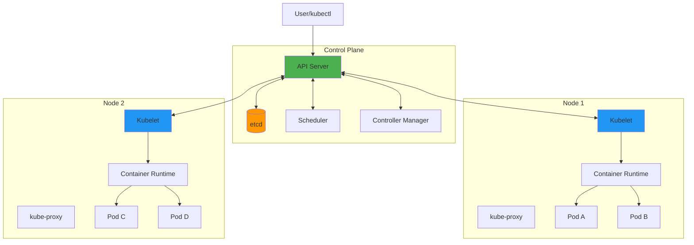
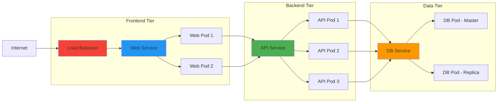

# Kubernetes (K8s)

**Category**: Infrastructure & DevOps

**Definition**: Open-source container orchestration platform that automates deployment, scaling, and management of containerized applications across clusters of machines.

## Overview

Kubernetes (often abbreviated as K8s) is a portable, extensible platform for managing containerized workloads and services. Originally developed by Google and now maintained by the Cloud Native Computing Foundation (CNCF), it has become the de facto standard for container orchestration.

## Key Concepts

### Pods

The smallest deployable unit in Kubernetes - a group of one or more containers:

```yaml
# pod.yaml
apiVersion: v1
kind: Pod
metadata:
  name: web-app
  labels:
    app: web
    environment: production
spec:
  containers:
  - name: nginx
    image: nginx:1.25
    ports:
    - containerPort: 80
    resources:
      requests:
        memory: "128Mi"
        cpu: "100m"
      limits:
        memory: "256Mi"
        cpu: "200m"
    livenessProbe:
      httpGet:
        path: /health
        port: 80
      initialDelaySeconds: 30
      periodSeconds: 10
```

### Deployments

Declarative updates for Pods and ReplicaSets:

```yaml
# deployment.yaml
apiVersion: apps/v1
kind: Deployment
metadata:
  name: api-server
  namespace: production
spec:
  replicas: 3
  selector:
    matchLabels:
      app: api
  strategy:
    type: RollingUpdate
    rollingUpdate:
      maxSurge: 1
      maxUnavailable: 1
  template:
    metadata:
      labels:
        app: api
        version: v1.2.0
    spec:
      containers:
      - name: api
        image: myregistry/api:v1.2.0
        ports:
        - containerPort: 8080
        env:
        - name: DATABASE_URL
          valueFrom:
            secretKeyRef:
              name: db-credentials
              key: url
        - name: ENVIRONMENT
          value: "production"
```

### Services

Stable network endpoint for accessing Pods:

```yaml
# service.yaml
apiVersion: v1
kind: Service
metadata:
  name: api-service
spec:
  type: LoadBalancer
  selector:
    app: api
  ports:
  - protocol: TCP
    port: 80
    targetPort: 8080
  sessionAffinity: ClientIP
```

### ConfigMaps and Secrets

Configuration and sensitive data management:

```yaml
# configmap.yaml
apiVersion: v1
kind: ConfigMap
metadata:
  name: app-config
data:
  app.properties: |
    server.port=8080
    logging.level=INFO
  feature-flags.json: |
    {
      "darkMode": true,
      "betaFeatures": false
    }

---
# secret.yaml
apiVersion: v1
kind: Secret
metadata:
  name: db-credentials
type: Opaque
data:
  username: YWRtaW4=  # base64 encoded
  password: cGFzc3dvcmQ=  # base64 encoded
  url: cG9zdGdyZXM6Ly9kYi5leGFtcGxlLmNvbTo1NDMyL2FwcA==
```

### StatefulSets

For stateful applications (databases, message queues):

```yaml
# statefulset.yaml
apiVersion: apps/v1
kind: StatefulSet
metadata:
  name: postgres
spec:
  serviceName: postgres
  replicas: 3
  selector:
    matchLabels:
      app: postgres
  template:
    metadata:
      labels:
        app: postgres
    spec:
      containers:
      - name: postgres
        image: postgres:15
        ports:
        - containerPort: 5432
        volumeMounts:
        - name: data
          mountPath: /var/lib/postgresql/data
  volumeClaimTemplates:
  - metadata:
      name: data
    spec:
      accessModes: ["ReadWriteOnce"]
      resources:
        requests:
          storage: 10Gi
```

## Kubernetes Architecture



## Service Communication



## Common kubectl Commands

```bash
# Cluster information
kubectl cluster-info
kubectl get nodes

# Working with Pods
kubectl get pods
kubectl get pods -n production
kubectl describe pod <pod-name>
kubectl logs <pod-name>
kubectl logs <pod-name> -f  # Follow logs
kubectl exec -it <pod-name> -- /bin/bash

# Deployments
kubectl get deployments
kubectl create deployment api --image=myapp:v1
kubectl scale deployment api --replicas=5
kubectl rollout status deployment api
kubectl rollout history deployment api
kubectl rollout undo deployment api

# Services
kubectl get services
kubectl expose deployment api --type=LoadBalancer --port=80

# ConfigMaps and Secrets
kubectl create configmap app-config --from-file=config.yaml
kubectl create secret generic db-creds --from-literal=password=secret123
kubectl get secrets
kubectl describe secret db-creds

# Apply manifests
kubectl apply -f deployment.yaml
kubectl apply -f k8s/  # Apply directory
kubectl delete -f deployment.yaml

# Debugging
kubectl describe pod <pod-name>
kubectl get events --sort-by=.metadata.creationTimestamp
kubectl top nodes
kubectl top pods
```

## Namespaces

Logical isolation of resources:

```yaml
# namespace.yaml
apiVersion: v1
kind: Namespace
metadata:
  name: production
  labels:
    environment: production
    team: backend

---
# Use namespace in resources
apiVersion: apps/v1
kind: Deployment
metadata:
  name: api-server
  namespace: production  # Deploy to production namespace
```

```bash
# Working with namespaces
kubectl get namespaces
kubectl create namespace staging
kubectl get pods -n staging
kubectl config set-context --current --namespace=production
```

## Auto-Scaling

### Horizontal Pod Autoscaler (HPA)

```yaml
apiVersion: autoscaling/v2
kind: HorizontalPodAutoscaler
metadata:
  name: api-hpa
spec:
  scaleTargetRef:
    apiVersion: apps/v1
    kind: Deployment
    name: api-server
  minReplicas: 2
  maxReplicas: 10
  metrics:
  - type: Resource
    resource:
      name: cpu
      target:
        type: Utilization
        averageUtilization: 70
  - type: Resource
    resource:
      name: memory
      target:
        type: Utilization
        averageUtilization: 80
```

### Vertical Pod Autoscaler (VPA)

Automatically adjusts CPU and memory requests:

```yaml
apiVersion: autoscaling.k8s.io/v1
kind: VerticalPodAutoscaler
metadata:
  name: api-vpa
spec:
  targetRef:
    apiVersion: apps/v1
    kind: Deployment
    name: api-server
  updatePolicy:
    updateMode: "Auto"
```

## Ingress

HTTP/HTTPS routing to services:

```yaml
apiVersion: networking.k8s.io/v1
kind: Ingress
metadata:
  name: app-ingress
  annotations:
    cert-manager.io/cluster-issuer: letsencrypt-prod
    nginx.ingress.kubernetes.io/ssl-redirect: "true"
spec:
  ingressClassName: nginx
  tls:
  - hosts:
    - api.example.com
    secretName: api-tls
  rules:
  - host: api.example.com
    http:
      paths:
      - path: /
        pathType: Prefix
        backend:
          service:
            name: api-service
            port:
              number: 80
```

## Why Kubernetes is the Industry Standard

### 1. Self-Healing
- Automatically restarts failed containers
- Replaces and reschedules containers when nodes die
- Kills containers that don't respond to health checks

### 2. Auto-Scaling
- Horizontal Pod Autoscaler (scale Pods)
- Vertical Pod Autoscaler (adjust resources)
- Cluster Autoscaler (add/remove nodes)

### 3. Load Balancing
- Distributes network traffic across Pods
- Service discovery via DNS
- Multiple load balancing strategies

### 4. Rolling Updates & Rollbacks
```bash
# Rolling update
kubectl set image deployment/api api=myapp:v2
kubectl rollout status deployment/api

# Rollback if issues
kubectl rollout undo deployment/api
```

### 5. Resource Management
- CPU and memory limits/requests
- Quality of Service (QoS) classes
- Resource quotas per namespace

### 6. Multi-Cloud Portability
- Runs on AWS (EKS), Azure (AKS), GCP (GKE)
- On-premises with kubeadm, Rancher, OpenShift
- Local development with Minikube, kind, k3s

## SpecWeave Integration

### Tracking Kubernetes Deployments

**Increment Planning**:
```markdown
## Increment 0015: Kubernetes Migration

### User Stories
- US-001: Deploy API service to K8s cluster (P1)
- US-002: Set up auto-scaling (P1)
- US-003: Configure Ingress with SSL (P2)
- US-004: Migrate database to StatefulSet (P2)

### Tasks
- T-001: Create K8s manifests (Deployment, Service, ConfigMap)
- T-002: Set up Horizontal Pod Autoscaler
- T-003: Configure NGINX Ingress Controller
- T-004: Apply manifests and verify deployment

### Acceptance Criteria
- AC-US1-01: API pods running and healthy (3 replicas)
- AC-US1-02: Service accessible via LoadBalancer
- AC-US2-01: HPA scales from 2 to 10 based on CPU
- AC-US3-01: HTTPS enabled with Let's Encrypt certificate
```

**Test Plan** (embedded in tasks):
```markdown
## T-001: Create Kubernetes Manifests

**Test Cases**:
- Unit: YAML syntax validation with `kubeval`
- Integration: `kubectl apply --dry-run=client`
- E2E: Deploy to staging cluster, verify health checks

**Validation**:
```bash
# Validate manifests
kubeval k8s/*.yaml

# Dry-run apply
kubectl apply -f k8s/ --dry-run=client

# Apply to staging
kubectl apply -f k8s/ -n staging

# Verify deployment
kubectl get pods -n staging
kubectl describe deployment api-server -n staging

# Check health
kubectl get pods -n staging -l app=api
# All pods should be Running with Ready 1/1
```
```

### Living Documentation

After K8s deployment, update architecture docs:

```bash
# Sync deployment architecture
/specweave:sync-docs update

# Results in:
# - Updated HLD with K8s architecture diagram
# - ADR: "Why We Chose Kubernetes Over Docker Swarm"
# - Runbook: "How to Scale API Service in Production"
# - Operations guide: "Troubleshooting Pod CrashLoopBackOff"
```

### Example ADR

```markdown
# ADR-015: Kubernetes for Container Orchestration

## Status
Accepted

## Context
Need container orchestration for 20+ microservices with auto-scaling.

## Decision
Use Kubernetes (EKS on AWS)

## Alternatives Considered
- Docker Swarm: Simpler but limited features
- ECS: AWS-specific, vendor lock-in
- Nomad: Good but smaller community

## Rationale
- Industry standard (98% of Fortune 500)
- Auto-scaling, self-healing
- Multi-cloud portability
- Huge ecosystem (Helm, operators)

## Consequences
- Learning curve for team (2-week training)
- Cluster management overhead
- Cost: ~$150/month for control plane (EKS)
```

## Best Practices

### 1. Resource Limits
```yaml
# Always set requests and limits
containers:
- name: api
  resources:
    requests:
      memory: "256Mi"
      cpu: "250m"
    limits:
      memory: "512Mi"
      cpu: "500m"
```

### 2. Health Checks
```yaml
livenessProbe:
  httpGet:
    path: /health
    port: 8080
  initialDelaySeconds: 30
  periodSeconds: 10

readinessProbe:
  httpGet:
    path: /ready
    port: 8080
  initialDelaySeconds: 10
  periodSeconds: 5
```

### 3. Labels and Selectors
```yaml
metadata:
  labels:
    app: api-server
    version: v1.2.0
    environment: production
    team: backend
    increment: "0015-k8s-migration"
```

### 4. Use Helm for Complex Applications
```bash
# Install with Helm (package manager for K8s)
helm repo add bitnami https://charts.bitnami.com/bitnami
helm install my-postgres bitnami/postgresql

# Custom values
helm install api ./charts/api-server -f values-production.yaml
```

### 5. GitOps with ArgoCD
```yaml
# Application manifest for ArgoCD
apiVersion: argoproj.io/v1alpha1
kind: Application
metadata:
  name: api-server
spec:
  project: default
  source:
    repoURL: https://github.com/myorg/k8s-manifests
    targetRevision: main
    path: apps/api-server
  destination:
    server: https://kubernetes.default.svc
    namespace: production
  syncPolicy:
    automated:
      prune: true
      selfHeal: true
```

## Common Pitfalls

### ImagePullBackOff
```bash
# Problem: Can't pull container image
# Causes: Wrong image name, private registry without secrets

# Solution: Create registry secret
kubectl create secret docker-registry regcred \
  --docker-server=myregistry.com \
  --docker-username=user \
  --docker-password=pass

# Use in Pod spec
spec:
  imagePullSecrets:
  - name: regcred
```

### CrashLoopBackOff
```bash
# Problem: Container keeps crashing
# Debug:
kubectl describe pod <pod-name>
kubectl logs <pod-name>
kubectl logs <pod-name> --previous  # Logs from crashed container
```

### Resource Exhaustion
```bash
# Problem: Pods can't be scheduled
# Check node resources:
kubectl describe nodes
kubectl top nodes

# Check Pod resource requests:
kubectl describe pod <pod-name> | grep -A 5 "Requests:"
```

## Local Development

### Minikube
```bash
# Start local cluster
minikube start --driver=docker --cpus=4 --memory=8192

# Enable addons
minikube addons enable ingress
minikube addons enable metrics-server

# Deploy and test
kubectl apply -f k8s/
minikube service api-service  # Opens in browser
```

### kind (Kubernetes in Docker)
```bash
# Create cluster
kind create cluster --name dev

# Load local image
kind load docker-image myapp:latest --name dev
```

## Related Concepts

- [Docker](/docs/glossary/terms/docker) - Container platform (what K8s orchestrates)
- [Terraform](/docs/glossary/terms/terraform) - IaC for K8s cluster provisioning
- Helm - Package manager for Kubernetes
- [CI/CD](/docs/glossary/terms/ci-cd) - Automated deployment to K8s
- [Microservices](/docs/glossary/terms/microservices) - Architecture pattern K8s enables
- Service Mesh - Advanced networking for K8s

## Resources

- [Official Documentation](https://kubernetes.io/docs/)
- [Kubernetes Patterns (Book)](https://k8spatterns.io/)
- [kubectl Cheat Sheet](https://kubernetes.io/docs/reference/kubectl/cheatsheet/)
- [Kubernetes the Hard Way](https://github.com/kelseyhightower/kubernetes-the-hard-way)

---

**Last Updated**: 2025-11-04
**Category**: Infrastructure & DevOps
