# Living Documentation

**Living Documentation** is documentation that stays automatically synchronized with your codebase and project state. Unlike traditional static documentation that becomes outdated, living docs are updated automatically through hooks, automation, and bidirectional sync with external systems.

---

## The Problem with Traditional Documentation

Traditional documentation has a fatal flaw: **it dies the moment you write it**.


**Why traditional docs fail**:
- ❌ Manual updates required (often forgotten)
- ❌ No validation (docs can lie)
- ❌ Drift from code (code changes, docs don't)
- ❌ No source of truth (multiple versions)
- ❌ Low trust (team knows docs are stale)

---

## Living Documentation: The Solution

**Living docs stay alive** through three key mechanisms:


### 1. Auto-Update After Tasks

**SpecWeave's post-task-completion hook** automatically updates living docs:

```bash
# Complete any task
# → Hook fires automatically
# → Living docs sync in background
# → Zero manual intervention
```

### 2. Bidirectional Sync

Changes flow **both ways**:

```
Local (.specweave/) ↔ External (GitHub/JIRA/ADO)
```

**Example**:
- Task completed in SpecWeave → GitHub issue updated
- GitHub issue closed → SpecWeave increment updated

### 3. Validation

Living docs are **validated on every sync**:
- AC-ID coverage (all acceptance criteria documented)
- Test coverage targets (85-90%)
- Link integrity (no broken references)
- Content classification (correct folder placement)

---

## Living Docs Structure in SpecWeave

### Permanent Knowledge Base

**Location**: `.specweave/docs/internal/`

```
.specweave/docs/internal/
├── strategy/              # Business rationale (PRDs, vision)
├── specs/                 # Feature specifications (permanent)
│   └── spec-001-auth.md   # ALL user stories for authentication
├── architecture/          # Technical design (HLD, ADR)
│   ├── adr/               # Architecture Decision Records
│   └── diagrams/          # System diagrams
├── delivery/              # Build & release (roadmap, DORA)
├── operations/            # Production ops (runbooks, SLOs)
└── governance/            # Policies (security, compliance)
```

**Key Principle**: Specs use **3-digit numbers** (spec-001, spec-002) for **feature areas**.

### Temporary Implementation Tracker

**Location**: `.specweave/increments/####-name/`

```
.specweave/increments/0008-user-authentication/
├── spec.md                # Subset of work (this iteration only)
├── plan.md                # Implementation approach
└── tasks.md               # Task checklist with tests
```

**Key Principle**: Increments use **4-digit numbers** (0001, 0002) for **implementations**.

---

## Living Docs Sync Flow

```mermaid
sequenceDiagram
    participant Dev as Developer
    participant Task as Task Completion
    participant Hook as Post-Task Hook
    participant Living as Living Docs
    participant External as GitHub/JIRA/ADO

    Dev->>Task: Complete T-001
    Task->>Hook: Trigger hook
    Hook->>Living: 1. Sync increment → specs
    Living->>Living: 2. Validate AC-IDs
    Living->>Living: 3. Check test coverage
    Hook->>External: 4. Update external tracker
    External->>Hook: 5. Confirm sync
    Hook->>Dev: ✅ All docs synced
```



### Step-by-Step Example

**1. Complete Task**:
```bash
# Developer marks task complete in tasks.md
- [x] T-001: Implement password hashing (AC-US1-02)
```

**2. Hook Fires Automatically**:
```bash
# Hook: plugins/specweave/hooks/post-task-completion.sh
# Runs sync-living-docs.js automatically
```

**3. Living Docs Updated**:
```bash
# Before (living docs):
.specweave/docs/internal/specs/spec-001-authentication.md
## US-001: User Login
Status: Planning

# After (living docs):
.specweave/docs/internal/specs/spec-001-authentication.md
## US-001: User Login
Status: Complete ✅
Implemented: Increment 0008
Test Coverage: 90% (target: 85%)
```

**4. External Tracker Synced**:
```bash
# GitHub issue updated automatically:
- [x] T-001: Implement password hashing

Progress: 1/5 tasks (20%)
```

---

## Intelligent Living Docs Sync

Intelligent mode automatically classifies and distributes content to correct folders.

### Simple Mode vs Intelligent Mode

| Aspect | Simple Mode | Intelligent Mode |
|--------|-------------|------------------|
| **Output** | One file (spec-001.md) | Multiple files (9 categories) |
| **Classification** | None | 9-category system |
| **Project Detection** | None | Auto-detects (backend/frontend) |
| **Cross-Linking** | Manual | Automatic |
| **Docusaurus** | Manual frontmatter | Auto-generated |
| **Size** | 5,000+ lines | 200-500 lines per file |

### 9-Category Classification

```mermaid
graph TB
    A[Parse spec.md] --> B{Classify Content}
    B --> C1[User Story → specs/]
    B --> C2[NFR → specs/nfr/]
    B --> C3[Architecture → architecture/]
    B --> C4[ADR → architecture/adr/]
    B --> C5[Operations → operations/]
    B --> C6[Delivery → delivery/]
    B --> C7[Strategy → strategy/]
    B --> C8[Governance → governance/]
    B --> C9[Overview → specs/]
```



**Example: Before/After Intelligent Sync**

**Before (Simple Mode)**:
```
.specweave/docs/internal/specs/spec-001-authentication.md (5,000 lines)
- User stories
- Architecture diagrams
- ADRs
- Runbooks
- Test strategy
- Business requirements
(All mixed together)
```

**After (Intelligent Mode)**:
```
.specweave/docs/internal/
├── specs/backend/
│   ├── us-001-user-login.md              (User Story)
│   ├── us-002-session-management.md      (User Story)
│   └── _archive/spec-001-authentication.md (Original preserved)
├── architecture/
│   ├── authentication-flow.md            (HLD)
│   └── adr/0001-oauth-vs-jwt.md          (ADR)
├── operations/
│   ├── runbook-auth-service.md           (Runbook)
│   └── slo-auth-availability.md          (SLO)
├── delivery/
│   └── test-strategy-authentication.md   (Test Strategy)
└── strategy/
    └── auth-business-requirements.md     (Business Requirements)
```

---

## User Story Files: COPIED ACs and Tasks

**NEW**: User Story files in living docs now contain **COPIED** Acceptance Criteria (ACs) and implementation tasks from increment, not just references.

### Why COPIED Instead of References?

**Traditional Approach** (References):
```markdown
# specs/backend/FS-031/us-001-authentication.md

## Acceptance Criteria
See [increment spec.md](../../../increments/0031/spec.md#us-001)

## Implementation
See [increment tasks.md](../../../increments/0031/tasks.md)
```

**Problems**:
- ❌ Breaks when increment is archived
- ❌ Requires navigation to multiple files
- ❌ Not self-contained
- ❌ Poor readability

**SpecWeave Approach** (COPIED):
```markdown
# specs/backend/FS-031/us-001-authentication.md

## Acceptance Criteria (COPIED from increment spec.md, filtered by backend)
- [x] AC-US1-01: JWT token generation (backend)
- [ ] AC-US1-02: Protected routes (backend)

## Implementation (COPIED tasks from increment tasks.md, filtered by AC-ID)
- [x] T-001: Setup JWT service
- [ ] T-002: Create login API endpoint
```

**Benefits**:
- ✅ Self-contained documentation
- ✅ Survives increment archiving
- ✅ Project-specific filtering (backend vs frontend)
- ✅ GitHub integration (checkable checkboxes)

---

### User Story File Structure

**Complete Example** (`specs/backend/FS-031/us-001-authentication.md`):

```markdown
---
id: us-001-authentication-backend
title: "US-001: Implement Authentication (Backend)"
sidebar_label: "Authentication (Backend)"
description: "Implement backend authentication using JWT tokens"
tags: ["user-story", "backend", "authentication", "FS-031"]
increment: "0031-external-tool-status-sync"
project: "backend"
category: "user-story"
priority: "P1"
status: "in-progress"
---

# US-001: Implement Authentication (Backend)

**Feature**: [FS-031: External Tool Status Sync](../../_features/FS-031/FEATURE.md)
**Epic** (if exists): [Epic-123: Authentication System](../../_epics/epic-123.md)

---

## Description

Implement backend authentication using JWT tokens, including token generation,
validation, and protected route middleware.

---

## Acceptance Criteria (COPIED from increment spec.md, filtered by backend)

- [x] **AC-US1-01**: JWT token generation (backend) (P1)
  - Generate secure JWT tokens on successful login
  - Include user ID and role in token payload
  - Set appropriate expiration time (24 hours)

- [ ] **AC-US1-02**: Protected routes (backend) (P1)
  - Middleware validates JWT token
  - Unauthorized requests return 401
  - Token expiration handled correctly

---

## Implementation (COPIED tasks from increment tasks.md, filtered by AC-ID)

### JWT Token Generation (AC-US1-01)
- [x] **T-001**: Setup JWT service
- [ ] **T-002**: Create login API endpoint

### Protected Routes (AC-US1-02)
- [ ] **T-005**: Create auth middleware
- [ ] **T-006**: Apply middleware to protected routes

---

## Technical Notes

- Using `jsonwebtoken` library (v9.0.0)
- Token secret stored in environment variable
- RS256 algorithm for token signing

---

**Status**: In Progress (50% complete)
**Last Updated**: 2025-11-16
**Increment**: [0031-external-tool-status-sync](../../../increments/0031/)
```

---

### Filtering Logic: Project-Specific Tasks

User Stories are **project-specific** (organized by `specs/backend/`, `specs/frontend/`, `specs/mobile/`). Tasks are filtered to match:

**Source (Increment)** - All tasks for ALL projects:
```markdown
# .specweave/increments/0031/spec.md
## US-001: Implement Authentication
**Acceptance Criteria**:
- AC-US1-01: JWT token generation (backend)
- AC-US1-02: Protected routes (backend)
- AC-US1-03: Login form component (frontend)
- AC-US1-04: Protected routes (frontend)

# .specweave/increments/0031/tasks.md
- [x] **T-001**: Setup JWT service (AC-US1-01)
- [ ] **T-002**: Create login API endpoint (AC-US1-01)
- [ ] **T-003**: Build login form component (AC-US1-03)
- [ ] **T-004**: Add route protection HOC (AC-US1-04)
```

**Destination (Backend User Story)** - Only backend ACs and tasks:
```markdown
# specs/backend/FS-031/us-001-authentication.md

## Acceptance Criteria (COPIED, filtered by "backend" keyword)
- [x] AC-US1-01: JWT token generation (backend)
- [ ] AC-US1-02: Protected routes (backend)

## Implementation (COPIED, filtered by AC-ID)
- [x] T-001: Setup JWT service (AC-US1-01)
- [ ] T-002: Create login API endpoint (AC-US1-01)
```

**Destination (Frontend User Story)** - Only frontend ACs and tasks:
```markdown
# specs/frontend/FS-031/us-001-authentication.md

## Acceptance Criteria (COPIED, filtered by "frontend" keyword)
- [ ] AC-US1-03: Login form component (frontend)
- [ ] AC-US1-04: Protected routes (frontend)

## Implementation (COPIED, filtered by AC-ID)
- [ ] T-003: Build login form component (AC-US1-03)
- [ ] T-004: Add route protection HOC (AC-US1-04)
```

**Learn More**: [Project-Specific Tasks](/docs/glossary/terms/project-specific-tasks), [COPIED ACs and Tasks](/docs/glossary/terms/copied-acs-and-tasks)

---

### Three-Layer Bidirectional Sync

COPIED content stays synchronized through the [Three-Layer Architecture](/docs/glossary/terms/three-layer-architecture):

```
Layer 1: GitHub Issue (checkable checkboxes)
    ↕ (bidirectional)
Layer 2: Living Docs User Story (COPIED ACs and tasks)
    ↕ (bidirectional)
Layer 3: Increment (source of truth)
    - spec.md (for ACs)
    - tasks.md (for tasks)
```

**Example Flow 1: Developer → GitHub**:
```
1. Developer completes task in increment tasks.md: [x] T-001
2. Living docs sync copies to User Story: [x] T-001
3. GitHub sync updates issue subtask: [x] T-001
```

**Example Flow 2: Stakeholder → Increment**:
```
1. Stakeholder checks GitHub subtask: [x] T-002
2. GitHub sync updates User Story: [x] T-002
3. Living docs sync updates increment tasks.md: [x] T-002
```

**Learn More**: [Bidirectional Sync](/docs/glossary/terms/bidirectional-sync#three-layer-bidirectional-sync)

---

### GitHub Integration with COPIED Content

COPIED content becomes **checkable checkboxes** in GitHub issues:

**GitHub Issue** (from User Story):
```markdown
# US-001: Implement Authentication (Backend)

**Feature**: [FS-031: External Tool Status Sync](link)
**User Story**: [us-001-authentication.md](link)

## Acceptance Criteria
(Synced bidirectionally: GitHub ↔ Living Docs ↔ Increment spec.md)

- [x] AC-US1-01: JWT token generation (backend)
- [ ] AC-US1-02: Protected routes (backend)

## Subtasks
(Synced bidirectionally: GitHub ↔ Living Docs ↔ Increment tasks.md)

- [x] T-001: Setup JWT service
- [ ] T-002: Create login API endpoint

---

**Progress**: 50% (1/2 ACs, 1/2 Subtasks)
```

**Benefits**:
- ✅ Stakeholders can check/uncheck boxes in GitHub
- ✅ No repository access needed
- ✅ Changes sync back to increment (source of truth)
- ✅ Mobile-friendly progress tracking

---

## Configuration

**Enable Living Docs Sync** (`.specweave/config.json`):

```json
{
  "hooks": {
    "post_task_completion": {
      "sync_living_docs": true,        // ✅ Enable auto-sync
      "sync_tasks_md": true,           // ✅ Update tasks.md
      "external_tracker_sync": true    // ✅ Sync to GitHub/JIRA/ADO
    }
  },
  "livingDocs": {
    "intelligent": {
      "enabled": true,                 // ✅ Use intelligent mode
      "splitByCategory": true,         // ✅ Classify content
      "generateCrossLinks": true,      // ✅ Auto-link related docs
      "preserveOriginal": true,        // ✅ Keep original spec
      "classificationConfidenceThreshold": 0.6,
      "fallbackProject": "default"
    }
  }
}
```

---

## Project Detection (Multi-Project Support)

Intelligent sync auto-detects which project (backend/frontend/mobile) content belongs to:

### Detection Signals

| Signal | Score | Example |
|--------|-------|---------|
| **Frontmatter** | +20 | `project: backend` |
| **Increment ID** | +10 | `0016-backend-auth` |
| **Team Name** | +5 | `team: backend-team` |
| **Keywords** | +3 each | `backend`, `api`, `service` |
| **Tech Stack** | +2 each | `Node.js`, `PostgreSQL` |

**Example Detection**:

```yaml
---
title: User Authentication
project: backend    # ← +20 points (explicit)
---

# User Authentication

Implement OAuth for **backend services** using Node.js...
# Keywords: backend (+3), service (+3), Node.js (+2) = +8
# Total: 20 + 8 = 28 points → 100% confidence → "backend" project
```

---

## Docusaurus Frontmatter (Auto-Generated)

Every distributed file gets **rich frontmatter** for LLM context:

```yaml
---
id: us-001-user-login
title: "US-001: User Login"
sidebar_label: "User Login"
description: "User can log in with email and password"
tags: ["user-story", "backend", "authentication"]
increment: "0016-authentication"
project: "backend"                    # ← LLM knows which project
category: "user-story"                # ← LLM knows document type
last_updated: "2025-11-10"
status: "planning"
priority: "P1"
---
```

**Benefits**:
- ✅ **LLM Context**: AI assistants understand project/category
- ✅ **Docusaurus Ready**: Works out-of-the-box
- ✅ **Navigation**: Sidebar generation
- ✅ **Search**: Better search results
- ✅ **Traceability**: Links to increment

---

## Cross-Linking (Bidirectional)

Intelligent sync generates **automatic cross-links** between related documents:

```markdown
## Related Documents

### Implements
- [Authentication Architecture](../../architecture/auth-flow.md)

### References
- [ADR-001: OAuth vs JWT](../../architecture/adr/0001-oauth-vs-jwt.md)

### Defined In
- [Business Requirements](../../strategy/auth-requirements.md)

### Related To
- [US-002: Session Management](./us-002-session-management.md)
```

**Link Types**:
1. **Implements**: User story implements architecture
2. **References**: References ADR or design doc
3. **Defined In**: Defined in PRD or strategy doc
4. **Related To**: Related to other user stories

---

## Specs vs Increments (Two Locations Explained)

**The Core Question**: Why does SpecWeave have specs in TWO locations?

### Living Docs Specs = Permanent Knowledge Base

**Location**: `.specweave/docs/internal/specs/default/spec-001-core-framework.md`

**Purpose**: COMPLETE, PERMANENT source of truth for entire feature area

**Lifecycle**: Created once, updated over time, NEVER deleted

**Scope**: Comprehensive feature area (10-50 user stories)

**Contains**:
- ✅ ALL user stories for the feature area (across multiple increments)
- ✅ ALL acceptance criteria for those user stories
- ✅ Implementation history (which increments implemented which parts)
- ✅ Links to brownfield documentation (existing project docs)
- ✅ External PM tool links (GitHub Project, Jira Epic, ADO Feature)
- ✅ Architecture decisions rationale (ADRs)
- ✅ Success criteria & metrics for the feature area

### Increment Specs = Temporary Implementation Tracker

**Location**: `.specweave/increments/0001-core-framework/spec.md`

**Purpose**: TEMPORARY implementation reference (what am I building THIS iteration?)

**Lifecycle**: Created per increment, can be deleted after completion

**Scope**: Focused subset (3-5 user stories for this increment only)

**Contains**:
- ✅ Reference to living docs: `"See: SPEC-001-core-framework"`
- ✅ Subset of user stories: `"Implements: US-001, US-002, US-003 only"`
- ✅ What's being implemented RIGHT NOW (this iteration)
- ✅ Out of scope: Lists what's NOT in this increment (deferred to future)

### Real-World Example

**Living Docs Spec** (Permanent):
```markdown
File: .specweave/docs/internal/specs/default/spec-001-core-framework.md

# SPEC-001: Core Framework & Architecture

## Increments (Implementation History)
- 0001-core-framework: MVP CLI (Complete)
- 0002-core-enhancements: Context optimization (Complete)
- 0004-plugin-architecture: Claude native plugins (Complete)

## User Stories (35 total across all increments)
- US-001: NPM installation (0001) ✅
- US-003: Context optimization (0002) ✅
- US-005: Plugin system (0004) ✅
... (32 more stories)
```

**Increment Spec** (Temporary):
```markdown
File: .specweave/increments/0001-core-framework/spec.md

# Increment 0001: Core Framework MVP

**Implements**: SPEC-001 (US-001 to US-002 only)
**Complete Specification**: See ../../docs/internal/specs/default/spec-001.md

## What We're Implementing (This Increment Only)
- US-001: NPM installation + CLI basics ✅

## Out of Scope (For This Increment)
- ❌ Context optimization (US-003) → Increment 0002
- ❌ Plugin system (US-005) → Increment 0004
```

### Analogy: Wikipedia vs Sticky Notes

- **Living Docs Specs** = 📚 Wikipedia Article (permanent, comprehensive)
- **Increment Specs** = 📝 Sticky Note Reminder (temporary, focused, disposable)

---

## Benefits of Living Documentation

### 1. Always Accurate

Traditional docs are often outdated. Living docs are **always accurate** because they're auto-synced:

```bash
# Traditional docs (manual):
Code changes → Developer forgets to update docs → Docs outdated

# Living docs (automatic):
Code changes → Hook fires → Docs synced automatically → Always accurate
```

### 2. Zero Manual Work

Developers never manually update living docs:

```bash
# Complete task
- [x] T-001: Implement password hashing

# Hook fires automatically:
# ✅ Living docs synced
# ✅ GitHub issue updated
# ✅ Test coverage validated
# ✅ AC-IDs checked

# Developer: Zero manual work!
```

### 3. Single Source of Truth

Living docs are the **permanent source of truth**:

```
SpecWeave (.specweave/docs/internal/) = Source of Truth
External tools (GitHub, JIRA, ADO) = Mirrors
```

### 4. Complete History

Living docs preserve **complete implementation history**:

```markdown
## SPEC-001: Core Framework

## Implementation History
- 2025-09-01: 0001-core-framework (US-001 to US-002) ✅
- 2025-09-15: 0002-core-enhancements (US-003 to US-004) ✅
- 2025-10-01: 0004-plugin-architecture (US-005 to US-006) ✅

## What Was Built
- US-001: NPM installation (Increment 0001) ✅
- US-002: CLI basics (Increment 0001) ✅
- US-003: Context optimization (Increment 0002) ✅
- US-004: Smart caching (Increment 0002) ✅
- US-005: Plugin marketplace (Increment 0004) ✅
- US-006: Plugin loader (Increment 0004) ✅
```

### 5. Onboarding New Developers

New developers can **read living docs** to understand the project:

```bash
# New developer joins team
# Reads: .specweave/docs/internal/specs/spec-001-core-framework.md

# Learns:
# - What was built (35 user stories)
# - Why decisions were made (ADRs)
# - How to use the system (architecture docs)
# - What tests exist (test coverage)

# Result: Productive in hours, not weeks
```

---

## Manual Sync (When Automatic Sync Disabled)

If automatic sync is disabled, you can manually sync:

```bash
# Sync all completed increments to living docs
/specweave:sync-docs update

# Or copy manually (emergency only):
cp .specweave/increments/0001-core-framework/spec.md \
   .specweave/docs/internal/specs/spec-001-core-framework.md
```

---

## Verification

**Check Living Docs Are Synced**:

```bash
# List all synced specs
ls -1 .specweave/docs/internal/specs/spec-*.md

# Should match number of completed increments
ls -1 .specweave/increments/ | grep -E '^[0-9]{4}' | wc -l

# Check intelligent sync distribution
ls -1 .specweave/docs/internal/specs/*/us-*.md
ls -1 .specweave/docs/internal/architecture/adr/*.md
```

---

## When to Use Living Docs

### ✅ Good Fits for Living Docs

- **Feature specifications**: Complete user story documentation
- **Architecture decisions**: ADRs that evolve over time
- **API contracts**: Endpoints, schemas, versioning
- **Runbooks**: Production operations procedures
- **Test strategies**: Coverage targets, test plans
- **Business requirements**: PRDs, vision statements

### ❌ Not Suitable for Living Docs

- **Temporary notes**: Session summaries, scratch work
- **Prototypes**: Throwaway exploration
- **Draft content**: Not-yet-approved specifications
- **Meeting notes**: Unstructured discussions

---

## Living Docs Anti-Patterns

### 1. Manual Updates

```bash
# ❌ Bad: Manual updates to living docs
vim .specweave/docs/internal/specs/spec-001.md
# (Changes get overwritten by next sync)

# ✅ Good: Update increment spec, let sync handle it
vim .specweave/increments/0001-core-framework/spec.md
# Hook syncs automatically to living docs
```

### 2. Duplicate Content

```bash
# ❌ Bad: Same content in multiple places
.specweave/increments/0001/spec.md (5,000 lines)
.specweave/docs/internal/specs/spec-001.md (5,000 lines, duplicate)

# ✅ Good: Increment references living docs
.specweave/increments/0001/spec.md (500 lines, focused)
.specweave/docs/internal/specs/spec-001.md (5,000 lines, complete)
```

### 3. Outdated External Links

```bash
# ❌ Bad: Manual links that break
GitHub: https://github.com/owner/repo/issues/123 (closed)
Living docs: Still references old issue

# ✅ Good: Bidirectional sync keeps links fresh
GitHub issue closed → Hook updates living docs → Link removed
```

---

## Related Terms

- [Specs](/docs/glossary/terms/specs) - Specifications (permanent knowledge base)
- [Increments](/docs/glossary/terms/increments) - Temporary implementation tracker
- [Bidirectional Sync](/docs/glossary/terms/bidirectional-sync) - Two-way synchronization
- [Intelligent Living Docs Sync](/docs/glossary/terms/intelligent-living-docs-sync) - Content classification
- [Source of Truth](/docs/glossary/terms/source-of-truth) - Single source of truth principle
- [User Stories](/docs/glossary/terms/user-stories) - User story format
- [AC-ID](/docs/glossary/terms/ac-id) - Acceptance criteria identifiers

---

## Summary

**Living Documentation** stays synchronized automatically through:
1. **Auto-update hooks** (post-task-completion)
2. **Bidirectional sync** (Local ↔ External)
3. **Validation** (AC-IDs, test coverage, links)

**Two Locations**:
- **Living docs** (`.specweave/docs/internal/specs/`) = Permanent knowledge base
- **Increment specs** (`.specweave/increments/####/`) = Temporary implementation tracker

**Intelligent Mode**:
- 9-category classification
- Project detection (backend/frontend)
- Auto-generated frontmatter
- Cross-linking

**Result**: Documentation that **never dies** because it's **always alive**.
