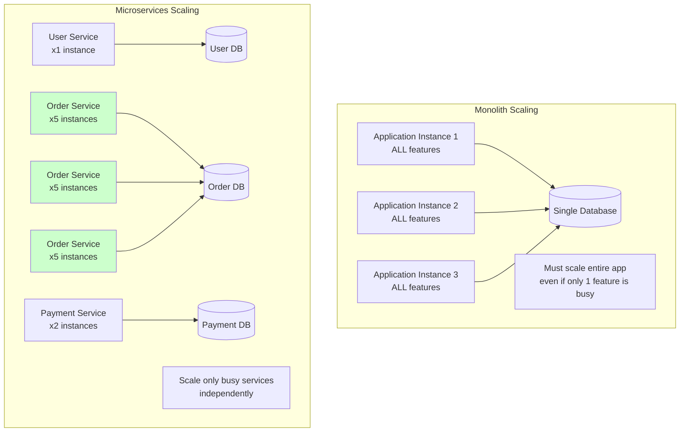
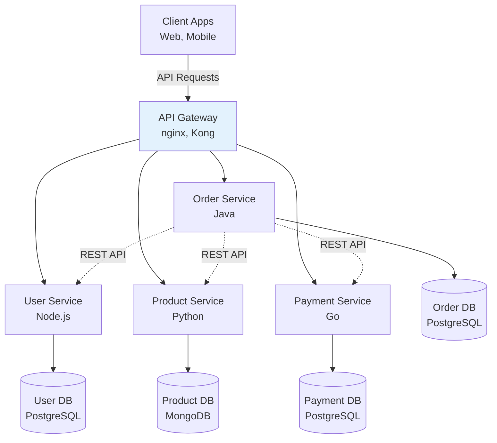
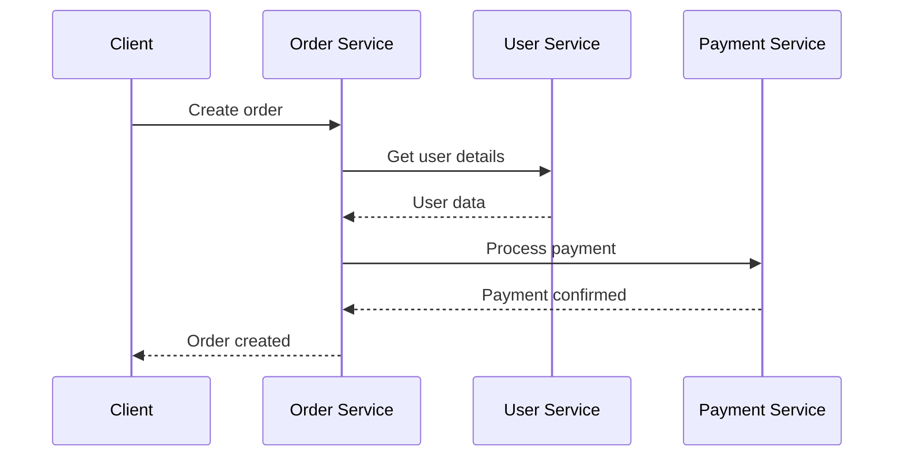
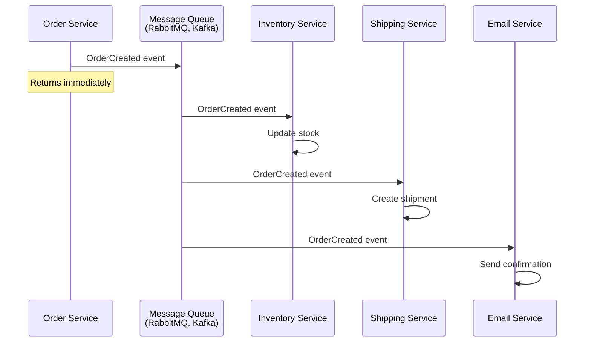
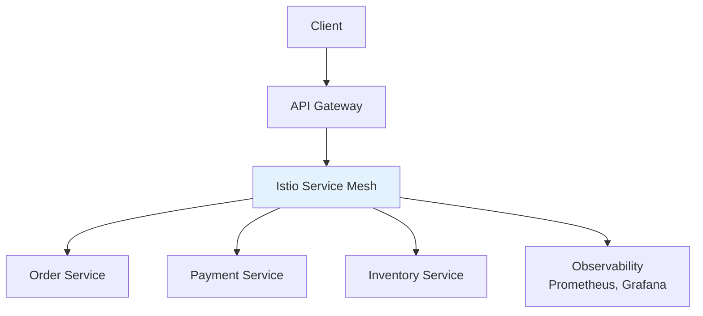

# Microservices

## Definition

**Microservices** is an architectural style where an application is built as a collection of small, independent services that each run in their own process and communicate via lightweight protocols (usually HTTP/REST or gRPC).

Think of it as **"specialized restaurants in a food court"** - instead of one big kitchen doing everything (monolith), you have separate stations: pizza, sushi, burgers. Each focuses on one thing, operates independently, but together they serve the whole food court.

## What Problem Does It Solve?

### The Problem: Monolithic Applications Scale Poorly

**Scenario**: Your e-commerce application grows from 10K to 10M users.

**Monolith Approach** (single application):

```
┌─────────────────────────────────────────┐
│         Single Application              │
│  ┌────────────────────────────────────┐ │
│  │ User Management                    │ │
│  │ Product Catalog                    │ │
│  │ Order Processing                   │ │
│  │ Payment Processing                 │ │
│  │ Inventory Management               │ │
│  │ Shipping & Tracking                │ │
│  └────────────────────────────────────┘ │
└─────────────────────────────────────────┘
         ↓
    One Database
```

**Problems**:
- Scaling: Must scale entire app (even if only orders are busy)
- Deployment: Change one line → redeploy everything → high risk
- Technology lock-in: Entire app must use same language/framework
- Team coordination: All teams work in same codebase → merge conflicts
- Failure impact: Bug in one feature crashes entire app

**Microservices Solution**:

```
┌────────────┐  ┌────────────┐  ┌────────────┐
│   User     │  │  Product   │  │   Order    │
│  Service   │  │  Service   │  │  Service   │
└────────────┘  └────────────┘  └────────────┘
      ↓               ↓               ↓
  User DB       Product DB       Order DB

┌────────────┐  ┌────────────┐  ┌────────────┐
│  Payment   │  │ Inventory  │  │  Shipping  │
│  Service   │  │  Service   │  │  Service   │
└────────────┘  └────────────┘  └────────────┘
      ↓               ↓               ↓
 Payment DB      Inventory DB    Shipping DB
```

**Benefits**:
- Scale independently (scale only busy services)
- Deploy independently (change orders → deploy only order service)
- Technology flexibility (each service can use different stack)
- Team autonomy (teams own their services)
- Fault isolation (payment fails → orders still work)

### Why Microservices Matter



## How It Works

### Microservices Architecture



### Service Communication

**Synchronous** (Request-Response):



**Asynchronous** (Event-Driven):



## Real-World Examples

### Example 1: E-Commerce Platform

**Services**:

```
User Service          - Authentication, profiles
Product Service       - Catalog, search, recommendations
Order Service         - Order creation, status tracking
Payment Service       - Payment processing, refunds
Inventory Service     - Stock management
Shipping Service      - Shipment tracking, delivery
Email Service         - Notifications, receipts
Analytics Service     - Reports, insights
```

**Order Flow**:

```javascript
// Order Service (Node.js + Express)
app.post('/orders', async (req, res) => {
  const { userId, items, paymentInfo } = req.body;

  // 1. Validate user (call User Service)
  const user = await fetch(`http://user-service/users/${userId}`);
  if (!user.ok) return res.status(404).json({ error: 'User not found' });

  // 2. Check inventory (call Inventory Service)
  const stockCheck = await fetch('http://inventory-service/check', {
    method: 'POST',
    body: JSON.stringify({ items })
  });
  if (!stockCheck.ok) return res.status(400).json({ error: 'Out of stock' });

  // 3. Process payment (call Payment Service)
  const payment = await fetch('http://payment-service/charge', {
    method: 'POST',
    body: JSON.stringify(paymentInfo)
  });
  if (!payment.ok) return res.status(400).json({ error: 'Payment failed' });

  // 4. Create order (local database)
  const order = await db.orders.create({ userId, items, status: 'pending' });

  // 5. Publish OrderCreated event (async)
  await publishEvent('OrderCreated', order);

  res.status(201).json(order);
});
```

### Example 2: Netflix-Style Architecture

**Netflix uses ~700 microservices**:

```
Frontend Service      - Web UI
Mobile API Service    - Mobile app API
User Profile Service  - User preferences, watch history
Content Service       - Movie/show metadata
Recommendation Service - AI-powered recommendations
Streaming Service     - Video delivery
Search Service        - ElasticSearch-based search
Payment Service       - Subscriptions, billing
Analytics Service     - View tracking, metrics
```

### Example 3: Uber Architecture

**Uber's microservices**:

```
Rider Service         - Rider app, requests
Driver Service        - Driver app, availability
Matching Service      - Match riders with drivers
Pricing Service       - Surge pricing, estimates
Payment Service       - Payment processing
Notification Service  - Push notifications, SMS
Map Service           - Routing, ETA calculation
Trip Service          - Trip tracking, history
```

## How SpecWeave Uses Microservices

### 1. Multi-Service Increments

**SpecWeave supports increments spanning multiple services**:

```markdown
## Increment 0010: Checkout Flow

### Affected Services
- order-service (create order endpoint)
- payment-service (payment processing)
- inventory-service (stock deduction)
- email-service (confirmation email)

### Tasks
- T-001: order-service - Create order endpoint
- T-002: payment-service - Add payment webhook
- T-003: inventory-service - Implement stock reservation
- T-004: email-service - Order confirmation template
- T-005: Integration tests (all services)
```

### 2. Service-Level Documentation

**Each service can have its own docs**:

```
my-ecommerce-platform/
├── .specweave/                    # System-wide specs
│   ├── increments/
│   │   └── 0010-checkout-flow/
│   │       ├── spec.md            # Cross-service feature spec
│   │       ├── plan.md            # System-wide architecture
│   │       └── tasks.md           # Tasks across all services
│   └── docs/
│       ├── internal/
│       │   └── architecture/
│       │       ├── service-mesh.md
│       │       └── api-contracts.md
│       └── public/
│
├── services/
│   ├── order-service/
│   │   ├── src/
│   │   ├── tests/
│   │   └── README.md              # Service-specific docs
│   ├── payment-service/
│   └── inventory-service/
```

### 3. API Contract Testing

**SpecWeave tracks inter-service contracts**:

```yaml
# .specweave/docs/internal/architecture/contracts/order-payment.yaml
contract:
  consumer: order-service
  provider: payment-service
  endpoint: POST /payments
  request:
    schema:
      amount: number
      currency: string
      orderId: string
  response:
    schema:
      transactionId: string
      status: enum[success, failed]
  tests:
    - name: successful payment
      given: valid payment info
      when: POST /payments
      then: status 200 + transactionId
```

### 4. Service Mesh Integration

**SpecWeave can integrate with service meshes**:



## Microservices vs Monolith

### When to Use Microservices

Use Microservices when:
- Large team (50+ developers)
- High scale requirements (millions of users)
- Different scaling needs per feature (orders busy, profile not)
- Need technology flexibility (Python for ML, Go for performance)
- Fast deployment cadence (deploy 10x/day)

Use Monolith when:
- Small team (less than 10 developers)
- Simple application (CRUD, low traffic)
- Rapid prototyping (MVP, startup)
- Limited DevOps resources
- Unclear domain boundaries

### Trade-offs

| Aspect | Monolith | Microservices |
|--------|----------|---------------|
| **Complexity** | Low | High |
| **Deployment** | Simple (one app) | Complex (many apps) |
| **Scaling** | Scale entire app | Scale per service |
| **Team Size** | Small teams (1-10) | Large teams (50+) |
| **Technology** | Single stack | Mixed stacks |
| **Testing** | Easy (one codebase) | Hard (integration tests) |
| **Performance** | Fast (in-process) | Slower (network calls) |
| **DevOps** | Simple | Complex (orchestration) |
| **Cost** | Low | High (infrastructure) |

**[Learn More: Monolith →](/docs/glossary/terms/monolith)**

## Best Practices

### 1. Service Boundaries

**Design around business capabilities**, not technical layers:

```
Good (Business Capabilities):
- User Service (authentication, profiles)
- Order Service (order creation, tracking)
- Payment Service (billing, refunds)

Bad (Technical Layers):
- Controller Service
- Business Logic Service
- Data Access Service
```

### 2. Database Per Service

**Each service owns its data**:

```
Order Service     → Order DB (only Order Service accesses)
Payment Service   → Payment DB (only Payment Service accesses)

Never: Order Service → Payment DB (violates encapsulation!)
```

### 3. API Gateway

**Single entry point** for clients:

```
Client → API Gateway → Order Service
                    → Payment Service
                    → User Service
```

**Benefits**: Authentication, rate limiting, routing, API versioning.

### 4. Circuit Breaker Pattern

**Prevent cascade failures**:

```javascript
// If Payment Service is down, fail fast (don't wait)
const circuitBreaker = new CircuitBreaker(async () => {
  return await fetch('http://payment-service/charge');
}, {
  timeout: 3000,        // 3s timeout
  errorThreshold: 50,   // Open circuit if 50% fail
  resetTimeout: 30000   // Try again after 30s
});

try {
  const result = await circuitBreaker.fire();
} catch (error) {
  // Payment service down, return friendly error
  return { error: 'Payment temporarily unavailable' };
}
```

### 5. Observability

**Monitor everything**:

- Distributed tracing (Jaeger, Zipkin)
- Centralized logging (ELK, Splunk)
- Metrics (Prometheus, Grafana)
- Health checks (liveness, readiness)

## Common Mistakes

### Mistake 1: Too Many Services

**Problem**: 100 microservices for small team = chaos.

**Solution**: Start with monolith, split when team/scale requires it.

### Mistake 2: Shared Database

**Problem**: Multiple services share one database = coupling.

**Solution**: Database per service (use events for data sync).

### Mistake 3: Distributed Monolith

**Problem**: Services tightly coupled (all must deploy together).

**Solution**: Loose coupling via events, independent deployments.

### Mistake 4: No API Gateway

**Problem**: Clients call services directly = tight coupling.

**Solution**: API Gateway for routing, auth, rate limiting.

## Related Terms

- **[Monolith](/docs/glossary/terms/monolith)** - Alternative architecture (single application)
- **API Gateway** - Entry point for microservices
- **[REST](/docs/glossary/terms/rest)** - Common communication protocol
- **[Kubernetes](/docs/glossary/terms/kubernetes)** - Container orchestration for microservices
- **[Docker](/docs/glossary/terms/docker)** - Containerization for services
- **Backend** - Microservices are backend architecture

## Learn More

- **[Microservices Patterns](https://microservices.io/patterns/)** - Martin Fowler's patterns
- **[Building Microservices Book](https://www.oreilly.com/library/view/building-microservices-2nd/9781492034018/)** - Comprehensive guide
- **SpecWeave Microservices Guide** - Building microservices with SpecWeave

---

**Category**: Architecture & Design

**Tags**: `#microservices` `#architecture` `#distributed-systems` `#backend` `#scalability`
