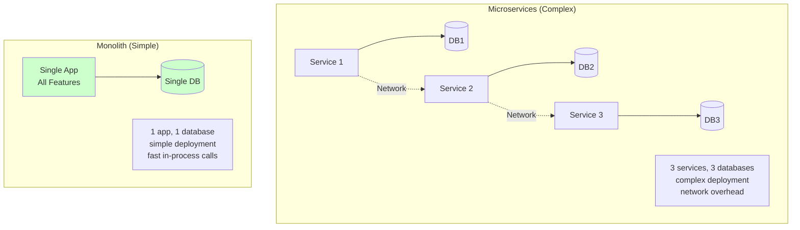
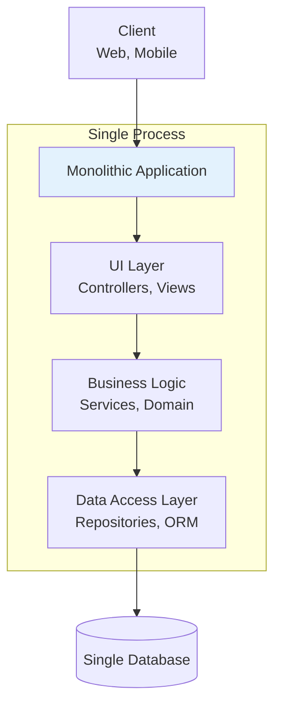

# Monolith

## Definition

A **Monolith** is a software architecture where an entire application is built as a single, unified codebase that runs as one process. All features, modules, and components are tightly integrated and deployed together.

Think of it as **"a Swiss Army knife"** - one tool with many features built in. Everything works together, shares the same resources, and you carry it all or nothing.

## What Problem Does It Solve?

### The Problem: Complexity in Distributed Systems

**Scenario**: You're building a new startup MVP (Minimum Viable Product).

**Microservices Approach** (distributed system):

```
┌───────────┐  ┌───────────┐  ┌───────────┐
│   User    │  │  Product  │  │   Order   │
│  Service  │  │  Service  │  │  Service  │
└───────────┘  └───────────┘  └───────────┘
      ↓              ↓              ↓
  User DB      Product DB      Order DB
```

**Problems for small teams**:
- Complex deployment (3 services, 3 databases, orchestration)
- Distributed debugging (logs spread across services)
- Network overhead (services call each other)
- DevOps burden (service discovery, load balancing, monitoring)
- Over-engineering for simple use cases

**Monolith Solution**:

```
┌─────────────────────────────────┐
│      Single Application         │
│  ┌───────────────────────────┐  │
│  │ User Management           │  │
│  │ Product Catalog           │  │
│  │ Order Processing          │  │
│  └───────────────────────────┘  │
└─────────────────────────────────┘
              ↓
         Single Database
```

**Benefits**:
- Simple deployment (one app, one database)
- Easy debugging (all logs in one place)
- Fast in-process calls (no network overhead)
- Low DevOps burden (just run the app)
- Perfect for MVPs and small teams

### Why Monoliths Matter



## How It Works

### Monolith Architecture



**Key Characteristics**:
- Single codebase (one repository)
- Single deployment unit (one artifact)
- Single process (runs as one application)
- Single database (shared data store)
- Tight coupling (modules call each other directly)

### Code Structure Example

```
my-ecommerce-app/           # Monolith
├── src/
│   ├── controllers/        # HTTP handlers
│   │   ├── UserController.ts
│   │   ├── ProductController.ts
│   │   └── OrderController.ts
│   ├── services/           # Business logic
│   │   ├── UserService.ts
│   │   ├── ProductService.ts
│   │   └── OrderService.ts
│   ├── models/             # Database models
│   │   ├── User.ts
│   │   ├── Product.ts
│   │   └── Order.ts
│   └── app.ts              # Main entry point
├── database/
│   └── schema.sql          # Single database schema
└── package.json            # Single dependency file
```

## Real-World Examples

### Example 1: Traditional MVC Application

**Ruby on Rails monolith**:

```ruby
# app/controllers/orders_controller.rb
class OrdersController < ApplicationController
  def create
    # All in-process calls (fast!)
    user = User.find(params[:user_id])
    product = Product.find(params[:product_id])

    # Business logic
    order = Order.create(
      user: user,
      product: product,
      total: product.price * params[:quantity]
    )

    # Payment processing (in same app)
    PaymentService.charge(order)

    # Email notification (in same app)
    OrderMailer.confirmation(order).deliver_later

    render json: order
  end
end

# Everything runs in ONE Rails application
```

### Example 2: Node.js Express Monolith

**Simple e-commerce API**:

```javascript
// server.js (single entry point)
const express = require('express');
const app = express();

// All routes in one app
app.use('/api/users', require('./routes/users'));
app.use('/api/products', require('./routes/products'));
app.use('/api/orders', require('./routes/orders'));

// routes/orders.js
const OrderService = require('../services/OrderService');
const PaymentService = require('../services/PaymentService');

router.post('/', async (req, res) => {
  // All services in same process
  const order = await OrderService.create(req.body);
  const payment = await PaymentService.charge(order);

  // Fast in-process calls (no network overhead)
  res.json({ order, payment });
});

// One database connection
const db = require('./database');

// Start single server
app.listen(3000, () => {
  console.log('Monolith running on port 3000');
});
```

### Example 3: Django Monolith

**Blog platform**:

```python
# myproject/settings.py (single configuration)
INSTALLED_APPS = [
    'users',       # User management
    'posts',       # Blog posts
    'comments',    # Comments
    'analytics',   # Analytics
]

# posts/views.py
from users.models import User
from comments.models import Comment
from analytics.services import track_view

def create_post(request):
    # All imports from same codebase
    user = User.objects.get(id=request.user.id)
    post = Post.objects.create(
        author=user,
        title=request.POST['title'],
        content=request.POST['content']
    )

    # In-process call (fast!)
    track_view(post)

    return JsonResponse({'post': post.to_dict()})

# One Django app, one database
```

## How SpecWeave Uses Monoliths

### 1. Monolith Project Structure

**SpecWeave works great with monolithic projects**:

```
my-monolith-app/
├── .specweave/                    # SpecWeave folder
│   ├── increments/
│   │   └── 0007-user-auth/
│   │       ├── spec.md            # Feature spec
│   │       ├── plan.md            # Implementation plan
│   │       └── tasks.md           # Tasks with tests
│   └── docs/
│       ├── internal/
│       │   └── architecture/
│       │       ├── hld-system.md  # Monolith architecture
│       │       └── adr/
│       │           └── 0001-monolith-first.md
│       └── public/
│
├── src/                           # Application code
│   ├── controllers/
│   ├── services/
│   ├── models/
│   └── app.ts
├── tests/
└── database/
```

### 2. Increments for Monolith Features

**Example increment**:

```markdown
## Increment 0007: User Authentication

### Affected Modules
- controllers/AuthController.ts (new)
- services/UserService.ts (modify)
- models/User.ts (add password hash field)
- middleware/auth.ts (new JWT middleware)

### Tasks
- T-001: Add password hashing to User model
- T-002: Create AuthController with login/logout
- T-003: Implement JWT middleware
- T-004: Add authentication tests (unit + integration)
- T-005: Update API documentation

### Tests
- Unit: Password hashing, JWT generation
- Integration: Login endpoint, protected routes
- E2E: Complete login flow in browser
```

### 3. Modular Monolith Pattern

**SpecWeave recommends modular monoliths** (best of both worlds):

```
my-modular-monolith/
├── .specweave/
├── src/
│   ├── modules/                  # Loosely coupled modules
│   │   ├── users/                # User module (could be extracted later)
│   │   │   ├── controllers/
│   │   │   ├── services/
│   │   │   ├── models/
│   │   │   └── index.ts
│   │   ├── products/             # Product module
│   │   │   ├── controllers/
│   │   │   ├── services/
│   │   │   ├── models/
│   │   │   └── index.ts
│   │   └── orders/               # Order module
│   │       ├── controllers/
│   │       ├── services/
│   │       ├── models/
│   │       └── index.ts
│   └── app.ts                    # Single entry point
└── database/                     # Single database (for now)
```

**Benefits**:
- Start with monolith (simple)
- Modular structure (easy to split later if needed)
- Fast in-process calls (performance)
- Can extract to microservices when team/scale requires it

### 4. Migration Path to Microservices

**SpecWeave tracks migration from monolith to microservices**:

```markdown
## ADR-015: Extract Order Service to Microservice

### Context
Orders module has grown to 50% of codebase and needs independent scaling.

### Decision
Extract orders module to separate microservice while keeping other modules in monolith.

### Migration Plan
1. Create new order-service repository
2. Copy orders module code
3. Expose REST API from order-service
4. Update monolith to call order-service API
5. Migrate order database to separate instance
6. Deploy both applications
7. Monitor for 2 weeks
8. Remove orders module from monolith
```

## Monolith vs Microservices

### When to Use Monolith

Use Monolith when:
- Small team (1-10 developers)
- Early-stage startup (MVP, unclear requirements)
- Simple domain (CRUD operations, low complexity)
- Low to medium traffic (up to 100K users)
- Limited DevOps resources (no Kubernetes expert)
- Fast iteration needed (prototype, validate product-market fit)

Use Microservices when:
- Large team (50+ developers)
- Clear domain boundaries (well-understood business)
- High scale requirements (millions of users)
- Different scaling needs per feature
- Strong DevOps team (Kubernetes, service mesh)
- Mature product (proven business model)

### Trade-offs Comparison

| Aspect | Monolith | Microservices |
|--------|----------|---------------|
| **Initial Complexity** | Low | High |
| **Development Speed** | Fast (MVP) | Slow (infrastructure) |
| **Deployment** | Simple (one app) | Complex (many apps) |
| **Debugging** | Easy (one codebase) | Hard (distributed) |
| **Performance** | Fast (in-process) | Slower (network calls) |
| **Scaling** | Vertical (bigger server) | Horizontal (more instances) |
| **Team Size** | Small (1-10) | Large (50+) |
| **Technology** | Single stack | Mixed stacks |
| **Cost** | Low (one server) | High (many servers) |
| **Maintenance** | Easy (one codebase) | Complex (many codebases) |

**[Learn More: Microservices →](/docs/glossary/terms/microservices)**

## Best Practices

### 1. Modular Structure

**Organize by feature, not by layer**:

```
Good (Feature-Based):
src/
├── users/
│   ├── controllers/
│   ├── services/
│   └── models/
├── products/
└── orders/

Bad (Layer-Based):
src/
├── controllers/    # All controllers mixed
├── services/       # All services mixed
└── models/         # All models mixed
```

### 2. Clear Module Boundaries

**Modules should communicate via interfaces**:

```typescript
// orders/OrderService.ts
import { UserService } from '../users/UserService';

class OrderService {
  constructor(private userService: UserService) {}

  async createOrder(userId: string, items: Item[]) {
    // Use interface, not direct database access
    const user = await this.userService.findById(userId);

    // Create order...
  }
}
```

### 3. Avoid "Big Ball of Mud"

**Don't let monolith become unmaintainable**:

```
Bad Signs:
- Everything depends on everything
- No clear module boundaries
- 10,000-line files
- Impossible to test in isolation

Good Practices:
- Clear module separation
- Dependency injection
- Interface-based communication
- Unit tests per module
```

### 4. Plan for Extraction

**Design modules that COULD be extracted later**:

```typescript
// Design each module as if it could become a microservice
// users/index.ts (module interface)
export class UsersModule {
  // Public API (could become REST endpoints)
  async findUser(id: string): Promise<User> { ... }
  async createUser(data: CreateUserDto): Promise<User> { ... }

  // Private methods (internal only)
  private validateUser(data: any) { ... }
}
```

### 5. Shared Database with Care

**Use database schemas for logical separation**:

```sql
-- PostgreSQL schemas for logical separation
CREATE SCHEMA users;
CREATE SCHEMA products;
CREATE SCHEMA orders;

-- Users module uses users schema
CREATE TABLE users.accounts (...);

-- Products module uses products schema
CREATE TABLE products.catalog (...);

-- Orders module uses orders schema
CREATE TABLE orders.orders (...);
```

## Common Mistakes

### Mistake 1: Premature Microservices

**Problem**: Building microservices before understanding domain.

**Solution**: Start with monolith, extract services when needed.

### Mistake 2: No Module Boundaries

**Problem**: Everything calls everything (spaghetti code).

**Solution**: Clear module structure with defined interfaces.

### Mistake 3: Ignoring Performance

**Problem**: Treating monolith as "legacy" and neglecting optimization.

**Solution**: Monoliths can be VERY fast (no network overhead). Optimize them!

### Mistake 4: Not Planning for Growth

**Problem**: Monolith becomes unmaintainable as team grows.

**Solution**: Use modular monolith pattern from the start.

## Related Terms

- **[Microservices](/docs/glossary/terms/microservices)** - Alternative architecture
- **Backend** - Monoliths are backend architecture
- **[API](/docs/glossary/terms/api)** - Monoliths expose APIs
- **[REST](/docs/glossary/terms/rest)** - Common API style for monoliths
- **[Node.js](/docs/glossary/terms/nodejs)** - Popular runtime for Node.js monoliths
- **Modular Monolith** - Hybrid approach

## Learn More

- **[Monolith First](https://martinfowler.com/bliki/MonolithFirst.html)** - Martin Fowler's advice
- **[Modular Monolith Architecture](https://www.kamilgrzybek.com/blog/posts/modular-monolith-primer)** - Best practices
- **[The Majestic Monolith](https://m.signalvnoise.com/the-majestic-monolith/)** - DHH's defense of monoliths
- **SpecWeave Monolith Guide** - Building monoliths with SpecWeave

---

**Category**: Architecture & Design

**Tags**: `#monolith` `#architecture` `#backend` `#mvc` `#simplicity`
