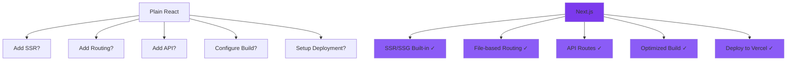
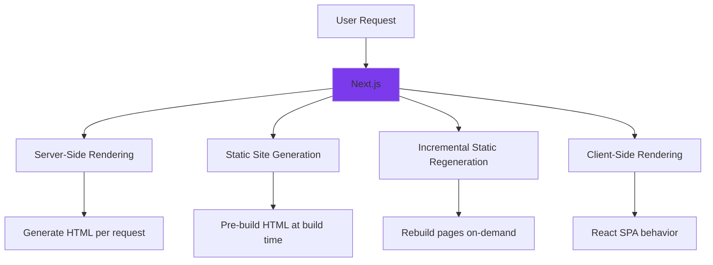
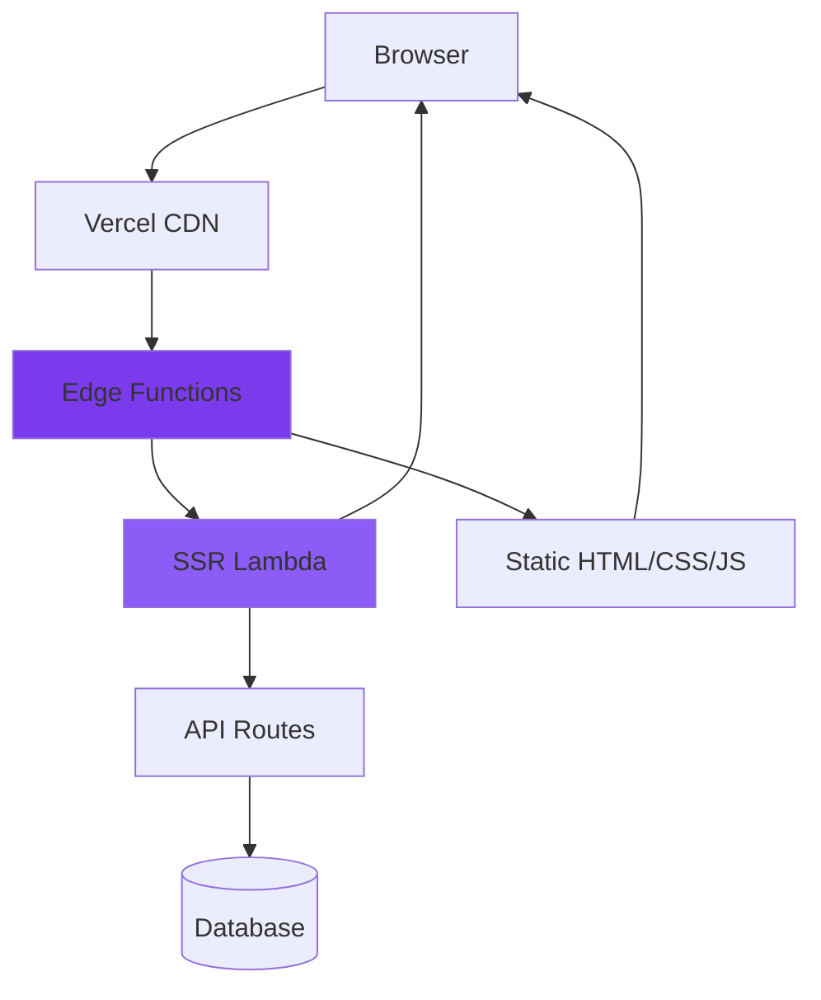

# Next.js

## Definition

**Next.js** is a React framework that adds essential production features like server-side rendering (SSR), static site generation (SSG), API routes, and automatic code splitting.

Think of it as **"React with superpowers"** - everything you need to build production-ready web apps, batteries included.

## What Problem Does It Solve?

### The Problem: Plain React Has Limitations

**Scenario**: You build a blog with plain React (Create React App).

**Problems**:
- ❌ **SEO**: Google can't index your content (client-side rendering)
- ❌ **Performance**: Large JavaScript bundle = slow first load
- ❌ **Routing**: Need to install and configure React Router
- ❌ **Backend**: Need separate Express server for API
- ❌ **Deployment**: Complex setup with CDN, server, etc.

**With Next.js**: All solved out of the box!

### Why Next.js Matters



## How It Works

### Rendering Strategies



### Next.js Architecture



## Core Features

### 1. File-Based Routing

**No router configuration needed!**

```
pages/
├── index.js          → /
├── about.js          → /about
├── blog/
│   ├── index.js      → /blog
│   └── [slug].js     → /blog/:slug (dynamic)
└── api/
    └── users.js      → /api/users
```

**Example - Dynamic Route**:

```jsx
// pages/blog/[slug].js
export default function BlogPost({ post }) {
  return (
    <article>
      <h1>{post.title}</h1>
      <p>{post.content}</p>
    </article>
  );
}

// Fetch data at build time (SSG)
export async function getStaticProps({ params }) {
  const post = await fetch(`/api/posts/${params.slug}`).then(r => r.json());
  return { props: { post } };
}

// Generate paths at build time
export async function getStaticPaths() {
  const posts = await fetch('/api/posts').then(r => r.json());
  const paths = posts.map(post => ({ params: { slug: post.slug } }));
  return { paths, fallback: false };
}
```

### 2. Server-Side Rendering (SSR)

**Generate HTML per request**:

```jsx
// pages/dashboard.js
export default function Dashboard({ user, posts }) {
  return (
    <div>
      <h1>Welcome, {user.name}!</h1>
      <PostsList posts={posts} />
    </div>
  );
}

// Runs on server per request
export async function getServerSideProps(context) {
  const { req } = context;
  const userId = req.cookies.userId;

  const user = await fetchUser(userId);
  const posts = await fetchUserPosts(userId);

  return {
    props: { user, posts }
  };
}
```

**Use SSR when**:
- ✅ Content changes frequently (user dashboards, real-time data)
- ✅ Need access to request data (cookies, headers)
- ✅ Must be fresh on every page load

### 3. Static Site Generation (SSG)

**Pre-build HTML at build time**:

```jsx
// pages/blog/index.js
export default function BlogIndex({ posts }) {
  return (
    <div>
      <h1>Blog</h1>
      {posts.map(post => (
        <article key={post.id}>
          <h2>{post.title}</h2>
          <Link href={`/blog/${post.slug}`}>Read more</Link>
        </article>
      ))}
    </div>
  );
}

// Runs at build time
export async function getStaticProps() {
  const posts = await fetch('https://api.example.com/posts').then(r => r.json());

  return {
    props: { posts },
    revalidate: 60 // ISR: Rebuild every 60 seconds
  };
}
```

**Use SSG when**:
- ✅ Content doesn't change often (blog posts, documentation)
- ✅ Can be pre-rendered (doesn't depend on user)
- ✅ Need maximum performance (served from CDN)

### 4. API Routes

**Built-in backend API**:

```javascript
// pages/api/users.js
export default async function handler(req, res) {
  if (req.method === 'GET') {
    const users = await db.users.findMany();
    res.status(200).json(users);
  }

  if (req.method === 'POST') {
    const user = await db.users.create({ data: req.body });
    res.status(201).json(user);
  }
}
```

**Features**:
- ✅ Same codebase as frontend
- ✅ Serverless functions (no server management)
- ✅ Automatic API routes

### 5. Image Optimization

**Automatic image optimization**:

```jsx
import Image from 'next/image';

export default function Profile() {
  return (
    <Image
      src="/profile.jpg"
      alt="Profile"
      width={500}
      height={500}
      priority // Load immediately
    />
  );
}
```

**Benefits**:
- ✅ Automatic WebP/AVIF conversion
- ✅ Lazy loading
- ✅ Responsive images
- ✅ CDN optimization

## Real-World Examples

### Example 1: Blog with SSG + ISR

```jsx
// pages/blog/[slug].js
export default function BlogPost({ post }) {
  return (
    <article>
      <h1>{post.title}</h1>
      <time>{post.publishedAt}</time>
      <div>{post.content}</div>
    </article>
  );
}

// SSG: Pre-build all blog posts
export async function getStaticProps({ params }) {
  const post = await getPost(params.slug);

  return {
    props: { post },
    revalidate: 3600 // ISR: Rebuild every hour
  };
}

// Generate paths at build time
export async function getStaticPaths() {
  const posts = await getAllPosts();
  const paths = posts.map(post => ({ params: { slug: post.slug } }));

  return {
    paths,
    fallback: 'blocking' // Generate new pages on-demand
  };
}
```

### Example 2: E-Commerce with SSR

```jsx
// pages/products/[id].js
export default function ProductPage({ product, recommendations }) {
  return (
    <div>
      <ProductDetails product={product} />
      <AddToCart productId={product.id} />
      <Recommendations products={recommendations} />
    </div>
  );
}

// SSR: Personalized recommendations
export async function getServerSideProps({ params, req }) {
  const product = await getProduct(params.id);
  const userId = req.cookies.userId;
  const recommendations = await getPersonalizedRecommendations(userId, product);

  return {
    props: { product, recommendations }
  };
}
```

### Example 3: Dashboard with CSR

```jsx
// pages/dashboard.js
import { useEffect, useState } from 'react';

export default function Dashboard() {
  const [data, setData] = useState(null);

  // Client-side data fetching (CSR)
  useEffect(() => {
    fetch('/api/dashboard')
      .then(r => r.json())
      .then(setData);
  }, []);

  if (!data) return <div>Loading...</div>;

  return (
    <div>
      <h1>Dashboard</h1>
      <Stats data={data.stats} />
      <Charts data={data.charts} />
    </div>
  );
}
```

## Rendering Strategy Comparison

```mermaid
graph TB
    subgraph "SSG (Static Site Generation)"
        SSGBuild[Build Time] --> SSGFiles[Static HTML Files]
        SSGFiles --> SSGCDN[CDN]
        SSGCDN --> SSGUser[User - Instant Load]
    end

    subgraph "SSR (Server-Side Rendering)"
        SSRRequest[User Request] --> SSRServer[Server]
        SSRServer --> SSRGenerate[Generate HTML]
        SSRGenerate --> SSRUser[User - Fresh Content]
    end

    subgraph "CSR (Client-Side Rendering)"
        CSRRequest[User Request] --> CSRServer[Server]
        CSRServer --> CSREmpty[Empty HTML + JS]
        CSREmpty --> CSRBrowser[Browser Renders]
        CSRBrowser --> CSRUser[User - Slowest]
    end

    style SSGFiles fill:#00ff00
    style SSRGenerate fill:#ffff00
    style CSRBrowser fill:#ff0000
```



### When to Use Each?

| Strategy | Best For | Example |
|----------|----------|---------|
| **SSG** | Static content, blogs, marketing | Blog posts, landing pages |
| **SSG + ISR** | Frequently updated content | E-commerce product pages |
| **SSR** | Personalized content, auth | User dashboards, admin panels |
| **CSR** | Highly interactive, real-time | Chat apps, collaborative editors |

## How SpecWeave Uses Next.js

### 1. Next.js Project Structure

```
my-nextjs-app/
├── .specweave/
│   ├── increments/
│   │   └── 0001-setup-nextjs/
│   │       ├── spec.md
│   │       ├── plan.md
│   │       └── tasks.md
│   └── docs/
│       └── internal/
│           └── architecture/
│               ├── rendering-strategy.md
│               └── adr/
│                   └── 0001-nextjs-over-react.md
├── pages/
│   ├── index.js
│   ├── _app.js
│   └── api/
├── components/
├── public/
└── next.config.js
```

### 2. Planning Next.js Features

**Increment spec**:

```markdown
# Increment 0012: Product Catalog (SSG + ISR)

## User Stories

**US-001**: Product listing page
- [ ] AC-US1-01: Display all products with SSG
- [ ] AC-US1-02: Rebuild every 5 minutes (ISR)
- [ ] AC-US1-03: CDN-optimized images

**US-002**: Product detail page
- [ ] AC-US2-01: Dynamic routes `/products/[id]`
- [ ] AC-US2-02: Pre-render top 100 products
- [ ] AC-US2-03: Fallback: blocking for new products

## Architecture

**Rendering Strategy**: SSG + ISR
- Build time: Generate top 100 products
- Runtime: Generate new products on-demand
- Revalidate: Every 5 minutes

**Performance Targets**:
- First Contentful Paint (FCP): < 1s
- Time to Interactive (TTI): < 2s
- Lighthouse Score: 95+
```

### 3. Next.js + SpecWeave Workflow

```mermaid
graph TB
    A[/specweave:increment "Product Catalog"] --> B[PM: Choose Rendering Strategy]
    B --> C[Architect: Design SSG + ISR]
    C --> D[/specweave:do]
    D --> E[Implement Pages]
    E --> F[Configure next.config.js]
    F --> G[Test Performance]
    G --> H[/specweave:done]

    style B fill:#7c3aed
    style C fill:#8b5cf6
```

## Next.js vs Plain React

### Create React App vs Next.js

| Feature | Create React App | Next.js |
|---------|-----------------|---------|
| **Routing** | Manual (React Router) | File-based (built-in) |
| **SSR** | ❌ None | ✅ Built-in |
| **SSG** | ❌ None | ✅ Built-in |
| **API** | ❌ Need separate server | ✅ API routes |
| **SEO** | ❌ Poor (client-only) | ✅ Excellent |
| **Performance** | ❌ Large bundles | ✅ Code splitting |
| **Deployment** | ❌ Manual | ✅ Vercel (one command) |
| **Image Optimization** | ❌ Manual | ✅ Automatic |

### When to Use Next.js?

**✅ Use Next.js**:
- Public-facing websites (SEO matters)
- E-commerce (performance critical)
- Blogs, documentation (static content)
- Landing pages (marketing)
- Dashboards (SSR for personalization)

**❌ Use Plain React**:
- Internal admin tools (no SEO needed)
- Single-page apps (fully client-side)
- Electron desktop apps
- React Native mobile apps

## Next.js 13+ (App Router)

### New Features

**App Router vs Pages Router**:

```
Old (Pages Router):
pages/
├── index.js          # Server + client
└── api/users.js      # API route

New (App Router):
app/
├── page.js           # React Server Component
├── layout.js         # Shared layout
└── api/
    └── route.js      # API route
```

**React Server Components**:

```jsx
// app/posts/page.js (Server Component - default)
export default async function PostsPage() {
  const posts = await fetch('https://api.example.com/posts').then(r => r.json());

  return (
    <div>
      {posts.map(post => (
        <PostCard key={post.id} post={post} />
      ))}
    </div>
  );
}
```

**Benefits**:
- ✅ Zero JavaScript sent to client (server components)
- ✅ Faster page loads
- ✅ Better SEO
- ✅ Streaming (show content as it loads)

## Performance Optimization

### 1. Code Splitting

**Automatic**:

```jsx
// Next.js automatically splits code per page
// pages/dashboard.js only loads when visiting /dashboard
```

**Manual (Dynamic Imports)**:

```jsx
import dynamic from 'next/dynamic';

const HeavyChart = dynamic(() => import('../components/HeavyChart'), {
  loading: () => <p>Loading chart...</p>,
  ssr: false // Don't render on server
});

export default function Analytics() {
  return <HeavyChart data={data} />;
}
```

### 2. Image Optimization

```jsx
import Image from 'next/image';

<Image
  src="/hero.jpg"
  alt="Hero"
  width={1200}
  height={600}
  priority // Load immediately
  placeholder="blur" // Show blur while loading
/>
```

### 3. Font Optimization

```jsx
// next.config.js
module.exports = {
  optimizeFonts: true // Automatic font optimization
};
```

### 4. Incremental Static Regeneration (ISR)

```jsx
export async function getStaticProps() {
  const data = await fetchData();

  return {
    props: { data },
    revalidate: 60 // Rebuild every 60 seconds
  };
}
```

## Deployment

### Vercel (Recommended)

```bash
# Install Vercel CLI
npm i -g vercel

# Deploy
vercel

# Production deployment
vercel --prod
```

**Features**:
- ✅ Automatic SSL
- ✅ Global CDN
- ✅ Preview deployments (per PR)
- ✅ Analytics
- ✅ Zero config

### Other Platforms

| Platform | SSG | SSR | API Routes |
|----------|-----|-----|------------|
| **Vercel** | ✅ | ✅ | ✅ |
| **Netlify** | ✅ | ✅ | ✅ (Functions) |
| **AWS Amplify** | ✅ | ✅ | ❌ |
| **Cloudflare Pages** | ✅ | ✅ | ✅ (Workers) |
| **Static Host (S3)** | ✅ | ❌ | ❌ |

## Best Practices

### ✅ Do

1. **Use SSG by default** (fastest)
2. **Use ISR for frequently updated content**
3. **Use SSR only when needed** (personalization, auth)
4. **Optimize images** with `next/image`
5. **Use TypeScript** for type safety
6. **Analyze bundle size** (`next build --analyze`)

### ❌ Don't

1. **Don't fetch data client-side** if SSG/SSR can do it
2. **Don't use plain `` tags** (use `next/image`)
3. **Don't put sensitive data in public/** (exposed to client)
4. **Don't ignore bundle size** (use dynamic imports)
5. **Don't skip TypeScript** (Next.js has excellent TS support)

## Common Mistakes

### ❌ Mistake 1: Wrong Rendering Strategy

```jsx
// ❌ WRONG - Using SSR for static blog
export async function getServerSideProps() {
  const post = await fetchBlogPost();
  return { props: { post } };
}

// ✅ CORRECT - Use SSG
export async function getStaticProps() {
  const post = await fetchBlogPost();
  return { props: { post } };
}
```

### ❌ Mistake 2: Not Using Image Component

```jsx
// ❌ WRONG - No optimization


// ✅ CORRECT - Automatic optimization
<Image src="/hero.jpg" alt="Hero" width={1200} height={600} />
```

### ❌ Mistake 3: Client-Side Fetching for Static Content

```jsx
// ❌ WRONG - Blog posts don't need client-side fetching
useEffect(() => {
  fetch('/api/posts').then(r => r.json()).then(setPosts);
}, []);

// ✅ CORRECT - Pre-render at build time
export async function getStaticProps() {
  const posts = await fetch('/api/posts').then(r => r.json());
  return { props: { posts } };
}
```

## Related Terms

- **[React](/docs/glossary/terms/react)** - JavaScript library Next.js is built on
- **[SSR](/docs/glossary/terms/ssr)** - Server-side rendering
- **[SSG](/docs/glossary/terms/ssg)** - Static site generation
- **[SPA](/docs/glossary/terms/spa)** - Single page application
- **[TypeScript](/docs/glossary/terms/typescript)** - Often used with Next.js
- **Frontend** - Client-side development

## Learn More

- **[Next.js Official Docs](https://nextjs.org/docs)** - Comprehensive documentation
- **Next.js Tutorial** - SpecWeave Next.js guide
- **[React Guide](/docs/glossary/terms/react)** - Understanding React first
- **[SpecWeave Frontend Plugin](/docs/plugins/frontend-stack)** - Next.js-specific features

---

**Category**: Frontend Development

**Tags**: `#nextjs` `#react` `#ssr` `#ssg` `#frontend` `#framework`
