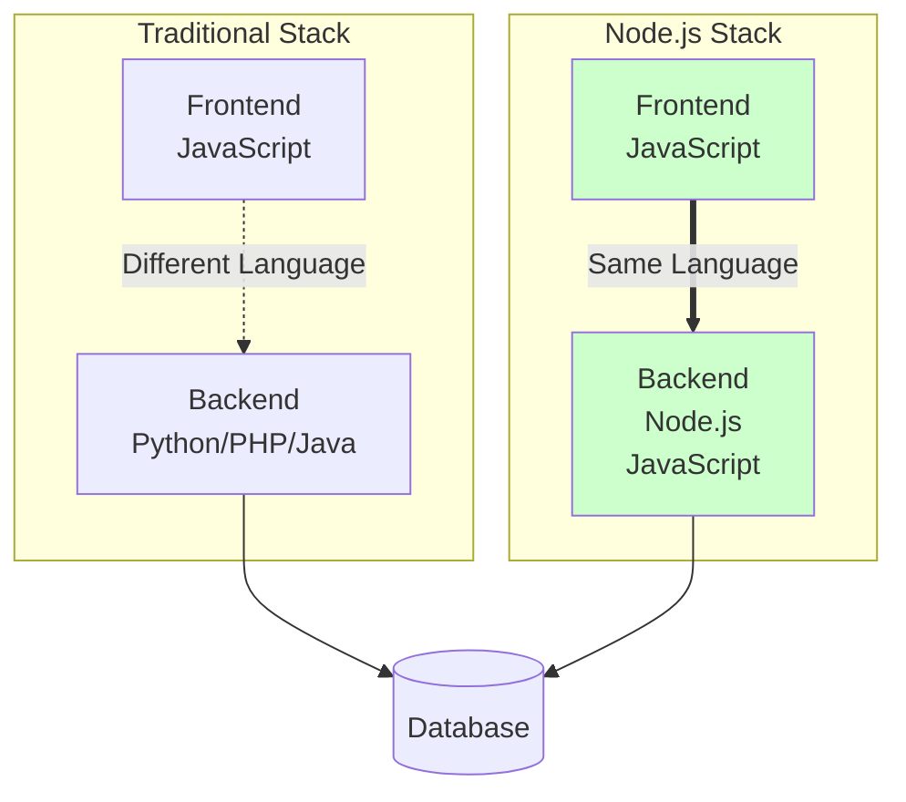
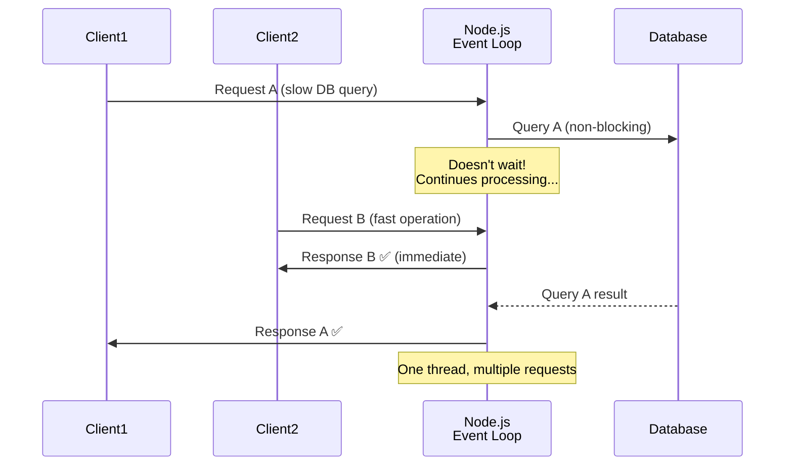
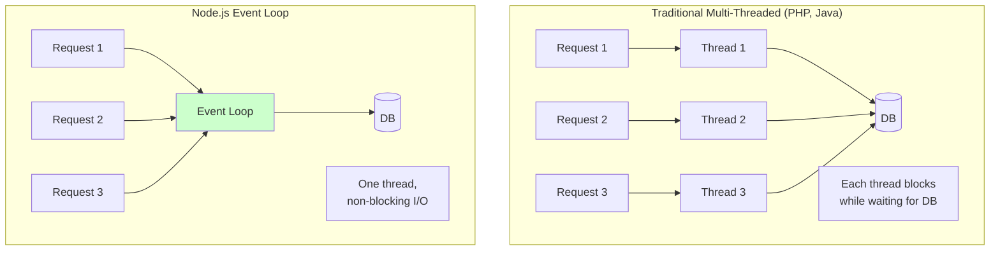
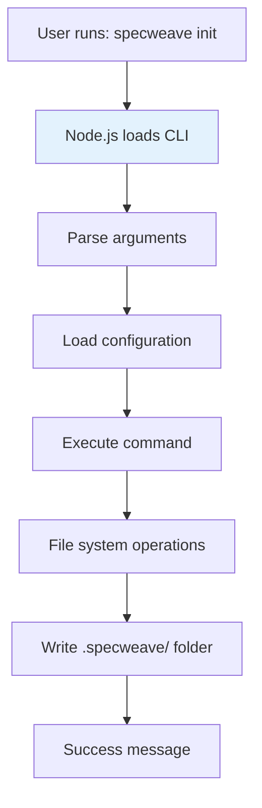

# Node.js

## Definition

**Node.js** is a JavaScript runtime environment built on Chrome's V8 JavaScript engine that allows developers to run JavaScript code on the server-side, outside of a web browser.

Think of it as **"JavaScript everywhere"** - the same language for both frontend (browser) and backend (server).

## What Problem Does It Solve?

### The Problem: Different Languages for Frontend and Backend

**Traditional Stack**:
- **Frontend**: JavaScript (browser)
- **Backend**: PHP, Python, Ruby, Java (completely different languages)

**Problems**:
- Developers need to learn multiple languages
- Context switching slows productivity
- Can't share code between frontend and backend
- Different ecosystems, tools, and paradigms

**Node.js Solution**: Use JavaScript for EVERYTHING.

### Why Node.js Matters



## How It Works

### Event Loop Architecture

Node.js is **single-threaded** but **non-blocking** (asynchronous):



**Key Insight**: While waiting for I/O (database, file system, network), Node.js can handle OTHER requests. No thread blocking!

### Comparison: Multi-Threaded vs Event Loop



## Real-World Examples

### Example 1: Simple HTTP Server

**Create a web server in 5 lines**:

```javascript
// server.js
const http = require('http');

const server = http.createServer((req, res) => {
  res.writeHead(200, { 'Content-Type': 'text/plain' });
  res.end('Hello, World!');
});

server.listen(3000, () => {
  console.log('Server running at http://localhost:3000/');
});
```

**Run**:
```bash
node server.js
# Visit http://localhost:3000/ → "Hello, World!"
```

### Example 2: Express.js API (Most Popular Framework)

**Build a RESTful API**:

```javascript
// app.js
const express = require('express');
const app = express();

app.use(express.json());

// In-memory database
let users = [
  { id: 1, name: 'John Doe', email: 'john@example.com' },
  { id: 2, name: 'Jane Smith', email: 'jane@example.com' }
];

// GET /users - List all users
app.get('/users', (req, res) => {
  res.json(users);
});

// GET /users/:id - Get specific user
app.get('/users/:id', (req, res) => {
  const user = users.find(u => u.id === parseInt(req.params.id));
  if (!user) return res.status(404).json({ error: 'User not found' });
  res.json(user);
});

// POST /users - Create user
app.post('/users', (req, res) => {
  const newUser = {
    id: users.length + 1,
    name: req.body.name,
    email: req.body.email
  };
  users.push(newUser);
  res.status(201).json(newUser);
});

// PUT /users/:id - Update user
app.put('/users/:id', (req, res) => {
  const user = users.find(u => u.id === parseInt(req.params.id));
  if (!user) return res.status(404).json({ error: 'User not found' });

  user.name = req.body.name || user.name;
  user.email = req.body.email || user.email;
  res.json(user);
});

// DELETE /users/:id - Delete user
app.delete('/users/:id', (req, res) => {
  const index = users.findIndex(u => u.id === parseInt(req.params.id));
  if (index === -1) return res.status(404).json({ error: 'User not found' });

  users.splice(index, 1);
  res.status(204).send();
});

app.listen(3000, () => {
  console.log('API running on http://localhost:3000');
});
```

**Test**:
```bash
# List users
curl http://localhost:3000/users

# Create user
curl -X POST http://localhost:3000/users \
  -H "Content-Type: application/json" \
  -d '{"name":"Bob","email":"bob@example.com"}'

# Get user
curl http://localhost:3000/users/1
```

### Example 3: Async/Await (Modern Node.js)

**Handle asynchronous operations elegantly**:

```javascript
// database.js
const { Pool } = require('pg');

const pool = new Pool({
  user: 'myuser',
  host: 'localhost',
  database: 'mydb',
  password: 'mypassword',
  port: 5432,
});

// Old way (callbacks - "callback hell")
function getUserOld(id, callback) {
  pool.query('SELECT * FROM users WHERE id = $1', [id], (err, result) => {
    if (err) return callback(err);
    callback(null, result.rows[0]);
  });
}

// Modern way (async/await)
async function getUser(id) {
  const result = await pool.query('SELECT * FROM users WHERE id = $1', [id]);
  return result.rows[0];
}

async function getUserWithPosts(id) {
  // Sequential (slow - total 300ms)
  const user = await getUser(id);          // 100ms
  const posts = await getUserPosts(id);    // 200ms
  return { ...user, posts };

  // Parallel (fast - total 200ms)
  const [user, posts] = await Promise.all([
    getUser(id),        // 100ms
    getUserPosts(id)    // 200ms (runs in parallel!)
  ]);
  return { ...user, posts };
}

// Usage
try {
  const user = await getUser(123);
  console.log(user);
} catch (error) {
  console.error('Error fetching user:', error);
}
```

### Example 4: NestJS (Enterprise Framework)

**Build scalable, maintainable APIs**:

```typescript
// users.controller.ts
import { Controller, Get, Post, Body, Param } from '@nestjs/common';
import { UsersService } from './users.service';

@Controller('users')
export class UsersController {
  constructor(private readonly usersService: UsersService) {}

  @Get()
  async findAll() {
    return this.usersService.findAll();
  }

  @Get(':id')
  async findOne(@Param('id') id: string) {
    return this.usersService.findOne(+id);
  }

  @Post()
  async create(@Body() createUserDto: CreateUserDto) {
    return this.usersService.create(createUserDto);
  }
}

// users.service.ts
import { Injectable } from '@nestjs/common';

@Injectable()
export class UsersService {
  private users = [
    { id: 1, name: 'John Doe', email: 'john@example.com' }
  ];

  findAll() {
    return this.users;
  }

  findOne(id: number) {
    return this.users.find(user => user.id === id);
  }

  create(createUserDto: CreateUserDto) {
    const newUser = {
      id: this.users.length + 1,
      ...createUserDto
    };
    this.users.push(newUser);
    return newUser;
  }
}
```

## How SpecWeave Uses Node.js

### 1. SpecWeave CLI is Built with Node.js

**SpecWeave itself is a Node.js application**:

```bash
# Install SpecWeave (NPM package)
npm install -g specweave

# Run SpecWeave CLI
specweave init
specweave version

# Under the hood: Node.js runs the CLI
node /usr/local/lib/node_modules/specweave/dist/cli/index.js
```

### 2. Project Structure

```
specweave/                    # Node.js project
├── package.json              # NPM dependencies
├── tsconfig.json             # TypeScript config
├── src/
│   ├── cli/                  # CLI commands (Node.js)
│   │   └── commands/
│   │       └── init.ts
│   ├── core/                 # Core logic (Node.js)
│   │   ├── plugin-loader.ts
│   │   └── config-manager.ts
│   └── utils/                # Utilities (Node.js)
│       └── file-utils.ts
├── dist/                     # Compiled JavaScript (Node.js runs this)
└── node_modules/             # NPM dependencies
```

### 3. NPM Ecosystem

**SpecWeave leverages Node.js ecosystem**:

```json
// package.json
{
  "name": "specweave",
  "version": "0.7.0",
  "dependencies": {
    "commander": "^11.0.0",    // CLI framework
    "inquirer": "^9.2.0",      // Interactive prompts
    "fs-extra": "^11.1.1",     // File operations
    "chalk": "^5.3.0",         // Colored output
    "yaml": "^2.3.1",          // YAML parsing
    "ajv": "^8.12.0"           // JSON schema validation
  }
}
```

**Over 2 million NPM packages** available for Node.js projects!

### 4. Runtime Workflow



## Key Features

### 1. NPM (Node Package Manager)

**Largest package ecosystem** in the world:

```bash
# Install packages
npm install express          # Web framework
npm install mongoose         # MongoDB ORM
npm install jest            # Testing framework

# Run scripts
npm run build               # Build project
npm test                    # Run tests
npm start                   # Start server
```

### 2. Asynchronous I/O

**Non-blocking by default**:

```javascript
// Traditional (blocking)
const data = readFileSync('file.txt');  // Blocks until done
console.log(data);

// Node.js way (non-blocking)
readFile('file.txt', (err, data) => {
  if (err) throw err;
  console.log(data);
});
// Other code runs immediately while file is being read
```

### 3. Single Language for Full Stack

**JavaScript everywhere**:

```javascript
// Frontend (React)
function UserList() {
  const [users, setUsers] = useState([]);

  useEffect(() => {
    fetch('/api/users')
      .then(res => res.json())
      .then(data => setUsers(data));
  }, []);

  return <ul>{users.map(u => <li>{u.name}</li>)}</ul>;
}

// Backend (Express)
app.get('/api/users', async (req, res) => {
  const users = await User.find();
  res.json(users);
});

// Shared code (validation)
function validateEmail(email) {
  return /^[^\s@]+@[^\s@]+\.[^\s@]+$/.test(email);
}
// ✅ This function works in both frontend AND backend!
```

### 4. Fast Iteration

**No compilation step** (JavaScript is interpreted):

```bash
# Edit code
vim server.js

# Run immediately
node server.js

# See changes instantly (with nodemon)
npm install -g nodemon
nodemon server.js  # Auto-restarts on file changes
```

## Best Practices

### 1. Use Environment Variables

**Never hardcode secrets**:

```javascript
// ❌ Bad
const dbPassword = 'mySecretPassword123';

// ✅ Good
const dbPassword = process.env.DB_PASSWORD;

// .env file
DB_PASSWORD=mySecretPassword123
DB_HOST=localhost
DB_PORT=5432

// Load with dotenv
require('dotenv').config();
console.log(process.env.DB_PASSWORD);
```

### 2. Error Handling

**Always handle errors**:

```javascript
// ❌ Bad (unhandled promise rejection)
app.get('/users', async (req, res) => {
  const users = await User.find(); // What if DB is down?
  res.json(users);
});

// ✅ Good (with error handling)
app.get('/users', async (req, res) => {
  try {
    const users = await User.find();
    res.json(users);
  } catch (error) {
    console.error('Error fetching users:', error);
    res.status(500).json({ error: 'Internal server error' });
  }
});
```

### 3. Use Modern JavaScript (ES6+)

```javascript
// ❌ Old (callbacks)
fs.readFile('file.txt', function(err, data) {
  if (err) return console.error(err);
  console.log(data);
});

// ✅ Modern (async/await)
try {
  const data = await fs.promises.readFile('file.txt');
  console.log(data);
} catch (error) {
  console.error(error);
}
```

### 4. Organize Code with Modules

```javascript
// users.service.js (business logic)
export class UsersService {
  async findAll() {
    return await User.find();
  }
}

// users.controller.js (HTTP handling)
import { UsersService } from './users.service';

export async function getUsers(req, res) {
  const service = new UsersService();
  const users = await service.findAll();
  res.json(users);
}

// app.js (routing)
import { getUsers } from './users.controller';
app.get('/users', getUsers);
```

## Common Mistakes

### ❌ Mistake 1: Blocking the Event Loop

**Problem**: CPU-intensive tasks block all requests.

```javascript
// ❌ Bad (blocks event loop)
app.get('/calculate', (req, res) => {
  let result = 0;
  for (let i = 0; i < 1000000000; i++) {
    result += i;  // Takes 5 seconds!
  }
  res.json({ result });
});

// While this runs, ALL other requests wait 5 seconds!
```

**Solution**: Use worker threads for CPU-intensive tasks.

### ❌ Mistake 2: Not Handling Promise Rejections

**Problem**: Unhandled rejections crash the app.

```javascript
// ❌ Bad (silent failure)
app.get('/users', async (req, res) => {
  const users = await User.find(); // No try/catch
  res.json(users);
});
// If User.find() fails → unhandled rejection → crash

// ✅ Good
app.get('/users', async (req, res) => {
  try {
    const users = await User.find();
    res.json(users);
  } catch (error) {
    res.status(500).json({ error: error.message });
  }
});
```

### ❌ Mistake 3: Memory Leaks

**Problem**: Global variables or event listeners not cleaned up.

```javascript
// ❌ Bad (memory leak)
const cache = {}; // Global variable
app.get('/data/:id', (req, res) => {
  cache[req.params.id] = fetchData(req.params.id);
  res.json(cache[req.params.id]);
});
// Cache grows forever → memory leak

// ✅ Good (use LRU cache with size limit)
const LRU = require('lru-cache');
const cache = new LRU({ max: 500 });
```

### ❌ Mistake 4: Not Using Process Managers

**Problem**: App crashes and doesn't restart.

```bash
# ❌ Bad (direct node)
node server.js
# If app crashes → stays down

# ✅ Good (PM2 - auto-restart)
npm install -g pm2
pm2 start server.js
pm2 logs
pm2 restart server
```

## Related Terms

- **Express** - Most popular Node.js web framework
- **[NestJS](/docs/glossary/terms/nestjs)** - Enterprise Node.js framework (TypeScript)
- **[NPM](/docs/glossary/terms/npm)** - Node Package Manager
- **[REST](/docs/glossary/terms/rest)** - API style often used with Node.js
- **[GraphQL](/docs/glossary/terms/graphql)** - Query language often used with Node.js
- **Backend** - Server-side development
- **[API](/docs/glossary/terms/api)** - What Node.js apps often implement
- **[Microservices](/docs/glossary/terms/microservices)** - Architecture often built with Node.js

## Learn More

- **[Node.js Official Docs](https://nodejs.org/docs/)** - Official documentation
- **[Express.js Guide](https://expressjs.com/)** - Express.js framework
- **[NestJS Documentation](https://nestjs.com/)** - NestJS framework
- **[Node.js Best Practices](https://github.com/goldbergyoni/nodebestpractices)** - Community best practices
- **SpecWeave Backend Guide** - Backend development with SpecWeave

---

**Category**: Backend Development

**Tags**: `#nodejs` `#javascript` `#backend` `#runtime` `#express` `#nestjs` `#async`
