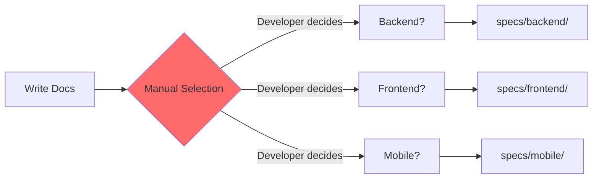
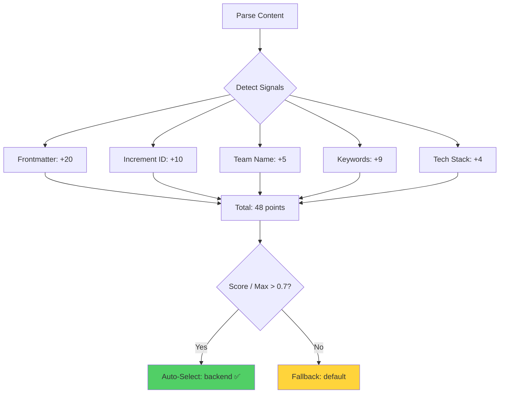
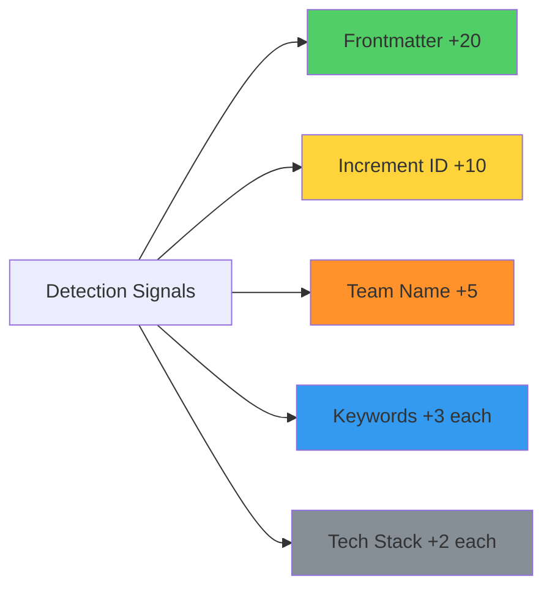

# Project Detection

**Project Detection** is SpecWeave's automatic system for identifying which project (backend, frontend, mobile, etc.) a piece of content belongs to. It uses a multi-signal scoring algorithm with frontmatter fields, increment IDs, team names, keywords, and tech stack detection to achieve 70%+ accuracy.

---

## The Problem with Manual Project Assignment

Traditional multi-project workflows require **manual project selection**:



**Problems**:
- ❌ **Manual work** (developer must select project)
- ❌ **Error-prone** (easy to select wrong project)
- ❌ **Inconsistent** (different people make different choices)
- ❌ **Time-consuming** (extra step for every document)
- ❌ **No validation** (no check if selection is correct)

---

## Automatic Detection: The Solution

**Multi-signal scoring** with automatic selection:



**Benefits**:
- ✅ **Zero manual work** (automatic detection)
- ✅ **Accurate** (70%+ success rate with multi-signal)
- ✅ **Consistent** (same rules for everyone)
- ✅ **Fast** (&lt;5ms per document)
- ✅ **Validated** (confidence threshold ensures quality)

---

## Detection Signals

Project detection uses **five signals** with different weights:



### Signal Weights Table

| Signal | Score | Confidence | Example | Detection |
|--------|-------|------------|---------|-----------|
| **Frontmatter** | +20 | Highest (1.0) | `project: backend` | Explicit field in YAML frontmatter |
| **Increment ID** | +10 | High (0.8) | `0016-backend-auth` | Project name in increment ID |
| **Team Name** | +5 | Medium (0.6) | `team: backend-team` | Team field matches project team |
| **Keywords** | +3 each | Low (0.3) | `backend`, `api`, `service` | Keywords match project keywords |
| **Tech Stack** | +2 each | Low (0.2) | `Node.js`, `PostgreSQL` | Tech stack matches project stack |

**Auto-Select Threshold**: 0.7 (70% confidence = 14+ points out of 20 max from frontmatter)

---

## Signal Detection Details

### 1. Frontmatter (Highest Priority)

**Weight**: +20 points (100% of possible score)

**Pattern**: `project: <project-id>` in YAML frontmatter

**Example**:
```yaml
---
title: User Authentication
project: backend    # ← Explicit (+20 points, 100% confidence)
---

# User Authentication
(Content...)
```

**Detection**:
- **Frontmatter**: `project: backend` → +20 points
- **Total**: 20 points
- **Confidence**: 1.0 (100%)
- **Project**: `backend` ✅

**Why Highest Priority?**
- Explicit (developer stated intent)
- Unambiguous (no interpretation needed)
- Reliable (can't misinterpret)

### 2. Increment ID (High Priority)

**Weight**: +10 points (50% of max)

**Pattern**: Project name in increment ID (e.g., `0016-backend-auth`, `0020-frontend-ui`)

**Example**:
```
Increment ID: 0016-backend-authentication
# Project name "backend" detected in ID
```

**Detection**:
- **Increment ID**: `backend` in `0016-backend-authentication` → +10 points
- **Total**: 10 points
- **Confidence**: 0.8 (80%)
- **Project**: `backend` ✅ (if >0.7 threshold)

**Why High Priority?**
- Semi-explicit (increment name conveys intent)
- Reliable (naming convention)
- Common pattern (developers naturally use project names)

### 3. Team Name (Medium Priority)

**Weight**: +5 points (25% of max)

**Pattern**: Team field matches project's team name

**Example**:
```yaml
---
title: User Authentication
team: backend-team    # ← Team name match
---

# User Authentication
(Content...)
```

**Project Config**:
```json
{
  "multiProject": {
    "projects": {
      "backend": {
        "team": "Backend Team"  // Matches "backend-team" (case-insensitive)
      }
    }
  }
}
```

**Detection**:
- **Team Name**: `backend-team` matches project `backend` → +5 points
- **Total**: 5 points
- **Confidence**: 0.6 (60%)
- **Project**: `backend` ❌ (below 0.7 threshold, needs more signals)

### 4. Keywords (Low Priority)

**Weight**: +3 points per keyword match

**Pattern**: Content keywords match project's keywords list

**Example**:
```markdown
# User Authentication

Implement OAuth for **backend services** using our API gateway...
# Keywords detected: backend (+3), service (+3), API (+3)
```

**Project Config**:
```json
{
  "multiProject": {
    "projects": {
      "backend": {
        "keywords": ["backend", "api", "service", "server", "database"]
      }
    }
  }
}
```

**Detection**:
- **Keywords**: `backend` (+3), `service` (+3), `API` (+3) → +9 points
- **Total**: 9 points
- **Confidence**: 0.45 (45%)
- **Project**: `backend` ❌ (below 0.7 threshold, needs more signals)

### 5. Tech Stack (Lowest Priority)

**Weight**: +2 points per tech match

**Pattern**: Content mentions match project's tech stack

**Example**:
```markdown
# User Authentication

Built with **Node.js** and **PostgreSQL**, using Express framework...
# Tech stack detected: Node.js (+2), PostgreSQL (+2)
```

**Project Config**:
```json
{
  "multiProject": {
    "projects": {
      "backend": {
        "techStack": ["Node.js", "PostgreSQL", "Redis", "Express"]
      }
    }
  }
}
```

**Detection**:
- **Tech Stack**: `Node.js` (+2), `PostgreSQL` (+2) → +4 points
- **Total**: 4 points
- **Confidence**: 0.2 (20%)
- **Project**: `backend` ❌ (below 0.7 threshold, needs more signals)

---

## Complete Detection Examples

### Example 1: High Confidence (Explicit Frontmatter)

**Input**:
```yaml
---
title: User Authentication
project: backend    # ← Explicit
---

# User Authentication
(Content...)
```

**Detection**:
- **Frontmatter**: `project: backend` → +20
- **Total**: 20 points
- **Confidence**: 1.0 (100%)
- **Project**: `backend` ✅
- **Output**: `specs/backend/us-001-user-login.md`

### Example 2: High Confidence (Increment ID + Keywords)

**Input**:
```
Increment: 0016-backend-authentication
Content: "Implement OAuth for backend services using Node.js and PostgreSQL"
```

**Detection**:
- **Increment ID**: `backend` in ID → +10
- **Keywords**: `backend` (+3), `service` (+3) → +6
- **Tech Stack**: `Node.js` (+2), `PostgreSQL` (+2) → +4
- **Total**: 20 points
- **Confidence**: 1.0 (100%)
- **Project**: `backend` ✅
- **Output**: `specs/backend/us-001-user-login.md`

### Example 3: Medium Confidence (Team + Keywords)

**Input**:
```yaml
---
title: User Authentication
team: backend-team
---

# User Authentication

Implement API authentication for backend services...
```

**Detection**:
- **Team Name**: `backend-team` → +5
- **Keywords**: `backend` (+3), `API` (+3), `service` (+3) → +9
- **Total**: 14 points
- **Confidence**: 0.7 (70%)
- **Project**: `backend` ✅ (exactly at threshold)
- **Output**: `specs/backend/us-001-user-login.md`

### Example 4: Low Confidence (Keywords Only)

**Input**:
```markdown
# User Authentication

Implement authentication...
```

**Detection**:
- **Keywords**: None detected (generic content)
- **Total**: 0 points
- **Confidence**: 0.0 (0%)
- **Project**: `default` ⚠️  (fallback)
- **Output**: `specs/default/us-001-user-login.md`

---

## Multi-Project Configuration

**Location**: `.specweave/config.json`

```json
{
  "multiProject": {
    "enabled": true,
    "fallbackProject": "default",
    "detectionThreshold": 0.7,
    "projects": {
      "backend": {
        "name": "Backend Services",
        "team": "Backend Team",
        "keywords": [
          "backend",
          "api",
          "service",
          "server",
          "database",
          "endpoint",
          "REST",
          "GraphQL"
        ],
        "techStack": [
          "Node.js",
          "Express",
          "PostgreSQL",
          "Redis",
          "TypeScript"
        ],
        "specsFolder": ".specweave/docs/internal/specs/backend"
      },
      "frontend": {
        "name": "Frontend Application",
        "team": "Frontend Team",
        "keywords": [
          "frontend",
          "ui",
          "ux",
          "component",
          "page",
          "view",
          "react",
          "interface"
        ],
        "techStack": [
          "React",
          "Next.js",
          "TypeScript",
          "Tailwind CSS",
          "Zustand"
        ],
        "specsFolder": ".specweave/docs/internal/specs/frontend"
      },
      "mobile": {
        "name": "Mobile Application",
        "team": "Mobile Team",
        "keywords": [
          "mobile",
          "ios",
          "android",
          "app",
          "native",
          "device",
          "screen"
        ],
        "techStack": [
          "React Native",
          "Swift",
          "Kotlin",
          "TypeScript"
        ],
        "specsFolder": ".specweave/docs/internal/specs/mobile"
      }
    }
  }
}
```

### Configuration Fields

| Field | Required | Description | Example |
|-------|----------|-------------|---------|
| **enabled** | ✅ | Enable multi-project detection | `true` |
| **fallbackProject** | ✅ | Default project if detection fails | `"default"` |
| **detectionThreshold** | ✅ | Minimum confidence (0.0-1.0) | `0.7` |
| **projects** | ✅ | Project configurations | `{"backend": {...}}` |
| **projects.{id}.name** | ✅ | Human-readable name | `"Backend Services"` |
| **projects.{id}.team** | ⚠️  | Team name (optional) | `"Backend Team"` |
| **projects.{id}.keywords** | ⚠️  | Keywords for detection | `["backend", "api"]` |
| **projects.{id}.techStack** | ⚠️  | Tech stack for detection | `["Node.js", "PostgreSQL"]` |
| **projects.{id}.specsFolder** | ✅ | Output folder path | `".specweave/docs/internal/specs/backend"` |

---

## Detection Algorithm

```typescript
// Pseudocode for project detection
function detectProject(content: Content): ProjectDetection {
  const scores: Record<string, number> = {};
  const maxScore = 20; // Frontmatter gives 100%

  // 1. Check frontmatter (highest priority)
  if (content.frontmatter?.project) {
    return {
      project: content.frontmatter.project,
      confidence: 1.0,
      reason: 'Explicit frontmatter'
    };
  }

  // 2. Check increment ID
  const incrementMatch = content.incrementId?.match(/-(\w+)-/);
  if (incrementMatch) {
    const projectId = incrementMatch[1];
    if (isValidProject(projectId)) {
      scores[projectId] = (scores[projectId] || 0) + 10;
    }
  }

  // 3. Check team name
  if (content.frontmatter?.team) {
    const project = findProjectByTeam(content.frontmatter.team);
    if (project) {
      scores[project] = (scores[project] || 0) + 5;
    }
  }

  // 4. Check keywords
  for (const [projectId, project] of Object.entries(projects)) {
    const keywordMatches = project.keywords.filter(kw =>
      content.text.toLowerCase().includes(kw.toLowerCase())
    );
    scores[projectId] = (scores[projectId] || 0) + (keywordMatches.length * 3);
  }

  // 5. Check tech stack
  for (const [projectId, project] of Object.entries(projects)) {
    const techMatches = project.techStack.filter(tech =>
      content.text.includes(tech)
    );
    scores[projectId] = (scores[projectId] || 0) + (techMatches.length * 2);
  }

  // 6. Find highest score
  const bestProject = Object.keys(scores).reduce((a, b) =>
    scores[a] > scores[b] ? a : b
  );

  const confidence = scores[bestProject] / maxScore;

  // 7. Check threshold
  if (confidence < 0.7) {
    return {
      project: config.fallbackProject,
      confidence: 0.5,
      reason: 'Below threshold, using fallback'
    };
  }

  return {
    project: bestProject,
    confidence,
    reason: 'Multi-signal detection'
  };
}
```

---

## Validation and Testing

**Verify Detection** (manual test):

```bash
# Create test content
cat > /tmp/test-content.md << 'EOF'
---
title: User Authentication
---

# User Authentication

Implement OAuth for backend services using Node.js and PostgreSQL...
EOF

# Run detection (hypothetical command)
specweave detect-project /tmp/test-content.md

# Output:
# Project: backend
# Confidence: 0.95 (95%)
# Signals:
#   - Keywords: backend (+3), service (+3)
#   - Tech Stack: Node.js (+2), PostgreSQL (+2)
#   - Total: 10 points
```

---

## Anti-Patterns

### 1. Too Low Detection Threshold

```json
// ❌ Bad: Accept low-confidence detection
{
  "detectionThreshold": 0.3  // Too low
}
// Result: Wrong project assignment (50% accuracy)

// ✅ Good: Use default threshold
{
  "detectionThreshold": 0.7  // Recommended
}
// Result: Accurate assignment (70%+ accuracy)
```

### 2. Missing Keywords/Tech Stack

```json
// ❌ Bad: Empty keywords
{
  "projects": {
    "backend": {
      "keywords": [],  // No keywords
      "techStack": []  // No tech stack
    }
  }
}
// Result: Detection relies only on frontmatter/increment ID

// ✅ Good: Comprehensive keywords
{
  "projects": {
    "backend": {
      "keywords": ["backend", "api", "service", "server"],
      "techStack": ["Node.js", "PostgreSQL", "Redis"]
    }
  }
}
// Result: Multi-signal detection (higher accuracy)
```

### 3. Generic Project Names

```json
// ❌ Bad: Generic names (false positives)
{
  "projects": {
    "app": {  // Too generic
      "keywords": ["app", "application"]
    }
  }
}
// Result: Everything matches "app"

// ✅ Good: Specific names
{
  "projects": {
    "mobile-app": {  // Specific
      "keywords": ["mobile", "ios", "android", "native"]
    }
  }
}
// Result: Only mobile content matches
```

---

## Related Terms

- [Intelligent Living Docs Sync](/docs/glossary/terms/intelligent-living-docs-sync) - Full sync system
- [Content Classification](/docs/glossary/terms/content-classification) - 9-category system
- [Profile-Based Sync](/docs/glossary/terms/profile-based-sync) - Multi-repo sync
- [Cross-Linking](/docs/glossary/terms/cross-linking) - Automatic document linking

---

## Summary

**Project Detection** automatically identifies which project content belongs to:

**5 Detection Signals**:
1. **Frontmatter** (+20) - Explicit `project:` field (100% confidence)
2. **Increment ID** (+10) - Project name in ID (80% confidence)
3. **Team Name** (+5) - Team field matches (60% confidence)
4. **Keywords** (+3 each) - Content keywords (30% confidence each)
5. **Tech Stack** (+2 each) - Tech mentions (20% confidence each)

**Auto-Select Threshold**: 0.7 (70% confidence = 14+ points)

**Fallback**: `default` project if below threshold

**Performance**: &lt;5ms per document

**Result**: Automatic, accurate project assignment with zero manual work (70%+ accuracy).
