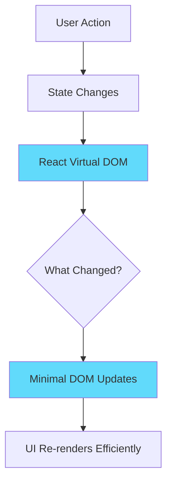
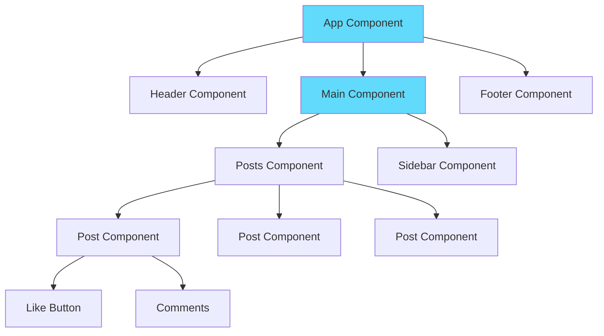
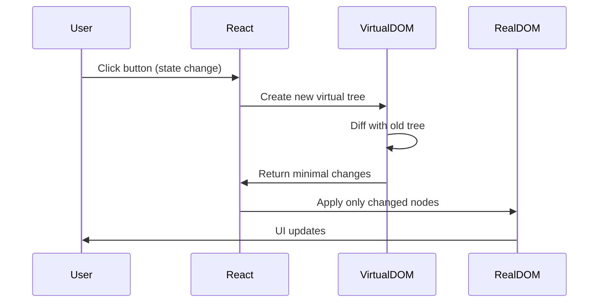
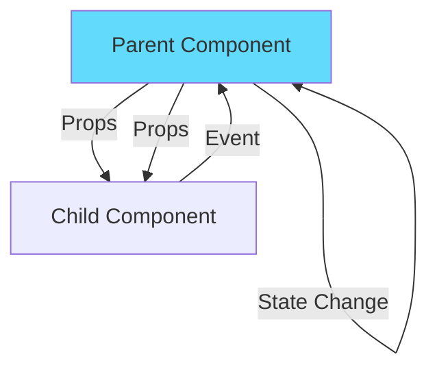
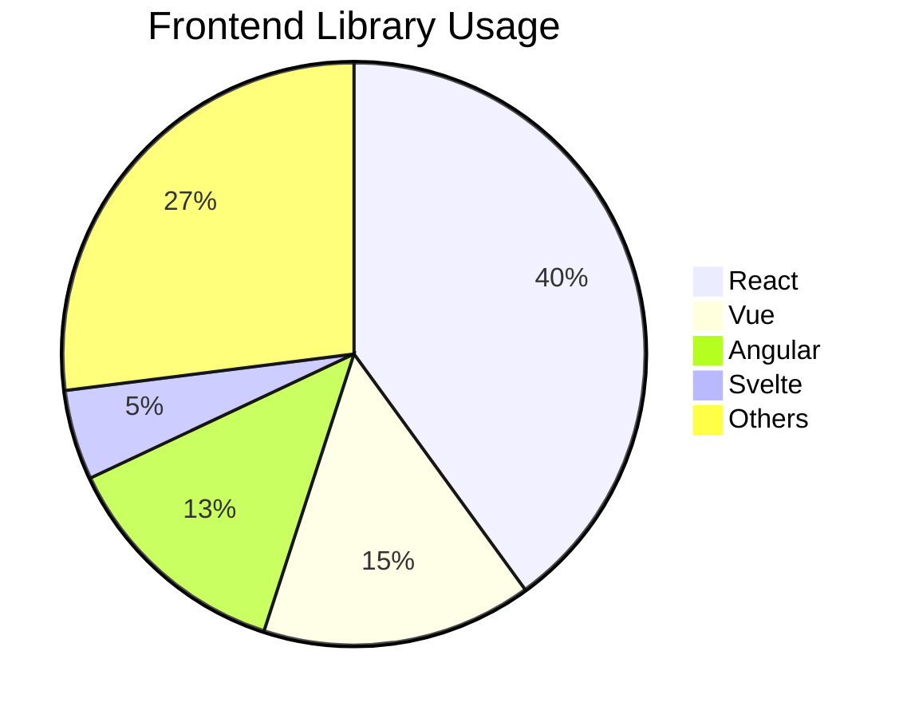

# React

## Definition

**React** is a JavaScript library for building user interfaces, created and maintained by Meta (formerly Facebook). It's the most popular frontend library in the world.

Think of it as **"LEGO blocks for websites"** - you build reusable UI components and snap them together to create complex applications.

## What Problem Does It Solve?

### The Problem: Building Dynamic UIs is Hard

**Scenario**: You're building a social media feed. When a user likes a post, you need to:
- Update the like count
- Change the button color
- Notify the server
- Update other users' views
- Keep everything in sync

**Without React**: You manually manipulate the DOM, track state across the app, and write tons of jQuery spaghetti code.

**With React**: Describe what the UI should look like for any state, and React automatically updates the DOM when state changes.

### Why React Matters



## How It Works

### Component-Based Architecture



### React Fundamentals

#### 1. Components

**Function Component** (modern, recommended):

```jsx
function Welcome({ name }) {
  return <h1>Hello, {name}!</h1>;
}

// Usage
<Welcome name="John" />
```

**Class Component** (legacy, still supported):

```jsx
class Welcome extends React.Component {
  render() {
    return <h1>Hello, {this.props.name}!</h1>;
  }
}
```

#### 2. JSX (JavaScript XML)

**Mix HTML with JavaScript**:

```jsx
function UserCard({ user }) {
  return (
    <div className="card">
      
      <h2>{user.name}</h2>
      <p>{user.bio}</p>
      {user.isPremium && <span className="badge">Premium</span>}
    </div>
  );
}
```

#### 3. State (Component Memory)

**useState Hook**:

```jsx
import { useState } from 'react';

function Counter() {
  const [count, setCount] = useState(0);

  return (
    <div>
      <p>You clicked {count} times</p>
      <button onClick={() => setCount(count + 1)}>
        Click me
      </button>
    </div>
  );
}
```

#### 4. Effects (Side Effects)

**useEffect Hook**:

```jsx
import { useState, useEffect } from 'react';

function UserProfile({ userId }) {
  const [user, setUser] = useState(null);
  const [loading, setLoading] = useState(true);

  useEffect(() => {
    // Runs after component mounts or userId changes
    fetch(`/api/users/${userId}`)
      .then(res => res.json())
      .then(data => {
        setUser(data);
        setLoading(false);
      });
  }, [userId]); // Re-run when userId changes

  if (loading) return <div>Loading...</div>;
  return <div>{user.name}</div>;
}
```

#### 5. Props (Component Inputs)

**Pass data from parent to child**:

```jsx
function App() {
  const user = { name: "Alice", age: 25 };

  return (
    <UserProfile
      user={user}
      onEdit={() => console.log('Edit clicked')}
    />
  );
}

function UserProfile({ user, onEdit }) {
  return (
    <div>
      <h1>{user.name}</h1>
      <p>Age: {user.age}</p>
      <button onClick={onEdit}>Edit</button>
    </div>
  );
}
```

## Real-World Examples

### Example 1: Todo App

```jsx
import { useState } from 'react';

function TodoApp() {
  const [todos, setTodos] = useState([]);
  const [input, setInput] = useState('');

  const addTodo = () => {
    setTodos([...todos, { id: Date.now(), text: input, done: false }]);
    setInput('');
  };

  const toggleTodo = (id) => {
    setTodos(todos.map(todo =>
      todo.id === id ? { ...todo, done: !todo.done } : todo
    ));
  };

  return (
    <div>
      <h1>Todo List</h1>
      <input
        value={input}
        onChange={(e) => setInput(e.target.value)}
        onKeyPress={(e) => e.key === 'Enter' && addTodo()}
        placeholder="What needs to be done?"
      />
      <button onClick={addTodo}>Add</button>

      <ul>
        {todos.map(todo => (
          <li
            key={todo.id}
            onClick={() => toggleTodo(todo.id)}
            style={{ textDecoration: todo.done ? 'line-through' : 'none' }}
          >
            {todo.text}
          </li>
        ))}
      </ul>
    </div>
  );
}
```

### Example 2: Data Fetching with Loading State

```jsx
import { useState, useEffect } from 'react';

function PostsList() {
  const [posts, setPosts] = useState([]);
  const [loading, setLoading] = useState(true);
  const [error, setError] = useState(null);

  useEffect(() => {
    fetch('https://api.example.com/posts')
      .then(res => {
        if (!res.ok) throw new Error('Failed to fetch');
        return res.json();
      })
      .then(data => {
        setPosts(data);
        setLoading(false);
      })
      .catch(err => {
        setError(err.message);
        setLoading(false);
      });
  }, []);

  if (loading) return <div>Loading posts...</div>;
  if (error) return <div>Error: {error}</div>;

  return (
    <div>
      {posts.map(post => (
        <article key={post.id}>
          <h2>{post.title}</h2>
          <p>{post.body}</p>
        </article>
      ))}
    </div>
  );
}
```

### Example 3: Form with Validation

```jsx
import { useState } from 'react';

function SignupForm() {
  const [form, setForm] = useState({ email: '', password: '' });
  const [errors, setErrors] = useState({});

  const validate = () => {
    const newErrors = {};
    if (!form.email.includes('@')) {
      newErrors.email = 'Invalid email';
    }
    if (form.password.length < 8) {
      newErrors.password = 'Password must be 8+ characters';
    }
    return newErrors;
  };

  const handleSubmit = (e) => {
    e.preventDefault();
    const newErrors = validate();

    if (Object.keys(newErrors).length === 0) {
      // Submit form
      console.log('Form submitted:', form);
    } else {
      setErrors(newErrors);
    }
  };

  return (
    <form onSubmit={handleSubmit}>
      <div>
        <input
          type="email"
          value={form.email}
          onChange={(e) => setForm({ ...form, email: e.target.value })}
          placeholder="Email"
        />
        {errors.email && <span className="error">{errors.email}</span>}
      </div>

      <div>
        <input
          type="password"
          value={form.password}
          onChange={(e) => setForm({ ...form, password: e.target.value })}
          placeholder="Password"
        />
        {errors.password && <span className="error">{errors.password}</span>}
      </div>

      <button type="submit">Sign Up</button>
    </form>
  );
}
```

## React Core Concepts

### Virtual DOM



**Why Virtual DOM?**
- ✅ Fast: Only updates what changed
- ✅ Efficient: Batches updates
- ✅ Declarative: You describe UI, React handles updates

### One-Way Data Flow



**Rules**:
- Props flow down (parent → child)
- Events flow up (child → parent)
- State is local to component
- Immutability: Never mutate state directly

### React Hooks

**Most Common Hooks**:

| Hook | Purpose | Example |
|------|---------|---------|
| `useState` | Component state | `const [count, setCount] = useState(0)` |
| `useEffect` | Side effects | `useEffect(() => { /* fetch data */ }, [])` |
| `useContext` | Global state | `const theme = useContext(ThemeContext)` |
| `useRef` | DOM access | `const inputRef = useRef(null)` |
| `useMemo` | Expensive calculations | `const result = useMemo(() => compute(a, b), [a, b])` |
| `useCallback` | Memoized functions | `const handler = useCallback(() => {}, [])` |

## How SpecWeave Uses React

### 1. React Project Structure

```
my-react-app/
├── .specweave/
│   ├── increments/
│   │   ├── 0001-setup-react/
│   │   │   ├── spec.md
│   │   │   ├── plan.md
│   │   │   └── tasks.md
│   │   └── 0002-user-authentication/
│   └── docs/
│       └── internal/
│           └── architecture/
│               └── frontend-architecture.md
├── src/
│   ├── components/        # React components
│   ├── hooks/             # Custom hooks
│   ├── pages/             # Page components
│   └── App.jsx
└── package.json
```

### 2. Planning React Features

**Increment spec for React component**:

```markdown
# Increment 0008: User Profile Component

## User Stories

**US-001**: As a user, I want to view my profile
- [ ] AC-US1-01: Display user avatar, name, email
- [ ] AC-US1-02: Show profile completion percentage
- [ ] AC-US1-03: Edit button navigates to edit page

## Technical Requirements

**Component Structure**:
- `UserProfile.jsx` - Main component
- `UserAvatar.jsx` - Avatar with upload
- `ProfileStats.jsx` - Statistics display

**State Management**:
- Local state for loading/error
- Context for user data (shared across app)

**Tests**:
- Unit: Component renders correctly
- Integration: Profile data fetches from API
```

### 3. React + SpecWeave Workflow

```mermaid
graph TB
    A[/specweave:increment "User Profile"] --> B[PM: Generate Spec]
    B --> C[Architect: Plan Component Structure]
    C --> D[/specweave:do]
    D --> E[Implement React Components]
    E --> F[Write Tests]
    F --> G[/specweave:done]

    style B fill:#61dafb
    style E fill:#61dafb
```

## Why React is Most Popular

### Statistics (2024)



### Key Reasons

#### 1. Massive Ecosystem

```
npm packages: 250,000+ React-related packages
GitHub stars: 220,000+ (most starred frontend library)
Job postings: 80,000+ React jobs (more than all others combined)
```

#### 2. Strong Community

- **Meta (Facebook)** backing: Instagram, WhatsApp use React
- **Fortune 500 adoption**: Netflix, Airbnb, Uber, Tesla
- **Developer adoption**: 40% of frontend developers use React

#### 3. Learn Once, Write Anywhere

```
React → React Native (mobile apps)
React → React VR (virtual reality)
React → Electron (desktop apps)
```

#### 4. Flexibility

- ✅ Use with any backend (REST, GraphQL)
- ✅ Choose your own state management (Redux, Zustand, Jotai)
- ✅ Choose your own routing (React Router, TanStack Router)
- ✅ Not opinionated (unlike Angular)

## React vs Alternatives

### React vs Angular

| Aspect | React | Angular |
|--------|-------|---------|
| **Type** | Library | Full framework |
| **Learning Curve** | Moderate | Steep |
| **Bundle Size** | Small (~40KB) | Large (~100KB+) |
| **Flexibility** | High (choose tools) | Low (opinionated) |
| **Best For** | Startups, SPA, apps | Enterprise, large teams |

**[Learn More: Angular →](/docs/glossary/terms/angular)**

### React vs Vue

| Aspect | React | Vue |
|--------|-------|-----|
| **Syntax** | JSX | Template-based |
| **Learning Curve** | Moderate | Easy |
| **Job Market** | Larger | Smaller |
| **Ecosystem** | Massive | Growing |
| **Best For** | Large apps, job market | Smaller apps, simplicity |

### React vs Svelte

| Aspect | React | Svelte |
|--------|-------|--------|
| **Runtime** | Yes (Virtual DOM) | No (compiles away) |
| **Performance** | Fast | Faster |
| **Bundle Size** | Moderate | Smallest |
| **Ecosystem** | Mature | Young |
| **Best For** | Production apps | Performance-critical |

## Common React Patterns

### 1. Custom Hooks

**Reusable logic**:

```jsx
// Custom hook for fetching data
function useFetch(url) {
  const [data, setData] = useState(null);
  const [loading, setLoading] = useState(true);
  const [error, setError] = useState(null);

  useEffect(() => {
    fetch(url)
      .then(res => res.json())
      .then(setData)
      .catch(setError)
      .finally(() => setLoading(false));
  }, [url]);

  return { data, loading, error };
}

// Usage
function UserProfile({ userId }) {
  const { data, loading, error } = useFetch(`/api/users/${userId}`);

  if (loading) return <div>Loading...</div>;
  if (error) return <div>Error: {error.message}</div>;
  return <div>{data.name}</div>;
}
```

### 2. Context for Global State

**Share state across components**:

```jsx
import { createContext, useContext, useState } from 'react';

// Create context
const ThemeContext = createContext();

// Provider component
function ThemeProvider({ children }) {
  const [theme, setTheme] = useState('light');

  return (
    <ThemeContext.Provider value={{ theme, setTheme }}>
      {children}
    </ThemeContext.Provider>
  );
}

// Consumer hook
function useTheme() {
  return useContext(ThemeContext);
}

// Usage
function App() {
  return (
    <ThemeProvider>
      <Header />
      <Main />
    </ThemeProvider>
  );
}

function Header() {
  const { theme, setTheme } = useTheme();

  return (
    <header className={theme}>
      <button onClick={() => setTheme(theme === 'light' ? 'dark' : 'light')}>
        Toggle Theme
      </button>
    </header>
  );
}
```

### 3. Component Composition

**Build complex UIs from simple components**:

```jsx
function Card({ children, title }) {
  return (
    <div className="card">
      <h2>{title}</h2>
      <div className="card-body">{children}</div>
    </div>
  );
}

// Usage
<Card title="User Profile">
  <UserAvatar user={user} />
  <UserStats user={user} />
  <UserBio user={user} />
</Card>
```

## Best Practices

### ✅ Do

1. **Keep components small** (< 200 lines)
2. **Use functional components + hooks** (modern)
3. **Extract reusable logic to custom hooks**
4. **Use PropTypes or TypeScript** for type safety
5. **Memoize expensive calculations** with `useMemo`
6. **Follow naming conventions** (`use*` for hooks, PascalCase for components)

### ❌ Don't

1. **Don't mutate state directly** (use `setState`)
2. **Don't forget dependency arrays** in `useEffect`
3. **Don't create components inside components** (performance issue)
4. **Don't use index as key** in lists (breaks reconciliation)
5. **Don't overuse Context** (use state management library for complex state)

## Common Mistakes

### ❌ Mistake 1: Mutating State

```jsx
// ❌ WRONG
const [user, setUser] = useState({ name: 'Alice', age: 25 });
user.age = 26; // Mutating!
setUser(user);

// ✅ CORRECT
setUser({ ...user, age: 26 }); // New object
```

### ❌ Mistake 2: Missing Dependency Array

```jsx
// ❌ WRONG (runs on every render)
useEffect(() => {
  fetchData(userId);
}); // No dependency array!

// ✅ CORRECT
useEffect(() => {
  fetchData(userId);
}, [userId]); // Re-run only when userId changes
```

### ❌ Mistake 3: Using Index as Key

```jsx
// ❌ WRONG
{items.map((item, index) => (
  <div key={index}>{item}</div> // Index as key breaks updates!
))}

// ✅ CORRECT
{items.map(item => (
  <div key={item.id}>{item.name}</div> // Unique ID as key
))}
```

## Related Terms

- **[Next.js](/docs/glossary/terms/nextjs)** - React framework with SSR/SSG
- **[TypeScript](/docs/glossary/terms/typescript)** - Type-safe JavaScript (often used with React)
- **[SPA](/docs/glossary/terms/spa)** - Single Page Application architecture
- **Component Library** - Reusable React components
- **Frontend** - Client-side development
- **[State Management](/docs/glossary/terms/state-management)** - Redux, Zustand, etc.

## Learn More

- **[React Official Docs](https://react.dev)** - Best learning resource
- **React Tutorial** - SpecWeave React guide
- **[Next.js Guide](/docs/glossary/terms/nextjs)** - React + SSR/SSG
- **[SpecWeave Frontend Plugin](/docs/plugins/frontend-stack)** - React-specific SpecWeave features

---

**Category**: Frontend Development

**Tags**: `#react` `#frontend` `#javascript` `#ui` `#components` `#spa`
