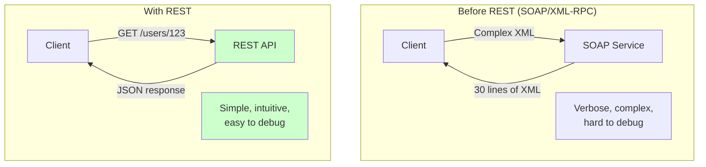
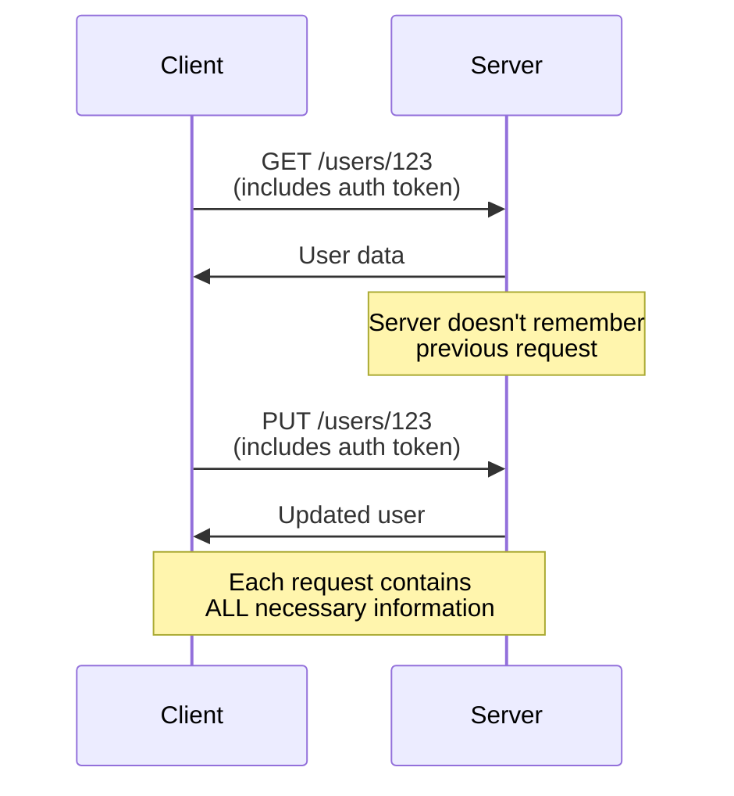
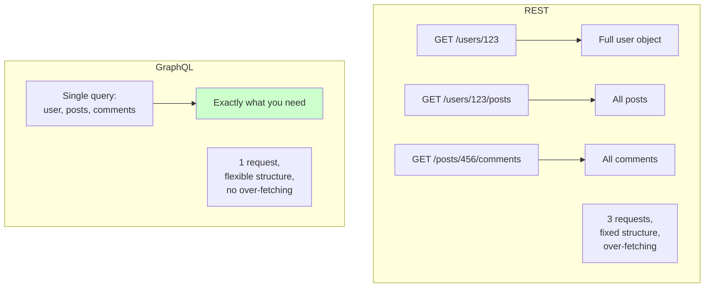

# REST (REpresentational State Transfer)

## Definition

**REST (REpresentational State Transfer)** is an architectural style for designing networked applications, using HTTP methods and URLs to create, read, update, and delete resources.

Think of it as **"treating URLs like nouns and HTTP methods like verbs"** - `GET /users/123` means "get user 123", `DELETE /users/123` means "delete user 123".

## What Problem Does It Solve?

### The Problem: No Standard for Web APIs

**Before REST (early 2000s)**:

Every API was different - custom methods, proprietary protocols, inconsistent naming:

```
❌ Chaos:
/getUserById?id=123
/updateUser123
/deleteUserAccount/123
/getAllUsers
```

**Problems**:
- No consistency (every API different)
- Hard to learn (unique for each service)
- Over-engineered (SOAP, XML-RPC)

**REST Solution**: Standardized approach using HTTP + URLs.

### Why REST Matters



## How It Works

### REST Principles

**1. Resource-Based**: Everything is a resource (users, posts, comments)

```
/users              # Collection of users
/users/123          # Specific user
/users/123/posts    # User's posts
/posts/456/comments # Post's comments
```

**2. HTTP Methods**: Use standard HTTP verbs

```
GET     /users      # Read (list all users)
GET     /users/123  # Read (get user 123)
POST    /users      # Create (new user)
PUT     /users/123  # Update (replace user 123)
PATCH   /users/123  # Update (modify user 123)
DELETE  /users/123  # Delete (remove user 123)
```

**3. Stateless**: Each request is independent (no server-side sessions)



**4. Representations**: Resources can have multiple formats (JSON, XML, HTML)

```bash
# JSON (most common)
GET /users/123
Accept: application/json
→ {"id": 123, "name": "John Doe"}

# XML
GET /users/123
Accept: application/xml
→ <user><id>123</id><name>John Doe</name></user>
```

## Real-World Examples

### Example 1: User Management API

**Resource**: Users

```bash
# List all users
GET /users
→ 200 OK
[
  {"id": 1, "name": "John Doe", "email": "john@example.com"},
  {"id": 2, "name": "Jane Smith", "email": "jane@example.com"}
]

# Get specific user
GET /users/1
→ 200 OK
{"id": 1, "name": "John Doe", "email": "john@example.com"}

# Create new user
POST /users
Body: {"name": "Bob", "email": "bob@example.com"}
→ 201 Created
{"id": 3, "name": "Bob", "email": "bob@example.com"}

# Update user (full replacement)
PUT /users/1
Body: {"name": "John Updated", "email": "john.new@example.com"}
→ 200 OK
{"id": 1, "name": "John Updated", "email": "john.new@example.com"}

# Partially update user
PATCH /users/1
Body: {"email": "john.new@example.com"}
→ 200 OK
{"id": 1, "name": "John Doe", "email": "john.new@example.com"}

# Delete user
DELETE /users/1
→ 204 No Content
```

### Example 2: Blog API with Nested Resources

**Resources**: Posts and Comments

```bash
# List all posts
GET /posts
→ 200 OK
[
  {"id": 1, "title": "First Post", "authorId": 1},
  {"id": 2, "title": "Second Post", "authorId": 2}
]

# Get specific post
GET /posts/1
→ 200 OK
{"id": 1, "title": "First Post", "content": "...", "authorId": 1}

# Get comments for post
GET /posts/1/comments
→ 200 OK
[
  {"id": 1, "text": "Great post!", "postId": 1, "userId": 2},
  {"id": 2, "text": "Thanks!", "postId": 1, "userId": 1}
]

# Create comment on post
POST /posts/1/comments
Body: {"text": "Nice article!", "userId": 3}
→ 201 Created
{"id": 3, "text": "Nice article!", "postId": 1, "userId": 3}

# Get posts by specific user
GET /users/1/posts
→ 200 OK
[
  {"id": 1, "title": "First Post", "authorId": 1},
  {"id": 5, "title": "Another Post", "authorId": 1}
]
```

### Example 3: E-Commerce API

**Resources**: Products, Cart, Orders

```bash
# Browse products
GET /products?category=electronics&minPrice=100&maxPrice=500
→ 200 OK
[
  {"id": 1, "name": "Laptop", "price": 450, "category": "electronics"},
  {"id": 2, "name": "Tablet", "price": 300, "category": "electronics"}
]

# Get product details
GET /products/1
→ 200 OK
{"id": 1, "name": "Laptop", "price": 450, "stock": 10, "category": "electronics"}

# Add to cart
POST /cart/items
Body: {"productId": 1, "quantity": 2}
→ 201 Created
{"id": 1, "productId": 1, "quantity": 2, "price": 900}

# View cart
GET /cart
→ 200 OK
{
  "items": [
    {"productId": 1, "quantity": 2, "price": 900}
  ],
  "total": 900
}

# Place order
POST /orders
Body: {
  "cartId": 1,
  "shippingAddress": "123 Main St",
  "paymentMethod": "credit_card"
}
→ 201 Created
{"orderId": 456, "status": "pending", "total": 900}

# Track order
GET /orders/456
→ 200 OK
{"orderId": 456, "status": "shipped", "trackingNumber": "ABC123"}
```

## How SpecWeave Uses REST

### 1. Planning REST APIs

**During increment planning**, architect designs REST API contract:

```markdown
## Increment 0008: User Management API

### API Endpoints

#### Users Resource

**GET /api/v1/users**
- List all users (paginated)
- Query params: page, limit, sort
- Response: 200 OK + user array

**GET /api/v1/users/:id**
- Get user by ID
- Response: 200 OK + user object | 404 Not Found

**POST /api/v1/users**
- Create new user
- Body: name, email, password
- Response: 201 Created + user object | 400 Bad Request

**PUT /api/v1/users/:id**
- Update user (full replacement)
- Body: name, email, password
- Response: 200 OK + user object | 404 Not Found

**DELETE /api/v1/users/:id**
- Delete user
- Response: 204 No Content | 404 Not Found
```

### 2. REST API Testing

```typescript
// tests/integration/api/users.test.ts
describe('Users API (REST)', () => {
  test('GET /users returns user list', async () => {
    const response = await fetch('http://localhost:3000/api/users');
    expect(response.status).toBe(200);

    const users = await response.json();
    expect(Array.isArray(users)).toBe(true);
  });

  test('POST /users creates new user', async () => {
    const response = await fetch('http://localhost:3000/api/users', {
      method: 'POST',
      headers: { 'Content-Type': 'application/json' },
      body: JSON.stringify({
        name: 'Test User',
        email: 'test@example.com'
      })
    });

    expect(response.status).toBe(201);
    const user = await response.json();
    expect(user.name).toBe('Test User');
  });

  test('GET /users/:id returns 404 for non-existent user', async () => {
    const response = await fetch('http://localhost:3000/api/users/9999');
    expect(response.status).toBe(404);
  });
});
```

### 3. OpenAPI/Swagger Spec

**SpecWeave can generate OpenAPI specs** for REST APIs:

```yaml
# api-spec.yaml
openapi: 3.0.0
info:
  title: User Management API
  version: 1.0.0
paths:
  /users:
    get:
      summary: List users
      parameters:
        - name: page
          in: query
          schema:
            type: integer
            default: 1
        - name: limit
          in: query
          schema:
            type: integer
            default: 20
      responses:
        '200':
          description: User list
          content:
            application/json:
              schema:
                type: array
                items:
                  $ref: '#/components/schemas/User'
    post:
      summary: Create user
      requestBody:
        required: true
        content:
          application/json:
            schema:
              $ref: '#/components/schemas/CreateUserDto'
      responses:
        '201':
          description: User created
          content:
            application/json:
              schema:
                $ref: '#/components/schemas/User'
  /users/{id}:
    get:
      summary: Get user by ID
      parameters:
        - name: id
          in: path
          required: true
          schema:
            type: integer
      responses:
        '200':
          description: User found
        '404':
          description: User not found

components:
  schemas:
    User:
      type: object
      properties:
        id:
          type: integer
        name:
          type: string
        email:
          type: string
          format: email
        createdAt:
          type: string
          format: date-time
    CreateUserDto:
      type: object
      required:
        - name
        - email
      properties:
        name:
          type: string
        email:
          type: string
          format: email
```

## REST vs Other API Styles

### REST vs GraphQL



**REST**:
- ✅ Simple, easy to understand
- ✅ Cacheable (HTTP caching works)
- ✅ Wide adoption
- ❌ Multiple requests for nested data
- ❌ Over-fetching (can't customize response)

**GraphQL**:
- ✅ Single endpoint
- ✅ Client specifies exact data needed
- ❌ More complex setup
- ❌ Caching harder

**[Learn More: GraphQL →](/docs/glossary/terms/graphql)**

### REST vs gRPC

**REST**:
- ✅ Human-readable (JSON)
- ✅ Easy to debug (curl, browser)
- ✅ Works everywhere (HTTP)
- ❌ Slower (JSON parsing, text-based)

**gRPC**:
- ✅ Very fast (binary protocol)
- ✅ Strongly typed (Protocol Buffers)
- ✅ Bidirectional streaming
- ❌ Not human-readable
- ❌ More complex setup

**Learn More: gRPC →**

## Best Practices

### 1. Versioning

**Always version your API**:

```
✅ Good:
/v1/users
/v2/users    # Breaking changes in v2

❌ Bad:
/users       # No version → breaking changes break all clients
```

### 2. Use Nouns for Resources, Not Verbs

```
✅ Good:
GET    /users       # Noun (collection)
POST   /users       # Noun (create)
GET    /users/123   # Noun (specific)

❌ Bad:
GET    /getUsers
POST   /createUser
GET    /getUserById/123
```

### 3. HTTP Status Codes

**Use appropriate status codes**:

```
200 OK               # Success (GET, PUT, PATCH)
201 Created          # Success (POST - resource created)
204 No Content       # Success (DELETE - nothing to return)

400 Bad Request      # Client error (invalid input)
401 Unauthorized     # Not authenticated
403 Forbidden        # Authenticated but not authorized
404 Not Found        # Resource doesn't exist
409 Conflict         # Resource conflict (duplicate email)

500 Internal Error   # Server error
503 Service Unavailable  # Temporary server issue
```

### 4. Pagination

**Paginate large collections**:

```bash
# Query params
GET /users?page=2&limit=20

# Response includes pagination metadata
{
  "data": [...],
  "pagination": {
    "page": 2,
    "limit": 20,
    "total": 150,
    "pages": 8
  }
}
```

### 5. Filtering and Sorting

```bash
# Filtering
GET /users?role=admin&status=active

# Sorting
GET /users?sort=createdAt:desc

# Combined
GET /users?role=admin&sort=name:asc&limit=10
```

### 6. Error Responses

**Consistent error format**:

```json
{
  "error": {
    "code": "VALIDATION_ERROR",
    "message": "Invalid email format",
    "field": "email",
    "details": {
      "value": "not-an-email",
      "expected": "user@example.com"
    }
  }
}
```

## Common Mistakes

### ❌ Mistake 1: Using Verbs in URLs

**Problem**: Makes API inconsistent and hard to learn.

```
❌ Bad:
GET  /getUser/123
POST /createUser
PUT  /updateUser/123

✅ Good:
GET    /users/123
POST   /users
PUT    /users/123
```

### ❌ Mistake 2: Not Using HTTP Methods Correctly

**Problem**: Using GET for actions that modify data.

```
❌ Bad:
GET /deleteUser/123    # GET should be read-only!
GET /updateUser/123?name=John

✅ Good:
DELETE /users/123
PUT    /users/123 (with body)
```

### ❌ Mistake 3: No Versioning

**Problem**: Breaking changes break all clients.

```
❌ Bad:
/users    # Today
/users    # Tomorrow (breaking change) → clients break

✅ Good:
/v1/users  # Old clients keep working
/v2/users  # New clients use v2
```

### ❌ Mistake 4: Exposing Database Structure

**Problem**: Internal structure leaks to API.

```
❌ Bad:
GET /user_accounts    # Database table name
Response: {"user_account_id": 123, "user_email_address": "..."}

✅ Good:
GET /users
Response: {"id": 123, "email": "..."}
```

### ❌ Mistake 5: No Rate Limiting

**Problem**: API gets abused.

```
✅ Solution:
Rate-Limit: 1000 requests/hour
X-RateLimit-Remaining: 999
429 Too Many Requests (when exceeded)
```

## Related Terms

- **[API](/docs/glossary/terms/api)** - REST is one type of API
- **[GraphQL](/docs/glossary/terms/graphql)** - Alternative to REST
- **gRPC** - High-performance alternative
- **[Node.js](/docs/glossary/terms/nodejs)** - Popular runtime for REST APIs
- **Express** - Node.js framework for REST
- **Backend** - REST APIs are backend code
- **[HTTP](/docs/glossary/terms/http)** - Protocol REST is built on
- **[JSON](/docs/glossary/terms/json)** - Common REST response format

## Learn More

- **REST API Design Guide** - Best practices
- **[Richardson Maturity Model](https://martinfowler.com/articles/richardsonMaturityModel.html)** - REST maturity levels
- **[RESTful Web APIs Book](http://restfulwebapis.org/)** - Comprehensive guide
- **[SpecWeave API Development](/docs/guides/api-development)** - Building REST APIs with SpecWeave

---

**Category**: Backend Development

**Tags**: `#rest` `#api` `#http` `#backend` `#web-services` `#architecture`
