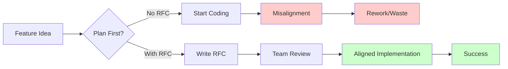
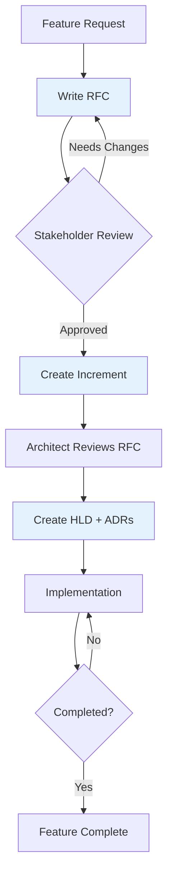
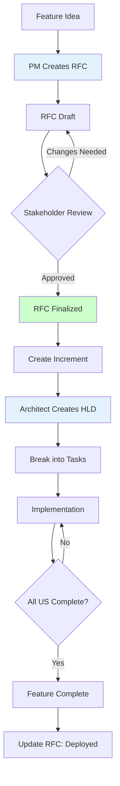

# RFC (Request for Comments)

## Definition

An **RFC (Request for Comments)** is a detailed feature specification document that defines WHAT will be built and WHY it's needed, before implementation begins.

Think of it as **"a blueprint for a building"** - before construction starts, architects create detailed plans showing what the building will look like, how it will function, and why design decisions were made.

## What Problem Does It Solve?

### The Problem: Building Without Planning

**Scenario**: Your team starts building a new feature immediately.

**Without RFC**:
- Developer 1: "I think users need this"
- Developer 2: "Actually, I'm building it differently"
- 2 weeks later: Features don't work together, stakeholders unhappy

**With RFC**:
- Write RFC first (WHAT + WHY)
- Team reviews and agrees
- Implementation follows agreed plan
- Result: Coherent feature, happy stakeholders

### Why RFCs Matter



## How It Works

### RFC Structure

Every RFC follows a standard format:

```markdown
# RFC-NNNN: Feature Name

## Summary
One-paragraph overview: what this feature does and why it matters.

## Motivation
Why are we building this?
- What problem does it solve?
- Who benefits?
- What's the business value?

## User Stories
- US-001: As a [user type], I want [goal], so that [benefit]
- US-002: As a [user type], I want [goal], so that [benefit]

## Acceptance Criteria
- AC-US1-01: Given [context], when [action], then [outcome]
- AC-US1-02: Given [context], when [action], then [outcome]

## Functional Requirements
- FR-001: System shall [requirement]
- FR-002: System shall [requirement]

## Non-Functional Requirements
- NFR-001: Performance: Page load < 2s
- NFR-002: Security: HTTPS only

## Out of Scope
What we're explicitly NOT building in this RFC.

## Success Metrics
How we'll measure if this feature succeeded.

## Dependencies
What needs to exist before we can build this.

## Timeline
Estimated effort and milestones.
```

### Planning Flow



## Real-World Example

### Scenario: User Authentication System

**RFC-0005: User Authentication System**

```markdown
# RFC-0005: User Authentication System

## Summary
Add secure user authentication to our SaaS platform, allowing users to sign up, log in, and manage their accounts. This enables user-specific features and data isolation.

## Motivation

**Problem**: Currently, our app has no user accounts. All data is public and unprotected. We need:
- User-specific data and settings
- Secure access control
- Compliance with GDPR (user data protection)
- Foundation for paid subscriptions

**Business Value**:
- Enable B2B sales (companies require user accounts)
- Reduce support costs (users self-manage accounts)
- Increase retention (personalized experience)

**Who Benefits**:
- End users: Personalized, secure experience
- Business: Monetization path, compliance
- Support team: Self-service reduces tickets

## User Stories

### US-001: Basic Login (P1)
**As a registered user**, I want to log in with email/password, so that I can access my personalized dashboard.

**Acceptance Criteria**:
- AC-US1-01: User can log in with valid credentials (P1, testable)
- AC-US1-02: Invalid credentials show clear error message (P1, testable)
- AC-US1-03: After 5 failed attempts, account locks for 15 minutes (P2, testable)

### US-002: Account Registration (P1)
**As a new user**, I want to create an account, so that I can start using the platform.

**Acceptance Criteria**:
- AC-US2-01: User can register with email + password (P1, testable)
- AC-US2-02: Email confirmation required before login (P1, testable)
- AC-US2-03: Password must meet security requirements (8+ chars, uppercase, number) (P1, testable)

### US-003: Password Reset (P2)
**As a user who forgot password**, I want to reset it via email, so that I can regain access to my account.

**Acceptance Criteria**:
- AC-US3-01: User receives password reset email (P2, testable)
- AC-US3-02: Reset link expires after 1 hour (P2, testable)

### US-004: Session Management (P2)
**As a user**, I want to stay logged in for 7 days, so that I don't have to log in every time.

**Acceptance Criteria**:
- AC-US4-01: "Remember Me" checkbox keeps session active 7 days (P2, testable)
- AC-US4-02: User can log out from all devices (P2, testable)

## Functional Requirements

- FR-001: System shall hash passwords using bcrypt (cost factor 12)
- FR-002: System shall generate JWT tokens for session management
- FR-003: System shall validate email format before registration
- FR-004: System shall send confirmation emails via SendGrid API
- FR-005: System shall rate-limit login attempts (5 per 15 minutes per IP)

## Non-Functional Requirements

- NFR-001: **Performance**: Login response time < 500ms (95th percentile)
- NFR-002: **Security**: All passwords encrypted at rest, HTTPS only
- NFR-003: **Availability**: 99.9% uptime for authentication service
- NFR-004: **Compliance**: GDPR-compliant (password deletion, data export)
- NFR-005: **Scalability**: Handle 10,000 concurrent users

## Out of Scope (Future Work)

❌ **NOT in this RFC**:
- OAuth2 social login (Google, GitHub) → RFC-0010
- Two-factor authentication (2FA) → RFC-0015
- Single Sign-On (SSO) for enterprises → RFC-0020
- Biometric authentication → RFC-0025

## Success Metrics

- ✅ 80%+ registration completion rate
- ✅ < 2% login failures (non-malicious)
- ✅ < 5% password reset requests
- ✅ Zero security incidents in first 3 months
- ✅ 95% user satisfaction (post-launch survey)

## Dependencies

**Must Have Before Implementation**:
- PostgreSQL database (for user storage)
- SendGrid account (for email)
- HTTPS certificate (for secure communication)

**Nice to Have**:
- Redis (for session caching) - can add later

## Technical Constraints

- Must use existing PostgreSQL database (no new DB)
- Must integrate with current Express.js backend
- Must support mobile app (JWT-based, not cookies)

## Timeline

- **Week 1**: Database schema + authentication service
- **Week 2**: Registration + login endpoints
- **Week 3**: Password reset + session management
- **Week 4**: Testing + security audit

**Total Estimate**: 4 weeks (160 hours)

## Related Documents

- **Architecture**: See ADR-008 (JWT vs Sessions)
- **API Design**: See api-contract.yaml
- **Security**: See security-checklist.md
```

**Result**: Clear requirements → Aligned team → Successful implementation → Happy stakeholders

## How SpecWeave Uses RFCs

### Storage Location

```
.specweave/docs/internal/specs/
├── README.md                             # Specs index
├── spec-0005-authentication/
│   ├── spec.md                           # Main RFC document
│   ├── user-flows.md                     # User journey diagrams
│   ├── api-contract.yaml                 # OpenAPI spec
│   └── wireframes/                       # UI mockups
├── spec-0010-oauth-integration/
│   └── spec.md
└── template.md                           # RFC template
```

### Workflow



### When to Create an RFC

✅ **CREATE RFC for**:
- New features (authentication, payments, messaging)
- Major refactoring (monolith → microservices)
- Platform changes (API v2, database migration)
- User-facing changes (UI redesign, new workflow)

❌ **DON'T CREATE RFC for**:
- Bug fixes (use tasks.md directly)
- Minor improvements (use increment spec)
- Internal optimizations (use ADR)
- Dependency updates

### Relationship to Other Documents

```
RFC (WHAT + WHY)
├── Implemented by → Multiple Increments
│   ├── Increment 0007 (US-001, US-002)
│   ├── Increment 0012 (US-003)
│   └── Increment 0018 (US-004)
│
├── Technical Design → HLD (HOW)
│   └── Architecture decisions → ADRs (WHY technical choice)
│
└── External Links → Jira Epic, GitHub Milestone
```

### SpecWeave Commands

```bash
# Create new increment from RFC
/specweave:increment "Implement authentication (RFC-0005)"

# PM agent:
# - Reads RFC-0005 from .specweave/docs/internal/specs/spec-0005-authentication/
# - Extracts relevant user stories (US-001, US-002)
# - Creates increment spec with focused scope
# - Links back to RFC for complete context

# Result: Increment spec references RFC
```

### Example from SpecWeave

**RFC: SpecWeave Plugin Architecture**

```markdown
# RFC: SpecWeave Plugin Architecture

## Summary
Modularize SpecWeave into core framework + optional plugins, reducing context from 50K → 12K tokens for typical projects.

## Motivation

**Problem**: v0.3.7 loads ALL 44 skills regardless of project needs:
- Simple React app: Loads K8s skills (unnecessary)
- Backend API: Loads Figma skills (irrelevant)
- Token usage: 50K+ for every project

**Solution**: Plugin architecture - load only what you need.

## User Stories

- US-001: As a developer, I want minimal token usage for my stack
- US-002: As a user, I want auto-detection of relevant plugins

## Functional Requirements

- FR-001: Core plugin auto-loads (increment lifecycle)
- FR-002: Optional plugins install on-demand
- FR-003: Plugins follow Claude Code native format

## Success Metrics

- 70%+ context reduction (50K → 15K tokens)
- &lt;30s plugin installation time
- Zero breaking changes for existing projects
```

**Implementation**: Divided into multiple increments (0004, 0005, 0006).

## Best Practices

### 1. Write RFC Before Code

**Create RFC FIRST**, not during or after implementation.

❌ Wrong: Build feature → Reverse-engineer RFC → Incomplete docs
✅ Right: Write RFC → Review → Implement

### 2. Include User Stories + Acceptance Criteria

**User stories explain WHO and WHY**, acceptance criteria make it testable:

```markdown
## User Stories

### US-001: Export Data (P1)
**As a user**, I want to export my data to CSV, so that I can analyze it in Excel.

**Acceptance Criteria**:
- AC-US1-01: Export button on dashboard (P1, testable)
- AC-US1-02: CSV includes all fields (name, email, created_at) (P1, testable)
- AC-US1-03: Download completes in &lt;3s for 10K rows (P2, testable)
```

### 3. Define Out of Scope

**Explicitly state what you're NOT building**:

```markdown
## Out of Scope

❌ Excel export (.xlsx format) → Deferred to RFC-0012
❌ PDF export → Not planned
❌ Real-time sync → Different feature
```

Prevents scope creep and sets expectations.

### 4. Link to Brownfield Docs

**If replacing existing functionality, link to current docs**:

```markdown
## Current State

See: `/docs/legacy/auth-v1.md` for existing authentication flow.

## Migration Plan

Phase 1: Run new auth alongside old (feature flag)
Phase 2: Migrate 10% users → test
Phase 3: Full migration
```

### 5. Quantify Success Metrics

**Make success measurable**:

❌ "Users will be happy"
✅ "85%+ user satisfaction score (post-launch survey)"

❌ "Fast performance"
✅ "Page load \&lt;2s (95th percentile)"

## Common Mistakes

### ❌ Mistake 1: RFC = Implementation Plan

**Problem**: Mixing WHAT with HOW.

**RFC Should Contain**:
- ✅ User stories (WHAT users need)
- ✅ Business rationale (WHY building)
- ✅ Acceptance criteria (WHAT success looks like)

**RFC Should NOT Contain**:
- ❌ Database schema details (that's HLD)
- ❌ API endpoint designs (that's plan)
- ❌ Technology choices (that's ADR)

**Solution**: RFC = requirements, HLD/ADR = design decisions.

### ❌ Mistake 2: No Stakeholder Review

**Problem**: Build feature, stakeholders say "not what we wanted".

**Solution**: Get stakeholder approval BEFORE creating increments.

### ❌ Mistake 3: Too Vague

**Problem**: "Add user management system" with no details.

**Solution**: Specific user stories + acceptance criteria.

### ❌ Mistake 4: Scope Creep During Implementation

**Problem**: RFC says 3 user stories, increment implements 10.

**Solution**: Stick to RFC scope. If scope changes, update RFC and get approval.

### ❌ Mistake 5: No Success Metrics

**Problem**: Can't measure if feature succeeded.

**Solution**: Define quantifiable success metrics (completion rate, performance, satisfaction).

## Related Terms

- **[ADR (Architecture Decision Record)](/docs/glossary/terms/adr)** - Technical decisions (WHY this approach), RFC is requirements (WHAT to build)
- **HLD (High-Level Design)** - System architecture (HOW to build), RFC is requirements (WHAT to build)
- **[Increment](/docs/guides/core-concepts/what-is-an-increment)** - Unit of work that implements part of an RFC
- **[User Story](/docs/glossary/terms/user-story)** - Individual feature from user perspective
- **[Acceptance Criteria](/docs/glossary/terms/acceptance-criteria)** - How to verify user story is complete
- **[Brownfield](/docs/glossary/terms/brownfield)** - Existing codebase (RFCs often modify brownfield code)

## Learn More

- **How to Write an RFC** - Step-by-step guide
- **[Planning Workflow](/docs/guides/workflows/planning-workflow)** - RFC → Increment → Implementation
- **[SpecWeave Internal Specs](./.specweave/docs/internal/specs/)** - See RFCs in action

---

**Category**: Planning & Requirements

**Tags**: `#rfc` `#requirements` `#specification` `#planning` `#user-stories`
