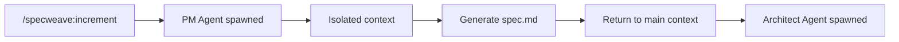

# Skills vs Agents

SpecWeave uses two types of AI components: **Skills** (auto-activating knowledge) and **Agents** (explicitly invoked workers). Understanding the difference is crucial for effective use.

---

## Quick Comparison

| Aspect | Skills | Agents |
|--------|--------|--------|
| **Activation** | Automatic (keywords) | Explicit (`Task()` call) |
| **Context** | Main conversation | Sub-agent (isolated) |
| **Purpose** | Provide knowledge/guidance | Execute complex tasks |
| **Output** | Inline response | Final report |
| **File** | `SKILL.md` | `AGENT.md` |

---

## Skills

**Skills** are knowledge modules that activate automatically when relevant keywords appear in conversation.

### How They Work

```mermaid
graph LR
    A[User: "How do I plan an increment?"] --> B{Keyword Match}
    B -->|"plan", "increment"| C[increment SKILL]
    C --> D[Knowledge loaded into context]
    D --> E[Claude responds with guidance]
```

### Characteristics

- **Auto-activate**: No explicit command needed
- **Main context**: Runs in current conversation
- **Knowledge-focused**: Provide information, not execute tasks
- **Lightweight**: ~2-5K tokens typically

### Example Skills

```
specweave:increment            # Activates for "plan increment"
specweave:brownfield-analyzer  # Activates for "existing project"
specweave:tdd-workflow         # Activates for "TDD", "red-green"
specweave:serverless-recommender  # Activates for "serverless", "Lambda"
```

### Skill File Structure

```markdown
---
description: Plan and create SpecWeave increments with PM and Architect
             agent collaboration. Activates for: increment planning,
             feature planning, hotfix, MVP, new product.
---

# Increment

## When to Activate
[Keywords and scenarios...]

## How to Use
[Guidance and templates...]
```

---

## Agents

**Agents** are specialized workers that execute complex tasks in isolated sub-contexts.

### How They Work



### Characteristics

- **Explicitly invoked**: Via `Task()` tool or commands
- **Isolated context**: Separate from main conversation
- **Task-focused**: Execute and produce output
- **Heavyweight**: Can use 10-50K tokens

### Example Agents

```
frontend:architect              # React/Vue/Angular architecture
backend:db-optimizer            # Database and API design
testing:qa                      # Test strategy and E2E automation
k8s:manifests                   # Kubernetes manifests and GitOps
infra:devops                    # Infrastructure-as-Code, CI/CD
```

**Note**: PM, Architect, Tech-Lead, and QA-Lead are SKILLS (auto-activate), NOT agents.

### Agent File Structure

```markdown
---
name: frontend-architect
description: Frontend architecture agent for React/Vue/Angular.
             Invoked explicitly via Task().
---

# Frontend Architect Agent

## Capabilities
[What the agent can do...]

## Workflow
[Step-by-step process...]

## Output Format
[Expected deliverables...]
```

---

## When to Use Which

### Use Skills When:

- Need information or guidance
- Want auto-activation on keywords
- Response should be inline
- Task is advisory, not generative

**Examples**:
- "How do I handle brownfield projects?" → `brownfield-analyzer` skill
- "What's the TDD workflow?" → `tdd-workflow` skill
- "Which serverless platform?" → `serverless-recommender` skill

### Use Agents When:

- Need to generate complex output
- Task requires isolated context
- Multiple files need creation
- Heavy computation needed

**Examples**:
- Generate spec.md → `pm` agent
- Design architecture → `architect` agent
- Create infrastructure → `devops` agent

---

## Context Management

### Skills: Shared Context

```
Main Context (100K tokens)
├── User conversation
├── Skill 1 (loaded, 3K)
├── Skill 2 (loaded, 2K)
└── Response
```

### Agents: Isolated Context

```
Main Context (100K tokens)
├── User conversation
├── Task() call
│   └── Agent Context (separate)
│       ├── Agent instructions
│       ├── Relevant files
│       └── Generated output
└── Agent report returned
```

---

## Best Practices

### Skills

**DO**:
- Keep skills focused and small
- Use clear activation keywords
- Provide templates and examples
- **Use other skills when needed** (PM → Architect, LSP after code)
- Invoke specialized domain skills (frontend, backend, payments)

**DON'T**:
- Make skills too generic
- Duplicate existing skill functionality
- Skip LSP validation after code generation

### Agents

**DO**:
- Use for multi-step generation
- Keep context isolated
- Return clear reports
- Invoke from skills when task requires isolated execution

**DON'T**:
- Spawn multiple agents **processing same large files** in parallel (context shared)
- Use agents for simple questions
- Skip quality gates
- Process files one by one when dealing with large codebases

---

## Related Terms

- [Role Orchestrator](/docs/glossary/terms/role-orchestrator)
- [Hooks](/docs/glossary/terms/hooks)
- [Increments](/docs/glossary/terms/increments)
