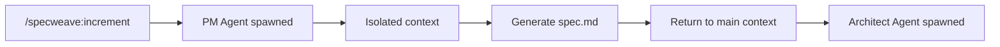

# Skills vs Agents

SpecWeave uses two types of AI components: **Skills** (auto-activating knowledge) and **Agents** (explicitly invoked workers). Understanding the difference is crucial for effective use.

---

## Quick Comparison

| Aspect | Skills | Agents |
|--------|--------|--------|
| **Activation** | Automatic (keywords) | Explicit (`Task()` call) |
| **Context** | Main conversation | Sub-agent (isolated) |
| **Purpose** | Provide knowledge/guidance | Execute complex tasks |
| **Output** | Inline response | Final report |
| **File** | `SKILL.md` | `AGENT.md` |

---

## Skills

**Skills** are knowledge modules that activate automatically when relevant keywords appear in conversation.

### How They Work

```mermaid
graph LR
    A[User: "How do I plan an increment?"] --> B{Keyword Match}
    B -->|"plan", "increment"| C[increment SKILL]
    C --> D[Knowledge loaded into context]
    D --> E[Claude responds with guidance]
```

### Characteristics

- **Auto-activate**: No explicit command needed
- **Main context**: Runs in current conversation
- **Knowledge-focused**: Provide information, not execute tasks
- **Lightweight**: ~2-5K tokens typically

### Example Skills

```
specweave:increment            # Activates for "plan increment"
specweave:brownfield-analyzer  # Activates for "existing project"
specweave:tdd-workflow         # Activates for "TDD", "red-green"
specweave:serverless-recommender  # Activates for "serverless", "Lambda"
```

### Skill File Structure

```markdown
---
description: Plan and create SpecWeave increments with PM and Architect
             agent collaboration. Activates for: increment planning,
             feature planning, hotfix, MVP, new product.
---

# Increment

## When to Activate
[Keywords and scenarios...]

## How to Use
[Guidance and templates...]
```

---

## Agents

**Agents** are specialized workers that execute complex tasks in isolated sub-contexts.

### How They Work


```mermaid
graph LR
    A["/specweave:increment"] --> B[PM Agent spawned]
    B --> C[Isolated context]
    C --> D[Generate spec.md]
    D --> E[Return to main context]
    E --> F[Architect Agent spawned]
```

### Characteristics

- **Explicitly invoked**: Via `Task()` tool or commands
- **Isolated context**: Separate from main conversation
- **Task-focused**: Execute and produce output
- **Heavyweight**: Can use 10-50K tokens

### Example Agents

```
frontend:architect              # React/Vue/Angular architecture
backend:database-optimizer      # Database and API design
testing:qa                      # Test strategy and E2E automation
k8s:kubernetes-architect        # Kubernetes manifests and GitOps
infra:devops                    # Infrastructure-as-Code, CI/CD
```

**Note**: PM, Architect, Tech-Lead, and QA-Lead are SKILLS (auto-activate), NOT agents.

### Agent File Structure

```markdown
---
name: frontend-architect
description: Frontend architecture agent for React/Vue/Angular.
             Invoked explicitly via Task().
---

# Frontend Architect Agent

## Capabilities
[What the agent can do...]

## Workflow
[Step-by-step process...]

## Output Format
[Expected deliverables...]
```

---

## When to Use Which

### Use Skills When:

Choose Skills when you need Claude to perform specialized tasks consistently and efficiently. They're ideal for:

- **Organizational workflows**: Brand guidelines, compliance procedures, document templates
- **Domain expertise**: Excel formulas, PDF manipulation, data analysis, coding patterns
- **Personal preferences**: Note-taking systems, coding conventions, research methods
- **Repetitive instructions**: Anything you find yourself telling Claude more than once

Skills are like training materials — they make Claude better at specific tasks across all conversations. Any Claude instance can load and use them.

**Examples**:
- "How do I handle brownfield projects?" → `brownfield-analyzer` skill
- "What's the TDD workflow?" → `tdd-workflow` skill
- "Which serverless platform?" → `serverless-recommender` skill
- "Always use React Hook Form, not useState" → custom project skill

### Use Agents When:

Use agents (subagents) for complete, self-contained work that handles workflows independently. Each subagent operates with its own configuration — you define what it does, how it approaches problems, and which tools it can access.

- **Task specialization**: Code review, test generation, security audits
- **Context management**: Keep the main conversation focused while offloading specialized work
- **Parallel processing**: Multiple subagents can work on different aspects simultaneously
- **Tool restriction**: Limit specific subagents to safe operations (e.g., read-only access)

Subagents are like specialized employees with their own context and tool permissions.

**Examples**:
- Generate spec.md → `pm` agent
- Design architecture → `architect` agent
- Create infrastructure → `devops` agent

### Use Them Together When:

You want subagents with specialized expertise. For example, a code-review subagent can use Skills for language-specific best practices, combining the independence of a subagent with the portable expertise of Skills.

```
Subagent (isolated context, tool restrictions)
├── Loads project Skills (coding conventions, patterns)
├── Loads domain Skills (language best practices)
└── Executes task with combined expertise
```

---

## Skills vs MCP

MCP connects Claude to data; Skills teach Claude what to do with that data.

| Need | Use | Example |
|------|-----|---------|
| **Access** a database or API | MCP | Query your PostgreSQL database |
| **Procedure** for using that data | Skill | "When querying our database, always filter by date range first" |
| **Read** Excel files | MCP | Open and parse spreadsheet data |
| **Format** Excel reports | Skill | "Format reports with these specific formulas and layouts" |

Use both together: **MCP for connectivity, Skills for procedural knowledge**.

---

## Context Management

### Skills: Shared Context

```
Main Context (100K tokens)
├── User conversation
├── Skill 1 (loaded, 3K)
├── Skill 2 (loaded, 2K)
└── Response
```

### Agents: Isolated Context

```
Main Context (100K tokens)
├── User conversation
├── Task() call
│   └── Agent Context (separate)
│       ├── Agent instructions
│       ├── Relevant files
│       └── Generated output
└── Agent report returned
```

---

## Best Practices

### Skills

**DO**:
- Keep skills focused and small
- Use clear activation keywords
- Provide templates and examples
- **Use other skills when needed** (PM → Architect, LSP after code)
- Invoke specialized domain skills (frontend, backend, payments)

**DON'T**:
- Make skills too generic
- Duplicate existing skill functionality
- Skip LSP validation after code generation

### Agents

**DO**:
- Use for multi-step generation
- Keep context isolated
- Return clear reports
- Invoke from skills when task requires isolated execution

**DON'T**:
- Spawn multiple agents **processing same large files** in parallel (context shared)
- Use agents for simple questions
- Skip quality gates
- Process files one by one when dealing with large codebases

---

## When to Create a Skill

**The repetition signal**: If you find yourself repeatedly giving Claude the same instructions — the same convention, workflow step, or "always do X before Y" — that's your signal to create a skill.

Instead of typing the same guidance every session, capture it in a `SKILL.md` file. Claude will follow it automatically, every time, without reminders.

Think of it as the **DRY principle for AI instructions** — repeating yourself to an AI is like copy-pasting code. It works, but it doesn't scale.

### Examples of repetition → skill opportunities

| You keep saying... | Create a skill for... |
|---|---|
| "Always use React Hook Form, not useState" | Form handling conventions |
| "Run lint before committing" | Pre-commit workflow |
| "Check the design system before creating components" | Component creation rules |
| "Use snake_case for database columns" | Naming conventions |
| "Add error boundaries around async components" | Error handling patterns |

### How to create one

```markdown
# .claude/skills/my-convention/SKILL.md
---
description: Enforces [your pattern]. Activates when [keywords].
---

## Rules
1. Always do X before Y
2. Use Z library for W
3. Never use deprecated pattern Q
```

Once saved, the skill auto-activates when relevant keywords appear — no manual invocation needed.

---

## Decision Framework Summary

| Question | Skills | Subagents | MCP |
|----------|--------|-----------|-----|
| What does it teach? | How to do something | Nothing — it does the work | Nothing — it provides access |
| Who can use it? | Any Claude instance | Spawned by the orchestrator | Any Claude with the server |
| Context model | Shared (main conversation) | Isolated (separate window) | Shared (tool results) |
| Persistence | Always available when loaded | Exists only during task | Always available when connected |
| Best for | Conventions, expertise, procedures | Complex workflows, parallel work | Data access, external services |

---

## Further Reading

- [Skills Explained](https://claude.com/blog/skills-explained) — Anthropic's official guide to Skills, subagents, and MCP
- [Skills, Plugins & Marketplaces Explained](/docs/skills/fundamentals) — How skills, plugins, and marketplaces relate
- [Extensible Skills Standard](/docs/skills/extensible/) — Customizing skills for your project
- [Verified Skills Standard](/docs/skills/verified/) — Security certification for skills

---

## Related Terms

- [Role Orchestrator](/docs/glossary/terms/role-orchestrator)
- [Hooks](/docs/glossary/terms/hooks)
- [Increments](/docs/glossary/terms/increments)
