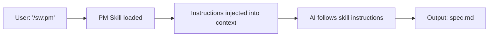
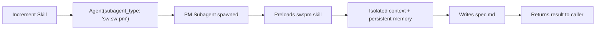

# Skills vs Agents

SpecWeave extends AI coding assistants (Claude Code, Cursor, Copilot, Windsurf, and others) with two core AI components: **Skills** (portable instructions) and **Custom Subagents** (isolated workers with memory). Understanding the difference — and how they compose — is key to building effective AI-assisted workflows.

---

## Quick Comparison

| Aspect | Skills | Custom Subagents |
|--------|--------|-----------------|
| **Activation** | Automatic (keywords) or `/command` | Explicit (`Agent()` call) |
| **Context** | Main conversation or forked (`context: fork`) | Always isolated |
| **Memory** | None (stateless) | Persistent (`memory: project/user/local`) |
| **Resumable** | No | Yes (by agent ID) |
| **Background exec** | No | Yes (`run_in_background: true`) |
| **File** | `skills/name/SKILL.md` | `agents/name.md` |
| **Preloads skills** | No | Yes (`skills:` field) |

---

## Skills

**Skills** are markdown instructions that AI assistants follow. They can auto-activate on keywords, be invoked as `/commands`, or be preloaded by subagents.

### How They Work


```mermaid
graph LR
    A[User: '/sw:pm'] --> B[PM Skill loaded]
    B --> C[Instructions injected into context]
    C --> D[AI follows skill instructions]
    D --> E[Output: spec.md]
```

### Execution Modes

| Mode | When | How |
|------|------|-----|
| **Inline** | Reference knowledge (conventions, patterns) | No `context: fork` — enriches main conversation |
| **Forked** | Standalone tasks (grill, brainstorm) | `context: fork` — isolated context |
| **Preloaded** | Inside a subagent | `skills:` field on subagent — subagent provides isolation |

### Skill File Structure

```markdown
# skills/pm/SKILL.md
---
description: Product Manager for spec-driven development.
context: fork
model: opus
---

# Product Manager Skill

## Workflow
[Phased domain logic, templates, validation rules...]
```

### Example Skills

```
sw:increment          # Orchestrator — spawns PM, Architect, Planner subagents
sw:pm                 # Product management domain logic (preloaded by sw-pm subagent)
sw:architect          # Architecture domain logic (preloaded by sw-architect subagent)
sw:grill              # Code review (standalone, context: fork)
sw:brainstorm         # Multi-perspective ideation (standalone, context: fork)
```

---

## Custom Subagents

**Custom subagents** are isolated AI workers with their own context, persistent memory, and optional skills preloading. They run in a separate conversation, can be resumed, and support background execution.

### How They Work


```mermaid
graph LR
    A[Increment Skill] --> B["Agent(subagent_type: 'sw:sw-pm')"]
    B --> C[PM Subagent spawned]
    C --> D[Preloads sw:pm skill]
    D --> E[Isolated context + persistent memory]
    E --> F[Writes spec.md]
    F --> G[Returns result to caller]
```

### Key Capabilities (beyond Skills)

- **Persistent memory** — retains learnings across sessions (`memory: project`)
- **Resumability** — can be resumed by agent ID for multi-turn workflows
- **Background execution** — runs concurrently while you keep chatting
- **Auto-compaction** — handles context overflow at ~95% capacity
- **Skills preloading** — `skills:` field guarantees domain logic injection at startup
- **Permission overrides** — can restrict tool access for safety

### Subagent File Structure

```markdown
# agents/sw-pm.md
---
name: sw-pm
description: Product Manager for writing spec.md
model: opus
memory: project
skills:
  - sw:pm
---

# Product Manager Subagent

You are a PM specializing in spec-driven development.
The sw:pm skill is preloaded with full domain logic.
```

### SpecWeave Core Subagents

| Subagent | Preloads Skill | Writes | Model |
|----------|---------------|--------|-------|
| `sw-pm` | `sw:pm` | spec.md | Opus |
| `sw-architect` | `sw:architect` | plan.md | Opus |
| `sw-planner` | (inline BDD logic) | tasks.md | Sonnet |

---

## The Recommended Pattern: Subagents Preloading Skills

The most powerful pattern combines both: **subagents own isolation and memory, skills own domain logic**.

```
plugins/specweave/
├── agents/
│   ├── sw-pm.md            # Subagent: memory, model, skills: [sw:pm]
│   ├── sw-architect.md     # Subagent: memory, model, skills: [sw:architect]
│   └── sw-planner.md       # Subagent: memory, model, inline BDD logic
├── skills/
│   ├── pm/
│   │   ├── SKILL.md        # Domain logic, phases, templates
│   │   ├── phases/         # Supporting files loaded on demand
│   │   └── templates/
│   └── architect/
│       └── SKILL.md
```

**How the increment skill orchestrates them:**

```javascript
// PM writes spec.md
Agent({ subagent_type: "sw:sw-pm", prompt: "Write spec for increment..." })

// Architect writes plan.md
Agent({ subagent_type: "sw:sw-architect", prompt: "Design architecture..." })

// Planner writes tasks.md
Agent({ subagent_type: "sw:sw-planner", prompt: "Generate tasks..." })
```

---

## When to Use Which

### Use Skills When:

- **Reference knowledge** — conventions, patterns, style guides that enrich the main conversation
- **Standalone tasks** — one-shot work like code review (`sw:grill`), brainstorming, validation
- **User-invocable commands** — `/sw:pm`, `/sw:grill`, `/sw:brainstorm`
- **Repetitive instructions** — the DRY principle for AI instructions

### Use Custom Subagents When:

- **Persistent memory needed** — agent retains learnings across sessions
- **Resumability needed** — multi-turn workflows that may span sessions
- **Background execution** — run concurrently while user continues chatting
- **Skills preloading** — guarantee domain logic injection at startup
- **Orchestrated pipelines** — PM → Architect → Planner chain

### Use Them Together When:

Subagents preload skills for combined benefits:

```
Subagent (isolation, memory, resumability)
├── Preloads: Domain skill (full logic, phases, templates)
├── Has: Persistent memory across sessions
└── Produces: Deliverable (spec.md, plan.md, tasks.md)
```

### Decision Flowchart

```
Does it need persistent memory or resumability?
  YES → Custom subagent (with skills: preloading)
  NO  →
    Is it a standalone task producing output?
      YES → Skill with context: fork
      NO  →
        Is it reference knowledge for the main conversation?
          YES → Skill, NO context: fork (runs inline)
          NO  → Built-in subagent (Explore/Plan/general-purpose)
```

---

## Beyond Claude: Extending Any AI Tool

While SpecWeave's skills and subagents are most deeply integrated with Claude Code, the architecture is designed to extend **any AI coding assistant**:

| Extension | Claude Code | Cursor / Copilot / Windsurf |
|-----------|------------|----------------------------|
| **Skills** | Full support (auto-activate, `/commands`, `context: fork`) | Via `AGENTS.md` instruction files |
| **Custom subagents** | Full support (memory, resume, background) | Not available (Claude Code exclusive) |
| **Hooks** | Shell scripts on tool events | Not available |
| **MCP servers** | Full support | Varies by tool |
| **Plugins** | Bundle skills + agents + hooks | Skills only (via `AGENTS.md`) |

See `AGENTS.md` in any SpecWeave project for non-Claude tool instructions.

---

## Skills vs MCP

MCP connects AI to data; Skills teach AI what to do with that data.

| Need | Use | Example |
|------|-----|---------|
| **Access** a database or API | MCP | Query your PostgreSQL database |
| **Procedure** for using that data | Skill | "When querying our database, always filter by date range first" |
| **Read** Excel files | MCP | Open and parse spreadsheet data |
| **Format** Excel reports | Skill | "Format reports with these specific formulas and layouts" |

Use both together: **MCP for connectivity, Skills for procedural knowledge**.

---

## Context Management

### Skills: Shared or Forked

```
Main Context (200K tokens)
├── User conversation
├── Inline skill (loaded, 3K)       ← shared context
├── Forked skill (context: fork)    ← isolated context
└── Response
```

### Subagents: Always Isolated

```
Main Context
├── User conversation
├── Agent() call
│   └── Subagent Context (separate)
│       ├── Preloaded skill instructions
│       ├── Persistent memory
│       ├── Relevant files
│       └── Generated output (spec.md, plan.md, etc.)
└── Subagent result returned
```

---

## Decision Framework Summary

| Question | Skills | Custom Subagents | MCP |
|----------|--------|-----------------|-----|
| What does it do? | Provides instructions | Executes isolated work | Provides data access |
| Memory | None | Persistent across sessions | None |
| Context model | Shared or forked | Always isolated | Shared (tool results) |
| Best for | Conventions, expertise, commands | Complex workflows, pipelines | Data access, external services |
| AI tool support | Any (via AGENTS.md) | Claude Code only | Varies |

---

## Further Reading

- [Skills-First Architecture](/docs/guides/core-concepts/skills-first-architecture) — Why skills are the user-facing layer
- [Skills, Plugins & Marketplaces](/docs/skills/fundamentals) — How skills, plugins, and marketplaces relate
- [Extensible Skills Standard](/docs/skills/extensible/) — Customizing skills for your project
- [Claude Code Skills Docs](https://code.claude.com/docs/en/skills) — Official Claude Code skills documentation
- [Claude Code Subagents Docs](https://code.claude.com/docs/en/sub-agents) — Official custom subagents documentation

---

## Related Terms

- [Role Orchestrator](/docs/glossary/terms/role-orchestrator)
- [Hooks](/docs/glossary/terms/hooks)
- [Increments](/docs/glossary/terms/increments)
