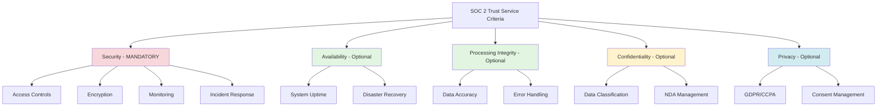
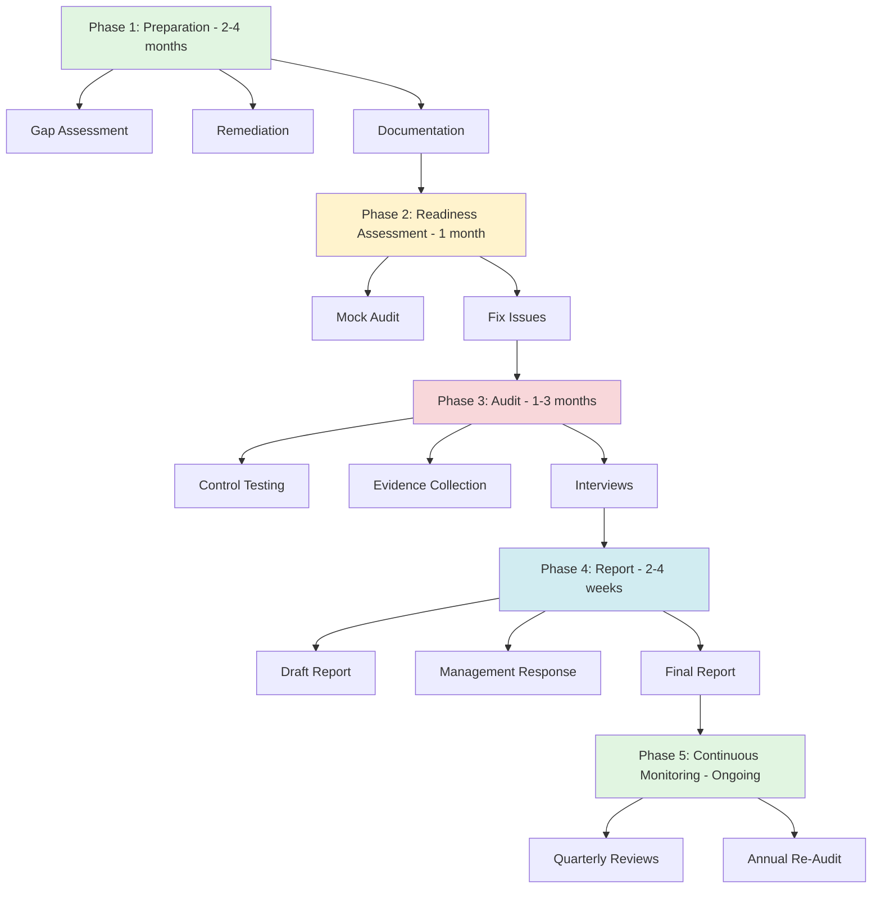

# SOC 2 (Service Organization Control 2)

## Definition

**SOC 2** is an auditing standard developed by the American Institute of CPAs (AICPA) that evaluates how service organizations manage and protect customer data. SOC 2 is designed for technology and cloud computing companies that store customer data, providing assurance that security controls are in place and effective.

**Key Insight**: SOC 2 is not a certification—it's an **audit report** that demonstrates your security posture to customers, investors, and partners. It's the gold standard for SaaS companies.

---

## Why SOC 2 Matters

### The Business Case

**For Service Providers**:
- ✅ **Competitive Advantage**: Many enterprises require SOC 2 before signing contracts
- ✅ **Customer Trust**: Demonstrates commitment to security
- ✅ **Insurance Requirements**: Lower cybersecurity insurance premiums
- ✅ **Investor Confidence**: Due diligence requirement for funding rounds

**For Customers**:
- ✅ **Risk Mitigation**: Third-party validation of security controls
- ✅ **Compliance**: Helps meet regulatory requirements (GDPR, HIPAA)
- ✅ **Due Diligence**: Reduce vendor risk assessments

### Market Reality

**Statistics**:
- 65% of enterprise buyers require SOC 2 compliance
- Average time to first SOC 2: 6-12 months
- Average cost: $20,000 - $100,000 (audit fees + implementation)
- Annual recertification: Required

---

## The Five Trust Service Criteria

SOC 2 evaluates security controls based on **five Trust Service Criteria (TSC)**:



### 1. Security (Mandatory)

**Definition**: Protection against unauthorized access (both physical and logical)

**Key Controls**:
- Access control (RBAC, MFA, least privilege)
- Encryption (data at rest, data in transit)
- Network security (firewalls, VPNs, network segmentation)
- Vulnerability management (patching, penetration testing)
- Incident response plan
- Change management
- System monitoring and logging

**Common Failures**:
- No multi-factor authentication (MFA)
- Weak password policies
- Insufficient logging and monitoring
- No incident response plan documentation

---

### 2. Availability (Optional)

**Definition**: System is available for operation and use as agreed upon

**Key Controls**:
- Uptime monitoring (99.9% SLA)
- Disaster recovery plan (RTO/RPO)
- Backup and restore procedures
- High availability architecture
- Capacity planning

**Example SLA**:
```yaml
Uptime Target: 99.9% (8.76 hours downtime/year)
RTO (Recovery Time Objective): 4 hours
RPO (Recovery Point Objective): 1 hour
Backup Frequency: Every 6 hours
Backup Retention: 30 days (daily), 1 year (monthly)
```

---

### 3. Processing Integrity (Optional)

**Definition**: System processing is complete, valid, accurate, timely, and authorized

**Key Controls**:
- Input validation
- Data integrity checks (checksums, hashes)
- Error handling and logging
- Transaction monitoring
- Reconciliation procedures

**Example**: Payment processor ensuring transactions are processed accurately without duplicate charges or data corruption.

---

### 4. Confidentiality (Optional)

**Definition**: Information designated as confidential is protected

**Key Controls**:
- Data classification (public, internal, confidential, restricted)
- Non-disclosure agreements (NDAs)
- Secure data disposal
- Confidential data handling procedures

**Example**: Legal software handling attorney-client privileged communications.

---

### 5. Privacy (Optional)

**Definition**: Personal information is collected, used, retained, disclosed, and disposed of per privacy policy

**Key Controls**:
- Privacy policy (GDPR, CCPA compliance)
- Consent management
- Data subject access requests (DSAR)
- Right to deletion (RTBF)
- Data breach notification procedures

**Example**: Marketing automation platform handling EU customer data under GDPR.

---

## SOC 2 Type I vs Type II

### Type I: Point-in-Time Assessment

**Definition**: Evaluates whether controls are designed appropriately **at a specific point in time**

**Timeline**: 1-3 months
**Report**: Describes controls and tests design effectiveness
**Use Case**: Initial compliance, proof of intent

**Example Scope**:
- Review policies and procedures (security policy, incident response plan)
- Inspect system configurations (firewall rules, access controls)
- Interview personnel (how processes work)
- Test a small sample of controls (1-2 instances)

**Limitations**: Doesn't prove controls work over time (only tests design, not operating effectiveness)

---

### Type II: Operating Effectiveness Over Time

**Definition**: Evaluates whether controls are **operating effectively over a period** (typically 6-12 months)

**Timeline**: 6-12 months observation period + 2-3 months audit
**Report**: Includes control design + operating effectiveness with evidence
**Use Case**: Required by most enterprises, demonstrates sustained compliance

**Example Scope**:
- Continuous monitoring over 6-12 months
- Test control execution multiple times (e.g., 25 access control tests over 6 months)
- Review audit logs for entire observation period
- Verify incidents were handled per policy

**Why Type II Matters**: Proves controls work consistently, not just once for the auditor.

---

## SOC 2 Audit Process



### Phase 1: Preparation (2-4 Months)

**Activities**:
1. **Gap Assessment**: Compare current state vs SOC 2 requirements
2. **Remediation**: Implement missing controls
3. **Documentation**: Write policies, procedures, runbooks

**Common Gaps**:
- No formal security policy
- Insufficient access controls
- Missing incident response plan
- Inadequate logging and monitoring

---

### Phase 2: Readiness Assessment (1 Month)

**Purpose**: Mock audit to identify issues before the real audit

**Activities**:
- Auditor performs sample testing
- Identifies control weaknesses
- Provides remediation guidance
- Re-test after fixes

**Cost**: $5,000 - $15,000 (optional but highly recommended)

---

### Phase 3: Audit (1-3 Months)

**Activities**:
1. **Opening Meeting**: Scope clarification, timeline agreement
2. **Control Testing**: Auditor tests each control (Type I: once, Type II: multiple times)
3. **Evidence Collection**: Request documentation, screenshots, logs
4. **Interviews**: Speak with personnel (engineers, security team, executives)
5. **System Walkthroughs**: Observe processes in action

**Evidence Examples**:
- Access control: Screenshots of user permissions, MFA settings
- Encryption: TLS configuration files, database encryption proofs
- Monitoring: SIEM dashboard screenshots, alert configurations
- Incident response: Incident tickets, post-mortem reports

---

### Phase 4: Report (2-4 Weeks)

**Report Sections**:
1. **Management Assertion**: Company's statement about control design
2. **Auditor Opinion**: Independent assessment of controls
3. **System Description**: Infrastructure, processes, policies
4. **Control Objectives**: TSC categories being evaluated
5. **Control Activities**: Specific controls tested
6. **Test Results**: Pass/fail for each control
7. **Exceptions**: Controls that failed (if any)

**Report Types**:
- **Unqualified Opinion**: All controls passed (best outcome)
- **Qualified Opinion**: Some controls failed or insufficient evidence
- **Adverse Opinion**: Significant control failures (rare, very bad)

---

## Real-World Example: SaaS Company Getting SOC 2

### Company Profile

**Name**: CloudHR (fictional)
**Product**: Cloud-based HRIS (Human Resources Information System)
**Data**: Employee records, payroll, benefits
**Customers**: 500+ small/mid-size businesses
**Goal**: SOC 2 Type II (Security + Availability)

---

### Implementation Timeline

**Month 1-2: Gap Assessment**
```yaml
Findings:
  Critical:
    - No MFA for admin accounts
    - No formal incident response plan
    - Insufficient logging (only authentication events)
  High:
    - Weak password policy (8 chars, no complexity)
    - No backup testing (backups exist but never restored)
    - No security awareness training
  Medium:
    - No vulnerability scanning
    - No penetration testing
    - Missing security policy documentation
```

**Month 3-5: Remediation**
```yaml
Implementations:
  - Enforce MFA via Okta (all users)
  - Deploy SIEM (Datadog Security Monitoring)
  - Implement comprehensive audit logging (ELK stack)
  - Password policy: 12+ chars, complexity, rotation every 90 days
  - Quarterly backup restoration drills
  - Annual security training (KnowBe4)
  - Weekly vulnerability scans (Qualys)
  - Annual penetration test (hired HackerOne)
  - Wrote 15 security policies (87 pages)
```

**Month 6: Readiness Assessment**
```yaml
Results:
  - 2 control failures identified
  - Remediated within 2 weeks
  - Re-tested and passed
```

**Month 7-12: Observation Period (Type II)**
```yaml
Monitoring:
  - Auditor tested 25 random access control samples
  - Reviewed 6 months of SIEM logs
  - Verified all incidents handled per policy
  - Confirmed backup tests occurred quarterly
```

**Month 13-14: Audit**
```yaml
Process:
  - Submitted 200+ evidence items (policies, screenshots, logs)
  - 5 interviews (CEO, CTO, Security Engineer, DevOps, HR)
  - System walkthrough (demo of access controls, monitoring)
  - No exceptions found
```

**Month 15: Report Received**
```yaml
Outcome: ✅ Unqualified Opinion (SOC 2 Type II - Security + Availability)
Cost: $75,000 total ($50K implementation, $25K audit fees)
Business Impact:
  - Closed 3 enterprise deals (requiring SOC 2)
  - Annual revenue from those deals: $1.2M
  - ROI: 1,500% in first year
```

---

## SpecWeave Integration: SOC 2 Compliance Made Easy

### How SpecWeave Supports SOC 2 Audits

SOC 2 requires **comprehensive documentation and traceability**—exactly what SpecWeave provides through its increment-based workflow.

---

### 1. Control Documentation

**SOC 2 Requires**: Documented security controls and procedures

**SpecWeave Solution**:
```markdown
File: .specweave/docs/internal/architecture/adr/0023-access-control.md

# ADR-023: Role-Based Access Control (RBAC)

## Context
SOC 2 Security TSC CC6.1: Access controls restrict logical access

## Decision
Implement RBAC with three roles: Admin, Manager, User

## Implementation
- Service: auth/RBACService.ts
- Database: RBAC tables with row-level security
- Audit: All access attempts logged

## Testing
- Unit tests: rbac.test.ts (95% coverage)
- Integration tests: rbac-flow.test.ts
- Evidence: tests/reports/rbac-20250104.html

## SOC 2 Mapping
- Control: CC6.1 (Logical access controls)
- Increment: 0015-rbac-implementation
- Evidence: Task completion report, test results
```

---

### 2. Change Management

**SOC 2 Requires**: Change control procedures with approval and testing

**SpecWeave Solution** (increment = natural change control):
```markdown
File: .specweave/increments/0028-encryption-upgrade/spec.md

# Increment 0028: Upgrade Database Encryption

## Rationale
- Current: AES-128 encryption
- Target: AES-256 (SOC 2 Security best practice)

## Approval
- Approved by: CTO (John Doe), Security Lead (Jane Smith)
- Date: 2025-01-10
- Risk Assessment: Low (backward compatible)

## Testing Plan
- Pre-deployment: Test encryption upgrade on staging
- Rollback Plan: Keep AES-128 as fallback for 30 days
- Validation: Decrypt test records, verify data integrity

## Audit Trail
- PR: #245 (approved by 2 reviewers)
- Deployment log: .specweave/increments/0028/logs/deployment-20250115.log
- Verification: Ran decrypt tests post-deployment (100% success)
```

**Auditor Evidence**:
- Increment spec = change request documentation
- Plan.md = change design and risk assessment
- Tasks.md = testing evidence (embedded tests)
- Completion report = proof of successful deployment

---

### 3. Incident Response

**SOC 2 Requires**: Documented incident response procedures and evidence of execution

**SpecWeave Solution**:
```markdown
File: .specweave/docs/internal/operations/incident-response-plan.md

# Incident Response Plan

## Detection
- SIEM alerts (Datadog)
- User reports (support@example.com)
- Automated anomaly detection

## Response Procedure
1. Identify incident severity (P0/P1/P2/P3)
2. Activate incident commander (on-call rotation)
3. Investigate root cause
4. Contain and remediate
5. Post-mortem within 48 hours

## Historical Incidents
- Incident #001: 2024-12-15 - SQL injection attempt (blocked by WAF)
  - Increment 0031: Added WAF rules to prevent recurrence
  - Evidence: .specweave/increments/0031/reports/incident-001-postmortem.md
```

**Auditor Evidence**:
- Policy: Documented incident response plan
- Execution: Post-mortem reports in increment folders
- Improvements: Increments created to address root causes

---

### 4. System Monitoring and Logging

**SOC 2 Requires**: Comprehensive logging of security events

**SpecWeave Solution**:
```markdown
File: .specweave/increments/0020-siem-implementation/spec.md

# Increment 0020: Deploy SIEM (Security Information and Event Management)

## User Stories
- US-001: Log all authentication events (login, logout, MFA)
- US-002: Log all data access (view, create, update, delete)
- US-003: Alert on anomalies (failed logins, privilege escalation)

## Acceptance Criteria
- AC-US1-01: 100% authentication events logged
- AC-US1-02: 100% data access events logged
- AC-US1-03: Alerts configured for 10+ security patterns

## Implementation
- Tool: Datadog Security Monitoring
- Log Retention: 1 year (SOC 2 recommendation)
- Monitoring: 24/7 with on-call rotation

## Verification
- Test: Triggered test alerts (all fired correctly)
- Coverage: Validated 100% of critical events logged
- Evidence: .specweave/increments/0020/reports/COMPLETION-REPORT.md
```

**Auditor Evidence**:
- Spec = logging requirements
- Tests = proof logging works
- Completion report = evidence of deployment

---

### 5. Traceability Matrix

**SOC 2 Requires**: Mapping controls to technical implementations

**SpecWeave Command**: `/specweave:compliance-matrix --standard=soc2`

**Output**:

| SOC 2 Control | Description | AC-ID | Increment | Implementation | Test Evidence |
|---------------|-------------|-------|-----------|----------------|---------------|
| CC6.1 | Logical access controls | AC-US1-01 | 0015 | auth/RBACService.ts | rbac.test.ts (95%) |
| CC6.2 | New user authorization | AC-US1-02 | 0015 | auth/UserOnboarding.ts | onboarding.test.ts (92%) |
| CC6.6 | MFA for privileged users | AC-US2-01 | 0016 | auth/MFAService.ts | mfa.test.ts (98%) |
| CC6.7 | Password complexity | AC-US2-02 | 0016 | auth/PasswordPolicy.ts | password.test.ts (90%) |
| CC7.2 | System monitoring | AC-US3-01 | 0020 | monitoring/SIEMIntegration.ts | siem.test.ts (88%) |
| CC7.3 | Incident response | AC-US4-01 | 0031 | ops/IncidentHandler.ts | incident.test.ts (85%) |

**How Generated**:
1. Spec.md includes SOC 2 control IDs in acceptance criteria
2. Tasks.md maps AC-IDs to implementation files
3. Tests prove controls work (embedded test evidence)
4. Command auto-generates matrix from increment metadata

---

## Common SOC 2 Failures and How to Avoid Them

### 1. Insufficient Evidence

**Problem**: Auditor asks for proof, you can't provide it
**Example**: "Show me evidence that backups were tested in May 2024" → No documentation found

**SpecWeave Solution**:
```bash
# Every backup test creates an increment with evidence
/specweave:increment "Quarterly backup restoration test - Q2 2024"

# Spec.md documents procedure
# Tasks.md includes test steps
# Completion report includes:
#   - Backup file restored: backup-20240501.sql
#   - Restoration time: 45 minutes
#   - Data integrity check: 100% (no corruption)
#   - Screenshot: tests/evidence/backup-restore-20240501.png
```

---

### 2. Undocumented Changes

**Problem**: Production changes with no approval trail
**Example**: Engineer deployed encryption change without review → Auditor flags as control failure

**SpecWeave Solution**: Every production change = increment
```yaml
Increment: 0032-tls-upgrade
Approval: CTO + Security Lead (documented in spec)
Testing: Embedded tests in tasks.md (100% pass)
Deployment: Completion report with deployment log
Rollback: Plan documented in plan.md
```

---

### 3. No Incident Response Evidence

**Problem**: Claim to have incident response plan, but never executed it
**Example**: Auditor asks "Show me your last 3 incidents" → No post-mortems found

**SpecWeave Solution**:
```bash
# Every incident = increment
/specweave:increment "Incident 003: DDoS attack on API gateway"

# Spec.md: What happened, impact, timeline
# Plan.md: Mitigation steps, root cause
# Tasks.md: Remediation tasks (add rate limiting, update WAF)
# Completion report: Evidence of fixes deployed
```

---

### 4. Missing Security Training

**Problem**: No proof employees received security training
**Example**: Auditor asks for training attendance records → HR has no records

**SpecWeave Solution**:
```markdown
File: .specweave/increments/0040-security-training-q1-2025/spec.md

# Increment 0040: Q1 2025 Security Awareness Training

## Participants
- All employees (42 total)
- New hires (3)

## Training Topics
- Phishing awareness
- Password best practices
- Incident reporting

## Completion Report
- Date: 2025-01-20
- Attendance: 100% (42/42)
- Quiz scores: Average 95% (passing: 80%)
- Evidence: training-completion-certificates-q1-2025.pdf
```

---

## SOC 2 Cost Breakdown

### Implementation Costs

| Item | Cost Range | Notes |
|------|------------|-------|
| **Gap Assessment** | $5,000 - $15,000 | Initial audit readiness evaluation |
| **Remediation** | $20,000 - $80,000 | Depends on gaps (tools, staffing) |
| **Tools** | $10,000 - $30,000/year | SIEM, vulnerability scanner, training |
| **Readiness Assessment** | $5,000 - $15,000 | Mock audit (optional but recommended) |
| **Type I Audit** | $10,000 - $30,000 | Point-in-time assessment |
| **Type II Audit** | $20,000 - $50,000 | 6-12 month observation period |
| **Annual Re-Audit** | $15,000 - $40,000 | Required yearly |

**Total First Year**: $70,000 - $200,000
**Annual Ongoing**: $25,000 - $70,000

---

### ROI Calculation

**Example: CloudHR (from earlier)**
```yaml
Investment: $75,000 (Year 1)
Enterprise Deals Closed: 3
Annual Revenue: $1.2M (from those 3 deals)
Customer Retention: +15% (due to trust)
ROI: 1,500% in Year 1
```

**Key Insight**: SOC 2 is expensive, but **required** for enterprise sales. Without it, you can't compete.

---

## Related Standards & Concepts

**Related Glossary Terms**:
- [HIPAA](/docs/glossary/terms/hipaa) - Healthcare data privacy (often requires SOC 2)
- [FDA](/docs/glossary/terms/fda) - Medical device regulations
- Encryption - Core SOC 2 Security control
- Authentication - Access control requirement
- Observability - System monitoring and logging
- Compliance - Regulatory adherence

**External Resources**:
- [AICPA SOC 2 Overview](https://us.aicpa.org/interestareas/frc/assuranceadvisoryservices/aicpasoc2report)
- [Vanta SOC 2 Guide](https://www.vanta.com/resources/soc-2-compliance-guide) - Automation platform
- [Drata SOC 2 Checklist](https://drata.com/resources/soc-2-checklist) - Compliance automation

---

## SpecWeave Commands for SOC 2 Compliance

```bash
# Generate SOC 2 traceability matrix
/specweave:compliance-matrix --standard=soc2

# Validate SOC 2 control coverage
/specweave:compliance-check --standard=soc2

# Auto-generate SOC 2 readiness report
/specweave:compliance-report --standard=soc2 --output=reports/soc2-readiness-2025.pdf

# Create incident response increment
/specweave:incident --severity=P1 --description="DDoS attack on API"
```

---

**Last Updated**: 2025-01-04
**SpecWeave Version**: 0.7.0
**SOC 2 Standard**: AICPA TSC (2017 + 2022 updates)
