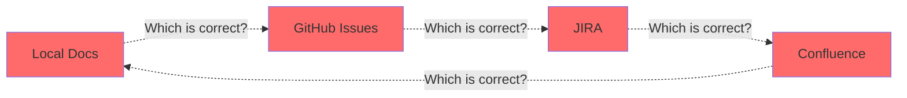
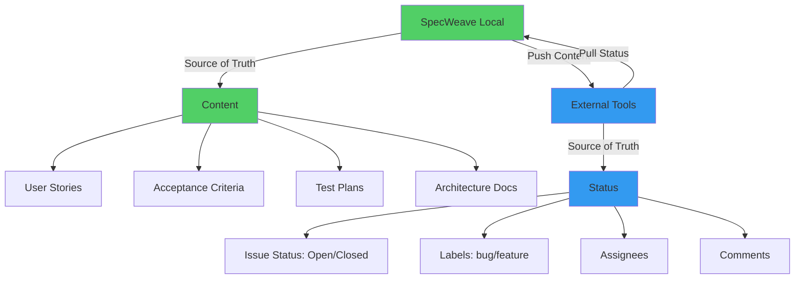
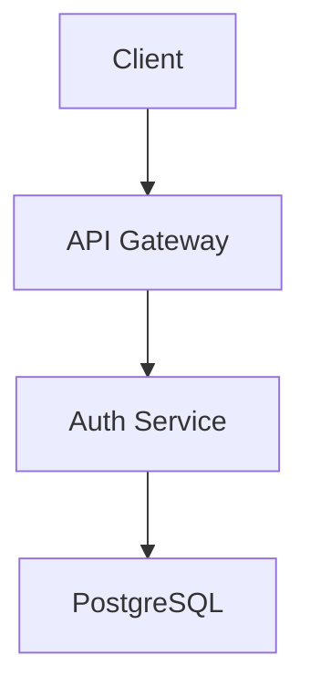
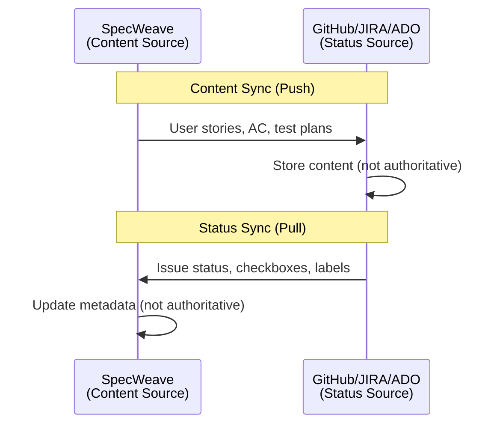
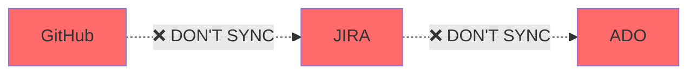
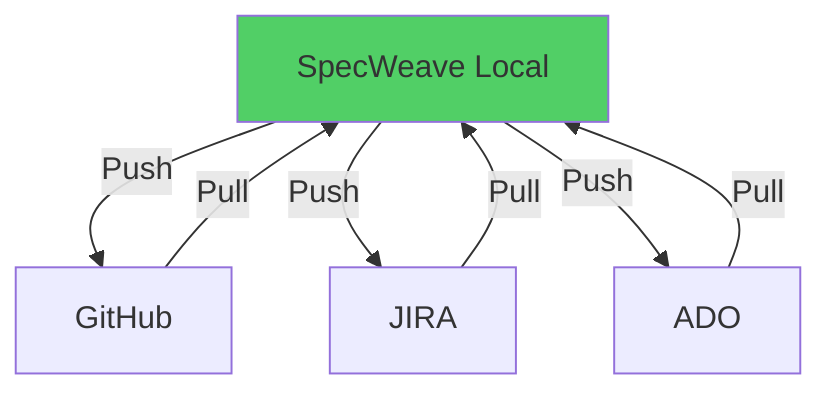
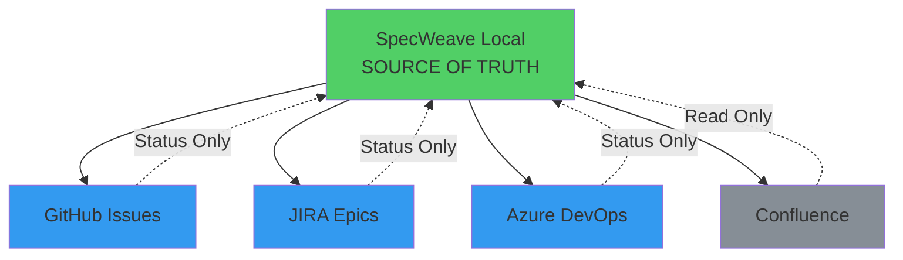

# Source of Truth

**Source of Truth** is the single, authoritative location for data. In SpecWeave's architecture, `.specweave/` is the source of truth for content (user stories, specs, architecture), while external tools (GitHub, JIRA, ADO) are sources of truth for status (issue state, labels, assignees). This split architecture prevents conflicts and ensures clarity.

---

## The Problem with Multiple Sources of Truth

Traditional workflows have **conflicting sources**:



**Problems**:
- ❌ **No clarity** (which version is correct?)
- ❌ **Conflicts** (different data in different systems)
- ❌ **Manual reconciliation** (error-prone)
- ❌ **Data loss** (updates in one system lost in others)
- ❌ **Confusion** (team doesn't know where to look)

---

## Source of Truth Architecture

SpecWeave uses **split source of truth**:



**Benefits**:
- ✅ **Clear ownership** (SpecWeave = content, External = status)
- ✅ **No conflicts** (each system owns its data)
- ✅ **Automatic sync** (bidirectional with clear rules)
- ✅ **Single workflow** (work in either system)
- ✅ **Data integrity** (no loss, no duplication)

---

## What SpecWeave Owns (Content)

SpecWeave is the **source of truth for content**:

### 1. User Stories

```markdown
# US-001: User Login

**As a** user
**I want** to log in with my email and password
**So that** I can access my personalized dashboard
```

**Why SpecWeave?**
- ✅ Structured format (YAML frontmatter, markdown)
- ✅ Version controlled (Git history)
- ✅ Living docs sync (auto-updated)
- ✅ Integrated with specs/architecture

### 2. Acceptance Criteria

```markdown
**Acceptance Criteria**:
- [ ] AC-US1-01: User can log in with valid credentials (P1, testable)
- [ ] AC-US1-02: Invalid credentials show error message (P1, testable)
- [ ] AC-US1-03: 5 failed attempts lock account for 15 minutes (P2, testable)
```

**Why SpecWeave?**
- ✅ AC-ID traceability (AC-US1-01 format)
- ✅ Test coverage tracking
- ✅ Priority/testability metadata

### 3. Test Plans

```markdown
**Test Plan** (BDD format):
- **Given** user with valid credentials → **When** login → **Then** receive JWT token

**Test Cases**:
- Unit (`auth.test.ts`): validLogin, invalidPassword, nonexistentUser → 90% coverage
- Integration (`auth-flow.test.ts`): loginEndpoint, lockedAccount → 85% coverage
```

**Why SpecWeave?**
- ✅ Embedded in tasks.md
- ✅ BDD format (Given/When/Then)
- ✅ Coverage targets per task

### 4. Architecture Documentation

```markdown
### Authentication System Architecture



**Why SpecWeave?**
- ✅ Diagrams (Mermaid format)
- ✅ ADRs (Architecture Decision Records)
- ✅ Living docs sync

### 5. Implementation Details

```markdown
**Implementation**:
1. Create AuthService.ts class
2. Implement password hashing (bcrypt, salt rounds: 10)
3. Implement JWT generation (7-day expiry)
4. Implement rate limiting (Redis-backed)
```

**Why SpecWeave?**
- ✅ Detailed technical specs
- ✅ Step-by-step implementation plans
- ✅ Dependencies tracking

---

## What External Tools Own (Status)

External tools (GitHub, JIRA, ADO) are **sources of truth for status**:

### 1. Issue Status

```
GitHub Issue #30: Open → In Progress → Done
```

**Why External?**
- ✅ Team collaboration (multiple people updating status)
- ✅ Workflow automation (GitHub Actions, JIRA automation)
- ✅ Notifications (team alerted on status changes)

### 2. Task Checkboxes

```markdown
- [x] T-001: Implement password hashing
- [ ] T-002: Create session manager
```

**Why External?**
- ✅ Visual progress (GitHub UI shows checkboxes)
- ✅ Team tracking (everyone sees completion status)
- ✅ Comments attached to tasks

### 3. Labels

```
Labels: [authentication, P1, backend, in-progress]
```

**Why External?**
- ✅ Filtering (filter issues by label in GitHub)
- ✅ Categorization (organize by type/priority)
- ✅ Automation (auto-apply labels based on rules)

### 4. Assignees

```
Assigned to: @anton-abyzov
```

**Why External?**
- ✅ Team coordination (know who's working on what)
- ✅ Notifications (assignee gets alerts)
- ✅ Workload management (see team capacity)

### 5. Comments

```
@john: "Ready for code review"
@mary: "Tested locally, looks good ✅"
```

**Why External?**
- ✅ Team discussions (threaded conversations)
- ✅ Feedback loops (reviews, approvals)
- ✅ Audit trail (history of decisions)

---

## Sync Direction



**Push (Local → External)**:
- ✅ User stories
- ✅ Acceptance criteria
- ✅ Task checklist
- ✅ Test plans
- ✅ Implementation details

**Pull (External → Local)**:
- ✅ Issue status (open/closed)
- ✅ Task checkboxes ([x] complete)
- ✅ Labels (bug/feature/P1)
- ✅ Assignees (who's working)
- ✅ Comments (team discussions)

---

## Conflict Resolution

**What happens when both systems change the same data?**

### Content Conflict (Local Wins)

```bash
# Scenario: Content changes in both systems

# Local: T-001 description updated
"T-001: Implement password hashing with bcrypt"

# External: T-001 description updated (different change)
"T-001: Implement password hashing with argon2"

# Resolution:
# → Local wins (SpecWeave is source of truth for content)
# → Push local description to GitHub
# → Overwrite external change
```

### Status Conflict (External Wins)

```bash
# Scenario: Status changes in both systems

# Local: T-001 marked incomplete
- [ ] T-001: Implement password hashing

# External: T-001 marked complete (GitHub checkbox)
- [x] T-001: Implement password hashing

# Resolution:
# → External wins (GitHub is source of truth for status)
# → Pull external status to local
# → Update local tasks.md: [x] T-001
```

---

## Anti-Patterns

### 1. External-to-External Sync



**Why This is Wrong**:
- ❌ No source of truth (which is correct?)
- ❌ Circular dependencies (A depends on B depends on A)
- ❌ Conflicts (both systems try to win)
- ❌ Data loss (updates lost in sync loops)

**Correct Pattern** (Hub-and-Spoke):


### 2. Manual Updates to External Content

```bash
# ❌ Bad: Edit content in GitHub issue
# 1. Edit GitHub issue description (change user story)
# 2. Hook pulls external description
# 3. Overwrites local spec.md (content should come from local!)
# Result: Local changes lost, confusion

# ✅ Good: Edit content in SpecWeave local
# 1. Edit spec.md locally
# 2. Hook pushes to GitHub
# 3. GitHub issue updated automatically
# Result: Content flows from source of truth (SpecWeave)
```

### 3. Storing Content in External Tools

```bash
# ❌ Bad: Store architecture docs in GitHub wiki
# → Not version controlled with code
# → Not synced to SpecWeave
# → Becomes stale over time

# ✅ Good: Store architecture docs in SpecWeave
# → Version controlled (Git)
# → Living docs sync (always up-to-date)
# → Automatic distribution to external tools
```

---

## Hub-and-Spoke Architecture

SpecWeave uses **hub-and-spoke** model:



**Key Points**:
- ✅ **SpecWeave = Hub** (central source of truth)
- ✅ **External = Spokes** (mirrors, not sources)
- ✅ **Content flows outward** (SpecWeave → External)
- ✅ **Status flows inward** (External → SpecWeave)
- ✅ **No spoke-to-spoke sync** (prevents conflicts)

---

## Why This Matters

### 1. Clear Ownership

```bash
# Traditional: Confusion
Q: "Where do I update the user story?"
A: "Uh... Local? GitHub? JIRA? Confluence?"

# SpecWeave: Clarity
Q: "Where do I update the user story?"
A: "Local SpecWeave (.specweave/increments/####/spec.md)"
```

### 2. No Data Loss

```bash
# Traditional: Data loss
1. Update spec in GitHub issue
2. Someone updates local spec (different change)
3. Sync runs → Which change wins? → Data lost

# SpecWeave: No data loss
1. Update spec locally (source of truth)
2. Sync pushes to GitHub (overwrite)
3. GitHub always has latest from source of truth
```

### 3. Audit Trail

```bash
# Traditional: Fragmented history
- Local: Git history
- GitHub: Issue timeline
- JIRA: Activity log
- Confluence: Version history
→ Four different histories, hard to reconcile

# SpecWeave: Single history
- Local: Git history (complete record)
- External: Mirrors of local (status only)
→ One history, complete audit trail
```

### 4. Onboarding New Developers

```bash
# Traditional: Multiple sources
New dev: "Where do I find the authentication spec?"
Team: "Check GitHub issue #30, JIRA epic AUTH-123, Confluence page, and local docs"
→ Confusing, time-consuming

# SpecWeave: Single source
New dev: "Where do I find the authentication spec?"
Team: ".specweave/docs/internal/specs/spec-001-authentication.md"
→ Clear, immediate
```

---

## Configuration

**Enable Source of Truth Architecture** (`.specweave/config.json`):

```json
{
  "sync": {
    "enabled": true,
    "settings": {
      "syncDirection": "bidirectional",      // Both ways
      "conflictResolution": "split-authority"  // SpecWeave = content, External = status
    }
  },
  "hooks": {
    "post_task_completion": {
      "sync_living_docs": true,              // Update local source of truth
      "external_tracker_sync": true          // Push to external mirrors
    }
  }
}
```

---

## Related Terms

- [Bidirectional Sync](/docs/glossary/terms/bidirectional-sync) - Two-way synchronization
- [Profile-Based Sync](/docs/glossary/terms/profile-based-sync) - Multi-repo sync
- [Living Docs](/docs/glossary/terms/living-docs) - Auto-synced documentation
- [Increments](/docs/glossary/terms/increments) - Increment structure

---

## Summary

**Source of Truth** ensures clarity through split authority:

**SpecWeave Owns (Content)**:
- User stories
- Acceptance criteria
- Test plans
- Architecture docs
- Implementation details

**External Owns (Status)**:
- Issue status (open/closed)
- Task checkboxes ([x] complete)
- Labels (bug/feature)
- Assignees (who's working)
- Comments (team discussions)

**Sync Direction**:
- **Content**: SpecWeave → External (push)
- **Status**: External → SpecWeave (pull)

**Conflict Resolution**:
- **Content conflicts**: SpecWeave wins
- **Status conflicts**: External wins

**Architecture**: Hub-and-spoke (SpecWeave = hub, external = spokes)

**Result**: Clear ownership, no conflicts, no data loss, single audit trail.
