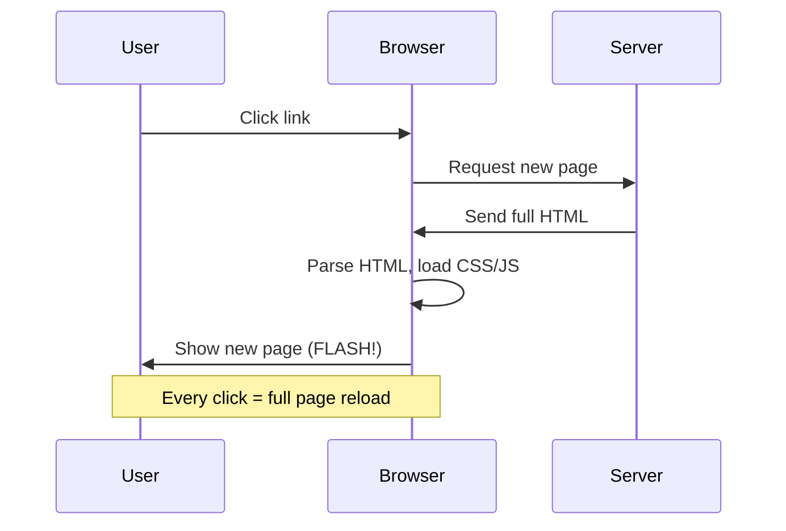
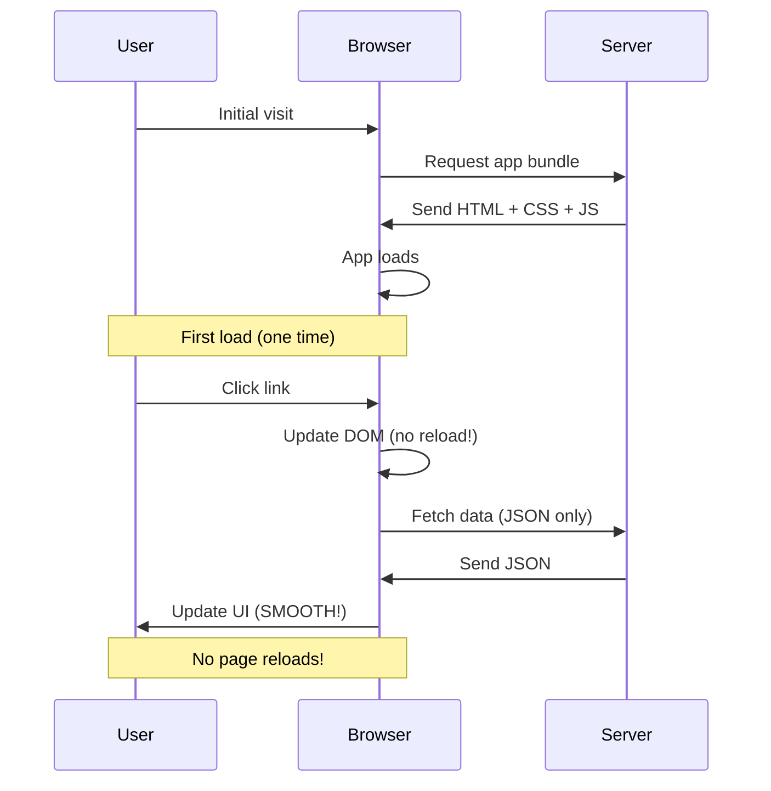
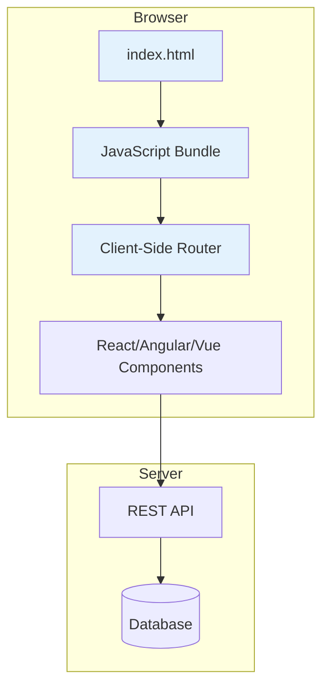
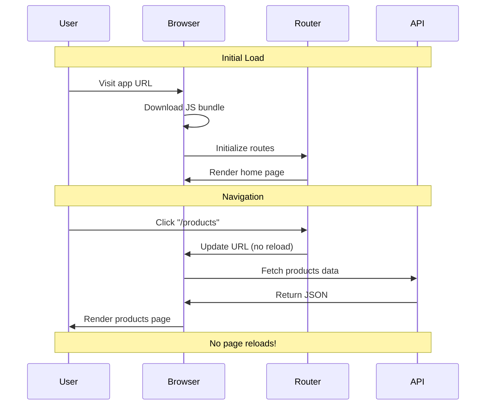

# SPA (Single Page Application)

## Definition

**SPA (Single Page Application)** is a web application that loads a single HTML page and dynamically updates content as the user interacts with the app, without full page reloads.

Think of it as **"a desktop app in your browser"** - smooth, fast, and responsive like Gmail, Twitter, or Facebook.

## What Problem Does It Solve?

### The Problem: Traditional Multi-Page Apps are Slow

**Traditional Multi-Page App** (MPA):



**Problems**:
- ❌ Full page reload on every navigation (white flash)
- ❌ Re-download same CSS/JS on every page
- ❌ Lose JavaScript state (form data, scroll position)
- ❌ Slow, clunky user experience

**Single Page App** (SPA):



**Benefits**:
- ✅ Fast, smooth navigation (no white flash)
- ✅ Only fetch data (JSON), not full pages
- ✅ Maintain state across navigation
- ✅ Desktop-like user experience

## How It Works

### SPA Architecture



### SPA Lifecycle



## Core Concepts

### 1. Client-Side Routing

**Handle navigation without server requests**:

```jsx
// React Router example
import { BrowserRouter, Routes, Route, Link } from 'react-router-dom';

function App() {
  return (
    <BrowserRouter>
      <nav>
        <Link to="/">Home</Link>
        <Link to="/products">Products</Link>
        <Link to="/about">About</Link>
      </nav>

      <Routes>
        <Route path="/" element={<HomePage />} />
        <Route path="/products" element={<ProductsPage />} />
        <Route path="/about" element={<AboutPage />} />
      </Routes>
    </BrowserRouter>
  );
}
```

### 2. Dynamic Content Loading

**Fetch data without page reloads**:

```jsx
function ProductsPage() {
  const [products, setProducts] = useState([]);
  const [loading, setLoading] = useState(true);

  useEffect(() => {
    // Fetch data via API (no page reload)
    fetch('/api/products')
      .then(res => res.json())
      .then(data => {
        setProducts(data);
        setLoading(false);
      });
  }, []);

  if (loading) return <div>Loading products...</div>;

  return (
    <div>
      {products.map(product => (
        <ProductCard key={product.id} product={product} />
      ))}
    </div>
  );
}
```

### 3. State Management

**Maintain application state across navigation**:

```jsx
// Global state persists across page changes
const [cart, setCart] = useState([]);

function addToCart(product) {
  setCart([...cart, product]);
  // Cart state maintained even when navigating to other pages!
}
```

## Real-World Examples

### Example 1: Basic SPA

```jsx
import React, { useState } from 'react';
import { BrowserRouter, Routes, Route, Link, useNavigate } from 'react-router-dom';

function App() {
  const [user, setUser] = useState(null);

  return (
    <BrowserRouter>
      <Header user={user} />

      <Routes>
        <Route path="/" element={<HomePage />} />
        <Route path="/products" element={<ProductsPage />} />
        <Route path="/product/:id" element={<ProductDetailPage />} />
        <Route path="/cart" element={<CartPage user={user} />} />
        <Route path="/login" element={<LoginPage onLogin={setUser} />} />
      </Routes>
    </BrowserRouter>
  );
}

function ProductsPage() {
  const navigate = useNavigate();

  const viewProduct = (id) => {
    // Navigate without page reload
    navigate(`/product/${id}`);
  };

  return (
    <div>
      <h1>Products</h1>
      {products.map(product => (
        <button key={product.id} onClick={() => viewProduct(product.id)}>
          {product.name}
        </button>
      ))}
    </div>
  );
}
```

### Example 2: SPA with API Integration

```jsx
function Dashboard() {
  const [data, setData] = useState(null);
  const [refreshing, setRefreshing] = useState(false);

  // Initial load
  useEffect(() => {
    fetchDashboardData();
  }, []);

  const fetchDashboardData = async () => {
    setRefreshing(true);
    const response = await fetch('/api/dashboard');
    const json = await response.json();
    setData(json);
    setRefreshing(false);
  };

  const handleRefresh = () => {
    // Refresh data without page reload
    fetchDashboardData();
  };

  return (
    <div>
      <button onClick={handleRefresh} disabled={refreshing}>
        {refreshing ? 'Refreshing...' : 'Refresh'}
      </button>

      {data && (
        <>
          <Stats data={data.stats} />
          <Charts data={data.charts} />
          <RecentActivity data={data.activity} />
        </>
      )}
    </div>
  );
}
```

### Example 3: SPA with Authentication

```jsx
function App() {
  const [user, setUser] = useState(null);
  const [loading, setLoading] = useState(true);

  // Check if user is logged in (on app load)
  useEffect(() => {
    fetch('/api/me')
      .then(res => res.json())
      .then(user => {
        setUser(user);
        setLoading(false);
      })
      .catch(() => {
        setLoading(false);
      });
  }, []);

  if (loading) return <div>Loading app...</div>;

  return (
    <BrowserRouter>
      <Routes>
        <Route path="/login" element={<LoginPage onLogin={setUser} />} />
        <Route
          path="/*"
          element={
            user ? <AuthenticatedApp user={user} /> : <Navigate to="/login" />
          }
        />
      </Routes>
    </BrowserRouter>
  );
}
```

## SPA vs Traditional Multi-Page App

```mermaid
graph TB
    subgraph "Multi-Page App (MPA)"
        MPA1[Page 1 Request] --> MPA2[Server Generates HTML]
        MPA2 --> MPA3[Browser Renders]
        MPA3 --> MPA4[User Clicks Link]
        MPA4 --> MPA5[Page 2 Request]
        MPA5 --> MPA6[Server Generates HTML]
        MPA6 --> MPA7[Browser Renders FULL RELOAD]
    end

    subgraph "Single Page App (SPA)"
        SPA1[Initial Load] --> SPA2[JS Bundle Downloaded]
        SPA2 --> SPA3[App Initializes]
        SPA3 --> SPA4[User Clicks Link]
        SPA4 --> SPA5[Router Updates]
        SPA5 --> SPA6[Fetch JSON Data]
        SPA6 --> SPA7[Update DOM NO RELOAD]
    end

    style MPA7 fill:#ff6b6b
    style SPA7 fill:#51cf66
```



### Comparison Table

| Aspect | Multi-Page App (MPA) | Single Page App (SPA) |
|--------|---------------------|----------------------|
| **Navigation** | Full page reload | Client-side routing (no reload) |
| **Initial Load** | Fast (one page) | Slower (download JS bundle) |
| **Subsequent Navigation** | Slow (reload) | Fast (no reload) |
| **SEO** | ✅ Excellent (server HTML) | ❌ Poor (client-only) |
| **User Experience** | ❌ Clunky (white flash) | ✅ Smooth (desktop-like) |
| **Browser Back Button** | ✅ Works natively | ⚠️ Needs router setup |
| **State Management** | ❌ Lost on reload | ✅ Maintained |
| **Offline Support** | ❌ None | ✅ Possible (service workers) |
| **Best For** | Blogs, documentation | Dashboards, apps |

## How SpecWeave Uses SPAs

### 1. SPA Project Structure

```
my-spa-app/
├── .specweave/
│   ├── increments/
│   │   └── 0001-spa-setup/
│   │       ├── spec.md
│   │       ├── plan.md
│   │       └── tasks.md
│   └── docs/
│       └── internal/
│           └── architecture/
│               ├── routing-strategy.md
│               └── adr/
│                   └── 0001-react-router-choice.md
├── src/
│   ├── pages/          # Page components
│   ├── components/     # Reusable components
│   ├── api/            # API client
│   ├── router/         # Routing config
│   └── App.tsx
└── package.json
```

### 2. Planning SPA Features

**Increment spec**:

```markdown
# Increment 0009: User Dashboard SPA

## User Stories

**US-001**: Client-side routing
- [ ] AC-US1-01: Navigate between pages without reload
- [ ] AC-US1-02: Browser back/forward buttons work
- [ ] AC-US1-03: URL updates reflect current page

**US-002**: Data fetching
- [ ] AC-US2-01: Fetch dashboard data on mount
- [ ] AC-US2-02: Show loading state
- [ ] AC-US2-03: Handle errors gracefully

**US-003**: State management
- [ ] AC-US3-01: Cart state persists across navigation
- [ ] AC-US3-02: User auth state global
- [ ] AC-US3-03: Optimistic UI updates

## Architecture

**Routing**: React Router v6
**State Management**: React Context + useState
**API Client**: Fetch API with error handling
**Performance**: Code splitting per route
```

### 3. SPA + SpecWeave Workflow

```mermaid
graph TB
    A[/specweave:increment "Dashboard SPA"] --> B[PM: Define User Flows]
    B --> C[Architect: Design Routing Structure]
    C --> D[/specweave:do]
    D --> E[Setup Router]
    E --> F[Implement Pages]
    F --> G[Add State Management]
    G --> H[Test Navigation]
    H --> I[/specweave:done]

    style B fill:#61dafb
    style C fill:#61dafb
```

## SPA Challenges & Solutions

### Challenge 1: SEO (Search Engine Optimization)

**Problem**: SPAs render content client-side, so search engines can't index it.

**Solutions**:

1. **Server-Side Rendering (SSR)** - Use Next.js

```jsx
// Next.js SSR
export async function getServerSideProps() {
  const posts = await fetchPosts();
  return { props: { posts } };
}
```

**[Learn More: SSR →](/docs/glossary/terms/ssr)**

2. **Static Site Generation (SSG)** - Pre-render at build time

```jsx
// Next.js SSG
export async function getStaticProps() {
  const posts = await fetchPosts();
  return { props: { posts } };
}
```

**[Learn More: SSG →](/docs/glossary/terms/ssg)**

3. **Pre-rendering Services** - Use Prerender.io, Rendertron

### Challenge 2: Initial Load Time

**Problem**: Large JavaScript bundle = slow first load.

**Solutions**:

1. **Code Splitting** - Split bundle per route

```jsx
import { lazy, Suspense } from 'react';

const Dashboard = lazy(() => import('./pages/Dashboard'));
const Products = lazy(() => import('./pages/Products'));

function App() {
  return (
    <Suspense fallback={<div>Loading...</div>}>
      <Routes>
        <Route path="/dashboard" element={<Dashboard />} />
        <Route path="/products" element={<Products />} />
      </Routes>
    </Suspense>
  );
}
```

2. **Tree Shaking** - Remove unused code

```javascript
// webpack.config.js
module.exports = {
  optimization: {
    usedExports: true
  }
};
```

3. **Lazy Load Images** - Load images on demand

```jsx
import { LazyLoadImage } from 'react-lazy-load-image-component';

<LazyLoadImage src="/hero.jpg" alt="Hero" />
```

### Challenge 3: Browser History

**Problem**: SPA navigation doesn't update URL by default.

**Solution**: Use HTML5 History API (built into routers)

```jsx
// React Router handles this automatically
import { BrowserRouter } from 'react-router-dom';

// URLs update: /home → /products → /cart
```

## SPA Best Practices

### ✅ Do

1. **Use client-side router** (React Router, Vue Router)
2. **Implement code splitting** (per route)
3. **Show loading states** (for async operations)
4. **Handle errors gracefully** (network failures)
5. **Optimize bundle size** (tree shaking, lazy loading)
6. **Use SSR/SSG for SEO** (if public-facing)
7. **Implement service workers** (offline support)

### ❌ Don't

1. **Don't load entire app upfront** (use code splitting)
2. **Don't forget SEO** (use SSR/SSG if needed)
3. **Don't ignore browser back button** (use router)
4. **Don't fetch all data upfront** (lazy load)
5. **Don't forget error handling** (network failures)

## Common Patterns

### 1. Protected Routes

```jsx
function PrivateRoute({ children }) {
  const { user } = useAuth();

  return user ? children : <Navigate to="/login" />;
}

// Usage
<Route
  path="/dashboard"
  element={
    <PrivateRoute>
      <Dashboard />
    </PrivateRoute>
  }
/>
```

### 2. Data Prefetching

```jsx
function ProductsPage() {
  const [products, setProducts] = useState([]);

  useEffect(() => {
    // Prefetch data when component mounts
    fetchProducts().then(setProducts);
  }, []);

  // Prefetch next page data on hover
  const handleProductHover = (id) => {
    prefetchProduct(id); // Load in background
  };

  return (
    <div>
      {products.map(product => (
        <Link
          key={product.id}
          to={`/product/${product.id}`}
          onMouseEnter={() => handleProductHover(product.id)}
        >
          {product.name}
        </Link>
      ))}
    </div>
  );
}
```

### 3. Optimistic UI Updates

```jsx
function LikeButton({ postId, initialLiked }) {
  const [liked, setLiked] = useState(initialLiked);

  const handleLike = async () => {
    // Update UI immediately (optimistic)
    setLiked(!liked);

    try {
      // Send request to server
      await api.toggleLike(postId);
    } catch (error) {
      // Revert on error
      setLiked(liked);
      alert('Failed to like post');
    }
  };

  return (
    <button onClick={handleLike}>
      {liked ? '❤️ Liked' : '🤍 Like'}
    </button>
  );
}
```

## Common Mistakes

### ❌ Mistake 1: Not Handling Loading States

```jsx
// ❌ WRONG - No loading state
function Products() {
  const [products, setProducts] = useState([]);

  useEffect(() => {
    fetchProducts().then(setProducts);
  }, []);

  return products.map(p => <div>{p.name}</div>); // Renders nothing initially!
}

// ✅ CORRECT - Show loading state
function Products() {
  const [products, setProducts] = useState([]);
  const [loading, setLoading] = useState(true);

  useEffect(() => {
    fetchProducts().then(data => {
      setProducts(data);
      setLoading(false);
    });
  }, []);

  if (loading) return <div>Loading...</div>;
  return products.map(p => <div>{p.name}</div>);
}
```

### ❌ Mistake 2: Not Using Router

```jsx
// ❌ WRONG - Manual navigation (breaks back button)
function Navbar() {
  return (
    <button onClick={() => window.location.href = '/products'}>
      Products
    </button>
  );
}

// ✅ CORRECT - Use router
import { Link } from 'react-router-dom';

function Navbar() {
  return <Link to="/products">Products</Link>;
}
```

### ❌ Mistake 3: Large Bundle Size

```jsx
// ❌ WRONG - Import everything upfront
import Dashboard from './Dashboard';
import Products from './Products';
import About from './About';

// ✅ CORRECT - Code split
const Dashboard = lazy(() => import('./Dashboard'));
const Products = lazy(() => import('./Products'));
const About = lazy(() => import('./About'));
```

## Related Terms

- **[React](/docs/glossary/terms/react)** - Popular SPA framework
- **[Next.js](/docs/glossary/terms/nextjs)** - React with SSR/SSG (hybrid approach)
- **[SSR](/docs/glossary/terms/ssr)** - Server-side rendering (solves SPA SEO)
- **[SSG](/docs/glossary/terms/ssg)** - Static site generation (alternative to SPA)
- **Frontend** - Client-side development

## Learn More

- **SPA Architecture Guide** - Deep dive into SPAs
- **React Router Tutorial** - Client-side routing
- **[Next.js Guide](/docs/glossary/terms/nextjs)** - Hybrid approach (SPA + SSR)
- **[SpecWeave Frontend Plugin](/docs/plugins/frontend-stack)** - SPA-specific features

---

**Category**: Frontend Development

**Tags**: `#spa` `#single-page-app` `#react` `#routing` `#frontend` `#client-side`
