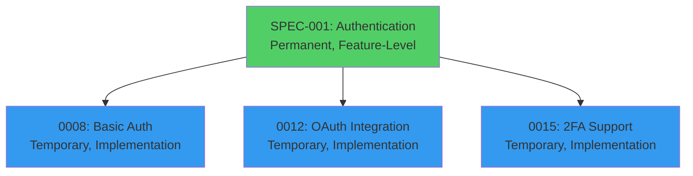
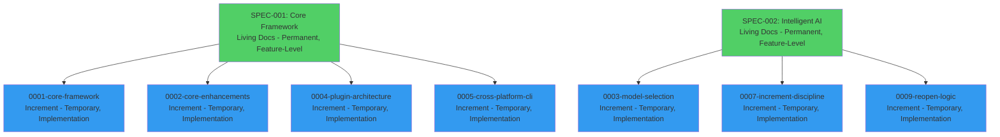

# Specifications (Specs)

**A Specification (Spec)** is a comprehensive document that defines WHAT needs to be built, including user stories, acceptance criteria, business rationale, and success metrics. In SpecWeave, specs exist in TWO locations: **permanent living docs** (complete feature-level knowledge base) and **temporary increment specs** (focused implementation tracker).

---

## The Core Question: Why Two Locations?

SpecWeave uses specs in TWO locations for different purposes:

1. **Living Docs Specs**: `.specweave/docs/internal/specs/{project-id}/spec-NNN-feature-area.md` - **Permanent, feature-level knowledge base**
2. **Increment Specs**: `.specweave/increments/####-name/spec.md` - **Temporary, focused implementation snapshot**

**Key Difference**: Specs use **3-digit numbers** (001, 002, 003) for **feature areas**, increments use **4-digit numbers** (0001, 0002, 0003) for **implementations**.



---

## Living Docs Specs (Permanent Knowledge Base)

### Purpose

**COMPLETE, PERMANENT** source of truth for entire feature area

**Location**: `.specweave/docs/internal/specs/default/spec-001-core-framework.md` (single project)
or `.specweave/docs/internal/specs/web-app/spec-001-user-auth.md` (multi-project)

**Lifecycle**: Created once, updated over time, NEVER deleted

**Scope**: Comprehensive feature area (e.g., "Authentication", 10-50 user stories)

### What It Contains

```markdown
---
title: User Authentication
spec_id: 001
project: backend
status: in-progress
created: 2025-09-01
last_updated: 2025-11-10
---

# SPEC-001: User Authentication

Complete authentication system with email/password, OAuth, 2FA, and session management.

## Quick Overview

Authentication system providing secure login, session management, and authorization
for all backend services. Supports multiple authentication methods and integrates
with enterprise SSO.

## Increments (Implementation History)

| Increment | Description | Status | Completed |
|-----------|-------------|--------|-----------|
| 0008-basic-auth | Email/password login | ✅ Complete | 2025-09-15 |
| 0012-oauth-integration | OAuth with Google/GitHub | ✅ Complete | 2025-10-01 |
| 0015-2fa-support | Two-factor authentication | ⏳ In Progress | TBD |
| 0018-sso-integration | Enterprise SSO (SAML) | 📋 Planned | TBD |

## User Stories (35 total across all increments)

### US-001: Basic Login Flow (Increment 0008) ✅
**As a** user
**I want** to log in with email and password
**So that** I can access my personalized dashboard

**Acceptance Criteria**:
- [x] **AC-US1-01**: User can log in with valid credentials (P1, testable)
- [x] **AC-US1-02**: Invalid credentials show error (P1, testable)
- [x] **AC-US1-03**: 5 failed attempts lock account 15min (P2, testable)

**Implementation**: Increment 0008-basic-auth
**Test Coverage**: 90% (target: 85%)
**Status**: Complete ✅

### US-002: Session Management (Increment 0008) ✅
(Similar format...)

### US-003: Password Reset (Increment 0008) ✅
(Similar format...)

### US-004: OAuth Google Login (Increment 0012) ✅
(Similar format...)

### US-005: OAuth GitHub Login (Increment 0012) ✅
(Similar format...)

... (30 more user stories)

## External References

### GitHub
- **Project**: https://github.com/orgs/company/projects/5
- **Epic**: https://github.com/company/app/issues/123

### JIRA
- **Epic**: AUTH-1 (Authentication System)
- **URL**: https://company.atlassian.net/browse/AUTH-1

### Azure DevOps
- **Feature**: 456 (Authentication)
- **URL**: https://dev.azure.com/company/project/_workitems/456

## Brownfield Documentation

Links to existing project documentation:
- Confluence: https://company.atlassian.net/wiki/spaces/PROJ/pages/auth
- GitHub Wiki: https://github.com/company/app/wiki/Authentication
- Notion: https://notion.so/company/auth-design

## Architecture Decisions

- [ADR-008: Why JWT over Sessions](../../architecture/adr/0008-jwt-vs-sessions.md)
- [ADR-012: Why OAuth 2.0 over SAML](../../architecture/adr/0012-oauth-vs-saml.md)
- [ADR-015: Why bcrypt over Argon2](../../architecture/adr/0015-password-hashing.md)

## Success Criteria

### Functional
- ✅ All 35 user stories implemented
- ✅ All acceptance criteria met
- ✅ Security audit passed

### Non-Functional
- ✅ Login latency &lt;200ms (p99)
- ✅ 99.9% uptime SLA
- ✅ Support 10,000 concurrent users
- ✅ OWASP Top 10 compliance

### Business
- ✅ Reduce support tickets by 30% (password resets)
- ✅ Increase user engagement by 20% (OAuth simplifies login)
- ✅ Meet SOC 2 compliance requirements
```

### Key Benefits

**1. Complete History**

Living docs preserve **complete implementation history**:
- Which increments implemented which user stories
- When each feature was completed
- Why decisions were made (ADRs)
- How to use the system (architecture docs)

**2. Onboarding New Developers**

New developers can **read living docs** to understand the project:
```bash
# New developer joins team
# Reads: .specweave/docs/internal/specs/spec-001-authentication.md

# Learns:
# - What was built (35 user stories)
# - Why decisions were made (3 ADRs)
# - How to use the system (architecture docs)
# - What tests exist (test coverage: 90%)

# Result: Productive in hours, not weeks
```

**3. External PM Tool Integration**

Living docs link to external PM tools:
- Jira epic → Living docs spec (permanent link)
- GitHub Project → Living docs spec
- Azure DevOps Feature → Living docs spec

**4. Brownfield Integration**

Living docs link to existing project documentation:
- Confluence pages
- GitHub Wiki
- Notion docs
- Legacy documentation

---

## Increment Specs (Temporary Implementation Tracker)

### Purpose

**TEMPORARY** implementation reference (what am I building THIS iteration?)

**Location**: `.specweave/increments/0008-user-authentication/spec.md`

**Lifecycle**: Created per increment, can be deleted after completion

**Scope**: Focused subset (3-5 user stories for this increment only)

### What It Contains

```markdown
---
title: Basic User Authentication
increment: 0008-user-authentication
status: implementation
priority: P1
estimated_hours: 80
actual_hours: TBD
---

# Increment 0008: Basic User Authentication

**Implements**: SPEC-001-authentication (US-001 to US-003 only)
**Complete Specification**: See ../../docs/internal/specs/spec-001-authentication.md

## Quick Overview

Implement basic authentication with email/password, session management,
and rate limiting. First increment of SPEC-001 authentication system.

## User Stories (This Increment Only)

### US-001: Basic Login Flow
**As a** user
**I want** to log in with email and password
**So that** I can access my personalized dashboard

**Acceptance Criteria**:
- [ ] **AC-US1-01**: User can log in with valid credentials (P1, testable)
- [ ] **AC-US1-02**: Invalid credentials show error (P1, testable)
- [ ] **AC-US1-03**: 5 failed attempts lock account 15min (P2, testable)

### US-002: Session Management
(Similar format, but focused on THIS increment only)

### US-003: Password Reset
(Similar format, but focused on THIS increment only)

## Out of Scope (For This Increment)

Deferred to future increments:
- ❌ OAuth integration (Google, GitHub) → Increment 0012
- ❌ Two-factor authentication (2FA) → Increment 0015
- ❌ Enterprise SSO (SAML) → Increment 0018
- ❌ Biometric authentication → Increment 0020

## Success Criteria (This Increment)

- ✅ All 3 user stories implemented
- ✅ 85%+ test coverage
- ✅ Security audit passed
- ✅ Performance: &lt;200ms login latency
```

### Key Benefits

**1. Focused Scope**

Increment specs contain **only what's being built RIGHT NOW**:
- 3-5 user stories (focused)
- Not 35 user stories (overwhelming)

**2. Quick Reference**

Developers can quickly see:
- What am I building? (US-001 to US-003)
- What's NOT in scope? (OAuth, 2FA, SSO)
- What's the success criteria? (85% coverage, &lt;200ms latency)

**3. Clean After Completion**

Increment specs can be **deleted after completion** (optional):
- Living docs remain (permanent knowledge base)
- Increment specs are temporary (can be cleaned up)

---

## Comparison: Living Docs vs Increment Specs

| Aspect | Living Docs Specs | Increment Specs |
|--------|------------------|----------------|
| **Location** | `.specweave/docs/internal/specs/` | `.specweave/increments/####/` |
| **Lifecycle** | ✅ Permanent (never deleted) | ⏳ Temporary (optional deletion) |
| **Scope** | 📚 Complete feature (35 US) | 🎯 Focused subset (3 US) |
| **Size** | 500+ lines (comprehensive) | 50-100 lines (focused) |
| **Purpose** | Knowledge base + history | Implementation tracker |
| **Coverage** | ALL user stories | SUBSET of user stories |
| **Brownfield** | ✅ Links to existing docs | ❌ Rarely needed |
| **External Links** | ✅ Jira, ADO, GitHub | ❌ Rarely needed |
| **Multiple Increments** | ✅ One spec → many increments | ❌ One increment → one spec |
| **After Completion** | ✅ Remains forever | ⚠️ Can be deleted |
| **Numbering** | 3-digit (001, 002, 003) | 4-digit (0001, 0002, 0003) |

---

## Analogy: Wikipedia vs Sticky Notes

Think of living docs specs and increment specs like Wikipedia and sticky notes:

**Living Docs Specs = 📚 Wikipedia Article**
- Permanent, comprehensive, updated over time
- Complete history of a topic
- Multiple contributors over time
- Never deleted, always accessible

**Increment Specs = 📝 Sticky Note Reminder**
- Temporary, focused, disposable after done
- Quick reference for current task
- Single contributor, single use
- Thrown away after task complete

---

## Spec Structure

### Frontmatter (YAML Metadata)

```yaml
---
title: User Authentication          # Human-readable title
spec_id: 001                        # 3-digit spec number
increment: 0008-basic-auth          # For increment specs only
project: backend                    # Project ID (multi-project)
status: in-progress                 # planning | in-progress | complete
priority: P1                        # P1 (critical) | P2 (high) | P3 (normal)
created: 2025-09-01                 # Creation date
last_updated: 2025-11-10            # Last updated (auto-synced)
estimated_hours: 200                # Total estimate (living docs)
actual_hours: 180                   # Actual time spent (living docs)
---
```

### Sections

**1. Quick Overview** (1-2 paragraphs)
- What is this feature?
- Why are we building it?
- Who benefits?

**2. Increments** (Living docs only)
- Implementation history
- Which increments implemented which parts
- Status and completion dates

**3. User Stories**
- Complete user stories with AC-IDs
- Priority (P1, P2, P3)
- Testability requirement

**4. Out of Scope** (Increment specs only)
- What's NOT in this increment
- Deferred to future increments

**5. External References** (Living docs only)
- Jira epic, GitHub project, ADO feature
- Brownfield documentation links

**6. Architecture Decisions** (Living docs only)
- ADR links (why we made certain decisions)

**7. Success Criteria**
- Functional (all AC met)
- Non-functional (performance, security)
- Business (metrics, KPIs)

---

## Real-World Example: SpecWeave Core Framework

### Living Docs Spec (Permanent)

```markdown
File: .specweave/docs/internal/specs/default/spec-001-core-framework.md

# SPEC-001: Core Framework & Architecture

Foundation framework with CLI, plugin system, and cross-platform support.

## Increments (Implementation History)

| Increment | Description | Status | Completed |
|-----------|-------------|--------|-----------|
| 0001-core-framework | MVP CLI, skills, agents | ✅ Complete | 2025-09-01 |
| 0002-core-enhancements | Context optimization, PM agent | ✅ Complete | 2025-09-15 |
| 0004-plugin-architecture | Claude native plugins | ✅ Complete | 2025-10-01 |
| 0005-cross-platform-cli | Windows/Mac/Linux support | ✅ Complete | 2025-10-15 |

## User Stories (35 total across all 4 increments)

### US-001: NPM Installation (Increment 0001) ✅
**As a** developer
**I want** to install SpecWeave via NPM
**So that** I can use it in my projects

**Acceptance Criteria**:
- [x] **AC-US1-01**: npm install -g specweave works (P1, testable)
- [x] **AC-US1-02**: specweave --version shows version (P1, testable)

**Implementation**: Increment 0001-core-framework
**Test Coverage**: 95% (target: 85%)
**Status**: Complete ✅

### US-003: Context Optimization (Increment 0002) ✅
(Similar format...)

### US-005: Plugin System (Increment 0004) ✅
(Similar format...)

... (32 more stories)

## External References

- **GitHub Project**: TBD (create for 1.0.0)
```

### Increment Spec (Temporary)

```markdown
File: .specweave/increments/0001-core-framework/spec.md

# Increment 0001: Core Framework MVP

**Implements**: SPEC-001-core-framework (US-001 to US-002 only)
**Complete Specification**: See ../../docs/internal/specs/default/spec-001.md

## What We're Implementing (This Increment Only)

### US-001: NPM Installation
**As a** developer
**I want** to install SpecWeave via NPM
**So that** I can use it in my projects

**Acceptance Criteria**:
- [ ] **AC-US1-01**: npm install -g specweave works (P1, testable)
- [ ] **AC-US1-02**: specweave --version shows version (P1, testable)

### US-002: Basic CLI
(Similar format, focused on this increment only)

## Out of Scope (For This Increment)

- ❌ Context optimization (US-003) → Increment 0002
- ❌ Claude native plugins (US-005) → Increment 0004
- ❌ Cross-platform support (US-007) → Increment 0005
```

---

## Typical Workflow

### Phase 1: Planning (PM Agent)

```bash
User: "I want to build a plugin-based framework with CLI"

PM Agent:
1. Creates living docs spec:
   → .specweave/docs/internal/specs/spec-001-core-framework.md
   → Contains ALL 35 user stories (comprehensive, feature-level)
   → Links to GitHub Project (TBD)
   → Maps to 4 increments (0001, 0002, 0004, 0005)
```

### Phase 2: Increment 1 (Core MVP)

```bash
User: "/specweave:increment 0001-core-framework"

PM Agent:
1. Creates increment spec:
   → .specweave/increments/0001-core-framework/spec.md
   → References living docs: "See SPEC-001"
   → Contains ONLY US-001 to US-002 (focused, this iteration only)

2. Implementation happens...

3. Increment completes ✅

4. Increment spec stays for history (or can be deleted)
```

### Phase 3: Increment 2 (Enhancements)

```bash
User: "/specweave:increment 0002-core-enhancements"

PM Agent:
1. Creates increment spec:
   → .specweave/increments/0002-core-enhancements/spec.md
   → References SAME living docs: "See SPEC-001"
   → Contains ONLY US-003 to US-004 (focused, this iteration only)

2. Implementation happens...

3. Increment completes ✅
```

### Phase 4: All Increments Done!

```bash
After ALL increments complete (0001, 0002, 0004, 0005):

- ✅ Living docs spec REMAINS (permanent knowledge base)
- ⏳ Increment specs can be deleted (optional cleanup)
- ✅ Complete history preserved in spec-001
- ✅ GitHub Project linked to SPEC-001 (not increments)
```

---

## Relationship Diagram



**Key Insight**: One living docs spec → Many increment specs

---

## Spec Anti-Patterns

### 1. Duplicate Content

```bash
# ❌ Bad: Same content in two places
.specweave/increments/0001/spec.md (5,000 lines, complete)
.specweave/docs/internal/specs/spec-001.md (5,000 lines, duplicate)

# ✅ Good: Increment references living docs
.specweave/increments/0001/spec.md (500 lines, focused)
  - References: "See SPEC-001 for complete specification"
.specweave/docs/internal/specs/spec-001.md (5,000 lines, complete)
```

### 2. No Out-of-Scope Section

```markdown
# ❌ Bad: No clear boundaries
Increment 0001: Implement authentication
- User stories: US-001, US-002, US-003
(Unclear what's NOT in scope, scope creep likely)

# ✅ Good: Clear out-of-scope
Increment 0001: Basic authentication (US-001 to US-003)

Out of Scope:
- ❌ OAuth (US-004) → Increment 0002
- ❌ 2FA (US-005) → Increment 0003
```

### 3. Missing AC-IDs

```markdown
# ❌ Bad: No traceability
- User can log in with valid credentials
- Invalid credentials show error
(No AC-IDs, can't trace to tests)

# ✅ Good: AC-IDs for traceability
- [ ] **AC-US1-01**: User can log in with valid credentials (P1, testable)
- [ ] **AC-US1-02**: Invalid credentials show error (P1, testable)
(AC-IDs enable traceability: spec → tasks → tests)
```

---

## Related Terms

- [Living Docs](/docs/glossary/terms/living-docs) - Auto-synced documentation
- [Increments](/docs/glossary/terms/increments) - Temporary implementation tracker
- [User Stories](/docs/glossary/terms/user-stories) - User story format
- [Acceptance Criteria](/docs/glossary/terms/acceptance-criteria) - AC format
- [AC-ID](/docs/glossary/terms/ac-id) - Acceptance criteria identifiers
- [Source of Truth](/docs/glossary/terms/source-of-truth) - Single source of truth

---

## Summary

**Specifications** exist in TWO locations in SpecWeave:

**Living Docs Specs** (Permanent Knowledge Base):
- Location: `.specweave/docs/internal/specs/`
- Purpose: Complete, permanent source of truth
- Scope: Comprehensive feature area (10-50 user stories)
- Lifecycle: Created once, updated over time, never deleted
- Numbering: 3-digit (spec-001, spec-002, spec-003)

**Increment Specs** (Temporary Implementation Tracker):
- Location: `.specweave/increments/####/`
- Purpose: Focused implementation reference
- Scope: Subset of work (3-5 user stories for this iteration)
- Lifecycle: Created per increment, can be deleted after completion
- Numbering: 4-digit (0001, 0002, 0003)

**Key Insight**: Living docs = Wikipedia (permanent), Increment specs = Sticky notes (temporary).

**Result**: Clean, focused implementation + permanent knowledge base.
