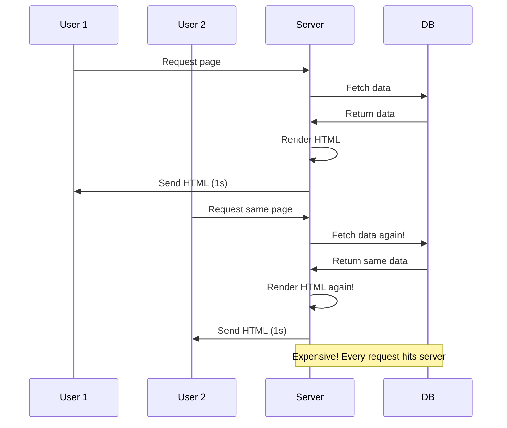
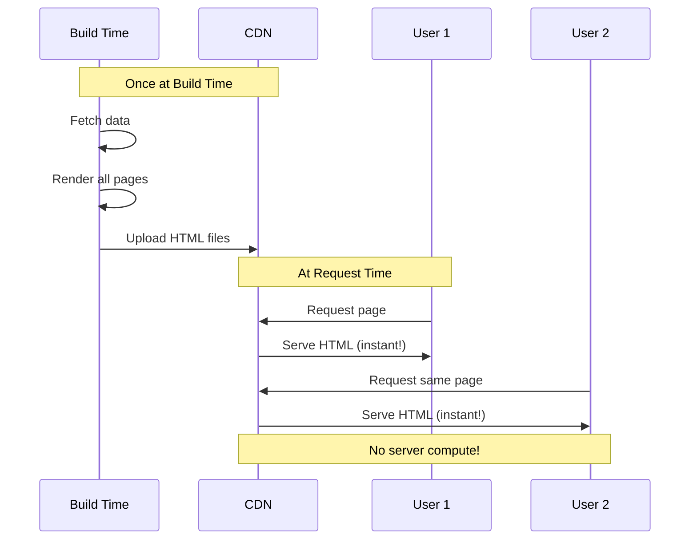
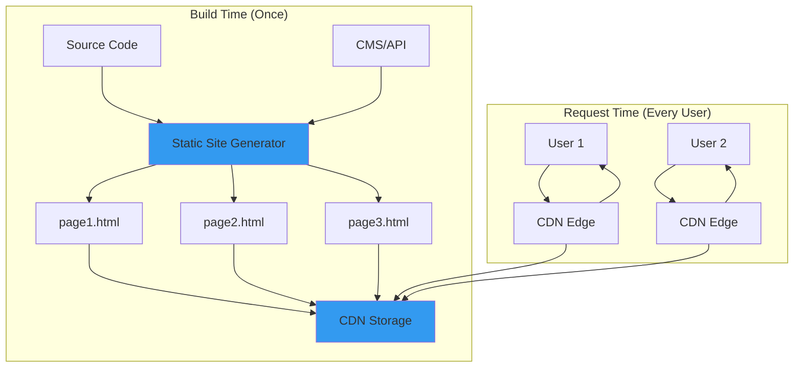
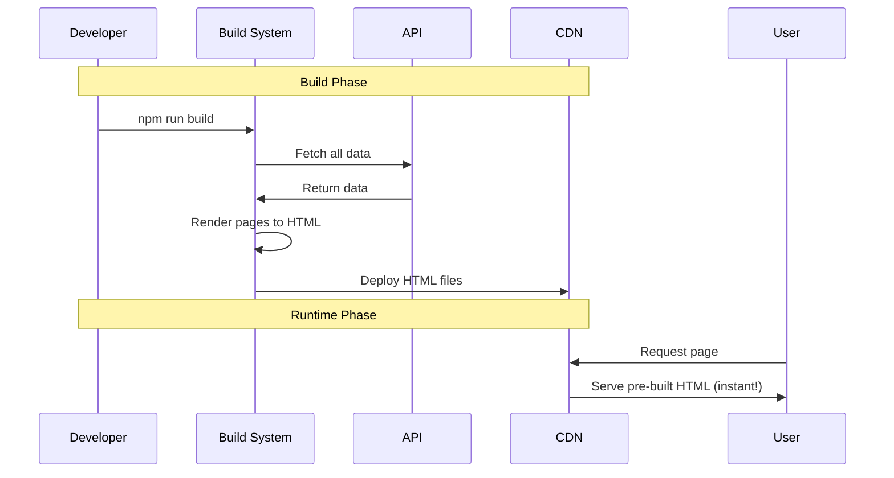
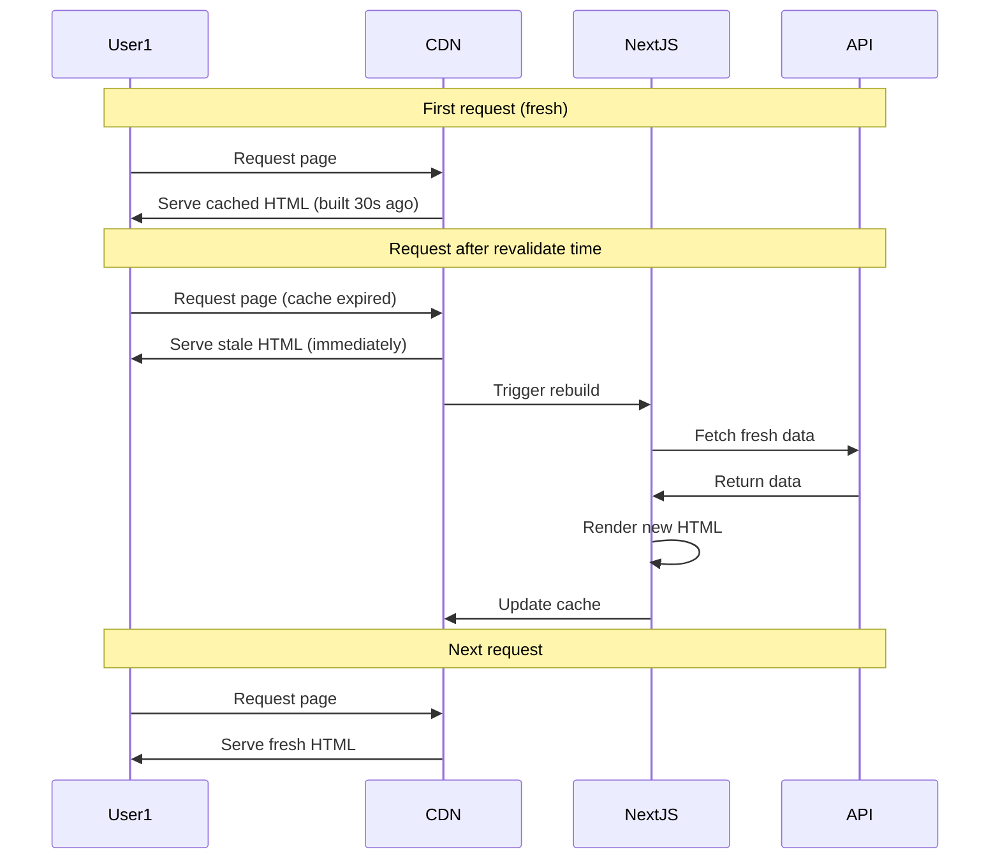

# SSG (Static Site Generation)

## Definition

**SSG (Static Site Generation)** is a technique where HTML pages are pre-built at **build time**, stored as static files, and served from a CDN. Pages are generated once and reused for all users.

Think of it as **"baking a cake once and serving slices"** - maximum performance, minimal cost, perfect for content that doesn't change often.

## What Problem Does It Solve?

### The Problem: Performance vs Freshness Trade-Off

**Server-Side Rendering (SSR)**:



**Static Site Generation (SSG)**:



**Benefits of SSG**:
- ✅ **Performance**: Instant load (served from CDN)
- ✅ **Cost**: No server compute (only CDN costs)
- ✅ **Scalability**: Handle millions of users effortlessly
- ✅ **SEO**: Perfect (full HTML at request time)
- ✅ **Security**: No server to hack

## How It Works

### SSG Architecture



### SSG Build Flow



## Core Concepts

### 1. Build-Time Data Fetching

**Next.js SSG example**:

```jsx
// pages/blog/[slug].js
export default function BlogPost({ post }) {
  return (
    <article>
      <h1>{post.title}</h1>
      <time>{post.publishedAt}</time>
      <div>{post.content}</div>
    </article>
  );
}

// Fetch data at BUILD TIME (not runtime)
export async function getStaticProps({ params }) {
  const post = await fetchPost(params.slug);

  return {
    props: { post },
    revalidate: false // Never rebuild (pure static)
  };
}

// Generate all paths at BUILD TIME
export async function getStaticPaths() {
  const posts = await fetchAllPosts();
  const paths = posts.map(post => ({
    params: { slug: post.slug }
  }));

  return {
    paths,
    fallback: false // 404 for unknown paths
  };
}
```

### 2. Incremental Static Regeneration (ISR)

**Rebuild pages on-demand**:

```jsx
export async function getStaticProps() {
  const products = await fetchProducts();

  return {
    props: { products },
    revalidate: 60 // Rebuild every 60 seconds
  };
}
```

**How ISR works**:



### 3. Fallback Strategies

**Handle unknown paths**:

```jsx
export async function getStaticPaths() {
  // Pre-build top 100 products
  const topProducts = await fetchTopProducts(100);
  const paths = topProducts.map(p => ({ params: { id: p.id } }));

  return {
    paths,
    fallback: 'blocking' // Generate new pages on-demand
  };
}
```

**Fallback options**:
- `false`: 404 for unknown paths
- `true`: Show fallback UI, then load
- `'blocking'`: Wait for page generation, then serve

## Real-World Examples

### Example 1: Blog with SSG

```jsx
// pages/blog/index.js
export default function BlogIndex({ posts }) {
  return (
    <div>
      <h1>Blog</h1>
      {posts.map(post => (
        <article key={post.slug}>
          <Link href={`/blog/${post.slug}`}>
            <h2>{post.title}</h2>
          </Link>
          <time>{post.publishedAt}</time>
          <p>{post.excerpt}</p>
        </article>
      ))}
    </div>
  );
}

// Build time: Fetch all posts
export async function getStaticProps() {
  const posts = await fetchAllPosts();

  return {
    props: { posts }
  };
}

// pages/blog/[slug].js
export default function BlogPost({ post }) {
  return (
    <article>
      <h1>{post.title}</h1>
      <time>{post.publishedAt}</time>
      <div>{post.content}</div>
    </article>
  );
}

// Build time: Fetch specific post
export async function getStaticProps({ params }) {
  const post = await fetchPost(params.slug);

  if (!post) {
    return { notFound: true };
  }

  return {
    props: { post }
  };
}

// Build time: Generate all paths
export async function getStaticPaths() {
  const posts = await fetchAllPosts();
  const paths = posts.map(post => ({
    params: { slug: post.slug }
  }));

  return { paths, fallback: false };
}
```

### Example 2: Documentation Site

**SpecWeave's docs use SSG (Docusaurus)**:

```javascript
// docusaurus.config.js
module.exports = {
  title: 'SpecWeave',
  url: 'https://spec-weave.com',
  onBrokenLinks: 'throw',

  presets: [
    [
      '@docusaurus/preset-classic',
      {
        docs: {
          sidebarPath: require.resolve('./sidebars.js'),
        },
        theme: {
          customCss: require.resolve('./src/css/custom.css'),
        },
      },
    ],
  ],
};

// Build: npm run build
// Result: Fully static HTML files
```

### Example 3: Product Catalog with ISR

```jsx
// pages/products/[id].js
export default function ProductPage({ product, relatedProducts }) {
  return (
    <div>
      <h1>{product.name}</h1>
      <p>${product.price}</p>
      <p>{product.description}</p>

      <h2>Related Products</h2>
      {relatedProducts.map(p => (
        <ProductCard key={p.id} product={p} />
      ))}
    </div>
  );
}

// Pre-build top 100 products, ISR rest
export async function getStaticProps({ params }) {
  const product = await fetchProduct(params.id);
  const relatedProducts = await fetchRelated(params.id);

  return {
    props: { product, relatedProducts },
    revalidate: 300 // Rebuild every 5 minutes
  };
}

export async function getStaticPaths() {
  // Pre-build only top 100 products
  const topProducts = await fetchTopProducts(100);
  const paths = topProducts.map(p => ({ params: { id: p.id.toString() } }));

  return {
    paths,
    fallback: 'blocking' // Generate others on-demand
  };
}
```

## SSG vs SSR vs SPA


### Comparison Table

| Aspect | SSG | SSR | SPA |
|--------|-----|-----|-----|
| **Performance** | ✅ Fastest (CDN) | ⚠️ Fast (server) | ❌ Slowest (client) |
| **Cost** | ✅ Cheapest (CDN only) | ❌ Expensive (compute) | ✅ Cheap (static) |
| **Scalability** | ✅ Infinite (CDN) | ❌ Limited (server) | ✅ High (static) |
| **Freshness** | ❌ Build time | ✅ Real-time | ✅ Real-time |
| **SEO** | ✅ Perfect | ✅ Perfect | ❌ Poor |
| **Personalization** | ❌ No | ✅ Yes | ✅ Yes |
| **Build Time** | ❌ Slow (1000s pages) | ✅ N/A | ✅ Fast |
| **Best For** | Blogs, docs, marketing | E-commerce, dashboards | Apps, tools |

**[Learn More: SSR →](/docs/glossary/terms/ssr)** | **[Learn More: SPA →](/docs/glossary/terms/spa)**

## How SpecWeave Uses SSG

### 1. SpecWeave Docs Site (SSG)

**SpecWeave's documentation uses Docusaurus (SSG)**:

```
docs-site-internal/
├── docs/
│   ├── getting-started.md
│   ├── guides/
│   └── api/
├── blog/
├── src/
│   ├── pages/
│   └── components/
├── docusaurus.config.ts
└── sidebars.ts

# Build static site
npm run build
# Result: build/ folder with HTML files

# Deploy to CDN
npm run serve # Or upload to Vercel/Netlify
```

### 2. SSG Project Structure

```
my-ssg-app/
├── .specweave/
│   ├── increments/
│   │   └── 0001-ssg-setup/
│   │       ├── spec.md
│   │       ├── plan.md
│   │       └── tasks.md
│   └── docs/
│       └── internal/
│           └── architecture/
│               ├── rendering-strategy.md
│               └── adr/
│                   └── 0001-ssg-for-performance.md
├── pages/
│   ├── index.js
│   └── blog/
│       └── [slug].js
├── public/
└── next.config.js
```

### 3. Planning SSG Features

**Increment spec**:

```markdown
# Increment 0020: SSG Marketing Site

## User Stories

**US-001**: Static landing pages
- [ ] AC-US1-01: Pre-render all pages at build time
- [ ] AC-US1-02: Serve from CDN (Vercel)
- [ ] AC-US1-03: First Contentful Paint < 0.5s

**US-002**: Blog with ISR
- [ ] AC-US2-01: Pre-render all blog posts
- [ ] AC-US2-02: Rebuild every 5 minutes (ISR)
- [ ] AC-US2-03: Generate new posts on-demand

**US-003**: SEO optimization
- [ ] AC-US3-01: Meta tags for all pages
- [ ] AC-US3-02: Sitemap generation
- [ ] AC-US3-03: Perfect Lighthouse score (100)

## Architecture

**Rendering**: Static Site Generation (SSG)
**Incremental**: ISR every 5 minutes
**CDN**: Vercel Edge Network
**Build Time**: < 2 minutes (200 pages)
```

### 4. SSG + SpecWeave Workflow

```mermaid
graph TB
    A[/specweave:increment "Marketing Site"] --> B[PM: Define Pages]
    B --> C[Architect: Design SSG Strategy]
    C --> D[/specweave:do]
    D --> E[Implement getStaticProps]
    E --> F[Generate All Paths]
    F --> G[Build Site]
    G --> H[Test Performance]
    H --> I[Deploy to CDN]
    I --> J[/specweave:done]

    style B fill:#339af0
    style C fill:#339af0
```

## SSG Performance Optimization

### 1. Parallel Page Generation

```jsx
// next.config.js
module.exports = {
  // Generate pages in parallel
  generateBuildId: async () => {
    return 'my-build-id';
  },
  experimental: {
    workerThreads: true,
    cpus: 4 // Use 4 CPU cores
  }
};
```

### 2. Incremental Builds

**Only rebuild changed pages**:

```bash
# Next.js automatically does this
npm run build

# Only rebuilds:
# - Changed pages
# - Pages depending on changed data
```

### 3. Image Optimization

```jsx
import Image from 'next/image';

// Optimized at build time
<Image
  src="/hero.jpg"
  alt="Hero"
  width={1200}
  height={600}
  priority
/>
```

### 4. Code Splitting

```jsx
// Automatic code splitting per page
// pages/about.js only loads when visiting /about
```

## When to Use SSG

### ✅ Use SSG When

1. **Content doesn't change often** (blogs, docs, marketing)
2. **Same for all users** (no personalization)
3. **SEO critical** (public-facing)
4. **Maximum performance** (CDN-served)
5. **Budget-constrained** (minimal server costs)

**Examples**:
- Blog posts
- Documentation
- Marketing landing pages
- Product catalogs (with ISR)
- Portfolio sites

### ❌ Don't Use SSG When

1. **Content changes frequently** (real-time data)
2. **Personalized content** (user-specific)
3. **User authentication required** (dashboards)
4. **Thousands of dynamic pages** (build time too long)

**Examples**:
- User dashboards → Use SSR
- Chat apps → Use SPA
- Admin panels → Use SPA
- Real-time feeds → Use SSR

## SSG with Incremental Static Regeneration (ISR)

### Hybrid Approach: SSG + ISR

**Best of both worlds**:

```jsx
export async function getStaticProps() {
  const products = await fetchProducts();

  return {
    props: { products },
    revalidate: 300 // Rebuild every 5 minutes
  };
}
```

**Benefits**:
- ✅ Fast initial build (don't wait for all pages)
- ✅ Fresh content (periodic rebuilds)
- ✅ On-demand generation (new pages)
- ✅ CDN-served (instant load)

**How it works**:

```
Initial Build:
- Pre-render top 100 products
- Deploy to CDN

User Request:
1. User requests /products/new-product
2. CDN serves stale version (if exists)
3. Triggers rebuild in background
4. Next user gets fresh version

After 5 minutes:
- First user request triggers rebuild
- Subsequent users get fresh version
```

## Best Practices

### ✅ Do

1. **Use SSG by default** (fallback to SSR only if needed)
2. **Enable ISR for frequently updated content** (5-60 minutes)
3. **Pre-build critical pages** (top 100 products, recent posts)
4. **Use fallback: 'blocking' for new pages** (on-demand generation)
5. **Optimize images** (Next.js Image component)
6. **Generate sitemap** (SEO)
7. **Monitor build times** (keep < 5 minutes)

### ❌ Don't

1. **Don't pre-build millions of pages** (use ISR + fallback)
2. **Don't use SSG for personalized content** (use SSR)
3. **Don't forget revalidate** (content becomes stale)
4. **Don't fetch data on client after SSG** (defeats purpose)
5. **Don't ignore build errors** (fix them!)

## Common Patterns

### 1. Content from CMS

```jsx
// Fetch from headless CMS
export async function getStaticProps() {
  const posts = await fetch('https://cms.example.com/api/posts')
    .then(r => r.json());

  return {
    props: { posts },
    revalidate: 3600 // Rebuild every hour
  };
}
```

### 2. Markdown Files

```jsx
import fs from 'fs';
import matter from 'gray-matter';

export async function getStaticProps() {
  const files = fs.readdirSync('posts');
  const posts = files.map(filename => {
    const markdown = fs.readFileSync(`posts/${filename}`, 'utf-8');
    const { data, content } = matter(markdown);
    return { ...data, content };
  });

  return { props: { posts } };
}
```

### 3. API Integration

```jsx
export async function getStaticProps() {
  const [products, categories] = await Promise.all([
    fetch('https://api.example.com/products').then(r => r.json()),
    fetch('https://api.example.com/categories').then(r => r.json())
  ]);

  return {
    props: { products, categories },
    revalidate: 600 // Rebuild every 10 minutes
  };
}
```

## Common Mistakes

### ❌ Mistake 1: Fetching on Client After SSG

```jsx
// ❌ WRONG - Data fetched twice (build + client)
export default function Page({ initialPosts }) {
  const [posts, setPosts] = useState(initialPosts);

  useEffect(() => {
    fetchPosts().then(setPosts); // Unnecessary!
  }, []);

  return <div>{posts.map(...)}</div>;
}

// ✅ CORRECT - Use SSG data only
export default function Page({ posts }) {
  return <div>{posts.map(...)}</div>;
}
```

### ❌ Mistake 2: Pre-Building Too Many Pages

```jsx
// ❌ WRONG - Pre-build 10,000 products (slow build)
export async function getStaticPaths() {
  const products = await fetchAllProducts(); // 10,000 products
  const paths = products.map(p => ({ params: { id: p.id } }));

  return { paths, fallback: false };
}

// ✅ CORRECT - Pre-build top 100, ISR rest
export async function getStaticPaths() {
  const topProducts = await fetchTopProducts(100);
  const paths = topProducts.map(p => ({ params: { id: p.id } }));

  return { paths, fallback: 'blocking' };
}
```

### ❌ Mistake 3: No Revalidate (Stale Content)

```jsx
// ❌ WRONG - Content never updates after build
export async function getStaticProps() {
  const posts = await fetchPosts();
  return { props: { posts } };
}

// ✅ CORRECT - Periodic rebuilds
export async function getStaticProps() {
  const posts = await fetchPosts();
  return {
    props: { posts },
    revalidate: 3600 // Rebuild every hour
  };
}
```

## SSG Tools

### Popular SSG Frameworks

| Framework | Language | Best For |
|-----------|----------|----------|
| **Next.js** | React | Apps, marketing sites |
| **Gatsby** | React | Blogs, CMS-driven |
| **Docusaurus** | React | Documentation |
| **Astro** | Multi | Content sites |
| **Hugo** | Go | Blogs, speed |
| **Jekyll** | Ruby | GitHub Pages |
| **VitePress** | Vue | Documentation |

## Related Terms

- **[Next.js](/docs/glossary/terms/nextjs)** - React framework with SSG
- **[SSR](/docs/glossary/terms/ssr)** - Server-side rendering (alternative)
- **[SPA](/docs/glossary/terms/spa)** - Client-side rendering (alternative)
- **[React](/docs/glossary/terms/react)** - Library SSG is built on
- **Docusaurus** - SSG for documentation
- **Frontend** - Client-side development

## Learn More

- **[Next.js SSG Guide](https://nextjs.org/docs/basic-features/data-fetching/get-static-props)** - Official docs
- **SSG Tutorial** - SpecWeave SSG guide
- **[Next.js Guide](/docs/glossary/terms/nextjs)** - React + SSG
- **[Docusaurus Guide](https://docusaurus.io)** - Documentation SSG
- **[SpecWeave Frontend Plugin](/docs/plugins/frontend-stack)** - SSG-specific features

---

**Category**: Frontend Development

**Tags**: `#ssg` `#static-site-generation` `#nextjs` `#react` `#performance` `#cdn` `#docusaurus`
