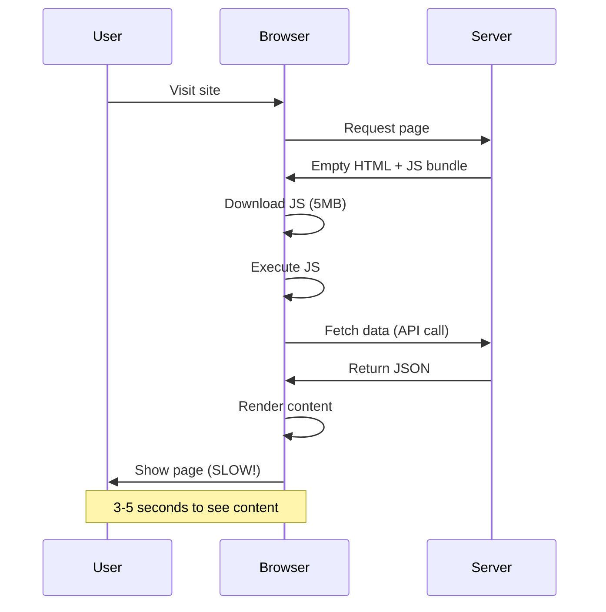
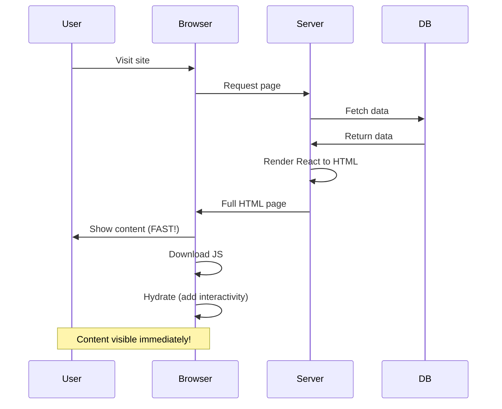
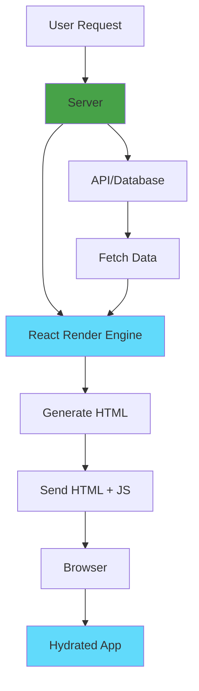
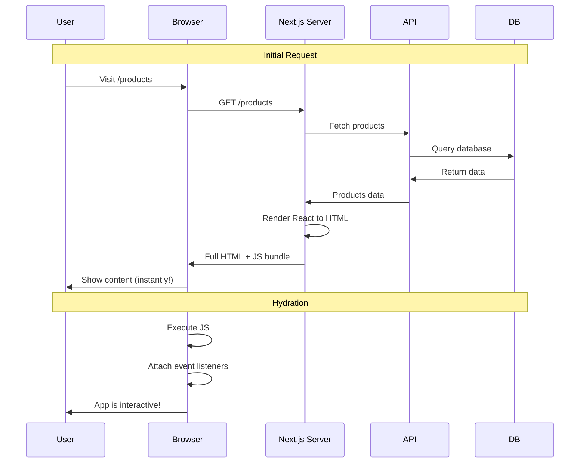

# SSR (Server-Side Rendering)

## Definition

**SSR (Server-Side Rendering)** is a technique where HTML pages are generated on the server **per request**, sent to the browser as complete HTML, then hydrated with JavaScript for interactivity.

Think of it as **"traditional server pages meet modern React"** - best of both worlds: fast initial load + SEO + interactivity.

## What Problem Does It Solve?

### The Problem: SPA SEO and Performance Issues

**Client-Side Rendering (SPA)**:



**Problems with SPA**:
- ❌ **SEO**: Google sees empty HTML (no content to index)
- ❌ **Performance**: Slow initial load (download + execute JS + fetch data)
- ❌ **UX**: White screen while loading

**Server-Side Rendering (SSR)**:



**Benefits of SSR**:
- ✅ **SEO**: Google sees full HTML (indexable content)
- ✅ **Performance**: Fast initial load (HTML ready)
- ✅ **UX**: Content visible immediately (no white screen)

## How It Works

### SSR Architecture



### SSR Flow



## Core Concepts

### 1. Server-Side Data Fetching

**Next.js SSR example**:

```jsx
// pages/products.js
export default function ProductsPage({ products }) {
  return (
    <div>
      <h1>Products</h1>
      {products.map(product => (
        <div key={product.id}>
          <h2>{product.name}</h2>
          <p>${product.price}</p>
        </div>
      ))}
    </div>
  );
}

// Runs on server per request
export async function getServerSideProps(context) {
  // Access request data
  const { req, res, query, params } = context;

  // Fetch data on server
  const products = await fetch('https://api.example.com/products')
    .then(r => r.json());

  // Return props to component
  return {
    props: {
      products
    }
  };
}
```

### 2. Request Context

**Access cookies, headers, query params**:

```jsx
export async function getServerSideProps(context) {
  const { req, res, query } = context;

  // Access cookies
  const userId = req.cookies.userId;

  // Access headers
  const userAgent = req.headers['user-agent'];

  // Access query parameters
  const page = query.page || 1;

  // Set response headers
  res.setHeader('Cache-Control', 'public, s-maxage=10, stale-while-revalidate=59');

  // Fetch personalized data
  const user = await fetchUser(userId);
  const products = await fetchProducts(page);

  return {
    props: { user, products, page }
  };
}
```

### 3. Hydration

**Make server-rendered HTML interactive**:

```jsx
// Server renders this to HTML:
<button onclick="handleClick()">Click me</button>

// Browser hydrates it with React:
function Button() {
  const handleClick = () => {
    alert('Clicked!');
  };

  return <button onClick={handleClick}>Click me</button>;
}
```

## Real-World Examples

### Example 1: E-Commerce Product Page

```jsx
// pages/product/[id].js
export default function ProductPage({ product, recommendations, user }) {
  const [quantity, setQuantity] = useState(1);

  const addToCart = () => {
    // Client-side interactivity
    fetch('/api/cart', {
      method: 'POST',
      body: JSON.stringify({ productId: product.id, quantity })
    });
  };

  return (
    <div>
      <h1>{product.name}</h1>
      <p>{product.description}</p>
      <p>${product.price}</p>

      <input
        type="number"
        value={quantity}
        onChange={(e) => setQuantity(e.target.value)}
      />
      <button onClick={addToCart}>Add to Cart</button>

      <h2>Personalized Recommendations</h2>
      {recommendations.map(rec => (
        <ProductCard key={rec.id} product={rec} />
      ))}
    </div>
  );
}

// SSR: Fetch product + personalized recommendations
export async function getServerSideProps({ params, req }) {
  const productId = params.id;
  const userId = req.cookies.userId;

  const [product, recommendations] = await Promise.all([
    fetchProduct(productId),
    fetchRecommendations(userId, productId)
  ]);

  return {
    props: { product, recommendations }
  };
}
```

### Example 2: Dashboard with Real-Time Data

```jsx
// pages/dashboard.js
export default function Dashboard({ stats, user }) {
  return (
    <div>
      <h1>Welcome, {user.name}!</h1>

      <div className="stats">
        <StatCard title="Revenue" value={stats.revenue} />
        <StatCard title="Orders" value={stats.orders} />
        <StatCard title="Customers" value={stats.customers} />
      </div>

      <RecentOrders orders={stats.recentOrders} />
    </div>
  );
}

// Fetch fresh data on every request
export async function getServerSideProps({ req }) {
  const userId = req.cookies.userId;

  // Authenticate user
  const user = await authenticateUser(userId);

  if (!user) {
    return {
      redirect: {
        destination: '/login',
        permanent: false
      }
    };
  }

  // Fetch real-time stats
  const stats = await fetchUserStats(user.id);

  return {
    props: { stats, user }
  };
}
```

### Example 3: Blog with Comments

```jsx
// pages/blog/[slug].js
export default function BlogPost({ post, comments, user }) {
  const [newComment, setNewComment] = useState('');

  const submitComment = async () => {
    await fetch(`/api/posts/${post.id}/comments`, {
      method: 'POST',
      body: JSON.stringify({ text: newComment })
    });
    // Refresh page to show new comment
    window.location.reload();
  };

  return (
    <article>
      <h1>{post.title}</h1>
      <time>{post.publishedAt}</time>
      <div>{post.content}</div>

      <h2>Comments ({comments.length})</h2>
      {comments.map(comment => (
        <Comment key={comment.id} comment={comment} />
      ))}

      {user && (
        <div>
          <textarea
            value={newComment}
            onChange={(e) => setNewComment(e.target.value)}
            placeholder="Add a comment..."
          />
          <button onClick={submitComment}>Submit</button>
        </div>
      )}
    </article>
  );
}

// SSR: Fetch post + comments + user
export async function getServerSideProps({ params, req }) {
  const slug = params.slug;
  const userId = req.cookies.userId;

  const [post, comments, user] = await Promise.all([
    fetchPost(slug),
    fetchComments(slug),
    userId ? fetchUser(userId) : null
  ]);

  return {
    props: { post, comments, user }
  };
}
```

## SSR vs SPA vs SSG

```mermaid
graph TB
    subgraph "SPA (Client-Side Rendering)"
        SPA1[Empty HTML] --> SPA2[Download JS]
        SPA2 --> SPA3[Execute JS]
        SPA3 --> SPA4[Fetch Data]
        SPA4 --> SPA5[Render Content]
    end

    subgraph "SSR (Server-Side Rendering)"
        SSR1[Request] --> SSR2[Fetch Data on Server]
        SSR2 --> SSR3[Render HTML]
        SSR3 --> SSR4[Send Full HTML]
        SSR4 --> SSR5[Hydrate]
    end

    subgraph "SSG (Static Site Generation)"
        SSG1[Build Time] --> SSG2[Fetch Data]
        SSG2 --> SSG3[Generate HTML]
        SSG3 --> SSG4[Store HTML]
        SSG4 --> SSG5[Serve from CDN]
    end

    style SPA5 fill:#ff6b6b
    style SSR4 fill:#51cf66
    style SSG5 fill:#339af0
```



### Comparison Table

| Aspect | SPA | SSR | SSG |
|--------|-----|-----|-----|
| **Initial Load** | ❌ Slow | ✅ Fast | ✅ Fastest |
| **SEO** | ❌ Poor | ✅ Excellent | ✅ Excellent |
| **Freshness** | ✅ Real-time | ✅ Per request | ❌ Build time |
| **Server Cost** | ✅ Low (static) | ❌ High (compute) | ✅ Low (CDN) |
| **Personalization** | ✅ Yes | ✅ Yes | ❌ No |
| **When to Use** | Apps, dashboards | E-commerce, dynamic | Blogs, docs |

**[Learn More: SPA →](/docs/glossary/terms/spa)** | **[Learn More: SSG →](/docs/glossary/terms/ssg)**

## How SpecWeave Uses SSR

### 1. SSR Project Structure

```
my-ssr-app/
├── .specweave/
│   ├── increments/
│   │   └── 0001-ssr-setup/
│   │       ├── spec.md
│   │       ├── plan.md
│   │       └── tasks.md
│   └── docs/
│       └── internal/
│           └── architecture/
│               ├── rendering-strategy.md
│               └── adr/
│                   └── 0001-ssr-for-seo.md
├── pages/
│   ├── _app.js
│   ├── index.js
│   └── products/
│       └── [id].js
└── next.config.js
```

### 2. Planning SSR Features

**Increment spec**:

```markdown
# Increment 0018: SSR Product Pages

## User Stories

**US-001**: Server-rendered product pages
- [ ] AC-US1-01: Fetch product data on server
- [ ] AC-US1-02: Render full HTML with content
- [ ] AC-US1-03: Google can index product pages

**US-002**: Personalized recommendations
- [ ] AC-US2-01: Use user cookies for personalization
- [ ] AC-US2-02: Show personalized products on server
- [ ] AC-US2-03: Maintain personalization after hydration

**US-003**: Performance optimization
- [ ] AC-US3-01: Cache rendered pages (10s)
- [ ] AC-US3-02: First Contentful Paint < 1s
- [ ] AC-US3-03: Time to Interactive < 2s

## Architecture

**Rendering**: Server-Side Rendering (SSR)
**Caching**: 10 seconds (stale-while-revalidate)
**Data Source**: REST API + Redis cache
**Deployment**: Vercel Edge Functions
```

### 3. SSR + SpecWeave Workflow

```mermaid
graph TB
    A[/specweave:increment "SSR Product Pages"] --> B[PM: Define Data Requirements]
    B --> C[Architect: Design SSR Strategy]
    C --> D[/specweave:do]
    D --> E[Implement getServerSideProps]
    E --> F[Fetch Data on Server]
    F --> G[Test SEO]
    G --> H[Optimize Performance]
    H --> I[/specweave:done]

    style B fill:#7c3aed
    style C fill:#8b5cf6
```

## SSR Performance Optimization

### 1. Caching

**Cache rendered pages**:

```jsx
export async function getServerSideProps({ res }) {
  // Cache for 10 seconds, serve stale for 59 seconds
  res.setHeader(
    'Cache-Control',
    'public, s-maxage=10, stale-while-revalidate=59'
  );

  const data = await fetchData();

  return { props: { data } };
}
```

### 2. Parallel Data Fetching

**Fetch multiple sources in parallel**:

```jsx
export async function getServerSideProps() {
  // ❌ WRONG - Sequential (slow)
  const user = await fetchUser();
  const products = await fetchProducts();
  const cart = await fetchCart();

  // ✅ CORRECT - Parallel (fast)
  const [user, products, cart] = await Promise.all([
    fetchUser(),
    fetchProducts(),
    fetchCart()
  ]);

  return { props: { user, products, cart } };
}
```

### 3. Selective SSR

**SSR critical content, CSR rest**:

```jsx
export default function ProductPage({ product }) {
  const [reviews, setReviews] = useState([]);

  // Product SSR'd, reviews CSR'd
  useEffect(() => {
    fetchReviews(product.id).then(setReviews);
  }, [product.id]);

  return (
    <div>
      {/* SSR: Visible immediately */}
      <h1>{product.name}</h1>
      <p>{product.price}</p>

      {/* CSR: Loaded after page displays */}
      <Reviews reviews={reviews} />
    </div>
  );
}

// Only SSR critical data
export async function getServerSideProps({ params }) {
  const product = await fetchProduct(params.id);
  return { props: { product } };
}
```

## When to Use SSR

### ✅ Use SSR When

1. **SEO critical** (public-facing pages)
2. **Personalized content** (needs request data)
3. **Fresh data required** (real-time updates)
4. **Dynamic per request** (user-specific)

**Examples**:
- E-commerce product pages
- User dashboards
- Social media feeds
- Search results

### ❌ Don't Use SSR When

1. **Static content** (use SSG instead)
2. **Internal tools** (use SPA instead)
3. **Highly interactive** (use SPA instead)
4. **Budget-constrained** (SSR = higher server costs)

**Examples**:
- Blog posts → Use SSG
- Admin panels → Use SPA
- Chat apps → Use SPA
- Documentation → Use SSG

## Best Practices

### ✅ Do

1. **Cache aggressively** (reduce server load)
2. **Fetch in parallel** (Promise.all)
3. **Use ISR when possible** (SSG + revalidation)
4. **Monitor server performance** (SSR = compute cost)
5. **Handle errors gracefully** (500 pages)
6. **Optimize database queries** (avoid N+1)

### ❌ Don't

1. **Don't fetch all data** (fetch only what's needed)
2. **Don't block on slow APIs** (use timeouts)
3. **Don't forget error handling** (API failures)
4. **Don't over-use SSR** (consider SSG/ISR first)
5. **Don't fetch client-only data on server** (localStorage, etc.)

## Common Patterns

### 1. Redirect Based on Auth

```jsx
export async function getServerSideProps({ req, res }) {
  const user = await authenticateUser(req.cookies.token);

  if (!user) {
    return {
      redirect: {
        destination: '/login',
        permanent: false
      }
    };
  }

  return { props: { user } };
}
```

### 2. Not Found Page

```jsx
export async function getServerSideProps({ params }) {
  const product = await fetchProduct(params.id);

  if (!product) {
    return {
      notFound: true // Shows 404 page
    };
  }

  return { props: { product } };
}
```

### 3. A/B Testing

```jsx
export async function getServerSideProps({ req }) {
  // Randomly assign variant
  const variant = Math.random() < 0.5 ? 'A' : 'B';

  // Or use cookie
  const existingVariant = req.cookies.abTestVariant;

  return {
    props: { variant: existingVariant || variant }
  };
}
```

## Common Mistakes

### ❌ Mistake 1: Fetching on Client After SSR

```jsx
// ❌ WRONG - Data fetched twice (server + client)
export default function Page({ initialData }) {
  const [data, setData] = useState(initialData);

  useEffect(() => {
    fetchData().then(setData); // Unnecessary!
  }, []);

  return <div>{data.title}</div>;
}

// ✅ CORRECT - Use SSR data
export default function Page({ data }) {
  return <div>{data.title}</div>;
}
```

### ❌ Mistake 2: Not Handling Loading States

```jsx
// ❌ WRONG - No loading state during SSR
export default function Page() {
  // Page appears blank while server renders
  return <div>Loading...</div>;
}

// ✅ CORRECT - Show loading page immediately
export default function Page({ data }) {
  return <div>{data.title}</div>;
}
```

### ❌ Mistake 3: Using Client-Only APIs

```jsx
// ❌ WRONG - localStorage doesn't exist on server
export async function getServerSideProps() {
  const token = localStorage.getItem('token'); // Error!
  return { props: {} };
}

// ✅ CORRECT - Use cookies (available on server)
export async function getServerSideProps({ req }) {
  const token = req.cookies.token;
  return { props: {} };
}
```

## Related Terms

- **[Next.js](/docs/glossary/terms/nextjs)** - React framework with built-in SSR
- **[SSG](/docs/glossary/terms/ssg)** - Static site generation (alternative)
- **[SPA](/docs/glossary/terms/spa)** - Client-side rendering (alternative)
- **[React](/docs/glossary/terms/react)** - Library SSR is built on
- **SEO** - Why SSR matters
- **Frontend** - Client-side development

## Learn More

- **[Next.js SSR Guide](https://nextjs.org/docs/basic-features/data-fetching/get-server-side-props)** - Official docs
- **SSR Tutorial** - SpecWeave SSR guide
- **[Next.js Guide](/docs/glossary/terms/nextjs)** - React + SSR
- **[SpecWeave Frontend Plugin](/docs/plugins/frontend-stack)** - SSR-specific features

---

**Category**: Frontend Development

**Tags**: `#ssr` `#server-side-rendering` `#nextjs` `#react` `#seo` `#performance`
