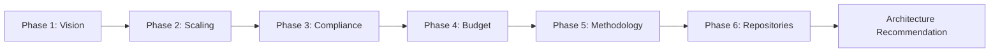

# Strategic Init

**Strategic Init** is SpecWeave's AI-powered project initialization that guides you through 6 research phases to determine optimal architecture, compliance requirements, team sizing, and cost estimates.

---

## The 6 Phases

**Total Duration**: 10-15 minutes (varies by project complexity)



| Phase | Duration | Can Skip? |
|-------|----------|-----------|
| Vision & Market | 3-5 min | No |
| Scaling | 1 min | Yes (defaults apply) |
| Compliance | 1-2 min | No (auto-detection) |
| Budget | 1 min | Yes |
| Methodology | 1 min | Yes (defaults to Agile) |
| Repositories | 2-3 min | Yes (single repo default) |

### Phase 1: Vision & Market Research

**What are you building?**

- Product description analysis
- Market research
- Competitor detection
- Opportunity scoring
- Viral potential assessment

### Phase 2: Scaling & Performance Goals

**How big will it get?**

- Expected users (1K, 10K, 100K, 1M+)
- Expected microservices count
- Growth projections

### Phase 3: Data & Compliance Detection

**What regulations apply?**

Auto-detects 30+ compliance standards:
- HIPAA (healthcare data)
- SOC2 (SaaS security)
- GDPR (EU data protection)
- PCI-DSS (payment cards)
- FDA (medical devices)

### Phase 4: Budget & Cloud Credits

**What's your budget?**

- Budget tier (bootstrapped, pre-seed, seed, series-a+)
- Cloud credits eligibility:
  - AWS Activate ($1K-$100K)
  - Google Cloud ($2K-$350K)
  - Azure Startup ($1K-$100K)

### Phase 5: Methodology & Organization

**How will your team work?**

- Agile (iterative sprints)
- Waterfall (sequential phases)
- Current team size
- Future team planning

### Phase 6: Repository Selection

**Where does the code live?**

- Single repo or multi-repo
- Platform selection (GitHub, GitLab, Bitbucket)
- Profile configuration

---

## Output

Strategic Init produces:

```
ARCHITECTURE RECOMMENDATIONS
════════════════════════════════════════════════════════

📐 Architecture Decisions:
• Database: PostgreSQL (ACID compliance, JSON support)
• Backend: Node.js + Express (team familiarity)
• Frontend: Next.js (SSR, SEO benefits)
• Infrastructure: AWS ECS (scalability, cost)

👥 Team Recommendations:
• Recommended Size: 3 people
• Range: 2-5 people
• Roles: Full-stack, DevOps, QA

💰 Cost Estimates:
• Infrastructure: $500-2000/month
• Cloud Credits Available: AWS Activate eligible
```

---

## Running Strategic Init

```bash
# New project
specweave init my-project

# Existing project (reinit)
cd existing-project
specweave init .
```

---

## Reinitializing

If you need to update configuration:

```bash
specweave init .
# Prompts:
# - Keep existing config? (y/n)
# - Which phases to re-run?
# - Merge or replace settings?
```

---

## Related Terms

- [Greenfield](/docs/glossary/terms/greenfield)
- [Brownfield](/docs/glossary/terms/brownfield)
- [Increments](/docs/glossary/terms/increments)
