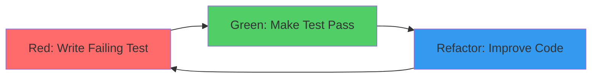
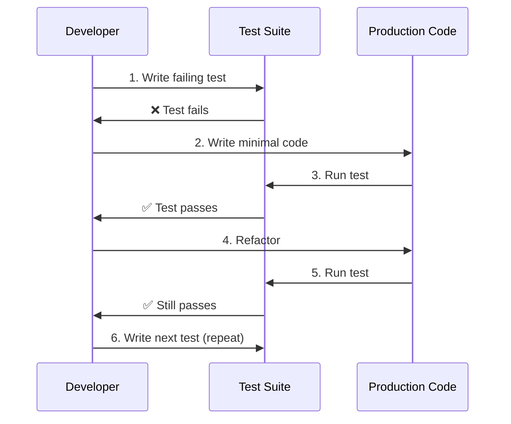

# TDD (Test-Driven Development)

**Test-Driven Development (TDD)** is a software development methodology where tests are written **before** the implementation code. The developer writes a failing test, then writes the minimum code to pass the test, and finally refactors the code while keeping tests passing.

---

## The Red-Green-Refactor Cycle

TDD follows a three-step cycle:



### 1. Red: Write a Failing Test

Write a test for the next piece of functionality you want to add. Run the test and watch it fail (because the functionality doesn't exist yet).

**Example**:
```typescript
// tests/unit/services/auth.test.ts
describe('AuthService', () => {
  test('should hash password before storing', async () => {
    const authService = new AuthService();
    const result = await authService.register('user@example.com', 'password123');

    // Test will fail - register() doesn't exist yet
    expect(result.password).not.toBe('password123');
    expect(result.password).toMatch(/^\$2[aby]\$\d+\$/); // bcrypt format
  });
});
```

**Run**: `npm test` → ❌ Test fails (expected)

### 2. Green: Make the Test Pass

Write the **minimum code** necessary to make the test pass. Don't worry about perfection—just make it work.

**Example**:
```typescript
// src/services/AuthService.ts
import bcrypt from 'bcrypt';

export class AuthService {
  async register(email: string, password: string) {
    const hashedPassword = await bcrypt.hash(password, 10);
    return {
      email,
      password: hashedPassword
    };
  }
}
```

**Run**: `npm test` → ✅ Test passes

### 3. Refactor: Improve the Code

Improve the code structure, remove duplication, and optimize—while keeping all tests passing.

**Example**:
```typescript
// src/services/AuthService.ts
import bcrypt from 'bcrypt';

export class AuthService {
  private readonly SALT_ROUNDS = 10;

  async register(email: string, password: string) {
    this.validatePassword(password);
    const hashedPassword = await this.hashPassword(password);

    return {
      email,
      password: hashedPassword
    };
  }

  private validatePassword(password: string): void {
    if (password.length < 8) {
      throw new Error('Password must be at least 8 characters');
    }
  }

  private async hashPassword(password: string): Promise<string> {
    return bcrypt.hash(password, this.SALT_ROUNDS);
  }
}
```

**Run**: `npm test` → ✅ Tests still pass (refactoring successful)

---

## TDD Workflow Diagram



---

## TDD in SpecWeave

SpecWeave supports TDD workflow via `tasks.md` configuration:

### Enabling TDD Mode

**tasks.md frontmatter**:
```yaml
---
increment: 0008-user-authentication
total_tasks: 5
test_mode: TDD
coverage_target: 85%
---
```

When `test_mode: TDD`, SpecWeave guides you through the Red-Green-Refactor cycle:

### Example Task with TDD

```markdown
## T-001: Implement Password Hashing

**AC**: AC-US1-02 (Passwords must be stored securely)

**Test Plan** (BDD format):
- **Given** user registers with password → **When** stored → **Then** password is hashed (bcrypt)

**TDD Steps**:

1. **Red**: Write failing test
   ```bash
   vim tests/unit/services/auth.test.ts
   npm test  # ❌ Fails (expected)
   ```

2. **Green**: Implement minimal code
   ```bash
   vim src/services/AuthService.ts
   npm test  # ✅ Passes
   ```

3. **Refactor**: Improve code
   ```bash
   vim src/services/AuthService.ts
   npm test  # ✅ Still passes
   ```

**Test Cases**:
- Unit (`auth.test.ts`): hashPassword, saltGeneration, invalidPassword → 90% coverage

**Implementation**: AuthService.ts, bcrypt integration, password validation

**Coverage**: 90% (target met)
```

---

## Benefits of TDD

### 1. Better Design

Writing tests first forces you to think about the API design before implementation:

```typescript
// ❌ Bad: Unclear API
function process(data) { /* ... */ }

// ✅ Good: Test-driven API
test('should process user data and return validated result', () => {
  const result = processUserData({ email: 'test@example.com' });
  expect(result).toMatchObject({
    isValid: true,
    normalizedEmail: 'test@example.com'
  });
});

// API is now clear from the test
```

### 2. Fewer Bugs

Tests catch issues immediately:

```typescript
// Test written first
test('should reject invalid email formats', () => {
  expect(() => validateEmail('invalid')).toThrow('Invalid email format');
});

// This test will force you to handle validation
// Bug is prevented before it reaches production
```

### 3. Living Documentation

Tests document how the code should behave:

```typescript
describe('AuthService', () => {
  test('should allow login with valid credentials', async () => { /* ... */ });
  test('should reject login with invalid password', async () => { /* ... */ });
  test('should lock account after 5 failed attempts', async () => { /* ... */ });
  test('should unlock account after 15 minutes', async () => { /* ... */ });
});

// Test names document business rules
```

### 4. Confidence to Refactor

With comprehensive tests, you can refactor fearlessly:

```typescript
// Original implementation
function calculateTotal(items) {
  let total = 0;
  for (let i = 0; i < items.length; i++) {
    total += items[i].price;
  }
  return total;
}

// Refactored implementation
function calculateTotal(items) {
  return items.reduce((sum, item) => sum + item.price, 0);
}

// Tests still pass → refactoring is safe
```

---

## TDD vs Traditional Testing

| Aspect | TDD | Traditional Testing |
|--------|-----|-------------------|
| **When tests written** | Before code | After code |
| **Design thinking** | Test-first drives design | Code-first, tests follow |
| **Coverage** | High (tests drive code) | Variable (depends on effort) |
| **Bug prevention** | Proactive | Reactive |
| **Refactoring confidence** | High (tests exist) | Lower (tests may be missing) |
| **Learning curve** | Steeper initially | Easier to start |
| **Code quality** | Generally higher | Depends on discipline |

---

## Common TDD Patterns

### AAA Pattern (Arrange-Act-Assert)

```typescript
test('should calculate order total with tax', () => {
  // Arrange: Set up test data
  const order = new Order();
  order.addItem({ price: 100 });
  order.addItem({ price: 50 });

  // Act: Execute the behavior
  const total = order.calculateTotalWithTax(0.1); // 10% tax

  // Assert: Verify the outcome
  expect(total).toBe(165); // (100 + 50) * 1.1
});
```

### Test Doubles (Mocks, Stubs, Spies)

```typescript
test('should send email after user registration', async () => {
  // Arrange: Mock email service
  const emailService = {
    send: jest.fn().mockResolvedValue(true)
  };
  const authService = new AuthService(emailService);

  // Act: Register user
  await authService.register('user@example.com', 'password123');

  // Assert: Email was sent
  expect(emailService.send).toHaveBeenCalledWith({
    to: 'user@example.com',
    subject: 'Welcome to SpecWeave'
  });
});
```

---

## When to Use TDD

### ✅ Good Fits for TDD

- **Business logic**: Calculation, validation, data transformation
- **Utility functions**: Pure functions with clear inputs/outputs
- **APIs**: REST endpoints, GraphQL resolvers
- **Core domain models**: User, Order, Payment entities
- **Bug fixes**: Write test that reproduces bug, then fix

### ❌ Less Suitable for TDD

- **UI layouts**: Visual design exploration
- **Prototypes**: Throwaway code for exploring ideas
- **Glue code**: Simple integration between libraries
- **Configuration**: YAML, JSON config files

---

## TDD Anti-Patterns

### 1. Testing Implementation Details

```typescript
// ❌ Bad: Tests implementation
test('should call bcrypt.hash with SALT_ROUNDS', async () => {
  const spy = jest.spyOn(bcrypt, 'hash');
  await authService.register('user@example.com', 'password123');
  expect(spy).toHaveBeenCalledWith('password123', 10);
});

// ✅ Good: Tests behavior
test('should store hashed password', async () => {
  const result = await authService.register('user@example.com', 'password123');
  expect(result.password).not.toBe('password123');
  expect(result.password).toMatch(/^\$2[aby]\$\d+\$/);
});
```

### 2. Writing Tests After Code

```typescript
// ❌ Not TDD: Code written first, tests added later
// Result: Tests may miss edge cases, design not influenced by tests

// ✅ True TDD: Test written first, code follows
// Result: Better design, complete coverage
```

### 3. Skipping Refactor Step

```typescript
// ❌ Bad: Stop after Green (duplicate code remains)
test('should hash password', () => { /* ... */ });
function hashPassword(password) {
  return bcrypt.hash(password, 10);
}

test('should hash API key', () => { /* ... */ });
function hashAPIKey(key) {
  return bcrypt.hash(key, 10); // Duplication!
}

// ✅ Good: Refactor to extract common logic
function hashSecret(secret: string): Promise<string> {
  return bcrypt.hash(secret, 10);
}
```

---

## TDD Resources

### Books
- **"Test Driven Development: By Example"** by Kent Beck (creator of TDD)
- **"Growing Object-Oriented Software, Guided by Tests"** by Steve Freeman

### Tools
- **Jest**: JavaScript/TypeScript testing framework
- **Playwright**: E2E testing framework
- **Vitest**: Modern Jest alternative (faster)

### SpecWeave Integration
- **TDD mode** in tasks.md (`test_mode: TDD`)
- **BDD format** for test plans (Given/When/Then)
- **Coverage targets** per task (85-90%)

---

## Related Terms

- [BDD (Behavior-Driven Development)](/docs/glossary/terms/bdd) - Testing from user behavior perspective
- [Unit Testing](/docs/glossary/terms/unit-testing) - Testing individual functions
- E2E Testing - Testing complete user flows
- [Test Coverage](/docs/glossary/terms/test-coverage) - Measuring code tested

---

## Summary

**TDD is a discipline**:
1. **Red**: Write failing test first
2. **Green**: Make test pass (minimal code)
3. **Refactor**: Improve code structure

**Benefits**: Better design, fewer bugs, living documentation, refactoring confidence

**SpecWeave supports TDD**: Set `test_mode: TDD` in tasks.md for guided workflow

**Key insight**: TDD is about design first, testing second. The test is a design tool, not just a validation tool.
