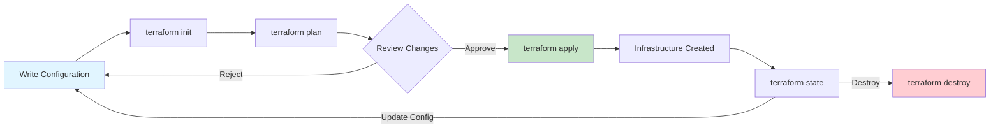
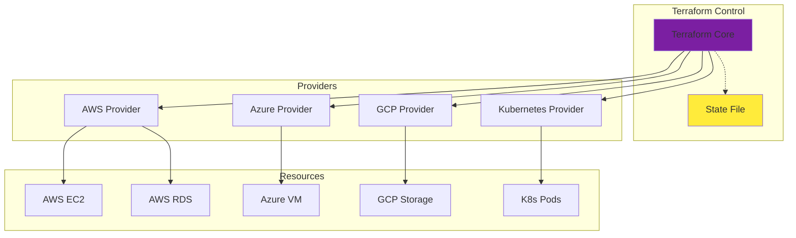

# Terraform

**Category**: Infrastructure & DevOps

**Definition**: Infrastructure as Code (IaC) tool that enables declarative provisioning and management of cloud infrastructure across multiple providers using a consistent workflow.

## Overview

Terraform is an open-source Infrastructure as Code tool created by HashiCorp that allows developers to define and provision data center infrastructure using a high-level configuration language called HCL (HashiCorp Configuration Language). It supports multiple cloud providers (AWS, Azure, GCP, etc.) through a plugin-based architecture.

## Key Concepts

### Infrastructure as Code (IaC)

Infrastructure is defined in code files that can be version controlled, reviewed, and reused:

```hcl
# Example: AWS VPC Infrastructure
terraform {
  required_providers {
    aws = {
      source  = "hashicorp/aws"
      version = "~> 5.0"
    }
  }
}

provider "aws" {
  region = "us-west-2"
}

resource "aws_vpc" "main" {
  cidr_block = "10.0.0.0/16"

  tags = {
    Name        = "production-vpc"
    Environment = "production"
    ManagedBy   = "terraform"
  }
}

resource "aws_subnet" "public" {
  vpc_id            = aws_vpc.main.id
  cidr_block        = "10.0.1.0/24"
  availability_zone = "us-west-2a"

  tags = {
    Name = "public-subnet-1"
  }
}

resource "aws_db_instance" "postgres" {
  identifier        = "production-db"
  engine            = "postgres"
  engine_version    = "15.3"
  instance_class    = "db.t3.micro"
  allocated_storage = 20

  db_name  = "appdb"
  username = "admin"
  password = var.db_password # Never hardcode passwords!

  vpc_security_group_ids = [aws_security_group.db.id]
  db_subnet_group_name   = aws_db_subnet_group.main.name

  skip_final_snapshot = false
  final_snapshot_identifier = "production-db-final-snapshot"

  tags = {
    Name        = "production-database"
    Environment = "production"
  }
}
```

### State Management

Terraform maintains a state file that maps real-world resources to your configuration:

```hcl
# Backend configuration for remote state
terraform {
  backend "s3" {
    bucket         = "my-terraform-state"
    key            = "production/terraform.tfstate"
    region         = "us-west-2"
    encrypt        = true
    dynamodb_table = "terraform-locks"
  }
}
```

### Modules

Reusable infrastructure components:

```hcl
# modules/web-service/main.tf
variable "service_name" {
  description = "Name of the web service"
  type        = string
}

variable "instance_count" {
  description = "Number of instances"
  type        = number
  default     = 2
}

resource "aws_instance" "web" {
  count         = var.instance_count
  ami           = data.aws_ami.ubuntu.id
  instance_type = "t3.micro"

  tags = {
    Name = "${var.service_name}-${count.index}"
  }
}

# Using the module
module "api_service" {
  source = "./modules/web-service"

  service_name   = "api"
  instance_count = 3
}
```

## Terraform Workflow



## Multi-Cloud Architecture



## Terraform vs Alternatives

| Feature | Terraform | CloudFormation | Pulumi |
|---------|-----------|----------------|--------|
| **Language** | HCL (declarative) | JSON/YAML | TypeScript/Python/Go |
| **Cloud Support** | Multi-cloud | AWS only | Multi-cloud |
| **State Management** | Required | AWS-managed | Required |
| **Learning Curve** | Medium | Medium | Low (uses familiar languages) |
| **Community** | Large | AWS-specific | Growing |
| **Best For** | Multi-cloud, team collaboration | AWS-only projects | Developers preferring code |

## Common Terraform Commands

```bash
# Initialize Terraform (download providers)
terraform init

# Validate configuration syntax
terraform validate

# Preview changes
terraform plan

# Apply changes
terraform apply

# Apply with auto-approval (CI/CD)
terraform apply -auto-approve

# Show current state
terraform show

# List resources in state
terraform state list

# Destroy infrastructure
terraform destroy

# Format configuration files
terraform fmt

# Refresh state from real infrastructure
terraform refresh
```

## Workspaces

Manage multiple environments with the same configuration:

```bash
# Create workspaces
terraform workspace new development
terraform workspace new staging
terraform workspace new production

# Switch workspaces
terraform workspace select production

# List workspaces
terraform workspace list

# Use workspace in configuration
resource "aws_instance" "app" {
  instance_type = terraform.workspace == "production" ? "t3.large" : "t3.micro"

  tags = {
    Environment = terraform.workspace
  }
}
```

## SpecWeave Integration

### Tracking Terraform Changes in Increments

**Increment Planning**:
```markdown
## Increment 0012: AWS Infrastructure Setup

### Tasks
- T-001: Define VPC and subnets (Terraform)
- T-002: Create RDS PostgreSQL instance
- T-003: Set up Application Load Balancer
- T-004: Configure security groups
- T-005: Apply Terraform and verify resources

### Acceptance Criteria
- AC-001: VPC created with public and private subnets
- AC-002: RDS instance accessible from app subnets only
- AC-003: Terraform state stored in S3 with locking
- AC-004: All resources tagged with increment ID
```

**Test Plan** (embedded in tasks):
```markdown
## T-001: Define VPC Infrastructure

**Test Cases**:
- Unit: `terraform validate` passes
- Integration: `terraform plan` shows expected resources
- E2E: Infrastructure created successfully via `terraform apply`

**Validation**:
```bash
# Validate configuration
terraform validate

# Preview changes
terraform plan -out=tfplan

# Verify plan contains expected resources
terraform show -json tfplan | jq '.resource_changes[].type'
```
```

### Living Documentation

After infrastructure changes, update architecture docs:

```bash
# Update architecture diagrams with new infrastructure
/specweave:sync-docs update

# Results in:
# - Updated HLD with infrastructure diagram
# - ADR documenting why Terraform was chosen
# - Runbook for infrastructure operations
```

## Best Practices

### 1. State Management
```hcl
# Always use remote state for team collaboration
terraform {
  backend "s3" {
    bucket         = "company-terraform-state"
    key            = "project/terraform.tfstate"
    region         = "us-west-2"
    encrypt        = true
    dynamodb_table = "terraform-locks" # Prevents concurrent modifications
  }
}
```

### 2. Variables and Secrets
```hcl
# Use variables for configuration
variable "environment" {
  description = "Environment name"
  type        = string
  validation {
    condition     = contains(["dev", "staging", "prod"], var.environment)
    error_message = "Environment must be dev, staging, or prod."
  }
}

# Never commit secrets - use environment variables or secret managers
variable "db_password" {
  description = "Database password"
  type        = string
  sensitive   = true
}

# Reference secrets from AWS Secrets Manager
data "aws_secretsmanager_secret_version" "db_password" {
  secret_id = "production/db/password"
}
```

### 3. Resource Tagging
```hcl
# Tag all resources for cost tracking and management
locals {
  common_tags = {
    Project     = "my-app"
    ManagedBy   = "terraform"
    Environment = var.environment
    Increment   = "0012-aws-infrastructure"
    CostCenter  = "engineering"
  }
}

resource "aws_instance" "app" {
  tags = merge(local.common_tags, {
    Name = "app-server-${var.environment}"
  })
}
```

### 4. Module Organization
```
terraform/
├── modules/
│   ├── networking/
│   │   ├── main.tf
│   │   ├── variables.tf
│   │   └── outputs.tf
│   ├── compute/
│   └── database/
├── environments/
│   ├── dev/
│   │   ├── main.tf
│   │   └── terraform.tfvars
│   ├── staging/
│   └── production/
└── global/
    └── s3-backend.tf
```

## Common Pitfalls

### State File Conflicts
```bash
# Problem: Multiple people running terraform apply simultaneously
# Solution: Use state locking with DynamoDB

resource "aws_dynamodb_table" "terraform_locks" {
  name         = "terraform-locks"
  billing_mode = "PAY_PER_REQUEST"
  hash_key     = "LockID"

  attribute {
    name = "LockID"
    type = "S"
  }
}
```

### Drift Detection
```bash
# Problem: Manual changes made to infrastructure outside Terraform
# Solution: Regular drift detection

# Detect drift
terraform plan -detailed-exitcode

# Exit codes:
# 0 = no changes needed
# 1 = error
# 2 = changes needed (drift detected)

# Import manually created resources
terraform import aws_instance.example i-1234567890abcdef0
```

### Destroy Protection
```hcl
# Prevent accidental deletion of critical resources
resource "aws_db_instance" "production" {
  # ... configuration ...

  deletion_protection = true

  lifecycle {
    prevent_destroy = true
  }
}
```

## Related Concepts

- [Kubernetes](/docs/glossary/terms/kubernetes) - Container orchestration platform
- [Docker](/docs/glossary/terms/docker) - Container platform for packaging applications
- [CI/CD](/docs/glossary/terms/ci-cd) - Automated deployment pipelines
- [Infrastructure as Code](/docs/glossary/terms/iac) - Code-based infrastructure management
- GitOps - Git-based infrastructure management

## Resources

- [Official Documentation](https://www.terraform.io/docs)
- [Terraform Registry](https://registry.terraform.io/) - Providers and modules
- [HashiCorp Learn](https://learn.hashicorp.com/terraform)
- [Terraform Best Practices](https://www.terraform-best-practices.com/)

---

**Last Updated**: 2025-11-04
**Category**: Infrastructure & DevOps
