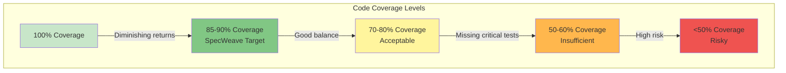

# Test Coverage

**Test Coverage** measures the percentage of your code that is executed by automated tests. It helps identify untested code paths and assess the completeness of your test suite.

---

## What is Test Coverage?

Test coverage is a **metric** that shows how much of your codebase is tested:

```
Test Coverage = (Lines Executed by Tests / Total Lines) × 100%
```

### Example

```typescript
// src/utils/discount.ts
export function calculateDiscount(price: number, percent: number): number {
  if (price < 0) {
    throw new Error('Price cannot be negative');
  }

  if (percent < 0 || percent > 100) {
    throw new Error('Percent must be between 0 and 100');
  }

  return price * (percent / 100);
}
```

**Test with 100% coverage**:
```typescript
// tests/unit/utils/discount.test.ts
describe('calculateDiscount()', () => {
  test('should calculate discount correctly', () => {
    expect(calculateDiscount(100, 10)).toBe(10);
  });

  test('should throw error for negative price', () => {
    expect(() => calculateDiscount(-100, 10)).toThrow('Price cannot be negative');
  });

  test('should throw error for invalid percent', () => {
    expect(() => calculateDiscount(100, 150)).toThrow('Percent must be between 0 and 100');
  });
});
```

**Coverage report**:
```
File: discount.ts
--------------------|---------|----------|---------|---------|
                    | % Stmts | % Branch | % Funcs | % Lines |
--------------------|---------|----------|---------|---------|
discount.ts         |   100   |   100    |   100   |   100   |
--------------------|---------|----------|---------|---------|

✅ All lines executed
✅ All branches tested (if/else paths)
✅ All functions tested
```

---

## Types of Coverage

### 1. Line Coverage

Percentage of **code lines** executed:

```typescript
function example(x: number) {
  let result = 0;           // Line 1
  if (x > 0) {              // Line 2
    result = x * 2;         // Line 3
  }
  return result;            // Line 4
}

// Test: example(5)
// Lines executed: 1, 2, 3, 4 = 100% line coverage
```

### 2. Branch Coverage

Percentage of **if/else paths** tested:

```typescript
function validate(age: number) {
  if (age >= 18) {          // Branch 1: true path
    return 'Adult';
  } else {                  // Branch 2: false path
    return 'Minor';
  }
}

// Test 1: validate(20) → Covers true branch
// Test 2: validate(15) → Covers false branch
// Total: 100% branch coverage (both paths tested)
```

**Why it matters**:
```typescript
function processPayment(amount: number) {
  if (amount > 1000) {
    return applyDiscountRules(amount);  // Complex logic here!
  }
  return amount;
}

// ❌ Only testing amount < 1000 → 50% branch coverage
// ✅ Test both branches → 100% branch coverage
```

### 3. Function Coverage

Percentage of **functions** called:

```typescript
// file.ts
export function used() { /* ... */ }
export function unused() { /* ... */ }  // Never called in tests!

// Function coverage: 50% (1 of 2 functions tested)
```

### 4. Statement Coverage

Percentage of **statements** executed (most granular):

```typescript
function calculate(x: number, y: number) {
  const sum = x + y;        // Statement 1
  const product = x * y;    // Statement 2
  const average = sum / 2;  // Statement 3
  return average;           // Statement 4
}

// Test: calculate(5, 10)
// All 4 statements executed = 100% statement coverage
```

---

## Coverage Report Example

```bash
npm run test:coverage

--------------------|---------|----------|---------|---------|-------------------|
File                | % Stmts | % Branch | % Funcs | % Lines | Uncovered Line #s |
--------------------|---------|----------|---------|---------|-------------------|
All files           |   85.2  |   82.4   |   90.1  |   85.0  |                   |
 src/               |   88.5  |   85.6   |   92.3  |   88.2  |                   |
  auth.ts           |   94.3  |   91.2   |  100.0  |   94.1  | 45-47,92          |
  order.ts          |   82.1  |   79.8   |   84.6  |   81.9  | 23-25,67-70       |
 src/utils/         |   91.2  |   88.9   |   95.0  |   91.0  |                   |
  discount.ts       |  100.0  |  100.0   |  100.0  |  100.0  |                   |
  format.ts         |   82.4  |   77.8   |   90.0  |   82.1  | 12-15             |
--------------------|---------|----------|---------|---------|-------------------|

✅ Target met: 85.2% (target: 85%)
⚠️  Uncovered lines: 12 lines need tests
```

**Visual Coverage Report** (HTML):
```bash
npm run test:coverage -- --coverage-html

# Opens coverage/lcov-report/index.html
# Interactive HTML showing:
# - Green = Covered lines
# - Red = Uncovered lines
# - Yellow = Partially covered (branches)
```

---

## Test Coverage in SpecWeave

SpecWeave tracks coverage **per task** in `tasks.md`:

### Example Task with Coverage

```markdown
## T-001: Implement Authentication Service

**AC**: AC-US1-01, AC-US1-02

**Test Plan** (BDD format):
- **Given** valid credentials → **When** login → **Then** return JWT token
- **Given** invalid password → **When** login → **Then** throw error

**Test Cases**:
- Unit (`auth.test.ts`):
  - validLogin, invalidPassword, nonexistentUser, rateLimiting
  - **Coverage**: 90% (target: 85-90%)

- Integration (`auth-flow.test.ts`):
  - loginEndpoint, sessionPersistence, databaseIntegration
  - **Coverage**: 85% (target: 80-85%)

**Overall Coverage**: 87% ✅ (target: 85%)

**Uncovered Lines**: 45-47 (error logging), 92 (admin bypass - tested manually)

**Implementation**: AuthService.ts, password hashing, JWT generation
```

### Coverage Targets by Test Type

| Test Type | SpecWeave Target | Rationale |
|-----------|-----------------|-----------|
| **Unit Tests** | 85-90% | Core business logic thoroughly tested |
| **Integration Tests** | 80-85% | Integration points verified |
| **E2E Tests** | 100% critical paths | Key user flows work end-to-end |
| **Overall** | 85%+ | High confidence, reasonable effort |

---

## Coverage Visualization



---

## The 100% Coverage Myth

**Question**: Should we aim for 100% test coverage?

**Answer**: **No**. 100% coverage has diminishing returns.

### Why Not 100%?

#### 1. Cost vs Benefit

```typescript
// Critical business logic (MUST be tested)
export function calculateRefund(order: Order): number {
  if (order.status === 'cancelled' && order.isPaid) {
    const fee = order.total * 0.05;  // 5% cancellation fee
    return order.total - fee;
  }
  return 0;
}

// Test: 100% coverage = 4 tests (all branches) → HIGH VALUE

// Trivial getter (low testing value)
export class User {
  get email(): string {
    return this._email;
  }
}

// Test: 100% coverage = 1 test (getter returns value) → LOW VALUE
// Better: Integration test that uses email naturally
```

#### 2. Uncoverable Code

Some code paths are hard to test:

```typescript
export function saveFile(path: string, data: string): void {
  try {
    fs.writeFileSync(path, data);
  } catch (error) {
    // Coverage: Hard to trigger filesystem errors in unit tests
    if (error.code === 'ENOSPC') {
      throw new Error('Disk full');
    } else if (error.code === 'EACCES') {
      throw new Error('Permission denied');
    }
    throw error;
  }
}

// Better: Test via integration test with mock filesystem
// Or: Accept 85% coverage, test common paths only
```

#### 3. False Sense of Security

```typescript
// ❌ 100% coverage, but WRONG test
function multiply(a: number, b: number): number {
  return a + b;  // BUG: Should be a * b
}

test('should multiply numbers', () => {
  const result = multiply(2, 3);
  expect(result).toBe(5);  // Test passes, but logic is wrong!
});

// Coverage: 100% ✅
// Correctness: 0% ❌
```

**Coverage ≠ Correctness**

---

## Best Practices

### 1. Focus on Critical Paths

```typescript
// ✅ HIGH PRIORITY: Payment processing (test thoroughly)
test('should process payment and update order status', async () => {
  // 90%+ coverage for payment logic
});

// 🟡 MEDIUM PRIORITY: UI formatting (test key cases)
test('should format currency correctly', () => {
  // 80% coverage for formatters
});

// 🟢 LOW PRIORITY: Constants and getters (test via integration)
export const CONFIG = {
  apiUrl: 'https://api.example.com'
};
// No dedicated test needed (used in integration tests)
```

### 2. Test Behavior, Not Coverage

```typescript
// ❌ Bad: Writing tests just to increase coverage
test('should have name property', () => {
  const user = new User('John', 'john@example.com');
  expect(user.name).toBe('John');  // Trivial test
});

// ✅ Good: Test meaningful behavior
test('should prevent duplicate email registration', async () => {
  await userService.register('john@example.com', 'password123');

  await expect(
    userService.register('john@example.com', 'other password')
  ).rejects.toThrow('Email already exists');
});
```

### 3. Use Coverage to Find Gaps

```bash
# Generate coverage report
npm run test:coverage

# Review uncovered lines
# Ask: "Are these critical paths?"
# If yes → Add tests
# If no → Document why (comments in code)
```

**Example**:
```typescript
export function processOrder(order: Order): void {
  // ... main processing logic (tested: 95% coverage)

  if (process.env.NODE_ENV === 'development') {
    // Debug logging (uncovered, documented)
    // COVERAGE: Not tested (dev-only code path)
    console.log('Order processed:', order.id);
  }
}
```

### 4. Set Realistic Targets

```typescript
// jest.config.js
module.exports = {
  coverageThreshold: {
    global: {
      statements: 85,  // SpecWeave target
      branches: 80,
      functions: 85,
      lines: 85
    },
    // Stricter for critical code
    './src/services/payment/': {
      statements: 95,
      branches: 90,
      functions: 95,
      lines: 95
    },
    // Relaxed for utilities
    './src/utils/': {
      statements: 75,
      branches: 70,
      functions: 75,
      lines: 75
    }
  }
};
```

---

## Coverage Anti-Patterns

### 1. Testing for Coverage Numbers

```typescript
// ❌ Bad: Test just to hit coverage target
test('should set email', () => {
  const user = new User();
  user.email = 'test@example.com';
  expect(user.email).toBe('test@example.com');
});

// ✅ Good: Test real behavior
test('should validate email format', () => {
  const user = new User();
  expect(() => {
    user.email = 'invalid-email';
  }).toThrow('Invalid email format');
});
```

### 2. Ignoring Important Edge Cases

```typescript
// ❌ Bad: High coverage, but missing edge cases
function divide(a: number, b: number): number {
  return a / b;
}

test('should divide numbers', () => {
  expect(divide(10, 2)).toBe(5);  // 100% coverage, but...
});

// ✅ Good: Test edge cases
test('should handle division by zero', () => {
  expect(() => divide(10, 0)).toThrow('Cannot divide by zero');
});

test('should handle negative numbers', () => {
  expect(divide(-10, 2)).toBe(-5);
});
```

### 3. Mocking Too Much

```typescript
// ❌ Bad: Mocked so heavily, test is meaningless
test('should save user', async () => {
  const mockDb = {
    save: jest.fn().mockResolvedValue({ id: 123 })
  };
  const service = new UserService(mockDb);

  const user = await service.create({ email: 'test@example.com' });

  expect(mockDb.save).toHaveBeenCalled();  // 100% coverage, but...
  // We didn't test if data is correct, validation works, etc.
});

// ✅ Good: Use real database (integration test)
test('should save user to database', async () => {
  const service = new UserService(testDb);
  const user = await service.create({ email: 'test@example.com' });

  // Verify in real database
  const saved = await testDb.users.findById(user.id);
  expect(saved.email).toBe('test@example.com');
});
```

---

## Tools for Measuring Coverage

### Jest (JavaScript/TypeScript)

```bash
# Generate coverage report
npm test -- --coverage

# Coverage in watch mode
npm test -- --coverage --watch

# Specific threshold
npm test -- --coverage --coverageThreshold='{"global":{"lines":85}}'
```

### Istanbul/nyc (JavaScript)

```bash
# Install
npm install --save-dev nyc

# Run with coverage
nyc npm test

# HTML report
nyc --reporter=html npm test
```

### Coverage.py (Python)

```bash
# Install
pip install coverage

# Run with coverage
coverage run -m pytest

# Report
coverage report
coverage html
```

---

## SpecWeave Coverage Validation

SpecWeave provides `/specweave:validate-coverage` command:

```bash
# Validate coverage for increment
/specweave:validate-coverage 0008

# Output:
✅ Increment 0008: User Authentication
--------------------|---------|----------|---------|---------|
Task                | % Stmts | % Branch | % Funcs | % Lines | Target |
--------------------|---------|----------|---------|---------|--------|
T-001: AuthService  |   90.1  |   88.5   |   95.0  |   90.0  | 85-90% | ✅
T-002: Login API    |   85.3  |   82.1   |   90.0  |   85.1  | 80-85% | ✅
T-003: Login UI     |   87.2  |   85.9   |   92.0  |   87.0  | 85-90% | ✅
--------------------|---------|----------|---------|---------|--------|
Overall             |   87.5  |   85.5   |   92.3  |   87.4  | 85%+   | ✅

🎉 All coverage targets met!
```

---

## Related Terms

- [Unit Testing](/docs/glossary/terms/unit-testing) - Testing individual functions
- [Integration Testing](/docs/glossary/terms/integration-testing) - Testing component interactions
- [TDD](/docs/glossary/terms/tdd) - Test-driven development
- [Test Pyramid](/docs/glossary/terms/test-pyramid) - Testing strategy distribution

---

## Summary

**Test coverage measures code tested by automated tests**:
- **Line coverage**: % of lines executed
- **Branch coverage**: % of if/else paths tested
- **Function coverage**: % of functions called
- **Statement coverage**: % of statements executed

**SpecWeave coverage targets**:
- **Unit tests**: 85-90% coverage (core logic)
- **Integration tests**: 80-85% coverage (integration points)
- **E2E tests**: 100% critical paths (key user flows)
- **Overall**: 85%+ (high confidence)

**Key insight**: **Coverage is a guide, not a goal**. 85% coverage with meaningful tests beats 100% coverage with trivial tests. Focus on critical paths and behavior, not numbers.
