# Test Pyramid

**The Test Pyramid** is a testing strategy that defines the ideal distribution of test types in a software project. It recommends having **many unit tests**, **some integration tests**, and **few end-to-end tests** to achieve optimal test coverage, speed, and reliability.

---

## The Pyramid Shape


### Why a Pyramid?

The shape represents:
- **Base (Unit)**: Many fast, focused tests
- **Middle (Integration)**: Moderate number of component interaction tests
- **Top (E2E)**: Few comprehensive end-to-end tests

---

## Test Pyramid Breakdown

### 1. Unit Tests (70% of Tests)

**What**: Test individual functions/classes in isolation

**Characteristics**:
- ⚡ **Fast**: Milliseconds per test
- 💰 **Cheap**: Easy to write and maintain
- 🎯 **Focused**: Test one unit at a time
- 🔄 **Frequent**: Run on every code change

**Example**:
```typescript
// tests/unit/services/discount.test.ts
test('should calculate 10% discount', () => {
  const result = calculateDiscount(100, 10);
  expect(result).toBe(10);
});

// Execution: 5ms
// Maintenance: Low (stable API)
// Feedback: Immediate (which function failed)
```

### 2. Integration Tests (20% of Tests)

**What**: Test how components work together

**Characteristics**:
- 🐢 **Slower**: Seconds per test
- 💵 **Moderate cost**: Setup required (DB, APIs)
- 🔗 **Connected**: Test interactions
- 📅 **Regular**: Run before commits/merges

**Example**:
```typescript
// tests/integration/api/auth.test.ts
test('should register user and save to database', async () => {
  const response = await request(app)
    .post('/api/auth/register')
    .send({ email: 'user@example.com', password: 'SecurePass123' });

  expect(response.status).toBe(201);

  const user = await db.users.findOne({ email: 'user@example.com' });
  expect(user).toBeDefined();
});

// Execution: 2s
// Maintenance: Medium (DB schema changes)
// Feedback: Clear (which integration point failed)
```

### 3. E2E Tests (10% of Tests)

**What**: Test complete user flows through UI

**Characteristics**:
- 🐌 **Slowest**: Minutes per test
- 💸 **Expensive**: Complex setup, brittle
- 🌐 **Comprehensive**: Test entire system
- ⏰ **Infrequent**: Run before releases

**Example**:
```typescript
// tests/e2e/checkout.spec.ts
test('user can complete purchase', async ({ page }) => {
  await page.goto('/products');
  await page.click('[data-product="laptop"]');
  await page.click('[data-testid="add-to-cart"]');
  await page.click('[data-testid="checkout"]');
  await page.fill('[name="cardNumber"]', '4242424242424242');
  await page.click('[data-testid="pay"]');

  await expect(page.locator('[data-testid="success"]')).toBeVisible();
});

// Execution: 30s
// Maintenance: High (UI changes break tests)
// Feedback: Vague (somewhere in checkout flow)
```

---

## Test Distribution Example

### Realistic Test Suite

```
Total Tests: 1000

Unit Tests:        700 (70%)
├─ Services:       300 tests
├─ Utils:          200 tests
├─ Models:         150 tests
└─ Validators:      50 tests

Integration Tests: 200 (20%)
├─ API endpoints:  100 tests
├─ Database:        60 tests
└─ External APIs:   40 tests

E2E Tests:         100 (10%)
├─ User flows:      60 tests
├─ Admin flows:     30 tests
└─ Critical paths:  10 tests

Execution Time:
- Unit: 5s
- Integration: 3m
- E2E: 12m
Total: ~15 minutes
```

---

## Why This Distribution?

### Speed vs Coverage Trade-off

```mermaid
graph LR
    A[Test Type] --> B{Speed}
    B --> C[Unit: ⚡ 5ms]
    B --> D[Integration: 🐢 2s]
    B --> E[E2E: 🐌 30s]

    A --> F{Feedback Quality}
    F --> G[Unit: 🎯 Precise]
    F --> H[Integration: 🔍 Clear]
    F --> I[E2E: 🌫️ Vague]

    A --> J{Maintenance}
    J --> K[Unit: ✅ Low]
    J --> L[Integration: 🟡 Medium]
    J --> M[E2E: ❌ High]
```



### Cost Analysis

| Test Type | Write Time | Run Time | Maintenance | Total Cost |
|-----------|-----------|----------|-------------|------------|
| **Unit** | 5 min | 5ms | Low | 💰 Cheap |
| **Integration** | 15 min | 2s | Medium | 💰💰 Moderate |
| **E2E** | 30 min | 30s | High | 💰💰💰 Expensive |

**Example Cost Calculation** (1000 tests):
- **700 unit tests**: 700 × 5 min = 58 hours to write, 3.5s to run
- **200 integration tests**: 200 × 15 min = 50 hours to write, 6.7 min to run
- **100 E2E tests**: 100 × 30 min = 50 hours to write, 50 min to run

**Total**: 158 hours to write, ~57 minutes to run (parallel execution)

---

## The Test Pyramid in SpecWeave

SpecWeave enforces the Test Pyramid in `plan.md` and `tasks.md`:

### Test Strategy in plan.md

```markdown
## Test Strategy

### Test Distribution (Test Pyramid)

- **Unit Tests**: 85% coverage target
  - Services, utilities, validators, models
  - Focus: Business logic, edge cases, error handling
  - Tools: Jest, fast execution

- **Integration Tests**: 80% coverage target
  - API endpoints, database operations, service interactions
  - Focus: Component integration, data flow
  - Tools: Jest + Supertest, test containers

- **E2E Tests**: 100% coverage of critical user flows
  - Login flow, checkout flow, admin panel
  - Focus: Key user journeys, smoke tests
  - Tools: Playwright, cross-browser

### Coverage Goals

- Unit: 700 tests (70% of total)
- Integration: 200 tests (20% of total)
- E2E: 100 tests (10% of total)
- Total execution time: < 15 minutes (CI pipeline)
```

### Task with Test Pyramid

```markdown
## T-001: Implement Order Processing

**AC**: AC-US3-01, AC-US3-02

**Test Plan** (Test Pyramid compliant):

**Unit Tests** (`order.test.ts`):
- calculateTotal: Basic calculation, tax, discount, edge cases
- validateOrder: Empty cart, invalid items, quantity limits
- applyPromoCode: Valid code, expired code, usage limits
- **Coverage**: 90% (target: 85-90%)

**Integration Tests** (`order-api.test.ts`):
- POST /api/orders: Create order, update inventory, send confirmation
- GET /api/orders/:id: Retrieve order with items
- Database transactions: Rollback on failure
- **Coverage**: 85% (target: 80-85%)

**E2E Tests** (`checkout.spec.ts`):
- completeCheckoutFlow: Add to cart → Checkout → Payment → Success
- **Coverage**: 100% (critical path)

**Test Distribution**:
- Unit: 15 tests (75%)
- Integration: 4 tests (20%)
- E2E: 1 test (5%)
- Total: 20 tests

**Overall Coverage**: 88% ✅
```

---

## Anti-Pattern: Ice Cream Cone

The **Ice Cream Cone** is the opposite of the pyramid - an anti-pattern to avoid:

```mermaid
graph TB
    subgraph "Ice Cream Cone (Anti-Pattern)"
        A["E2E Tests<br/>(60%)<br/>❌ Too many!"]
        B["Integration Tests<br/>(30%)"]
        C["Unit Tests<br/>(10%)<br/>❌ Too few!"]
    end

    C --- B
    B --- A

    style A fill:#ef5350,color:#fff
    style B fill:#ffa726,color:#fff
    style C fill:#ffeb3b,color:#000
```



### Problems with Ice Cream Cone

1. **Slow Feedback**: E2E tests take hours to run
2. **Brittle Tests**: UI changes break many tests
3. **Vague Failures**: Hard to debug (which component failed?)
4. **High Maintenance**: Constant test updates
5. **CI Bottleneck**: Long CI/CD pipelines

**Example**:
```
Project with Ice Cream Cone:
- 600 E2E tests (60%)
- 300 integration tests (30%)
- 100 unit tests (10%)

CI Pipeline Time: 4 hours 😢
Developer waiting time: Unacceptable
Test failures: Frequent (brittle E2E tests)
```

---

## How to Apply the Test Pyramid

### Step 1: Test Business Logic with Unit Tests

```typescript
// ✅ Unit test: Fast, focused
test('should apply 10% discount to premium users', () => {
  const order = new Order({ total: 100, user: { premium: true } });
  const discount = order.calculateDiscount();
  expect(discount).toBe(10);
});

// ❌ Don't use E2E for this
// test('should apply discount', async ({ page }) => {
//   await page.goto('/checkout');
//   await page.selectOption('user-type', 'premium');
//   // ... many more steps
// });
```

### Step 2: Test Integration Points with Integration Tests

```typescript
// ✅ Integration test: Verifies API + DB
test('should create order and update inventory', async () => {
  const response = await request(app)
    .post('/api/orders')
    .send({ productId: 'laptop', quantity: 2 });

  expect(response.status).toBe(201);

  const product = await db.products.findById('laptop');
  expect(product.stock).toBe(8); // Was 10, now 8
});

// ❌ Don't use unit test with mocks
// test('should update inventory', () => {
//   mockDb.products.update = jest.fn();
//   // Doesn't test real integration!
// });
```

### Step 3: Test Critical User Flows with E2E

```typescript
// ✅ E2E test: Complete user journey
test('user can complete purchase', async ({ page }) => {
  await page.goto('/products');
  await page.click('[data-product="laptop"]');
  await page.click('[data-testid="add-to-cart"]');
  await page.click('[data-testid="checkout"]');
  await page.fill('[name="cardNumber"]', '4242424242424242');
  await page.click('[data-testid="pay"]');

  await expect(page.locator('[data-testid="success"]')).toBeVisible();
});

// ❌ Don't test every scenario via E2E
// test('invalid card number shows error', async ({ page }) => {
//   // Better as integration test!
// });
```

---

## Test Pyramid Best Practices

### 1. Push Tests Down

Test at the **lowest level possible**:

```
Can this be a unit test?
├─ Yes → Write unit test ✅
└─ No → Can this be an integration test?
    ├─ Yes → Write integration test ✅
    └─ No → Write E2E test (last resort)
```

**Example**:
```typescript
// Business rule: "Premium users get 10% discount"

// ✅ Unit test (best choice)
test('should calculate premium discount', () => {
  expect(calculateDiscount(100, 'premium')).toBe(10);
});

// 🟡 Integration test (unnecessary)
test('should apply discount via API', async () => {
  const response = await request(app).post('/api/discount').send(...);
  expect(response.body.discount).toBe(10);
});

// ❌ E2E test (overkill!)
test('should show discount on checkout page', async ({ page }) => {
  await page.goto('/checkout');
  // ... complex UI interactions
});
```

### 2. Test Critical Paths Only (E2E)

```typescript
// ✅ E2E: Critical user flows
test('user can register and make first purchase', async ({ page }) => { /* ... */ });
test('admin can manage products', async ({ page }) => { /* ... */ });

// ❌ E2E: Not critical (use integration test)
test('user can update profile picture', async ({ page }) => { /* ... */ });
```

### 3. Balance Speed and Confidence

```typescript
// Fast feedback loop (unit + integration)
npm run test:unit        # 5s
npm run test:integration # 3m
# Total: ~3 minutes → Run on every commit

// Full validation (E2E)
npm run test:e2e         # 12m
# Total: 15 minutes → Run before merge/deploy
```

---

## Test Pyramid Validation

SpecWeave provides validation for Test Pyramid compliance:

```bash
/specweave:validate-pyramid 0008

# Output:
📊 Test Pyramid Analysis: Increment 0008

Test Distribution:
├─ Unit Tests:        45 (75%) ✅ Target: 70%
├─ Integration Tests: 12 (20%) ✅ Target: 20%
└─ E2E Tests:         3 (5%)   ✅ Target: 10%

Total Tests: 60

Execution Time:
├─ Unit:        0.3s   ✅
├─ Integration: 24s    ✅
└─ E2E:         90s    ✅
Total:          114s   ✅ (< 15 minutes)

Coverage:
├─ Unit:        90%    ✅ (target: 85-90%)
├─ Integration: 85%    ✅ (target: 80-85%)
└─ E2E:         100%   ✅ (critical paths)

✅ Test Pyramid: Well-balanced!
```

---

## Common Test Pyramid Mistakes

### 1. Testing Everything via E2E

```typescript
// ❌ Bad: 500 E2E tests for every scenario
test('should show error for invalid email format', async ({ page }) => {
  // E2E is too slow for validation testing!
});

// ✅ Good: Unit test for validation
test('should reject invalid email format', () => {
  expect(() => validateEmail('invalid')).toThrow('Invalid email format');
});
```

### 2. No E2E Tests

```typescript
// ❌ Bad: Only unit and integration tests
// Missing: End-to-end validation of critical flows
// Risk: Individual pieces work, but system doesn't

// ✅ Good: Add E2E for critical paths
test('user can complete purchase', async ({ page }) => {
  // Verifies entire system works together
});
```

### 3. Mocking Too Much in Integration Tests

```typescript
// ❌ Bad: Integration test with mocked database
test('should save order', async () => {
  mockDb.save = jest.fn().mockResolvedValue({ id: 123 });
  // Not testing real integration!
});

// ✅ Good: Use real test database
test('should save order to database', async () => {
  const order = await orderService.create({ items: [...] });
  const saved = await testDb.orders.findById(order.id);
  expect(saved).toBeDefined();
});
```

---

## Test Pyramid Evolution


**Most teams start with E2E tests** (easiest to understand), then realize they need faster, more focused tests.

---

## Related Terms

- [Unit Testing](/docs/glossary/terms/unit-testing) - Base of the pyramid (70%)
- [Integration Testing](/docs/glossary/terms/integration-testing) - Middle of the pyramid (20%)
- E2E Testing - Top of the pyramid (10%)
- [Test Coverage](/docs/glossary/terms/test-coverage) - Measuring code tested
- [TDD](/docs/glossary/terms/tdd) - Test-driven development workflow

---

## Summary

**The Test Pyramid defines optimal test distribution**:
- **70% Unit Tests**: Fast, focused, cheap
- **20% Integration Tests**: Medium speed, component interactions
- **10% E2E Tests**: Slow, comprehensive, expensive

**Why pyramid shape?**:
- **Speed**: Most tests run fast (unit tests)
- **Feedback**: Precise failure location (unit tests)
- **Confidence**: Critical flows validated (E2E tests)
- **Maintenance**: Fewer brittle tests (less E2E)

**SpecWeave enforces Test Pyramid**:
- Test strategy in `plan.md`
- Per-task test distribution in `tasks.md`
- Validation via `/specweave:validate-pyramid`
- Coverage targets per test type

**Key insight**: **Test at the lowest level possible**. Unit tests are your foundation - fast, reliable, and precise. E2E tests are your safety net - slow but comprehensive. Balance is key.
