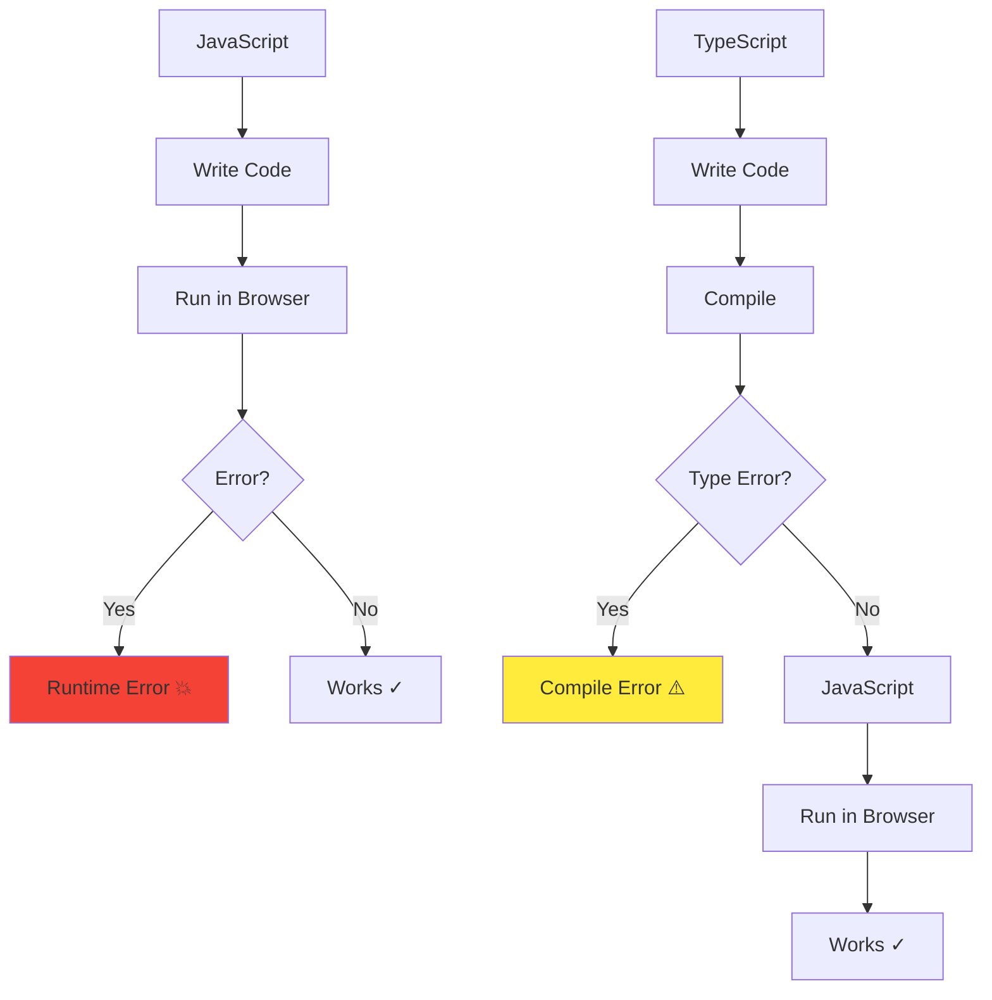
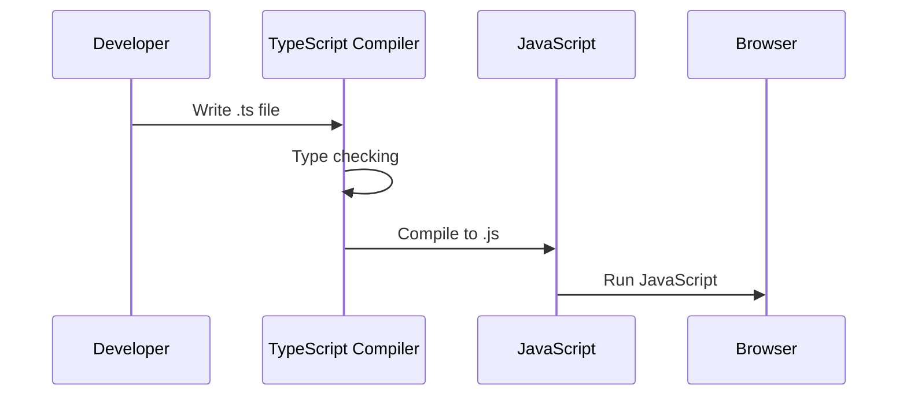

# TypeScript

## Definition

**TypeScript** is a typed superset of JavaScript that compiles to plain JavaScript. Created and maintained by Microsoft, it adds optional static typing, interfaces, generics, and modern JavaScript features.

Think of it as **"JavaScript with guardrails"** - catch errors before runtime, get better IDE support, and write more maintainable code.

## What Problem Does It Solve?

### The Problem: JavaScript's Lack of Type Safety

**Scenario**: You're building a user profile feature.

**JavaScript (no types)**:

```javascript
function updateUser(user) {
  return fetch(`/api/users/${user.id}`, {
    method: 'PUT',
    body: JSON.stringify(user)
  });
}

// Later in code...
updateUser({ name: 'Alice' }); // Bug! Missing 'id' property
// Runtime error: Cannot read property 'id' of undefined
```

**TypeScript (with types)**:

```typescript
interface User {
  id: string;
  name: string;
  email: string;
}

function updateUser(user: User): Promise<Response> {
  return fetch(`/api/users/${user.id}`, {
    method: 'PUT',
    body: JSON.stringify(user)
  });
}

// Later in code...
updateUser({ name: 'Alice' }); // ❌ Compile error!
// Error: Property 'id' is missing
```

**Result**: Error caught at compile time, not runtime!

### Why TypeScript Matters



## How It Works

### TypeScript Compilation



### Type System

**Basic Types**:

```typescript
// Primitive types
let name: string = 'Alice';
let age: number = 25;
let active: boolean = true;
let tags: string[] = ['typescript', 'javascript'];
let data: any = { anything: true }; // Avoid 'any'!

// Object types
let user: { id: number; name: string } = {
  id: 1,
  name: 'Alice'
};

// Function types
function greet(name: string): string {
  return `Hello, ${name}!`;
}

// Arrow function
const add = (a: number, b: number): number => a + b;

// Union types
let id: string | number;
id = '123'; // OK
id = 123;   // OK

// Literal types
let status: 'pending' | 'approved' | 'rejected';
status = 'pending';  // OK
status = 'invalid';  // ❌ Error!
```

## Core Features

### 1. Interfaces

**Define object shapes**:

```typescript
interface User {
  id: string;
  name: string;
  email: string;
  age?: number;           // Optional property
  readonly createdAt: Date; // Read-only
}

interface Admin extends User {
  permissions: string[];
}

const user: User = {
  id: '123',
  name: 'Alice',
  email: 'alice@example.com',
  createdAt: new Date()
};

// user.createdAt = new Date(); // ❌ Error: readonly
```

### 2. Type Aliases

**Create reusable types**:

```typescript
type ID = string | number;
type Status = 'pending' | 'approved' | 'rejected';

type User = {
  id: ID;
  name: string;
  status: Status;
};

// Function types
type APIResponse<T> = {
  data: T;
  error: string | null;
  loading: boolean;
};

const response: APIResponse<User> = {
  data: { id: '123', name: 'Alice', status: 'approved' },
  error: null,
  loading: false
};
```

### 3. Generics

**Reusable type-safe functions**:

```typescript
// Generic function
function identity<T>(value: T): T {
  return value;
}

const num = identity<number>(42);      // number
const str = identity<string>('hello'); // string

// Generic interface
interface Box<T> {
  value: T;
}

const numberBox: Box<number> = { value: 42 };
const stringBox: Box<string> = { value: 'hello' };

// Generic class
class DataLoader<T> {
  private data: T[] = [];

  add(item: T): void {
    this.data.push(item);
  }

  get(): T[] {
    return this.data;
  }
}

const userLoader = new DataLoader<User>();
userLoader.add({ id: '123', name: 'Alice' });
```

### 4. Enums

**Named constants**:

```typescript
enum UserRole {
  Admin = 'ADMIN',
  User = 'USER',
  Guest = 'GUEST'
}

enum HttpStatus {
  OK = 200,
  NotFound = 404,
  ServerError = 500
}

function checkRole(role: UserRole): void {
  if (role === UserRole.Admin) {
    console.log('Admin access');
  }
}

checkRole(UserRole.Admin); // OK
checkRole('ADMIN');         // ❌ Error!
```

### 5. Type Inference

**TypeScript infers types automatically**:

```typescript
// Type inferred as string
let message = 'Hello';
message = 42; // ❌ Error!

// Type inferred from function return
function getUser() {
  return { id: '123', name: 'Alice' };
}

const user = getUser(); // Type: { id: string; name: string }
user.email; // ❌ Error: Property 'email' does not exist
```

## Real-World Examples

### Example 1: API Client

```typescript
// types.ts
interface User {
  id: string;
  name: string;
  email: string;
}

interface Post {
  id: string;
  title: string;
  content: string;
  authorId: string;
}

type APIError = {
  code: string;
  message: string;
};

// api-client.ts
class APIClient {
  private baseURL: string;

  constructor(baseURL: string) {
    this.baseURL = baseURL;
  }

  async get<T>(endpoint: string): Promise<T> {
    const response = await fetch(`${this.baseURL}${endpoint}`);

    if (!response.ok) {
      const error: APIError = await response.json();
      throw new Error(error.message);
    }

    return response.json();
  }

  async post<T, R>(endpoint: string, data: T): Promise<R> {
    const response = await fetch(`${this.baseURL}${endpoint}`, {
      method: 'POST',
      headers: { 'Content-Type': 'application/json' },
      body: JSON.stringify(data)
    });

    return response.json();
  }
}

// Usage
const api = new APIClient('https://api.example.com');

// Type-safe API calls
const users = await api.get<User[]>('/users');
const post = await api.post<Partial<Post>, Post>('/posts', {
  title: 'My Post',
  content: 'Content here'
});
```

### Example 2: React Component (TypeScript)

```typescript
import { useState, useEffect } from 'react';

interface Props {
  userId: string;
  onUpdate?: (user: User) => void;
}

interface User {
  id: string;
  name: string;
  email: string;
}

export function UserProfile({ userId, onUpdate }: Props) {
  const [user, setUser] = useState<User | null>(null);
  const [loading, setLoading] = useState(true);
  const [error, setError] = useState<string | null>(null);

  useEffect(() => {
    fetch(`/api/users/${userId}`)
      .then(res => res.json())
      .then((data: User) => {
        setUser(data);
        setLoading(false);
      })
      .catch((err: Error) => {
        setError(err.message);
        setLoading(false);
      });
  }, [userId]);

  const handleUpdate = () => {
    if (user && onUpdate) {
      onUpdate(user);
    }
  };

  if (loading) return <div>Loading...</div>;
  if (error) return <div>Error: {error}</div>;
  if (!user) return null;

  return (
    <div>
      <h1>{user.name}</h1>
      <p>{user.email}</p>
      <button onClick={handleUpdate}>Update</button>
    </div>
  );
}
```

### Example 3: Utility Types

```typescript
// Partial - Make all properties optional
type UpdateUser = Partial<User>;
const update: UpdateUser = { name: 'Bob' }; // OK

// Required - Make all properties required
interface Config {
  host?: string;
  port?: number;
}
type RequiredConfig = Required<Config>;
const config: RequiredConfig = {
  host: 'localhost', // Required
  port: 3000         // Required
};

// Pick - Select specific properties
type UserPreview = Pick<User, 'id' | 'name'>;
const preview: UserPreview = { id: '123', name: 'Alice' };

// Omit - Exclude specific properties
type UserWithoutEmail = Omit<User, 'email'>;
const user: UserWithoutEmail = { id: '123', name: 'Alice' };

// Record - Create object type with specific keys
type UserMap = Record<string, User>;
const users: UserMap = {
  '123': { id: '123', name: 'Alice', email: 'alice@example.com' },
  '456': { id: '456', name: 'Bob', email: 'bob@example.com' }
};
```

## TypeScript vs JavaScript

| Aspect | JavaScript | TypeScript |
|--------|------------|------------|
| **Types** | ❌ Dynamic (runtime) | ✅ Static (compile-time) |
| **IDE Support** | ❌ Basic | ✅ Excellent (autocomplete, refactor) |
| **Error Detection** | ❌ Runtime only | ✅ Compile-time + runtime |
| **Refactoring** | ❌ Manual, error-prone | ✅ Automated, safe |
| **Learning Curve** | ✅ Easy | ⚠️ Moderate |
| **Bundle Size** | ✅ No compilation | ⚠️ Compiles to JS (same size) |
| **Browser Support** | ✅ Native | ❌ Must compile |

## How SpecWeave Uses TypeScript

### 1. SpecWeave is Built with TypeScript

**Core codebase**:

```
specweave/
├── src/
│   ├── core/
│   │   ├── plugin-loader.ts      # TypeScript
│   │   ├── config-manager.ts     # TypeScript
│   │   └── types/
│   │       └── plugin.ts         # Type definitions
│   ├── cli/
│   │   └── commands/
│   │       └── init.ts           # TypeScript
│   └── utils/
│       └── translation.ts        # TypeScript
└── tsconfig.json                 # TypeScript config
```

### 2. Type-Safe Plugins

**Plugin types**:

```typescript
// plugin.ts
export interface PluginManifest {
  name: string;
  version: string;
  description: string;
  author?: {
    name: string;
    email?: string;
  };
  dependencies?: Record<string, string>;
}

export interface Skill {
  name: string;
  description: string;
  activate: (context: Context) => void;
}

export interface Agent {
  name: string;
  role: string;
  capabilities: string[];
}
```

### 3. TypeScript + SpecWeave Workflow

```mermaid
graph TB
    A[/specweave:increment "TypeScript Feature"] --> B[PM: Define Types]
    B --> C[Architect: Design Interfaces]
    C --> D[/specweave:do]
    D --> E[Implement Types]
    E --> F[Implement Logic]
    F --> G[Compile TypeScript]
    G --> H[Test]
    H --> I[/specweave:done]

    style B fill:#3178c6
    style C fill:#3178c6
```

### 4. Project Configuration

**tsconfig.json** (SpecWeave's TypeScript config):

```json
{
  "compilerOptions": {
    "target": "ES2020",
    "module": "commonjs",
    "lib": ["ES2020"],
    "outDir": "./dist",
    "rootDir": "./src",
    "strict": true,
    "esModuleInterop": true,
    "skipLibCheck": true,
    "forceConsistentCasingInFileNames": true,
    "declaration": true,
    "declarationMap": true,
    "sourceMap": true
  },
  "include": ["src/**/*"],
  "exclude": ["node_modules", "dist", "tests"]
}
```

## TypeScript Configuration

### Strict Mode (Recommended)

```json
{
  "compilerOptions": {
    "strict": true,              // Enable all strict checks
    "noImplicitAny": true,       // No implicit 'any'
    "strictNullChecks": true,    // null/undefined checks
    "strictFunctionTypes": true, // Function type checks
    "noUnusedLocals": true,      // Unused variables error
    "noUnusedParameters": true   // Unused params error
  }
}
```

### Common Options

```json
{
  "compilerOptions": {
    "target": "ES2020",          // Output JavaScript version
    "module": "commonjs",        // Module system
    "lib": ["ES2020", "DOM"],    // Type definitions
    "outDir": "./dist",          // Output directory
    "rootDir": "./src",          // Source directory
    "sourceMap": true,           // Generate .map files
    "declaration": true,         // Generate .d.ts files
    "esModuleInterop": true,     // Better import compatibility
    "resolveJsonModule": true    // Import JSON files
  }
}
```

## Best Practices

### ✅ Do

1. **Enable strict mode** (`"strict": true`)
2. **Avoid `any` type** (use `unknown` instead)
3. **Use interfaces for objects** (better error messages)
4. **Use type aliases for unions** (more readable)
5. **Enable noUnusedLocals and noUnusedParameters**
6. **Use type inference when possible** (less verbose)

### ❌ Don't

1. **Don't use `any`** (defeats purpose of TypeScript)
2. **Don't disable strict checks** (lose type safety)
3. **Don't use `as any`** (type assertion escape hatch)
4. **Don't ignore type errors** (fix them!)
5. **Don't over-engineer types** (keep it simple)

## Common Patterns

### 1. Type Guards

**Narrow types at runtime**:

```typescript
function isUser(obj: unknown): obj is User {
  return (
    typeof obj === 'object' &&
    obj !== null &&
    'id' in obj &&
    'name' in obj
  );
}

function processData(data: unknown) {
  if (isUser(data)) {
    console.log(data.name); // TypeScript knows it's a User
  }
}
```

### 2. Discriminated Unions

**Type-safe state management**:

```typescript
type LoadingState = { status: 'loading' };
type SuccessState<T> = { status: 'success'; data: T };
type ErrorState = { status: 'error'; error: string };

type State<T> = LoadingState | SuccessState<T> | ErrorState;

function render(state: State<User>) {
  switch (state.status) {
    case 'loading':
      return <div>Loading...</div>;
    case 'success':
      return <div>{state.data.name}</div>; // TypeScript knows data exists
    case 'error':
      return <div>{state.error}</div>;     // TypeScript knows error exists
  }
}
```

### 3. Const Assertions

**Narrow literal types**:

```typescript
// Without const assertion
const config = {
  host: 'localhost',
  port: 3000
}; // Type: { host: string; port: number }

// With const assertion
const config = {
  host: 'localhost',
  port: 3000
} as const; // Type: { readonly host: 'localhost'; readonly port: 3000 }
```

## Common Mistakes

### ❌ Mistake 1: Using `any`

```typescript
// ❌ WRONG - Defeats TypeScript
function processData(data: any) {
  return data.value; // No type safety!
}

// ✅ CORRECT - Use proper types
function processData(data: { value: string }) {
  return data.value;
}
```

### ❌ Mistake 2: Not Handling null/undefined

```typescript
// ❌ WRONG - Possible runtime error
function getUserName(user: User): string {
  return user.name; // What if user is null?
}

// ✅ CORRECT - Handle null explicitly
function getUserName(user: User | null): string {
  return user?.name ?? 'Unknown';
}
```

### ❌ Mistake 3: Type Assertions Without Validation

```typescript
// ❌ WRONG - Unsafe type assertion
const user = JSON.parse(data) as User; // No runtime check!

// ✅ CORRECT - Validate at runtime
function isUser(obj: unknown): obj is User {
  // Validation logic
}

const parsed = JSON.parse(data);
if (isUser(parsed)) {
  const user: User = parsed; // Safe!
}
```

## Migration from JavaScript

### Step-by-Step Migration

```bash
# 1. Rename .js to .ts
mv src/index.js src/index.ts

# 2. Add tsconfig.json
npx tsc --init

# 3. Start with loose settings
{
  "compilerOptions": {
    "strict": false,
    "noImplicitAny": false
  }
}

# 4. Fix type errors incrementally

# 5. Enable strict mode gradually
{
  "compilerOptions": {
    "strict": true
  }
}
```

## Related Terms

- **[React](/docs/glossary/terms/react)** - Often used with TypeScript
- **[Angular](/docs/glossary/terms/angular)** - Requires TypeScript
- **[Next.js](/docs/glossary/terms/nextjs)** - Excellent TypeScript support
- **[Node.js](/docs/glossary/terms/nodejs)** - Can run TypeScript (with compilation)
- **Frontend** - TypeScript improves frontend development

## Learn More

- **[TypeScript Official Docs](https://www.typescriptlang.org/docs/)** - Comprehensive documentation
- **TypeScript Tutorial** - SpecWeave TypeScript guide
- **React + TypeScript** - Using TypeScript with React
- **[SpecWeave Source Code](https://github.com/anton-abyzov/specweave)** - Real-world TypeScript examples

---

**Category**: Frontend Development, Backend Development, Programming Languages

**Tags**: `#typescript` `#javascript` `#types` `#static-typing` `#microsoft`
