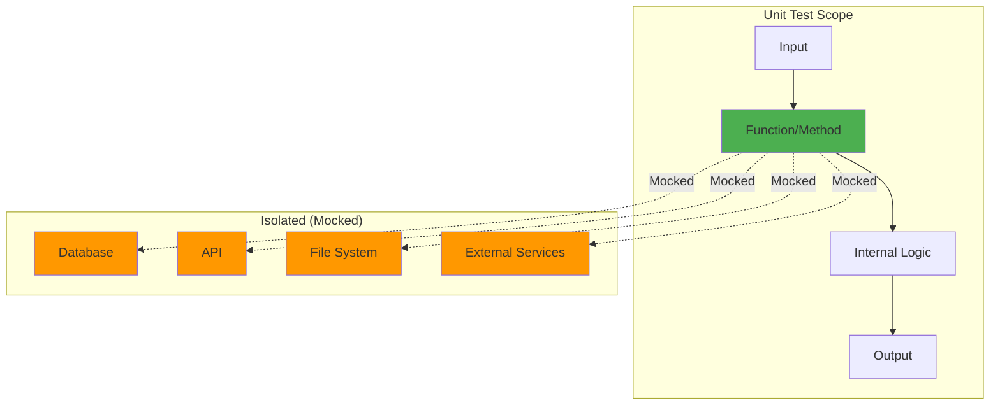

# Unit Testing

**Unit Testing** is a software testing methodology that tests individual units of code (functions, methods, classes) in **isolation** from the rest of the system. Unit tests verify that each unit works correctly on its own, independent of external dependencies.

---

## What is a "Unit"?

A **unit** is the smallest testable part of code:

- **Function**: `calculateTotal(items)`
- **Method**: `user.authenticate(password)`
- **Class**: `AuthService`
- **Module**: `emailValidator`

### Example Unit

```typescript
// Unit: A single function
export function calculateDiscount(price: number, discountPercent: number): number {
  if (price < 0) throw new Error('Price cannot be negative');
  if (discountPercent < 0 || discountPercent > 100) {
    throw new Error('Discount must be between 0 and 100');
  }

  return price * (discountPercent / 100);
}
```

### Unit Test

```typescript
// tests/unit/utils/discount.test.ts
import { calculateDiscount } from '../../../src/utils/discount';

describe('calculateDiscount()', () => {
  it('should calculate 10% discount correctly', () => {
    const result = calculateDiscount(100, 10);
    expect(result).toBe(10);
  });

  it('should throw error for negative price', () => {
    expect(() => calculateDiscount(-100, 10)).toThrow('Price cannot be negative');
  });

  it('should throw error for discount > 100', () => {
    expect(() => calculateDiscount(100, 150)).toThrow('Discount must be between 0 and 100');
  });
});
```

---

## Key Characteristics of Unit Tests

### 1. Isolation

Unit tests run in **isolation** - no database, no network, no file system:

```typescript
// ❌ Bad: Not isolated (depends on database)
test('should find user by email', async () => {
  const user = await userRepository.findByEmail('user@example.com');
  expect(user.email).toBe('user@example.com');
});

// ✅ Good: Isolated (mocked database)
test('should find user by email', async () => {
  const mockDb = {
    findOne: jest.fn().mockResolvedValue({ email: 'user@example.com' })
  };
  const userRepository = new UserRepository(mockDb);

  const user = await userRepository.findByEmail('user@example.com');

  expect(user.email).toBe('user@example.com');
  expect(mockDb.findOne).toHaveBeenCalledWith({ email: 'user@example.com' });
});
```

### 2. Fast Execution

Unit tests should run in **milliseconds**:

```bash
# Good unit test suite: 1000 tests in < 5 seconds
npm run test:unit

PASS  tests/unit/utils/discount.test.ts (12 ms)
PASS  tests/unit/services/auth.test.ts (18 ms)
PASS  tests/unit/models/user.test.ts (9 ms)

Test Suites: 50 passed, 50 total
Tests:       1000 passed, 1000 total
Time:        4.2s
```

### 3. Independent

Tests should **not depend** on each other:

```typescript
// ❌ Bad: Tests depend on execution order
let user;

test('should create user', () => {
  user = new User('user@example.com');
  expect(user).toBeDefined();
});

test('should update user email', () => {
  user.updateEmail('new@example.com'); // Depends on previous test!
  expect(user.email).toBe('new@example.com');
});

// ✅ Good: Each test is independent
describe('User', () => {
  test('should create user', () => {
    const user = new User('user@example.com');
    expect(user.email).toBe('user@example.com');
  });

  test('should update email', () => {
    const user = new User('user@example.com');
    user.updateEmail('new@example.com');
    expect(user.email).toBe('new@example.com');
  });
});
```

---

## Unit Testing Patterns

### AAA Pattern (Arrange-Act-Assert)

The most common pattern for structuring tests:

```typescript
test('should calculate order total with tax', () => {
  // Arrange: Set up test data
  const items = [
    { name: 'Laptop', price: 1000 },
    { name: 'Mouse', price: 50 }
  ];
  const taxRate = 0.1; // 10%

  // Act: Execute the function under test
  const total = calculateOrderTotal(items, taxRate);

  // Assert: Verify the result
  expect(total).toBe(1155); // (1000 + 50) * 1.1
});
```

### Test Doubles (Mocks, Stubs, Spies)

Replace external dependencies with test doubles:

#### Mock (Fake Implementation)

```typescript
test('should send welcome email after registration', async () => {
  // Mock: Fake email service
  const emailService = {
    send: jest.fn().mockResolvedValue({ success: true })
  };

  const authService = new AuthService(emailService);
  await authService.register('user@example.com', 'password123');

  // Verify mock was called correctly
  expect(emailService.send).toHaveBeenCalledWith({
    to: 'user@example.com',
    subject: 'Welcome to SpecWeave',
    body: expect.any(String)
  });
});
```

#### Stub (Canned Response)

```typescript
test('should return cached data when available', async () => {
  // Stub: Return fixed data
  const cacheService = {
    get: jest.fn().mockReturnValue({ userId: 123, name: 'John' })
  };

  const userService = new UserService(cacheService);
  const user = await userService.getUser(123);

  expect(user.name).toBe('John');
  expect(cacheService.get).toHaveBeenCalledWith('user:123');
});
```

#### Spy (Record Calls)

```typescript
test('should log errors to monitoring service', () => {
  // Spy: Monitor calls to logger
  const logger = {
    error: jest.fn()
  };

  const service = new PaymentService(logger);
  service.processPayment({ amount: -100 }); // Invalid

  // Verify error was logged
  expect(logger.error).toHaveBeenCalledWith(
    'Invalid payment amount',
    expect.objectContaining({ amount: -100 })
  );
});
```

---

## Unit Testing in SpecWeave

SpecWeave embeds unit test plans in `tasks.md`:

### Example Task with Unit Tests

```markdown
## T-001: Implement Order Calculation Logic

**AC**: AC-US2-01 (Calculate order total with tax and discounts)

**Test Plan** (BDD format):
- **Given** order with items → **When** calculateTotal() → **Then** return sum with tax
- **Given** order with discount code → **When** applyDiscount() → **Then** reduce price
- **Given** invalid discount code → **When** applyDiscount() → **Then** throw error

**Test Cases**:
- Unit (`order.test.ts`):
  - calculateTotal: basic calculation, with tax, with discount, edge cases
  - applyDiscount: valid code, invalid code, expired code
  - validateItems: empty cart, negative prices, quantity limits
  - **Coverage**: 90% (target: 85-90%)

**Implementation**: Order.ts, discount validation, tax calculation

**Dependencies**: None (pure logic, no external dependencies)
```

### Coverage Target

SpecWeave recommends **85-90% unit test coverage** for business logic:

```bash
# Run unit tests with coverage
npm run test:unit -- --coverage

--------------------|---------|----------|---------|---------|
File                | % Stmts | % Branch | % Funcs | % Lines |
--------------------|---------|----------|---------|---------|
All files           |   88.5  |   85.2   |   90.1  |   88.3  |
 src/services       |   92.1  |   88.9   |   95.0  |   92.0  |
  AuthService.ts    |   94.3  |   91.2   |  100.0  |   94.1  |
  OrderService.ts   |   89.8  |   86.5   |   90.0  |   89.9  |
--------------------|---------|----------|---------|---------|

✅ Target met: 88.5% (target: 85-90%)
```

---

## Unit Test Scope Diagram



---

## Common Testing Scenarios

### Testing Pure Functions

Pure functions (no side effects) are easiest to test:

```typescript
// Pure function: Same input always produces same output
export function formatCurrency(amount: number, currency: string): string {
  return new Intl.NumberFormat('en-US', {
    style: 'currency',
    currency
  }).format(amount);
}

// Test: Simple and deterministic
test('should format USD correctly', () => {
  expect(formatCurrency(1234.56, 'USD')).toBe('$1,234.56');
});

test('should format EUR correctly', () => {
  expect(formatCurrency(1234.56, 'EUR')).toBe('€1,234.56');
});
```

### Testing Classes with Dependencies

Use dependency injection and mocking:

```typescript
// AuthService with dependencies
export class AuthService {
  constructor(
    private db: Database,
    private emailService: EmailService,
    private logger: Logger
  ) {}

  async register(email: string, password: string): Promise<User> {
    const hashedPassword = await bcrypt.hash(password, 10);
    const user = await this.db.users.create({ email, password: hashedPassword });

    await this.emailService.send({
      to: email,
      subject: 'Welcome',
      body: 'Thanks for registering'
    });

    this.logger.info('User registered', { userId: user.id });

    return user;
  }
}

// Unit test with mocked dependencies
describe('AuthService.register()', () => {
  let authService: AuthService;
  let mockDb: jest.Mocked<Database>;
  let mockEmailService: jest.Mocked<EmailService>;
  let mockLogger: jest.Mocked<Logger>;

  beforeEach(() => {
    mockDb = {
      users: {
        create: jest.fn().mockResolvedValue({ id: 123, email: 'user@example.com' })
      }
    } as any;

    mockEmailService = {
      send: jest.fn().mockResolvedValue({ success: true })
    } as any;

    mockLogger = {
      info: jest.fn()
    } as any;

    authService = new AuthService(mockDb, mockEmailService, mockLogger);
  });

  it('should create user with hashed password', async () => {
    const user = await authService.register('user@example.com', 'password123');

    expect(user.id).toBe(123);
    expect(mockDb.users.create).toHaveBeenCalledWith({
      email: 'user@example.com',
      password: expect.stringMatching(/^\$2[aby]\$/) // bcrypt hash
    });
  });

  it('should send welcome email', async () => {
    await authService.register('user@example.com', 'password123');

    expect(mockEmailService.send).toHaveBeenCalledWith({
      to: 'user@example.com',
      subject: 'Welcome',
      body: 'Thanks for registering'
    });
  });

  it('should log registration', async () => {
    await authService.register('user@example.com', 'password123');

    expect(mockLogger.info).toHaveBeenCalledWith(
      'User registered',
      { userId: 123 }
    );
  });
});
```

### Testing Error Handling

Verify error cases are handled correctly:

```typescript
test('should throw error for duplicate email', async () => {
  mockDb.users.create.mockRejectedValue(new Error('Email already exists'));

  await expect(
    authService.register('user@example.com', 'password123')
  ).rejects.toThrow('Email already exists');
});

test('should validate email format', async () => {
  await expect(
    authService.register('invalid-email', 'password123')
  ).rejects.toThrow('Invalid email format');
});
```

### Testing Async Code

Always use async/await or return promises:

```typescript
// ✅ Good: async/await
test('should fetch user data', async () => {
  const user = await userService.getUser(123);
  expect(user.id).toBe(123);
});

// ✅ Good: return promise
test('should fetch user data', () => {
  return userService.getUser(123).then(user => {
    expect(user.id).toBe(123);
  });
});

// ❌ Bad: Missing await (test passes even if promise fails!)
test('should fetch user data', () => {
  const user = userService.getUser(123); // Missing await!
  expect(user.id).toBe(123); // This checks the Promise object, not the result
});
```

---

## Unit Testing Best Practices

### 1. Test One Thing Per Test

```typescript
// ❌ Bad: Tests multiple things
test('should register user', async () => {
  const user = await authService.register('user@example.com', 'password123');
  expect(user.id).toBeDefined();
  expect(mockEmailService.send).toHaveBeenCalled();
  expect(mockLogger.info).toHaveBeenCalled();
  expect(mockDb.users.create).toHaveBeenCalled();
});

// ✅ Good: Separate tests for each concern
test('should create user in database', async () => {
  await authService.register('user@example.com', 'password123');
  expect(mockDb.users.create).toHaveBeenCalled();
});

test('should send welcome email', async () => {
  await authService.register('user@example.com', 'password123');
  expect(mockEmailService.send).toHaveBeenCalled();
});
```

### 2. Use Descriptive Test Names

```typescript
// ❌ Bad: Unclear what's being tested
test('it works', () => { /* ... */ });
test('test 1', () => { /* ... */ });

// ✅ Good: Clear intent
test('should return 10% discount when user is premium', () => { /* ... */ });
test('should throw error when price is negative', () => { /* ... */ });
```

### 3. Don't Test Implementation Details

```typescript
// ❌ Bad: Tests internal implementation
test('should call bcrypt.hash with salt rounds 10', () => {
  const spy = jest.spyOn(bcrypt, 'hash');
  authService.register('user@example.com', 'password123');
  expect(spy).toHaveBeenCalledWith('password123', 10);
});

// ✅ Good: Tests behavior
test('should store hashed password', async () => {
  await authService.register('user@example.com', 'password123');

  const createCall = mockDb.users.create.mock.calls[0][0];
  expect(createCall.password).not.toBe('password123'); // Not plain text
  expect(createCall.password).toMatch(/^\$2[aby]\$/); // bcrypt format
});
```

### 4. Keep Tests Simple

```typescript
// ❌ Bad: Complex test logic
test('should calculate discount', () => {
  let totalDiscount = 0;
  for (let i = 0; i < items.length; i++) {
    if (items[i].discountPercent > 0) {
      totalDiscount += items[i].price * (items[i].discountPercent / 100);
    }
  }
  expect(calculateDiscount(items)).toBe(totalDiscount);
});

// ✅ Good: Simple assertion
test('should calculate 10% discount for $100 item', () => {
  const items = [{ price: 100, discountPercent: 10 }];
  expect(calculateDiscount(items)).toBe(10);
});
```

---

## Unit Testing Anti-Patterns

### 1. Testing Private Methods

```typescript
// ❌ Bad: Testing private implementation
class UserService {
  private hashPassword(password: string): string { /* ... */ }
}

test('should hash password', () => {
  const service = new UserService();
  // Can't test private method directly!
});

// ✅ Good: Test public interface
test('should create user with hashed password', () => {
  const service = new UserService();
  const user = service.register('user@example.com', 'password123');
  expect(user.password).not.toBe('password123');
});
```

### 2. Testing Framework Code

```typescript
// ❌ Bad: Testing React library
test('useState should update state', () => {
  const [state, setState] = useState(0);
  setState(1);
  expect(state).toBe(1); // Don't test React!
});

// ✅ Good: Test your component logic
test('should increment counter', () => {
  const { result } = renderHook(() => useCounter());
  act(() => {
    result.current.increment();
  });
  expect(result.current.count).toBe(1);
});
```

---

## Related Terms

- [TDD (Test-Driven Development)](/docs/glossary/terms/tdd) - Write tests before code
- [Integration Testing](/docs/glossary/terms/integration-testing) - Testing component interactions
- [Test Coverage](/docs/glossary/terms/test-coverage) - Measuring code tested
- Mocking - Replacing dependencies in tests

---

## Summary

**Unit testing isolates and validates individual code units**:
- **Fast**: Milliseconds per test
- **Isolated**: No external dependencies (mocked)
- **Independent**: Tests don't affect each other
- **Focused**: One unit, one concern per test

**SpecWeave unit testing**:
- Embedded in `tasks.md` with coverage targets (85-90%)
- BDD format (Given-When-Then) for clarity
- AAA pattern (Arrange-Act-Assert) for structure
- AC-ID traceability from spec to tests

**Key insight**: Unit tests are about **isolation and speed**. Test the smallest possible unit in the fastest way possible.
