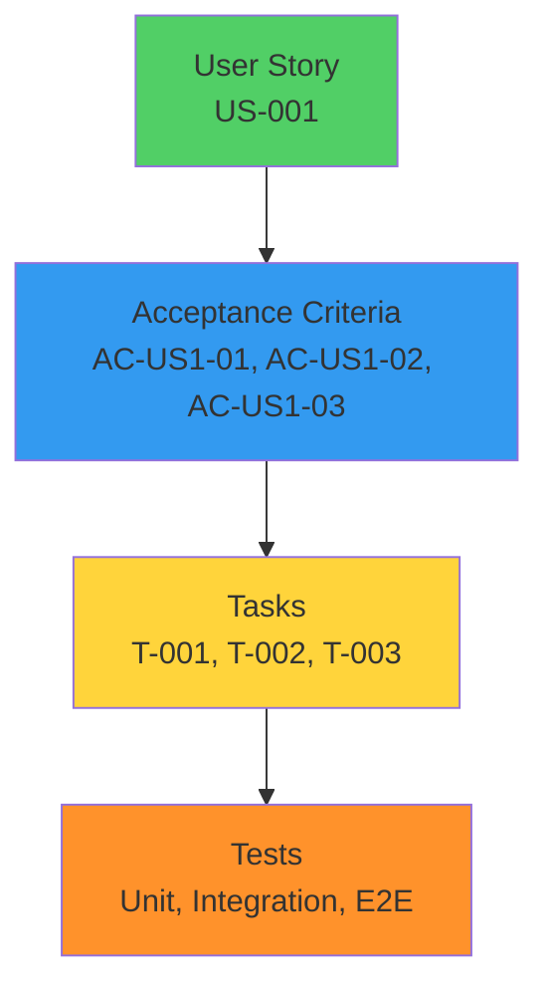
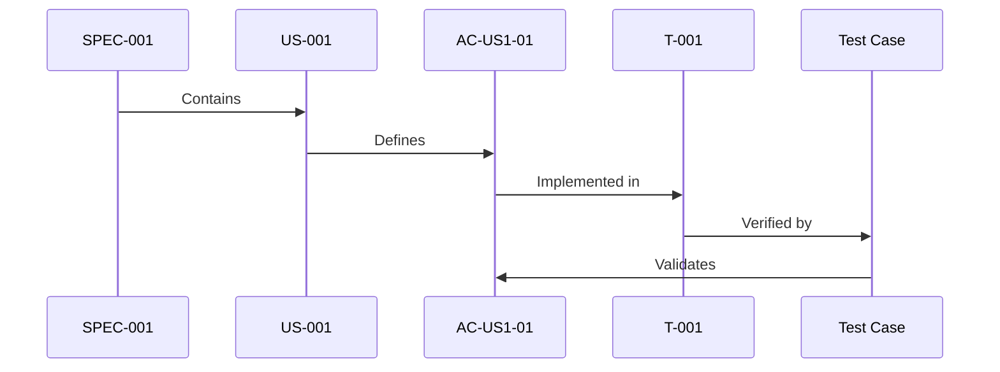

# User Stories

**A User Story** is a concise, user-focused description of a feature or requirement written from the perspective of the end user. User stories follow the format: "As a [user type], I want [goal], so that [benefit]". They serve as the primary unit of requirements in SpecWeave and are the foundation for implementation planning.

---

## User Story Format

### Standard Template

```
As a [user type]
I want [goal]
So that [benefit]
```

**Components**:
- **User type**: Who wants this feature? (user, admin, developer, customer, etc.)
- **Goal**: What do they want to do?
- **Benefit**: Why do they want it? What value does it provide?

### Example

```markdown
### US-001: Basic Login Flow

**As a** user
**I want** to log in with my email and password
**So that** I can access my personalized dashboard

**Acceptance Criteria**:
- [ ] **AC-US1-01**: User can log in with valid credentials (P1, testable)
- [ ] **AC-US1-02**: Invalid credentials show error message (P1, testable)
- [ ] **AC-US1-03**: 5 failed attempts lock account for 15 minutes (P2, testable)
```

---

## User Story Structure in SpecWeave



### Complete User Story Example

```markdown
### US-003: Password Reset

**As a** user who forgot my password
**I want** to reset my password via email
**So that** I can regain access to my account

**Acceptance Criteria**:
- [ ] **AC-US3-01**: User can request password reset email (P1, testable)
- [ ] **AC-US3-02**: Email contains valid reset link (expires in 24h) (P1, testable)
- [ ] **AC-US3-03**: User can set new password via link (P1, testable)
- [ ] **AC-US3-04**: Old password no longer works after reset (P1, testable)
- [ ] **AC-US3-05**: Reset link can only be used once (P2, testable)

**Priority**: P1 (Critical)

**Estimated Effort**: 8 hours

**Dependencies**: None

**Notes**:
- Use industry-standard email templates
- Add rate limiting (max 3 requests per hour per email)
- Log all reset attempts for security audit
```

---

## User Story Numbering

### Format: US-XXX

**Rules**:
- **US** = User Story prefix
- **XXX** = Sequential 3-digit number (001, 002, 003, ...)
- Zero-padded for sorting

**Examples**:
- ✅ US-001 (first user story)
- ✅ US-012 (twelfth user story)
- ✅ US-105 (105th user story)
- ❌ US-1 (not zero-padded)
- ❌ US1 (missing hyphen)
- ❌ US-ABC (not numeric)

### Numbering Within Feature Area

User stories are numbered **sequentially within each feature area** (spec):

```markdown
# SPEC-001: Authentication (Living Docs)

## US-001: Basic Login Flow
## US-002: Session Management
## US-003: Password Reset
## US-004: OAuth Google Login
## US-005: OAuth GitHub Login
## US-006: Two-Factor Authentication
... (continues)

# SPEC-002: User Profile (Living Docs)

## US-001: View Profile  # ← Restarts at 001 for new feature area
## US-002: Edit Profile
## US-003: Upload Avatar
... (continues)
```

**Key Insight**: US-XXX is unique within a spec, not globally.

---

## Priority Levels

SpecWeave uses **three priority levels**:

| Priority | Meaning | When to Use |
|----------|---------|-------------|
| **P1** | Critical | Core functionality, blocks other work, must have |
| **P2** | High | Important feature, should have |
| **P3** | Normal | Nice to have, can be deferred |

### Priority Examples

```markdown
### US-001: Basic Login Flow
**Priority**: P1 (Critical)
**Rationale**: Core authentication functionality, blocks all other work

### US-003: Password Reset
**Priority**: P1 (Critical)
**Rationale**: Security requirement, users must be able to recover accounts

### US-006: Remember Me Checkbox
**Priority**: P2 (High)
**Rationale**: Improves UX, but not required for MVP

### US-012: Login with Phone Number
**Priority**: P3 (Normal)
**Rationale**: Nice to have, can be added later
```

---

## Acceptance Criteria

Every user story MUST have **acceptance criteria** (AC):

### AC-ID Format

**Format**: `AC-US{story}-{number}`

**Example**: `AC-US1-01` (Acceptance Criteria for User Story 1, item 01)

**Rules**:
- Each AC must be **testable** (can write a test to verify)
- Each AC has a **priority** (P1, P2, P3)
- Each AC has an **AC-ID** (for traceability)

### Complete Example

```markdown
### US-002: Session Management

**As a** user
**I want** my login session to persist across page refreshes
**So that** I don't have to log in repeatedly

**Acceptance Criteria**:
- [ ] **AC-US2-01**: Session persists for 7 days (default) (P1, testable)
- [ ] **AC-US2-02**: "Remember Me" extends session to 30 days (P2, testable)
- [ ] **AC-US2-03**: User can manually log out (invalidates session) (P1, testable)
- [ ] **AC-US2-04**: Session expires after 30 minutes of inactivity (P2, testable)
- [ ] **AC-US2-05**: Multiple sessions allowed (desktop + mobile) (P3, testable)
```

---

## User Story Traceability

SpecWeave maintains **complete traceability** from user stories to tests:



### Example Traceability

**1. User Story (spec.md)**:
```markdown
### US-001: Basic Login Flow

**Acceptance Criteria**:
- [ ] **AC-US1-01**: User can log in with valid credentials (P1, testable)
```

**2. Task (tasks.md)**:
```markdown
## T-001: Implement Authentication Service

**AC**: AC-US1-01, AC-US1-02, AC-US1-03

**Test Plan** (BDD format):
- **Given** user with valid credentials → **When** login → **Then** receive JWT token
```

**3. Test Case (auth.test.ts)**:
```typescript
describe('AuthService', () => {
  // Validates AC-US1-01
  test('should authenticate user with valid credentials', async () => {
    const result = await authService.login('user@example.com', 'password123');
    expect(result.token).toBeDefined();
    expect(result.user.email).toBe('user@example.com');
  });
});
```

**Result**: Complete traceability from requirement → implementation → test.

---

## User Story vs Acceptance Criteria

**Common Confusion**: What's the difference?

| Aspect | User Story | Acceptance Criteria |
|--------|-----------|-------------------|
| **Purpose** | WHAT & WHY | HOW to verify |
| **Format** | As a/I want/So that | Testable conditions |
| **Scope** | High-level goal | Specific requirements |
| **Testability** | Not directly testable | MUST be testable |
| **Number** | 1 per feature | 3-10 per user story |

### Example

**User Story** (high-level):
```markdown
### US-001: Basic Login Flow

**As a** user
**I want** to log in with my email and password
**So that** I can access my personalized dashboard
```

**Acceptance Criteria** (specific, testable):
```markdown
**Acceptance Criteria**:
- [ ] **AC-US1-01**: User can log in with valid credentials (P1, testable)
  - Input: email + password
  - Output: JWT token + user data
  - Edge case: Empty fields show validation error

- [ ] **AC-US1-02**: Invalid credentials show error message (P1, testable)
  - Input: wrong password
  - Output: "Invalid email or password" error
  - Edge case: Wrong email also shows same error (security)

- [ ] **AC-US1-03**: 5 failed attempts lock account for 15 minutes (P2, testable)
  - Input: 5 failed login attempts
  - Output: "Account locked for 15 minutes" error
  - Edge case: Timer resets after successful login
```

---

## BDD Format (Given/When/Then)

User stories often use **BDD (Behavior-Driven Development)** format for acceptance criteria:

### Format

```
Given [initial context]
When [action]
Then [expected outcome]
```

### Example

```markdown
### US-004: OAuth Google Login

**As a** user
**I want** to log in with my Google account
**So that** I don't need to create a new password

**Acceptance Criteria**:
- [ ] **AC-US4-01**: User can initiate Google OAuth flow (P1, testable)
  - **Given** user is on login page
  - **When** user clicks "Sign in with Google"
  - **Then** Google OAuth consent page opens

- [ ] **AC-US4-02**: User can complete OAuth flow (P1, testable)
  - **Given** user approves Google OAuth consent
  - **When** Google redirects back to app
  - **Then** user is logged in with Google profile data

- [ ] **AC-US4-03**: OAuth failure shows error (P2, testable)
  - **Given** user denies Google OAuth consent
  - **When** Google redirects with error
  - **Then** user sees "Google login cancelled" message
```

---

## User Story Estimation

### Story Points vs Hours

SpecWeave uses **hours** for estimation (more concrete than story points):

```markdown
### US-001: Basic Login Flow
**Estimated Effort**: 16 hours

### US-002: Session Management
**Estimated Effort**: 8 hours

### US-003: Password Reset
**Estimated Effort**: 12 hours

**Total for Increment**: 36 hours (4-5 days)
```

### Estimation Guidelines

| Complexity | Hours | Description |
|-----------|-------|-------------|
| **Trivial** | 1-4 hours | Simple CRUD, straightforward logic |
| **Simple** | 4-8 hours | Standard feature, well-understood |
| **Medium** | 8-16 hours | Some complexity, requires research |
| **Complex** | 16-32 hours | High complexity, many edge cases |
| **Very Complex** | 32+ hours | Split into multiple user stories |

**Rule**: If a user story exceeds 32 hours, **split it** into multiple smaller stories.

---

## User Story Splitting

### When to Split

Split user stories when:
- ❌ Estimate > 32 hours (too large)
- ❌ Multiple distinct features (lack of focus)
- ❌ Different priorities (P1 + P3 mixed)
- ❌ Different user types (admin + regular user)

### Splitting Strategies

**1. By User Type**

```markdown
# ❌ Bad: Too broad (50 hours)
US-001: User and Admin Login

# ✅ Good: Split by user type
US-001: User Login (16 hours)
US-002: Admin Login (8 hours)
```

**2. By Priority**

```markdown
# ❌ Bad: Mixed priorities (40 hours)
US-003: Password Management
- Reset password (P1, 12 hours)
- Change password (P1, 8 hours)
- Password strength meter (P3, 8 hours)
- Password history (P3, 12 hours)

# ✅ Good: Split by priority
US-003: Password Reset (P1, 12 hours)
US-004: Change Password (P1, 8 hours)
US-010: Password Strength Meter (P3, 8 hours)
US-011: Password History (P3, 12 hours)
```

**3. By Workflow Step**

```markdown
# ❌ Bad: Entire OAuth flow (60 hours)
US-004: OAuth Integration

# ✅ Good: Split by workflow step
US-004: OAuth Google Login (16 hours)
US-005: OAuth GitHub Login (16 hours)
US-006: OAuth Token Refresh (12 hours)
US-007: OAuth Revocation (8 hours)
```

---

## User Story Examples

### Good Examples

**Example 1: Clear and Specific**
```markdown
### US-007: Export User Data

**As a** user concerned about privacy
**I want** to export all my personal data in JSON format
**So that** I can comply with GDPR data portability requirements

**Acceptance Criteria**:
- [ ] **AC-US7-01**: User can request data export from settings (P1, testable)
- [ ] **AC-US7-02**: Export includes all user data (profile, posts, comments) (P1, testable)
- [ ] **AC-US7-03**: Export is available for download within 24 hours (P2, testable)
- [ ] **AC-US7-04**: Download link expires after 7 days (P2, testable)

**Priority**: P1 (GDPR compliance requirement)
**Estimated Effort**: 16 hours
```

**Example 2: Technical User Story**
```markdown
### US-012: Rate Limiting for API

**As a** system administrator
**I want** to limit API requests to 1000 per hour per user
**So that** we prevent abuse and ensure fair resource allocation

**Acceptance Criteria**:
- [ ] **AC-US12-01**: Requests beyond 1000/hour return 429 status (P1, testable)
- [ ] **AC-US12-02**: Rate limit resets every hour (P1, testable)
- [ ] **AC-US12-03**: Response includes X-RateLimit-* headers (P2, testable)
- [ ] **AC-US12-04**: Admin can adjust limits per user (P3, testable)

**Priority**: P1 (System stability requirement)
**Estimated Effort**: 12 hours
```

### Bad Examples

**Example 1: Too Vague**
```markdown
# ❌ Bad: Not specific
US-001: Make the system better

# ✅ Good: Specific and measurable
US-001: Reduce login latency to &lt;200ms (p99)
```

**Example 2: No Benefit**
```markdown
# ❌ Bad: Missing "so that" (why?)
US-002: User can upload avatar

# ✅ Good: Includes benefit
US-002: Upload Profile Avatar

**As a** user
**I want** to upload a custom profile avatar
**So that** I can personalize my account and be recognizable to others
```

**Example 3: Too Technical**
```markdown
# ❌ Bad: Implementation details
US-003: Add JWT token generation with bcrypt hashing

# ✅ Good: User-focused outcome
US-003: Secure User Authentication

**As a** user
**I want** my password stored securely
**So that** my account is protected from unauthorized access
```

---

## User Story in SpecWeave Workflow

### Creation (PM Agent)

```bash
/specweave:increment "user authentication"

# PM Agent generates spec.md with user stories:
# - US-001: Basic Login Flow
# - US-002: Session Management
# - US-003: Password Reset
# Each with complete AC-IDs
```

### Implementation (Developer)

```bash
/specweave:do

# Developer works through tasks:
# T-001: Implement AuthService (AC-US1-01, AC-US1-02, AC-US1-03)
# T-002: Create Login Endpoint (AC-US1-01, AC-US1-02)
# T-003: Add Session Management (AC-US2-01, AC-US2-02, AC-US2-03)
```

### Validation (QA)

```bash
/specweave:validate 0008

# Validates:
# ✅ All AC-IDs implemented?
# ✅ All user stories complete?
# ✅ Test coverage meets targets?
```

---

## User Story Anti-Patterns

### 1. Technical Tasks Masquerading as Stories

```markdown
# ❌ Bad: This is a technical task, not a user story
US-005: Refactor authentication module to use TypeScript

# ✅ Good: Focus on user value
US-005: Faster Login Experience

**As a** user
**I want** login to complete in &lt;200ms
**So that** I can access my dashboard quickly
```

### 2. Missing Acceptance Criteria

```markdown
# ❌ Bad: No AC (how to verify?)
US-006: User can manage notifications

# ✅ Good: Clear AC
US-006: Manage Email Notifications

**Acceptance Criteria**:
- [ ] **AC-US6-01**: User can enable/disable email notifications (P1, testable)
- [ ] **AC-US6-02**: User can choose notification frequency (P2, testable)
- [ ] **AC-US6-03**: Changes take effect immediately (P1, testable)
```

### 3. Multiple Features in One Story

```markdown
# ❌ Bad: Too many features (60 hours)
US-007: Complete user profile management
- Edit profile
- Upload avatar
- Change password
- Manage privacy settings
- Export data
- Delete account

# ✅ Good: Split into focused stories
US-007: Edit User Profile (8 hours)
US-008: Upload Profile Avatar (4 hours)
US-009: Change Password (8 hours)
US-010: Manage Privacy Settings (12 hours)
US-011: Export User Data (16 hours)
US-012: Delete Account (12 hours)
```

---

## Related Terms

- [Acceptance Criteria](/docs/glossary/terms/acceptance-criteria) - Testable conditions for user stories
- [AC-ID](/docs/glossary/terms/ac-id) - Acceptance criteria identifiers (traceability)
- [BDD](/docs/glossary/terms/bdd) - Behavior-driven development (Given/When/Then)
- [Specs](/docs/glossary/terms/specs) - Specifications containing user stories
- [Increments](/docs/glossary/terms/increments) - Implementation units
- [TDD](/docs/glossary/terms/tdd) - Test-driven development

---

## Summary

**User Stories** are the primary unit of requirements in SpecWeave:
- **Format**: As a [user], I want [goal], so that [benefit]
- **Numbering**: US-XXX (e.g., US-001, US-012)
- **Priority**: P1 (critical), P2 (high), P3 (normal)
- **Acceptance Criteria**: 3-10 testable conditions per story (AC-IDs)
- **Estimation**: Hours (not story points), split if >32 hours
- **Traceability**: User story → AC-ID → Task → Test

**Key Insight**: Good user stories are **user-focused**, **specific**, and **testable**.
