# WIP Limits (Work In Progress)

**WIP Limits** restrict the number of active increments to maximize focus and productivity. SpecWeave defaults to **ONE active increment** based on research showing single-tasking produces 100% productivity while multi-tasking reduces productivity by 20-40% due to context switching costs.

---

## What Counts Toward WIP Limits?

**ONLY `active` increments count toward WIP limits!**

| Status | Counts Toward WIP? | Reason |
|--------|-------------------|--------|
| **planning** | ❌ No | Planning doesn't consume active work capacity |
| **active** | ✅ Yes | Actively executing tasks |
| **backlog** | ❌ No | Not started yet |
| **paused** | ❌ No | Temporarily blocked, not active work |
| **completed** | ❌ No | Already done |
| **abandoned** | ❌ No | Cancelled |

**Why PLANNING doesn't count**:
- Creating spec/plan/tasks is preparation, not execution
- Doesn't block you from active work
- Auto-transitions to ACTIVE when tasks.md created

**Example**:
```
Increments:
- 0008-authentication (status: planning) → WIP: 0
- 0009-dark-mode (status: active) → WIP: 1
- 0010-payments (status: backlog) → WIP: 0

Total WIP: 1/1 (within limit) ✅
```

---

## The Core Philosophy

**Focus-First Architecture**: ONE Active Increment = Maximum Productivity


---

## Research: Why 1?

### Productivity Impact

| Active Increments | Productivity | Context Switching Cost | Quality |
|-------------------|--------------|----------------------|---------|
| **1** | 100% | 0% | High (fewer bugs) |
| **2** | 80% | 20% slower | Medium (more bugs) |
| **3+** | 60% | 40% slower | Low (many bugs) |

**Source**: Research on multitasking and context switching costs (Gloria Mark, University of California, Irvine)

### Real-World Example

**Scenario**: Implement authentication feature (estimated 40 hours)

**With 1 Active Increment** (Focused):
```
Week 1: 40 hours on authentication
Result: Feature complete, tested, shipped ✅
```

**With 2 Active Increments** (Context Switching):
```
Week 1: 20 hours authentication + 20 hours dark mode
Context switching: 8 hours lost
Result: 32 hours effective work, neither feature complete ❌

Week 2: 20 hours authentication + 20 hours dark mode
Context switching: 8 hours lost
Result: 32 hours effective work, finally complete (2 weeks) ❌
```

**Impact**: 2x longer to complete (1 week → 2 weeks) due to context switching.

---

## Default WIP Limit Configuration

### Settings

**Location**: `.specweave/config.json`

```json
{
  "limits": {
    "maxActiveIncrements": 1,  // Default: 1 active (focus)
    "hardCap": 2,               // Emergency ceiling (never exceeded)
    "allowEmergencyInterrupt": true, // hotfix/bug can interrupt
    "typeBehaviors": {
      "canInterrupt": ["hotfix", "bug"], // Emergency types
      "autoAbandonDays": {
        "experiment": 14  // Auto-abandon stale experiments
      }
    }
  }
}
```

### Three-Level Enforcement

```mermaid
graph TB
    A{Active Increments} --> B{0 Active}
    A --> C{1 Active}
    A --> D{2 Active}

    B --> E[Create New<br/>✅ No warnings]

    C --> F[Create New<br/>⚠️ Warning]
    F --> G{User Confirms?}
    G -->|Yes| H[Allow 2 Active]
    G -->|No| I[Cancel Creation]

    D --> J[Create New<br/>❌ BLOCKED]
    J --> K[Must complete or pause one first]

    style B fill:#51cf66
    style C fill:#ffd43b
    style D fill:#ff6b6b
    style E fill:#51cf66
    style H fill:#ffd43b
    style J fill:#ff6b6b
```



---

## Enforcement Scenarios

### Scenario 1: 0 Active → Create New (No Warnings)

```bash
# No active increments
/specweave:increment "user authentication"

# ✅ Creates 0008-user-authentication (no warnings)
# Status: 1 active (within limit)
```

### Scenario 2: 1 Active → Warn About Context Switching

```bash
# 0008-user-authentication is active (50% complete)
/specweave:increment "dark mode"

# ⚠️  WARNING: Context Switching Detected
#
# Current active increment:
#   0008-user-authentication (50% complete, 3/5 tasks)
#
# Creating a second increment will:
#   - Reduce productivity by ~20% (context switching cost)
#   - Delay completion of both increments
#   - Increase bug risk
#
# 💡 Recommendation: Complete 0008 first (/specweave:do)
#
# ❓ Continue anyway? (y/N)
```

**If user confirms**:
```bash
# User types 'y'
# ✅ Creates 0009-dark-mode
# Status: 2 active (hard cap reached)
```

### Scenario 3: 2 Active → HARD BLOCK

```bash
# 0008-user-authentication (50% complete)
# 0009-dark-mode (20% complete)
/specweave:increment "payment integration"

# ❌ BLOCKED! Hard Cap Reached
#
# You have 2 active increments (maximum reached):
#   1. 0008-user-authentication (50% complete)
#   2. 0009-dark-mode (20% complete)
#
# 💡 Before creating a new increment, you must:
#   Option 1: Complete an increment
#     /specweave:done 0008 (if all tasks complete)
#
#   Option 2: Pause an increment
#     /specweave:pause 0009 --reason="blocked by API"
#
#   Option 3: Abandon an increment
#     /specweave:abandon 0009 --reason="requirements changed"
#
# ⚠️  The discipline exists for a reason:
#   - Prevents scope creep
#   - Ensures focus
#   - Maintains quality
#   - Improves velocity
```

---

## Exception: Emergency Interrupt

**Hotfixes and bugs can interrupt** to reach 2 active:

```bash
# 0008-user-authentication is active (80% complete)
/specweave:increment "SQL injection hotfix" --type hotfix

# ✅ ALLOWED! Hotfix can interrupt (emergency)
#
# Emergency interrupt approved:
#   Type: hotfix (critical production issue)
#   Previous: 0008-user-authentication (paused temporarily)
#   New: 0009-sql-injection-hotfix (ACTIVE)
#
# Status: 2 active (hard cap reached)
#
# ⚠️  Recommendation: Complete hotfix quickly, then resume 0008
```

**Emergency types** (can interrupt):
- **hotfix**: Critical production fixes
- **bug**: Production bug investigation

**Non-emergency types** (cannot interrupt):
- **feature**: Standard feature development
- **change-request**: Stakeholder requests
- **refactor**: Code improvement
- **experiment**: POC/spike work

---

## WIP Limit Helpers

### Check Status

```bash
/specweave:status

# Output:
✅ 0001-core-framework (100% complete)
✅ 0007-smart-increment-discipline (100% complete)
⏳ 0008-user-authentication (80% complete) ← ACTIVE
📋 0009-dark-mode (20% complete) ← ACTIVE (hard cap reached)

Active: 2/2 (hard cap)
Paused: 0
Complete: 2
Abandoned: 0

⚠️  You're at the hard cap! Complete or pause an increment before starting new work.
```

### Pause Increment

```bash
/specweave:pause 0009 --reason="blocked by backend API availability"

# ✅ Paused 0009-dark-mode
# Reason: Blocked by backend API availability
# Status: 1 active (within limit)
#
# 💡 You can now create a new increment OR resume 0009 when unblocked
```

### Resume Increment

```bash
/specweave:resume 0009

# ✅ Resumed 0009-dark-mode
# Status: 2 active (hard cap reached)
#
# ⚠️  You're at the hard cap again. Complete one before starting new work.
```

---

## Multiple Hotfixes (Special Case)

**Problem**: What if you have multiple hotfixes?

**Solution**: **Combine into ONE increment**

```bash
# ❌ Wrong: Multiple hotfix increments
/specweave:increment "SQL injection fix" --type hotfix  # 0009
/specweave:increment "XSS vulnerability fix" --type hotfix  # 0010 (BLOCKED!)

# ✅ Right: Combined hotfix increment
/specweave:increment "Security fixes (SQL + XSS + CSRF)" --type hotfix

# Increment 0009: Security Fixes
# - SQL injection fix (AC-US1-01)
# - XSS vulnerability fix (AC-US1-02)
# - CSRF token fix (AC-US1-03)
```

---

## Temporary WIP Limit Adjustment

**For emergencies**, you can temporarily adjust WIP limits:

```bash
# Temporarily allow 3 active (not recommended)
/specweave:adjust-wip-limit 3

# ⚠️  WARNING: Increasing WIP limit to 3
#
# This is NOT RECOMMENDED because:
#   - 40% slower productivity (context switching)
#   - Higher bug risk
#   - Nothing ships quickly
#
# 💡 Reason for adjustment: [required]
```

**User provides reason**:
```bash
Reason: Multiple critical production issues require parallel fixes

# ✅ WIP limit temporarily adjusted to 3
# Expires: 2025-11-12 (24 hours)
#
# ⚠️  This is logged and should be explained in standup/retrospective
```

**Revert to default**:
```bash
/specweave:revert-wip-limit

# ✅ WIP limit reverted to 1 (default)
```

---

## WIP Limit Benefits

### 1. Maximum Focus

```
1 increment = 100% attention on ONE thing
Result: Deep work, faster completion, higher quality
```

### 2. Regular Shipping

```
Complete 1 increment → Ship → Start next
Result: Continuous delivery, visible progress
```

### 3. Lower Bug Rate

```
Focus = Fewer mistakes
Single context = Better code quality
Result: Fewer bugs, less rework
```

### 4. Predictable Velocity

```
Know exactly how long 1 increment takes
Result: Accurate estimates, better planning
```

### 5. Clear Priorities

```
1 active = Everyone knows what's important
Result: Aligned team, no confusion
```

---

## WIP Limit Anti-Patterns

### 1. Starting New Before Completing Old

```bash
# ❌ Bad: Multiple incomplete increments
0008-user-authentication (80% complete)
0009-dark-mode (60% complete)
0010-payment-integration (40% complete)
0011-notifications (20% complete)

Result: Nothing ships, everything delayed
```

### 2. Ignoring WIP Limit Warnings

```bash
# ❌ Bad: Always using --force
/specweave:increment "new feature" --force  # Bypasses WIP check
/specweave:increment "another feature" --force
/specweave:increment "yet another feature" --force

Result: Chaos, low productivity, nothing ships
```

### 3. Artificially Splitting Increments

```bash
# ❌ Bad: Splitting to bypass WIP limit
/specweave:increment "Authentication Part 1"
/specweave:increment "Authentication Part 2"  # Trying to bypass limit

# ✅ Good: One complete increment
/specweave:increment "Authentication (complete)"
```

---

## WIP Limit Best Practices

### 1. Complete Before Starting New

```bash
# ✅ Good workflow
/specweave:do  # Work on current increment
# ... all tasks complete
/specweave:done 0008  # Close increment
/specweave:increment "next feature"  # Start new
```

### 2. Pause When Blocked

```bash
# ✅ Good: Pause when blocked, start new
/specweave:pause 0008 --reason="waiting for API approval"
/specweave:increment "dark mode"  # Start new work
# ... API approved
/specweave:resume 0008  # Resume when unblocked
```

### 3. Use Hotfix for True Emergencies Only

```bash
# ✅ Good: Hotfix for production issues
/specweave:increment "SQL injection fix" --type hotfix

# ❌ Bad: Hotfix for non-emergency
/specweave:increment "add dark mode toggle" --type hotfix  # Not a hotfix!
```

---

## Philosophy: Discipline = Quality

**Why enforce WIP limits strictly?**

### Focus
Work on ONE thing at a time → Deep work → Better results

### Completion
Finish before starting new → Ship regularly → Visible progress

### Quality
Less context switching → Fewer bugs → Higher quality

### Clarity
Everyone knows what's important → Aligned team → Better collaboration

### Velocity
Predictable pace → Accurate estimates → Better planning

---

## Related Terms

- [Increments](/docs/glossary/terms/increments) - Work units subject to WIP limits
- [Source of Truth](/docs/glossary/terms/source-of-truth) - Single source of truth principle
- Living Docs - Auto-synced documentation
- Status Tracking - Monitor active increments

---

## Summary

**WIP Limits** maximize focus and productivity:
- **Default**: 1 active increment (100% productivity)
- **Hard Cap**: 2 active max (emergency only)
- **Exception**: Hotfix/bug can interrupt (production issues)
- **Enforcement**: Warning at 1 active, block at 2 active
- **Benefits**: Maximum focus, regular shipping, lower bugs, predictable velocity

**Key Insight**: **ONE active increment = maximum productivity**. Multi-tasking ALWAYS reduces productivity by 20-40%.

**Philosophy**: Discipline = Quality. WIP limits aren't bureaucracy—they're quality enforcement.
