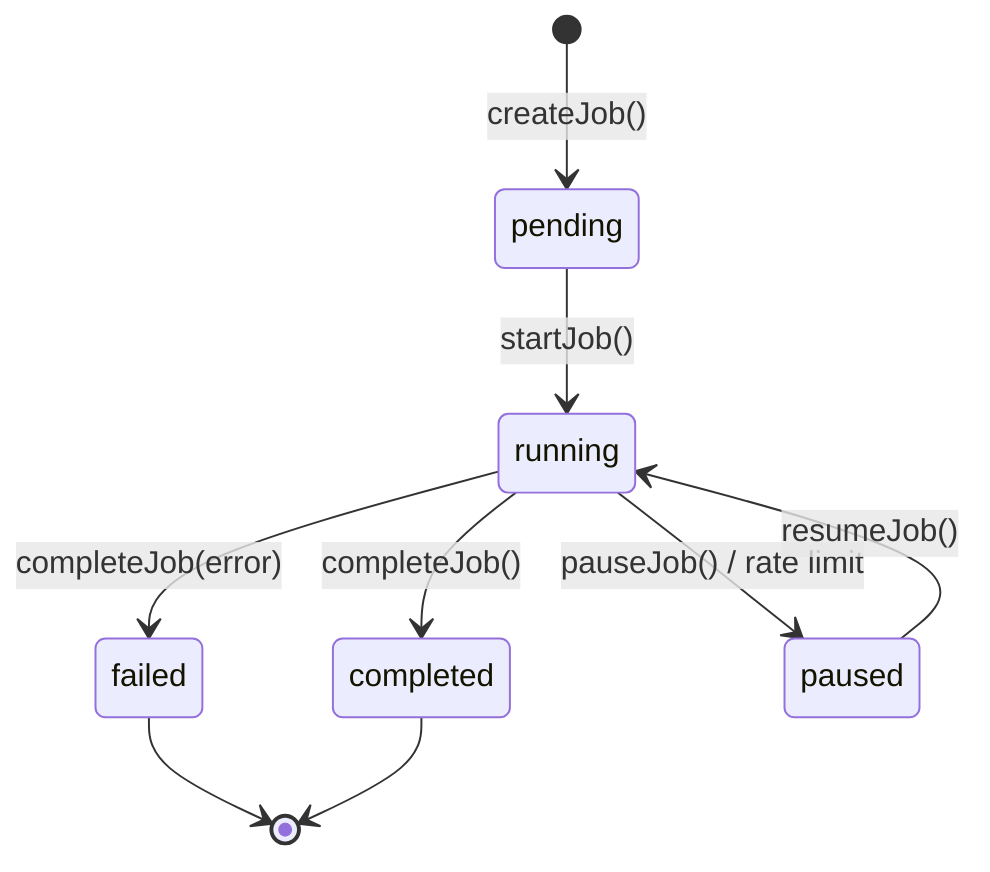

# Background Jobs

SpecWeave's **Background Jobs System** enables long-running operations to continue even after you close Claude. This is essential for enterprise workflows with thousands of repositories and tens of thousands of work items.

## When Are Background Jobs Used?

| Scenario | Typical Duration | Why Background? |
|----------|------------------|-----------------|
| **Multi-repo cloning** | 5-30 minutes | 200+ repos can't clone in one session |
| **Large issue imports** | 10-60 minutes | 10K+ items need rate-limit handling |
| **External sync** | 1-10 minutes | Bidirectional sync with large datasets |

## Architecture Overview

```
┌─────────────────────────────────────────────────────────────┐
│                     Claude Session                          │
│  ┌─────────────┐    ┌─────────────┐    ┌─────────────┐     │
│  │ /specweave: │───▶│ Job         │───▶│ Job         │     │
│  │ jobs        │    │ Manager     │    │ Launcher    │     │
│  └─────────────┘    └─────────────┘    └──────┬──────┘     │
└──────────────────────────────────────────────│─────────────┘
                                               │ spawn detached
                                               ▼
┌─────────────────────────────────────────────────────────────┐
│                   Detached Worker Process                    │
│  ┌─────────────────────────────────────────────────────┐   │
│  │  clone-worker.js / import-worker.js                 │   │
│  │  - Runs independently of Claude session             │   │
│  │  - Writes progress to filesystem                    │   │
│  │  - Handles rate limits (auto-pause)                 │   │
│  │  - Survives terminal close                          │   │
│  └─────────────────────────────────────────────────────┘   │
└─────────────────────────────────────────────────────────────┘
                         │
                         ▼ writes to
┌─────────────────────────────────────────────────────────────┐
│              .specweave/state/                              │
│  ├── background-jobs.json     ← All job metadata           │
│  └── jobs/                                                 │
│      └── <jobId>/                                          │
│          ├── config.json      ← Job configuration          │
│          ├── worker.pid       ← Process ID (while running) │
│          ├── worker.log       ← Timestamped output         │
│          └── result.json      ← Final summary              │
└─────────────────────────────────────────────────────────────┘
```

## How It Works

### 1. Job Creation

When you run `specweave init` with repository cloning or issue import enabled:

```typescript
// Job is created with unique 8-char ID
const job = jobManager.createJob('clone-repos', config, totalItems);
// → Job ID: abc12345, Status: pending
```

### 2. Worker Spawning

The job launcher spawns a **detached process** that runs independently:

```typescript
spawn('node', [workerPath, jobId, projectPath], {
  detached: true,     // Run independently of parent
  stdio: 'ignore'     // Don't tie to parent's stdio
});
child.unref();        // Allow parent to exit
```

**Key insight**: The worker process continues even if you close Claude.

### 3. Progress Tracking

Workers write progress to the filesystem every update:

```json
{
  "id": "abc12345",
  "type": "clone-repos",
  "status": "running",
  "progress": {
    "current": 154,
    "total": 245,
    "percentage": 63,
    "currentItem": "infrastructure-apo-platform",
    "itemsCompleted": ["repo-1", "repo-2", "..."],
    "itemsFailed": ["infrastructure-adp"],
    "rate": 0.1,
    "eta": 900
  },
  "startedAt": "2024-01-15T10:30:00Z",
  "updatedAt": "2024-01-15T10:53:15Z"
}
```

### 4. Rate Limit Handling

When external APIs hit rate limits:

1. Worker detects rate limit response
2. Job status changes to `paused`
3. Worker exits gracefully with checkpoint saved
4. User resumes later: `/specweave:jobs --resume <id>`

## Job Types

### clone-repos

Clones multiple repositories from GitHub, GitLab, or Azure DevOps.

**Triggered by**: `specweave init` with umbrella/multi-repo setup

**Features**:
- Skips already-cloned repos (checks `.git` folder)
- 500ms delay between clones (rate limiting)
- Sanitizes PAT tokens from error logs
- Graceful SIGTERM/SIGINT handling

**Example output**:
```
🔄 Running (1):
  [ae362dfe] clone-repos
     Progress: 154/245 (63%) → infrastructure-apo-platform
     Rate: 0.1/s | ETA: ~15 min
     Started: 23 mins ago
     Cloned: 154 repositories
     Failed: 1 (infrastructure-adp)
```

### import-issues

Imports work items from GitHub Issues, JIRA, or Azure DevOps.

**Triggered by**: `specweave init` with import enabled, or `/specweave:import-external`

**Features**:
- Dynamic imports (reduces startup overhead)
- Container-aware grouping (by JIRA project, ADO area path)
- Converts items to SpecWeave UserStory format
- Creates feature folders per external container

**Example output**:
```
🔄 Running (1):
  [def67890] import-issues (ADO)
     Progress: 2,500/10,000 (25%)
     Current: Acme\Core-Operations
     Rate: 15.2/s | ETA: ~8m
```

### sync-external

Bidirectional synchronization with external tools.

**Triggered by**: `/specweave-github:sync`, `/specweave-jira:sync`, `/specweave-ado:sync`

**Features**:
- Push progress to external tools
- Pull status updates
- Handles large datasets efficiently

### living-docs-sync

Syncs imported items to living documentation structure.

**Triggered by**: Automatically after `import-issues` completes

**Features**:
- Batch processing (100 items per batch)
- Creates feature folders for each epic/capability
- Generates user story files with proper structure
- Updates README files per project
- Progress tracking integrated with parent import job

**What happens after large imports**:
```
Import completes (10K items)
         │
         ▼
Living Docs Batch Sync starts
         │
         ├── Process items in batches of 100
         ├── Create .specweave/docs/internal/specs/{project}/
         ├── Group items by hierarchy (Epic → Feature → Story)
         ├── Generate us-*.md files
         └── Update project README.md
         │
         ▼
✅ Living docs fully populated

## Job Lifecycle



| Status | Meaning |
|--------|---------|
| `pending` | Job created, not started |
| `running` | Worker actively processing |
| `paused` | Stopped mid-progress (rate limit or killed) |
| `completed` | Successfully finished |
| `failed` | Error prevented completion |

## Monitoring Jobs

### Check All Jobs

```bash
/specweave:jobs
```

Shows all active jobs grouped by status.

### Follow Progress Live

```bash
/specweave:jobs --follow abc12345
```

Polls every second for real-time progress updates.

### View Worker Logs

```bash
/specweave:jobs --logs abc12345
```

Shows timestamped worker output (last 50 lines).

### Get Job Details

```bash
/specweave:jobs --id abc12345
```

Full details: config, progress, files, PID.

## Managing Jobs

### Kill Running Job

```bash
/specweave:jobs --kill abc12345
```

Sends SIGTERM, marks as `paused` for later resume.

### Resume Paused Job

```bash
/specweave:jobs --resume abc12345
```

Spawns new worker that continues from last checkpoint.

## State Persistence

Jobs persist across Claude sessions. The filesystem is the source of truth:

```
.specweave/state/
├── background-jobs.json      ← All job metadata (singleton)
└── jobs/
    └── abc12345/
        ├── config.json       ← Job configuration
        ├── worker.pid        ← PID file (ephemeral)
        ├── worker.log        ← Worker output log
        └── result.json       ← Final results (on completion)
```

### Why Filesystem-Based?

1. **No database required** - Works in any environment
2. **Survives crashes** - Atomic JSON writes
3. **Session independence** - Workers don't need Claude
4. **Simple debugging** - Just read JSON files

## Design Patterns

### Detached Process Model

Workers are spawned as detached processes that:
- Don't receive parent signals
- Continue when Claude closes
- Write state to filesystem instead of IPC

### Checkpointing

Progress is saved before every item:
- If worker crashes, resume from last checkpoint
- `itemsCompleted` and `itemsFailed` track individual items
- Rate/ETA calculated on display (not stored)

### Graceful Degradation

- Worker not found → fallback to foreground
- Corrupted state → restart fresh
- Missing config → mark job failed

## Troubleshooting

### Job Stuck in "Running"?

The worker may have crashed. Check:

```bash
/specweave:jobs --id <id>
```

If PID shows as "dead" but status is "running", the worker crashed. Use:

```bash
/specweave:jobs --resume <id>
```

### Rate Limited?

Jobs auto-pause on rate limits. Wait for reset (usually 1-15 minutes), then:

```bash
/specweave:jobs --resume <id>
```

### Can't Resume?

If config is corrupted or missing, start a fresh operation:

```bash
/specweave:import-external    # For imports
/specweave-ado:clone-repos    # For repo cloning
```

### Too Many Old Jobs?

Automatic cleanup keeps only last 10 completed jobs. Manual cleanup:

```bash
rm -rf .specweave/state/jobs/<old-job-id>
```

## Best Practices

### 1. Check Jobs After Init

After `specweave init` with large imports:

```bash
/specweave:jobs
```

### 2. Monitor Long Operations

For imports >1000 items:

```bash
/specweave:jobs --follow <id>
```

### 3. Don't Close Claude Immediately

Give the worker 10-30 seconds to fully detach before closing the terminal.

### 4. Resume Promptly After Rate Limits

Rate limit windows are usually 15-60 minutes. Resume promptly to complete imports.

## API Reference

For developers extending SpecWeave:

### Job Manager

```typescript
import { getJobManager } from './core/background/job-manager.js';

const manager = getJobManager(projectPath);

// Create job
const job = manager.createJob('clone-repos', config, totalItems);

// Update progress
manager.updateProgress(jobId, current, currentItem, completedItem, failedItem);

// Complete job
manager.completeJob(jobId, error?);
```

### Job Launcher

```typescript
import { launchCloneJob, launchImportJob } from './core/background/job-launcher.js';

// Launch clone job
const result = await launchCloneJob({
  projectPath,
  repositories: [{ owner, name, cloneUrl }],
  estimatedTotal: repos.length
});

// Launch import job
const result = await launchImportJob({
  type: 'import-issues',
  projectPath,
  coordinatorConfig,
  estimatedTotal: 10000,
  foreground: false  // true = run in current process
});
```

## Related Documentation

- [Commands: /specweave:jobs](/docs/commands/jobs) - Full command reference
- [ADO Repo Cloning](/docs/guides/ado-multi-project-migration) - Enterprise setup
- [External Import](/docs/commands/import-external) - Issue import guide
- [Living Docs Sync Strategy](/docs/guides/core-concepts/living-docs-sync-strategy) - When and how docs sync
- [Living Documentation](/docs/guides/core-concepts/living-documentation) - Core concepts
