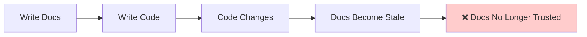
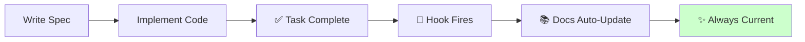
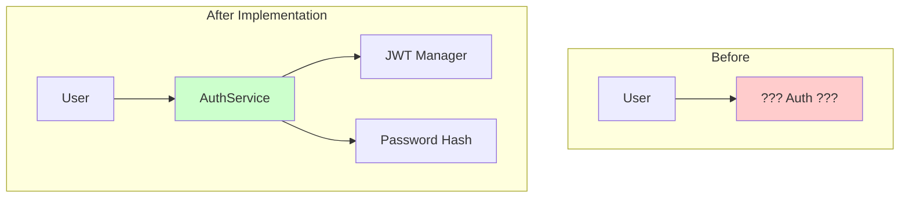
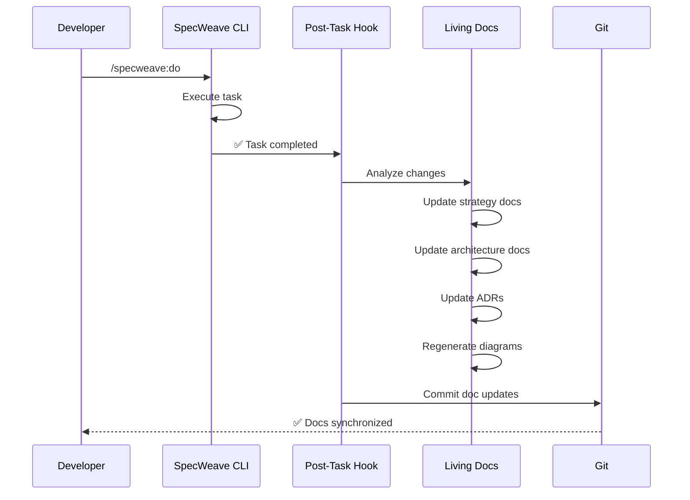

# Living Documentation

**Living documentation** is documentation that automatically stays synchronized with your code—no manual updates, no drift, always current.

## The Problem: Documentation Rot

Traditional documentation has a fatal flaw:



**The cycle of documentation rot:**
1. Day 1: Write comprehensive docs
2. Week 2: Code changes, docs not updated
3. Month 3: Docs completely outdated
4. Month 6: Team ignores docs, tribal knowledge emerges

**Result**: Documentation becomes **worse than useless**—it actively misleads developers.

## The Solution: Living Documentation

SpecWeave's living docs **auto-update after every task completion**:



**How it works:**
1. You complete a task with `/specweave:do`
2. Post-task-completion hook fires automatically
3. Specs, architecture docs, ADRs update to reflect reality
4. Docs commit with implementation changes
5. **Always in sync**—guaranteed

## What Gets Auto-Updated?

### 1. Strategic Documentation

Located in `.specweave/docs/internal/strategy/`:

**Before Implementation:**
```markdown
## US-001: User Login
Status: Planned
Implementation: TBD
```

**After Implementation (Auto-Updated):**
```markdown
## US-001: User Login
Status: ✅ Implemented
Implementation: JWT authentication with bcrypt hashing
File: src/services/auth/AuthService.ts:42
Tests: tests/unit/auth.test.ts (12 tests, 95% coverage)
Completed: 2025-11-04
```

### 2. Architecture Documentation

Located in `.specweave/docs/internal/architecture/`:

**ADRs Auto-Update Status:**
```markdown
# ADR-001: JWT Authentication

Status: Proposed → ✅ Accepted
Date: 2025-11-04
Implementation: src/services/auth/AuthService.ts
```

**HLDs Reflect Current State:**
- Component diagrams updated with new services
- Data flow diagrams show actual flows
- [API](/docs/glossary/terms/api) contracts match implemented endpoints

### 3. Diagrams Stay Current

C4 diagrams auto-regenerate:



## The Dual-Documentation Architecture

SpecWeave maintains TWO types of documentation **simultaneously**:

### Append-Only Increment Snapshots

**Never modified** after completion:

```
.specweave/increments/
├── 0001-user-authentication/     # ✅ Completed, immutable
│   ├── spec.md                   # What was planned
│   ├── plan.md                   # How it was built
│   └── tasks.md                  # What was done
└── 0002-oauth-integration/       # ✅ Completed, immutable
    └── ...
```

**Purpose**: Historical record, audit trail, "Why did we do it this way?"

### Living Documentation

**Auto-updated** after every task:

```
.specweave/docs/internal/
├── strategy/                      # 🔄 Always current
│   └── authentication.md          # Current requirements
├── architecture/                  # 🔄 Always current
│   ├── hld-authentication.md      # Current architecture
│   └── adr/0001-jwt-tokens.md     # Current decisions
└── operations/                    # 🔄 Always current
    └── runbook-auth.md            # Current procedures
```

**Purpose**: Current state, "What exists now?"

## Example: Feature Evolution

Watch how docs evolve automatically:

### Day 1: Initial Implementation

**Increment 0001**: Basic login created

**Living docs auto-update:**
```markdown
# Authentication System (Updated: 2025-11-04)

## Current Implementation
- ✅ JWT-based authentication
- ✅ Password hashing with bcrypt
- ✅ Login endpoint: POST /api/auth/login

## Components
- AuthService (src/services/auth/AuthService.ts)
- JWT utilities (src/utils/jwt.ts)

## Test Coverage
- Unit: 95% (tests/unit/auth.test.ts)
- Integration: 85% (tests/integration/auth-flow.test.ts)
```

### Day 15: OAuth Added

**Increment 0008**: OAuth integration

**Living docs auto-update:**
```markdown
# Authentication System (Updated: 2025-11-19)

## Current Implementation
- ✅ JWT-based authentication
- ✅ Password hashing with bcrypt
- ✅ OAuth 2.0 integration (Google, GitHub)  ← NEW!
- ✅ Login endpoint: POST /api/auth/login
- ✅ OAuth callback: POST /api/auth/oauth/callback  ← NEW!

## Components
- AuthService (src/services/auth/AuthService.ts)
- JWT utilities (src/utils/jwt.ts)
- OAuthManager (src/services/auth/OAuthManager.ts)  ← NEW!

## Test Coverage
- Unit: 92% (tests/unit/auth.test.ts, oauth.test.ts)
- Integration: 88% (tests/integration/auth-flow.test.ts)
```

**No manual updates needed**—hooks did everything!

## How It Works: The Hook System

### Post-Task-Completion Hook

Fires after **every task completion**:

```bash
# You complete a task
/specweave:do
# Task T-001: Implement AuthService ✅

# Hook fires automatically:
# 1. Analyzes what changed
# 2. Updates living docs
# 3. Updates ADRs (Proposed → Accepted)
# 4. Regenerates diagrams
# 5. Commits changes with task
```

### What the Hook Updates

**Automatic Updates:**
- ✅ Implementation status (Planned → Completed)
- ✅ File references (where code lives)
- ✅ Test coverage metrics
- ✅ [ADR](/docs/glossary/terms/adr) status (Proposed → Accepted)
- ✅ Component diagrams (new services added)
- ✅ [API](/docs/glossary/terms/api) documentation (endpoints, schemas)
- ✅ Completion timestamps

**Manual Reviews:**
- Architecture changes (you approve)
- Major design decisions (you document)
- Breaking changes (you validate)

## Benefits

### 1. Always Current

**Traditional docs:**
```
"Check the wiki for auth docs"
→ Wiki last updated 6 months ago
→ Code completely different now
→ ❌ Docs useless
```

**Living docs:**
```
"Check .specweave/docs/internal/architecture/hld-authentication.md"
→ Updated 2 hours ago (last task completion)
→ Reflects actual code
→ ✅ Docs trustworthy
```

### 2. No Manual Effort

**Time saved per feature:**
- Manual doc updates: ~2-4 hours
- Living docs: ~0 hours (automatic)
- **Savings**: 100% of documentation time

### 3. Compliance-Ready

**Audit question:** "Show me current system architecture"

**With living docs:**
- Open `.specweave/docs/internal/architecture/hld-system.md`
- ✅ Current as of today
- ✅ [Git](/docs/glossary/terms/git) history shows evolution
- ✅ Complete audit trail

### 4. Onboarding Speed

**New developer:**
- Reads living docs (always current)
- Reads increment history (why it was built)
- **Result**: Productive in 1 day instead of 1 week

## Living Docs Structure

```
.specweave/docs/
├── internal/                      # Engineering docs (not published)
│   ├── strategy/                  # 🔄 Business requirements (WHY)
│   │   ├── authentication.md      # Current feature requirements
│   │   └── payments.md
│   │
│   ├── architecture/              # 🔄 Technical design (HOW)
│   │   ├── hld-system.md          # High-level design
│   │   ├── hld-authentication.md  # Feature architecture
│   │   ├── adr/                   # Architecture decisions
│   │   │   ├── 0001-jwt-tokens.md
│   │   │   └── 0002-oauth-provider.md
│   │   └── diagrams/              # C4 diagrams, sequences
│   │       ├── system-context.mmd
│   │       └── auth-flow.mmd
│   │
│   ├── delivery/                  # 🔄 Release processes
│   │   ├── roadmap.md
│   │   └── branching-strategy.md
│   │
│   ├── operations/                # 🔄 Production operations
│   │   ├── runbook-auth.md
│   │   └── incidents/
│   │
│   └── governance/                # 🔄 Policies
│       ├── security-policy.md
│       └── coding-standards.md
│
└── public/                        # 🔄 User-facing docs (can publish)
    ├── guides/
    └── api/
```

## Manual vs Automatic Updates

### Automatic (Zero Effort)

✅ Implementation status
✅ File references
✅ Test coverage
✅ Completion dates
✅ [ADR](/docs/glossary/terms/adr) status transitions
✅ Component additions
✅ [API](/docs/glossary/terms/api) endpoint documentation

### Manual (Your Review)

🔍 Architecture decisions (you approve changes)
🔍 Security considerations (you validate)
🔍 Breaking changes (you document impact)
🔍 Major design pivots (you explain rationale)

## Best Practices

### ✅ DO

1. **Trust the automation** - Hooks maintain docs accurately
2. **Review hook outputs** - Verify updates are correct
3. **Document decisions** - Add rationale for major choices
4. **Use ADRs** - Capture architecture decisions
5. **Commit docs with code** - Keep them synchronized

### ❌ DON'T

1. **Don't manually edit living docs** - Use `/specweave:sync-docs` instead
2. **Don't skip hook execution** - Docs will drift
3. **Don't modify increment snapshots** - They're immutable history
4. **Don't duplicate docs** - One source of truth only
5. **Don't bypass the workflow** - Use `/specweave:do` for all work

## Comparison: Traditional vs Living

| Aspect | Traditional Docs | Living Documentation |
|--------|-----------------|---------------------|
| **Update Method** | Manual edits | ✅ Automatic hooks |
| **Accuracy** | Often outdated | ✅ Always current |
| **Effort** | 2-4 hrs per feature | ✅ 0 hrs (automatic) |
| **Trust** | Low (drifts) | ✅ High (guaranteed sync) |
| **Onboarding** | Days (docs stale) | ✅ Hours (docs current) |
| **Compliance** | Risky (gaps) | ✅ Audit-ready |
| **Maintenance** | Continuous burden | ✅ Zero burden |

## Real-World Example

### Scenario: Adding OAuth to Existing Auth System

**Without living docs:**
```
Day 1: Implement OAuth
Day 2: Manually update:
  - architecture/auth-design.md
  - strategy/auth-requirements.md
  - api/auth-endpoints.md
  - diagrams/auth-flow.mmd
  (4 hours of manual work)

Month 3: Docs already outdated
  - New endpoints not documented
  - Diagram doesn't match code
  - Requirements section missed
```

**With living docs:**
```
Day 1: Implement OAuth
  /specweave:do
  # Hook fires:
  # ✅ Updates strategy/authentication.md
  # ✅ Updates architecture/hld-authentication.md
  # ✅ Updates ADR-002 (Proposed → Accepted)
  # ✅ Regenerates auth-flow.mmd diagram
  # ✅ Updates API documentation
  # ✅ Commits all changes
  (0 hours of manual work)

Month 3: Docs still current
  ✅ All endpoints documented
  ✅ Diagram matches code
  ✅ Requirements complete
```

**Time saved**: 100% of documentation effort

## The Hook Workflow



## Commands for Living Docs

### View Current State

```bash
# Check what docs exist
ls .specweave/docs/internal/

# View living architecture
cat .specweave/docs/internal/architecture/hld-authentication.md

# View ADR status
cat .specweave/docs/internal/architecture/adr/0001-jwt-tokens.md
```

### Manual Sync (Rarely Needed)

```bash
# Review docs vs implementation
/specweave:sync-docs review

# Update docs from implementation
/specweave:sync-docs update
```

**Note**: Hooks handle updates automatically, manual sync rarely needed.

## Summary

- **Living docs = auto-updating documentation**
- **Hooks fire after every task** completion
- **Zero manual effort** for doc maintenance
- **Always current** and trustworthy
- **Dual architecture**: Append-only increments + living docs
- **Compliance-ready** with complete audit trails
- **Saves 100% of documentation time**

## Next Steps

- [Understanding Increments](/docs/guides/core-concepts/what-is-an-increment)
- [The /specweave:do Workflow](/docs/workflows/implementation)
- [Hook System](/docs/guides/advanced/hooks)

---

**Learn More:**
- [Living Docs Sync Strategy](/docs/guides/core-concepts/living-docs-sync-strategy) - When and how sync happens
- [Documentation Structure](/docs/guides/core-concepts/documentation-structure)
- [Increment vs Living Docs](/docs/guides/core-concepts/what-is-an-increment#increments-vs-living-documentation)
- [Post-Task-Completion Hook](/docs/guides/advanced/hooks#post-task-completion-hook)
- [Background Jobs](/docs/guides/core-concepts/background-jobs) - Long-running operations
