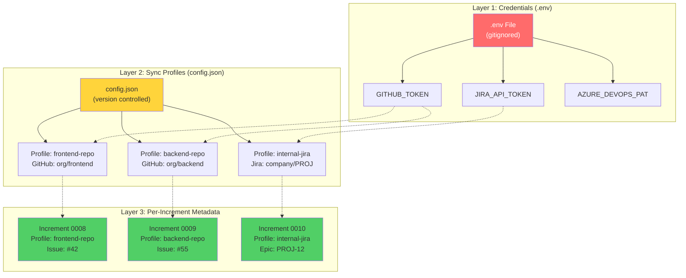
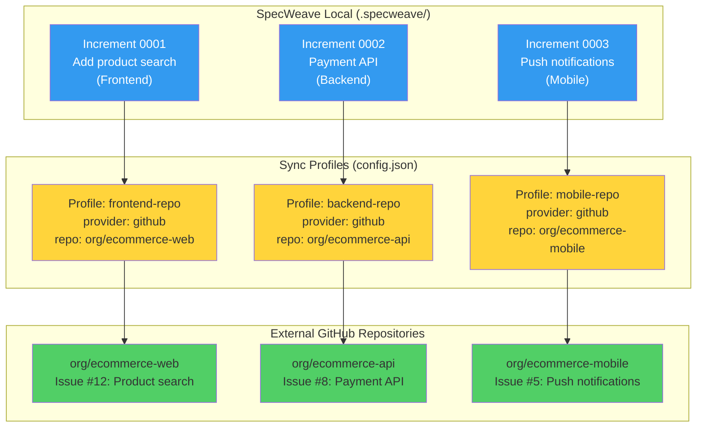
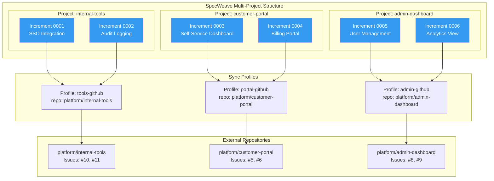
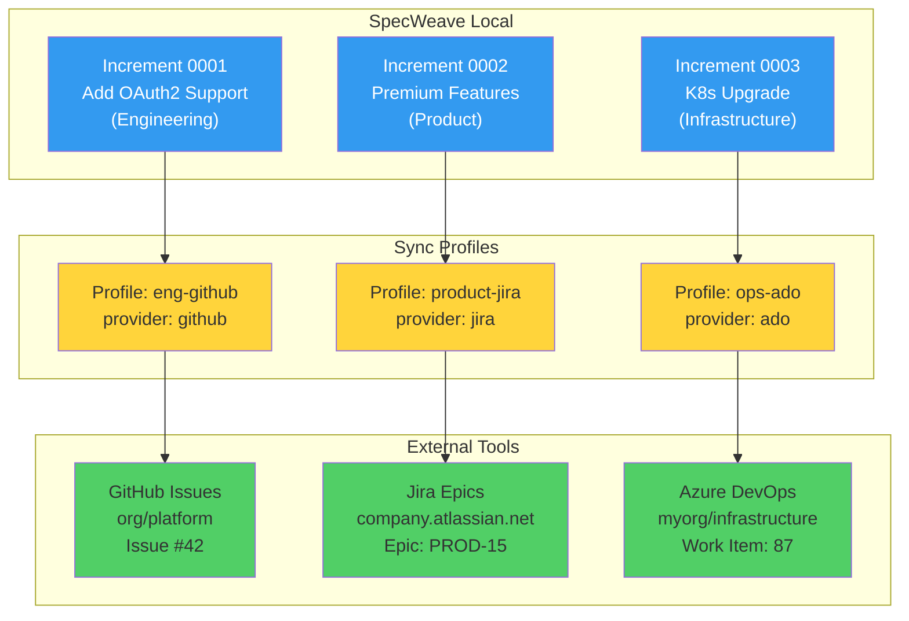
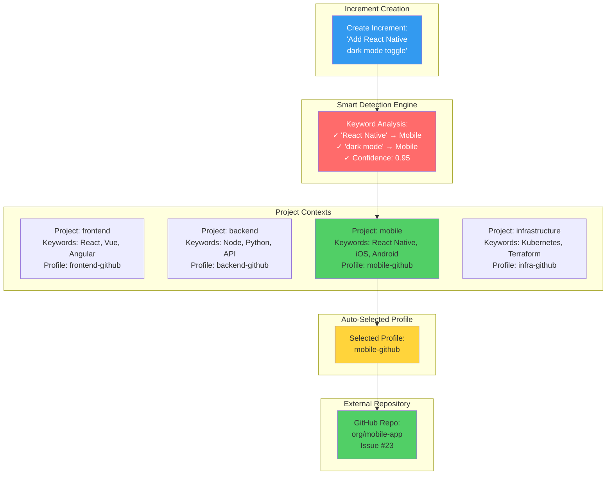
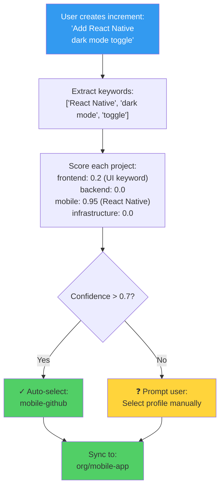
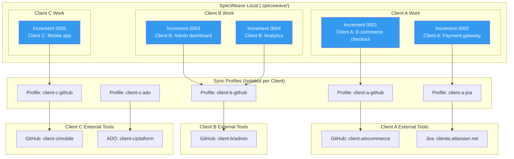
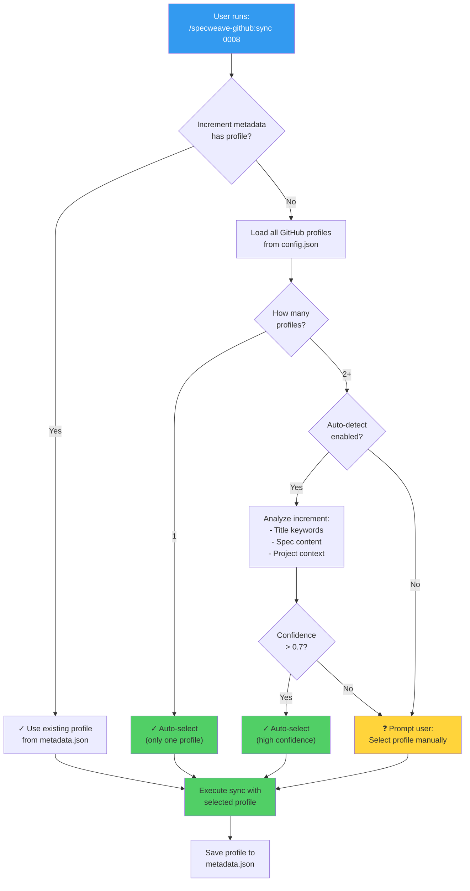
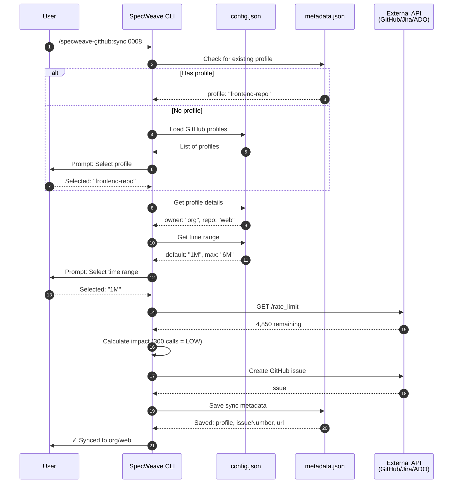
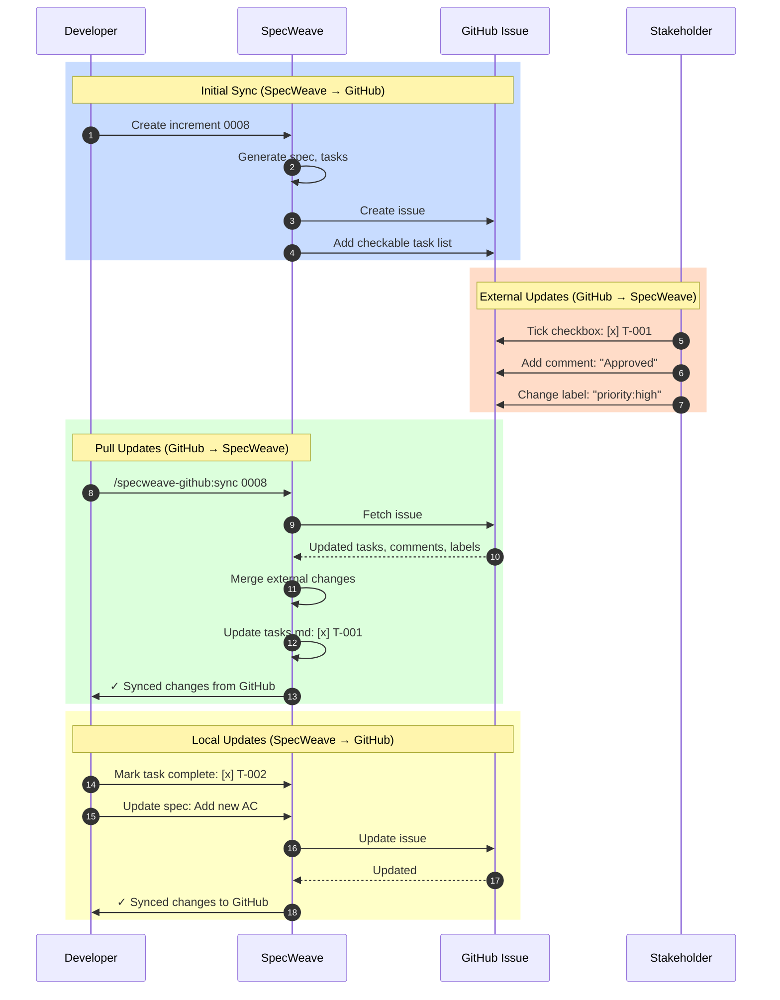

# Multi-Project Sync Architecture - Complete Guide

**Version**: 0.21.0+
**Last Updated**: 2025-11-16
**Audience**: Users managing multiple repos, teams, or clients

Complete architectural guide to SpecWeave's profile-based multi-project synchronization system with real-world scenarios and Mermaid diagrams.

---

## Table of Contents

- [Overview](#overview)
- [Core Architecture](#core-architecture)
- [Scenario 1: Single Project → Multiple Repos](#scenario-1-single-project--multiple-repos)
- [Scenario 2: Multi-Project Mode](#scenario-2-multi-project-mode)
- [Scenario 3: Mixed External Tools](#scenario-3-mixed-external-tools)
- [Scenario 4: Team-Based Organization](#scenario-4-team-based-organization)
- [Scenario 5: Multi-Client Consulting](#scenario-5-multi-client-consulting)
- [Profile Selection Flow](#profile-selection-flow)
- [Data Flow Architecture](#data-flow-architecture)
- [Configuration Patterns](#configuration-patterns)
- [Best Practices](#best-practices)

---

## Overview

SpecWeave's **Profile-Based Sync Architecture** enables unlimited external repository connections while maintaining a single local source of truth. This architecture supports:

- ✅ **Multiple repositories per provider** (Frontend repo, Backend repo, Mobile repo)
- ✅ **Multiple providers simultaneously** (GitHub + Jira + Azure DevOps)
- ✅ **Multi-project organization** (Team A, Team B, Team C)
- ✅ **Smart auto-detection** (Automatically routes increments to correct repos)
- ✅ **Per-increment flexibility** (Each increment can use different profile)

**Key Principle**: `.specweave/` is the source of truth, external tools are mirrors.

---

## Core Architecture

### Three-Layer Design

SpecWeave uses a **layered architecture** to separate credentials, configuration, and per-increment tracking:



**Layer Responsibilities**:

| Layer | Purpose | Location | Version Control | Secrets |
|-------|---------|----------|-----------------|---------|
| **1. Credentials** | API tokens | `.env` | ❌ Gitignored | ✅ Yes |
| **2. Profiles** | Repo configs | `config.json` | ✅ Committed | ❌ No |
| **3. Metadata** | Per-increment tracking | `metadata.json` | ✅ Committed | ❌ No |

---

## Scenario 1: Single Project → Multiple Repos

**Common Use Case**: Monorepo development syncing to separate external repos

**Example**: E-commerce platform with separate Frontend, Backend, and Mobile repositories

### Architecture Diagram



### Configuration

**File**: `.specweave/config.json`

```json
{
  "sync": {
    "profiles": {
      "frontend-repo": {
        "provider": "github",
        "displayName": "Frontend Web App",
        "config": {
          "owner": "acme-corp",
          "repo": "ecommerce-web"
        },
        "timeRange": {
          "default": "1M",
          "max": "6M"
        },
        "rateLimits": {
          "maxItemsPerSync": 500,
          "warnThreshold": 100
        }
      },
      "backend-repo": {
        "provider": "github",
        "displayName": "Backend API",
        "config": {
          "owner": "acme-corp",
          "repo": "ecommerce-api"
        },
        "timeRange": {
          "default": "1M",
          "max": "6M"
        }
      },
      "mobile-repo": {
        "provider": "github",
        "displayName": "Mobile App",
        "config": {
          "owner": "acme-corp",
          "repo": "ecommerce-mobile"
        },
        "timeRange": {
          "default": "1M",
          "max": "3M"
        }
      }
    }
  }
}
```

### Workflow

```bash
# 1. Create frontend increment
/specweave:increment "Add product search to web app"
# Increment 0001 created

# 2. Sync to frontend repo
/specweave-github:sync 0001
# ? Select profile: Frontend Web App (frontend-repo)
# ✓ Issue created: org/ecommerce-web#12

# 3. Create backend increment
/specweave:increment "Add payment processing API"
# Increment 0002 created

# 4. Sync to backend repo
/specweave-github:sync 0002
# ? Select profile: Backend API (backend-repo)
# ✓ Issue created: org/ecommerce-api#8

# 5. Create mobile increment
/specweave:increment "Add push notifications to mobile app"
# Increment 0003 created

# 6. Sync to mobile repo
/specweave-github:sync 0003
# ? Select profile: Mobile App (mobile-repo)
# ✓ Issue created: org/ecommerce-mobile#5
```

**Result**: Each increment syncs to its appropriate repository automatically.

---

## Scenario 2: Multi-Project Mode

**Common Use Case**: Enterprise teams managing completely separate projects

**Example**: Platform team managing Internal Tools, Customer Portal, and Admin Dashboard

### Architecture Diagram



### Configuration

**File**: `.specweave/config.json`

```json
{
  "multiProject": {
    "enabled": true,
    "activeProject": "internal-tools",
    "projects": [
      {
        "id": "internal-tools",
        "name": "Internal Tools",
        "description": "Employee-facing tools and utilities",
        "techStack": ["React", "Node.js", "PostgreSQL"],
        "team": "Platform Team",
        "syncProfiles": ["tools-github"]
      },
      {
        "id": "customer-portal",
        "name": "Customer Portal",
        "description": "Customer self-service portal",
        "techStack": ["Next.js", "GraphQL", "DynamoDB"],
        "team": "Customer Success Team",
        "syncProfiles": ["portal-github"]
      },
      {
        "id": "admin-dashboard",
        "name": "Admin Dashboard",
        "description": "Internal admin and analytics",
        "techStack": ["Vue.js", "Python", "Redis"],
        "team": "Operations Team",
        "syncProfiles": ["admin-github"]
      }
    ]
  },
  "sync": {
    "profiles": {
      "tools-github": {
        "provider": "github",
        "displayName": "Internal Tools Repository",
        "config": {
          "owner": "platform",
          "repo": "internal-tools"
        }
      },
      "portal-github": {
        "provider": "github",
        "displayName": "Customer Portal Repository",
        "config": {
          "owner": "platform",
          "repo": "customer-portal"
        }
      },
      "admin-github": {
        "provider": "github",
        "displayName": "Admin Dashboard Repository",
        "config": {
          "owner": "platform",
          "repo": "admin-dashboard"
        }
      }
    }
  }
}
```

### Workflow

```bash
# Morning: Work on Internal Tools
/specweave:switch-project internal-tools
/specweave:increment "Add SSO integration"
# → Spec created in: .specweave/docs/internal/specs/internal-tools/
# → Auto-syncs to: platform/internal-tools

# Afternoon: Switch to Customer Portal
/specweave:switch-project customer-portal
/specweave:increment "Build self-service dashboard"
# → Spec created in: .specweave/docs/internal/specs/customer-portal/
# → Auto-syncs to: platform/customer-portal

# Evening: Admin Dashboard work
/specweave:switch-project admin-dashboard
/specweave:increment "Add user management UI"
# → Spec created in: .specweave/docs/internal/specs/admin-dashboard/
# → Auto-syncs to: platform/admin-dashboard
```

**Key Feature**: Each project automatically uses its designated sync profile(s).

---

## Scenario 3: Mixed External Tools

**Common Use Case**: Different teams using different project management tools

**Example**: Development uses GitHub, Product uses Jira, Ops uses Azure DevOps

### Architecture Diagram



### Configuration

**File**: `.specweave/config.json`

```json
{
  "sync": {
    "profiles": {
      "eng-github": {
        "provider": "github",
        "displayName": "Engineering - GitHub",
        "config": {
          "owner": "acme-corp",
          "repo": "platform"
        },
        "timeRange": {
          "default": "1M",
          "max": "6M"
        }
      },
      "product-jira": {
        "provider": "jira",
        "displayName": "Product - Jira",
        "config": {
          "domain": "acme.atlassian.net",
          "projectKey": "PROD"
        },
        "timeRange": {
          "default": "3M",
          "max": "12M"
        }
      },
      "ops-ado": {
        "provider": "ado",
        "displayName": "Operations - Azure DevOps",
        "config": {
          "organization": "acme-corp",
          "project": "Infrastructure"
        },
        "timeRange": {
          "default": "1M",
          "max": "6M"
        }
      }
    }
  }
}
```

**Credentials**: `.env`

```bash
# GitHub token (Engineering)
GITHUB_TOKEN=ghp_xxxxxxxxxxxxxxxxxxx

# Jira token (Product)
JIRA_EMAIL=product@acme.com
JIRA_API_TOKEN=ATATTxxxxxxxxxxxxxxx

# Azure DevOps PAT (Operations)
AZURE_DEVOPS_PAT=xxxxxxxxxxxxxxxxxxx
```

### Workflow

```bash
# Engineering work → GitHub
/specweave:increment "Add OAuth2 authentication"
/specweave-github:sync 0001
# ? Select profile: Engineering - GitHub (eng-github)
# ✓ Issue created: acme-corp/platform#42

# Product work → Jira
/specweave:increment "Launch premium tier features"
/specweave-jira:sync 0002
# ? Select profile: Product - Jira (product-jira)
# ✓ Epic created: PROD-15

# Infrastructure work → Azure DevOps
/specweave:increment "Upgrade Kubernetes to v1.28"
/specweave-ado:sync 0003
# ? Select profile: Operations - Azure DevOps (ops-ado)
# ✓ Work item created: #87
```

**Result**: Same SpecWeave project syncs to three different external tools.

---

## Scenario 4: Team-Based Organization

**Common Use Case**: Multiple teams with automatic routing based on keywords

**Example**: Frontend Team, Backend Team, Mobile Team, Infrastructure Team

### Architecture with Auto-Detection



### Configuration

**File**: `.specweave/config.json`

```json
{
  "multiProject": {
    "enabled": true,
    "autoDetect": true,
    "projects": [
      {
        "id": "frontend",
        "name": "Frontend Team",
        "keywords": ["react", "vue", "angular", "ui", "ux", "css", "web"],
        "team": "Frontend Team",
        "syncProfiles": ["frontend-github"]
      },
      {
        "id": "backend",
        "name": "Backend Team",
        "keywords": ["api", "node", "python", "database", "postgres", "redis"],
        "team": "Backend Team",
        "syncProfiles": ["backend-github"]
      },
      {
        "id": "mobile",
        "name": "Mobile Team",
        "keywords": ["react-native", "ios", "android", "mobile", "app"],
        "team": "Mobile Team",
        "syncProfiles": ["mobile-github"]
      },
      {
        "id": "infrastructure",
        "name": "Infrastructure Team",
        "keywords": ["kubernetes", "k8s", "terraform", "aws", "docker", "devops"],
        "team": "Infrastructure Team",
        "syncProfiles": ["infra-github"]
      }
    ]
  },
  "sync": {
    "profiles": {
      "frontend-github": {
        "provider": "github",
        "config": { "owner": "org", "repo": "web-app" }
      },
      "backend-github": {
        "provider": "github",
        "config": { "owner": "org", "repo": "api-service" }
      },
      "mobile-github": {
        "provider": "github",
        "config": { "owner": "org", "repo": "mobile-app" }
      },
      "infra-github": {
        "provider": "github",
        "config": { "owner": "org", "repo": "infrastructure" }
      }
    }
  }
}
```

### Auto-Detection Algorithm



**Scoring Rules**:
- Project name match: +10 points
- Team name match: +5 points
- Keyword match: +3 points per keyword
- Normalize to 0.0-1.0 scale
- Auto-select if confidence > 0.7

---

## Scenario 5: Multi-Client Consulting

**Common Use Case**: Consulting firm managing multiple client projects

**Example**: Agency working with Client A, Client B, and Client C

### Architecture Diagram



### Configuration

**File**: `.specweave/config.json`

```json
{
  "multiProject": {
    "enabled": true,
    "projects": [
      {
        "id": "client-a",
        "name": "Client A - E-commerce Platform",
        "client": "Client A Inc.",
        "contractEnd": "2026-12-31",
        "syncProfiles": ["client-a-github", "client-a-jira"]
      },
      {
        "id": "client-b",
        "name": "Client B - Admin Portal",
        "client": "Client B Corp.",
        "contractEnd": "2026-06-30",
        "syncProfiles": ["client-b-github"]
      },
      {
        "id": "client-c",
        "name": "Client C - Mobile App",
        "client": "Client C LLC",
        "contractEnd": "2027-03-31",
        "syncProfiles": ["client-c-github", "client-c-ado"]
      }
    ]
  },
  "sync": {
    "profiles": {
      "client-a-github": {
        "provider": "github",
        "displayName": "Client A - GitHub",
        "config": {
          "owner": "client-a",
          "repo": "ecommerce"
        },
        "rateLimits": {
          "maxItemsPerSync": 200,
          "warnThreshold": 50
        }
      },
      "client-a-jira": {
        "provider": "jira",
        "displayName": "Client A - Jira",
        "config": {
          "domain": "clienta.atlassian.net",
          "projectKey": "ECOM"
        }
      },
      "client-b-github": {
        "provider": "github",
        "displayName": "Client B - GitHub",
        "config": {
          "owner": "client-b",
          "repo": "admin"
        },
        "rateLimits": {
          "maxItemsPerSync": 300,
          "warnThreshold": 100
        }
      },
      "client-c-github": {
        "provider": "github",
        "displayName": "Client C - GitHub",
        "config": {
          "owner": "client-c",
          "repo": "mobile"
        }
      },
      "client-c-ado": {
        "provider": "ado",
        "displayName": "Client C - Azure DevOps",
        "config": {
          "organization": "client-c",
          "project": "Platform"
        }
      }
    }
  }
}
```

### Workflow

```bash
# Morning: Client A work
/specweave:switch-project client-a
/specweave:increment "Add checkout flow to e-commerce"
# → Auto-syncs to: client-a/ecommerce (GitHub) AND clienta.atlassian.net (Jira)

# Afternoon: Client B work
/specweave:switch-project client-b
/specweave:increment "Build admin dashboard analytics"
# → Auto-syncs to: client-b/admin (GitHub only)

# Evening: Client C work
/specweave:switch-project client-c
/specweave:increment "Add offline mode to mobile app"
# → Prompt: Sync to GitHub or ADO? (or both)
```

**Key Features**:
- ✅ Complete isolation between client work
- ✅ Per-client rate limits (protect API quota)
- ✅ Contract tracking (expiration dates)
- ✅ Flexible sync (some clients use multiple tools)

---

## Profile Selection Flow

### Interactive Selection Process



### Selection Priority

1. **Existing Metadata** (Highest Priority)
   - If `metadata.json` has `sync.profile`, use it
   - Ensures consistency across re-syncs

2. **Single Profile** (Auto-select)
   - If only one profile exists for the provider, use it
   - No user input needed

3. **Auto-Detection** (If enabled)
   - Analyze increment title, spec content, project context
   - Calculate confidence score
   - Auto-select if confidence > 0.7

4. **Manual Selection** (Fallback)
   - Prompt user to select from available profiles
   - Show profile details (repo, team, description)

---

## Data Flow Architecture

### Complete Sync Lifecycle



### Bidirectional Sync Flow



---

## Configuration Patterns

### Pattern 1: Minimal Configuration

**Use Case**: Simple project with one external repo

```json
{
  "sync": {
    "profiles": {
      "default": {
        "provider": "github",
        "displayName": "My Project",
        "config": {
          "owner": "myorg",
          "repo": "myrepo"
        }
      }
    }
  }
}
```

**Benefits**:
- ✅ Quickest setup (< 1 minute)
- ✅ Auto-selects profile (no prompts)
- ✅ Good for solo developers

### Pattern 2: Multi-Repo Configuration

**Use Case**: Multiple repos for same project (FE, BE, Mobile)

```json
{
  "sync": {
    "profiles": {
      "frontend": {
        "provider": "github",
        "config": { "owner": "org", "repo": "web" }
      },
      "backend": {
        "provider": "github",
        "config": { "owner": "org", "repo": "api" }
      },
      "mobile": {
        "provider": "github",
        "config": { "owner": "org", "repo": "mobile" }
      }
    }
  }
}
```

**Benefits**:
- ✅ Clean separation by tech stack
- ✅ Independent issue tracking
- ✅ Team-specific repositories

### Pattern 3: Multi-Project + Multi-Repo

**Use Case**: Enterprise with multiple teams and projects

```json
{
  "multiProject": {
    "enabled": true,
    "projects": [
      {
        "id": "team-a",
        "syncProfiles": ["team-a-github", "team-a-jira"]
      },
      {
        "id": "team-b",
        "syncProfiles": ["team-b-github"]
      }
    ]
  },
  "sync": {
    "profiles": {
      "team-a-github": { "provider": "github", "config": {...} },
      "team-a-jira": { "provider": "jira", "config": {...} },
      "team-b-github": { "provider": "github", "config": {...} }
    }
  }
}
```

**Benefits**:
- ✅ Complete team isolation
- ✅ Mixed external tools
- ✅ Scalable to 10+ teams

### Pattern 4: Client-Isolated Configuration

**Use Case**: Consulting/agency managing multiple clients

```json
{
  "multiProject": {
    "enabled": true,
    "projects": [
      {
        "id": "client-a",
        "client": "Client A Inc.",
        "contractEnd": "2026-12-31",
        "syncProfiles": ["client-a-github"],
        "rateLimits": {
          "maxItemsPerSync": 100
        }
      },
      {
        "id": "client-b",
        "client": "Client B Corp.",
        "syncProfiles": ["client-b-github"]
      }
    ]
  },
  "sync": {
    "profiles": {
      "client-a-github": {
        "provider": "github",
        "config": { "owner": "client-a", "repo": "project" }
      },
      "client-b-github": {
        "provider": "github",
        "config": { "owner": "client-b", "repo": "app" }
      }
    }
  }
}
```

**Benefits**:
- ✅ Complete client isolation
- ✅ Per-client rate limits
- ✅ Contract tracking
- ✅ Easy handoff (export client folder)

---

## Best Practices

### 1. Profile Naming Conventions

**Good Names**:
- ✅ `frontend-github` - Describes tech stack + provider
- ✅ `client-a-jira` - Describes client + provider
- ✅ `team-alpha-ado` - Describes team + provider
- ✅ `mobile-app-github` - Describes product + provider

**Bad Names**:
- ❌ `profile1` - Meaningless
- ❌ `gh` - Too cryptic
- ❌ `prod` - Ambiguous (production? product?)

### 2. Time Range Recommendations

| Scenario | Recommended | Rationale |
|----------|-------------|-----------|
| **Active project** | 1M (1 month) | Recent work, fast sync |
| **Brownfield migration** | 3M (3 months) | Balance history + speed |
| **Long-term project** | 6M (6 months) | Comprehensive history |
| **Initial setup** | ALL (all time) | One-time full import |
| **Daily syncs** | 1W (1 week) | Minimal API calls |

### 3. Rate Limit Strategy

**Conservative Limits** (Recommended for shared accounts):
```json
{
  "rateLimits": {
    "maxItemsPerSync": 200,
    "warnThreshold": 50
  }
}
```

**Aggressive Limits** (For dedicated accounts):
```json
{
  "rateLimits": {
    "maxItemsPerSync": 1000,
    "warnThreshold": 500
  }
}
```

### 4. Multi-Project Organization

**Good Structure**:
```
projects/
├── frontend-team/       ✅ Team-based
├── backend-team/
└── mobile-team/

projects/
├── client-a/            ✅ Client-based
├── client-b/
└── client-c/
```

**Bad Structure**:
```
projects/
├── feature-auth/        ❌ Feature-based (too granular)
├── feature-payments/
└── bug-fixes/          ❌ Type-based (wrong abstraction)
```

### 5. Credential Management

**Correct**:
```bash
# .env (gitignored)
GITHUB_TOKEN=ghp_xxxxx
JIRA_API_TOKEN=ATATTxxxxx
```

**Incorrect**:
```json
// config.json (DON'T DO THIS!)
{
  "profiles": {
    "bad": {
      "config": {
        "token": "ghp_xxxxx"  // ❌ SECURITY RISK!
      }
    }
  }
}
```

---

## Summary

SpecWeave's **Profile-Based Multi-Project Sync Architecture** enables:

**✅ Unlimited Scale**:
- Multiple repositories per provider
- Multiple providers simultaneously
- Multiple projects/teams/clients

**✅ Smart Automation**:
- Auto-detection based on keywords
- Auto-selection with confidence scoring
- Per-increment flexibility

**✅ Safety & Performance**:
- Time range filtering (1W, 1M, 3M, 6M, ALL)
- Rate limit protection
- Pre-flight validation

**✅ Clean Architecture**:
- Layer 1: Credentials (.env, gitignored)
- Layer 2: Profiles (config.json, committed)
- Layer 3: Metadata (per-increment tracking)

**Key Commands**:
- `/specweave:switch-project <id>` - Switch active project
- `/specweave-github:sync <increment>` - Sync to GitHub
- `/specweave-jira:sync <increment>` - Sync to Jira
- `/specweave-ado:sync <increment>` - Sync to Azure DevOps

**Result**: Work seamlessly across unlimited repositories while maintaining a single local source of truth.

---

## Related Documentation

- [Multi-Project Setup Guide](/docs/guides/multi-project-setup) - Setup instructions
- [Profile-Based Sync](/docs/glossary/terms/profile-based-sync) - Glossary term
- [Sync Strategies](/docs/guides/sync-strategies) - Sync strategy patterns
- [GitHub Integration](/docs/guides/github-integration) - GitHub-specific setup

---

**Last Updated**: 2025-11-16
**Version**: 0.21.0+
**Feedback**: https://github.com/anton-abyzov/specweave/issues
