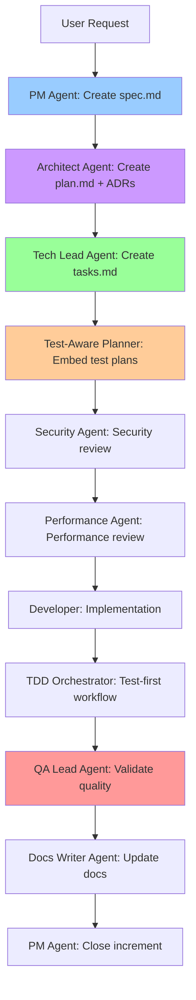

# Software Engineering Roles & SpecWeave AI Agents

## Introduction

Building modern software requires diverse expertise: product strategy, system architecture, implementation, quality assurance, security, and operations. Traditional teams hire specialists for each role, but **SpecWeave provides AI agents that perform these specialized tasks for you**.

This guide explains:
- Traditional software engineering roles and their responsibilities
- How SpecWeave's 11 AI agents map to these roles
- How agents collaborate to build complete features
- Real-world examples of agents in action

---

## SpecWeave's AI Agents (11 Total)

SpecWeave includes **11 specialized AI agents** that perform different roles in the software development lifecycle:

### Product & Planning Agents

**1. PM Agent** (`pm`)
- **Role**: Product Manager
- **Expertise**: Product strategy, requirements gathering, user stories, feature prioritization
- **Activates**: When planning features, creating specs, defining acceptance criteria
- **Commands**: `/sw:increment`, `/sw:done`
- **Output**: `spec.md` with user stories and acceptance criteria

**2. Architect Agent** (`architect`)
- **Role**: System Architect
- **Expertise**: System design, ADRs, technology stack selection, scalability
- **Activates**: When designing architecture, making technical decisions
- **Output**: `plan.md`, Architecture Decision Records (ADRs), diagrams

**3. Tech Lead Agent** (`tech-lead`)
- **Role**: Technical Lead
- **Expertise**: Implementation planning, task breakdown, code review
- **Activates**: When creating tasks, reviewing code, planning sprints
- **Output**: `tasks.md` with implementation steps

### Quality & Testing Agents

**4. QA Engineer Agent** (`testing:qa`)
- **Role**: QA Engineer
- **Expertise**: Test strategy, test planning, quality gates
- **Activates**: When planning test coverage, validating quality
- **Commands**: `/sw:check-tests`, `/sw:qa`
- **Output**: Test plans, quality assessment reports

**5. TDD Cycle Agent** (`tdd-cycle`)
- **Role**: TDD (Test-Driven Development) Workflow Leader
- **Expertise**: Red-Green-Refactor cycle, test-first development
- **Activates**: When using TDD workflow
- **Commands**: `/sw:tdd-cycle`, `/sw:tdd-red`, `/sw:tdd-green`, `/sw:tdd-refactor`
- **Output**: TDD workflow guidance, test implementation

**6. Test-Aware Planner Agent** (`test-aware-planner`)
- **Role**: Test-Focused Task Planner
- **Expertise**: Creating tasks with embedded test plans (BDD format)
- **Activates**: When generating `tasks.md` with test coverage
- **Output**: `tasks.md` with BDD test plans, AC-ID traceability

### Specialized Agents

**7. Security Agent** (`security`)
- **Role**: Security Specialist
- **Expertise**: Security analysis, threat modeling, vulnerability assessment
- **Activates**: When reviewing security, OWASP compliance, auth/authorization design
- **Output**: Security recommendations, threat assessments

**8. Performance Agent** (`performance`)
- **Role**: Performance Specialist
- **Expertise**: Performance optimization, scalability, benchmarking
- **Activates**: When analyzing performance bottlenecks, optimizing code
- **Output**: Performance analysis, optimization recommendations

**9. Docs Writer Agent** (`docs-writer`)
- **Role**: Technical Writer
- **Expertise**: Documentation creation, API docs, user guides
- **Activates**: When generating documentation, updating living docs
- **Output**: Updated README.md, API documentation, user guides

### Utility Agents

**10. Translator Agent** (`translator`)
- **Role**: Translation Specialist
- **Expertise**: Multilingual support, content translation
- **Activates**: When translating specs/docs to English (multilingual workflow)
- **Commands**: `/sw:translate`
- **Output**: Translated content (maintains code blocks, technical terms)

**11. Code Reviewer Agent** (`code-reviewer`)
- **Role**: Code Review Specialist
- **Expertise**: Code quality, best practices, design patterns
- **Activates**: When reviewing code, providing feedback
- **Output**: Code review feedback, improvement suggestions

---

## How Agents Map to Traditional Roles

### Traditional Role: Product Manager

**Traditional Responsibilities**:
- Define product vision and strategy
- Gather requirements from stakeholders
- Write user stories with acceptance criteria
- Prioritize features using frameworks (RICE, MoSCoW)
- Track progress and report to stakeholders

**SpecWeave Agent: PM Agent** (`pm`)

**How PM Agent Helps**:

```markdown
# User creates increment
/sw:increment "Add user authentication with OAuth"

# PM Agent activates automatically and:
1. Generates spec.md with:
   - User stories (US-001, US-002, US-003)
   - Acceptance criteria with AC-IDs (AC-US1-01, AC-US1-02, etc.)
   - Success metrics
   - Priority assignments (P1, P2, P3)
2. Creates living docs in .specweave/docs/internal/specs/
3. Links to external PM tools (Jira, ADO, GitHub Issues)
4. Validates increment completion via /sw:done
```

**Example Output** (spec.md):

```markdown
## US-001: User Login with Email
**Priority**: P1 (Must-Have)

**As a** registered user
**I want** to log in with my email and password
**So that** I can access my account

**Acceptance Criteria**:
- [ ] **AC-US1-01**: User can log in with valid email/password (testable)
- [ ] **AC-US1-02**: Invalid credentials show error message (testable)
- [ ] **AC-US1-03**: 5 failed attempts lock account for 15 minutes (testable)

**Success Metrics**:
- Login success rate > 95%
- Login time < 2 seconds (p95)
```

PM Agent auto-generates this structure from high-level descriptions, with AC-IDs for test traceability.

---

### Traditional Role: Software Architect

**Traditional Responsibilities**:
- Design system architecture (high-level and low-level)
- Create Architecture Decision Records (ADRs)
- Document design patterns and best practices
- Create C4 diagrams (context, container, component)
- Make technology stack decisions

**SpecWeave Agent: Architect Agent** (`architect`)

**How Architect Agent Helps**:

```markdown
# Architect creates plan.md with architecture design
# After PM Agent generates spec.md, Architect Agent:

1. Creates Architecture Decision Records (ADRs):
   .specweave/docs/internal/architecture/adr/0001-database-choice.md
   .specweave/docs/internal/architecture/adr/0002-websocket-vs-polling.md
   .specweave/docs/internal/architecture/adr/0003-deployment-platform.md

2. Updates system design:
   .specweave/docs/internal/architecture/system-design.md

3. Creates diagrams (Mermaid format):
   .specweave/docs/internal/architecture/diagrams/system-context.mmd
   .specweave/docs/internal/architecture/diagrams/system-container.mmd

4. Generates plan.md (increment implementation plan)
```

**Example Output** (ADR):

```markdown
# ADR-0001: Database Choice (PostgreSQL vs MongoDB)

**Date**: 2025-11-04
**Status**: Accepted

## Context
We need to store user profiles, orders, and payment history.

## Decision
Use PostgreSQL for transactional data, Redis for session cache.

## Rationale
- PostgreSQL: ACID compliance, strong consistency for payments
- Redis: Fast session lookups (< 10ms), TTL support for auto-expiration

## Consequences
**Positive**:
- ✅ Reliable payment processing (no lost transactions)
- ✅ Fast login (session cache)

**Negative**:
- ⚠️  Two databases to maintain (operational complexity)

**Alternatives Considered**:
- MongoDB: No ACID guarantees for payments (rejected)
- MySQL: Weaker JSON support than PostgreSQL (rejected)
```

Architect Agent stores ADRs permanently in living docs, updated via `/sw:sync-docs`.

---

### Traditional Role: Tech Lead / Engineering Manager

**Traditional Responsibilities**:
- Break down features into implementation tasks
- Assign tasks to developers
- Code review and technical guidance
- Unblock developers
- Track sprint progress

**SpecWeave Agent: Tech Lead Agent** (`tech-lead`)

**How Tech Lead Agent Helps**:

```markdown
# Tech Lead creates tasks.md (implementation breakdown)
# After Architect creates plan.md, Tech Lead Agent:

1. Breaks down architecture into tasks
2. Assigns priorities (P1, P2, P3)
3. Creates dependencies (Task T-003 depends on T-001, T-002)
4. Defines "Definition of Done" for each task
5. Estimates effort
```

**Example Output** (tasks.md):

```markdown
---
increment: 0008-user-authentication
total_tasks: 15
test_mode: TDD
coverage_target: 85%
---

## T-001: Implement Authentication Service

**AC**: AC-US1-01, AC-US1-02, AC-US1-03

**Test Plan** (BDD format):
- **Given** user with valid credentials → **When** login → **Then** receive JWT token + timestamp update

**Test Cases**:
- Unit (`auth.test.ts`): validLogin, invalidPassword, nonexistentUser, rateLimiting → 90% coverage
- Integration (`auth-flow.test.ts`): loginEndpoint, lockedAccount → 85% coverage
- **Overall: 87% coverage**

**Implementation**:
1. Create AuthService.ts (business logic)
2. Add password hashing (bcrypt)
3. Add JWT generation
4. Add rate limiting (Redis)
5. Write tests (TDD: red → green → refactor)

**Dependencies**: None
**Priority**: P1
**Estimated Effort**: 6-8 hours
```

Tech Lead Agent ensures every task has clear implementation steps and acceptance criteria.

---

### Traditional Role: QA Engineer / QA Lead

**Traditional Responsibilities**:
- Write test plans and test cases
- Ensure test coverage meets requirements
- Manual exploratory testing
- Report bugs with reproduction steps
- Validate features against acceptance criteria

**SpecWeave Agents: QA Engineer + Test-Aware Planner** (`testing:qa`, `test-aware-planner`)

**How QA Agents Help**:

**QA Lead Agent**:
- Defines test strategy (unit/integration/E2E targets)
- Validates test coverage via `/sw:check-tests`
- Runs quality gates via `/sw:qa`
- Ensures AC-ID traceability (spec.md AC → tasks.md tests)

**Test-Aware Planner Agent**:
- Embeds test plans in tasks.md (BDD format: Given/When/Then)
- Maps tests to acceptance criteria (AC-US1-01)
- Defines coverage targets per task (80-90%)
- Ensures test-first workflow (TDD support)

**Example Workflow**:

```bash
# 1. QA Lead validates test coverage
/sw:check-tests 0008

# Output:
# ✅ AC-US1-01: Covered by T-001 (unit + integration)
# ✅ AC-US1-02: Covered by T-001 (unit + integration)
# ❌ AC-US1-03: NOT COVERED (missing test for account locking)

# 2. QA Lead requests missing test
# Developer adds test for AC-US1-03

# 3. QA Lead runs quality gate
/sw:qa 0008

# Output:
# ✅ PASS - All tests passing, coverage targets met
```

---

### Traditional Role: Security Engineer

**Traditional Responsibilities**:
- Threat modeling
- Security code review
- OWASP Top 10 compliance
- Penetration testing
- Vulnerability scanning

**SpecWeave Agent: Security Agent** (`security`)

**How Security Agent Helps**:

```markdown
# Security Agent reviews architecture for security issues
# Invoked by Architect or Tech Lead during planning

1. Threat Modeling:
   - Identifies OWASP Top 10 risks
   - Reviews authentication/authorization design
   - Checks for SQL injection, XSS, CSRF vulnerabilities

2. Security Recommendations:
   - Password hashing (bcrypt, min 10 rounds)
   - JWT token security (expiration, revocation)
   - HTTPS enforcement
   - Rate limiting (prevent brute force)
   - Input validation

3. Output: Security assessment report
```

**Example Output**:

```markdown
# Security Review: User Authentication (Increment 0008)

## Threats Identified

**T-001: Brute Force Attack** (OWASP A07)
- **Risk**: High
- **Mitigation**: ✅ Rate limiting (5 attempts / 15 min) - Implemented in T-001

**T-002: Weak Password Policy** (OWASP A07)
- **Risk**: Medium
- **Mitigation**: ✅ Password requirements (8+ chars, mixed case, numbers) - Spec AC-US1-01

**T-003: JWT Token Theft** (OWASP A01)
- **Risk**: Medium
- **Mitigation**: ⚠️  HTTPS enforcement needed (add to plan.md)

## Recommendations
1. ✅ Add HTTPS-only mode (production)
2. ✅ Implement JWT refresh tokens (short-lived access tokens)
3. ⚠️  Consider 2FA for admin accounts (defer to v2)

## Verdict: ✅ PASS (with recommendations)
```

---

### Traditional Role: Performance Engineer / SRE

**Traditional Responsibilities**:
- Performance optimization
- Benchmarking
- Scalability analysis
- Monitoring and observability
- Incident response

**SpecWeave Agent: Performance Agent** (`performance`)

**How Performance Agent Helps**:

```markdown
# Performance Agent analyzes performance bottlenecks
# Invoked during architecture review or implementation

1. Performance Analysis:
   - Identifies slow queries
   - Reviews caching strategy
   - Analyzes API latency
   - Checks database indexes

2. Scalability Review:
   - Horizontal scaling readiness
   - Database sharding needs
   - Load balancing configuration

3. Output: Performance recommendations
```

**Example Output**:

```markdown
# Performance Review: User Authentication (Increment 0008)

## Bottlenecks Identified

**B-001: Slow Password Hashing**
- **Issue**: bcrypt rounds = 10 → 300ms per login
- **Impact**: Login latency p95 = 450ms (target: < 200ms)
- **Fix**: ✅ Acceptable for security (bcrypt 10 rounds is standard)

**B-002: No Database Index on email Column**
- **Issue**: Full table scan on user lookup
- **Impact**: 50ms → 500ms at 10K users
- **Fix**: ⚠️  Add index on users(email) - Add to T-001

**B-003: Session Cache**
- **Issue**: No session caching → database query every request
- **Impact**: 10ms → 2ms with Redis cache
- **Fix**: ✅ Redis session store implemented in plan.md

## Recommendations
1. ⚠️  Add database index on users(email) - CRITICAL
2. ✅ Redis session cache - Already in plan
3. ℹ️  Monitor login latency with Grafana dashboard

## Verdict: ⚠️  CONDITIONAL PASS (add database index)
```

---

### Traditional Role: Technical Writer

**Traditional Responsibilities**:
- Write user-facing documentation
- Create API documentation
- Update README and guides
- Maintain docs site (Docusaurus, etc.)

**SpecWeave Agent: Docs Writer Agent** (`docs-writer`)

**How Docs Writer Agent Helps**:

```markdown
# Docs Writer updates documentation after feature completion
# Invoked via /sw:sync-docs or manually

1. Living Docs Sync:
   - Updates .specweave/docs/internal/ (architecture, ADRs)
   - Updates .specweave/docs/public/ (user guides)
   - Syncs spec.md → living docs (permanent archive)

2. User-Facing Docs:
   - Updates README.md with new features
   - Generates API documentation (OpenAPI → Markdown)
   - Updates CHANGELOG.md

3. Docs Site:
   - Creates new docs pages (Docusaurus)
   - Updates navigation (sidebars.js)
```

**Example Workflow**:

```bash
# After implementing authentication feature
/sw:sync-docs update

# Docs Writer Agent:
1. Copies increment spec.md → living docs spec-0008-user-authentication.md
2. Updates README.md with authentication examples
3. Updates CHANGELOG.md with v0.2.0 entry
4. Generates API docs from OpenAPI spec
```

---

## How Agents Collaborate (Real-World Example)

**Scenario**: User wants to add "Real-time chat with WebSocket support"

### Step 1: Product Planning (PM Agent)

```bash
/sw:increment "Add real-time chat with WebSocket support"
```

**PM Agent activates**:
1. Creates spec.md with user stories:
   - US-001: Send message (P1)
   - US-002: Receive messages in real-time (P1)
   - US-003: Typing indicators (P2)
   - US-004: Message history (P1)
2. Defines acceptance criteria with AC-IDs
3. Creates success metrics (message latency < 100ms)

**Output**: `.specweave/increments/0009-realtime-chat/spec.md`

---

### Step 2: Architecture Design (Architect Agent)

**Architect Agent activates**:
1. Reads spec.md (requirements from PM Agent)
2. Creates ADRs:
   - ADR-0001: WebSocket vs HTTP Polling (chose WebSocket)
   - ADR-0002: Database choice (PostgreSQL + Redis)
   - ADR-0003: Message queue (Kafka for scalability)
3. Updates system-design.md with WebSocket architecture
4. Creates diagrams (C4 container diagram)

**Output**: `.specweave/docs/internal/architecture/adr/0001-websocket-choice.md` + `plan.md`

---

### Step 3: Implementation Planning (Tech Lead Agent)

**Tech Lead Agent activates**:
1. Reads plan.md (architecture from Architect Agent)
2. Breaks down into tasks:
   - T-001: WebSocket server setup
   - T-002: Message persistence (PostgreSQL)
   - T-003: Real-time message broadcasting
   - T-004: Typing indicators
   - T-005: E2E tests
3. Assigns dependencies and priorities

**Output**: `.specweave/increments/0009-realtime-chat/tasks.md`

---

### Step 4: Test Planning (Test-Aware Planner Agent)

**Test-Aware Planner Agent activates**:
1. Reads spec.md and tasks.md
2. Embeds test plans in tasks.md (BDD format):
   - **Given** user sends message → **When** WebSocket emit → **Then** other users receive message
3. Maps tests to AC-IDs (AC-US1-01, AC-US1-02)
4. Defines coverage targets (85% overall)

**Output**: Updated `tasks.md` with embedded test plans

---

### Step 5: Security Review (Security Agent)

**Security Agent activates**:
1. Reviews WebSocket authentication (JWT tokens)
2. Checks for XSS vulnerabilities (message sanitization)
3. Validates rate limiting (prevent spam)
4. Recommends HTTPS enforcement

**Output**: Security assessment report

---

### Step 6: Performance Review (Performance Agent)

**Performance Agent activates**:
1. Analyzes WebSocket scalability (10K concurrent connections)
2. Reviews message latency (< 100ms target)
3. Checks Redis caching strategy
4. Recommends connection pooling

**Output**: Performance recommendations

---

### Step 7: Implementation & Testing

**Developer implements** tasks from tasks.md:
1. Uses TDD workflow (`/sw:tdd-cycle`)
2. TDD Orchestrator guides red-green-refactor cycle
3. Runs tests via `/sw:check-tests`

---

### Step 8: Quality Gate (QA Lead Agent)

```bash
/sw:qa 0009
```

**QA Lead Agent validates**:
- ✅ All AC-IDs tested (AC-US1-01, AC-US1-02, AC-US1-03)
- ✅ Coverage targets met (87% overall)
- ✅ E2E tests passing
- ✅ Security scan clean

**Output**: Quality gate result (PASS/FAIL)

---

### Step 9: Documentation (Docs Writer Agent)

```bash
/sw:sync-docs update
```

**Docs Writer Agent**:
1. Updates README.md with WebSocket examples
2. Generates API docs (Socket.io events)
3. Updates CHANGELOG.md
4. Syncs living docs

---

### Step 10: Closure (PM Agent)

```bash
/sw:done 0009
```

**PM Agent validates**:
- ✅ All P1 tasks complete
- ✅ Tests passing
- ✅ Documentation updated
- ✅ Approval: READY TO CLOSE

**Output**: Increment marked as complete

---

## Agent Workflow Summary



---

## Key Differences: Traditional Teams vs SpecWeave Agents

| Aspect | Traditional Team | SpecWeave Agents |
|--------|-----------------|------------------|
| **Team Size** | 8-10 people (PM, Architect, 4 Devs, 2 QA, 1 DevOps) | 1 developer + 11 AI agents |
| **Cost** | $1M+/year (salaries) | $50-200/month (API costs) |
| **Availability** | Business hours (40 hrs/week) | 24/7 |
| **Expertise** | Varies by individual | Expert-level in all domains |
| **Consistency** | Varies by mood/workload | Consistent every time |
| **Documentation** | Often skipped/outdated | Always complete, auto-synced |
| **Traceability** | Manual (Jira, Confluence) | Automatic (AC-IDs, living docs) |
| **Quality Gates** | Manual review | Automated validation |

---

## Best Practices: Working with SpecWeave Agents

### 1. Start with PM Agent

Always begin with `/sw:increment` to let PM Agent create the spec:

```bash
/sw:increment "Add user authentication"
```

PM Agent generates spec.md, which triggers Architect Agent, Tech Lead Agent, etc.

### 2. Let Agents Collaborate

Don't micro-manage agents. They collaborate automatically:
- PM Agent → Architect Agent → Tech Lead Agent → QA Lead Agent

### 3. Use Quality Gates

Always validate before closing:

```bash
/sw:check-tests 0008  # Check test coverage
/sw:qa 0008           # Run quality assessment
/sw:done 0008         # PM validation + closure
```

### 4. Keep Living Docs Synced

After completing tasks, sync living docs:

```bash
/sw:sync-docs update
```

This keeps `.specweave/docs/internal/` permanently up-to-date.

### 5. Use AC-IDs for Traceability

Acceptance Criteria IDs (AC-US1-01) enable traceability:
- spec.md: AC-US1-01 defined
- tasks.md: T-001 implements AC-US1-01
- tests: auth.test.ts validates AC-US1-01

---

## Learning Path: Understanding SpecWeave Agents

**Beginner**:
1. Read [Getting Started](../../guides/getting-started/quickstart.md)
2. Understand [What is an Increment](../../guides/core-concepts/what-is-an-increment.md)
3. Try `/sw:increment "simple feature"` to see PM Agent in action

**Intermediate**:
1. **Planning Workflow** (coming soon) - PM + Architect + Tech Lead collaboration
2. **Test-Aware Planning** (coming soon) - TDD Orchestrator + Test-Aware Planner workflow
3. **Quality Gates** (coming soon) - QA Lead + Security + Performance validation

**Advanced**:
1. **Agent Orchestration** (coming soon) - How agents collaborate on complex features
2. Learn [Living Documentation](../../guides/core-concepts/living-documentation.md) (Docs Writer + Sync)
3. Read [Multilingual Workflow](../../guides/multilingual-guide.md) (Translator Agent for international teams)

---

## Conclusion

SpecWeave provides **11 specialized AI agents** that perform the roles traditionally handled by a full software engineering team:

**Core Agents**:
- **PM Agent**: Product strategy, requirements, user stories
- **Architect Agent**: System design, ADRs, technology decisions
- **Tech Lead Agent**: Task breakdown, implementation planning

**Quality Agents**:
- **QA Lead Agent**: Test strategy, quality validation
- **TDD Orchestrator**: Test-driven development workflow
- **Test-Aware Planner**: Tasks with embedded test plans

**Specialized Agents**:
- **Security Agent**: Security analysis, threat modeling
- **Performance Agent**: Performance optimization, scalability
- **Docs Writer Agent**: Documentation updates, living docs sync

**Utility Agents**:
- **Translator Agent**: Multilingual support
- **Code Reviewer Agent**: Code quality feedback

These agents collaborate automatically to deliver complete, tested, documented features while maintaining living documentation that stays current throughout the project lifecycle.

**Next Steps**:
- [Try SpecWeave](../../guides/getting-started/installation.md) - Install and create your first increment
- [Explore Workflows](../../workflows/overview.md) - Learn how agents collaborate
- [Read Core Concepts](../../guides/core-concepts/what-is-an-increment.md) - Understand increments and living docs

---

**Further Reading**:
- [Enterprise App Development](./enterprise-app-development.md) - How SpecWeave scales
- [Backend Fundamentals](../backend/backend-fundamentals.md) - Backend architecture with SpecWeave
- [Frontend Fundamentals](../frontend/frontend-fundamentals.md) - Frontend development with SpecWeave
- [Testing Fundamentals](../testing/testing-fundamentals.md) - Test-driven development with TDD agents
