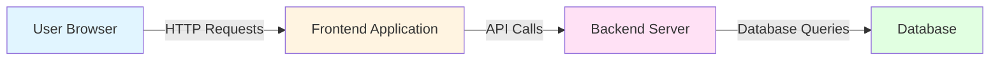
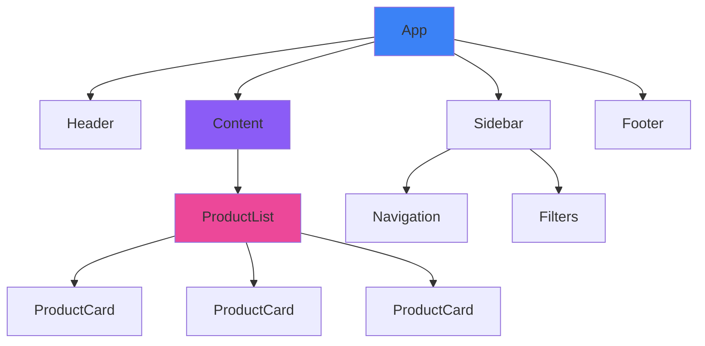

# Frontend Development Fundamentals

## What is Frontend Development?

Frontend development is the practice of creating the client-side of web applications - the part users see and interact with. It encompasses:

- **User Interface (UI)**: Visual elements (buttons, forms, navigation)
- **User Experience (UX)**: How users interact with the application
- **Client-Side Logic**: JavaScript code that runs in the browser
- **[API](/docs/glossary/terms/api) Communication**: Fetching and sending data to backend services
- **State Management**: Tracking application data and user interactions
- **Performance**: Ensuring fast load times and smooth interactions

### Frontend vs Backend



**Frontend Responsibilities**:
- Rendering UI components
- Handling user input (clicks, form submissions)
- Client-side validation
- Optimistic updates (show changes before server confirms)
- Caching and performance optimization

**Backend Responsibilities**:
- Business logic
- Database operations
- Authentication/authorization
- API endpoints
- Server-side validation

## Core Frontend Technologies

### HTML (Structure)

HTML5 provides semantic elements for better structure and accessibility:

```html
<!DOCTYPE html>
<html lang="en">
<head>
    <meta charset="UTF-8">
    <meta name="viewport" content="width=device-width, initial-scale=1.0">
    <title>Modern HTML5 Example</title>
</head>
<body>
    <!-- Semantic Structure -->
    <header>
        <nav>
            <ul>
                <li><a href="#home">Home</a></li>
                <li><a href="#about">About</a></li>
                <li><a href="#contact">Contact</a></li>
            </ul>
        </nav>
    </header>

    <main>
        <article>
            <h1>Article Title</h1>
            <section>
                <h2>Section 1</h2>
                <p>Content goes here...</p>
            </section>
        </article>

        <aside>
            <h3>Related Content</h3>
            <ul>
                <li>Link 1</li>
                <li>Link 2</li>
            </ul>
        </aside>
    </main>

    <footer>
        <p>&copy; 2025 Company Name</p>
    </footer>
</body>
</html>
```

**Key Semantic Elements**:
- `<header>`: Page or section header
- `<nav>`: Navigation links
- `<main>`: Main content area (one per page)
- `<article>`: Self-contained content (blog post, product card)
- `<section>`: Thematic grouping of content
- `<aside>`: Sidebar content
- `<footer>`: Page or section footer

### CSS (Styling)

Modern CSS provides powerful layout systems:

#### Flexbox (One-Dimensional Layout)

```css
/* Flex Container */
.container {
    display: flex;
    flex-direction: row; /* or column */
    justify-content: space-between; /* main axis alignment */
    align-items: center; /* cross axis alignment */
    gap: 1rem; /* spacing between items */
}

/* Flex Items */
.item {
    flex: 1; /* grow to fill space */
    flex-basis: 200px; /* base width */
}

/* Responsive Navigation */
.nav {
    display: flex;
    flex-wrap: wrap; /* wrap to new line on small screens */
}
```

#### CSS Grid (Two-Dimensional Layout)

```css
/* Grid Container */
.grid {
    display: grid;
    grid-template-columns: repeat(3, 1fr); /* 3 equal columns */
    grid-template-rows: auto;
    gap: 2rem;
}

/* Responsive Grid */
.responsive-grid {
    display: grid;
    grid-template-columns: repeat(auto-fit, minmax(250px, 1fr));
    gap: 1rem;
}

/* Named Grid Areas */
.layout {
    display: grid;
    grid-template-areas:
        "header header header"
        "sidebar main main"
        "footer footer footer";
    grid-template-columns: 200px 1fr 1fr;
}

.header { grid-area: header; }
.sidebar { grid-area: sidebar; }
.main { grid-area: main; }
.footer { grid-area: footer; }
```

#### Responsive Design with Media Queries

```css
/* Mobile First Approach */
.container {
    padding: 1rem;
    width: 100%;
}

/* Tablet (640px and up) */
@media (min-width: 640px) {
    .container {
        padding: 2rem;
        max-width: 768px;
        margin: 0 auto;
    }
}

/* Desktop (1024px and up) */
@media (min-width: 1024px) {
    .container {
        max-width: 1200px;
        padding: 3rem;
    }
}
```

#### CSS Variables (Custom Properties)

```css
:root {
    --primary-color: #3b82f6;
    --secondary-color: #8b5cf6;
    --text-color: #1f2937;
    --bg-color: #ffffff;
    --spacing-unit: 8px;
}

/* Dark Mode */
[data-theme="dark"] {
    --text-color: #f3f4f6;
    --bg-color: #1f2937;
}

/* Usage */
.button {
    background-color: var(--primary-color);
    color: white;
    padding: calc(var(--spacing-unit) * 2);
}
```

### JavaScript (Behavior)

Modern JavaScript (ES6+) provides powerful features:

#### DOM Manipulation

```javascript
// Select Elements
const button = document.querySelector('.submit-btn');
const items = document.querySelectorAll('.item');

// Event Handling
button.addEventListener('click', (event) => {
    event.preventDefault();
    console.log('Button clicked!');
});

// Create and Append Elements
const newDiv = document.createElement('div');
newDiv.className = 'card';
newDiv.textContent = 'New Card';
document.querySelector('.container').appendChild(newDiv);

// Modify Styles
button.style.backgroundColor = '#3b82f6';
button.classList.add('active');
button.classList.toggle('disabled');
```

#### Async Operations

```javascript
// Promises
fetch('https://api.example.com/users')
    .then(response => response.json())
    .then(data => console.log(data))
    .catch(error => console.error('Error:', error));

// Async/Await (Cleaner Syntax)
async function fetchUsers() {
    try {
        const response = await fetch('https://api.example.com/users');
        const data = await response.json();
        return data;
    } catch (error) {
        console.error('Error fetching users:', error);
        throw error;
    }
}

// Using the Function
(async () => {
    const users = await fetchUsers();
    console.log(users);
})();
```

#### ES6+ Features

```javascript
// Destructuring
const user = { name: 'John', age: 30, email: 'john@example.com' };
const { name, age } = user;

// Spread Operator
const arr1 = [1, 2, 3];
const arr2 = [...arr1, 4, 5]; // [1, 2, 3, 4, 5]

const obj1 = { a: 1, b: 2 };
const obj2 = { ...obj1, c: 3 }; // { a: 1, b: 2, c: 3 }

// Arrow Functions
const add = (a, b) => a + b;
const square = x => x * x; // Single parameter, no parentheses

// Template Literals
const greeting = `Hello, ${name}! You are ${age} years old.`;

// Optional Chaining
const userName = user?.profile?.name ?? 'Anonymous';

// Array Methods
const numbers = [1, 2, 3, 4, 5];
const doubled = numbers.map(n => n * 2);
const evens = numbers.filter(n => n % 2 === 0);
const sum = numbers.reduce((acc, n) => acc + n, 0);
```

## Modern Frontend Frameworks

### [React](/docs/glossary/terms/react)

[React](/docs/glossary/terms/react) is the most popular frontend library, created by Facebook. It's component-based and uses a virtual DOM for efficient updates.

#### Why [React](/docs/glossary/terms/react) is Most Popular

- **Component-Based**: Reusable UI building blocks
- **Virtual DOM**: Fast updates without direct DOM manipulation
- **Large Ecosystem**: Huge library of third-party packages
- **Strong Community**: Extensive tutorials, courses, and support
- **Job Market**: Most in-demand frontend skill
- **Flexible**: Works with any backend (REST, GraphQL, etc.)

#### React Component Example

```jsx
import React, { useState, useEffect } from 'react';

// Functional Component with Hooks
function UserProfile({ userId }) {
    // State Hook
    const [user, setUser] = useState(null);
    const [loading, setLoading] = useState(true);
    const [error, setError] = useState(null);

    // Effect Hook (runs on mount and when userId changes)
    useEffect(() => {
        async function fetchUser() {
            try {
                setLoading(true);
                const response = await fetch(`/api/users/${userId}`);
                if (!response.ok) throw new Error('User not found');
                const data = await response.json();
                setUser(data);
            } catch (err) {
                setError(err.message);
            } finally {
                setLoading(false);
            }
        }

        fetchUser();
    }, [userId]); // Dependency array: re-run when userId changes

    // Event Handler
    const handleUpdateEmail = async (newEmail) => {
        try {
            await fetch(`/api/users/${userId}`, {
                method: 'PATCH',
                headers: { 'Content-Type': 'application/json' },
                body: JSON.stringify({ email: newEmail }),
            });
            setUser({ ...user, email: newEmail });
        } catch (err) {
            console.error('Failed to update email:', err);
        }
    };

    // Conditional Rendering
    if (loading) return <div>Loading...</div>;
    if (error) return <div>Error: {error}</div>;
    if (!user) return <div>No user found</div>;

    return (
        <div className="user-profile">
            <h2>{user.name}</h2>
            <p>Email: {user.email}</p>
            <p>Joined: {new Date(user.createdAt).toLocaleDateString()}</p>
            <button onClick={() => handleUpdateEmail('newemail@example.com')}>
                Update Email
            </button>
        </div>
    );
}

export default UserProfile;
```

#### React Hooks

```jsx
import React, { useState, useEffect, useContext, useCallback, useMemo } from 'react';

// useState: Local component state
const [count, setCount] = useState(0);

// useEffect: Side effects (API calls, subscriptions, timers)
useEffect(() => {
    document.title = `Count: ${count}`;

    // Cleanup function (runs on unmount or before next effect)
    return () => {
        console.log('Cleanup');
    };
}, [count]); // Dependencies

// useContext: Consume context values
const theme = useContext(ThemeContext);

// useCallback: Memoize functions (prevent re-creation)
const handleClick = useCallback(() => {
    console.log('Clicked!');
}, []); // Empty deps = never changes

// useMemo: Memoize expensive calculations
const expensiveValue = useMemo(() => {
    return computeExpensiveValue(a, b);
}, [a, b]); // Recalculate only when a or b change
```

#### Props and State

```jsx
// Parent Component (passes props down)
function App() {
    const [count, setCount] = useState(0); // State

    return (
        <div>
            <Counter value={count} onIncrement={() => setCount(count + 1)} />
        </div>
    );
}

// Child Component (receives props)
function Counter({ value, onIncrement }) {
    // Props are read-only (cannot modify)
    return (
        <div>
            <p>Count: {value}</p>
            <button onClick={onIncrement}>Increment</button>
        </div>
    );
}
```

**Key Difference**:
- **Props**: Data passed from parent to child (read-only, flows down)
- **State**: Component's own data (mutable, managed internally)

### [Next.js](/docs/glossary/terms/nextjs)

[Next.js](/docs/glossary/terms/nextjs) is a [React](/docs/glossary/terms/react) framework that adds server-side rendering, static site generation, and more.

#### Why [Next.js](/docs/glossary/terms/nextjs)?

- **SEO-Friendly**: Server-side rendering ([SSR](/docs/glossary/terms/ssr)) improves search engine indexing
- **Fast Initial Load**: Pre-rendered HTML arrives instantly
- **File-Based Routing**: No need for React Router configuration
- **[API](/docs/glossary/terms/api) Routes**: Backend endpoints in the same codebase
- **Image Optimization**: Automatic image resizing and lazy loading
- **Built-in [TypeScript](/docs/glossary/terms/typescript) Support**: Zero configuration needed

#### Next.js Example

```jsx
// pages/index.tsx (Home Page)
import Head from 'next/head';
import Image from 'next/image';
import Link from 'next/link';

export default function Home() {
    return (
        <>
            <Head>
                <title>My Next.js App</title>
                <meta name="description" content="Built with Next.js" />
            </Head>

            <main>
                <h1>Welcome to Next.js!</h1>

                {/* Optimized Image Component */}
                <Image
                    src="/hero.jpg"
                    alt="Hero"
                    width={800}
                    height={400}
                    priority // Load immediately
                />

                {/* Client-Side Navigation (no full page reload) */}
                <Link href="/about">About Us</Link>
            </main>
        </>
    );
}

// pages/posts/[id].tsx (Dynamic Route)
import { useRouter } from 'next/router';

export default function Post() {
    const router = useRouter();
    const { id } = router.query; // Get URL parameter

    return <h1>Post ID: {id}</h1>;
}

// Static Site Generation (SSG)
export async function getStaticProps() {
    const res = await fetch('https://api.example.com/posts');
    const posts = await res.json();

    return {
        props: { posts }, // Passed to component as props
        revalidate: 60, // Re-generate page every 60 seconds (ISR)
    };
}

// Server-Side Rendering (SSR)
export async function getServerSideProps(context) {
    const res = await fetch(`https://api.example.com/user/${context.params.id}`);
    const user = await res.json();

    return {
        props: { user }, // Always fresh data on each request
    };
}
```

#### Next.js API Routes

```typescript
// pages/api/users.ts (Backend Endpoint)
import type { NextApiRequest, NextApiResponse } from 'next';

type User = {
    id: number;
    name: string;
    email: string;
};

export default async function handler(
    req: NextApiRequest,
    res: NextApiResponse<User[] | { error: string }>
) {
    if (req.method === 'GET') {
        // Fetch users from database
        const users = await db.users.findMany();
        return res.status(200).json(users);
    }

    if (req.method === 'POST') {
        const { name, email } = req.body;
        const newUser = await db.users.create({ data: { name, email } });
        return res.status(201).json(newUser);
    }

    res.status(405).json({ error: 'Method not allowed' });
}
```

### Angular

Angular is a full-featured TypeScript framework by Google.

#### Angular Component Example

```typescript
// user.component.ts
import { Component, OnInit } from '@angular/core';
import { UserService } from './user.service';

@Component({
    selector: 'app-user',
    templateUrl: './user.component.html',
    styleUrls: ['./user.component.css']
})
export class UserComponent implements OnInit {
    users: User[] = [];
    loading = true;

    // Dependency Injection
    constructor(private userService: UserService) {}

    ngOnInit(): void {
        this.userService.getUsers().subscribe({
            next: (data) => {
                this.users = data;
                this.loading = false;
            },
            error: (err) => console.error(err)
        });
    }

    deleteUser(id: number): void {
        this.userService.deleteUser(id).subscribe(() => {
            this.users = this.users.filter(u => u.id !== id);
        });
    }
}
```

```html
<!-- user.component.html -->
<div *ngIf="loading">Loading...</div>

<div *ngFor="let user of users" class="user-card">
    <h3>{{ user.name }}</h3>
    <p>{{ user.email }}</p>
    <button (click)="deleteUser(user.id)">Delete</button>
</div>
```

### Vue

Vue is a progressive framework with a gentle learning curve.

#### Vue Component Example

```vue
<template>
    <div class="user-profile">
        <h2>{{ user.name }}</h2>
        <p>Email: {{ user.email }}</p>
        <button @click="updateEmail">Update Email</button>
    </div>
</template>

<script setup lang="ts">
import { ref, onMounted } from 'vue';

// Reactive State
const user = ref<User | null>(null);
const loading = ref(true);

// Lifecycle Hook
onMounted(async () => {
    const response = await fetch('/api/user/123');
    user.value = await response.json();
    loading.value = false;
});

// Method
const updateEmail = async () => {
    await fetch('/api/user/123', {
        method: 'PATCH',
        body: JSON.stringify({ email: 'newemail@example.com' }),
    });
    if (user.value) {
        user.value.email = 'newemail@example.com';
    }
};
</script>

<style scoped>
.user-profile {
    padding: 1rem;
    border: 1px solid #ccc;
}
</style>
```

## Component Architecture

### Component Hierarchy



**Component Tree Example**:
```
App (root component)
├── Header
│   ├── Logo
│   └── Navigation
│       ├── NavLink
│       └── NavLink
├── Sidebar
│   ├── Filters
│   └── SearchBox
├── Content
│   └── ProductList
│       ├── ProductCard
│       ├── ProductCard
│       └── ProductCard
└── Footer
    ├── SocialLinks
    └── Copyright
```

### Component Composition

Building complex UIs from simple, reusable components:

```jsx
// Form Components (Building Blocks)

// Input Component
function Input({ label, value, onChange, type = 'text', error }) {
    return (
        <div className="input-group">
            <label>{label}</label>
            <input
                type={type}
                value={value}
                onChange={e => onChange(e.target.value)}
                className={error ? 'error' : ''}
            />
            {error && <span className="error-message">{error}</span>}
        </div>
    );
}

// Button Component
function Button({ children, onClick, variant = 'primary', disabled }) {
    return (
        <button
            className={`btn btn-${variant}`}
            onClick={onClick}
            disabled={disabled}
        >
            {children}
        </button>
    );
}

// Composed Form Component
function LoginForm({ onSubmit }) {
    const [email, setEmail] = useState('');
    const [password, setPassword] = useState('');
    const [errors, setErrors] = useState({});

    const handleSubmit = (e) => {
        e.preventDefault();

        // Validation
        const newErrors = {};
        if (!email) newErrors.email = 'Email is required';
        if (!password) newErrors.password = 'Password is required';

        if (Object.keys(newErrors).length > 0) {
            setErrors(newErrors);
            return;
        }

        onSubmit({ email, password });
    };

    return (
        <form onSubmit={handleSubmit}>
            <Input
                label="Email"
                type="email"
                value={email}
                onChange={setEmail}
                error={errors.email}
            />

            <Input
                label="Password"
                type="password"
                value={password}
                onChange={setPassword}
                error={errors.password}
            />

            <Button type="submit">Log In</Button>
        </form>
    );
}
```

## State Management

### Local State (useState)

Best for component-specific data:

```jsx
function Counter() {
    const [count, setCount] = useState(0);

    return (
        <div>
            <p>Count: {count}</p>
            <button onClick={() => setCount(count + 1)}>+</button>
            <button onClick={() => setCount(count - 1)}>-</button>
        </div>
    );
}
```

### Context API

Global state without external libraries:

```jsx
// Create Context
const AuthContext = createContext(null);

// Provider Component
function AuthProvider({ children }) {
    const [user, setUser] = useState(null);

    const login = async (email, password) => {
        const response = await fetch('/api/login', {
            method: 'POST',
            body: JSON.stringify({ email, password }),
        });
        const data = await response.json();
        setUser(data.user);
    };

    const logout = () => setUser(null);

    return (
        <AuthContext.Provider value={{ user, login, logout }}>
            {children}
        </AuthContext.Provider>
    );
}

// Custom Hook
function useAuth() {
    const context = useContext(AuthContext);
    if (!context) throw new Error('useAuth must be used within AuthProvider');
    return context;
}

// Usage in Component
function Profile() {
    const { user, logout } = useAuth();

    if (!user) return <div>Not logged in</div>;

    return (
        <div>
            <h2>{user.name}</h2>
            <button onClick={logout}>Log Out</button>
        </div>
    );
}

// App Wrapper
function App() {
    return (
        <AuthProvider>
            <Profile />
        </AuthProvider>
    );
}
```

### Redux

Centralized state management for complex applications:

```typescript
// store.ts (Redux Toolkit)
import { configureStore, createSlice } from '@reduxjs/toolkit';

// Slice (combines actions + reducer)
const cartSlice = createSlice({
    name: 'cart',
    initialState: {
        items: [],
        total: 0,
    },
    reducers: {
        addItem: (state, action) => {
            const item = action.payload;
            state.items.push(item);
            state.total += item.price;
        },
        removeItem: (state, action) => {
            const id = action.payload;
            const item = state.items.find(i => i.id === id);
            if (item) {
                state.items = state.items.filter(i => i.id !== id);
                state.total -= item.price;
            }
        },
        clearCart: (state) => {
            state.items = [];
            state.total = 0;
        },
    },
});

export const { addItem, removeItem, clearCart } = cartSlice.actions;

// Store
export const store = configureStore({
    reducer: {
        cart: cartSlice.reducer,
    },
});

// Types
export type RootState = ReturnType<typeof store.getState>;
export type AppDispatch = typeof store.dispatch;
```

```tsx
// Component using Redux
import { useSelector, useDispatch } from 'react-redux';
import { addItem, removeItem } from './store';

function ShoppingCart() {
    const items = useSelector((state: RootState) => state.cart.items);
    const total = useSelector((state: RootState) => state.cart.total);
    const dispatch = useDispatch();

    const handleAddProduct = (product) => {
        dispatch(addItem(product));
    };

    return (
        <div>
            <h2>Shopping Cart</h2>
            {items.map(item => (
                <div key={item.id}>
                    <span>{item.name} - ${item.price}</span>
                    <button onClick={() => dispatch(removeItem(item.id))}>
                        Remove
                    </button>
                </div>
            ))}
            <p>Total: ${total}</p>
        </div>
    );
}
```

### Zustand

Lightweight alternative to Redux with simpler API:

```typescript
// store.ts
import create from 'zustand';

interface CartStore {
    items: Product[];
    total: number;
    addItem: (item: Product) => void;
    removeItem: (id: string) => void;
    clearCart: () => void;
}

export const useCartStore = create<CartStore>((set) => ({
    items: [],
    total: 0,

    addItem: (item) => set((state) => ({
        items: [...state.items, item],
        total: state.total + item.price,
    })),

    removeItem: (id) => set((state) => {
        const item = state.items.find(i => i.id === id);
        return {
            items: state.items.filter(i => i.id !== id),
            total: state.total - (item?.price || 0),
        };
    }),

    clearCart: () => set({ items: [], total: 0 }),
}));
```

```tsx
// Component using Zustand
function ShoppingCart() {
    const { items, total, removeItem } = useCartStore();

    return (
        <div>
            <h2>Shopping Cart</h2>
            {items.map(item => (
                <div key={item.id}>
                    <span>{item.name} - ${item.price}</span>
                    <button onClick={() => removeItem(item.id)}>Remove</button>
                </div>
            ))}
            <p>Total: ${total}</p>
        </div>
    );
}
```

## Routing

### React Router

Client-side routing for single-page applications:

```tsx
import { BrowserRouter, Routes, Route, Link, useNavigate, useParams } from 'react-router-dom';

function App() {
    return (
        <BrowserRouter>
            <nav>
                <Link to="/">Home</Link>
                <Link to="/about">About</Link>
                <Link to="/posts">Posts</Link>
            </nav>

            <Routes>
                <Route path="/" element={<Home />} />
                <Route path="/about" element={<About />} />
                <Route path="/posts" element={<Posts />} />
                <Route path="/posts/:id" element={<Post />} />
                <Route path="/admin" element={<ProtectedRoute><Admin /></ProtectedRoute>} />
                <Route path="*" element={<NotFound />} />
            </Routes>
        </BrowserRouter>
    );
}

// Dynamic Route with URL Parameter
function Post() {
    const { id } = useParams(); // Get URL parameter
    const [post, setPost] = useState(null);

    useEffect(() => {
        fetch(`/api/posts/${id}`)
            .then(res => res.json())
            .then(setPost);
    }, [id]);

    if (!post) return <div>Loading...</div>;

    return (
        <div>
            <h1>{post.title}</h1>
            <p>{post.content}</p>
        </div>
    );
}

// Programmatic Navigation
function LoginForm() {
    const navigate = useNavigate();

    const handleLogin = async (credentials) => {
        await login(credentials);
        navigate('/dashboard'); // Redirect after login
    };

    return <form onSubmit={handleLogin}>...</form>;
}

// Protected Route
function ProtectedRoute({ children }) {
    const { user } = useAuth();

    if (!user) {
        return <Navigate to="/login" replace />;
    }

    return children;
}
```

### Next.js Routing

File-based routing (no configuration needed):

```
pages/
├── index.tsx          → /
├── about.tsx          → /about
├── posts/
│   ├── index.tsx      → /posts
│   └── [id].tsx       → /posts/123
├── api/
│   └── users.ts       → /api/users
└── [...slug].tsx      → Catch-all route
```

```tsx
// pages/posts/[id].tsx
import { useRouter } from 'next/router';

export default function Post() {
    const router = useRouter();
    const { id } = router.query;

    // Programmatic navigation
    const goBack = () => router.push('/posts');

    return (
        <div>
            <h1>Post {id}</h1>
            <button onClick={goBack}>Back to Posts</button>
        </div>
    );
}
```

## Forms and Validation

### React Hook Form

Performant form library with minimal re-renders:

```tsx
import { useForm } from 'react-hook-form';
import { z } from 'zod';
import { zodResolver } from '@hookform/resolvers/zod';

// Validation Schema
const schema = z.object({
    email: z.string().email('Invalid email address'),
    password: z.string().min(8, 'Password must be at least 8 characters'),
    age: z.number().min(18, 'Must be 18 or older'),
    terms: z.boolean().refine(val => val === true, 'You must accept terms'),
});

type FormData = z.infer<typeof schema>;

function RegistrationForm() {
    const {
        register,
        handleSubmit,
        formState: { errors, isSubmitting },
    } = useForm<FormData>({
        resolver: zodResolver(schema),
    });

    const onSubmit = async (data: FormData) => {
        try {
            await fetch('/api/register', {
                method: 'POST',
                body: JSON.stringify(data),
            });
            alert('Registration successful!');
        } catch (error) {
            console.error('Registration failed:', error);
        }
    };

    return (
        <form onSubmit={handleSubmit(onSubmit)}>
            {/* Email Input */}
            <div>
                <label>Email</label>
                <input {...register('email')} type="email" />
                {errors.email && <span>{errors.email.message}</span>}
            </div>

            {/* Password Input */}
            <div>
                <label>Password</label>
                <input {...register('password')} type="password" />
                {errors.password && <span>{errors.password.message}</span>}
            </div>

            {/* Number Input */}
            <div>
                <label>Age</label>
                <input {...register('age', { valueAsNumber: true })} type="number" />
                {errors.age && <span>{errors.age.message}</span>}
            </div>

            {/* Checkbox */}
            <div>
                <label>
                    <input {...register('terms')} type="checkbox" />
                    I accept the terms and conditions
                </label>
                {errors.terms && <span>{errors.terms.message}</span>}
            </div>

            <button type="submit" disabled={isSubmitting}>
                {isSubmitting ? 'Registering...' : 'Register'}
            </button>
        </form>
    );
}
```

## API Integration

### Fetch API

Native browser API for HTTP requests:

```typescript
// GET Request
async function getUsers() {
    const response = await fetch('/api/users');
    if (!response.ok) {
        throw new Error(`HTTP error! status: ${response.status}`);
    }
    return await response.json();
}

// POST Request
async function createUser(user: User) {
    const response = await fetch('/api/users', {
        method: 'POST',
        headers: {
            'Content-Type': 'application/json',
        },
        body: JSON.stringify(user),
    });
    return await response.json();
}

// With Error Handling
async function fetchWithErrorHandling() {
    try {
        const data = await getUsers();
        console.log(data);
    } catch (error) {
        if (error instanceof TypeError) {
            console.error('Network error:', error);
        } else {
            console.error('API error:', error);
        }
    }
}
```

### Axios

Feature-rich HTTP client with interceptors:

```typescript
import axios from 'axios';

// Create Instance with Base Config
const api = axios.create({
    baseURL: 'https://api.example.com',
    timeout: 10000,
});

// Request Interceptor (Add Auth Token)
api.interceptors.request.use(
    (config) => {
        const token = localStorage.getItem('token');
        if (token) {
            config.headers.Authorization = `Bearer ${token}`;
        }
        return config;
    },
    (error) => Promise.reject(error)
);

// Response Interceptor (Handle Errors)
api.interceptors.response.use(
    (response) => response,
    (error) => {
        if (error.response?.status === 401) {
            // Redirect to login
            window.location.href = '/login';
        }
        return Promise.reject(error);
    }
);

// Usage
async function getUsers() {
    const { data } = await api.get('/users');
    return data;
}

async function createUser(user: User) {
    const { data } = await api.post('/users', user);
    return data;
}
```

### React Query

Data fetching with built-in caching and state management:

```tsx
import { useQuery, useMutation, useQueryClient } from '@tanstack/react-query';

// Fetch Users
function UserList() {
    const { data, isLoading, error } = useQuery({
        queryKey: ['users'],
        queryFn: () => fetch('/api/users').then(res => res.json()),
        staleTime: 60000, // Cache for 1 minute
    });

    if (isLoading) return <div>Loading...</div>;
    if (error) return <div>Error: {error.message}</div>;

    return (
        <ul>
            {data.map(user => (
                <li key={user.id}>{user.name}</li>
            ))}
        </ul>
    );
}

// Create User with Optimistic Update
function CreateUserForm() {
    const queryClient = useQueryClient();

    const mutation = useMutation({
        mutationFn: (newUser: User) => {
            return fetch('/api/users', {
                method: 'POST',
                body: JSON.stringify(newUser),
            }).then(res => res.json());
        },
        onMutate: async (newUser) => {
            // Cancel outgoing refetches
            await queryClient.cancelQueries({ queryKey: ['users'] });

            // Snapshot previous value
            const previousUsers = queryClient.getQueryData(['users']);

            // Optimistically update cache
            queryClient.setQueryData(['users'], (old: User[]) => [...old, newUser]);

            return { previousUsers };
        },
        onError: (err, newUser, context) => {
            // Rollback on error
            queryClient.setQueryData(['users'], context.previousUsers);
        },
        onSettled: () => {
            // Refetch after mutation
            queryClient.invalidateQueries({ queryKey: ['users'] });
        },
    });

    const handleSubmit = (user: User) => {
        mutation.mutate(user);
    };

    return (
        <form onSubmit={(e) => {
            e.preventDefault();
            handleSubmit({ name: 'John Doe', email: 'john@example.com' });
        }}>
            <button type="submit" disabled={mutation.isPending}>
                {mutation.isPending ? 'Creating...' : 'Create User'}
            </button>
        </form>
    );
}
```

## Styling Approaches

### CSS Modules

Scoped CSS per component (prevents naming conflicts):

```css
/* Button.module.css */
.button {
    padding: 0.5rem 1rem;
    border-radius: 0.25rem;
    font-weight: 500;
}

.primary {
    background-color: #3b82f6;
    color: white;
}

.secondary {
    background-color: #6b7280;
    color: white;
}
```

```tsx
// Button.tsx
import styles from './Button.module.css';

function Button({ variant = 'primary', children }) {
    return (
        <button className={`${styles.button} ${styles[variant]}`}>
            {children}
        </button>
    );
}
```

### Styled Components

CSS-in-JS with dynamic styling:

```tsx
import styled from 'styled-components';

// Styled Component
const Button = styled.button<{ variant?: 'primary' | 'secondary' }>`
    padding: 0.5rem 1rem;
    border-radius: 0.25rem;
    font-weight: 500;
    background-color: ${props =>
        props.variant === 'secondary' ? '#6b7280' : '#3b82f6'
    };
    color: white;

    &:hover {
        opacity: 0.9;
    }
`;

// Theming
const theme = {
    colors: {
        primary: '#3b82f6',
        secondary: '#6b7280',
    },
    spacing: {
        sm: '0.5rem',
        md: '1rem',
    },
};

const ThemedButton = styled.button`
    background-color: ${props => props.theme.colors.primary};
    padding: ${props => props.theme.spacing.md};
`;

// Usage
function App() {
    return (
        <ThemeProvider theme={theme}>
            <Button variant="primary">Primary</Button>
            <ThemedButton>Themed Button</ThemedButton>
        </ThemeProvider>
    );
}
```

### Tailwind CSS

Utility-first CSS framework:

```tsx
// No separate CSS file needed!
function Button({ variant = 'primary', children }) {
    const classes = variant === 'primary'
        ? 'bg-blue-500 hover:bg-blue-600 text-white'
        : 'bg-gray-500 hover:bg-gray-600 text-white';

    return (
        <button className={`px-4 py-2 rounded font-medium ${classes}`}>
            {children}
        </button>
    );
}

// Responsive Design
function Hero() {
    return (
        <div className="grid grid-cols-1 md:grid-cols-2 lg:grid-cols-3 gap-4">
            <div className="p-4 bg-white rounded shadow">Card 1</div>
            <div className="p-4 bg-white rounded shadow">Card 2</div>
            <div className="p-4 bg-white rounded shadow">Card 3</div>
        </div>
    );
}
```

### Component Libraries

Pre-built components for rapid development:

| Library | Best For | Styling Approach | Size |
|---------|---------|------------------|------|
| **Material-UI** | Enterprise apps | Emotion (CSS-in-JS) | Large |
| **Ant Design** | Admin dashboards | Less | Large |
| **Chakra UI** | Accessible apps | Emotion + Theme | Medium |
| **Shadcn/ui** | Full control | Tailwind | Small (copy components) |

```tsx
// Material-UI Example
import { Button, TextField, Box } from '@mui/material';

function LoginForm() {
    return (
        <Box sx={{ p: 2 }}>
            <TextField label="Email" type="email" fullWidth />
            <TextField label="Password" type="password" fullWidth />
            <Button variant="contained" color="primary">
                Log In
            </Button>
        </Box>
    );
}
```

## Performance Optimization

### Code Splitting

Load code on-demand to reduce initial bundle size:

```tsx
import React, { lazy, Suspense } from 'react';

// Lazy Load Component
const Dashboard = lazy(() => import('./Dashboard'));

function App() {
    return (
        <Suspense fallback={<div>Loading dashboard...</div>}>
            <Dashboard />
        </Suspense>
    );
}

// Route-Based Splitting
import { BrowserRouter, Routes, Route } from 'react-router-dom';

const Home = lazy(() => import('./pages/Home'));
const About = lazy(() => import('./pages/About'));
const Admin = lazy(() => import('./pages/Admin'));

function App() {
    return (
        <BrowserRouter>
            <Suspense fallback={<div>Loading...</div>}>
                <Routes>
                    <Route path="/" element={<Home />} />
                    <Route path="/about" element={<About />} />
                    <Route path="/admin" element={<Admin />} />
                </Routes>
            </Suspense>
        </BrowserRouter>
    );
}
```

### Memoization

Prevent unnecessary re-renders:

```tsx
import React, { memo, useMemo, useCallback } from 'react';

// React.memo: Skip re-render if props unchanged
const ExpensiveComponent = memo(({ data }) => {
    console.log('ExpensiveComponent rendered');
    return <div>{data}</div>;
});

// useMemo: Memoize expensive calculations
function DataProcessor({ items }) {
    const processedData = useMemo(() => {
        console.log('Processing data...');
        return items.map(item => item * 2);
    }, [items]); // Only recalculate when items change

    return <div>{processedData.join(', ')}</div>;
}

// useCallback: Memoize functions
function Parent() {
    const [count, setCount] = useState(0);

    // Without useCallback: New function on every render
    // const handleClick = () => console.log('Clicked');

    // With useCallback: Same function reference
    const handleClick = useCallback(() => {
        console.log('Clicked');
    }, []); // Empty deps = never changes

    return (
        <div>
            <p>Count: {count}</p>
            <button onClick={() => setCount(count + 1)}>Increment</button>
            <ExpensiveComponent onClick={handleClick} />
        </div>
    );
}
```

**When to Use Each**:
- **React.memo**: Child components that receive same props often
- **useMemo**: Expensive calculations (complex array operations, filtering large datasets)
- **useCallback**: Functions passed to memoized child components

### Virtual Scrolling

Render only visible items for large lists:

```tsx
import { FixedSizeList } from 'react-window';

function VirtualList({ items }) {
    const Row = ({ index, style }) => (
        <div style={style}>
            {items[index].name}
        </div>
    );

    return (
        <FixedSizeList
            height={600}
            itemCount={items.length}
            itemSize={50}
            width="100%"
        >
            {Row}
        </FixedSizeList>
    );
}
```

### Image Optimization

```tsx
// Next.js Image Component
import Image from 'next/image';

function ProductCard({ product }) {
    return (
        <div>
            <Image
                src={product.image}
                alt={product.name}
                width={400}
                height={300}
                placeholder="blur" // Low-quality placeholder
                loading="lazy" // Lazy load
            />
        </div>
    );
}

// Native Lazy Loading

```

## Testing Frontend Code

### Unit Tests (Jest + Testing Library)

```tsx
// Button.test.tsx
import { render, screen, fireEvent } from '@testing-library/react';
import Button from './Button';

describe('Button', () => {
    it('renders with correct text', () => {
        render(<Button>Click Me</Button>);
        expect(screen.getByText('Click Me')).toBeInTheDocument();
    });

    it('calls onClick when clicked', () => {
        const handleClick = jest.fn();
        render(<Button onClick={handleClick}>Click Me</Button>);

        fireEvent.click(screen.getByText('Click Me'));
        expect(handleClick).toHaveBeenCalledTimes(1);
    });

    it('shows loading state', () => {
        render(<Button loading>Submit</Button>);
        expect(screen.getByText('Loading...')).toBeInTheDocument();
        expect(screen.getByRole('button')).toBeDisabled();
    });
});

// UserList.test.tsx (Testing Async Operations)
import { render, screen, waitFor } from '@testing-library/react';
import UserList from './UserList';

// Mock API Call
global.fetch = jest.fn(() =>
    Promise.resolve({
        json: () => Promise.resolve([
            { id: 1, name: 'John Doe' },
            { id: 2, name: 'Jane Smith' },
        ]),
    })
) as jest.Mock;

describe('UserList', () => {
    it('displays users after loading', async () => {
        render(<UserList />);

        // Initially shows loading
        expect(screen.getByText('Loading...')).toBeInTheDocument();

        // Wait for users to appear
        await waitFor(() => {
            expect(screen.getByText('John Doe')).toBeInTheDocument();
            expect(screen.getByText('Jane Smith')).toBeInTheDocument();
        });
    });
});
```

### E2E Tests (Playwright)

```typescript
// tests/e2e/login.spec.ts
import { test, expect } from '@playwright/test';

test.describe('Login Flow', () => {
    test('user can log in successfully', async ({ page }) => {
        // Navigate to login page
        await page.goto('http://localhost:3000/login');

        // Fill in form
        await page.fill('input[name="email"]', 'user@example.com');
        await page.fill('input[name="password"]', 'password123');

        // Submit form
        await page.click('button[type="submit"]');

        // Wait for navigation
        await page.waitForURL('**/dashboard');

        // Verify user is logged in
        await expect(page.locator('text=Welcome back, User')).toBeVisible();
    });

    test('shows error for invalid credentials', async ({ page }) => {
        await page.goto('http://localhost:3000/login');

        await page.fill('input[name="email"]', 'invalid@example.com');
        await page.fill('input[name="password"]', 'wrongpassword');
        await page.click('button[type="submit"]');

        // Verify error message
        await expect(page.locator('text=Invalid credentials')).toBeVisible();
    });
});
```

## Responsive Design

### Mobile-First Approach

Start with mobile styles, add complexity for larger screens:

```css
/* Mobile (Default) */
.container {
    padding: 1rem;
    font-size: 14px;
}

/* Tablet (640px and up) */
@media (min-width: 640px) {
    .container {
        padding: 2rem;
        font-size: 16px;
    }
}

/* Desktop (1024px and up) */
@media (min-width: 1024px) {
    .container {
        padding: 3rem;
        font-size: 18px;
        max-width: 1200px;
        margin: 0 auto;
    }
}
```

### Breakpoints

Standard breakpoints for responsive design:

| Device | Min Width | Tailwind Class | Use Case |
|--------|-----------|----------------|----------|
| Mobile | - | (default) | Phones (portrait) |
| Small | 640px | `sm:` | Phones (landscape) |
| Medium | 768px | `md:` | Tablets |
| Large | 1024px | `lg:` | Laptops |
| XL | 1280px | `xl:` | Desktops |
| 2XL | 1536px | `2xl:` | Large desktops |

```tsx
// Tailwind Responsive Example
<div className="
    grid
    grid-cols-1
    sm:grid-cols-2
    lg:grid-cols-3
    xl:grid-cols-4
    gap-4
">
    <Card />
    <Card />
    <Card />
</div>
```

### Flexbox and Grid for Responsive Layouts

```css
/* Responsive Grid */
.product-grid {
    display: grid;
    grid-template-columns: repeat(auto-fit, minmax(250px, 1fr));
    gap: 1rem;
}

/* Responsive Flexbox */
.nav {
    display: flex;
    flex-direction: column; /* Mobile: stack vertically */
}

@media (min-width: 768px) {
    .nav {
        flex-direction: row; /* Desktop: horizontal */
        justify-content: space-between;
    }
}
```

## Accessibility (a11y)

### WCAG Guidelines

```tsx
// Semantic HTML
<button onClick={handleClick}>Submit</button> // ✅ Good
<div onClick={handleClick}>Submit</div> // ❌ Bad (not keyboard accessible)

// ARIA Labels
<button aria-label="Close modal" onClick={onClose}>
    <XIcon />
</button>

// Alt Text for Images


// Form Labels
<label htmlFor="email">Email</label>
<input id="email" type="email" name="email" />

// Focus Management
<input
    type="text"
    autoFocus // Focus on mount
    aria-invalid={!!error}
    aria-describedby={error ? 'error-message' : undefined}
/>
{error && <span id="error-message" role="alert">{error}</span>}

// Keyboard Navigation
<div
    role="button"
    tabIndex={0}
    onClick={handleClick}
    onKeyDown={(e) => {
        if (e.key === 'Enter' || e.key === ' ') {
            handleClick();
        }
    }}
>
    Click Me
</div>
```

### Testing Accessibility

```typescript
// Playwright Accessibility Test
import { test, expect } from '@playwright/test';
import AxeBuilder from '@axe-core/playwright';

test('page should not have accessibility violations', async ({ page }) => {
    await page.goto('http://localhost:3000');

    const accessibilityScanResults = await new AxeBuilder({ page }).analyze();

    expect(accessibilityScanResults.violations).toEqual([]);
});
```

## Build Tools

### Vite

Modern build tool with instant HMR:

```typescript
// vite.config.ts
import { defineConfig } from 'vite';
import react from '@vitejs/plugin-react';

export default defineConfig({
    plugins: [react()],
    build: {
        outDir: 'dist',
        sourcemap: true,
    },
    server: {
        port: 3000,
    },
});
```

**Vite Advantages**:
- ⚡ Fast cold start (no bundling in dev)
- ⚡ Instant HMR (hot module replacement)
- 📦 Optimized production builds (Rollup)
- 🔌 Plugin ecosystem

### Webpack

Traditional bundler (still widely used):

```javascript
// webpack.config.js
module.exports = {
    entry: './src/index.tsx',
    output: {
        path: path.resolve(__dirname, 'dist'),
        filename: 'bundle.js',
    },
    module: {
        rules: [
            {
                test: /\.tsx?$/,
                use: 'ts-loader',
                exclude: /node_modules/,
            },
            {
                test: /\.css$/,
                use: ['style-loader', 'css-loader'],
            },
        ],
    },
};
```

### Next.js (Zero Config)

Built-in optimization with no configuration:

```bash
# Just run these commands:
npm run dev   # Development server
npm run build # Production build
npm start     # Production server
```

## Deployment

### Static Hosting (Vercel)

```bash
# Install Vercel CLI
npm i -g vercel

# Deploy
vercel

# Production deployment
vercel --prod
```

**Dockerfile for React App**:

```dockerfile
# Build Stage
FROM node:18-alpine AS builder
WORKDIR /app
COPY package*.json ./
RUN npm ci
COPY . .
RUN npm run build

# Production Stage
FROM nginx:alpine
COPY --from=builder /app/dist /usr/share/nginx/html
COPY nginx.conf /etc/nginx/conf.d/default.conf
EXPOSE 80
CMD ["nginx", "-g", "daemon off;"]
```

### CI/CD Pipeline (GitHub Actions)

```yaml
# .github/workflows/deploy.yml
name: Deploy Frontend

on:
  push:
    branches: [main]

jobs:
  deploy:
    runs-on: ubuntu-latest
    steps:
      - uses: actions/checkout@v3

      - name: Setup Node.js
        uses: actions/setup-node@v3
        with:
          node-version: 18

      - name: Install dependencies
        run: npm ci

      - name: Run linter
        run: npm run lint

      - name: Run tests
        run: npm test

      - name: Build production bundle
        run: npm run build

      - name: Deploy to Vercel
        uses: amondnet/vercel-action@v20
        with:
          vercel-token: ${{ secrets.VERCEL_TOKEN }}
          vercel-org-id: ${{ secrets.ORG_ID }}
          vercel-project-id: ${{ secrets.PROJECT_ID }}
```

## Real-World Example: Dashboard App

Complete Next.js dashboard with authentication, charts, and real-time updates:

```
dashboard-app/
├── app/
│   ├── layout.tsx          # Root layout with providers
│   ├── page.tsx            # Dashboard home
│   ├── login/
│   │   └── page.tsx        # Login page
│   └── api/
│       ├── auth/           # Authentication endpoints
│       └── stats/          # Dashboard data endpoints
├── components/
│   ├── Charts/
│   │   ├── LineChart.tsx
│   │   └── BarChart.tsx
│   ├── Layout/
│   │   ├── Sidebar.tsx
│   │   └── Header.tsx
│   └── Dashboard/
│       ├── StatsCard.tsx
│       └── RecentActivity.tsx
├── hooks/
│   ├── useAuth.ts          # Authentication hook
│   └── useWebSocket.ts     # Real-time updates
└── lib/
    ├── auth.ts             # Auth utilities
    └── api.ts              # API client
```

**Key Components**:

```tsx
// app/page.tsx (Dashboard)
'use client';

import { useAuth } from '@/hooks/useAuth';
import { useWebSocket } from '@/hooks/useWebSocket';
import { LineChart, BarChart } from '@/components/Charts';
import StatsCard from '@/components/Dashboard/StatsCard';

export default function Dashboard() {
    const { user } = useAuth();
    const { data: liveStats } = useWebSocket('/ws/stats');

    return (
        <div className="grid grid-cols-1 md:grid-cols-2 lg:grid-cols-4 gap-4">
            <StatsCard title="Users" value={liveStats?.users || 0} />
            <StatsCard title="Revenue" value={`$${liveStats?.revenue || 0}`} />
            <StatsCard title="Orders" value={liveStats?.orders || 0} />
            <StatsCard title="Traffic" value={liveStats?.traffic || 0} />

            <div className="col-span-full">
                <LineChart data={liveStats?.chartData} />
            </div>
        </div>
    );
}
```

## How SpecWeave Supports Frontend Development

SpecWeave helps you build frontend applications with:

### Specification-Driven Development

```markdown
## User Stories

### US-001: User Dashboard (P1)

**Acceptance Criteria**:
- [ ] AC-US1-01: User sees overview with 4 stat cards (users, revenue, orders, traffic)
- [ ] AC-US1-02: Charts update in real-time via WebSocket
- [ ] AC-US1-03: Responsive layout (mobile, tablet, desktop)
- [ ] AC-US1-04: Dark mode toggle persists in localStorage
- [ ] AC-US1-05: All interactive elements keyboard accessible (WCAG AA)
```

### UI/UX Requirements

```markdown
## Design Requirements

- **Color Palette**: Primary (#3b82f6), Secondary (#8b5cf6)
- **Typography**: Inter font family
- **Spacing**: 8px base unit
- **Breakpoints**: Mobile (< 640px), Tablet (640-1024px), Desktop (> 1024px)
- **Animations**: Smooth transitions (200ms ease-in-out)
```

### E2E Test Plans

```markdown
## Test Cases

### TC-001: Dashboard Loading

**Given**: User is authenticated
**When**: User navigates to /dashboard
**Then**:
- Stat cards display within 2 seconds
- Charts render without errors
- WebSocket connection established
```

### Accessibility Requirements

```markdown
## Accessibility Checklist

- [ ] All images have alt text
- [ ] Forms have labels
- [ ] Color contrast ratio ≥ 4.5:1
- [ ] Keyboard navigation works
- [ ] Screen reader tested (NVDA/JAWS)
```

### Performance Budgets

```markdown
## Performance Targets

- **First Contentful Paint**: < 1.5s
- **Time to Interactive**: < 3.5s
- **Lighthouse Score**: ≥ 90
- **Bundle Size**: < 200KB (gzipped)
```

## Next Steps

- [Backend Development Fundamentals](/docs/glossary/terms/backend-fundamentals) - Learn server-side development
- [Accessibility Best Practices](../glossary/terms/accessibility) - A11y deep dive
- [React](../glossary/terms/react) - React glossary term
- [Next.js](../glossary/terms/nextjs) - Next.js glossary term
- [TypeScript](../glossary/terms/typescript) - TypeScript glossary term

---

**Related Glossary Terms**: [React](../glossary/terms/react), [TypeScript](../glossary/terms/typescript), [Responsive Design](../glossary/terms/responsive-design), [Accessibility](../glossary/terms/accessibility), [API](../glossary/terms/api)
