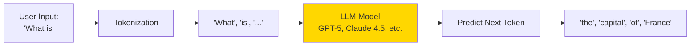
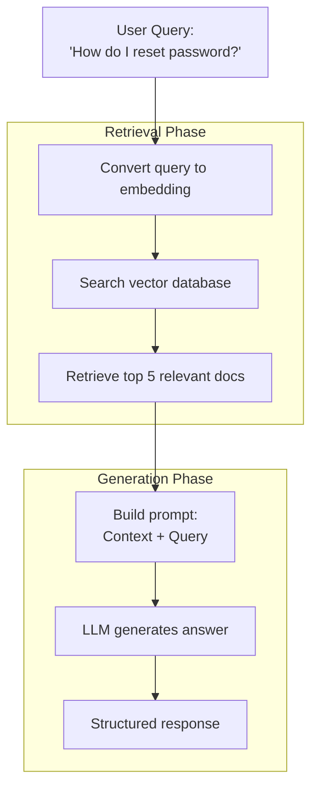
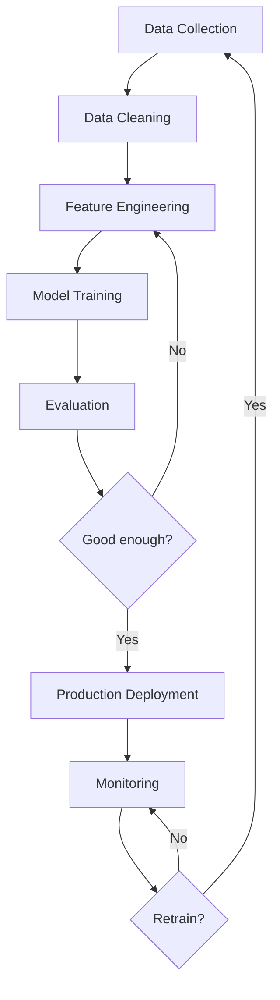
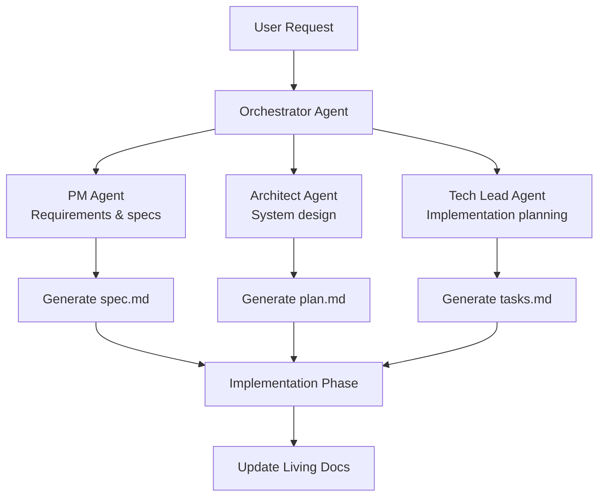

# ML/AI Integration Fundamentals

## Table of Contents

1. [Introduction](#introduction)
2. [Understanding LLMs](#understanding-llms)
3. [AI Integration Patterns](#ai-integration-patterns)
4. [RAG Architecture](#rag-architecture)
5. [Prompt Engineering](#prompt-engineering)
6. [Model Selection](#model-selection)
7. [Training vs Inference](#training-vs-inference)
8. [ML Pipelines](#ml-pipelines)
9. [Vector Databases](#vector-databases)
10. [AI Agents & Autonomous Systems](#ai-agents--autonomous-systems)
11. [Cost Optimization](#cost-optimization)
12. [Production Best Practices](#production-best-practices)
13. [How SpecWeave Fits In](#how-specweave-fits-in)
14. [Common Pitfalls](#common-pitfalls)
15. [Next Steps](#next-steps)

## Introduction

Artificial Intelligence and Machine Learning have transformed from research curiosities to essential tools powering modern applications. From ChatGPT's conversational abilities to GitHub Copilot's code generation, AI is fundamentally changing how we build software.

This guide teaches you:
- How Large Language Models (LLMs) work and when to use them
- AI integration patterns: APIs, embeddings, and fine-tuning
- Retrieval-Augmented Generation (RAG) architecture
- Prompt engineering techniques for better AI outputs
- Model selection: choosing the right model for your use case
- Building production-ready ML pipelines
- Vector databases and semantic search
- AI agents and autonomous code generation (like SpecWeave!)
- Cost optimization strategies

## Understanding LLMs

**Large Language Models (LLMs)** are neural networks trained on massive text datasets to predict the next word in a sequence.

### How LLMs Work (Simplified)



**Key Concepts:**

1. **Tokens**: Words or subwords (1 token ≈ 0.75 words)
   - "Hello world" = 2 tokens
   - "Artificial Intelligence" = 3 tokens

2. **Context Window**: Maximum input length
   - GPT-5: 128K tokens (~96K words)
   - Claude Sonnet 4.5: 200K tokens (~150K words)
   - Claude Haiku 4.5: 200K tokens (ultra-fast, simple tasks)

3. **Temperature**: Randomness of output
   - 0.0 = Deterministic (same output every time)
   - 1.0 = Creative (varied outputs)

### LLM Capabilities

**What LLMs Can Do:**
- ✅ Text generation (articles, code, emails)
- ✅ Question answering (based on training data)
- ✅ Text summarization
- ✅ Language translation
- ✅ Code generation and debugging
- ✅ Classification (sentiment analysis, categorization)
- ✅ Extraction (entities, relationships)

**What LLMs Cannot Do:**
- ❌ Access real-time data (unless via API calls)
- ❌ Browse the internet (without plugins/tools)
- ❌ Perform precise calculations (use tools for math)
- ❌ Access private data (unless provided in context)
- ❌ Guarantee factual accuracy (can hallucinate)

## AI Integration Patterns

### Pattern 1: Direct API Calls

**Simplest approach**: Call LLM API directly

```javascript
// Using OpenAI API
import OpenAI from 'openai';

const openai = new OpenAI({
  apiKey: process.env.OPENAI_API_KEY
});

async function generateProductDescription(product) {
  const response = await openai.chat.completions.create({
    model: 'gpt-5',
    messages: [
      {
        role: 'system',
        content: 'You are a marketing expert creating product descriptions.'
      },
      {
        role: 'user',
        content: `Create a compelling description for: ${product.name}`
      }
    ],
    temperature: 0.7,
    max_tokens: 200
  });

  return response.choices[0].message.content;
}

// Usage
const description = await generateProductDescription({
  name: 'Wireless Headphones',
  features: ['Noise canceling', '30-hour battery', 'Bluetooth 5.0']
});
```

**Using Anthropic Claude:**
```javascript
import Anthropic from '@anthropic-ai/sdk';

const anthropic = new Anthropic({
  apiKey: process.env.ANTHROPIC_API_KEY
});

async function analyzeCodeQuality(code) {
  const response = await anthropic.messages.create({
    model: 'claude-sonnet-4-5',
    max_tokens: 1024,
    messages: [
      {
        role: 'user',
        content: `Analyze this code for quality and suggest improvements:\n\n${code}`
      }
    ]
  });

  return response.content[0].text;
}
```

### Pattern 2: Embeddings & Semantic Search

**Embeddings**: Convert text to vectors (numerical representations)

```javascript
// Generate embeddings
async function getEmbedding(text) {
  const response = await openai.embeddings.create({
    model: 'text-embedding-3-small',
    input: text
  });

  return response.data[0].embedding; // Array of 1536 numbers
}

// Calculate similarity
function cosineSimilarity(vec1, vec2) {
  const dotProduct = vec1.reduce((sum, val, i) => sum + val * vec2[i], 0);
  const mag1 = Math.sqrt(vec1.reduce((sum, val) => sum + val * val, 0));
  const mag2 = Math.sqrt(vec2.reduce((sum, val) => sum + val * val, 0));
  return dotProduct / (mag1 * mag2);
}

// Find similar documents
async function findSimilarDocs(query, documents) {
  const queryEmbedding = await getEmbedding(query);

  const results = await Promise.all(
    documents.map(async (doc) => {
      const docEmbedding = await getEmbedding(doc.text);
      const similarity = cosineSimilarity(queryEmbedding, docEmbedding);
      return { doc, similarity };
    })
  );

  return results
    .sort((a, b) => b.similarity - a.similarity)
    .slice(0, 5); // Top 5 results
}
```

### Pattern 3: Function Calling (Tool Use)

**LLMs can call functions to access external data:**

```javascript
const tools = [
  {
    type: 'function',
    function: {
      name: 'get_weather',
      description: 'Get current weather for a location',
      parameters: {
        type: 'object',
        properties: {
          location: {
            type: 'string',
            description: 'City name, e.g. San Francisco'
          },
          unit: {
            type: 'string',
            enum: ['celsius', 'fahrenheit']
          }
        },
        required: ['location']
      }
    }
  }
];

async function chatWithTools(userMessage) {
  const response = await openai.chat.completions.create({
    model: 'gpt-5',
    messages: [{ role: 'user', content: userMessage }],
    tools: tools,
    tool_choice: 'auto'
  });

  const message = response.choices[0].message;

  // Check if LLM wants to call a function
  if (message.tool_calls) {
    const toolCall = message.tool_calls[0];
    const functionName = toolCall.function.name;
    const args = JSON.parse(toolCall.function.arguments);

    // Execute function
    let result;
    if (functionName === 'get_weather') {
      result = await getWeather(args.location, args.unit);
    }

    // Send function result back to LLM
    const finalResponse = await openai.chat.completions.create({
      model: 'gpt-5',
      messages: [
        { role: 'user', content: userMessage },
        message, // Original assistant message with tool call
        {
          role: 'tool',
          tool_call_id: toolCall.id,
          content: JSON.stringify(result)
        }
      ]
    });

    return finalResponse.choices[0].message.content;
  }

  return message.content;
}

// Usage
const response = await chatWithTools("What's the weather in London?");
// LLM calls get_weather('London'), then generates natural response
```

## RAG Architecture

**Retrieval-Augmented Generation (RAG)** combines information retrieval with LLM generation.

### Why RAG?

**Problem**: LLMs don't know about your private data
- Company documentation
- Customer support tickets
- Internal knowledge bases

**Solution**: Retrieve relevant context, then ask LLM to answer

### RAG Flow



### RAG Implementation

```javascript
import { Pinecone } from '@pinecone-database/pinecone';
import OpenAI from 'openai';

const pinecone = new Pinecone({ apiKey: process.env.PINECONE_API_KEY });
const openai = new OpenAI({ apiKey: process.env.OPENAI_API_KEY });

// 1. Index documents (one-time setup)
async function indexDocuments(documents) {
  const index = pinecone.index('knowledge-base');

  for (const doc of documents) {
    // Generate embedding
    const embedding = await openai.embeddings.create({
      model: 'text-embedding-3-small',
      input: doc.text
    });

    // Store in Pinecone
    await index.upsert([
      {
        id: doc.id,
        values: embedding.data[0].embedding,
        metadata: { text: doc.text, title: doc.title }
      }
    ]);
  }
}

// 2. RAG query
async function answerQuestion(question) {
  const index = pinecone.index('knowledge-base');

  // Step 1: Retrieve relevant documents
  const queryEmbedding = await openai.embeddings.create({
    model: 'text-embedding-3-small',
    input: question
  });

  const searchResults = await index.query({
    vector: queryEmbedding.data[0].embedding,
    topK: 5,
    includeMetadata: true
  });

  // Step 2: Build context from retrieved docs
  const context = searchResults.matches
    .map(match => match.metadata.text)
    .join('\n\n');

  // Step 3: Generate answer using context
  const response = await openai.chat.completions.create({
    model: 'gpt-5',
    messages: [
      {
        role: 'system',
        content: 'Answer questions based on the provided context. If the answer is not in the context, say so.'
      },
      {
        role: 'user',
        content: `Context:\n${context}\n\nQuestion: ${question}`
      }
    ]
  });

  return {
    answer: response.choices[0].message.content,
    sources: searchResults.matches.map(m => ({
      title: m.metadata.title,
      similarity: m.score
    }))
  };
}

// Usage
const result = await answerQuestion('How do I reset my password?');
console.log(result.answer);
console.log('Sources:', result.sources);
```

### RAG Best Practices

**1. Chunk documents strategically:**
```javascript
function chunkDocument(text, maxTokens = 500) {
  const paragraphs = text.split('\n\n');
  const chunks = [];
  let currentChunk = '';

  for (const paragraph of paragraphs) {
    const tokens = countTokens(currentChunk + paragraph);

    if (tokens > maxTokens) {
      chunks.push(currentChunk.trim());
      currentChunk = paragraph;
    } else {
      currentChunk += '\n\n' + paragraph;
    }
  }

  if (currentChunk) chunks.push(currentChunk.trim());
  return chunks;
}
```

**2. Add metadata for filtering:**
```javascript
await index.upsert([
  {
    id: doc.id,
    values: embedding,
    metadata: {
      text: doc.text,
      title: doc.title,
      category: 'support', // Filter by category
      dateCreated: '2025-01-15',
      language: 'en'
    }
  }
]);

// Query with filters
const results = await index.query({
  vector: queryEmbedding,
  topK: 5,
  filter: {
    category: { $eq: 'support' },
    language: { $eq: 'en' }
  }
});
```

**3. Hybrid search (keywords + semantic):**
```javascript
// Combine traditional search with vector search
const keywordResults = await elasticsearchClient.search({
  index: 'docs',
  body: {
    query: { match: { text: question } }
  }
});

const vectorResults = await pinecone.query({
  vector: queryEmbedding,
  topK: 5
});

// Merge and re-rank results
const combinedResults = mergeAndRerank(keywordResults, vectorResults);
```

## Prompt Engineering

**Prompt engineering** is the art of crafting effective instructions for LLMs.

### Principles

**1. Be Specific:**
```javascript
// ❌ Vague
const prompt = 'Write a function';

// ✅ Specific
const prompt = `Write a JavaScript function that:
1. Takes an array of numbers
2. Filters out negative numbers
3. Returns the sum of remaining numbers
4. Includes JSDoc comments`;
```

**2. Provide Examples (Few-Shot Learning):**
```javascript
const prompt = `Extract product names and prices from receipts.

Examples:
Input: "MacBook Pro - $1,999.00"
Output: { product: "MacBook Pro", price: 1999.00 }

Input: "iPhone 15 Pro (256GB) $999.99"
Output: { product: "iPhone 15 Pro", price: 999.99 }

Now extract from: "${receiptText}"`;
```

**3. Use System Prompts:**
```javascript
const messages = [
  {
    role: 'system',
    content: 'You are a senior software architect. Provide detailed, production-ready code with error handling and tests.'
  },
  {
    role: 'user',
    content: 'Build a REST API for user authentication'
  }
];
```

**4. Constrain Output Format:**
```javascript
const prompt = `Analyze the sentiment of this review: "${review}"

Respond in JSON format:
{
  "sentiment": "positive" | "neutral" | "negative",
  "confidence": 0.0 to 1.0,
  "keywords": ["word1", "word2"]
}`;
```

### Advanced Techniques

**Chain of Thought (CoT):**
```javascript
const prompt = `Solve this problem step by step:

Problem: A store has 15 apples. They sell 40% of them. How many apples remain?

Let's think step by step:
1. Calculate 40% of 15: 0.40 × 15 = 6 apples sold
2. Subtract from total: 15 - 6 = 9 apples remain
Answer: 9 apples

Now solve this problem step by step:
Problem: ${userProblem}`;
```

**Self-Consistency:**
```javascript
// Generate multiple answers, pick most common
async function selfConsistentAnswer(question) {
  const answers = await Promise.all(
    Array(5).fill(null).map(() =>
      openai.chat.completions.create({
        model: 'gpt-5',
        messages: [{ role: 'user', content: question }],
        temperature: 0.8 // Higher temperature for variety
      })
    )
  );

  const results = answers.map(r => r.choices[0].message.content);
  return mostCommonAnswer(results); // Voting mechanism
}
```

## Model Selection

### Model Comparison

| Model | Provider | Context | Strengths | Cost (per 1M tokens) |
|-------|----------|---------|-----------|---------------------|
| **Claude Sonnet 4.5** | Anthropic | 200K | Best coding, long context, research | $3 in / $15 out |
| **GPT-5** | OpenAI | 128K | General purpose, reasoning, creative | $10 in / $30 out |
| **Claude Haiku 4.5** | Anthropic | 200K | Ultra-fast, cheap, simple tasks | $0.25 in / $1.25 out |
| **o1** | OpenAI | 128K | Complex reasoning, math, science | $15 in / $60 out |
| **Llama 3.1 405B** | Meta | 128K | Open source, self-hosted | Free (compute costs) |

### When to Use Each Model

**Claude Sonnet 4.5**: Best for coding, long documents, technical writing, research
**GPT-5**: Complex reasoning, creative content, general-purpose tasks
**Claude Haiku 4.5**: Real-time chat, simple classifications, high-volume processing
**o1**: Advanced reasoning tasks, mathematical proofs, scientific analysis
**Llama 3.1**: Privacy-sensitive data, no API costs, offline usage, customization

### Model Selection Strategy

```javascript
function selectModel(taskType, contextLength, budget) {
  // Ultra-cheap tasks
  if (budget === 'low' && taskType === 'simple') {
    return 'claude-haiku-4-5'; // Ultra-fast and cheap
  }

  // Long context
  if (contextLength > 100000) {
    return 'claude-sonnet-4-5'; // 200K context
  }

  // Complex reasoning
  if (taskType === 'complex' || taskType === 'reasoning') {
    return 'o1'; // Best for complex reasoning
  }

  // Creative tasks
  if (taskType === 'creative') {
    return 'gpt-5';
  }

  // Coding tasks
  if (taskType === 'code') {
    return 'claude-sonnet-4-5'; // Best for code
  }

  // Default
  return 'claude-sonnet-4-5';
}
```

## Training vs Inference

### Inference (Most Common)

**Using pre-trained models via API:**

```javascript
// No training required - just call API
const response = await openai.chat.completions.create({
  model: 'gpt-5',
  messages: [{ role: 'user', content: 'Explain quantum computing' }]
});
```

**Pros:**
- ✅ No training data required
- ✅ No GPU infrastructure needed
- ✅ Instant availability
- ✅ Always up-to-date models

**Cons:**
- ❌ Recurring API costs
- ❌ Rate limits
- ❌ No control over model behavior

### Fine-Tuning

**Training a model on custom data:**

```javascript
// 1. Prepare training data
const trainingData = [
  {
    messages: [
      { role: 'system', content: 'You are a customer support bot for TechCorp.' },
      { role: 'user', content: 'How do I reset my password?' },
      { role: 'assistant', content: 'To reset your password:\n1. Visit techcorp.com/reset\n2. Enter your email\n3. Check your email for reset link' }
    ]
  },
  // ... hundreds more examples
];

// 2. Create fine-tuning job
const fineTune = await openai.fineTuning.jobs.create({
  training_file: trainingFileId,
  model: 'gpt-3.5-turbo',
  hyperparameters: {
    n_epochs: 3
  }
});

// 3. Use fine-tuned model
const response = await openai.chat.completions.create({
  model: fineTune.fine_tuned_model,
  messages: [{ role: 'user', content: 'Reset password help' }]
});
```

**When to Fine-Tune:**
- ✅ Specific domain language (medical, legal)
- ✅ Consistent tone/style
- ✅ High volume (cost savings)
- ✅ Specialized task (classification, extraction)

**When NOT to Fine-Tune:**
- ❌ Small datasets (&lt;100 examples)
- ❌ Rapidly changing requirements
- ❌ General-purpose tasks (prompt engineering is enough)

### Self-Hosting (Advanced)

**Run open-source models on your infrastructure:**

```python
# Using Hugging Face Transformers
from transformers import AutoTokenizer, AutoModelForCausalLM

tokenizer = AutoTokenizer.from_pretrained("meta-llama/Llama-2-7b-hf")
model = AutoModelForCausalLM.from_pretrained("meta-llama/Llama-2-7b-hf")

inputs = tokenizer("Explain machine learning", return_tensors="pt")
outputs = model.generate(**inputs, max_length=200)
print(tokenizer.decode(outputs[0]))
```

**Pros:**
- ✅ No API costs
- ✅ Full control
- ✅ Data privacy
- ✅ No rate limits

**Cons:**
- ❌ Requires GPU infrastructure ($$$)
- ❌ Model management overhead
- ❌ Slower than API (unless massive scale)

## ML Pipelines

### Typical ML Pipeline



### Example: Text Classification Pipeline

```javascript
// 1. Data preparation
async function prepareTrainingData() {
  const rawData = await db.supportTickets.findMany();

  const trainingData = rawData.map(ticket => ({
    text: ticket.message,
    label: ticket.category // 'billing', 'technical', 'sales'
  }));

  // Split into train/test
  const trainSize = Math.floor(trainingData.length * 0.8);
  const trainData = trainingData.slice(0, trainSize);
  const testData = trainingData.slice(trainSize);

  return { trainData, testData };
}

// 2. Training (fine-tuning GPT-3.5)
async function trainClassifier(trainData) {
  const formattedData = trainData.map(item => ({
    messages: [
      { role: 'system', content: 'Classify support tickets into: billing, technical, or sales' },
      { role: 'user', content: item.text },
      { role: 'assistant', content: item.label }
    ]
  }));

  const file = await openai.files.create({
    file: createJSONL(formattedData),
    purpose: 'fine-tune'
  });

  const fineTune = await openai.fineTuning.jobs.create({
    training_file: file.id,
    model: 'gpt-3.5-turbo'
  });

  return fineTune.fine_tuned_model;
}

// 3. Evaluation
async function evaluateModel(modelName, testData) {
  let correct = 0;

  for (const item of testData) {
    const response = await openai.chat.completions.create({
      model: modelName,
      messages: [
        { role: 'system', content: 'Classify support tickets into: billing, technical, or sales' },
        { role: 'user', content: item.text }
      ]
    });

    const prediction = response.choices[0].message.content;
    if (prediction === item.label) correct++;
  }

  const accuracy = correct / testData.length;
  console.log(`Accuracy: ${(accuracy * 100).toFixed(2)}%`);
  return accuracy;
}

// 4. Production deployment
async function classifyTicket(text) {
  const response = await openai.chat.completions.create({
    model: PRODUCTION_MODEL, // Fine-tuned model
    messages: [
      { role: 'system', content: 'Classify support tickets into: billing, technical, or sales' },
      { role: 'user', content: text }
    ]
  });

  return response.choices[0].message.content;
}

// 5. Monitoring & feedback loop
async function logPrediction(text, prediction, wasCorrect) {
  await db.predictions.create({
    data: {
      input: text,
      prediction,
      wasCorrect,
      timestamp: new Date()
    }
  });

  // If accuracy drops below threshold, trigger retraining
  const recentAccuracy = await calculateRecentAccuracy();
  if (recentAccuracy < 0.85) {
    await triggerRetraining();
  }
}
```

## Vector Databases

**Vector databases** store embeddings for fast similarity search.

### Popular Vector Databases

| Database | Type | Strengths |
|----------|------|-----------|
| **Pinecone** | Cloud | Managed, scalable, easy setup |
| **Weaviate** | Self-hosted | Open source, GraphQL API |
| **Chroma** | Embedded | Local development, simple |
| **Qdrant** | Self-hosted | Fast, Rust-based |
| **Milvus** | Self-hosted | Enterprise-scale |

### Vector Database Operations

```javascript
import { ChromaClient } from 'chromadb';

const client = new ChromaClient();

// Create collection
const collection = await client.createCollection({
  name: 'documents',
  metadata: { description: 'Company knowledge base' }
});

// Add documents
await collection.add({
  ids: ['doc1', 'doc2', 'doc3'],
  documents: [
    'How to reset password...',
    'Billing FAQ...',
    'Technical support guide...'
  ],
  metadatas: [
    { category: 'auth', date: '2025-01-15' },
    { category: 'billing', date: '2025-01-20' },
    { category: 'technical', date: '2025-02-01' }
  ]
});

// Query (semantic search)
const results = await collection.query({
  queryTexts: ['password reset help'],
  nResults: 3,
  where: { category: 'auth' } // Filter by metadata
});

console.log(results.documents); // Relevant docs
console.log(results.distances); // Similarity scores
```

## AI Agents & Autonomous Systems

**AI agents** use LLMs to make decisions and take actions autonomously.

### How SpecWeave Uses AI Agents

SpecWeave demonstrates production AI agent architecture:



### Agent Implementation Pattern

```javascript
class BaseAgent {
  constructor(llmClient, role, expertise) {
    this.llm = llmClient;
    this.role = role;
    this.expertise = expertise;
  }

  async execute(task) {
    const systemPrompt = this.buildSystemPrompt();
    const userPrompt = this.buildUserPrompt(task);

    const response = await this.llm.chat.completions.create({
      model: 'claude-sonnet-4-5',
      messages: [
        { role: 'system', content: systemPrompt },
        { role: 'user', content: userPrompt }
      ]
    });

    return this.parseResponse(response.choices[0].message.content);
  }

  buildSystemPrompt() {
    return `You are a ${this.role} with expertise in ${this.expertise}.
    Your responsibilities:
    ${this.getResponsibilities().join('\n')}

    Guidelines:
    ${this.getGuidelines().join('\n')}`;
  }

  abstract getResponsibilities();
  abstract getGuidelines();
  abstract buildUserPrompt(task);
  abstract parseResponse(response);
}

// Concrete agent
class PMAgent extends BaseAgent {
  constructor(llmClient) {
    super(llmClient, 'Product Manager', 'user needs, requirements analysis');
  }

  getResponsibilities() {
    return [
      '- Understand user needs and business goals',
      '- Define clear acceptance criteria',
      '- Prioritize features based on value',
      '- Ensure specifications are testable'
    ];
  }

  buildUserPrompt(task) {
    return `Create a specification for: ${task.description}

    User Story Format:
    As a [user type], I want [feature] so that [benefit]

    Include:
    1. User stories with acceptance criteria
    2. Functional requirements
    3. Non-functional requirements (performance, security)
    4. Success metrics`;
  }

  parseResponse(response) {
    // Extract structured spec from LLM response
    return {
      userStories: this.extractUserStories(response),
      acceptanceCriteria: this.extractAC(response),
      requirements: this.extractRequirements(response)
    };
  }
}

// Multi-agent orchestration
class IncrementPlanner {
  constructor(pmAgent, architectAgent, techLeadAgent) {
    this.pmAgent = pmAgent;
    this.architectAgent = architectAgent;
    this.techLeadAgent = techLeadAgent;
  }

  async planIncrement(userRequest) {
    // Phase 1: PM creates spec
    const spec = await this.pmAgent.execute({
      description: userRequest
    });

    // Phase 2: Architect creates plan (uses spec as input)
    const plan = await this.architectAgent.execute({
      spec: spec,
      constraints: this.getArchitecturalConstraints()
    });

    // Phase 3: Tech Lead creates tasks (uses spec + plan)
    const tasks = await this.techLeadAgent.execute({
      spec: spec,
      plan: plan,
      testStrategy: this.getTestStrategy()
    });

    return { spec, plan, tasks };
  }
}
```

## Cost Optimization

### Token Usage Patterns

```javascript
// Expensive: Including entire codebase in context
const prompt = `Here's my entire 50,000-line codebase:\n${entireCodebase}\n\nAdd a login feature`;
// Cost: ~$5 per request (50K tokens input)

// Optimized: Relevant context only
const relevantFiles = extractRelevantFiles(codebase, 'login');
const prompt = `Relevant files:\n${relevantFiles}\n\nAdd a login feature`;
// Cost: ~$0.10 per request (1K tokens input)
```

### Caching Strategies

```javascript
// Cache embeddings (don't regenerate on every query)
async function getCachedEmbedding(text) {
  const cacheKey = `embedding:${hash(text)}`;
  let embedding = await redis.get(cacheKey);

  if (!embedding) {
    embedding = await openai.embeddings.create({
      model: 'text-embedding-3-small',
      input: text
    });
    await redis.set(cacheKey, JSON.stringify(embedding), 'EX', 86400); // 24h
  }

  return embedding;
}

// Cache LLM responses for identical queries
async function getCachedCompletion(prompt) {
  const cacheKey = `completion:${hash(prompt)}`;
  let response = await redis.get(cacheKey);

  if (!response) {
    response = await openai.chat.completions.create({
      model: 'gpt-4',
      messages: [{ role: 'user', content: prompt }]
    });
    await redis.set(cacheKey, JSON.stringify(response), 'EX', 3600); // 1h
  }

  return response;
}
```

### Model Cascading

```javascript
// Try cheap model first, fallback to expensive if needed
async function generateWithCascade(prompt) {
  // Try Haiku 4.5 first (cheap and fast)
  const cheapResponse = await anthropic.messages.create({
    model: 'claude-haiku-4-5',
    messages: [{ role: 'user', content: prompt }]
  });

  // Check quality
  const quality = await assessQuality(cheapResponse);

  if (quality > 0.8) {
    return cheapResponse; // Good enough!
  }

  // Fallback to Sonnet 4.5 (more capable)
  return await anthropic.messages.create({
    model: 'claude-sonnet-4-5',
    messages: [{ role: 'user', content: prompt }]
  });
}
```

## Production Best Practices

### Error Handling

```javascript
async function robustLLMCall(prompt, maxRetries = 3) {
  for (let i = 0; i < maxRetries; i++) {
    try {
      return await openai.chat.completions.create({
        model: 'gpt-5',
        messages: [{ role: 'user', content: prompt }],
        timeout: 30000 // 30 seconds
      });
    } catch (error) {
      if (error.code === 'rate_limit_exceeded') {
        await sleep(2000 * (i + 1)); // Exponential backoff
        continue;
      }

      if (error.code === 'context_length_exceeded') {
        prompt = truncatePrompt(prompt, 0.8); // Reduce by 20%
        continue;
      }

      throw error; // Unrecoverable error
    }
  }

  throw new Error('Max retries exceeded');
}
```

### Monitoring

```javascript
// Track token usage
function trackUsage(response, context) {
  await db.llmUsage.create({
    data: {
      model: response.model,
      promptTokens: response.usage.prompt_tokens,
      completionTokens: response.usage.completion_tokens,
      totalTokens: response.usage.total_tokens,
      cost: calculateCost(response.usage, response.model),
      context: context, // e.g., 'user-chat', 'code-generation'
      timestamp: new Date()
    }
  });
}

// Monitor quality
function trackQuality(input, output, userFeedback) {
  await db.llmQuality.create({
    data: {
      input,
      output,
      userRating: userFeedback.rating, // 1-5
      wasHelpful: userFeedback.helpful,
      issueReported: userFeedback.issue || null
    }
  });
}
```

### Rate Limiting

```javascript
import Bottleneck from 'bottleneck';

// Limit: 500 requests per minute
const limiter = new Bottleneck({
  minTime: 120, // 120ms between requests
  maxConcurrent: 10 // Max 10 parallel requests
});

const rateLimitedCompletion = limiter.wrap(async (prompt) => {
  return await openai.chat.completions.create({
    model: 'gpt-5',
    messages: [{ role: 'user', content: prompt }]
  });
});
```

## How SpecWeave Fits In

### AI-Powered Development Workflow

SpecWeave uses AI throughout the development lifecycle:

**1. Requirements → Specifications (PM Agent)**
```bash
User: "Build user authentication with OAuth"
PM Agent: Generates spec.md with user stories, AC, success criteria
```

**2. Specifications → Architecture (Architect Agent)**
```bash
Architect Agent: Reviews spec, generates plan.md with system design, database schema, API contracts
```

**3. Architecture → Implementation Plan (Tech Lead Agent)**
```bash
Tech Lead Agent: Creates tasks.md with embedded BDD tests, coverage targets
```

**4. Implementation → Code (Developer + AI)**
```bash
Developer: Implements tasks, AI assists with code generation
```

**5. Code → Living Docs (Documentation Agent)**
```bash
Hooks: Auto-update architecture docs, ADRs, API contracts after task completion
```

### AI Integration Documentation

SpecWeave increments document AI usage:

```markdown
# .specweave/increments/0042-ai-code-review/spec.md

## US1: Automated Code Review

**Acceptance Criteria**:
- AC-US1-01: AI analyzes pull requests for code quality
- AC-US1-02: AI suggests improvements (security, performance, style)
- AC-US1-03: AI provides explanations for suggestions

**AI Integration**:
- Model: Claude Sonnet 4.5 (200K context for large PRs)
- Prompt: "Analyze this code for quality issues..."
- Fallback: GPT-5 if Claude unavailable
- Cost estimate: $0.50 per PR review
- Caching: Cache identical file reviews for 24h

**Test Plan**:
- Given PR with security vulnerability → When AI reviews → Then flag vulnerability
- Given PR with performance issue → When AI reviews → Then suggest optimization
```

## Common Pitfalls

### 1. Not Handling Hallucinations

❌ **Wrong**: Trust LLM output blindly
```javascript
const code = await generateCode(prompt);
deployToProduction(code); // Dangerous!
```

✅ **Correct**: Validate output
```javascript
const code = await generateCode(prompt);
await runTests(code); // Verify correctness
await securityScan(code); // Check for vulnerabilities
if (allChecksPassed) {
  deployToProduction(code);
}
```

### 2. Exceeding Context Limits

❌ **Wrong**: Send entire database
```javascript
const data = await db.findAll(); // 1M records
const prompt = `Analyze this data: ${JSON.stringify(data)}`;
// Error: Context length exceeded
```

✅ **Correct**: Sample or chunk data
```javascript
const sample = await db.findMany({ take: 100 });
const prompt = `Analyze this sample: ${JSON.stringify(sample)}`;
```

### 3. Ignoring Costs

❌ **Wrong**: No cost tracking
```javascript
// Called 1000x/day with 50K token context
await openai.chat.completions.create({ /* large prompt */ });
// Cost: $500/day = $15K/month!
```

✅ **Correct**: Optimize context
```javascript
const relevantContext = extractRelevant(largeContext);
await openai.chat.completions.create({ /* small prompt */ });
// Cost: $50/day = $1.5K/month
```

## Next Steps

**Deepen Your Knowledge:**
- Backend Fundamentals - Build APIs for AI integration
- Frontend Fundamentals - Create UIs for AI features
- Testing Fundamentals - Test AI systems effectively

**Hands-On Practice:**
1. Build RAG system for your docs
2. Fine-tune a model for classification
3. Create an AI agent for task automation
4. Implement semantic search with vector DB
5. Optimize token usage and costs

**SpecWeave Integration:**
- Create AI increment: `/specweave:increment "ai-code-review"`
- Document model selection in ADRs
- Track AI costs in increment reports
- Use BDD tests for AI behavior validation

**Further Reading:**
- [OpenAI Documentation](https://platform.openai.com/docs)
- [Anthropic Claude Documentation](https://docs.anthropic.com/)
- [LangChain](https://langchain.com/) - AI application framework
- [Pinecone Vector Database](https://www.pinecone.io/)
- [Prompt Engineering Guide](https://www.promptingguide.ai/)
