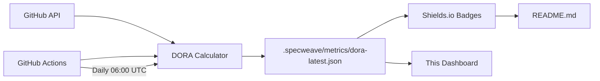

# 📊 DORA Metrics Dashboard

Real-time DevOps performance metrics for SpecWeave, updated daily.

  

## Current Performance

### 🚀 Deployment Frequency

  
  
    
  

**What it measures:** How often we deploy to production
**Industry benchmarks:**
- 🏆 **Elite**: Multiple deploys per day (>365/year)
- ⭐ **High**: Weekly to daily (52-365/year)
- 📊 **Medium**: Monthly to weekly (12-52/year)
- ⚠️ **Low**: Less than monthly (&lt;12/year)

---

### ⚡ Lead Time for Changes

  
  
    
  

**What it measures:** Time from commit to production
**Industry benchmarks:**
- 🏆 **Elite**: Less than 1 hour
- ⭐ **High**: 1 hour to 1 week
- 📊 **Medium**: 1 week to 1 month
- ⚠️ **Low**: More than 1 month

**Percentiles:**
- **P50 (Median)**: 
- **P90**: 

---

### ✅ Change Failure Rate

  
  
    
  

**What it measures:** Percentage of deployments that fail
**Industry benchmarks:**
- 🏆 **Elite**: 0-15%
- ⭐ **High**: 15-30%
- 📊 **Medium**: 30-45%
- ⚠️ **Low**: More than 45%

**Failed Releases:**  / 

---

### 🔧 Mean Time to Recovery (MTTR)

  
  
    
  

**What it measures:** Time to recover from production incidents
**Industry benchmarks:**
- 🏆 **Elite**: Less than 1 hour
- ⭐ **High**: 1 hour to 1 day
- 📊 **Medium**: 1 day to 1 week
- ⚠️ **Low**: More than 1 week

**Percentiles:**
- **P50 (Median)**: 
- **P90**: 

---

## 📈 How It Works

### Architecture

### Data Sources

All metrics are calculated from GitHub data:

1. **Deployment Frequency**: Counts GitHub Releases
2. **Lead Time**: Measures commit → release time
3. **Change Failure Rate**: Tracks issues labeled `incident` or `production-bug`
4. **MTTR**: Measures incident creation → closure time

### Zero Infrastructure

- **Cost**: $0/month (GitHub API free tier)
- **Database**: None (GitHub is our database)
- **Server**: None (GitHub Actions)
- **Rate Limits**: 5000 API calls/hour (we use ~20/day)

---

## 🔄 Automation

Metrics update automatically:

- **Schedule**: Daily at 06:00 UTC
- **Workflow**: [`.github/workflows/dora-metrics.yml`](https://github.com/anton-abyzov/specweave/blob/develop/.github/workflows/dora-metrics.yml)
- **Manual Trigger**: `gh workflow run dora-metrics.yml`

**Latest Update**: 

---

## 📚 Learn More

### DORA Research

The DORA (DevOps Research and Assessment) metrics are industry-standard KPIs for software delivery performance, backed by 6+ years of research.

**Resources:**
- [State of DevOps Report](https://cloud.google.com/devops/state-of-devops)
- [Accelerate Book](https://itrevolution.com/book/accelerate/)
- [Google Cloud DORA](https://cloud.google.com/blog/products/devops-sre/using-the-four-keys-to-measure-your-devops-performance)

### Implementation

**Code**: [`src/metrics/`](https://github.com/anton-abyzov/specweave/tree/develop/src/metrics)
**Increment**: [`.specweave/increments/0010-dora-metrics-mvp/`](https://github.com/anton-abyzov/specweave/tree/develop/.specweave/increments/0010-dora-metrics-mvp)
**Architecture Decision**: [Why No Database](https://github.com/anton-abyzov/specweave/blob/develop/.specweave/increments/0010-dora-metrics-mvp/reports/ARCHITECTURE-DECISION.md)

---

## 🎯 Continuous Improvement

Track our progress over time as we optimize SpecWeave's delivery performance:

**Current Goals:**
- 🚀 Deployment Frequency: Elite achieved (100/month) — maintain
- ⚡ Lead Time: High (3.4h) → Elite (&lt;1h)
- ✅ Change Failure Rate: Elite (0%) — maintain
- 🔧 MTTR: N/A (no incidents yet) — target &lt;1 hour when applicable
