# Brownfield Workflow: Working with Existing Code

[Brownfield](/docs/glossary/terms/brownfield) projects are the **ultimate challenge** in software development—existing code with missing or outdated documentation. SpecWeave makes [brownfield](/docs/glossary/terms/brownfield) work **safe and systematic**.

## The Brownfield Challenge

```mermaid
graph TB
    A[Existing Codebase] --> B{Documentation?}
    B -->|None| C[❌ Tribal Knowledge]
    B -->|Outdated| D[❌ Misleading Info]
    B -->|Scattered| E[❌ Hard to Find]

    C --> F[😰 High Risk]
    D --> F
    E --> F

    style F fill:#ffcccc
```



**Common problems:**
- ❌ No documentation (or years outdated)
- ❌ Tribal knowledge (original developers gone)
- ❌ Fear of breaking production
- ❌ Scattered docs (Confluence, wikis, old READMEs)
- ❌ Unknown architecture decisions
- ❌ No tests (or inadequate coverage)

**SpecWeave solves ALL of these.**

## The SpecWeave Brownfield Approach


**Key principles:**
1. **Document BEFORE modifying** (safety first)
2. **Create baseline tests** (capture current behavior)
3. **Retroactive architecture** (understand before changing)
4. **Merge existing docs** (consolidate knowledge)
5. **Living documentation** (keep current forever)

## Complete Workflow

### Phase 1: Initial Setup

```bash
# Initialize SpecWeave in existing project
cd my-existing-project
npx specweave init .
```

**What it creates:**
```
my-existing-project/
├── .specweave/
│   ├── increments/         # Future work tracked here
│   ├── docs/
│   │   ├── internal/       # Engineering docs
│   │   └── public/         # User-facing docs
│   └── logs/
├── .claude/                # Claude Code integration
└── [your existing code]    # Untouched!
```

### Phase 2: Merge Existing Documentation

**Problem**: You already have docs scattered everywhere:

```
Documentation scattered across:
├── Confluence pages (wiki.company.com)
├── Old READMEs (outdated)
├── Google Docs (shared with team)
├── CLAUDE.md backup (previous AI work)
├── Architecture diagrams (Lucidchart, Miro)
└── Tribal knowledge (people's heads)
```

**Solution**: Intelligent document consolidation

```bash
# Use brownfield-onboarder skill
"Merge existing documentation from docs/ folder and Confluence export"
```

**What it does:**


**Example input:**
```
docs/
├── architecture.md         (system overview)
├── database-schema.png     (ER diagram)
├── api-endpoints.md        (REST API list)
├── deployment-guide.md     (how to deploy)
└── troubleshooting.md      (common issues)

confluence-export/
├── Product Requirements.html
├── Tech Stack Decisions.html
└── Runbook - Production.html
```

**Example output:**
```
.specweave/docs/internal/
├── strategy/
│   └── product-requirements.md      ← From Confluence
├── architecture/
│   ├── system-overview.md           ← From docs/architecture.md
│   ├── api-endpoints.md             ← From docs/
│   ├── diagrams/
│   │   └── database-schema.png      ← Preserved
│   └── [ADR](/docs/glossary/terms/adr)/
│       └── 0001-tech-stack.md       ← From Confluence
├── delivery/
│   └── deployment-guide.md          ← From docs/
└── operations/
    ├── runbook-production.md        ← From Confluence
    └── troubleshooting.md           ← From docs/
```

**Benefits:**
- ✅ All knowledge in one place
- ✅ Organized by purpose (strategy, architecture, operations)
- ✅ No duplication
- ✅ Searchable and version controlled

### Phase 3: Document Existing Modules

**Before modifying ANY code**, document what exists:

```bash
# Analyze authentication module
"Analyze authentication module and create complete architecture documentation"
```

**What SpecWeave creates:**


**Generated documentation:**

#### 1. High-Level Design (HLD)

`.specweave/docs/internal/architecture/hld-authentication.md`:

```markdown
# Authentication System - High-Level Design

## Overview
JWT-based authentication with bcrypt password hashing, session management, and OAuth2 integration (Google, GitHub).

## Components

### AuthService
**Location**: `src/services/auth/AuthService.ts`
**Purpose**: Core authentication logic
**Methods**:
- `login(email, password)`: Authenticate user
- `register(email, password, name)`: Create new user
- `refreshToken(token)`: Refresh JWT
- `logout(token)`: Invalidate session

### JWTManager
**Location**: `src/utils/jwt.ts`
**Purpose**: JWT generation and validation
**Methods**:
- `generate(payload)`: Create JWT token
- `verify(token)`: Validate token
- `decode(token)`: Extract payload

### PasswordHasher
**Location**: `src/utils/password.ts`
**Purpose**: Password hashing and comparison
**Methods**:
- `hash(password)`: Hash password with bcrypt
- `compare(password, hash)`: Verify password

### OAuthManager
**Location**: `src/services/auth/OAuthManager.ts`
**Purpose**: OAuth 2.0 integration
**Providers**: Google, GitHub

## Data Flow

### Login Flow
1. User submits email + password
2. AuthService validates credentials
3. PasswordHasher compares hashes
4. JWTManager generates token
5. Token returned to client

### OAuth Flow
1. User clicks "Login with Google"
2. Redirect to Google consent screen
3. Callback to `/api/auth/oauth/callback`
4. OAuthManager exchanges code for tokens
5. Create or link user account
6. JWTManager generates app token
7. Token returned to client

## Database Schema

### users table
- id (UUID, primary key)
- email (string, unique)
- password_hash (string, nullable for OAuth)
- name (string)
- created_at (timestamp)

### sessions table
- id (UUID, primary key)
- user_id (UUID, foreign key)
- token_hash (string)
- expires_at (timestamp)

## External Dependencies
- bcrypt (password hashing)
- jsonwebtoken (JWT handling)
- passport (OAuth integration)
- PostgreSQL (data persistence)

## Security Considerations
- Passwords hashed with bcrypt (cost factor: 12)
- JWTs signed with RS256 (asymmetric)
- Tokens expire after 15 minutes (refresh after 7 days)
- Rate limiting on login endpoint (5 attempts/min)
- HTTPS enforced in production

## Performance
- Average login time: ~200ms
- JWT validation: under 10ms
- Password hashing: ~100ms (intentionally slow)
```

#### 2. Architecture Decision Records (ADRs)

`.specweave/docs/internal/architecture/adr/0001-jwt-authentication.md`:

```markdown
# ADR-001: JWT Authentication

## Status
✅ Accepted (Existing Implementation)

## Context
The authentication system needs secure, stateless authentication for API requests.

## Decision
Use JSON Web Tokens (JWT) with RS256 signing algorithm.

**Rationale**:
- Stateless (no server-side session storage)
- Scalable (works across multiple servers)
- Standard (RFC 7519)
- Secure (asymmetric signing prevents tampering)

**Alternatives Considered**:
1. **Session-based auth** - Rejected: Requires server-side storage, doesn't scale
2. **OAuth only** - Rejected: Requires external provider, adds complexity
3. **API keys** - Rejected: Less secure, no expiration

## Consequences

### Positive
- ✅ Stateless authentication
- ✅ Works across multiple servers
- ✅ Standard tooling available
- ✅ Short-lived tokens (security)

### Negative
- ❌ Cannot revoke tokens before expiration
- ❌ Larger payload than session IDs
- ❌ Need refresh token mechanism

### Mitigations
- Short expiration (15 min) + refresh tokens
- Token blacklist for critical revocations

## Implementation Details
- Library: `jsonwebtoken`
- Algorithm: RS256 (asymmetric)
- Expiration: 15 minutes (access), 7 days (refresh)
- Claims: `sub` (user ID), `exp` (expiration), `iat` (issued at)

## References
- RFC 7519: https://tools.ietf.org/html/rfc7519
- Implementation: `src/utils/jwt.ts`
- Tests: `tests/unit/jwt.test.ts`
```

#### 3. C4 Diagrams

`.specweave/docs/internal/architecture/diagrams/auth-container.c4.mmd`:


`.specweave/docs/internal/architecture/diagrams/login-sequence.mmd`:


**Total documentation generated**: 1 HLD, 3 ADRs, 4 diagrams, ~50 pages

**Time saved**: Days of reverse-engineering → 30 minutes automated

### Phase 4: Create Baseline Tests

**Before changing code**, capture current behavior in tests:

```bash
# Create baseline tests for auth module
"Create comprehensive tests for current authentication behavior"
```

**What gets created:**

```typescript
// tests/integration/auth-baseline.test.ts
describe('Authentication Baseline (Current Behavior)', () => {
  describe('Login flow', () => {
    it('should accept valid credentials', async () => {
      const response = await request(app)
        .post('/api/auth/login')
        .send({ email: 'test@example.com', password: 'password123' });

      expect(response.status).toBe(200);
      expect(response.body.token).toBeDefined();
    });

    it('should reject invalid password', async () => {
      const response = await request(app)
        .post('/api/auth/login')
        .send({ email: 'test@example.com', password: 'wrong' });

      expect(response.status).toBe(401);
      expect(response.body.error).toBe('Invalid credentials');
    });
  });

  describe('Token validation', () => {
    it('should accept valid JWT', async () => {
      const token = generateTestToken();
      const response = await request(app)
        .get('/api/protected')
        .set('Authorization', `Bearer ${token}`);

      expect(response.status).toBe(200);
    });

    it('should reject expired JWT', async () => {
      const expiredToken = generateExpiredToken();
      const response = await request(app)
        .get('/api/protected')
        .set('Authorization', `Bearer ${expiredToken}`);

      expect(response.status).toBe(401);
    });
  });

  describe('OAuth flow', () => {
    it('should redirect to Google OAuth', async () => {
      const response = await request(app)
        .get('/api/auth/oauth/google');

      expect(response.status).toBe(302);
      expect(response.headers.location).toContain('accounts.google.com');
    });
  });
});
```

**Purpose**: Safety net that **prevents regressions**

- ✅ Captures current behavior (even if buggy!)
- ✅ Alerts if changes break existing functionality
- ✅ Documents edge cases discovered
- ✅ Provides confidence for modifications

### Phase 5: Plan Modifications

**Now** you can safely plan changes:

```bash
/specweave:increment "0015-add-2fa-to-authentication"
```

**PM agent asks brownfield-aware questions:**

```
PM Agent: "I see this project has existing authentication. Let me clarify:

1. Modify existing AuthService or create new 2FAService?
2. Should 2FA be required or optional?
3. SMS, authenticator app, or both?
4. Backward compatibility needed? (users without 2FA)
5. Any existing rate limiting to consider?

Your existing architecture:
- JWT authentication (src/services/auth/AuthService.ts)
- PostgreSQL users table
- OAuth integration present

Please answer so I can create a safe modification plan."
```

**Generated plan considers existing code:**

```markdown
# Plan: Add 2FA to Authentication

## Modification Strategy

### Extend Existing (Don't Replace)
- ✅ Keep existing AuthService
- ✅ Add new TwoFactorAuthService
- ✅ Extend users table (add 2fa_enabled, 2fa_secret columns)
- ✅ Backward compatible (2FA optional)

### Integration Points
- Hook into existing login flow (after password validation)
- Extend JWT claims (add 2fa_verified flag)
- Update OAuthManager (2FA for OAuth users)

### Risk Mitigation
- ✅ Feature flag (rollout gradually)
- ✅ Baseline tests ensure no regression
- ✅ Parallel testing (old + new flows)

## Implementation Tasks
1. Database migration (add 2FA columns)
2. TwoFactorAuthService (TOTP generation/validation)
3. Extend login endpoint (2FA step)
4. Frontend 2FA setup UI
5. Integration tests (complete flow)
6. Rollout plan (opt-in first, then required)
```

### Phase 6: Implement Safely

```bash
/specweave:do
```

**Implementation with safety checks:**

```mermaid
graph TB
    A[Implement Task] --> B{Baseline Tests?}
    B -->|Fail| C[❌ Regression Detected]
    C --> D[Fix or Revert]
    D --> A
    B -->|Pass| E{New Tests?}
    E -->|Fail| F[❌ New Feature Broken]
    F --> A
    E -->|Pass| G[✅ Task Complete]

    style G fill:#c8e6c9
    style C fill:#ffcccc
    style F fill:#ffcccc
```



**Every task validated against:**
- ✅ Baseline tests (no regressions)
- ✅ New tests (2FA works)
- ✅ Integration tests (complete flows)

### Phase 7: Continuous Documentation

**As you implement**, living docs auto-update:

**Before changes:**
```markdown
# Authentication System
- JWT authentication
- OAuth (Google, GitHub)
```

**After changes (auto-updated by hooks):**
```markdown
# Authentication System
- JWT authentication
- OAuth (Google, GitHub)
- ✨ Two-Factor Authentication (TOTP)  ← NEW!
  - Optional for users
  - Required for admins
  - Authenticator app support
```

**Architecture diagrams auto-regenerate:**
- Container diagram adds "2FAService"
- Sequence diagram shows 2FA step
- Database schema includes new columns

## Brownfield Patterns

### Pattern 1: Document-Only (No Changes)

**Goal**: Understand existing system without modifications

```bash
# Just document, don't change anything
"Create complete documentation for payment processing module"

# Result:
# ✅ HLD generated
# ✅ ADRs created
# ✅ Diagrams drawn
# ✅ Data models documented
# ❌ No code changes
```

**Use when**:
- Onboarding new developers
- Compliance requirements
- Knowledge transfer before refactor
- Understanding before planning

### Pattern 2: Safe Modification

**Goal**: Change code without breaking production

```bash
# 1. Document existing
"Document authentication system"

# 2. Create baseline tests
"Create tests for current auth behavior"

# 3. Plan changes
/specweave:increment "0015-add-2fa"

# 4. Implement with safety net
/specweave:do
# Baseline tests catch regressions!
```

**Use when**:
- Adding features to existing modules
- Fixing bugs in critical systems
- Refactoring legacy code
- Modernizing tech stack

### Pattern 3: Gradual Modernization

**Goal**: Migrate module-by-module over time

```bash
# Month 1: Auth module
"Document auth module"
/specweave:increment "0015-modernize-auth"
# Result: Auth modernized ✅

# Month 2: Payment module
"Document payment module"
/specweave:increment "0018-modernize-payments"
# Result: Payments modernized ✅

# Month 3: Notifications
# ... continue module by module
```

**Use when**:
- Large legacy codebases
- Can't stop feature development
- Need incremental progress
- Risk-averse organizations

## Real-World Brownfield Example

**Scenario**: Legacy e-commerce site (5 years old, 100K LOC)

### Week 1: Assessment

```bash
npx specweave init .

# Merge scattered docs
"Merge Confluence export and docs/ folder"
# ✅ Consolidated: 127 pages → .specweave/docs/internal/

# Document core modules
"Document authentication, payment, and order processing"
# ✅ Generated: 3 HLDs, 9 ADRs, 12 diagrams
```

### Week 2: Baseline Testing

```bash
# Create comprehensive tests
"Create integration tests for auth, payments, orders"
# ✅ Generated: 87 baseline tests
# ✅ Coverage: 65% (was 0%)

npm test
# ✅ All baseline tests passing (capture current behavior)
```

### Week 3: First Modification

```bash
/specweave:increment "0001-add-apple-pay"
# PM agent considers existing payment module
# Architect designs extension (not replacement)
# Test-aware planner includes baseline + new tests

/specweave:do
# Implement with regression protection
# Baseline tests ensure no breaks
# New tests validate Apple Pay

✅ Apple Pay added safely!
```

### Week 4-12: Continued Modernization

```bash
# Every 2 weeks: New increment
0002-migrate-to-typescript
0003-add-graphql-api
0004-implement-caching
0005-upgrade-react-18
0006-add-real-time-inventory
# ... each with full docs, tests, safety

# Living docs stay current (automatic)
# Baseline tests prevent regressions
# Complete audit trail maintained
```

**Result after 3 months:**
- ✅ 6 major features added
- ✅ 0 regressions (baseline tests caught issues)
- ✅ Complete documentation (auto-updated)
- ✅ 85% test coverage (was 0%)
- ✅ Team velocity improved (clear specs)
- ✅ Onboarding time: 1 day (was 2 weeks)

## Common Brownfield Mistakes

### ❌ Mistake 1: Changing Before Documenting

```
Problem: "I'll just fix this bug quickly"
Result: Break 3 other features (unknown dependencies)
Solution: Document module first, understand dependencies
```

### ❌ Mistake 2: No Baseline Tests

```
Problem: "Tests will slow me down"
Result: Regression in production (users affected)
Solution: Create baseline tests first (safety net)
```

### ❌ Mistake 3: Ignoring Existing Docs

```
Problem: "Old docs are outdated anyway"
Result: Miss important context (lose tribal knowledge)
Solution: Merge existing docs (consolidate knowledge)
```

### ❌ Mistake 4: Big Bang Refactor

```
Problem: "Let's rewrite everything!"
Result: 6 months, nothing shipped, technical debt worse
Solution: Gradual modernization (module by module)
```

### ❌ Mistake 5: Not Updating Docs

```
Problem: "I'll document it later"
Result: Back to square one (docs outdated again)
Solution: Use living docs (automatic updates)
```

## Brownfield Checklist

Before modifying ANY existing code:

### Documentation
- [ ] Existing docs merged (Confluence, wikis, READMEs)
- [ ] Module HLD created
- [ ] ADRs documented (understand past decisions)
- [ ] Architecture diagrams generated
- [ ] Data models documented

### Testing
- [ ] Baseline tests created (current behavior)
- [ ] All baseline tests passing
- [ ] Coverage measured (know current state)
- [ ] Edge cases documented

### Planning
- [ ] Modification strategy defined (extend vs replace)
- [ ] Integration points identified
- [ ] Backward compatibility considered
- [ ] Rollback plan documented

### Safety
- [ ] Feature flag available (gradual rollout)
- [ ] Monitoring in place (detect issues)
- [ ] Rollback tested (can revert quickly)

## Next Steps

**New to brownfield?** Start here:
- [Brownfield Analyzer](/docs/skills/brownfield-analyzer)
- [Brownfield Onboarder](/docs/skills/brownfield-onboarder)
- [Creating Baseline Tests](/docs/guides/testing/baseline-tests)

**Ready to start?**
```bash
npx specweave init .
"Merge existing documentation and analyze authentication module"
```

---

**Related:**
- [Workflows Overview](/docs/workflows/overview)
- Regression Prevention
- [Living Documentation](/docs/guides/core-concepts/living-documentation)
