# Implementation Workflow: The /specweave:do Command

The implementation phase is where specs and plans become **working code**—with SpecWeave handling the tedious parts automatically.

## Overview

```mermaid
graph LR
    A[📋 Tasks List] --> B[⚙️ Execute Task]
    B --> C[🧪 Run Tests]
    C --> D[📚 Update Docs]
    D --> E{More Tasks?}
    E -->|Yes| B
    E -->|No| F[✅ Complete]

    style A fill:#e3f2fd
    style F fill:#c8e6c9
```



**Duration**: Hours to weeks (depending on increment size)

**Command**: `/specweave:do`

**Magic**: Auto-resumes from next incomplete task, updates docs automatically, validates continuously

## The /specweave:do Command: Just Works!

```bash
/specweave:do
```

**What happens automatically:**


**Key features:**
- ✅ **Smart resume**: Picks up where you left off
- ✅ **Auto-doc update**: Hooks fire after each task
- ✅ **Progress tracking**: Always know what's next
- ✅ **Quality validation**: Tests run automatically

## Step-by-Step Flow

### Step 1: Start Implementation

```bash
/specweave:do
```

**CLI output:**
```
📋 Increment: 0012-real-time-chat
📊 Progress: 2/8 tasks (25%)

🔄 Resuming from: T-003 (TypingIndicatorManager)

**AC**: AC-US3-01, AC-US3-02
**Test Plan**: Given user typing → Indicator shown in under 100ms

**Files to create:**
- src/services/chat/TypingIndicatorManager.ts
- tests/unit/typing-indicator.test.ts

**Dependencies**: T-001 (ChatService) ✅

Ready to implement? (Y/n)
```

### Step 2: Implement the Task

**[TDD](/docs/glossary/terms/tdd) approach** (optional but recommended):

```mermaid
graph LR
    A[Write Test] --> B[Run Test ❌]
    B --> C[Write Code]
    C --> D[Run Test ✅]
    D --> E[Refactor]

    style A fill:#ffcccc
    style D fill:#ccffcc
```



**Example: TDD cycle for TypingIndicatorManager**

#### 2a. Write Failing Test

```typescript
// tests/unit/typing-indicator.test.ts
import { TypingIndicatorManager } from '../../src/services/chat/TypingIndicatorManager';

describe('TypingIndicatorManager', () => {
  it('should send typing indicator within 100ms', async () => {
    const manager = new TypingIndicatorManager();
    const startTime = Date.now();

    await manager.startTyping('chat-123', 'user-456');

    const duration = Date.now() - startTime;
    expect(duration).toBeLessThan(100);
  });

  it('should clear indicator after 3 seconds', async () => {
    const manager = new TypingIndicatorManager();
    const mockCallback = jest.fn();

    manager.on('typingStopped', mockCallback);
    manager.startTyping('chat-123', 'user-456');

    await new Promise(resolve => setTimeout(resolve, 3100));
    expect(mockCallback).toHaveBeenCalled();
  });
});
```

#### 2b. Run Test (Fails ❌)

```bash
npm test
# ❌ Module not found: TypingIndicatorManager
```

#### 2c. Implement Feature

```typescript
// src/services/chat/TypingIndicatorManager.ts
export class TypingIndicatorManager {
  private timeouts = new Map<string, NodeJS.Timeout>();
  private eventEmitter = new EventEmitter();

  async startTyping(chatId: string, userId: string): Promise<void> {
    // Clear existing timeout
    this.clearTimeout(chatId);

    // Emit typing event immediately
    this.eventEmitter.emit('typingStarted', { chatId, userId });

    // Set auto-clear timeout (3 seconds)
    const timeout = setTimeout(() => {
      this.stopTyping(chatId, userId);
    }, 3000);

    this.timeouts.set(chatId, timeout);
  }

  stopTyping(chatId: string, userId: string): void {
    this.clearTimeout(chatId);
    this.eventEmitter.emit('typingStopped', { chatId, userId });
  }

  private clearTimeout(chatId: string): void {
    const existing = this.timeouts.get(chatId);
    if (existing) {
      clearTimeout(existing);
      this.timeouts.delete(chatId);
    }
  }

  on(event: string, callback: Function): void {
    this.eventEmitter.on(event, callback);
  }
}
```

#### 2d. Run Test (Passes ✅)

```bash
npm test
# ✅ All tests passing (2/2)
```

#### 2e. Refactor (Optional)

```typescript
// Extract timeout duration to constant
const TYPING_TIMEOUT_MS = 3000;

// Add input validation
if (!chatId || !userId) {
  throw new Error('chatId and userId are required');
}
```

### Step 3: Mark Task Complete

```bash
# Task automatically marked complete when:
# 1. You signal completion (type "done" or mark in tasks)
# 2. Tests pass
# 3. Code committed

✅ Task T-003 complete!
```

**Post-task hook fires automatically:**


**Hook actions:**
- ✅ Updates strategy docs (feature status: Implemented)
- ✅ Updates architecture docs (component details)
- ✅ Updates ADRs (Proposed → Accepted)
- ✅ Regenerates C4 diagrams (adds new components)
- ✅ Commits doc changes with task

### Step 4: Continue to Next Task

```bash
# SpecWeave automatically shows next task:

✅ T-003 complete!

📋 Next: T-004 (REST API Endpoints)

**AC**: AC-US1-01, AC-US2-01
**Test Plan**: Given chat initiated → Endpoint returns chat ID

Continue? (Y/n)
```

### Step 5: Check Progress Anytime

```bash
/specweave:progress
```

**Output:**
```
📊 Increment 0012: Real-Time Chat

Progress: 3/8 tasks (37%)

✅ Completed:
  - T-001: ChatService ✅
  - T-002: MessageRepository ✅
  - T-003: TypingIndicatorManager ✅

🔄 Current:
  - T-004: REST API Endpoints [in_progress]

⏳ Pending:
  - T-005: Frontend Chat Component
  - T-006: Redis Pub/Sub Integration
  - T-007: Reconnection Handling
  - T-008: Documentation + E2E Tests

📈 Test Coverage: 91% (target: 88%)
⏱️  Estimated Remaining: 2-3 days
```

## Plan Is the Source of Truth

During implementation, the plan (spec.md + plan.md + tasks.md) remains the **single source of truth**. Code is always a derivative of the plan:

```
Plan → Code (always)
Code → Plan (never)
```

### Mid-Implementation Course Corrections

If you discover a better approach, a missing requirement, or a flaw in the design **while coding**:

1. **Stop coding immediately** — don't push through with a known-bad plan
2. **Update the plan** — edit spec.md, plan.md, or tasks.md to reflect the new understanding
3. **Review the updated plan** — ensure changes are consistent across all three files
4. **Resume implementation** — now working from the corrected plan

```bash
# Example: You discover WebSocket needs a different auth strategy

# 1. Stop current task
# 2. Update plan.md with new auth approach
# 3. Update tasks.md if task breakdown changes
# 4. Resume /specweave:do with updated plan
```

**Why this matters**: Plans are cheap to change (a few lines of markdown). Code is expensive to change (refactoring, re-testing, debugging). Catching design problems in the plan prevents costly rework later. AI agents are also most token-efficient when working from a clear, accurate plan.

> **Tip (Claude Code Users)**: If using Claude Code, entering plan mode (`EnterPlanMode`) before making changes is the most efficient workflow — it prevents wasted tokens on implementation that will need to be redone.

---

## Implementation Patterns

### Pattern 1: Straight-Through Execution

**Goal**: Complete all tasks without stopping

```bash
/specweave:do
# Implement T-001 ✅
# Implement T-002 ✅
# Implement T-003 ✅
# ...
# Implement T-008 ✅

# Result: Increment complete in one session
```

**Best for**: Small increments (3-6 tasks), focus time available

### Pattern 2: Incremental Progress

**Goal**: Work in short bursts, pause/resume

```bash
# Day 1 morning (2 hours)
/specweave:do
# Complete T-001, T-002 ✅

# Day 1 afternoon (meeting)
# Work paused automatically

# Day 2 morning (3 hours)
/specweave:do  # Auto-resumes from T-003!
# Complete T-003, T-004, T-005 ✅

# Day 3 (finish up)
/specweave:do
# Complete T-006, T-007, T-008 ✅
```

**Best for**: Medium/large increments, interrupted workflow

### Pattern 3: Parallel Work (Teams)

**Goal**: Multiple developers work on different tasks

```bash
# Developer A
/specweave:do --task T-001
# Works on ChatService

# Developer B
/specweave:do --task T-003
# Works on TypingIndicatorManager (independent)

# Developer C
/specweave:do --task T-005
# Works on Frontend (independent)

# Tasks sync when complete
# No merge conflicts (separate files)
```

**Best for**: Large increments, team projects

## Handling Challenges

### Challenge 1: Test Failures

**Problem**: Tests fail, can't complete task

```bash
npm test
# ❌ FAIL: typing indicator timeout not working
```

**Solution**:
```bash
# 1. Debug the issue
npm test -- --watch

# 2. Fix the code
vim src/services/chat/TypingIndicatorManager.ts

# 3. Re-run tests
npm test
# ✅ PASS: All tests passing

# 4. Mark task complete
# Hook fires, docs update
```

**Don't**:
- ❌ Skip tests ("I'll fix it later")
- ❌ Mark task complete with failing tests
- ❌ Comment out failing tests

**Do**:
- ✅ Fix the issue before moving on
- ✅ Ask for help if stuck
- ✅ Refine test if it's checking wrong behavior

### Challenge 2: Scope Creep

**Problem**: During implementation, you realize more work is needed

**Example:**
```
While implementing ChatService, you discover:
- Need rate limiting (not in spec)
- Need connection pooling (not in spec)
- Need admin monitoring dashboard (not in spec)
```

**Solution** (plan first!):
```bash
# 1. STOP coding — don't add unplanned work inline
# 2. Evaluate criticality
# - Is it required for MVP? (P1)
# - Or nice-to-have? (P2/P3)

# 3a. If P1 (must-have) — update the plan first:
/specweave:update-scope "Added rate limiting (required for security)"
# Updates spec.md, plan.md, tasks.md
# Regenerates with new tasks

# 3b. If P2/P3 (nice-to-have):
# Document in "Future Enhancements" section
# Create new increment for next iteration
/specweave:increment "0013-chat-admin-dashboard"
```

**Remember**: Never add unplanned work directly to code. Update the plan first, then implement from the updated plan.

### Challenge 3: Blocked by Dependencies

**Problem**: Can't complete task due to external dependency

**Example:**
```
T-006: Redis Pub/Sub Integration
Blocked: Redis server not available in dev environment
```

**Solution:**
```bash
# Option 1: Pause task, work on independent task
/specweave:do --skip T-006
# Works on T-007 instead (independent)

# Option 2: Use mock/stub temporarily
# Create Redis mock for tests
# Document TODO: Replace with real Redis

# Option 3: Pause entire increment
/specweave:pause 0012 --reason="Waiting for Redis setup"
# Resume later when unblocked
```

### Challenge 4: Unforeseen Complexity

**Problem**: Task is way more complex than estimated

**Example:**
```
T-003: TypingIndicatorManager
Estimated: 2 hours
Actual: 8 hours (race conditions, debouncing issues)
```

**Solution:**
```bash
# 1. Break down into subtasks (if possible)
# T-003a: Basic typing detection
# T-003b: Debouncing logic
# T-003c: Race condition handling

# 2. Document learnings in completion report
/specweave:update-scope "T-003 complexity: race conditions in WebSocket events"

# 3. Adjust estimates for remaining tasks

# 4. Complete the task (don't cut corners)
# Better to take time and do it right
```

## Best Practices

### ✅ DO

1. **Follow [TDD](/docs/glossary/terms/tdd)** (Red → Green → Refactor)
2. **Commit frequently** (after each task or logical unit)
3. **Run tests before marking complete**
4. **Update docs as you go** (hooks help, but review)
5. **Ask for clarification** if spec unclear
6. **Take breaks** (Pomodoro: 25 min work, 5 min break)

### ❌ DON'T

1. **Don't skip tests** ("I'll add them later" = never)
2. **Don't work on multiple tasks** simultaneously (focus!)
3. **Don't bypass hooks** (use `/specweave:do`, not raw git)
4. **Don't ignore failing tests** (fix before moving on)
5. **Don't gold-plate** (stick to spec, no bonus features)

## Quality Checks During Implementation

SpecWeave runs automatic checks:

```mermaid
graph TB
    A[Code Written] --> B{Tests Pass?}
    B -->|No| C[❌ Fix Issues]
    C --> B
    B -->|Yes| D{Coverage OK?}
    D -->|No| E[❌ Add Tests]
    E --> D
    D -->|Yes| F{Linting Pass?}
    F -->|No| G[❌ Fix Style]
    G --> F
    F -->|Yes| H[✅ Task Complete]

    style H fill:#c8e6c9
    style C fill:#ffcccc
    style E fill:#ffcccc
    style G fill:#ffcccc
```



**Automatic validations:**
- ✅ Test suite runs (all pass)
- ✅ Coverage target met (per task)
- ✅ Linting passes (ESLint, Prettier)
- ✅ Type checking ([TypeScript](/docs/glossary/terms/typescript))
- ✅ Security scan (npm audit)

## Commit Strategy

**Per-task commits** (recommended):

```bash
# After completing T-003
git add .
git commit -m "feat(chat): implement typing indicator manager

- Add TypingIndicatorManager with auto-clear timeout
- Debounce keystrokes to prevent spam
- Test coverage: 92% (target: 90%)
- AC-US3-01, AC-US3-02 validated

Task: T-003
Increment: 0012-real-time-chat"
```

**Benefits:**
- Clear history (one task = one commit)
- Easy rollback (revert specific task)
- Traceability (task → commit → code)

## Interactive Example

Let's walk through implementing T-003 completely:

```bash
$ /specweave:do

📋 Increment: 0012-real-time-chat
🔄 Next: T-003 (TypingIndicatorManager)

**Test Plan**: Given user typing → Indicator shown in under 100ms → Clears after 3s

Create tests first (TDD mode)? (Y/n): y

✅ Created: tests/unit/typing-indicator.test.ts (2 tests)

$ npm test
❌ FAIL: Module not found (expected)

Implement the feature now...

$ vim src/services/chat/TypingIndicatorManager.ts
# ... write code ...

$ npm test
✅ PASS: All tests passing (2/2)
✅ Coverage: 92% (target: 90%)

$ git add .
$ git commit -m "feat(chat): implement typing indicator manager..."

🔄 Post-task hook running...
  ✅ Updated living docs (strategy/chat)
  ✅ Updated architecture (hld-chat)
  ✅ Regenerated diagrams (chat-components.mmd)
  ✅ Committed doc changes

✅ T-003 complete! (3/8 tasks done)

📋 Next: T-004 (REST API Endpoints)

Continue? (Y/n):
```

## Summary

- **Command**: `/specweave:do` (just works!)
- **Auto-resume**: Picks up where you left off
- **Auto-docs**: Hooks update living docs
- **Quality**: Tests + linting + coverage checks
- **Progress**: `/specweave:progress` anytime
- **Flexibility**: Pause/resume, skip tasks, work in parallel

## Next Steps

Implementation complete? Move to validation:

```bash
/specweave:validate 0012
```

**Learn more:**
- [Validation Workflow](/docs/workflows/validation)
- [TDD Workflow](/docs/academy/specweave-essentials/06-tdd-workflow)
- [Living Documentation](/docs/guides/core-concepts/living-documentation)

---

**Related:**
- [Planning Workflow](/docs/workflows/planning)
- [Workflows Overview](/docs/workflows/overview)
- [Hooks](/docs/glossary/terms/hooks)
