# Planning Workflow: From Idea to Tasks

The planning phase transforms a feature idea into a **complete, executable implementation plan** with specifications, architecture, tasks, and tests.

> **Core Principle: The plan is the source of truth. Code is a derivative.** All implementation flows from spec.md → plan.md → tasks.md → code. If the plan changes, code follows. If you discover something during implementation that invalidates the plan, stop and update the plan first. See [Philosophy: Plan as Source of Truth](/docs/overview/philosophy#1-plan-as-source-of-truth).

## Overview



```mermaid
graph LR
    A[💡 Feature Idea] --> B[📋 Create Spec]
    B --> C[🏗️ Design Architecture]
    C --> D[✅ Generate Tasks]
    D --> E[📊 Review & Approve]

    style A fill:#e3f2fd
    style E fill:#c8e6c9
```

**Duration**: 15-60 minutes (automated)

**Command**: `/specweave:increment "feature description"`

**Output**: Complete increment with spec.md, plan.md, tasks.md

## The Planning Flow

### Step 1: Describe Your Feature

Simply describe what you want to build:

```bash
/specweave:increment "Add real-time chat with WebSocket support"
```

**What happens:**

```mermaid
sequenceDiagram
    participant You
    participant PM as PM Agent
    participant Architect
    participant Planner as Test-Aware Planner

    You->>PM: "Add real-time chat..."
    PM->>You: Clarifying questions
    You->>PM: Answers
    PM->>PM: Creates spec.md
    PM->>Architect: Design architecture
    Architect->>Architect: Creates plan.md
    Architect->>Planner: Generate tasks
    Planner->>Planner: Creates tasks.md
    Planner->>You: ✅ Review output
```


**Typical questions from PM:**
- "Who are the target users?" (customers, admins, internal team)
- "What integrations are needed?" (existing auth, notifications)
- "Any performance requirements?" (latency, concurrent users)
- "Scope for this increment?" (MVP features vs future enhancements)

**Example interaction:**
```
PM Agent: "I need to clarify a few things about the real-time chat feature:

1. Who will be chatting? (customer-to-support, user-to-user, group chat)
2. Should messages persist? (store in database or ephemeral)
3. Any special features? (typing indicators, read receipts, file sharing)
4. Scale expectations? (how many concurrent users?)

Please provide brief answers so I can create accurate specifications."

You: "1. Customer-to-support only (1:1)
      2. Yes, persist in PostgreSQL
      3. Typing indicators + read receipts
      4. ~500 concurrent users"

PM Agent: "Perfect! Creating spec.md now..."
```

### Step 2: PM Agent Creates Specification

**Output**: `spec.md` with user stories and AC-IDs

```markdown
# Increment 0012: Real-Time Chat

## Overview
Real-time customer support chat with WebSocket connections, message
persistence, typing indicators, and read receipts.

## User Stories

### US-001: Customer Initiates Chat
**As a** customer
**I want to** start a chat with support
**So that** I can get help quickly

**Acceptance Criteria**:
- [ ] **AC-US1-01**: Click "Chat" button opens chat window (P1, testable)
- [ ] **AC-US1-02**: WebSocket connection established in under 2 seconds (P1, testable)
- [ ] **AC-US1-03**: Online/offline status shown (P2, testable)

### US-002: Send and Receive Messages
**As a** customer
**I want to** send messages in real-time
**So that** I can communicate with support

**Acceptance Criteria**:
- [ ] **AC-US2-01**: Messages delivered in under 200ms (P1, testable)
- [ ] **AC-US2-02**: Messages persist in database (P1, testable)
- [ ] **AC-US2-03**: Message history loads on reconnect (P2, testable)

### US-003: Typing Indicators
**As a** customer
**I want to** see when support is typing
**So that** I know my message is being read

**Acceptance Criteria**:
- [ ] **AC-US3-01**: Typing indicator shows within 100ms (P1, testable)
- [ ] **AC-US3-02**: Indicator clears after 3s of inactivity (P2, testable)

## Out of Scope (Future Increments)
- ❌ File sharing (0013)
- ❌ Group chat (0014)
- ❌ Voice/video calls (0015)
```

**Key elements:**
- ✅ User stories (US-001, US-002, US-003)
- ✅ Acceptance criteria with **AC-IDs** (AC-US1-01, AC-US2-01)
- ✅ Priority (P1 = must-have, P2 = nice-to-have)
- ✅ Testability flag
- ✅ Out of scope (prevents scope creep)

### Step 3: Architect Designs Implementation

**Output**: `plan.md` with architecture and test strategy

```markdown
# Implementation Plan: Real-Time Chat

## Architecture

### Components
1. **ChatService** - Manages WebSocket connections
2. **MessageRepository** - Database persistence
3. **TypingIndicatorManager** - Real-time indicators
4. **ChatController** - HTTP API endpoints

### Technology Stack
- WebSocket library: `ws` (Node.js)
- Database: PostgreSQL with TypeORM
- Real-time events: Redis pub/sub
- Frontend: React with WebSocket hooks

### C4 Diagrams

#### Container Diagram


### Data Model
```typescript
interface Message {
  id: string;
  chatId: string;
  senderId: string;
  content: string;
  timestamp: Date;
  readAt?: Date;
}

interface Chat {
  id: string;
  customerId: string;
  supportId?: string;
  status: 'active' | 'closed';
  createdAt: Date;
}
```

## Test Strategy

### Coverage Targets
- **Unit Tests**: 90% coverage
  - ChatService logic
  - MessageRepository queries
  - TypingIndicatorManager
- **Integration Tests**: 85% coverage
  - WebSocket connection flow
  - Message persistence
  - Redis pub/sub integration
- **E2E Tests**: 100% of critical paths
  - Complete chat conversation flow
  - Reconnection handling
  - Typing indicator display

### Test Approach
- **TDD Mode**: Write tests first for core logic
- **BDD Format**: Given/When/Then for clarity
- **AC-ID Traceability**: Map tests to acceptance criteria

### Key Test Scenarios
1. Customer sends message → Support receives in under 200ms
2. WebSocket disconnect → Auto-reconnect → Load history
3. Typing indicator → Shows for 3s → Clears automatically
```

**Key elements:**
- ✅ Component architecture
- ✅ Tech stack choices
- ✅ C4 diagrams (visual architecture)
- ✅ Data models
- ✅ **Test strategy** with coverage targets
- ✅ Test approach ([TDD](/docs/glossary/terms/tdd), [BDD](/docs/glossary/terms/bdd), traceability)

### Step 4: Test-Aware Planner Generates Tasks

**Output**: `tasks.md` with embedded test plans

```markdown
---
increment: 0012-real-time-chat
total_tasks: 8
test_mode: TDD
coverage_target: 88%
---

# Tasks for Increment 0012: Real-Time Chat

## T-001: Implement ChatService (WebSocket Manager)

**AC**: AC-US1-01, AC-US1-02, AC-US2-01

**Test Plan** (BDD format):
- **Given** customer clicks "Chat" button
- **When** ChatService.connect() called
- **Then** WebSocket connection established in under 2s + online status shown

**Test Cases**:
- Unit (`chat.test.ts`):
  - `connectEstablishesWebSocket()` - verifies connection
  - `handlesConnectionTimeout()` - 2s timeout
  - `emitsOnlineStatus()` - status events
  - **Coverage**: 92%

- Integration (`websocket-flow.test.ts`):
  - `completeConnectionHandshake()` - full flow
  - `reconnectsOnDisconnect()` - resilience
  - **Coverage**: 87%

**Overall Task Coverage**: 90%

**Implementation**:
- Create `src/services/chat/ChatService.ts`
- WebSocket connection management
- Heartbeat mechanism (30s intervals)
- Auto-reconnect logic (exponential backoff)
- Status event emitters

**Dependencies**: None (can start immediately)

---

## T-002: Message Persistence (Database Layer)

**AC**: AC-US2-02, AC-US2-03

**Test Plan**:
- **Given** message sent via WebSocket
- **When** ChatService.sendMessage() called
- **Then** message persisted in PostgreSQL + ID returned

**Test Cases**:
- Unit (`message-repository.test.ts`):
  - `createMessage()` - inserts successfully
  - `getMessagesByChatId()` - retrieves history
  - `markAsRead()` - updates read status
  - **Coverage**: 95%

**Overall Task Coverage**: 95%

**Implementation**:
- Create `src/repositories/MessageRepository.ts`
- TypeORM entities (Message, Chat)
- Database migrations
- Query optimization (indexed chatId, timestamp)

**Dependencies**: T-001 (needs ChatService interface)

---

## T-003: Typing Indicator Manager

**AC**: AC-US3-01, AC-US3-02

**Test Plan**:
- **Given** user typing in chat
- **When** keypress event fired
- **Then** typing indicator sent in under 100ms + clears after 3s

**Test Cases**:
- Unit (`typing-indicator.test.ts`):
  - `startTyping()` - sends indicator immediately
  - `stopTyping()` - clears after 3s timeout
  - `debouncesMultipleKeystrokes()` - prevents spam
  - **Coverage**: 90%

**Overall Task Coverage**: 90%

**Implementation**:
- Create `src/services/chat/TypingIndicatorManager.ts`
- Debounce logic (300ms)
- Auto-clear timeout (3s)
- Redis pub/sub for broadcasting

**Dependencies**: T-001 (WebSocket integration)

---

## T-004 through T-008 (Abbreviated)

- **T-004**: REST API Endpoints (85% coverage)
- **T-005**: Frontend Chat Component (E2E tests)
- **T-006**: Redis Pub/Sub Integration (88% coverage)
- **T-007**: Reconnection Handling (90% coverage)
- **T-008**: Documentation + E2E Full Flow (100% critical path)

---

## Summary

**Total Coverage**: 88% (target achieved)
- Unit: 92%
- Integration: 86%
- E2E: 100% critical paths

**Test Count**: ~45 automated tests
**AC-ID Coverage**: All 9 AC-IDs mapped to tests
```

**Key elements:**
- ✅ [BDD](/docs/glossary/terms/bdd) test plans (Given/When/Then)
- ✅ Embedded test cases per task
- ✅ Coverage targets per task
- ✅ AC-ID traceability
- ✅ Dependencies between tasks
- ✅ Implementation guidance

### Step 5: Review & Approve

**You review the output:**

```bash
# SpecWeave shows summary:
✅ Increment 0012: Real-Time Chat

📋 Specification:
   - 3 user stories
   - 9 acceptance criteria (AC-IDs)
   - Out of scope documented

🏗️ Architecture:
   - 4 components designed
   - C4 diagrams created
   - Data models defined
   - Test strategy: 88% coverage target

✅ Tasks:
   - 8 tasks generated
   - 45 automated tests planned
   - All AC-IDs covered
   - Dependencies mapped

📊 Estimated Effort: 3-5 days

Would you like to:
1. Proceed with implementation (/specweave:do)
2. Modify scope (edit spec)
3. Adjust architecture (edit plan)
4. Regenerate tasks (/specweave:increment --regenerate)
```

**Options:**
- ✅ Proceed → `/specweave:do`
- 🔄 Modify → Edit files, regenerate
- ❌ Cancel → Delete increment

## Planning Patterns

### Pattern 1: MVP (Minimum Viable Product)

**Goal**: Ship fast, iterate later

```markdown
## Approach
- Focus on P1 acceptance criteria only
- Defer P2 features to next increment
- 80% test coverage (critical paths)
- Simplify architecture (no over-engineering)

## Out of Scope (MVP)
- ❌ Typing indicators (0013)
- ❌ Read receipts (0013)
- ❌ Message history pagination (0014)
```

### Pattern 2: Production-Ready

**Goal**: Enterprise-grade quality

```markdown
## Approach
- Complete all P1 + P2 acceptance criteria
- 95%+ test coverage
- Comprehensive error handling
- Performance testing (under 200ms latency)
- Security audit (input validation, rate limiting)

## Quality Gates
- ✅ All tests passing
- ✅ No critical vulnerabilities
- ✅ Load tested (500 concurrent users)
- ✅ Documentation complete
```

### Pattern 3: Experimental

**Goal**: Proof of concept

```markdown
## Approach
- Basic functionality only
- Minimal tests (smoke tests)
- Spike architecture decisions
- Document learnings

## Success Criteria
- ✅ Validate WebSocket performance
- ✅ Confirm Redis pub/sub works at scale
- ✅ Decision: Build vs Buy (comparison doc)
```

## Common Planning Questions

### Q: How detailed should spec.md be?

**A**: Depends on project type:

- **Startup/MVP**: Brief (1-2 pages, core user stories)
- **Enterprise**: Detailed (10+ pages, all edge cases)
- **[Brownfield](/docs/glossary/terms/brownfield)**: Context-heavy (link to existing docs)

**Rule of thumb**: Enough detail that any developer can understand requirements without asking questions.

### Q: How many tasks per increment?

**A**: Depends on scope:

- **Small feature**: 3-6 tasks (1-2 days)
- **Medium feature**: 8-12 tasks (3-5 days)
- **Large feature**: 15-25 tasks (1-2 weeks)

**Max recommended**: 25 tasks. If more, split into multiple increments.

### Q: Should I always use [TDD](/docs/glossary/terms/tdd)?

**A**: TDD is optional but recommended for:

- ✅ Core business logic
- ✅ Complex algorithms
- ✅ Critical security features
- ⚠️ Skip for: UI experiments, throwaway prototypes

**Set in tasks.md frontmatter**:
```yaml
test_mode: TDD  # or "standard"
```

### Q: What if requirements change during planning or implementation?

**A**: The plan is the source of truth — update the plan first, then adjust code:

**During planning** (before implementation starts):
```bash
# 1. Edit spec.md (modify user stories, AC-IDs)
vim .specweave/increments/0012-chat/spec.md

# 2. Delete plan.md and tasks.md
rm .specweave/increments/0012-chat/plan.md
rm .specweave/increments/0012-chat/tasks.md

# 3. Regenerate with updated spec
/specweave:increment "0012-real-time-chat" --regenerate
```

**During implementation** (mid-coding discovery):
```bash
# 1. Stop coding — don't push through with a known-bad plan
# 2. Update spec.md/plan.md/tasks.md to reflect new understanding
# 3. Review changes for consistency across all three files
# 4. Resume implementation with /specweave:do
```

The key rule: **never let code drift from the plan**. If they diverge, fix one to match the other immediately.

## Planning Checklist

Before moving to implementation:

### Specification (spec)
- [ ] User stories written (US-001, US-002, ...)
- [ ] Acceptance criteria with AC-IDs (AC-US1-01, ...)
- [ ] Priorities assigned (P1, P2, P3)
- [ ] Out of scope documented
- [ ] Success criteria defined

### Architecture (plan)
- [ ] Components designed
- [ ] Tech stack chosen
- [ ] C4 diagrams created
- [ ] Data models defined
- [ ] Test strategy documented (coverage targets)
- [ ] Performance requirements specified

### Tasks (tasks)
- [ ] All AC-IDs mapped to tasks
- [ ] Test plans embedded ([BDD](/docs/glossary/terms/bdd) format)
- [ ] Coverage targets per task
- [ ] Dependencies identified
- [ ] Effort estimated

### Review
- [ ] Reviewed by team (if applicable)
- [ ] Approved by PM/stakeholders
- [ ] Ready to implement

## Next Steps

Planning complete! Move to implementation:

```bash
/specweave:do
```

**Learn more:**
- [Implementation Workflow](/docs/workflows/implementation)
- [TDD Workflow](/docs/academy/specweave-essentials/06-tdd-workflow)
- [Specs](/docs/glossary/terms/specs)

---

**Related:**
- [Workflows Overview](/docs/workflows/overview)
- [What is an Increment?](/docs/guides/core-concepts/what-is-an-increment)
- [Increments](/docs/glossary/terms/increments)
