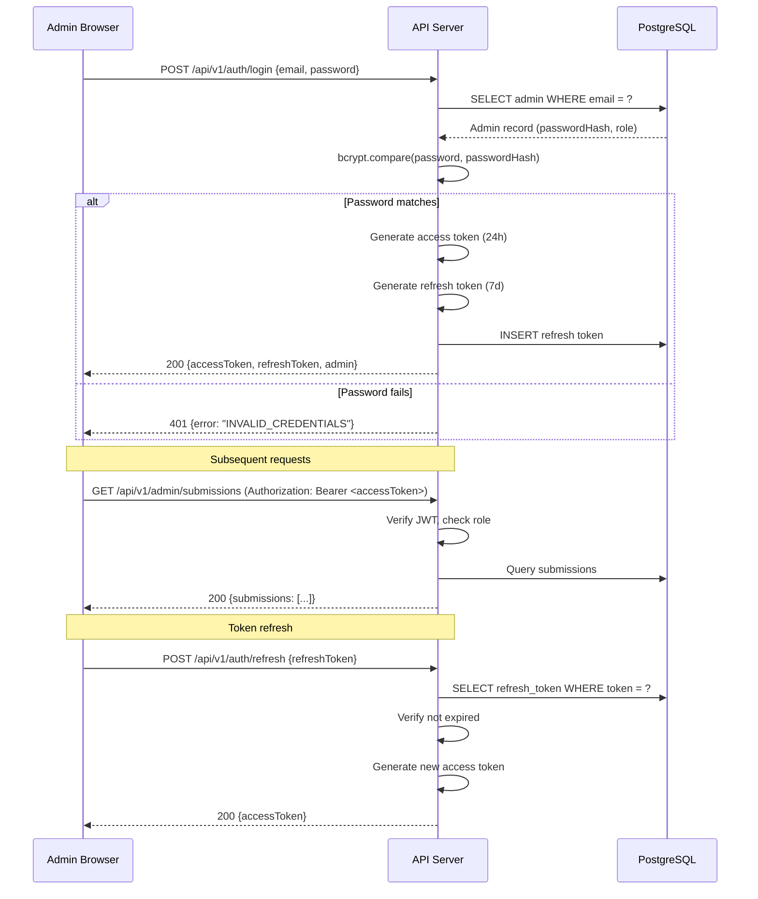

# Admin Authentication Design

**Status**: DRAFT
**Author**: anton.abyzov@gmail.com
**Date**: 2026-02-15
**Satisfies**: AC-US11-01, AC-US11-09 (T-032)
**Dependencies**: T-030 (Database Schema)

---

## 1. Overview

JWT-based email/password authentication for the verified-skill.com admin dashboard. Designed for simplicity first, with a clear path to OAuth and RBAC in future phases.

---

## 2. Authentication Flow



---

## 3. Password Hashing

```typescript
import bcrypt from 'bcrypt';

const SALT_ROUNDS = 12;

async function hashPassword(password: string): Promise<string> {
  return bcrypt.hash(password, SALT_ROUNDS);
}

async function verifyPassword(password: string, hash: string): Promise<boolean> {
  return bcrypt.compare(password, hash);
}
```

**Password Requirements**:
- Minimum 12 characters
- No maximum length (bcrypt truncates at 72 bytes)
- No complexity requirements (length > complexity per NIST 800-63B)

---

## 4. JWT Token Design

### 4.1 Access Token

```typescript
interface AccessTokenPayload {
  sub: string;         // Admin ID (UUID)
  email: string;       // Admin email
  role: AdminRole;     // 'SUPER_ADMIN' | 'REVIEWER'
  iat: number;         // Issued at (Unix timestamp)
  exp: number;         // Expiry (iat + 24h)
}
```

**Configuration**:
| Parameter | Value | Rationale |
|-----------|-------|-----------|
| Algorithm | HS256 | Sufficient for single-service JWT |
| Expiry | 24 hours | Balances convenience and security |
| Secret | `JWT_SECRET` env var | Min 32 chars, randomly generated |

### 4.2 Refresh Token

```typescript
interface RefreshTokenRecord {
  id: string;          // UUID
  adminId: string;     // FK to admins
  token: string;       // Random 64-char hex string
  expiresAt: Date;     // Created + 7 days
  createdAt: Date;
}
```

**Configuration**:
| Parameter | Value | Rationale |
|-----------|-------|-----------|
| Format | Random 64-char hex | Not a JWT — opaque token |
| Expiry | 7 days | Weekly re-login at most |
| Storage | PostgreSQL | Revocable, auditable |
| Limit | 5 per admin | Prevent token accumulation |

### 4.3 Token Refresh Flow

```typescript
async function refreshAccessToken(refreshToken: string): Promise<string> {
  // 1. Find the refresh token in database
  const stored = await db.refreshToken.findUnique({
    where: { token: refreshToken },
    include: { admin: true },
  });

  if (!stored) throw new UnauthorizedError('INVALID_TOKEN');
  if (stored.expiresAt < new Date()) {
    await db.refreshToken.delete({ where: { id: stored.id } });
    throw new UnauthorizedError('TOKEN_EXPIRED');
  }
  if (!stored.admin.isActive) throw new ForbiddenError('ACCOUNT_DISABLED');

  // 2. Generate new access token
  const accessToken = jwt.sign(
    { sub: stored.admin.id, email: stored.admin.email, role: stored.admin.role },
    process.env.JWT_SECRET,
    { expiresIn: '24h' }
  );

  return accessToken;
}
```

---

## 5. Role-Based Access Control

### 5.1 Roles

| Role | Description | Permissions |
|------|-------------|-------------|
| `SUPER_ADMIN` | Full platform access | All admin operations + manage admins |
| `REVIEWER` | Review submissions | View queue, approve, reject. Cannot escalate or manage admins. |

### 5.2 Permission Matrix

| Action | SUPER_ADMIN | REVIEWER |
|--------|:-:|:-:|
| View submission queue | Yes | Yes |
| View scan results | Yes | Yes |
| Approve submission | Yes | Yes |
| Reject submission | Yes | Yes |
| Escalate to Tier 3 | Yes | No |
| View platform stats | Yes | Yes |
| Manage admins | Yes | No |
| Revoke vendor trust | Yes | No |
| Configuration changes | Yes | No |

### 5.3 Middleware Implementation

```typescript
function requireRole(...roles: AdminRole[]) {
  return (req: AuthenticatedRequest, res: Response, next: NextFunction) => {
    if (!req.admin) {
      return res.status(401).json({ error: 'UNAUTHORIZED' });
    }

    // SUPER_ADMIN always has access
    if (req.admin.role === 'SUPER_ADMIN') {
      return next();
    }

    if (!roles.includes(req.admin.role)) {
      return res.status(403).json({
        error: 'FORBIDDEN',
        message: `Required role: ${roles.join(' or ')}`,
      });
    }

    next();
  };
}

// Usage:
app.patch('/api/v1/admin/submissions/:id/approve', requireRole('REVIEWER'));
app.post('/api/v1/admin/submissions/:id/escalate', requireRole('SUPER_ADMIN'));
```

---

## 6. Admin Seeding

Initial admin created via CLI command (not via API):

```typescript
// packages/web/scripts/seed-admin.ts
async function seedAdmin() {
  const email = process.env.ADMIN_EMAIL;
  const password = process.env.ADMIN_PASSWORD;

  if (!email || !password) {
    throw new Error('ADMIN_EMAIL and ADMIN_PASSWORD env vars required');
  }

  const passwordHash = await hashPassword(password);

  await prisma.admin.upsert({
    where: { email },
    create: {
      email,
      passwordHash,
      role: 'SUPER_ADMIN',
      displayName: 'Platform Admin',
    },
    update: {},
  });

  console.log(`Admin seeded: ${email}`);
}
```

---

## 7. Security Considerations

| Concern | Mitigation |
|---------|-----------|
| Brute force login | Rate limit: 5 attempts per 15 min per IP |
| Token theft | Short access token TTL (24h), refresh token rotation |
| Password storage | bcrypt with 12 salt rounds |
| JWT secret exposure | Environment variable, rotatable |
| Inactive admin access | `isActive` flag checked on every auth |
| Session hijacking | Secure, HttpOnly, SameSite cookies for web |
| CSRF | SameSite=Strict + origin check |

---

## 8. Future Enhancements (Phase 2)

| Feature | Description |
|---------|-------------|
| GitHub OAuth | Login with GitHub account |
| Magic link | Email-based passwordless login |
| MFA/TOTP | Two-factor authentication |
| Audit log UI | View all admin actions in dashboard |
| API keys | Long-lived tokens for CI/CD integration |
| SSO/SAML | Enterprise single sign-on |

---

## 9. References

- [Database Schema](./database-schema.md) — Admin and RefreshToken models
- [Submission API Design](./submission-api-design.md) — Auth middleware usage
- [Admin Dashboard](./admin-dashboard-design.md) — Login UI flow
