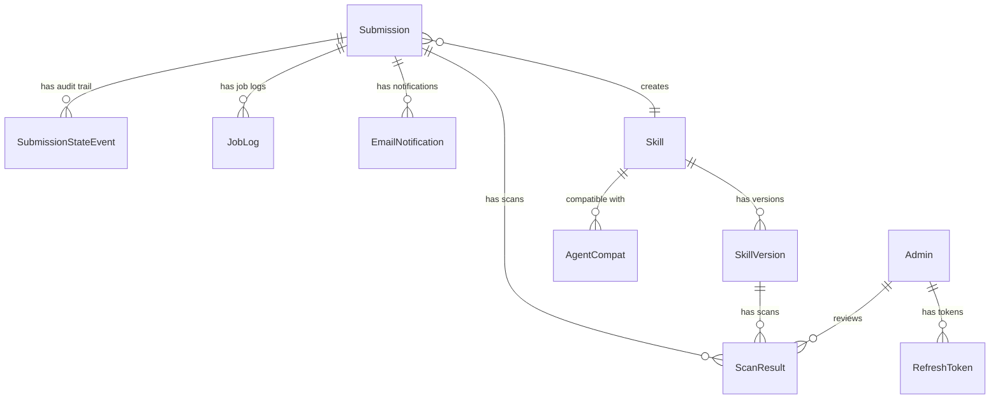

# Database Schema Design

**Status**: DRAFT
**Author**: anton.abyzov@gmail.com
**Date**: 2026-02-15
**Satisfies**: AC-US10-09, AC-US11-10, AC-US12-05 (T-030)
**Dependencies**: T-029 (Submission State Machine)

---

## 1. Overview

This document defines the Prisma schema for verified-skill.com. All entities support the submission pipeline, skill registry, admin dashboard, and versioning mechanism.

---

## 2. Prisma Schema

```prisma
// schema.prisma
generator client {
  provider = "prisma-client-js"
}

datasource db {
  provider = "postgresql"
  url      = env("DATABASE_URL")
}

// ─── Enums ──────────────────────────────────────────────

enum SubmissionState {
  RECEIVED
  TIER1_SCANNING
  TIER1_FAILED
  TIER2_SCANNING
  AUTO_APPROVED
  NEEDS_REVIEW
  TIER3_REVIEW
  PUBLISHED
  REJECTED
  VENDOR_APPROVED
}

enum CertificationTier {
  SCANNED
  VERIFIED
  CERTIFIED
}

enum CertificationMethod {
  AUTOMATED_SCAN
  LLM_JUDGE
  MANUAL_REVIEW
  VENDOR_AUTO
}

enum ScanVerdict {
  PASS
  CONCERNS
  FAIL
}

enum AdminRole {
  SUPER_ADMIN
  REVIEWER
}

enum EmailType {
  SUBMISSION_RECEIVED
  AUTO_APPROVED
  NEEDS_REVIEW
  REJECTED
  VERSION_PUBLISHED
}

// ─── Submissions ────────────────────────────────────────

/// A skill submission request from an author
model Submission {
  id            String          @id @default(uuid())
  repoUrl       String          /// GitHub repository URL
  skillName     String          /// Skill name from SKILL.md
  skillPath     String          /// Path to SKILL.md within repo
  submitterEmail String?        /// Optional email for notifications
  state         SubmissionState @default(RECEIVED)
  isVendor      Boolean         @default(false)
  vendorOrg     String?         /// Vendor org name if auto-verified

  /// Linked skill (created on publish)
  skillId       String?
  skill         Skill?          @relation(fields: [skillId], references: [id])

  /// Scan results for this submission
  scanResults   ScanResult[]

  /// State transition audit trail
  stateEvents   SubmissionStateEvent[]

  /// Job execution audit logs (scheduling via Cloudflare Queues)
  jobLogs       JobLog[]

  /// Email notifications sent
  emails        EmailNotification[]

  createdAt     DateTime        @default(now())
  updatedAt     DateTime        @updatedAt

  @@index([state])
  @@index([skillName])
  @@index([createdAt])
}

// ─── Skills ─────────────────────────────────────────────

/// A verified skill in the registry
model Skill {
  id            String          @id @default(uuid())
  name          String          @unique  /// Unique skill identifier
  displayName   String          /// Human-readable name
  description   String          /// Skill description from SKILL.md
  author        String          /// Author name or GitHub org
  repoUrl       String          /// Source repository URL
  category      String          @default("general")  /// Skill category
  currentVersion String         /// Current verified version

  /// Certification status
  certTier      CertificationTier
  certMethod    CertificationMethod
  certScore     Int?            /// Tier 2 score (0-100)
  certifiedAt   DateTime
  certExpiresAt DateTime?       /// Tier 3 expiry (6 months)

  /// Trust labels (stored as JSON array)
  labels        String[]        @default([])

  /// Popularity signals
  githubStars   Int             @default(0)
  githubForks   Int             @default(0)
  npmDownloads  Int             @default(0)
  vskillInstalls Int            @default(0)
  lastCommitAt  DateTime?

  /// Versions
  versions      SkillVersion[]

  /// Agent compatibility
  agentCompat   AgentCompat[]

  /// Submissions that produced this skill
  submissions   Submission[]

  /// Popularity snapshot
  trendingScore7d  Float        @default(0)
  trendingScore30d Float        @default(0)

  isDeprecated  Boolean         @default(false)
  createdAt     DateTime        @default(now())
  updatedAt     DateTime        @updatedAt

  @@index([category])
  @@index([certTier])
  @@index([trendingScore7d(sort: Desc)])
  @@index([vskillInstalls(sort: Desc)])
}

// ─── Skill Versions ─────────────────────────────────────

/// A specific version of a skill with its own scan results
model SkillVersion {
  id            String          @id @default(uuid())
  skillId       String
  skill         Skill           @relation(fields: [skillId], references: [id])
  version       String          /// Semantic version (e.g., "1.0.0")
  contentHash   String          /// SHA-256 of SKILL.md content
  gitSha        String          /// Git commit SHA

  /// Per-version certification
  certTier      CertificationTier
  certMethod    CertificationMethod
  certScore     Int?            /// Tier 2 score for this version
  certifiedAt   DateTime

  /// Scan results for this version
  scanResults   ScanResult[]

  /// Diff from previous version
  diffSummary   String?         /// Summary of changes from previous version
  versionBump   String?         /// 'major', 'minor', or 'patch'

  /// Labels at this version
  labels        String[]        @default([])

  createdAt     DateTime        @default(now())

  @@unique([skillId, version])
  @@index([skillId])
  @@index([createdAt(sort: Desc)])
}

// ─── Scan Results ───────────────────────────────────────

/// Security scan result for a submission or version
model ScanResult {
  id              String        @id @default(uuid())

  /// Link to submission (during pipeline)
  submissionId    String?
  submission      Submission?   @relation(fields: [submissionId], references: [id])

  /// Link to skill version (after publish)
  skillVersionId  String?
  skillVersion    SkillVersion? @relation(fields: [skillVersionId], references: [id])

  /// Scan details
  tier            Int           /// 1, 2, or 3
  verdict         ScanVerdict
  score           Int?          /// 0-100 (Tier 2 only)
  patternsChecked Int           @default(37)
  scannerVersion  String
  duration_ms     Int

  /// Finding counts by severity
  criticalCount   Int           @default(0)
  highCount       Int           @default(0)
  mediumCount     Int           @default(0)
  lowCount        Int           @default(0)
  infoCount       Int           @default(0)

  /// Detailed findings (JSON array)
  findings        Json          @default("[]")

  /// Tier 2 specific fields
  intentAnalysis  String?
  scopeAlignment  String?
  concerns        String[]      @default([])

  /// Tier 3 specific fields
  reviewerId      String?
  reviewer        Admin?        @relation(fields: [reviewerId], references: [id])
  reviewNotes     String?

  createdAt       DateTime      @default(now())

  @@index([submissionId])
  @@index([skillVersionId])
  @@index([tier])
}

// ─── Audit Trail ────────────────────────────────────────

/// Immutable log of submission state transitions
model SubmissionStateEvent {
  id            String          @id @default(uuid())
  submissionId  String
  submission    Submission      @relation(fields: [submissionId], references: [id])
  fromState     SubmissionState?  /// null for initial RECEIVED
  toState       SubmissionState
  trigger       String          /// What caused the transition
  actor         String          /// 'system', 'worker', or admin user ID
  actorType     String          /// 'system' | 'worker' | 'admin'
  metadata      Json            @default("{}")
  createdAt     DateTime        @default(now())

  @@index([submissionId])
  @@index([createdAt])
}

// ─── Admin ──────────────────────────────────────────────

/// Admin user for the dashboard
model Admin {
  id            String          @id @default(uuid())
  email         String          @unique
  passwordHash  String          /// bcrypt hash
  role          AdminRole       @default(REVIEWER)
  displayName   String

  /// Refresh tokens
  refreshTokens RefreshToken[]

  /// Reviews performed
  scanResults   ScanResult[]

  isActive      Boolean         @default(true)
  lastLoginAt   DateTime?
  createdAt     DateTime        @default(now())
  updatedAt     DateTime        @updatedAt
}

/// JWT refresh token
model RefreshToken {
  id            String          @id @default(uuid())
  adminId       String
  admin         Admin           @relation(fields: [adminId], references: [id], onDelete: Cascade)
  token         String          @unique
  expiresAt     DateTime
  createdAt     DateTime        @default(now())

  @@index([adminId])
  @@index([expiresAt])
}

// ─── Agent Compatibility ────────────────────────────────

/// Agent compatibility record for a skill
model AgentCompat {
  id            String          @id @default(uuid())
  skillId       String
  skill         Skill           @relation(fields: [skillId], references: [id])
  agentId       String          /// Agent identifier (e.g., 'claude-code')
  agentName     String          /// Display name (e.g., 'Claude Code')
  isUniversal   Boolean         @default(false)
  isVerified    Boolean         @default(false)  /// Tested on this agent
  createdAt     DateTime        @default(now())

  @@unique([skillId, agentId])
  @@index([skillId])
  @@index([agentId])
}

// ─── Email Notifications ────────────────────────────────

/// Email notification sent for a submission
model EmailNotification {
  id            String          @id @default(uuid())
  submissionId  String
  submission    Submission      @relation(fields: [submissionId], references: [id])
  emailType     EmailType
  recipient     String          /// Email address
  subject       String
  sentAt        DateTime?       /// null if not yet sent
  error         String?         /// Error message if send failed
  createdAt     DateTime        @default(now())

  @@index([submissionId])
  @@index([emailType])
}

// ─── Job Audit Log ──────────────────────────────────────
// NOTE: Job scheduling is handled by Cloudflare Queues (push-based).
// This model is for audit logging only — not for job state management.

/// Job execution log (audit only — Cloudflare Queues handles scheduling)
model JobLog {
  id            String          @id @default(uuid())
  submissionId  String
  submission    Submission      @relation(fields: [submissionId], references: [id])
  jobType       String          /// 'tier1-scan', 'tier2-scan', 'publish'
  status        String          /// 'completed', 'failed'
  durationMs    Int?
  error         String?
  completedAt   DateTime        @default(now())
  createdAt     DateTime        @default(now())

  @@index([submissionId])
  @@index([jobType])
}
```

---

## 3. Entity Relationships



---

## 4. Index Strategy

| Table | Index | Purpose |
|-------|-------|---------|
| `Submission` | `state` | Filter submissions by pipeline state |
| `Submission` | `skillName` | Find submissions for a skill |
| `Submission` | `createdAt` | Sort by submission date |
| `Skill` | `category` | Browse by category |
| `Skill` | `certTier` | Filter by certification tier |
| `Skill` | `trendingScore7d DESC` | Trending page sort |
| `Skill` | `vskillInstalls DESC` | Popularity sort |
| `SkillVersion` | `skillId` | Find versions for a skill |
| `SkillVersion` | `createdAt DESC` | Latest version first |
| `ScanResult` | `submissionId` | Find scans for submission |
| `ScanResult` | `skillVersionId` | Find scans for version |
| `SubmissionStateEvent` | `submissionId` | Audit trail for submission |
| `JobLog` | `submissionId`, `jobType` | Job execution audit trail |

---

## 5. Data Integrity Constraints

| Constraint | Implementation |
|-----------|---------------|
| Unique skill name | `@@unique` on `Skill.name` |
| Unique version per skill | `@@unique([skillId, version])` on `SkillVersion` |
| Unique agent per skill | `@@unique([skillId, agentId])` on `AgentCompat` |
| Unique admin email | `@@unique` on `Admin.email` |
| Cascading token deletion | `onDelete: Cascade` on `RefreshToken` |
| Immutable audit events | Application-level (no UPDATE/DELETE allowed) |

---

## 6. Estimated Scale

| Entity | Year 1 Estimate | Storage |
|--------|----------------|---------|
| Skills | 1,000-5,000 | ~5MB |
| SkillVersions | 5,000-25,000 | ~25MB |
| Submissions | 10,000-50,000 | ~50MB |
| ScanResults | 20,000-100,000 | ~200MB (findings JSON) |
| StateEvents | 50,000-250,000 | ~100MB |
| Admins | 5-20 | Negligible |
| Jobs | 20,000-100,000 | ~50MB (with cleanup) |

Total estimated storage: ~500MB in Year 1 — well within PostgreSQL free tier limits.

---

## 7. References

- [Submission State Machine](./submission-state-machine.md) — State definitions
- [Auto-Approve Logic](./auto-approve-logic.md) — Decision thresholds
- [Admin Auth Design](./admin-auth-design.md) — Admin model details
- [Email Notification Design](./email-notification-design.md) — Email model details
