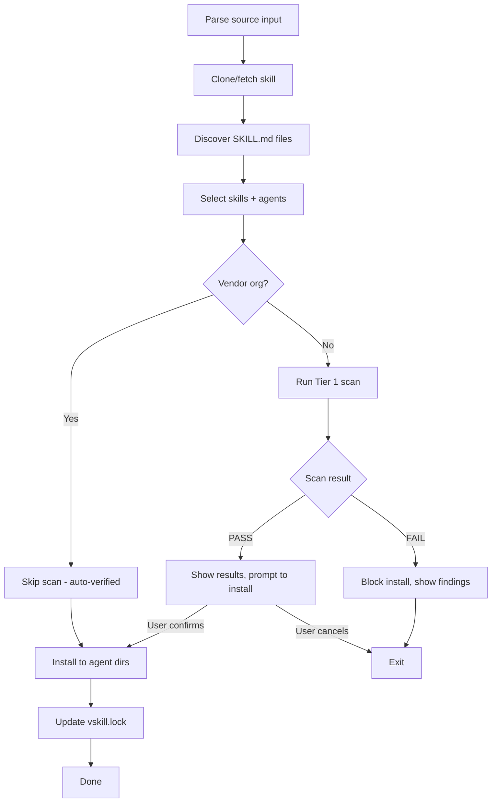
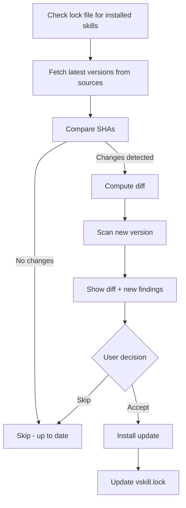

# npx vskill CLI — Design Document

**Status**: DRAFT
**Author**: anton.abyzov@gmail.com
**Date**: 2026-02-15
**Satisfies**: AC-US8-01, AC-US8-03, AC-US8-04, AC-US8-05, AC-US8-07 (T-015b)
**Dependencies**: T-006b (Skills.sh Installer Internals), T-008 (Three-Tier Certification)

---

## 1. Overview

`vskill` is a security-first CLI for installing, scanning, and managing AI agent skills across all 39 supported agents. It mirrors the familiar `npx skills add` API but adds security scanning before every install, version pinning via lock files, and diff scanning on updates.

**npm package**: `vskill`
**Invocation**: `npx vskill <command>` or global install `npm i -g vskill`

---

## 2. Command Reference

### 2.1 `vskill add` — Install a skill with security scanning

```
npx vskill add <source> [options]

ARGUMENTS
  <source>    GitHub repo (owner/repo), URL, or local path

OPTIONS
  --skill <name>     Install specific skill(s) from multi-skill repo
  --agent <name>     Target specific agent(s) (default: auto-detect)
  --global           Install globally (~/.agents/skills/)
  --mode <mode>      Install mode: symlink (default) | copy
  --skip-scan        Skip security scan (NOT recommended)
  --tier <tier>      Minimum scan tier: 1 (default) | 2
  --yes              Accept all defaults, no prompts
  --json             Output results as JSON
  --quiet            Minimal output

EXAMPLES
  npx vskill add anthropics/skills --skill frontend-design
  npx vskill add owner/repo --agent claude-code cursor
  npx vskill add ./local/skill --global
  npx vskill add https://github.com/org/repo.git
```

#### Installation Flow



#### Security Scan Display

```
$ npx vskill add secondsky/bun-package-manager

  Fetching secondsky/bun-package-manager... done
  Found 1 skill: bun-package-manager

  SECURITY SCAN
  ─────────────────────────────────────────
  Patterns checked:    37
  Critical findings:   0
  High findings:       0
  Medium findings:     2
    - Network access: curl command detected (line 45)
    - Network access: fetch() usage detected (line 78)
  Low findings:        1
    - Large skill: 48KB (approaching 500KB limit)

  Verdict: PASS (2 medium, 1 low)
  Score:   Tier 1 only (use --tier 2 for LLM analysis)

  Detected agents: Claude Code, Cursor, Windsurf

  Install bun-package-manager to 3 agents?
  [Y] Yes  [N] No  [D] View details  [S] Scan Tier 2
```

### 2.2 `vskill scan` — Scan a skill without installing

```
npx vskill scan <source> [options]

ARGUMENTS
  <source>    GitHub repo, URL, or local path

OPTIONS
  --tier <tier>     Scan tier: 1 (default) | 2
  --format <fmt>    Output format: table (default) | json | sarif
  --verbose         Show all findings including info-level
  --skill <name>    Scan specific skill from multi-skill repo

EXAMPLES
  npx vskill scan owner/repo
  npx vskill scan ./my-skill --tier 2
  npx vskill scan owner/repo --format sarif > results.sarif
```

#### Output Formats

**Table (default)**:
```
SCAN RESULTS: my-awesome-skill
────────────────────────────────────
Tier:     1 (Deterministic)
Patterns: 37 checked
Duration: 234ms

FINDINGS (3)
  CRITICAL  eval() detected                         line 12
  HIGH      process.env access pattern               line 34
  MEDIUM    Network access: fetch() usage            line 56

Verdict: FAIL (1 critical, 1 high)
```

**JSON**:
```json
{
  "skill": "my-awesome-skill",
  "tier": 1,
  "verdict": "FAIL",
  "patternsChecked": 37,
  "duration_ms": 234,
  "findings": [
    {
      "severity": "critical",
      "category": "remote-code-execution",
      "message": "eval() detected",
      "line": 12,
      "pattern": "eval\\("
    }
  ]
}
```

**SARIF** (for CI/CD integration):
Standard SARIF v2.1.0 format compatible with GitHub Code Scanning, VS Code SARIF Viewer, etc.

### 2.3 `vskill list` — List installed skills

```
npx vskill list [options]

OPTIONS
  --global          Show global installs only
  --local           Show project installs only
  --json            Output as JSON
  --trending        Show trending skills from registry
  --category <cat>  Filter by category (with --trending)

EXAMPLES
  npx vskill list
  npx vskill list --trending --category security
```

#### Output

```
INSTALLED SKILLS
────────────────────────────────────────────
react-best-practices  v2.1.0  [VERIFIED] [EXTENSIBLE]
  Vercel Labs · 234K installs · Scanned Feb 15, 2026

bun-package-manager   v1.0.3  [SCANNED] [WARNING]
  secondsky · 1.2K installs · 3 medium findings

clean-code            v1.5.0  [CERTIFIED] [SAFE] [PORTABLE]
  xenitV1 · 45K installs · Certified Jan 20, 2026

3 skills installed (2 global, 1 project)
```

### 2.4 `vskill compare` — Compare skill versions or providers

```
npx vskill compare <skill-name> [options]

OPTIONS
  --versions         Compare installed vs latest version
  --providers        Compare same skill from different providers
  --diff             Show unified diff
  --json             Output as JSON

EXAMPLES
  npx vskill compare react-best-practices --versions
  npx vskill compare frontend-design --providers
```

#### Version Comparison Output

```
COMPARE: react-best-practices
────────────────────────────────────────────
  Installed:  v2.1.0 (SHA: abc123)
  Latest:     v2.2.0 (SHA: def456)

  CHANGES IN v2.2.0
  + New section: "Server Component patterns" (lines 45-89)
  ~ Modified: "Data fetching" section (lines 12-34)
  - Removed: "getServerSideProps" reference (line 67)

  SECURITY DIFF
  New patterns detected:
    MEDIUM  fetch() usage added (line 52) — NEW
    INFO    import statement added (line 46) — NEW

  [U] Update  [S] Skip  [D] Full diff
```

### 2.5 `vskill update` — Update installed skills

```
npx vskill update [skill-name] [options]

ARGUMENTS
  [skill-name]    Specific skill to update (default: all)

OPTIONS
  --check          Check for updates without installing
  --force          Update even if scan findings increase
  --yes            Accept all updates without prompting
  --json           Output as JSON

EXAMPLES
  npx vskill update
  npx vskill update react-best-practices
  npx vskill update --check
```

#### Update Flow



#### Update Output

```
UPDATES AVAILABLE
────────────────────────────────────────────
react-best-practices  v2.1.0 → v2.2.0
  + 1 new section, ~ 2 modified sections
  Security: No new findings (SAFE)
  [Y] Update  [N] Skip

bun-package-manager   v1.0.3 → v1.1.0
  + 1 new section
  Security: ⚠ 1 new medium finding (eval usage)
  [Y] Update  [N] Skip  [D] Details

1 skill up to date (clean-code v1.5.0)
```

### 2.6 `vskill submit` — Submit skill for verification

```
npx vskill submit <source> [options]

ARGUMENTS
  <source>    GitHub repo URL

OPTIONS
  --skill <name>    Specific skill to submit
  --email <email>   Email for status notifications (optional)
  --tier <tier>     Request specific tier: 2 (default) | 3
  --json            Output as JSON

EXAMPLES
  npx vskill submit https://github.com/myorg/my-skill
  npx vskill submit myorg/my-skill --email me@example.com --tier 3
```

#### Submission Flow

```
$ npx vskill submit myorg/my-awesome-skill --email dev@example.com

  Fetching myorg/my-awesome-skill... done
  Found skill: my-awesome-skill

  PRE-SUBMISSION SCAN (Tier 1)
  ─────────────────────────────
  Patterns checked: 37
  Findings: 0 critical, 0 high, 0 medium
  Verdict: PASS

  Submitting to verified-skill.com...

  SUBMISSION CREATED
  ID:      sub_abc123def456
  Status:  RECEIVED → TIER1_SCANNING
  Track:   https://verified-skill.com/submit/sub_abc123def456
  Email:   dev@example.com (notifications enabled)

  Tier 2 verification will run automatically.
  Expected completion: 5-15 minutes.
```

### 2.7 `vskill init` — Initialize vskill in a project

```
npx vskill init [options]

OPTIONS
  --global    Initialize global config
  --yes       Accept defaults

EXAMPLES
  npx vskill init
```

#### Init Flow

```
$ npx vskill init

  Detecting installed agents...

  DETECTED AGENTS (4/39)
  ✓ Claude Code    ~/.claude/skills
  ✓ Cursor         ~/.cursor/skills
  ✓ Windsurf       ~/.codeium/windsurf/skills
  ✓ Codex          ~/.codex/skills (universal)

  Created: vskill.lock (empty)
  Created: .vskillrc (agent config)

  Ready! Run `npx vskill add <owner/repo>` to install your first skill.
```

---

## 3. Agent Auto-Detection

vskill detects all 39 agents using filesystem checks, mirroring the `skills@1.3.9` detection logic.

### 3.1 Detection Logic

```typescript
interface AgentDefinition {
  id: string;
  displayName: string;
  localSkillsDir: string;      // Project-level skills dir (relative)
  globalSkillsDir: string;     // Global skills dir (absolute)
  isUniversal: boolean;        // Uses .agents/skills/ canonical dir
  detectInstalled: () => Promise<boolean>;
}

async function detectInstalledAgents(): Promise<AgentDefinition[]> {
  const results = await Promise.all(
    ALL_AGENTS.map(async (agent) => ({
      agent,
      installed: await agent.detectInstalled(),
    }))
  );
  return results.filter((r) => r.installed).map((r) => r.agent);
}
```

### 3.2 Agent Categories

**7 Universal Agents** (share `.agents/skills/`):
Amp, Codex, Gemini CLI, GitHub Copilot, Kimi Code CLI, OpenCode, Replit (hidden)

**32 Non-Universal Agents** (need symlinks):
Antigravity, Augment, Claude Code, OpenClaw, Cline, CodeBuddy, Command Code, Continue, Crush, Cursor, Droid, Goose, Junie, iFlow CLI, Kilo Code, Kiro CLI, Kode, MCPJam, Mistral Vibe, Mux, OpenHands, Pi, Qoder, Qwen Code, Roo Code, Trae, Trae CN, Windsurf, Zencoder, Neovate, Pochi, AdaL

### 3.3 Detection Method

All agents use `existsSync()` on known config directories:

| Agent | Detection Path(s) |
|-------|-------------------|
| Claude Code | `$CLAUDE_CONFIG_DIR` or `~/.claude` |
| Cursor | `~/.cursor` |
| Windsurf | `~/.codeium/windsurf` |
| Codex | `$CODEX_HOME` or `/etc/codex` |
| Gemini CLI | `~/.gemini` |
| GitHub Copilot | `.github` or `~/.copilot` |
| ... | See [skills-sh-installer-internals.md](./skills-sh-installer-internals.md) for all 39 |

---

## 4. Security Scan-Before-Install Flow

Every `vskill add` command runs a security scan before installing. This is the core differentiator from `npx skills add`.

### 4.1 Flow

```
User runs: npx vskill add owner/repo
                    |
                    v
            ┌───────────────┐
            │ Fetch skill    │
            │ content        │
            └───────┬───────┘
                    |
                    v
            ┌───────────────┐
            │ Check vendor   │──── anthropics/, openai/, google/
            │ auto-verify    │     vercel-labs/, supabase/, microsoft/
            └───────┬───────┘
                    |
           ┌────────┴────────┐
           |                 |
     Vendor Org         Not Vendor
           |                 |
           v                 v
    ┌─────────────┐  ┌──────────────┐
    │ Auto-verify  │  │ Run Tier 1    │
    │ + VENDOR tag │  │ Scan (37 pat) │
    └──────┬──────┘  └──────┬───────┘
           |                 |
           |          ┌──────┴──────┐
           |          |             |
           |        PASS          FAIL
           |          |             |
           |          v             v
           |   ┌───────────┐ ┌──────────┐
           |   │ Show score │ │ BLOCK    │
           |   │ + findings │ │ show why │
           |   │ + prompt   │ └──────────┘
           |   └─────┬─────┘
           |         |
           |    User confirms
           |         |
           v         v
    ┌────────────────────┐
    │ Install to agents   │
    │ Update vskill.lock  │
    └────────────────────┘
```

### 4.2 Vendor Fast-Path

Skills from trusted GitHub organizations skip scanning entirely:

```typescript
const TRUSTED_ORGS = [
  'anthropics', 'openai', 'google', 'google-gemini',
  'vercel-labs', 'supabase', 'microsoft'
];

function isVendorAutoVerified(repoOwner: string): boolean {
  return TRUSTED_ORGS.includes(repoOwner.toLowerCase());
}
```

**Display for vendor skills**:
```
$ npx vskill add anthropics/skills --skill frontend-design

  Fetching anthropics/skills... done
  Found skill: frontend-design

  VENDOR VERIFIED (Anthropic)
  ─────────────────────────────
  Trusted organization — scan skipped
  Tier: VERIFIED (vendor auto-verification)

  Detected agents: Claude Code, Cursor, Windsurf

  Install frontend-design to 3 agents? [Y/n]
```

### 4.3 Scan Result Display

The security scan display follows a consistent format:

```typescript
interface ScanDisplay {
  skillName: string;
  tier: 1 | 2;
  patternsChecked: number;
  duration_ms: number;
  findings: {
    critical: Finding[];
    high: Finding[];
    medium: Finding[];
    low: Finding[];
    info: Finding[];
  };
  verdict: 'PASS' | 'FAIL';
  score?: number;           // Tier 2 only (0-100)
}

interface Finding {
  severity: string;
  category: string;
  message: string;
  line?: number;
  pattern: string;
}
```

### 4.4 User Confirmation Prompt

After scan results are displayed:

| Key | Action |
|-----|--------|
| `Y` | Install the skill |
| `N` | Cancel installation |
| `D` | View detailed findings (expands each finding with context) |
| `S` | Run Tier 2 scan (requires API key, shows LLM judge analysis) |

---

## 5. Output Formats

### 5.1 Table (Default)

Human-readable, colored output using `chalk`:

```
INSTALLED SKILLS
────────────────────────────────────────────
react-best-practices  v2.1.0  [VERIFIED] [EXTENSIBLE]
  Vercel Labs · 234K installs · Scanned Feb 15, 2026
```

### 5.2 JSON

Machine-readable output for piping and CI/CD:

```json
{
  "skills": [
    {
      "name": "react-best-practices",
      "version": "v2.1.0",
      "tier": "verified",
      "labels": ["verified", "extensible"],
      "author": "Vercel Labs",
      "installs": 234129,
      "scannedAt": "2026-02-15T18:00:00Z"
    }
  ]
}
```

### 5.3 Minimal

One-line-per-skill output for scripting:

```
react-best-practices v2.1.0 verified
bun-package-manager v1.0.3 scanned
clean-code v1.5.0 certified
```

---

## 6. Configuration

### 6.1 `.vskillrc` (Project-Level)

```json
{
  "agents": ["claude-code", "cursor", "windsurf"],
  "installMode": "symlink",
  "minTier": 1,
  "trustedOrgs": [],
  "autoUpdate": false
}
```

### 6.2 `~/.vskillrc` (Global)

```json
{
  "defaultAgents": ["claude-code", "cursor"],
  "globalInstallMode": "symlink",
  "telemetry": true,
  "apiKey": null,
  "registryUrl": "https://verified-skill.com/api/v1"
}
```

---

## 7. Lock File Integration

The CLI reads and writes `vskill.lock` for version pinning. See [version-pinned-verification.md](./version-pinned-verification.md) for full schema.

### 7.1 Lock File Operations

| Command | Lock File Action |
|---------|-----------------|
| `vskill add` | Add entry with SHA, scan date, tier |
| `vskill update` | Update entry after diff scan approval |
| `vskill remove` | Remove entry |
| `vskill list` | Read entries for display |
| `vskill check` | Compare entries against latest remote |

---

## 8. Error Handling

### 8.1 Error Categories

| Error | Exit Code | Message |
|-------|-----------|---------|
| Network failure | 1 | `Error: Failed to fetch <source>. Check your network connection.` |
| Skill not found | 2 | `Error: No SKILL.md found in <source>.` |
| Scan failure (critical) | 3 | `Blocked: <skill> has critical security findings. Use --skip-scan to override (NOT recommended).` |
| Agent not detected | 4 | `Warning: No agents detected. Install an AI agent first, or use --agent to specify manually.` |
| Lock file conflict | 5 | `Conflict: <skill> already installed at v<X>. Use --force to overwrite.` |
| API rate limit | 6 | `Rate limited by GitHub API. Authenticate with 'gh auth login' for higher limits.` |

### 8.2 Graceful Degradation

- **No network**: Local scans still work, remote features show clear error
- **No agents detected**: Warn but allow install with `--agent` flag
- **Lock file missing**: Create on first install, warn on update
- **API key missing**: Tier 2 scanning unavailable, Tier 1 still works

---

## 9. Telemetry

### 9.1 Events Tracked

| Event | Data | Purpose |
|-------|------|---------|
| `install` | skill name, agent count, tier, verdict | Usage analytics |
| `scan` | skill name, tier, findings count, duration | Security metrics |
| `update` | skill name, from_version, to_version | Update adoption |
| `submit` | skill name (no content) | Submission volume |

### 9.2 Opt-Out

```bash
# Environment variable
DISABLE_TELEMETRY=1 npx vskill add owner/repo

# Or
DO_NOT_TRACK=1 npx vskill add owner/repo

# Or in config
echo '{"telemetry": false}' > ~/.vskillrc
```

### 9.3 Privacy

- No skill content transmitted
- No user identifiers beyond anonymous session ID
- No tracking of private repos
- Fire-and-forget (no blocking on telemetry failure)

---

## 10. npm Package Structure

```
vskill/
├── bin/
│   └── vskill.mjs            # CLI entry point
├── dist/                      # Compiled output
├── package.json
├── README.md
└── LICENSE
```

```json
{
  "name": "vskill",
  "version": "0.1.0",
  "description": "Security-first AI agent skill installer",
  "bin": {
    "vskill": "./bin/vskill.mjs"
  },
  "engines": {
    "node": ">=18.0.0"
  },
  "keywords": [
    "ai", "agent", "skills", "security", "scanner",
    "verified-skill", "claude", "cursor", "copilot"
  ]
}
```

---

## 11. Dependencies

| Package | Purpose |
|---------|---------|
| `simple-git` | Git clone operations |
| `gray-matter` | YAML frontmatter parsing |
| `@clack/prompts` | Interactive CLI prompts |
| `picocolors` | Terminal color output |
| `commander` | CLI argument parsing |
| `xdg-basedir` | XDG config path resolution |

---

## 12. References

- [Skills.sh Installer Internals](./skills-sh-installer-internals.md) — Agent detection, install mechanics
- [Three-Tier Certification](./three-tier-certification.md) — Scan tiers and criteria
- [Trust Labels & Badges](./trust-labels-badges.md) — Badge display specifications
- [Version-Pinned Verification](./version-pinned-verification.md) — Lock file schema
- [Competitive Analysis](./competitive-analysis.md) — Feature comparison
