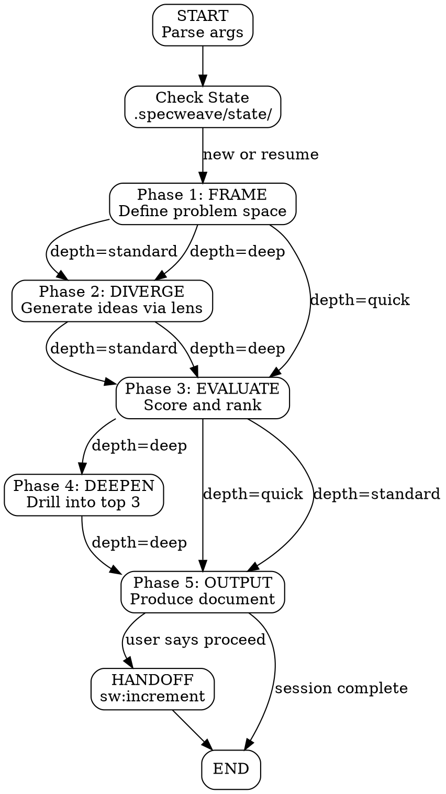

# Plan: sw:brainstorm - Multi-Perspective Ideation Skill

## Overview

The brainstorm skill is a **core planning-phase skill** that lives in the `specweave` plugin. It operates before `sw:increment` in the SpecWeave workflow, providing structured divergent thinking before convergent planning begins. It replaces the limited `docs:spec-driven-brainstorming` skill with a cognitively richer, depth-configurable, parallel-capable alternative.

```
User prompt
    |
    v
sw:brainstorm "topic" --lens six-hats --depth deep
    |
    v
+-------------------------------+
|  SKILL.md (fork context)      |
|  5-Phase Flow Controller      |
|  DOT-notation process graph   |
+-------------------------------+
    |
    +---> State: .specweave/state/brainstorm-{id}.json
    |
    +---> Output: .specweave/docs/brainstorms/YYYY-MM-DD-{slug}.md
    |
    v
Handoff: Skill({ skill: "sw:increment", args: "..." })
```

---

## ADR Review

Relevant existing decisions:

| ADR | Relevance |
|-----|-----------|
| **ADR-0148** (Agent vs Skill) | Brainstorm is a SKILL (auto-activates on keywords, uses fork context). Correct. |
| **ADR-0144** (Skills as Coordinators) | Brainstorm skill coordinates the ideation flow, saves output, hands off to increment. Follows pattern. |
| **ADR-0133** (Skills Must Not Spawn Large Agents) | Deep mode dispatches small, focused subagents per lens facet (each produces 100-200 lines). Output per facet is well under the 200-line limit for utility agents. Safe. |
| **ADR-0065** (Self-Validating Skills) | SKILL.md must be self-contained. No references to internal ADRs or docs. |

No new ADR required. The brainstorm skill fits cleanly within existing architectural patterns.

---

## Architecture

### Component 1: SKILL.md (Core Skill Definition)

**Location**: `plugins/specweave/skills/brainstorm/SKILL.md`

**Responsibilities**:
- Define the 5-phase ideation flow (Frame, Diverge, Evaluate, Deepen, Output)
- Describe the 5 cognitive lenses and their facets
- Control depth-mode branching (quick/standard/deep)
- Embed DOT-notation process graph for phase transitions
- Manage state persistence and resumability
- Produce structured output document
- Execute handoff to `sw:increment`

**Frontmatter**:
```yaml
---
description: "Multi-perspective brainstorming skill. Activates for: brainstorm, explore ideas, think through, what if, ideate, diverge, design thinking, six hats, SCAMPER, TRIZ"
argument-hint: '"topic" [--lens default|six-hats|scamper|triz|adjacent] [--depth quick|standard|deep]'
context: fork
model: opus
---
```

**Design constraints** (per ADR-0133):
- SKILL.md must stay under 600 lines (planning skill category)
- Use progressive disclosure: embed only the default lens inline; reference phase-specific guidance via internal sections (not external files, since `context: fork` loads the full SKILL.md)
- No Task() calls for content generation -- subagent dispatch in deep mode uses `Agent()` calls with small, focused prompts (one facet per agent, output under 200 lines each)

**DOT-Notation Process Flow**:

The SKILL.md embeds a GraphViz digraph that the LLM follows as a state machine. This is a proven pattern -- Claude follows graph-based process descriptions reliably because the directed edges make phase transitions unambiguous.



### Component 2: State File (Session Persistence)

**Location**: `.specweave/state/brainstorm-{timestamp}-{slug}.json`

**Schema**:
```json
{
  "sessionId": "brainstorm-1709490000-auth-strategy",
  "topic": "Authentication strategy for multi-tenant SaaS",
  "lens": "six-hats",
  "depth": "deep",
  "startedAt": "2026-03-03T18:00:00Z",
  "phases": {
    "frame": { "status": "completed", "output": "..." },
    "diverge": { "status": "completed", "output": "...", "facets": [
      { "name": "White Hat", "status": "completed", "output": "..." },
      { "name": "Red Hat", "status": "completed", "output": "..." }
    ]},
    "evaluate": { "status": "in_progress", "output": null },
    "deepen": { "status": "pending", "output": null },
    "output": { "status": "pending", "output": null }
  }
}
```

**Design decisions**:
- Timestamp-based session ID prevents collisions across concurrent sessions
- Per-facet status tracking enables resuming deep-mode sessions mid-diverge
- State file is created at session start, updated after each phase completes
- On resume, skill reads state file, skips completed phases, resumes from last incomplete phase

### Component 3: Output Document

**Location**: `.specweave/docs/brainstorms/{YYYY-MM-DD}-{slug}.md`

**Structure**:
```markdown
# Brainstorm: {Topic}

**Date**: YYYY-MM-DD | **Lens**: Six Thinking Hats | **Depth**: deep

## Problem Frame
[Phase 1 output -- problem definition, constraints, stakeholders]

## Approaches
[Phase 2 output -- ideas organized by lens facet]

### White Hat (Facts & Data)
- ...
### Red Hat (Feelings & Intuition)
- ...

## Evaluation Matrix

| Approach | Feasibility | Impact | Risk | Effort | Score |
|----------|-------------|--------|------|--------|-------|
| ...      | ...         | ...    | ...  | ...    | ...   |

## Deep Dives (Top 3)
[Phase 4 output -- detailed analysis of highest-scoring approaches]

### 1. [Top Approach Name]
**Pros**: ...
**Cons**: ...
**Implementation sketch**: ...
**Risks**: ...

## Idea Tree
[DOT process graph showing the phases executed and decisions made]

## Next Steps
- Recommended approach: [name]
- To proceed: say "proceed to increment"
```

### Component 4: Subagent Dispatch (Deep Mode Only)

**Pattern**: In deep mode, each lens facet is dispatched as a separate `Agent()` call for parallel exploration. This follows the same infrastructure used by `team-build` and `team-lead` skills.

**Dispatch logic** (embedded in SKILL.md instructions):

```
IF depth == "deep" AND lens has multiple facets:
  FOR EACH facet IN lens.facets:
    Agent({
      subagent_type: "researcher",
      prompt: "You are the {facet.name} perspective. Analyze
        '{topic}' through this lens: {facet.description}.
        Produce 5-10 ideas with brief rationale for each.
        Keep output under 150 lines.",
      name: "brainstorm-{facet.slug}"
    })
  COLLECT all facet outputs
  MERGE into diverge phase output
ELSE:
  Execute all facets sequentially in current context
```

**Facet counts by lens**:
- Default: 1 (no parallel dispatch needed)
- Six Thinking Hats: 6 facets (White, Red, Black, Yellow, Green, Blue)
- SCAMPER: 7 facets (Substitute, Combine, Adapt, Modify, Put-to-other-uses, Eliminate, Reverse)
- TRIZ: 3 facets (Inventive Principles, Contradiction Matrix, Ideal Final Result)
- Adjacent Possible: 1 (sequential domain-hopping, not parallelizable)

**ADR-0133 compliance**: Each facet agent produces under 200 lines. The skill itself stays under 600 lines. No nesting of large agents.

### Component 5: Handoff Protocol

When the user says "proceed to increment" or similar after reviewing the brainstorm output:

```
Skill({
  skill: "sw:increment",
  args: "{topic} --brainstorm-doc .specweave/docs/brainstorms/{file}.md"
})
```

The increment skill (PM phase) reads the brainstorm document and incorporates it into `spec.md` under a `## Background` section. This is a convention documented in the SKILL.md instructions, not a code-level integration. The PM skill already reads context files when passed as arguments.

---

## Source Code Changes

### Change 1: `src/adapters/claude-md-generator.ts`

**What**: Replace `spec-driven-brainstorming` with `brainstorm` in two locations.

**Location 1** -- `generateFrameworkSkillsTable()` filter list (line 200):
```typescript
// Before:
'spec-driven-debugging', 'spec-driven-brainstorming'].includes(s.name)

// After:
'spec-driven-debugging', 'brainstorm'].includes(s.name)
```

**Location 2** -- `getSkillActivation()` map (line 264):
```typescript
// Before:
'spec-driven-brainstorming': 'Brainstorm or refine idea',

// After:
'brainstorm': 'Brainstorm or ideate',
```

### Change 2: `src/adapters/agents-md-generator.ts`

**What**: Replace `spec-driven-brainstorming` with `brainstorm` in skill activation map (line 141).

```typescript
// Before:
'spec-driven-brainstorming': 'Brainstorming ideas, refining concepts, design thinking',

// After:
'brainstorm': 'Brainstorming ideas, exploring approaches, design thinking, ideation',
```

### Change 3: `src/core/lazy-loading/llm-plugin-detector.ts`

**What**: Update the `docs:` skill group to remove `docs:brainstorming` (line 676). The brainstorm skill is now in the `sw:` namespace (core plugin), not `docs:`.

```typescript
// Before:
docs: docs:brainstorming, docs:docusaurus, docs:technical-writing

// After:
docs: docs:docusaurus, docs:technical-writing
```

### Change 4: `src/utils/generate-skills-index.ts`

**What**: No changes needed. The `categorizeSkill()` function at line 225 already matches `nameLower.includes('brainstorm')` and categorizes it as `ORCHESTRATION`. The new skill named `brainstorm` will be correctly categorized automatically.

### Change 5: `src/templates/CLAUDE.md.template`

**What**: Add a clarifying note to the auto-detection opt-out section (line 67). The phrase "Just brainstorm first" is an auto-detection opt-out that should now also suggest `sw:brainstorm`.

```markdown
<!-- Before: -->
**Opt-out phrases**: "Just brainstorm first" | ...

<!-- After: -->
**Opt-out phrases**: "Just brainstorm first" | ...

**Note**: "Just brainstorm first" routes to `sw:brainstorm` for structured ideation.
Use "Don't plan yet" if you want unstructured discussion instead.
```

---

## Plugin Metadata Changes

### Change 6: `plugins/specweave/PLUGIN.md`

**What**: Add `brainstorm` to the skills table.

```markdown
| brainstorm | Multi-perspective ideation with cognitive frameworks (Six Thinking Hats, SCAMPER, TRIZ) and depth-configurable exploration |
```

### Change 7: `plugins/specweave-docs/PLUGIN.md`

**What**: Add deprecation notice to `spec-driven-brainstorming`.

```markdown
| spec-driven-brainstorming | **DEPRECATED** -- Use `sw:brainstorm` instead. Product discovery expert for feature ideation and MVP definition |
```

---

## Documentation Changes

### Change 8: `docs-site/docs/reference/skills.md`

**What**: Add `sw:brainstorm` to the Core Skills table and add a detailed reference section with usage examples, depth mode table, and auto-activation keywords.

### Change 9: `docs-site/docs/workflows/planning.md`

**What**: Add brainstorming as an optional "Step 0" before the existing planning flow. Update the mermaid diagram to show the optional brainstorm-to-increment path. Include guidance on when to brainstorm vs skip straight to increment.

---

## Technology Stack

No new dependencies. The skill is a SKILL.md file (pure LLM instructions) plus minor TypeScript string changes in 3 source files. State and output files are JSON and Markdown respectively.

---

## Risk Assessment

| Risk | Likelihood | Impact | Mitigation |
|------|-----------|--------|------------|
| SKILL.md exceeds 600-line limit | Medium | High (context bloat) | Progressive disclosure; concise lens descriptions (20-30 lines each) |
| Deep-mode subagent dispatch fails | Low | Medium | Graceful degradation: fall back to sequential execution in main context |
| State file corruption on crash | Low | Low | Write-after-phase (not mid-phase). Worst case: one phase re-executes |
| "Just brainstorm first" opt-out confusion | Medium | Low | Template note clarifies the distinction |
| Old `docs:brainstorming` invocations break | Low | Low | Deprecated skill still exists with redirect message |

---

## Implementation Order

1. Create `plugins/specweave/skills/brainstorm/SKILL.md` (the core deliverable)
2. Update `plugins/specweave/PLUGIN.md` (register the skill)
3. Update `plugins/specweave-docs/PLUGIN.md` (deprecation notice)
4. Update `src/adapters/claude-md-generator.ts` (2 string replacements)
5. Update `src/adapters/agents-md-generator.ts` (1 string replacement)
6. Update `src/core/lazy-loading/llm-plugin-detector.ts` (1 string removal)
7. Update `src/templates/CLAUDE.md.template` (add clarifying note)
8. Update `docs-site/docs/reference/skills.md` (add skill documentation)
9. Update `docs-site/docs/workflows/planning.md` (add optional brainstorm step)
10. Verify `src/utils/generate-skills-index.ts` categorizes correctly (read-only check)
