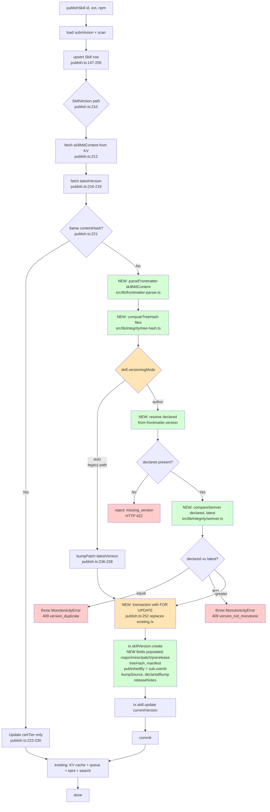
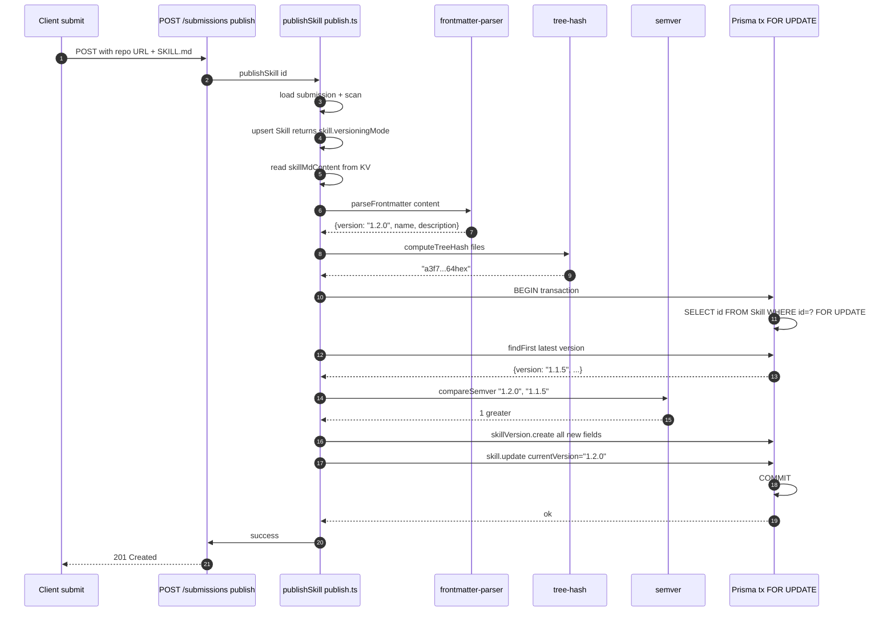
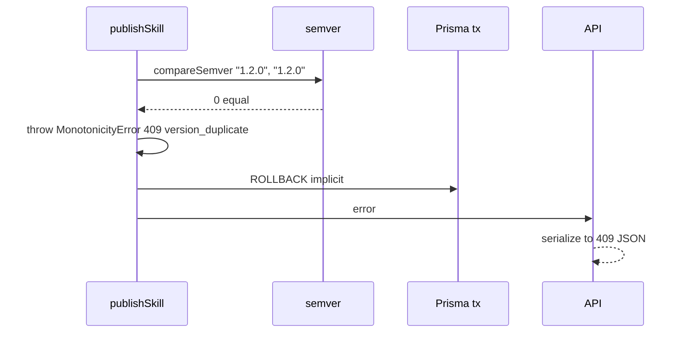

# Plan: Registry Versioning v2 — Phase 1

## 1. Context & scope

This is **Phase 1 of 3** of the NPM-like registry versioning overhaul (source: `~/.claude/plans/immutable-skipping-stardust.md`).

Today `publishSkill()` in `src/lib/submission/publish.ts:210-284` auto-patch-bumps on every content change, hashes only `SKILL.md` (ignoring `scripts/**` — a real supply-chain gap), and has no concept of author intent, pre-releases, yank, deprecate, or attribution. Phase 1 closes the server-side gaps in a **purely additive** way so existing skills continue to behave exactly as they do today (all default to `versioningMode="auto"`).

**In scope (Phase 1)** — server-side only, additive:
- `Skill.versioningMode` flag + branched publish pipeline
- Monotonicity enforcement at the DB edge (duplicate + backward rejection)
- Server `treeHash` matching the vskill CLI algorithm bit-for-bit (0584 shipped CLI-side)
- `publishedBy` attribution from Submission
- New `SkillVersion` fields: `major/minor/patch/prerelease/buildMetadata/treeHash/manifest/releaseNotes/declaredBump/bumpSource/yanked/deprecated/immutable`
- `Skill.distTags` JSON column (seeded to `{latest: currentVersion}`, read-only this phase)
- `DistTagEvent` audit model (created but not written to until Phase 2 exposes `PUT /dist-tags`)
- `POST /api/v1/admin/backfill-versions` — idempotent, internal-auth gated, batched
- Frontmatter parser allowlisting `version`, `name`, `description`

**Out of scope (Phase 2)** — flip-a-flag consumers of Phase 1's data:
- CLI range install grammar (`vskill install foo@^1.2.0`), lockfile v2, `vskill audit`
- Write endpoints: `POST /yank`, `POST /deprecate`, `PUT /dist-tags/:tag`, `GET /resolve`
- LLM diff-classifier advisory (`@anthropic-ai/sdk` is in deps, unused Phase 1)

**Out of scope (Phase 3)**:
- Default `versioningMode="author"` for new skills
- R2 migration for `SkillVersion.content`
- Requiring `version:` in frontmatter

Phase boundaries matter because Phase 2 work depends on Phase 1's schema being deployed and backfilled. Keep Phase 1 self-contained with its own E2E evidence.

## 2. Architecture Decision Records

All ADRs land in `.specweave/docs/internal/architecture/adr/` with the global numbering (next available slots will be picked at commit time — last occupied number observed: `0021-pm-agent-enforcement.md`, plus a parallel zero-padded series — verify before committing). Working local numbers in this plan are **ADR-001…ADR-006**; rename on commit to match repo convention.

---

### ADR-001: Per-skill `versioningMode` flag (not per-user, not global)

**Project**: vskill-platform
**Status**: Proposed
**Decision**: Add `Skill.versioningMode` (`"auto" | "author"`, default `"auto"`).

**Context**
We are introducing author-declared SemVer to a registry that has many skills already publishing under auto-patch-bump semantics. Switching everyone at once breaks every existing publisher that doesn't put `version:` in their frontmatter. We need a migration lane.

**Options considered**

| Option | Pros | Cons |
|---|---|---|
| (a) Per-skill flag | Gradual opt-in; zero blast radius; failure is local to one skill | Adds a column + one branch in `publish.ts` |
| (b) Per-user flag | Author owns their whole portfolio in one toggle | Doesn't exist today (no persistent author model); coarser than needed; harder to reason about when the same author has legacy + new skills |
| (c) Global feature flag | Simplest code | Flip day is high-risk; every existing skill must pre-comply; no per-skill rollback |

**Decision rationale**
Per-skill is the only option that supports **per-repo rollback** (if author-mode publish fails for one skill, others keep working) and a **gradual migration path**: new skills can opt into `"author"` day one; legacy skills stay on `"auto"` forever unless their owner flips them. The added column is trivial; the branch in `publish.ts` is one `if` well-separated from existing logic.

**Trade-offs accepted**
- One extra column on `Skill` — negligible storage cost.
- Callers wanting to query "all author-mode skills" need an index if that becomes a hot path (not indexed in Phase 1; add in Phase 2 if needed).
- An author with 10 skills who wants uniform behavior must flip the flag 10 times. Acceptable — we expect most authors to stay on `"auto"` for Phase 1.

**Consequences**
- `publish.ts` grows a branch at line 231 (the current "version bump" site). Test coverage must assert both paths independently.
- The default `"auto"` makes this migration literally invisible to anyone who doesn't ask for the new behavior.

---

### ADR-002: Server `treeHash` algorithm is byte-identical to the vskill CLI

**Project**: vskill-platform
**Status**: Proposed
**Decision**: The server's `computeTreeHash(files)` MUST produce the same 64-hex-char SHA-256 digest as `computeSha(files)` in `repositories/anton-abyzov/vskill/src/updater/source-fetcher.ts:47-60`.

**Context**
0584 shipped the vskill CLI's tree-hash algorithm. Users already compute it locally for integrity checks during `vskill update` / `vskill install`. If the server uses a different algorithm, the registry returns a hash the client cannot verify — useless.

**The algorithm (normative, copied from `source-fetcher.ts:49-59`)**

```
computeSha(files: Record<string, string>) -> hex64:
  h = SHA256.new()
  sorted_paths = sort(Object.keys(files))   // lexicographic, case-sensitive (JS default sort)
  for path in sorted_paths:
    h.update(path + "\0" + normalizeContent(files[path]) + "\n")
  return h.digest("hex")                    // 64 lowercase hex chars

normalizeContent(s):
  s = s.replace(leading "\uFEFF", "")       // strip BOM
  s = s.replace(/\r\n/g, "\n")              // CRLF -> LF
  return s
```

**Explicit shape:**
- Each entry contributes `<path>\0<normalized-content>\n`. The `\n` after content is required; the `\0` separator between path and content is required.
- Path sort is lexicographic, case-sensitive (JavaScript default `.sort()` on strings).
- Content is UTF-8 encoded before hashing (Node's `Hash.update(string)` uses UTF-8 by default — do not pass Buffers that re-encode).
- Output: 64-char lowercase hex (Node `digest("hex")`).

**Options for server implementation**

| Option | Pros | Cons |
|---|---|---|
| (a) Copy the function into `src/lib/integrity/tree-hash.ts` | Zero new dep; small; fully under our control; auditable | Two copies of the algorithm; drift risk |
| (b) Publish `@vskill/hash` npm package + consume | DRY | New internal npm release just for 10 lines of code; over-engineered for Phase 1 |
| (c) Import from the `vskill` CLI package | DRY | vskill is a CLI, not a library; pulls in its whole dep tree; Workers bundle bloat |

**Decision**: **(a) copy the function** with a pointer comment referencing the CLI source. Add a **contract test** (see §10) that computes the hash of a canned fixture and asserts exact equality against a precomputed CLI-side reference. If the CLI version ever changes its algorithm, the contract test breaks — forcing a deliberate cross-repo update.

**Trade-offs accepted**
- Two copies of a 10-line function in two repos. Drift risk is mitigated by the contract test (a single frozen fixture + expected hex). Cheaper than publishing a micro-package.

**Consequences**
- Clients can verify `treeHash` locally against server-returned values without pulling any new dep.
- Contract test lives at `src/lib/integrity/__tests__/tree-hash-contract.test.ts` with a fixture checked into the repo.

---

### ADR-003: Monotonicity enforced at the DB edge, not pre-check

**Project**: vskill-platform
**Status**: Proposed
**Decision**: Duplicate-version and backward-version rejection happens inside the same Prisma transaction that creates the `SkillVersion` row. No pre-check.

**Context**
In `publish.ts:252-274` the new `SkillVersion` is created inside `db.$transaction`. A naive implementation would:
1. `findFirst` the latest version
2. Check declared vs latest
3. If OK, `create`

That TOCTOU window allows two concurrent publishes to both pass the check and both `create`. The `@@unique([skillId, version])` already prevents the duplicate write, but the **backward** case (`1.0.0` → `0.9.0`) isn't covered by that unique index.

**Options**

| Option | Pros | Cons |
|---|---|---|
| (a) Pre-check + DB unique for duplicates + ignore backward race | Simple | Tiny race window lets backward-move sneak through; hard to reason about |
| (b) All checks inside transaction, with `SELECT FOR UPDATE` on `Skill` row | Atomic; no race | Extra lock on the Skill row; Prisma's `$transaction` supports this via `$executeRaw` |
| (c) DB constraint (trigger) for monotonicity | Fully bulletproof | Postgres-only; not portable; Prisma migration surface is ugly |

**Decision**: **(b)** — all checks inside the transaction, with the Skill row locked for update.

```ts
await db.$transaction(async (tx) => {
  // Serialize concurrent publishes to this specific skill.
  await tx.$executeRaw`SELECT id FROM "Skill" WHERE id = ${skill.id} FOR UPDATE`;

  const latest = await tx.skillVersion.findFirst({
    where: { skillId: skill.id },
    orderBy: [{ major: 'desc' }, { minor: 'desc' }, { patch: 'desc' }, { createdAt: 'desc' }],
  });

  if (mode === 'author') {
    if (latest && compareSemver(declared, latest.version) === 0) {
      throw new MonotonicityError(409, 'version_duplicate', declared, latest.version);
    }
    if (latest && compareSemver(declared, latest.version) < 0) {
      throw new MonotonicityError(409, 'version_not_monotonic', declared, latest.version);
    }
  }

  await tx.skillVersion.create({ data: { /* new fields */ } });
  await tx.skill.update({ where: { id: skill.id }, data: { currentVersion: finalVersion } });
});
```

**Error response shape** (normative — Phase 2 CLI will parse these):

```json
// HTTP 409
{
  "error": "version_not_monotonic",
  "declared": "0.9.0",
  "latest": "1.0.0",
  "skillId": "sk_abc",
  "hint": "Declared version must be strictly greater than latest per SemVer 2.0."
}
```

```json
// HTTP 409
{
  "error": "version_duplicate",
  "declared": "1.0.0",
  "latest": "1.0.0",
  "skillId": "sk_abc",
  "hint": "This exact version is already published. Bump the version in frontmatter."
}
```

The API layer that invokes `publishSkill` catches `MonotonicityError` and returns these payloads with status 409. Any other throw becomes a 500.

**Trade-offs accepted**
- `FOR UPDATE` blocks concurrent publishes to the same skill. Acceptable — skills are rarely published concurrently by design, and the lock window is milliseconds.
- Postgres-specific. The platform already runs on Postgres (Prisma provider in `schema.prisma`); D1 is used elsewhere but not for the Skill tables. Integration tests use Postgres-in-Docker.

**Consequences**
- `auto` mode bypasses the comparison (no declared version to check), but still benefits from `FOR UPDATE` serialization — prevents two concurrent auto-bumps from both picking `patch+1` and colliding on the unique index (a current potential flake source).

---

### ADR-004: SemVer comparison — inline 40-line parser, not `semver` npm

**Project**: vskill-platform
**Status**: Proposed
**Decision**: Ship a minimal SemVer 2.0 parser and comparator in `src/lib/integrity/semver.ts`. Do not add the `semver` npm package.

**Context**
Phase 1 needs to answer exactly two questions: "is A equal to B?" and "is A strictly greater than B?" Full SemVer includes pre-release ordering (`1.0.0-alpha` < `1.0.0-alpha.1` < `1.0.0-beta.2` < `1.0.0-rc.1` < `1.0.0`) and build metadata (ignored in comparison). Phase 2's CLI range-resolver will need much more (`^`, `~`, `>=`, `<`) — that's when a full library pays off.

**Options**

| Option | Bundle cost | Completeness | Fit for Phase 1 |
|---|---|---|---|
| (a) `semver` npm (~80KB unminified, ~25KB min+gz) | High for a Worker | Full | Overkill |
| (b) Inline parser (~40 LOC, ~2KB source) | Zero | Just compare/equal, no ranges | Exact fit |
| (c) Reuse vskill CLI's `version.ts` | Zero | Only does naive 3-part split (line 5: `/^\d+\.\d+\.\d+$/`) — doesn't handle pre-release | Insufficient |

**Decision**: **(b) inline parser**. Covers pre-release ordering per SemVer 2.0 §11. Phase 2 reconsiders when ranges enter the picture — at that point adding `semver` is justified because the whole grammar matters. Workers bundle size matters — we stay under a strict delta budget (§7).

**Reference grammar** (what the parser must handle):
```
VERSION := MAJOR "." MINOR "." PATCH ["-" PRERELEASE] ["+" BUILD]
PRERELEASE := IDENT ("." IDENT)*
IDENT := NUMERIC | ALPHANUMERIC
```

**Comparison rules** (SemVer §11, normative):
1. Compare `MAJOR`, `MINOR`, `PATCH` numerically. First unequal decides.
2. A version **with** pre-release is less than the same version **without**.
3. Pre-release identifiers compare left-to-right:
   - Numeric identifiers: numeric comparison.
   - Alphanumeric identifiers: ASCII lexicographic.
   - Numeric always < alphanumeric.
   - Fewer identifiers < more (when all preceding are equal).
4. Build metadata ignored entirely.

**API surface** (`src/lib/integrity/semver.ts`):

```ts
export interface ParsedVersion {
  major: number;
  minor: number;
  patch: number;
  prerelease: string | null;    // "alpha.1" or null
  buildMetadata: string | null; // "20260423" or null
  raw: string;
}

export function parseSemver(v: string): ParsedVersion | null;
export function compareSemver(a: string, b: string): -1 | 0 | 1;
export function isValidSemver(v: string): boolean;
```

**Trade-offs accepted**
- Hand-rolled parser carries bug risk. Mitigation: the test suite uses the official SemVer 2.0 conformance corpus (~30 vectors — trivial to include as a fixture).
- Phase 2 may end up replacing this with `semver` anyway if ranges land. Acceptable — the internal API (`compareSemver`, `parseSemver`) matches `semver`'s function names for easy swap.

**Consequences**
- Workers bundle stays lean.
- `SkillVersion.major/minor/patch/prerelease/buildMetadata` columns are populated from `parseSemver()` output — single source of truth for structured fields.

---

### ADR-005: Backfill modeled on `backfill-slugs`, batched + idempotent + internal-auth gated

**Project**: vskill-platform
**Status**: Proposed
**Decision**: New endpoint `POST /api/v1/admin/backfill-versions` mirrors the structure of `src/app/api/v1/admin/backfill-slugs/route.ts:34-50`.

**What needs backfilling**
- `SkillVersion.major/minor/patch/prerelease/buildMetadata` — parse from existing `version` string. If unparseable, log and skip (`skipped++`, don't fail the batch).
- `SkillVersion.treeHash` — we do **not** have historical `scripts/**` content. Fallback per ADR-005.a below.
- `SkillVersion.bumpSource` — set to `"legacy-backfill"` for every historical row so Phase 2 consumers know to treat these as imprecise.
- `Skill.distTags` — initialize to `{"latest": <skill.currentVersion>}` where null or `{}`.

**ADR-005.a (sub-decision): Historical `treeHash` fallback**

We don't have historical `scripts/**` snapshots for versions published before this migration. Options:

| Option | Pros | Cons |
|---|---|---|
| (a) Leave `treeHash = null` for historical versions | Honest | Clients hitting historical versions can't verify at all |
| (b) Refetch each version's repo at `gitSha` from GitHub and compute | Accurate | Rate-limited; slow; fails for deleted repos; unpredictable time cost |
| (c) Set `treeHash = contentHash`, flag `bumpSource = "legacy-backfill"` | Fast; documented imprecision | Not cryptographically honest for multi-file skills |

**Decision**: **(c)** with flag. Rationale: Phase 1 users who care about `treeHash` are the CLI's integrity check — and Phase 2 ships the CLI side. For legacy versions the CLI will see `bumpSource="legacy-backfill"` and can decide policy (warn, or skip integrity check, or refuse to install). The imprecision is surfaced, not hidden.

**Structural parallels to `backfill-slugs`** (`src/app/api/v1/admin/backfill-slugs/route.ts:34-50`):
- `await hasInternalAuth(request)` first; fall through to `requireAdmin` if absent.
- Query params: `?dryRun=true`, `?batch=N` (default 100, clamp 1..500). Same param names for muscle memory.
- Dry-run returns the planned changes without writing; production run writes in batches.
- Return shape: `{dryRun, total, updated, skipped, errors, changes: [...][:50 or :10]}`.
- Idempotency: re-running against a fully-backfilled DB produces `updated=0, skipped=total`.

**Idempotency guarantee** (contract test required):
- Row already has `major != null AND treeHash != null AND bumpSource != null` → skip.
- Skill already has `distTags ≠ {}` → skip the `distTags` write for that skill.

**Trade-offs accepted**
- Legacy `treeHash=contentHash` is a fib if the skill has multiple files. The `bumpSource` flag makes it detectable.
- No repo refetch means we never go to GitHub during backfill. Safer + deterministic.

**Consequences**
- Backfill completes in minutes, not hours.
- Callable in prod behind `X-Internal-Key` header (same as `backfill-slugs`).

---

### ADR-006: Frontmatter parsing — inline regex (not `js-yaml`, not `gray-matter`)

**Project**: vskill-platform
**Status**: Proposed
**Decision**: Reuse the inline regex approach already proven in `vskill/src/utils/version.ts:11-25`. Extend it to an allowlist of 3 fields: `version`, `name`, `description`.

**Context**
Phase 1 reads exactly one field from frontmatter in the hot publish path: `version`. Maybe `name` and `description` for a belt-and-suspenders check that SKILL.md's declared name matches the submission's `skillName`. That is the entire consumption surface for Phase 1.

**Options**

| Option | Bundle cost | Security surface | Fit |
|---|---|---|---|
| (a) `js-yaml` | ~50KB min+gz | Must disable `!!js/function` etc. — default safe in `js-yaml@4`, but still parses YAML types we don't need | Overkill |
| (b) `gray-matter` | ~40KB + `js-yaml` dep | Bundles js-yaml + adds a convenience layer we don't use | Overkill |
| (c) Inline regex for 3 specific fields | Zero | Only matches `^field:\s*value$` — can't parse nested structures at all | Exact fit for a 3-field allowlist |

**Decision**: **(c) inline regex, field-allowlisted**. If a malicious submitter tries `version: !!js/function 'return 7'`, our regex rejects it (doesn't match the allowed pattern — same kind of `SEMVER_RE` guard as in `version.ts:5`). No YAML tag surface means zero YAML tag exploits.

**Parser contract** (`src/lib/frontmatter-parser.ts`):

```ts
export interface ParsedFrontmatter {
  version?: string;        // validated via isValidSemver()
  name?: string;           // [a-z0-9-]+ up to 80 chars
  description?: string;    // UTF-8 string up to 500 chars, newlines escaped
}

export function parseFrontmatter(content: string): ParsedFrontmatter;
// Returns {} if no frontmatter block; never throws.
// Unknown fields are ignored silently.
// Invalid values (version that fails semver, name with bad chars) are omitted.
```

**Security posture**
- Allowlist, not denylist.
- Hard size cap: frontmatter block > 4KB → return `{}`. Prevents pathological regex input.
- No YAML anchors, aliases, tags, flow style. We don't parse YAML at all.
- Explicit `name` / `description` length caps prevent DB blow-up via submitted frontmatter.

**Trade-offs accepted**
- We lose the ability to read nested frontmatter (e.g., `labels: [...]`). Phase 1 doesn't need any. Phase 2 or 3 can switch to `js-yaml` when the field set grows and the hand-rolled parser starts to smell.
- If authors use exotic YAML (`version: &v "1.0.0"`), we fall back to `"auto"` mode silently (no declared version found). That's the right failure mode — author's fault, not ours.

**Consequences**
- Zero new npm deps for Phase 1.
- The existing `vskill/src/utils/version.ts:11-25` algorithm is re-implemented server-side with the same regex; a contract test asserts both parse identical fixtures identically.

---

## 3. Schema diff (Prisma)

All changes are additive. Zero column removals. Zero type changes. No renames. Default values preserve existing behavior.

### `prisma/schema.prisma` — `Skill` model (line 214-344, additive)

```prisma
model Skill {
  // ... existing fields ...

  // ─── Versioning v2 (ADR-001) ─────────────────────────────────────
  /// Opt-in per-skill flag for author-declared versioning.
  /// "auto"   = legacy patch-bump on every content change (default — no behavior change).
  /// "author" = publish reads `version:` from frontmatter and enforces monotonicity.
  versioningMode  String   @default("auto")

  /// Dist-tags table. Phase 1: seeded to {"latest": <currentVersion>} by backfill.
  /// Phase 2 exposes PUT /dist-tags/:tag to mutate this. Read-only this phase.
  distTags        Json     @default("{}")

  /// Pointer to the most recent non-pre-release, non-yanked version.
  /// Null until an eligible version exists. Updated by the publish transaction.
  latestStable    String?

  // Index to support Phase 2 admin queries ("all author-mode skills").
  // Deferred: not added Phase 1 — no hot query uses it yet.
  // @@index([versioningMode])
}
```

### `prisma/schema.prisma` — `SkillVersion` model (line 349-381, additive)

```prisma
model SkillVersion {
  // ... existing fields (id, skillId, version, contentHash, gitSha, certTier, ...) ...

  // ─── Structured SemVer components (ADR-004) ──────────────────────
  /// Parsed from `version` string. Null for versions that fail semver parse
  /// (caller treats row as opaque-version-only — sort by createdAt).
  major           Int?
  minor           Int?
  patch           Int?
  /// Dot-separated pre-release identifiers, e.g. "alpha.1" or "rc.2". Null = stable.
  prerelease      String?
  /// Build metadata from after "+". Not used in comparison per SemVer §10.
  buildMetadata   String?

  // ─── Integrity (ADR-002) ─────────────────────────────────────────
  /// SHA-256 Merkle root over all files in skill dir (SKILL.md + scripts/** + references/**).
  /// Algorithm matches vskill CLI's computeSha() — see tree-hash.ts + contract test.
  /// Null for legacy-backfill rows (bumpSource="legacy-backfill").
  treeHash        String?
  /// Per-file manifest: [{path, sha256, size}]. Enables selective integrity check
  /// without refetching the whole skill tree.
  manifest        Json?

  // ─── Author-facing metadata ──────────────────────────────────────
  /// Markdown release notes. Null for auto-bumped versions.
  releaseNotes    String?
  /// Author-declared bump kind: "major" | "minor" | "patch" | "prerelease".
  /// Used by Phase 2 LLM classifier to spot misdeclared bumps.
  declaredBump    String?
  /// How the version number was produced: "frontmatter" | "auto-patch" | "legacy-backfill".
  bumpSource      String?

  // ─── Lifecycle flags (Phase 1: written only, not enforced — Phase 2 adds the APIs) ──
  yanked          Boolean   @default(false)
  yankedAt        DateTime?
  yankReason      String?
  deprecated      Boolean   @default(false)
  deprecationMsg  String?

  // ─── Attribution ─────────────────────────────────────────────────
  /// User ID from Submission.userId. Null for backfilled rows where submission was lost.
  publishedBy     String?
  /// Versions are append-only once published. Defaults to true — set false only by
  /// internal admin operations (never by publish path).
  immutable       Boolean   @default(true)

  // ─── Existing indexes + new composites ───────────────────────────
  // Existing: @@unique([skillId, version]), @@index([skillId]), @@index([createdAt(sort: Desc)])
  // New:
  @@index([skillId, major, minor, patch])           // Phase 2 ORDER BY resolver
  @@index([skillId, yanked, createdAt(sort: Desc)]) // Phase 2 "latest non-yanked" query
}
```

### `prisma/schema.prisma` — NEW `DistTagEvent` model

```prisma
/// Audit log for dist-tag mutations. Phase 1: model exists, no writes.
/// Phase 2 populates on every PUT /dist-tags/:tag call.
model DistTagEvent {
  id        String   @id @default(uuid())
  skillId   String
  /// Tag name: "latest", "next", "beta", etc.
  tag       String
  /// Version pointed at by the tag at this event time.
  version   String
  /// User ID of the admin/author who made the change.
  actor     String
  createdAt DateTime @default(now())

  @@index([skillId, tag, createdAt(sort: Desc)])
}
```

### Migration file

`prisma/migrations/{YYYYMMDDHHMMSS}_versioning_v2_phase1/migration.sql` — generated by `npx prisma migrate dev --create-only`. Expected SQL shape (for review before applying):
- 3 `ALTER TABLE "Skill" ADD COLUMN` (versioningMode, distTags, latestStable)
- ~13 `ALTER TABLE "SkillVersion" ADD COLUMN`
- 1 `CREATE TABLE "DistTagEvent"`
- 2 `CREATE INDEX` on SkillVersion
- 1 `CREATE INDEX` on DistTagEvent

All columns nullable or with defaults — zero `NOT NULL` additions against existing rows, so migration is online-safe.

---

## 4. Call graph — where new branches land



Legend:
- Green = new Phase 1 code
- Amber = existing code with modifications
- Red = new error paths

Injection site is the `else` branch at `publish.ts:231` where the new SkillVersion is created. The "same contentHash" short-circuit at line 221 stays unchanged — no version row written, same as today.

---

## 5. Component breakdown

### 5.1 `src/lib/frontmatter-parser.ts` (NEW)
**Project**: vskill-platform
**Responsibility**: Extract allowlisted fields (`version`, `name`, `description`) from SKILL.md frontmatter. Never throws. Never executes YAML tags.
**Dependencies**: none (pure string ops).
**Ref**: ADR-006.

### 5.2 `src/lib/integrity/semver.ts` (NEW)
**Project**: vskill-platform
**Responsibility**: `parseSemver()`, `compareSemver()`, `isValidSemver()` per SemVer 2.0 §§2, 9, 10, 11.
**Dependencies**: none.
**Ref**: ADR-004.

### 5.3 `src/lib/integrity/tree-hash.ts` (NEW)
**Project**: vskill-platform
**Responsibility**: `computeTreeHash(files: Record<string, string>): string`. Byte-identical to CLI `computeSha()`.
**Dependencies**: `node:crypto` (available in Workers via `@cloudflare/unenv-preset`).
**Ref**: ADR-002.

### 5.4 `src/lib/integrity/errors.ts` (NEW)
**Project**: vskill-platform
**Responsibility**: `MonotonicityError extends Error` carrying `{statusCode: 409, code, declared, latest}`. Serialized to HTTP 409 by the API layer.
**Ref**: ADR-003.

### 5.5 `src/lib/submission/publish.ts` (MODIFIED)
**Project**: vskill-platform
**Responsibility**: Branch the existing `else` block at line 231 on `skill.versioningMode`. Wrap the existing transaction at line 252 with `FOR UPDATE`. Populate new fields on create. Emit `MonotonicityError` for author-mode rejections.
**Ref**: ADR-001, ADR-003.

### 5.6 `src/app/api/v1/admin/backfill-versions/route.ts` (NEW)
**Project**: vskill-platform
**Responsibility**: Batched, idempotent backfill. Auth via `hasInternalAuth()` first, `requireAdmin()` fallback. `?dryRun=true` support.
**Dependencies**: `src/lib/internal-auth.ts`, `src/lib/auth.ts`, `src/lib/db.ts`, new `semver.ts`.
**Ref**: ADR-005, mirrors `backfill-slugs/route.ts:34-50`.

### 5.7 `prisma/schema.prisma` (MODIFIED) + `prisma/migrations/*` (NEW)
**Project**: vskill-platform
**Responsibility**: Additive schema changes per §3. Generated migration SQL reviewed before `migrate deploy`.

**Migration applied to prod on 2026-04-24** (discovered via 0695 investigation — the increment had been marked `completed` on 2026-04-23 but the `prisma migrate deploy` step was never run, so the deployed Prisma client SELECTed columns that didn't exist, throwing `column "(not available)" does not exist` on every `Skill.findMany` / `findUnique` — this broke `/skills`, `/api/v1/skills`, stats cron, and `getSkillByName` on verified-skill.com).

Applied the 18 `ADD COLUMN` + 1 `CREATE TABLE` + 3 `CREATE INDEX` statements from [prisma/migrations/20260423132315_versioning_v2_phase1/migration.sql](../../../repositories/anton-abyzov/vskill-platform/prisma/migrations/20260423132315_versioning_v2_phase1/migration.sql) directly against prod Neon via `@neondatabase/serverless`, then ran `prisma migrate resolve --applied 20260423132315_versioning_v2_phase1` to record the state in `_prisma_migrations`. Full 11/11 prod smoke green immediately after.

Note: migration `20260421100000_submission_unique_repo_skill` (from 0672) remains unapplied — it has a precondition (`scripts/migrations/0672-collapse-submission-dupes.ts`) that cannot run against prod via the Neon HTTP driver because there are 91 159 duplicate `(repoUrl, skillName)` groups on Submission and the victim archive query exceeds the 64 MB response cap. That is a separate data-integrity issue outside 0680's scope; a future increment needs to either stream the collapse in chunks or run it via `psql` over the direct (non-HTTP) endpoint.

### 5.8 `tests/e2e/skill-versioning.spec.ts` (NEW)
**Project**: vskill-platform
**Responsibility**: Playwright E2E — submit v1.0.0, edit, resubmit, verify auto-bump to 1.0.1. Assert versions page renders both rows. Assert `GET /api/v1/skills/{owner}/{repo}/{skill}/versions` returns the right shape.
**Ref**: §10 Testing Strategy.

---

## 6. Data flow (publish pipeline, mode = `"author"`)



Rejection path (duplicate):



---

## 7. Non-functional requirements

| Requirement | Target | Measurement |
|---|---|---|
| Publish latency (p95) | ≤ current +10ms | Pre/post Grafana panel on `publishSkill_duration_ms` |
| Workers bundle size | +≤8KB min+gz (semver + parser + tree-hash + error class) | `wrangler deploy --dry-run` before/after |
| Backfill throughput | ≥1000 rows/sec dry-run, ≥200 rows/sec write | Measured during staging dry-run |
| Concurrent publish safety | Zero duplicate-version rows observable in DB under 50 concurrent publishes to same skill | Load test in integration env |
| Migration downtime | 0s | `ALTER TABLE ADD COLUMN` with defaults is online on Postgres ≥11 |

---

## 8. Security posture

- **Frontmatter**: allowlist-only parse (ADR-006). No YAML tag surface.
- **treeHash collision**: SHA-256 pre-image resistance is the backstop. Manifest's per-file SHA-256 means a collision must happen on at least one file.
- **Backfill endpoint**: `hasInternalAuth` (header `X-Internal-Key`) first, `requireAdmin` (JWT) fallback. Same posture as `backfill-slugs`.
- **MonotonicityError response**: leaks only `declared` and `latest` — both already visible via `GET /versions`. No information disclosure beyond status quo.
- **FOR UPDATE lock scope**: only locks the specific Skill row. Fan-out risk = zero.
- **publishedBy**: sourced from `submission.userId`. If null (anonymous or historical), stays null — no fallback to `"unknown"` string (prevents attribution confusion).

---

## 9. Rollout plan

### Phase 1 (this increment)
1. Land schema migration. Deploy to staging. Verify no existing data regressions (`SELECT COUNT(*)` before/after on all affected tables).
2. Deploy code with the feature latent: `publishSkill` behavior unchanged because every existing row has `versioningMode="auto"`.
3. Run `POST /api/v1/admin/backfill-versions?dryRun=true` → review change preview → run without dryRun.
4. Enable one canary skill (internal: `antonabyzov/vskill-demo` or similar) by setting `versioningMode="author"` via admin UI or direct DB update. Verify the full publish cycle end-to-end.
5. Ship to prod.

### Phase 2 (future increment, not this one)
- CLI: range install grammar, lockfile v2, `vskill audit`.
- Server: `GET /resolve`, `POST /yank`, `POST /deprecate`, `PUT /dist-tags/:tag`.
- Server: LLM diff-classifier advisory (uses `@anthropic-ai/sdk` already in deps).
- Admin UI: dist-tag editor, yank button.

### Phase 3 (future increment)
- Default `versioningMode="author"` for newly-created skills.
- R2 migration for `SkillVersion.content` (reduces Postgres row size).
- Deprecate `"auto"` mode — emit warnings on auto-bumped publishes; block after N weeks.

### Rollback procedure (Phase 1)
- Schema changes are additive — no rollback migration needed. If we need to revert code, the new columns remain null and are ignored.
- If a specific skill's author-mode publish is broken, flip `versioningMode` back to `"auto"` via admin SQL: `UPDATE "Skill" SET "versioningMode" = 'auto' WHERE name = ?`. Next publish works on legacy path.
- If the whole author path is broken, set all skills back to `"auto"` with one `UPDATE "Skill" SET "versioningMode" = 'auto'` and ship a hotfix — zero data loss because all new columns are optional/defaulted.

---

## 10. Testing strategy (strict TDD per config)

### Test pyramid

```
          [1 E2E]           ← skill-versioning.spec.ts (Playwright)
        [3-4 integration]   ← real Prisma (Postgres in Docker)
      [~30 unit]            ← mocked Prisma, vi.hoisted() + vi.mock()
    [1 contract]            ← server treeHash == CLI treeHash fixture
```

### Test files to create (RED before GREEN, per `testing.tddEnforcement: strict`)

| File | Level | Purpose |
|---|---|---|
| `src/lib/__tests__/frontmatter-parser.test.ts` | unit | Allowlist behavior; 4KB cap; invalid semver rejected; missing FM returns `{}`; CRLF handled |
| `src/lib/integrity/__tests__/semver.test.ts` | unit | Parse + compare + equal + prerelease ordering against SemVer 2.0 conformance fixture |
| `src/lib/integrity/__tests__/tree-hash.test.ts` | unit | Sort stability; CRLF → LF; BOM stripped; empty input |
| `src/lib/integrity/__tests__/tree-hash-contract.test.ts` | **contract** | Hash fixture files with precomputed hex produced by vskill CLI's `computeSha()` — exact match |
| `src/lib/__tests__/skill-version-creation.test.ts` | unit | **Existing 9/9 tests stay green** — regression guard for `versioningMode="auto"` |
| `src/lib/__tests__/skill-version-author-mode.test.ts` | unit | NEW — covers the 3 new branches: accept, reject-duplicate, reject-backward; follow existing hoisted `mockDb` pattern from `skill-version-creation.test.ts` |
| `src/lib/submission/__tests__/publish-integration.test.ts` | integration | Real Prisma; simulate concurrent publishes to same skill; assert no duplicate rows under `FOR UPDATE` |
| `src/app/api/v1/admin/backfill-versions/__tests__/route.test.ts` | integration | Dry-run returns expected changes; real run writes them; re-run is idempotent |
| `tests/e2e/skill-versioning.spec.ts` | **E2E** | Submit v1.0.0 → edit SKILL.md → resubmit → assert versions list shows 1.0.0 + 1.0.1 with correct `diffSummary` |

### Unit test mocking pattern (continue the existing idiom)

```ts
// src/lib/__tests__/skill-version-author-mode.test.ts
import { describe, it, expect, vi, beforeEach } from 'vitest';

const { mockDb } = vi.hoisted(() => ({
  mockDb: {
    skill: { upsert: vi.fn(), update: vi.fn(), findUnique: vi.fn() },
    skillVersion: { findFirst: vi.fn(), create: vi.fn() },
    $transaction: vi.fn(async (fn) => fn(mockDb)),
    $executeRaw: vi.fn(),
    submission: { update: vi.fn() },
  },
}));

vi.mock('@/lib/db', () => ({ getDb: async () => mockDb }));
vi.mock('@/lib/submission/kv-store', () => ({ /* ... */ }));

describe('publishSkill — author mode', () => {
  beforeEach(() => vi.clearAllMocks());

  it('accepts a declared version strictly greater than latest', async () => { /* ... */ });
  it('rejects duplicate with MonotonicityError 409 version_duplicate', async () => { /* ... */ });
  it('rejects backward move with 409 version_not_monotonic', async () => { /* ... */ });
  it('populates publishedBy from submission.userId', async () => { /* ... */ });
  it('populates treeHash from tree-hash.ts', async () => { /* ... */ });
  it('sets bumpSource="frontmatter" when version came from YAML', async () => { /* ... */ });
});
```

### Integration test: concurrent publish safety

Spawn 50 simultaneous `publishSkill()` calls against the same `Skill` row in a real Postgres test container. Assert:
- Exactly one succeeds for any given declared version.
- Zero duplicate `(skillId, version)` rows.
- The `FOR UPDATE` serialization keeps total wall time bounded (< N × single-publish time, where N = 50).

### E2E test: the "staff engineer would approve" evidence

`tests/e2e/skill-versioning.spec.ts` — the single piece of runnable evidence the user can execute to verify Phase 1 end-to-end:

```
1. POST /submissions { repoUrl, skillName } — skill has SKILL.md body "# v1"
2. Wait for publish (poll state until PUBLISHED, max 30s)
3. GET /api/v1/skills/{o}/{r}/{s}/versions → expect 1 row, version="1.0.0"
4. POST /submissions again — same repo, SKILL.md body "# v1\nNEW"
5. Wait for publish
6. GET versions → expect 2 rows; newest version="1.0.1", diffSummary contains "+1"
7. Navigate to /skills/{o}/{r}/{s}/versions (browser) — both rows render
8. GET /versions/diff?from=1.0.0&to=1.0.1 → contentDiff contains "+NEW"
```

No author-mode flag is flipped — this proves the regression guard: default `"auto"` mode still works exactly as before Phase 1.

### Coverage targets (per frontmatter `coverage_target: 90`)
- New code: ≥95% line coverage. Inline parsers are trivial to cover fully.
- Modified `publish.ts` branch: 100% — both paths (auto, author) + all 3 author-mode rejection paths.

---

## 11. Risks + mitigations

| Risk | Likelihood | Impact | Mitigation |
|---|---|---|---|
| Hand-rolled semver parser has a bug vs SemVer 2.0 | Low | Medium | SemVer 2.0 conformance vector fixture (~30 cases) in `semver.test.ts` |
| Server tree-hash drifts from CLI | Low | High (breaks client-side integrity check) | Contract test with CLI-produced fixture; run in CI |
| `FOR UPDATE` causes publish lock contention in prod | Low | Low | Lock scope is single Skill row; no cross-skill locks; p95 latency monitored |
| Backfill misparses exotic versions | Medium | Low | Skip on parse failure; count in `skipped`; never fail the batch |
| Historical `treeHash = contentHash` misleads clients | Medium | Low | `bumpSource="legacy-backfill"` flag makes it detectable |
| Workers bundle exceeds 1MB after changes | Low | Medium | Inline parsers (no `js-yaml` / `semver` / `gray-matter`) keep bundle delta ≤8KB |
| Migration breaks in prod | Low | High | All columns nullable or defaulted; online-safe on Postgres; dry-run in staging first |

---

## 12. Dependencies on existing code (verified during exploration)

| File | Line | Use |
|---|---|---|
| `src/lib/submission/publish.ts` | 210-284 | Primary injection point — branch here |
| `src/lib/submission/kv-store.ts` | 34-43 | `getKV()` — unchanged, reused |
| `src/lib/submission/kv-store.ts` | 212 (publish.ts) | `kv.get("skillmd:...")` — source of SKILL.md content |
| `src/lib/auth.ts` | 64-100 | `AdminTokenPayload` + `verifyAccessToken` — admin gate for backfill |
| `src/lib/internal-auth.ts` | 7-23 | `hasInternalAuth()` — primary gate for backfill |
| `src/app/api/v1/admin/backfill-slugs/route.ts` | 34-50 | Structural template for new backfill endpoint |
| `src/lib/db.ts` | — | `getDb()` — Prisma client factory, unchanged |
| `prisma/schema.prisma` | 214-381 | Schema additions |
| `repositories/anton-abyzov/vskill/src/updater/source-fetcher.ts` | 47-60 | `computeSha()` — source of truth for treeHash algorithm |
| `repositories/anton-abyzov/vskill/src/utils/version.ts` | 11-25 | `extractFrontmatterVersion()` — contract parity reference |

**Unused in Phase 1 (reserved for Phase 2):**
- `@anthropic-ai/sdk` (in `package.json` as `^0.78.0`) — will back the LLM diff-classifier.

---

## 13. Open questions for PM / user

None blocking Phase 1 implementation. These are Phase 2/3 decisions surfaced now so the user can weigh them later:

- Who can flip `versioningMode` on an existing skill — the author, an admin, or both? (Phase 2 API design)
- What is the yank retention policy — is a yanked version hard-deleted after N days, or retained forever for audit? (Phase 2 schema consequence)
- Should Phase 3 force-migrate legacy skills to `"author"`, or leave them on `"auto"` indefinitely? (Phase 3 scope)

---

## 14. Delegation to domain skills

Implementation will proceed via the SpecWeave default `sw:architect` skill (no domain plugins needed — all work is Node/TypeScript/Prisma in a single project).

- Schema + migration: `sw:architect` + `prisma migrate dev --create-only` for review.
- Code: straight TDD via `/sw:tdd-cycle`.
- E2E: standard Playwright — no `sw:e2e` skill needed beyond defaults.
- Closure: `/sw:done` runs the full gate chain (code-review → simplify → grill → judge-llm → PM validation).
