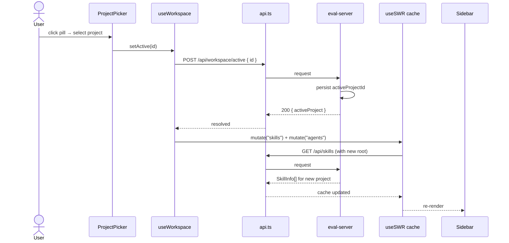

# Implementation Plan: Skill Studio — multi-project + Anthropic-aligned scopes + plugin visibility

**Increment**: 0698-studio-multiproject-anthropic-scopes
**Target repo**: `repositories/anton-abyzov/vskill/`
**Approved plan source**: `~/.claude/plans/eventual-dazzling-dahl.md`
**Stack (verified)**: React 19.2, TypeScript, Vite, Tailwind v4, Node HTTP server (no framework), Vitest 3, Playwright. Data fetching via custom `useSWR` hook (NOT React Query — assumption in source plan corrected).

---

## 1. Overview

Replace the current tri-scope (`own/installed/global`) model with a 5-value `SkillScope` union that maps 1:1 to Anthropic's official skill source channels, and add a user-global project registry so Skill Studio can switch between multiple project roots without a restart. The UI reorganizes around two top-level groups — **AVAILABLE** (skills Claude can invoke now) and **AUTHORING** (skills the user is writing) — each split by source. Plugin-bundled skills become visible under both umbrellas for the first time.

### Shape of the change

- **Backend**: 1 new module (`workspace-store`), 2 new scanners (`plugin-scanner`, `standalone-skill-scanner`), 1 refactored scanner (`skill-scanner`), 4 new REST endpoints, `EvalServerOptions.root` → optional.
- **Frontend**: 3 new components (`ProjectPicker`, `ProjectCommandPalette`, `GroupHeader`), 1 new hook (`useWorkspace`), 1 new lib (`scope-migration`), sidebar restructure, `api.ts` normalizer, localStorage key rename.
- **Migration**: legacy `own/installed/global` wire values accepted by the normalizer for 1 release so 0688 can land on old names without blocking.

### Non-goals (explicit)

Filesystem project auto-scan, bulk-across-projects editing, Enterprise scope, plugin install/uninstall UI, plugin-authoring wizard, `.vskill-meta.json` migration — all phase 2+.

---

## 2. Architecture

### 2.1 Component diagram

```mermaid
graph TB
    subgraph CLI[CLI — specweave/vskill]
        CLI_FLAG["--root ./foo (optional)"]
    end

    subgraph FS[User filesystem]
        FS_WS["~/.vskill/workspace.json<br/>(NEW user-global)"]
        FS_PROJ_LOCAL[".claude/skills/<br/>(project scope)"]
        FS_PERSONAL["~/.claude/skills/<br/>(personal scope)"]
        FS_PLUGIN_CACHE["~/.claude/plugins/cache/<br/>&lt;mkt&gt;/&lt;plugin&gt;/&lt;version&gt;/skills/<br/>(installed plugins)"]
        FS_PROJ_PLUGIN["<proj>/**/.claude-plugin/<br/>plugin.json + skills/<br/>(authoring plugins)"]
        FS_PROJ_STANDALONE["<proj>/skills/<br/>(authoring standalone)"]
        FS_STUDIO_JSON[".vskill/studio.json<br/>(unchanged, per-project)"]
    end

    subgraph Server[eval-server]
        WS[workspace-store.ts<br/>NEW]
        SS[skill-scanner.ts<br/>REFACTORED<br/>produces 5-scope + shadow]
        PS[plugin-scanner.ts<br/>NEW<br/>installed + authored]
        ST[standalone-skill-scanner.ts<br/>NEW]
        AR[api-routes.ts<br/>EDITED<br/>+workspace endpoints]
        ES[eval-server.ts<br/>EDITED<br/>root now optional]
    end

    subgraph UI[eval-ui React SPA]
        MAIN[main.tsx]
        MIG[scope-migration.ts<br/>NEW]
        UW[useWorkspace.ts<br/>NEW]
        API[api.ts<br/>+legacy normalizer]
        PP[ProjectPicker.tsx<br/>NEW]
        PCP[ProjectCommandPalette.tsx<br/>NEW CmdP]
        GH[GroupHeader.tsx<br/>NEW]
        PG[PluginGroup.tsx<br/>REFACTOR nested]
        SB[Sidebar.tsx<br/>RESTRUCTURED]
        SL[StudioLayout.tsx<br/>EDITED]
        SBAR[StatusBar.tsx<br/>TRIMMED]
    end

    CLI_FLAG -.->|seed if empty| WS
    WS <-->|read/write| FS_WS
    WS -->|activeProjectId| ES
    ES -->|resolve per-request root| AR
    AR --> SS
    AR --> PS
    AR --> ST
    SS --> FS_PROJ_LOCAL
    SS --> FS_PERSONAL
    PS -->|scanInstalled| FS_PLUGIN_CACHE
    PS -->|scanAuthored| FS_PROJ_PLUGIN
    ST --> FS_PROJ_STANDALONE
    ST -.skip plugin-source ancestors.-> FS_PROJ_PLUGIN

    MAIN -->|run once before mount| MIG
    MAIN --> UW
    UW -->|GET /api/workspace| AR
    UW -->|switch → mutate "skills"| API
    API --> SL
    SL --> PP
    SL --> SB
    SL --> SBAR
    PP --> PCP
    SB --> GH
    SB --> PG
```

### 2.2 Data-flow: project switch



### 2.3 Scope resolution pipeline

```mermaid
flowchart LR
    Root[activeProjectId.path] --> SS[skill-scanner]
    Home["~/"] --> SS
    Home --> PS1[plugin-scanner.scanInstalled]
    Root --> PS2[plugin-scanner.scanAuthored]
    Root --> ST2[standalone-skill-scanner]

    SS --> AvProj["available-project"]
    SS --> AvPers["available-personal"]
    PS1 --> AvPlugin["available-plugin<br/>(CC-only)"]
    ST2 --> AuProj["authoring-project"]
    PS2 --> AuPlugin["authoring-plugin<br/>(CC-only)"]

    AvProj --> PRE[precedence pass<br/>within AVAILABLE only]
    AvPers --> PRE
    AvPlugin -.orthogonal.-> MERGE
    PRE --> MERGE[SkillInfo\[\]]
    AuProj --> MERGE
    AuPlugin --> MERGE
```

---

## 3. Data model

All types live in `src/eval-ui/src/types.ts` (frontend) and are re-exported from `src/eval/skill-scanner.ts` for server use.

### 3.1 `SkillScope` union

```ts
export type SkillGroup  = "available" | "authoring";
export type SkillSource = "project" | "personal" | "plugin";

// 5 valid combinations — "available-personal × plugin" is not a thing, and
// "authoring-personal" is intentionally excluded (no ~/.claude/skills authoring).
export type SkillScope =
  | "available-project"    // <root>/.claude/skills/<skill>/SKILL.md
  | "available-personal"   // ~/.claude/skills/<skill>/SKILL.md
  | "available-plugin"     // ~/.claude/plugins/cache/<mkt>/<plugin>/<ver>/skills/<skill>/SKILL.md
  | "authoring-project"    // <root>/skills/<skill>/SKILL.md (no sibling plugin.json)
  | "authoring-plugin";    // <root>/<plugin>/.claude-plugin/plugin.json + skills/
```

`group` and `source` are derived (`scope.split("-") as [SkillGroup, SkillSource]`). We keep them as separate optional fields on `SkillInfo` for cheap UI access.

### 3.2 `SkillInfo` additions

```ts
export interface SkillInfo {
  // existing fields retained as-is
  scope?: SkillScope;
  group?: SkillGroup;
  source?: SkillSource;

  // Plugin metadata (populated when source === "plugin")
  pluginName?: string | null;           // "anthropic-skills"
  pluginNamespace?: string | null;      // "anthropic-skills:pdf" (display label)
  pluginMarketplace?: string | null;    // AVAILABLE>Plugins only
  pluginVersion?: string | null;        // "1.0.3" — NEW (verified actual path segment)
  pluginManifestPath?: string | null;   // AUTHORING>Plugins only — abs path to plugin.json

  // Precedence (within AVAILABLE only)
  precedenceRank?: number;              // personal=1, project=2 (lower wins); plugin=-1 (orthogonal, never shadowed)
  shadowedBy?: SkillScope | null;
}
```

**Note on `pluginVersion`**: verified against the actual cache layout on this machine (`~/.claude/plugins/cache/specweave/sw/1.0.0/skills/`, `~/.claude/plugins/cache/openai-codex/codex/1.0.3/skills/`). The source plan omitted this segment — without it the scanner will miss all installed plugins. The `.claude-plugin/plugin.json` manifest lives at the version dir (confirmed: `~/.claude/plugins/cache/specweave/sw/1.0.0/.claude-plugin/plugin.json`).

### 3.3 `ProjectConfig` and `WorkspaceConfig`

```ts
export interface ProjectConfig {
  id: string;         // sha1(absolutePath).slice(0,12)
  name: string;       // editable, defaults to basename(path)
  path: string;       // absolute, no trailing slash
  colorDot: string;   // deterministic oklch() from path hash
  addedAt: string;    // ISO8601
  lastActiveAt?: string;
}

export interface WorkspaceConfig {
  version: 1;
  activeProjectId: string | null;
  projects: ProjectConfig[];
}
```

### 3.4 `workspace.json` JSON schema

Persisted at `~/.vskill/workspace.json` (user-global; not committed, not per-project). Atomic write via `fs.writeFileSync(tmp) + fs.renameSync(tmp, final)`.

```json
{
  "$schema": "http://json-schema.org/draft-07/schema#",
  "title": "VskillWorkspace",
  "type": "object",
  "required": ["version", "activeProjectId", "projects"],
  "properties": {
    "version": { "const": 1 },
    "activeProjectId": { "type": ["string", "null"] },
    "projects": {
      "type": "array",
      "items": {
        "type": "object",
        "required": ["id", "name", "path", "colorDot", "addedAt"],
        "properties": {
          "id":         { "type": "string", "pattern": "^[a-f0-9]{12}$" },
          "name":       { "type": "string", "minLength": 1, "maxLength": 80 },
          "path":       { "type": "string", "pattern": "^/" },
          "colorDot":   { "type": "string", "pattern": "^oklch\\(" },
          "addedAt":    { "type": "string", "format": "date-time" },
          "lastActiveAt": { "type": "string", "format": "date-time" }
        }
      }
    }
  }
}
```

Unknown fields are preserved on read-modify-write to be forward-compatible with future phases.

---

## 4. API contracts

All new routes live in `src/eval-server/api-routes.ts`. CORS already handled by the router.

### 4.1 `GET /api/workspace`

```ts
// Response 200
interface WorkspaceResponse {
  workspace: WorkspaceConfig;
  activeProject: ProjectConfig | null;       // hydrated from activeProjectId
  staleProjectIds: string[];                  // ids whose path no longer existsSync()
}
```

- Zero-project empty state: `{ workspace: { version: 1, activeProjectId: null, projects: [] }, activeProject: null, staleProjectIds: [] }`.
- If `EvalServerOptions.root` was passed and workspace is empty, the server auto-seeds a single project from that path and sets it active (CLI parity — see §7.3).

### 4.2 `POST /api/workspace/projects`

```ts
// Request
interface AddProjectRequest { path: string; name?: string; }

// Response 201
interface AddProjectResponse { project: ProjectConfig; workspace: WorkspaceConfig; }

// Errors
// 400 — { error: "invalid-path", message }     — path not absolute / not a directory
// 409 — { error: "already-registered", existingId }
```

### 4.3 `DELETE /api/workspace/projects/:id`

```ts
// Response 200
interface RemoveProjectResponse { workspace: WorkspaceConfig; }

// Errors
// 404 — { error: "not-found", id }
```

Removing the active project sets `activeProjectId = null` and returns the updated workspace.

### 4.4 `POST /api/workspace/active`

```ts
// Request
interface SetActiveRequest { id: string | null; }

// Response 200
interface SetActiveResponse {
  workspace: WorkspaceConfig;
  activeProject: ProjectConfig | null;
}

// Errors
// 404 — { error: "not-found", id }
// 400 — { error: "stale-path", id }            // path no longer exists on disk
```

Side-effect: updates `ProjectConfig.lastActiveAt = now`.

### 4.5 Per-request root resolution

`registerRoutes(router, root?, opts)` becomes `registerRoutes(router, opts)`. Every route that previously closed over `root` now reads `workspaceStore.getActiveRoot()` on each request. If no project is active, routes that require a root return `409 { error: "no-active-project" }` — the UI shows an empty state instead of erroring.

---

## 5. Scanner algorithms

### 5.1 `skill-scanner.ts` refactor

`scanSkillsTriScope(root, opts)` becomes `scanAvailableSkills(root, opts)`, returning only `available-project` + `available-personal` entries. The old name is kept as a deprecated re-export that translates to the new scope values (for the wire normalizer to consume). Signature-wise:

```ts
// BEFORE (line 227 — verified in src/eval/skill-scanner.ts)
export async function scanSkillsTriScope(root, opts): Promise<SkillInfo[]>
// emits scope: "own" | "installed" | "global"

// AFTER
export async function scanAvailableSkills(root, opts): Promise<SkillInfo[]>
// emits scope: "available-project" | "available-personal"
// also emits group + source + precedenceRank + shadowedBy
```

Precedence pass (within AVAILABLE only, run after both sources are scanned):

```
byName = groupBy(skills, s => s.skill)
for each name, entries:
  if entries has both available-project and available-personal:
    project-entry.shadowedBy = "available-personal"    // personal wins (lower rank = 1)
    // plugin entries with same name are NEVER marked shadowed (orthogonal axis)
```

### 5.2 `plugin-scanner.ts` (NEW, ~300 LOC)

Two exports:

```ts
// Walks ~/.claude/plugins/cache/<marketplace>/<plugin>/<version>/skills/<skill>/SKILL.md
export async function scanInstalledPluginSkills(
  homeDir: string,
  agentId: string,
): Promise<SkillInfo[]>;

// Walks <projectRoot>/**/.claude-plugin/plugin.json and their sibling skills/
export async function scanAuthoredPluginSkills(
  projectRoot: string,
  agentId: string,
): Promise<SkillInfo[]>;
```

Both return `[]` immediately if `agentId !== "claude-code"` (plugins are CC-specific; universal for other agents is meaningless).

#### 5.2.1 `scanInstalledPluginSkills` — layout-aware

Verified cache layout: `~/.claude/plugins/cache/<marketplace>/<plugin>/<version>/`. At that version dir we expect:
- `.claude-plugin/plugin.json` (optional — read for display name + version if present)
- `skills/<skill>/SKILL.md` (the scan target)

Algorithm:

```
for each marketplace in readdir(<homeDir>/.claude/plugins/cache):
  for each plugin in readdir(marketplace):
    for each version in readdir(plugin):
      skillsDir = <version>/skills
      if !existsSync(skillsDir): continue
      manifest = try readJson(<version>/.claude-plugin/plugin.json)
      for each skillDir in readdir(skillsDir):
        if !existsSync(<skillDir>/SKILL.md): continue
        emit SkillInfo {
          plugin: plugin,
          skill: basename(skillDir),
          dir: skillDir,
          scope: "available-plugin",
          group: "available", source: "plugin",
          pluginName: plugin,
          pluginMarketplace: marketplace,
          pluginVersion: version,
          pluginNamespace: `${plugin}:${basename(skillDir)}`,
          precedenceRank: -1,  // orthogonal
          shadowedBy: null,
        }
```

Edge case: if a plugin ships multiple versions simultaneously (e.g. `sw/1.0.0` and `sw/1.1.0`), we emit **only the highest semver** to avoid duplicate-skill clutter. Sort versions with a tiny semver comparator (no extra dep — we already parse x.y.z).

#### 5.2.2 `scanAuthoredPluginSkills` — depth-limited glob

Default depth per AC-US5-01 is **4** (i.e. `<root>/<workspace>/<plugin>/.claude-plugin/plugin.json`). The glob excludes `node_modules`, `.git`, `dist`, `build`, `.specweave/cache`, `.turbo`, `.next`.

```
manifests = glob(
  `${projectRoot}/**/.claude-plugin/plugin.json`,
  { ignore: [...excludes], deep: 4, absolute: true },   // AC-US5-01: default depth 4
)
for each manifestPath:
  pluginRoot  = dirname(dirname(manifestPath))         // .../<plugin>/.claude-plugin/plugin.json → .../<plugin>
  pluginName  = basename(pluginRoot)
  skillsDir   = join(pluginRoot, "skills")
  if !existsSync(skillsDir): continue
  manifest    = try readJson(manifestPath)              // for display name + declared version
  for each skillDir in readdir(skillsDir):
    if !existsSync(<skillDir>/SKILL.md): continue
    emit SkillInfo {
      scope: "authoring-plugin",
      group: "authoring", source: "plugin",
      pluginName, pluginNamespace: `${pluginName}:${basename(skillDir)}`,
      pluginManifestPath: manifestPath,
      pluginVersion: manifest?.version ?? null,
      precedenceRank: -1, shadowedBy: null,
    }
```

### 5.3 `standalone-skill-scanner.ts` (NEW, ~80 LOC)

Walks `<projectRoot>/skills/<skill>/SKILL.md` but excludes any skill whose ancestor directory contains `.claude-plugin/plugin.json` (otherwise authoring-plugin skills would double-emit). Ancestor check is bounded to the projectRoot walk.

```
pluginSourceDirs = manifests from 5.2.2, mapped to their pluginRoot
for each skillDir in readdir(<projectRoot>/skills):
  if !existsSync(<skillDir>/SKILL.md): continue
  if skillDir is inside any pluginSourceDir: continue    // belongs to an authoring plugin
  emit SkillInfo { scope: "authoring-project", group: "authoring", source: "project", ... }
```

Also respects top-level `<projectRoot>/skills/`; nested `<projectRoot>/<something>/skills/` is NOT picked up here — that's only via the plugin scanner when there's a sibling manifest.

### 5.4 Merge + response shape

`GET /api/skills` (existing endpoint) now returns the union of:

```
concat(
  scanAvailableSkills(activeRoot, opts),       // 2 scopes w/ shadow pass
  scanInstalledPluginSkills(home, agentId),    // CC only
  scanAuthoredPluginSkills(activeRoot, agentId), // CC only
  scanStandaloneAuthoredSkills(activeRoot),
)
```

The server does NOT regroup by the UI's AVAILABLE/AUTHORING taxonomy — it ships a flat `SkillInfo[]` and lets the Sidebar bucket by `(group, source)`. This keeps the API stable if we later add sub-sources.

---

## 6. Frontend

### 6.1 `useWorkspace` hook (`src/eval-ui/src/hooks/useWorkspace.ts`)

Integrates with the existing `useSWR` primitive (verified — there's no React Query in this codebase; the source plan's "React Query `["skills"]` invalidation" assumption is corrected to `useSWR.mutate("skills")`).

```ts
export function useWorkspace() {
  const { data, loading, revalidate } = useSWR<WorkspaceResponse>(
    "workspace",
    () => api.getWorkspace(),
  );

  const setActive = async (id: string | null) => {
    await api.setActiveProject(id);
    mutate("workspace");      // refresh workspace
    mutate("skills");         // force /api/skills re-fetch against new root
    mutate("agents");         // per-project agent detection cache
  };

  const addProject = async (path: string, name?: string) => {
    await api.addProject(path, name);
    mutate("workspace");
  };

  const removeProject = async (id: string) => {
    await api.removeProject(id);
    mutate("workspace");
    mutate("skills");
  };

  return { workspace: data?.workspace, activeProject: data?.activeProject,
           staleProjectIds: data?.staleProjectIds ?? [],
           loading, setActive, addProject, removeProject };
}
```

### 6.2 `ProjectPicker` and `ProjectCommandPalette`

- **`ProjectPicker.tsx`** mirrors the existing `AgentScopePicker.tsx` pattern (sticky-trigger row + popover). Top-left pill position inside `StudioLayout`. Displays hashed OKLCH color dot + `project.name` + truncated path in mono. Clicking opens popover with project list, "Add project" button, per-row stale badge and remove affordance.
- **`ProjectCommandPalette.tsx`** mirrors the existing `CommandPalette.tsx`. Bound to ⌘P via a new `useKeyboardShortcut("mod+p", ...)` invocation; the handler calls `e.preventDefault()` only when the Skill Studio root element contains `document.activeElement` (prevents hijacking browser Print outside of Studio focus). Fuzzy filter on `name + path`, arrow-key nav, Enter to switch.

### 6.3 Sidebar restructure

```
<GroupHeader name="Available" count={availableCount} />
  <ScopeSection scope="available-project"  ... />          — always shown
  <ScopeSection scope="available-personal" ... />          — always shown
  {agentIsCC && <PluginSection scope="available-plugin" ... />}   — CC-only
<GroupHeader name="Authoring" count={authoringCount} />
  <ScopeSection scope="authoring-project" ... />            — always shown (0 OK)
  {agentIsCC && <PluginSection scope="authoring-plugin" ... />}   — CC-only
```

`GroupHeader` is a non-collapsible small-caps header (kicker style). `PluginSection` is a new thin wrapper that groups skills by `pluginName` and renders each as a collapsible `PluginGroup` — `PluginGroup.tsx` already exists (verified at `src/eval-ui/src/components/PluginGroup.tsx`) and just needs its props extended to accept "nested inside a parent section" prop for correct indentation.

**Counts always shown, even 0** (addresses the "where did my AUTHORING section go?" UX problem).

### 6.4 `scope-migration.ts` (one-shot localStorage rewrite)

Idempotent, runs synchronously in `main.tsx` BEFORE `createRoot()`.

```ts
const MIGRATION_FLAG = "vskill.migrations.scope-rename.v1";
const MAPPINGS: Array<[RegExp, (match: string, agent: string) => string]> = [
  [/^vskill-sidebar-(.+)-own-collapsed$/,        (_, a) => `vskill-sidebar-${a}-authoring-project-collapsed`],
  [/^vskill-sidebar-(.+)-installed-collapsed$/,  (_, a) => `vskill-sidebar-${a}-available-project-collapsed`],
  [/^vskill-sidebar-(.+)-global-collapsed$/,     (_, a) => `vskill-sidebar-${a}-available-personal-collapsed`],
];

export function runScopeRenameMigration(storage: Storage = localStorage): void {
  if (storage.getItem(MIGRATION_FLAG) === "done") return;
  const keys = Object.keys(storage);
  for (const k of keys) {
    for (const [pattern, rewrite] of MAPPINGS) {
      const m = k.match(pattern);
      if (!m) continue;
      const value = storage.getItem(k);
      if (value === null) continue;
      storage.setItem(rewrite(k, m[1]), value);
      storage.removeItem(k);
    }
  }
  storage.setItem(MIGRATION_FLAG, "done");
}
```

### 6.5 `api.ts` legacy normalizer

Translates server-side `own/installed/global` into the new 5-scope union during the 0688 overlap window. Applied at server boundary so the rest of the UI only sees new scopes.

```ts
const LEGACY_MAP: Record<string, SkillScope> = {
  "own":       "authoring-project",   // 0688's "own" = local .claude/skills authored
  "installed": "available-project",
  "global":    "available-personal",
};

function normalizeSkillScope(raw: string): SkillScope {
  return (LEGACY_MAP[raw] ?? raw) as SkillScope;
}
```

The normalizer also derives `group`/`source` if the server omits them (defensive).

---

## 7. Integration points

### 7.1 Existing endpoints that need per-request root resolution

- `GET /api/skills` — reads active root, then runs all 4 scanners.
- `GET /api/agents` — agent detection is home-dir based; unchanged.
- `POST /api/skills/scope-transfer` (from 0688) — destination is now `available-project` / `available-personal` after normalizer; source stays as the user passed.
- `GET /api/stats/:plugin/:skill` — no root dependency; unchanged.

### 7.2 `studio.json` stays per-project

`.vskill/studio.json` (per-project preferences — selected skill, expanded nodes) is unchanged. It's resolved relative to active root per request. This means switching projects swaps studio state correctly without code changes in `studio-json.ts`.

### 7.3 CLI parity — `--root` fallback

If the server boots with `EvalServerOptions.root` and the workspace is empty:

```
if (opts.root && workspace.projects.length === 0) {
  const seeded = addProject(opts.root);
  setActive(seeded.id);
}
```

If `opts.root` is passed AND the workspace already has projects, `opts.root` is ignored (workspace is the source of truth). A one-line warning is logged.

### 7.4 Wire normalizer for 0688 overlap

0688-studio-skill-scope-transfer is ~85% done on the old names. Both sides (server → client and client → server) translate via the normalizer for 1 release. Server payloads continue emitting new scopes; any legacy fixtures get translated at read time. After 0688 lands and a point release ships, the normalizer + legacy fixtures can be removed.

---

## 8. Migration strategy

| Concern | Strategy |
|---|---|
| `localStorage` sidebar collapse keys | One-shot rewrite via `scope-migration.ts`, guarded by `vskill.migrations.scope-rename.v1` flag. Idempotent. Runs pre-mount in `main.tsx`. |
| `studio.json` selected-skill refs | Values like `"installed/pdf"` become `"available-project/pdf"`. Server-side lazy-migrate on read in `loadStudioSelection`: if the persisted scope matches a legacy string, rewrite in memory and on next save. |
| Server-side fixtures in tests | Tests that assert `scope: "own"` update to `scope: "authoring-project"`. Normalizer-boundary tests stay to exercise the legacy path. |
| 0688 in-flight work | Wire normalizer accepts both old and new scopes for one release. 0688 lands first on old names; this increment rebases on top. |
| User-written `.vskill-meta.json` sidecars | Out of scope (phase 2). Normalizer leaves them untouched. |

**Rollback**: delete `~/.vskill/workspace.json` and the CLI falls back to single-project mode via `--root`. Scope rename is non-trivially reversible — but localStorage migration keeps old keys' values (rewrites them to new keys), so no UI state is lost either way.

---

## 9. Edge cases (verified)

| Case | Behavior |
|---|---|
| Stale project path (folder deleted) | `workspace-store.loadWorkspace` calls `existsSync(path)` per project; ids of missing paths returned in `staleProjectIds`. UI renders muted row + "Remove" button. Setting a stale project active returns 400. |
| Missing plugin cache dir (`~/.claude/plugins/cache/` absent) | `scanInstalledPluginSkills` returns `[]`. No error. |
| Corrupt `workspace.json` (not JSON / fails schema) | `loadWorkspace` catches, logs warning, returns empty workspace `{ version: 1, activeProjectId: null, projects: [] }`. Does not delete the file — user can inspect and fix. Next `saveWorkspace` overwrites. |
| Same skill name in multiple scopes within AVAILABLE | Shadowing pass: personal wins over project; project gets `shadowedBy: "available-personal"` and a pill in `SkillRow`. Plugin entries never participate in shadowing (orthogonal axis via namespace). |
| Same skill name in AVAILABLE and AUTHORING | No shadowing — these are different categories. Both render normally. |
| Plugin cache has multiple versions of the same plugin (`sw/1.0.0` + `sw/1.1.0`) | Scanner picks highest semver per plugin per marketplace; lower versions ignored. |
| Plugin source folder inside `node_modules` (vendored dep) | Glob excludes `node_modules` / `.git` / `dist` / `build` / `.next` / `.turbo` / `.specweave/cache`. |
| Project path on Windows | `workspace.json.path` is absolute OS-native; all `join()` calls use `node:path`. Not tested in phase 1 (vskill is dev-primarily macOS/Linux), but no Windows-hostile assumptions. |
| Two projects with same basename | `name` defaults to basename; user can rename. `id` is path-hash so collisions are fine. |
| User adds the same path twice | `POST /api/workspace/projects` returns 409 with existing id. |
| `⌘P` focus conflict with browser Print | `preventDefault` only when `document.activeElement` is inside the Skill Studio root. Outside Studio (e.g. focus in a devtools panel), browser Print works normally. |
| Server boot with no `--root` AND empty workspace | All routes that need root return `409 { error: "no-active-project" }`. UI shows empty state with "Add your first project" CTA. |
| 0688's ScopeTransferRoute sends `"installed"` → destination | Normalizer maps to `"available-project"` before persisting. |
| Project path is a git submodule / symlink | `realpathSync(path)` stored alongside `path` for stale detection; symlink display preserved. (Optional hardening — defer to phase 2 if not trivial.) |

---

## 10. Performance

| Concern | Measured expectation | Mitigation |
|---|---|---|
| Plugin cache scan (33+ skills across `specweave` + `openai-codex`) | <50ms cold, <10ms warm | `fs.readdir` + `statSync` only (no file read). `SKILL.md` content parse deferred to per-skill endpoints. |
| Project-root plugin-source glob | <100ms for typical repos | Depth limit 5, exclude list, glob library's lazy iteration (fast-glob or node's glob). |
| `useSWR` cache invalidation on project switch | 2 mutate calls (workspace + skills + agents) | Dedup + single render batch from React 19. |
| Sidebar render with 47+ skills | <16ms | Existing `react-virtuoso` integration (confirmed in package.json). |
| Server per-request scanner overhead | <200ms for 50-skill projects | Scanners run in parallel via `Promise.all`. In-memory cache keyed on `(root, agentId, mtime-of-skills-dir)` for a 30s TTL. Phase 2: add fs.watch. |

No new dependencies needed for phase 1. `fast-glob` is already in the dep tree (via Vitest / vite). If not direct-depended, we add it (small, widely-used).

---

## 11. Security + correctness

| Concern | Defense |
|---|---|
| Path traversal via `addProject` | Validate `path` is absolute, `existsSync`, and `statSync.isDirectory()`. Reject anything containing `..` after resolution. |
| Malicious `plugin.json` | Only parse `name` and `version` fields. Never execute. Wrap in try/catch — a corrupt manifest skips its plugin silently. |
| Concurrent `workspace.json` writes (two Studio tabs) | Single-server-process assumption for phase 1 (eval-server is local per user). Atomic rename + last-write-wins. Multi-tab race is low-stakes (workspace config). Phase 2: add file lock if pain shows up. |
| SKILL.md content embedded in responses | Existing sanitization in `/api/skills/:plugin/:skill` is unchanged. No new attack surface. |

---

## 12. Testing strategy

Detailed BDD test plans in `tasks.md`. High-level:

| Layer | Framework | Coverage target |
|---|---|---|
| Unit | Vitest 3 | 95% — scanners, normalizer, migration, workspace-store |
| Integration (API) | Vitest + in-process HTTP server | 90% — workspace endpoints with fixtures |
| UI component | Vitest + @testing-library/react | 90% — ProjectPicker, CommandPalette, GroupHeader, Sidebar |
| E2E | Playwright (existing config) | 100% of user-visible ACs — project add/switch/remove, ⌘P, scope taxonomy under CC + non-CC agents |

**Fixture infrastructure** (reused from existing `__fixtures__` dir):
- `src/eval/__fixtures__/plugin-cache/` — mock `~/.claude/plugins/cache` tree with 2 marketplaces × 2 plugins × version + skills.
- `src/eval/__fixtures__/authoring-project/` — mock project with 1 standalone skill + 1 plugin (manifest + skills).
- `src/eval-server/__tests__/fixtures/workspace/` — `workspace.json` samples (fresh, populated, stale, corrupt).

TDD enforcement per CLAUDE.md (`testing.defaultTestMode: "TDD"`, `testing.tddEnforcement: "strict"`).

---

## 13. Technology stack

| Layer | Choice | Rationale |
|---|---|---|
| Server | Native `node:http` + `Router` (existing) | Matches codebase; zero new deps |
| File glob | `fast-glob` (existing transitive) | Fast, well-tested, depth-limit + ignore support |
| Atomic JSON writes | `fs.writeFileSync(tmp) + fs.renameSync` | Standard POSIX atomic-rename pattern; no new dep |
| Client data fetching | `useSWR` (existing custom hook) | Already the project convention — NOT React Query (source plan corrected) |
| UI component patterns | Mirror existing `AgentScopePicker` / `CommandPalette` | Consistent UX; reuse popover + keyboard nav primitives |
| Styling | Tailwind v4 tokens (existing) | No new palette; `font-mono` for paths, kicker-caps for headers (pattern seen in `PluginGroup.tsx`) |
| Hashing (project id + color) | `crypto.createHash('sha1')` (node built-in) | No new dep |

---

## 14. Implementation phases

Maps directly to tasks.md T1–T17 (TDD-ordered). Indicative day/phase grouping:

### Phase 1 — Foundation (T1–T6)
Core data-model, wire normalizer, scanner refactor + 3 new scanners, localStorage migration. All backend + pure-logic frontend. No UI restructure yet. Target: ~20h.

### Phase 2 — Workspace server (T11–T13)
`workspace-store` + 4 endpoints + optional root resolution. Target: ~10h.

### Phase 3 — UI restructure (T7–T10, T14–T16)
Scope rename ripple, `GroupHeader`, two-tier sidebar, `PluginGroup` nested refactor, `useWorkspace`, `ProjectPicker` + `ProjectCommandPalette`, StatusBar trim, StudioLayout mount. Target: ~18h.

### Phase 4 — E2E + docs (T17)
Playwright cross-project scenarios, CLAUDE.md scope-table update, `workspace.json` schema doc. Target: ~4h.

**Total**: ~52h / ~7 focused days, matching the source plan's estimate.

---

## 15. Technical challenges + mitigations

### Challenge 1: Plugin cache layout has a version segment not in the source plan
**Solution**: Scanner walks 4 levels deep (`marketplace/plugin/version/skills/`) and stores `pluginVersion` on `SkillInfo`. When multiple versions co-exist, pick highest semver.
**Risk**: A marketplace that omits version dirs (not observed in current install). Mitigation: scanner falls back to treating the `plugin` dir itself as the version root if no semver-shaped children exist.

### Challenge 2: Custom `useSWR`, not React Query
**Solution**: Invalidation via `mutate("workspace")` + `mutate("skills")` + `mutate("agents")`. Source plan's `["skills"]` query key translates to the string key `"skills"` in our implementation.
**Risk**: None — `useSWR` already has a proven `mutate` API in this codebase.

### Challenge 3: 0688 overlap (85% done on old scope strings)
**Solution**: Bidirectional wire normalizer at the `api.ts` boundary. Both sides speak old strings for one release. 0688 lands first; this increment rebases and the normalizer removal ships in a follow-up point release.
**Risk**: Tests drift onto new names before 0688 merges. Mitigation: normalizer-boundary tests explicitly exercise both legacy-in and new-in paths.

### Challenge 4: AUTHORING>Plugins glob could pick up vendored plugin deps
**Solution**: Exclude `node_modules`, `.git`, `dist`, `build`, `.next`, `.turbo`, `.specweave/cache`. Depth limit 4 (per AC-US5-01).
**Risk**: A project intentionally vendors a plugin at depth 6+. Mitigation: depth is user-tunable via `workspace.json.glob.depth` in phase 2.

### Challenge 5: localStorage migration race with React mount
**Solution**: Synchronous call before `createRoot()` in `main.tsx`. Idempotent via `vskill.migrations.scope-rename.v1` flag.
**Risk**: None — localStorage is synchronous and single-threaded.

### Challenge 6: Symlink-followed project paths
**Solution**: Store `path` as given by the user. Stale detection via `existsSync(path)`. Phase 1 doesn't collapse symlinks — if a user adds both the symlink and the real path, they get two rows.
**Risk**: Low — acceptable for phase 1. Phase 2 can dedup via `realpathSync`.

### Challenge 7: `⌘P` hijacks browser Print outside Studio focus
**Solution**: `preventDefault` only when Skill Studio's root element contains `document.activeElement`.
**Risk**: A user who focuses a devtools panel inside the Studio iframe still gets the Studio's ⌘P. Acceptable; browser Print works from menu.

---

## 16. Risk matrix

| Risk | Prob. | Impact | Mitigation |
|---|---|---|---|
| 0688 overlap breaks this increment | Med | High | Wire normalizer; land 0688 first, then rebase |
| Plugin cache layout differs across users | Low | Med | Defensive: scanner tolerates missing version segment (fallback) + fixture tests |
| Glob depth misses user's plugins | Low | Low | Depth 5 covers `repositories/<org>/<repo>/<plugin>/.claude-plugin` umbrella layouts; tunable in phase 2 |
| `~/.vskill/workspace.json` corruption wipes user's project list | Low | High | Atomic rename; on parse failure return empty workspace but KEEP the corrupt file for inspection |
| Users confused by two-tier sidebar | Med | Low | Counts always shown, quiet `GroupHeader` styling, reversible by removing wrapper |
| Scanner perf regresses on large repos | Low | Med | Parallel `Promise.all`, 30s in-memory cache, virtuoso UI already in place |
| Cross-project studio.json leakage | Low | High | Per-request root resolution; e2e test T17 explicitly asserts no contamination |
| Windows-specific path bugs | Med | Low (devs are Mac/Linux) | Node `path` usage; no manual separator handling |

---

## 17. Related ADRs

New ADRs written as part of this plan (numbered per existing convention `NNNN-NN-<kebab>.md` at `.specweave/docs/internal/architecture/adr/`):

- **0698-01-skillscope-five-value-union.md** — Why 5 scopes instead of a nested category+source object. Shape trade-offs. Migration burden.
- **0698-02-workspace-json-user-global.md** — Why `~/.vskill/` instead of per-project. Multi-tab + multi-repo ergonomics. Rollback path.
- **0698-03-plugin-cache-version-segment.md** — Documents the verified `<marketplace>/<plugin>/<version>/skills/` layout, versus the initially-assumed `<marketplace>/<plugin>/skills/`. Pins the scanner contract.

---

## 18. AC traceability

Every acceptance criterion in `spec.md` maps to one or more plan sections:

| AC | Covered by plan section |
|---|---|
| AC-US1-01 (ProjectPicker pill) | §6.2 ProjectPicker |
| AC-US1-02 (Add project affordance) | §4.2 POST /api/workspace/projects, §6.2 |
| AC-US1-03 (Switch invalidates cache) | §6.1 useWorkspace — **Note**: spec says "React Query `['skills']`" but the codebase uses `useSWR`. Plan uses `mutate("skills")` — semantically identical. |
| AC-US1-04 (Remove project) | §4.3 DELETE endpoint |
| AC-US1-05 (⌘P palette + preventDefault gate) | §6.2 ProjectCommandPalette |
| AC-US1-06 (Stale project detection) | §4.1 `staleProjectIds`, §9 edge cases |
| AC-US1-07 (CLI `--root` parity) | §7.3 |
| AC-US2-01–07 (Sidebar structure) | §6.3 |
| AC-US3-01 (SkillScope union) | §3.1 |
| AC-US3-02 (group/source derivation) | §3.2 |
| AC-US3-03 (Strings.ts labels) | §6.3 (implicit — new strings enumerated in source plan §Frontend Changes) |
| AC-US3-04 (localStorage migration) | §6.4, §8 |
| AC-US3-05 (Wire normalizer) | §6.5, §7.4 |
| AC-US3-06 (Enterprise removed) | §1 non-goals |
| AC-US4-01–05 (AVAILABLE plugins) | §5.2.1 |
| AC-US5-01–05 (AUTHORING plugins) | §5.2.2 |
| AC-US6-01–05 (Standalone authoring) | §5.3 |
| AC-US7-01–05 (Shadowing) | §3.2 precedenceRank, §5.1 precedence pass |
| AC-US8-01–03 (StatusBar cleanup) | §6.3 (implicit), source plan §Frontend Changes |
| FR-001 (Workspace schema) | §3.3, §3.4 |
| FR-002 (Optional root) | §4.5 |
| FR-003 (REST endpoints) | §4 |
| FR-004 (Scanner aggregation) | §5.4 |
| FR-005 (Deterministic color dot) | §3.3, §13 |
| FR-006 (Styling discipline) | §6.3, §13 |

---

## 19. Verification checklist (for sw:done gates)

- All 17 tasks in `tasks.md` marked `[x]` with linked tests.
- `npx vitest run` green (unit + integration, ≥90% coverage on new modules).
- `npx playwright test` green (T17 cross-project scenarios + ⌘P + agent-conditional plugin visibility).
- Scope migration round-trip: set legacy `vskill-sidebar-claude-code-own-collapsed=true` in a fresh tab → reload → key renamed + flag set.
- Fresh install flow: boot server without `--root`, empty workspace → UI shows "Add project" CTA → add → skills load.
- Multi-project switch: add 2 projects with different skill sets → switch → Sidebar re-renders with no cross-contamination.
- CC-only gating: agent=cursor → AVAILABLE>Plugins and AUTHORING>Plugins hidden; agent=claude-code → both visible.
- Shadow badge: create same-name skill in `.claude/skills/` and `~/.claude/skills/` → AVAILABLE>Project row shows `shadowed → personal`.
- `workspace.json` schema round-trip: hand-edit a valid file → server loads without warning.
- Corrupt `workspace.json`: write `{` → server returns empty workspace + logs warning; file preserved.
