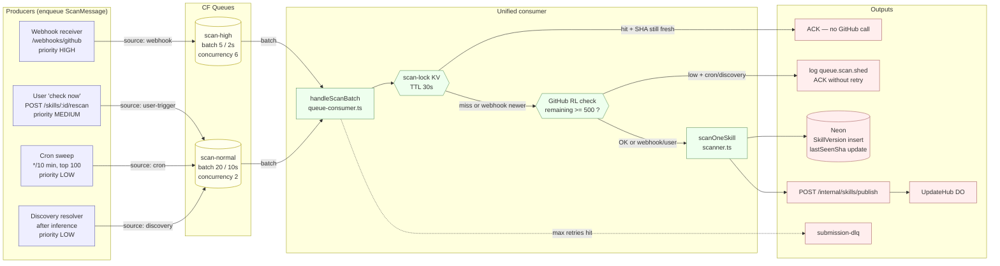
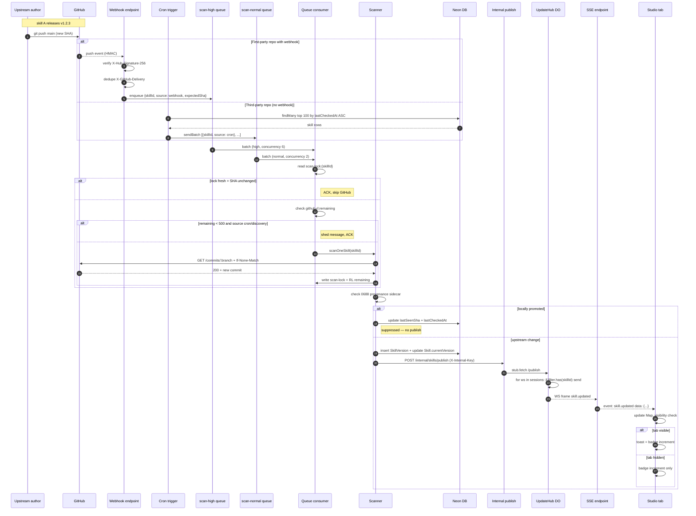
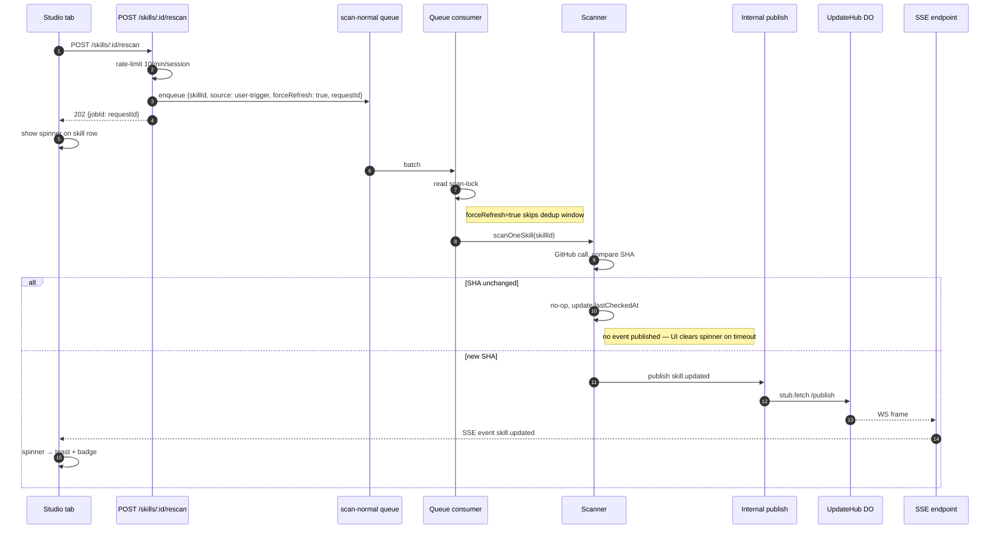
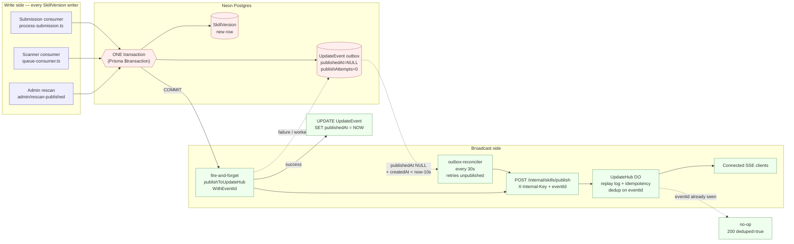
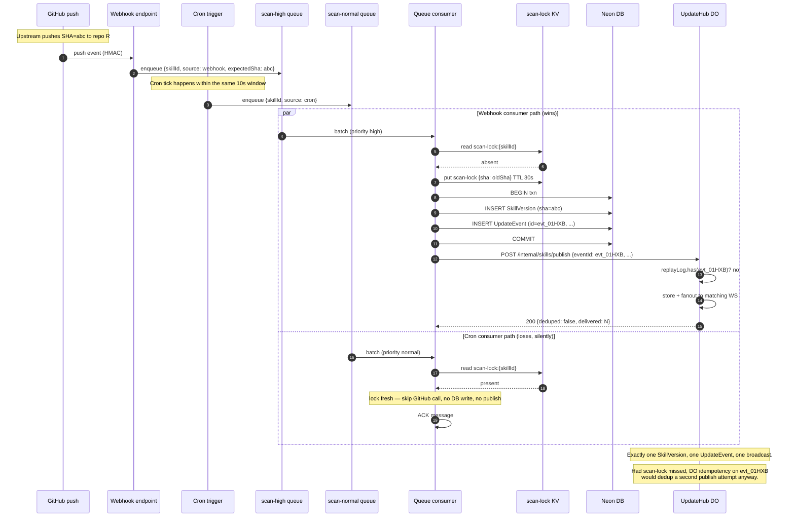
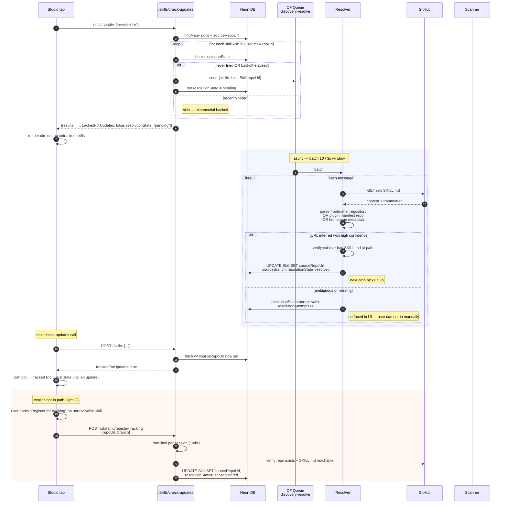

# 0708 — Skill Update Push Pipeline: Architecture

## Context

verified-skill.com is the serving plane for a growing catalog of skills
installed by Skill Studio users. Today, users learn about upstream
updates only by manually running `vskill outdated` or by the UI polling
from every tab, burning GitHub rate limit. This increment introduces a
centralized push pipeline: **all four scan-triggering paths** (webhook
fast-path, user "check now", 10-min cron, and discovery resolver)
funnel into **one unified scanner queue** with priority lanes, a
hibernatable Durable Object fans SHA-change events out to connected
Studio tabs over SSE, and the catalog grows continuously through a
**discovery resolver** that piggybacks on the platform's existing
`/check-updates` traffic (Option D, see `plan.md` §"Skill Discovery &
Registration"). Everything runs on Cloudflare Workers. Target marginal
cost: $5–15/mo.

## Unified Scanner Queue (integration point)

Every path that could trigger a GitHub scan enters the same queue. Four
producers, two queues (high + normal), one consumer, one GitHub client,
one rate-limit accounting surface. No direct GitHub fetch lives outside
the consumer.



## End-to-End System Architecture

```mermaid
flowchart LR
    subgraph Upstream["Upstream sources"]
        GH["GitHub repos<br/>anthropic-skills/<br/>verified-skill/<br/>community/"]
        WH["GitHub push webhook"]
    end

    subgraph Client["Client — Skill Studio"]
        Studio["Studio tab<br/>useSkillUpdates hook"]
        EventSource["EventSource<br/>GET /skills/stream"]
        PollFB["5-min poll fallback<br/>/skills/check-updates"]
    end

    subgraph Worker["Cloudflare Worker — verified-skill.com"]
        Cron["Cron trigger<br/>*/10 * * * *<br/>enqueues 100 skills"]
        Scanner["Scanner<br/>scanOneSkill<br/>scanner.ts"]
        QConsumer["Queue consumer<br/>queue-consumer.ts<br/>dedup + RL guard"]
        GhClient["GitHub API client<br/>github-api.ts<br/>ETag + RL header capture"]
        WebhookEP["POST /webhooks/github<br/>HMAC verify, anti-replay<br/>→ enqueue scan-high"]
        RescanEP["POST /skills/:id/rescan<br/>user 'check now'<br/>→ enqueue scan-normal"]
        CheckEP["POST /skills/check-updates<br/>+ trackedForUpdates field<br/>+ resolutionState field"]
        Resolver["Discovery resolver<br/>discovery/resolver.ts<br/>queue consumer"]
        InternalPub["POST /internal/skills/publish<br/>X-Internal-Key HMAC"]
        StreamEP["GET /skills/stream<br/>SSE proxy to DO<br/>?skills=csv or cookie sub"]
        SubEP["POST /skills/stream/subscribe<br/>cookie-backed filter"]
    end

    subgraph Storage["Storage"]
        DB[("Neon Postgres<br/>Skill + SkillVersion<br/>+ sourceRepoUrl + resolution cols<br/>+ UpdateEvent outbox")]
        KV[("Workers KV<br/>ETag + subs + scan-lock<br/>+ github-rl:remaining")]
        ScanQH["CF Queue scan-high<br/>webhook only"]
        ScanQN["CF Queue scan-normal<br/>cron + user + discovery"]
        DiscQ["CF Queue discovery-resolve<br/>batch 10 / 3s"]
    end

    subgraph DO["Durable Object"]
        Hub["UpdateHub-0<br/>hibernatable WS<br/>Map&lt;WS,filter&gt;<br/>fanout match skillId"]
    end

    GH -->|push event| WH
    WH -->|HMAC signed| WebhookEP
    WebhookEP -->|enqueue HIGH| ScanQH
    Cron -->|per-skill enqueue| ScanQN
    Studio -->|'check now'| RescanEP
    RescanEP -->|enqueue NORMAL| ScanQN
    ScanQH -->|batch| QConsumer
    ScanQN -->|batch| QConsumer
    QConsumer -->|dedup OK + RL OK| Scanner
    Scanner -->|commits/:branch + ETag| GhClient
    GhClient -->|REST| GH
    GhClient -->|RL headers| KV
    Scanner -->|new SkillVersion| DB
    Scanner -->|event| InternalPub
    InternalPub -->|stub fetch| Hub
    Studio -->|open| EventSource
    Studio -.->|if blocked| PollFB
    EventSource -->|SSE| StreamEP
    StreamEP <-->|internal WS| Hub
    Hub -->|skill.updated frames| StreamEP
    StreamEP -->|SSE events| EventSource
    Studio -->|installed list| CheckEP
    CheckEP -->|enqueue unresolved| DiscQ
    DiscQ -->|batch| Resolver
    Resolver -->|fetch SKILL.md<br/>or plugin manifest| GH
    Resolver -->|upsert sourceRepoUrl| DB
    Resolver -->|enqueue initial scan LOW| ScanQN
    PollFB -->|fallback path| CheckEP

    classDef ext fill:#eef,stroke:#66a
    classDef worker fill:#efe,stroke:#696
    classDef store fill:#fee,stroke:#a66
    classDef do fill:#fef,stroke:#96a
    class GH,WH ext
    class Cron,Scanner,QConsumer,GhClient,WebhookEP,RescanEP,CheckEP,Resolver,InternalPub,StreamEP,SubEP worker
    class DB,KV,ScanQH,ScanQN,DiscQ store
    class Hub do
```



## Update Propagation Flow

How a single upstream commit becomes an "Update available" badge in a
Studio tab. Both paths (webhook fast-path and cron polling) converge on
the same internal publish step.



## User "Check Now" Flow (on-demand rescan)

The user clicks "Check now" on a skill row in Studio — same pipeline,
different entry point. The result arrives via the normal SSE fan-out,
so there is no special return channel for this flow.



Key property: the user-trigger flow is identical to cron from the
consumer onwards — same dedup, same rate-limit guard, same
propagation. `forceRefresh` only bypasses the 30s scan-lock window; it
never bypasses the rate-limit guard, so we never burn budget on a user
click when GitHub is already at its limit.

## Delivery Guarantee — Outbox as Junction

The transactional outbox is the junction between the **write side**
(any code path that creates a `SkillVersion`) and the **broadcast
side** (DO fan-out). Every write enters the outbox in the same DB
transaction as the version row; a reconciler cron owns the
"eventually delivered" guarantee. Details and code in plan.md
§Delivery Guarantee.



Key property: if the Worker crashes after `COMMIT` but before `FF`
fires, the row sits with `publishedAt=NULL` and the reconciler picks
it up within ~30s. If the DO already processed the eventId (e.g., the
crash happened between DO success and `Mark`), the reconciler's retry
is deduped at the DO and `publishedAt` still gets set on retry success.

## Client Reconnect with Last-Event-ID

Shows how the DO's in-memory replay log closes the gap when a Studio
tab reconnects after a blip, and how the `gone` fallback hands off to
full reconcile via `check-updates`.

```mermaid
sequenceDiagram
    autonumber
    participant App as Studio tab
    participant ES as EventSource
    participant SSE as SSE endpoint
    participant Hub as UpdateHub DO
    participant Log as DO replay log<br/>(in-memory Map, 5-min TTL)
    participant Check as /skills/check-updates

    Note over App,ES: WiFi drops; seenLastId = "evt_01HXA"

    App->>ES: reconnect
    ES->>SSE: GET /skills/stream?skills=...<br/>Last-Event-ID: evt_01HXA
    SSE->>Hub: upgrade WS ?skills=...&lastEventId=evt_01HXA
    Hub->>Log: lookup evt_01HXA
    alt hit — within 5-min TTL
        Log-->>Hub: {at, payload}
        Hub->>Hub: gather events where<br/>at > hitAt AND filter.has(skillId)
        loop each missed event
            Hub-->>SSE: WS frame (replay)
            SSE-->>ES: event: skill.updated<br/>id: evt_...<br/>data: {...}
            ES->>App: onmessage (dedup via seenEventIds)
        end
        Hub->>SSE: [switch to live stream]
    else miss — older than 5 min or evicted
        Hub-->>SSE: WS frame {type: "gone"}
        SSE-->>ES: event: gone<br/>data: {"reason":"too-old"}
        ES->>App: onmessage gone
        App->>App: close EventSource
        App->>Check: POST /skills/check-updates<br/>{skills: [installed]}
        Check-->>App: full state snapshot
        App->>App: reconcile + reopen EventSource
    end
```

## Race: Webhook + Cron for Same Skill (idempotency in action)

Demonstrates how `scan-lock:<skillId>` KV (consumer layer) and the
DO's `eventId` idempotency (publish layer) together ensure exactly
one broadcast per upstream change, even when two producers race.



## Skill Discovery & Registration Flow (Option D + light C)

How a skill whose `sourceRepoUrl` is NULL in the DB gets promoted into
the tracked catalog without manual seeding. Discovery rides on
`/check-updates` traffic the Studio already sends.



**Why Option D + light C**:
- Zero friction for ~80% of skills (metadata already carries the repo).
- Privacy-neutral: `/check-updates` already carries the installed list;
  we're not adding new telemetry, just acting on what we have.
- Abuse-resistant: the resolver only trusts URLs it can verify from
  skill metadata already in our DB (signed submission path). The
  explicit-opt-in path (light C) is rate-limited per session.
- Reuses the existing CF Queues infrastructure (new
  `discovery-resolve` queue alongside `submission-processing` and
  `eval-processing`). Separate queue keeps latency SLOs isolated.
- Scales: at 1000 users × 50 unique skills, ~50k discovery jobs
  processed over days via queue batching — no burst load on the
  scanner cron.

## Backpressure & Scaling

- **Scan queue depth** — AE metric `queue.scan.depth` per queue. If
  `scan-high` depth >50 for >2 min, something is wrong at the webhook
  path (normal is 0–2). If `scan-normal` depth >500 sustained, bump
  `max_concurrency` from 2 to 4, then 6.
- **Scan latency P99** — AE metric `queue.scan.latency.ms` dimensioned
  by `source`. Webhook P99 target <2 s; user-trigger P99 <5 s; cron
  P99 <30 s. Breach triggers investigation, not auto-scaling.
- **Rate-limit shedding** — `queue.scan.shed` >0 per hour is only
  expected under partial GitHub outage or abuse; steady state is 0.
  Sustained shedding → bump cron cadence down before discovery
  starves.
- **Cron cadence** — v1 runs `*/10` (600 GH req/hr budget). At 200
  tracked skills, bump to `*/5` (1200 req/hr, still 24% of 5k PAT).
  Pure `wrangler.jsonc` change, no code.
- **DO sharding** — single `UpdateHub-0` in v1. When tracked skills
  cross ~500 sustained OR concurrent SSE connections cross ~3000,
  flip `SHARD_COUNT` in `wrangler.jsonc`. The pre-wired
  `shardForSkillId()` helper routes to `UpdateHub-1`, `UpdateHub-2`,
  etc. Stream endpoint groups filter by shard, opens one internal WS
  per shard, multiplexes onto one client SSE. No client protocol
  change.
- **Discovery queue depth** — watch `queue:discovery-resolve:depth`
  metric. If sustained backlog >1000, scale `max_concurrency` from 5
  to 10 or add a second consumer. Resolver is idempotent (SHA-keyed)
  so retries are safe.
- **GitHub rate limit** — scanner uses `If-None-Match` ETag caching;
  steady-state 304 responses don't count against quota. The consumer
  emits `scanner.errors.total` grouped by httpStatus; if 429s appear,
  we back off the batch by halving `max_batch_size` until recovery.
- **SSE connection pressure** — each Worker isolate can hold
  thousands of long-lived HTTP connections; the DO is the chokepoint
  first. Sharding hits before connection count ever does.
- **Outbox lag** — AE metric `outbox.lag.ms` P99. Healthy <10s;
  >30s sustained triggers investigation (reconciler starved, DB
  contention, or DO rejecting publishes). `outbox.attempts-exceeded`
  >0 is critical — a specific event is stuck.
- **Replay log size** — DO `do.replay.size` should be small (single
  digits at v1 velocity). >1000 entries means either event-storm or a
  stuck sweep; investigate before LRU eviction kicks in.

## File paths

| Purpose | Path |
|---|---|
| Scanner core (per-skill) | `repositories/anton-abyzov/vskill-platform/src/lib/skill-update/scanner.ts` |
| Unified queue consumer | `repositories/anton-abyzov/vskill-platform/src/lib/skill-update/queue-consumer.ts` |
| Scan dedup KV lock | `repositories/anton-abyzov/vskill-platform/src/lib/skill-update/scan-lock.ts` |
| Enqueue producers (webhook/cron/user/discovery) | `repositories/anton-abyzov/vskill-platform/src/lib/skill-update/enqueue.ts` |
| GitHub API client w/ ETag + RL capture | `repositories/anton-abyzov/vskill-platform/src/lib/skill-update/github-api.ts` |
| UpdateHub Durable Object (w/ replay log + idempotency) | `repositories/anton-abyzov/vskill-platform/src/lib/skill-update/update-hub.ts` |
| Publish → DO helper (eventId-aware) | `repositories/anton-abyzov/vskill-platform/src/lib/skill-update/publish.ts` |
| Outbox reconciler (30s cron) | `repositories/anton-abyzov/vskill-platform/src/lib/skill-update/outbox-reconciler.ts` |
| Outbox write helper (txn wrapper) | `repositories/anton-abyzov/vskill-platform/src/lib/skill-update/outbox-writer.ts` |
| Submission consumer (retrofit for outbox) | `repositories/anton-abyzov/vskill-platform/src/lib/queue/process-submission.ts` |
| Admin rescan (retrofit for outbox) | `repositories/anton-abyzov/vskill-platform/src/app/api/v1/admin/rescan-published/route.ts` |
| Event types | `repositories/anton-abyzov/vskill-platform/src/lib/skill-update/types.ts` |
| Discovery resolver (consumer) | `repositories/anton-abyzov/vskill-platform/src/lib/skill-update/discovery/resolver.ts` |
| Discovery enqueue (from check-updates) | `repositories/anton-abyzov/vskill-platform/src/lib/skill-update/discovery/enqueue.ts` |
| Public SSE endpoint | `repositories/anton-abyzov/vskill-platform/src/app/api/v1/skills/stream/route.ts` |
| Subscription endpoint | `repositories/anton-abyzov/vskill-platform/src/app/api/v1/skills/stream/subscribe/route.ts` |
| Webhook receiver (enqueues scan-high) | `repositories/anton-abyzov/vskill-platform/src/app/api/v1/webhooks/github/route.ts` |
| User "check now" endpoint | `repositories/anton-abyzov/vskill-platform/src/app/api/v1/skills/[id]/rescan/route.ts` |
| Internal publish endpoint | `repositories/anton-abyzov/vskill-platform/src/app/api/v1/internal/skills/publish/route.ts` |
| Existing check-updates (modified) | `repositories/anton-abyzov/vskill-platform/src/app/api/v1/skills/check-updates/route.ts` |
| Manual registration (light C) | `repositories/anton-abyzov/vskill-platform/src/app/api/v1/skills/[id]/register-tracking/route.ts` |
| Cron dispatcher | `repositories/anton-abyzov/vskill-platform/scripts/build-worker-entry.ts` |
| Worker bindings | `repositories/anton-abyzov/vskill-platform/wrangler.jsonc` |
| Schema | `repositories/anton-abyzov/vskill-platform/prisma/schema.prisma` |
| Seed (bootstrap) | `repositories/anton-abyzov/vskill-platform/scripts/seed-tracked-skills.ts` |
| Existing internal-auth helper | `repositories/anton-abyzov/vskill-platform/src/lib/internal-auth.ts` |
| Existing webhook-auth helper | `repositories/anton-abyzov/vskill-platform/src/lib/webhook-auth.ts` |
| Studio hook | `repositories/anton-abyzov/vskill/src/studio/lib/use-skill-updates.ts` |
| Studio UpdateBell | `repositories/anton-abyzov/vskill/src/studio/components/UpdateBell.tsx` |
| Studio update action | `repositories/anton-abyzov/vskill/src/studio/components/UpdateAction.tsx` |
| Studio row/section chip | `repositories/anton-abyzov/vskill/src/studio/components/UpdateChip.tsx` |
| Related ADRs | `.specweave/docs/internal/architecture/adr/0708-01-*.md`, `0708-02-*.md`, `0688-01-*.md` (precedent), `0688-02-*.md` (provenance) |
