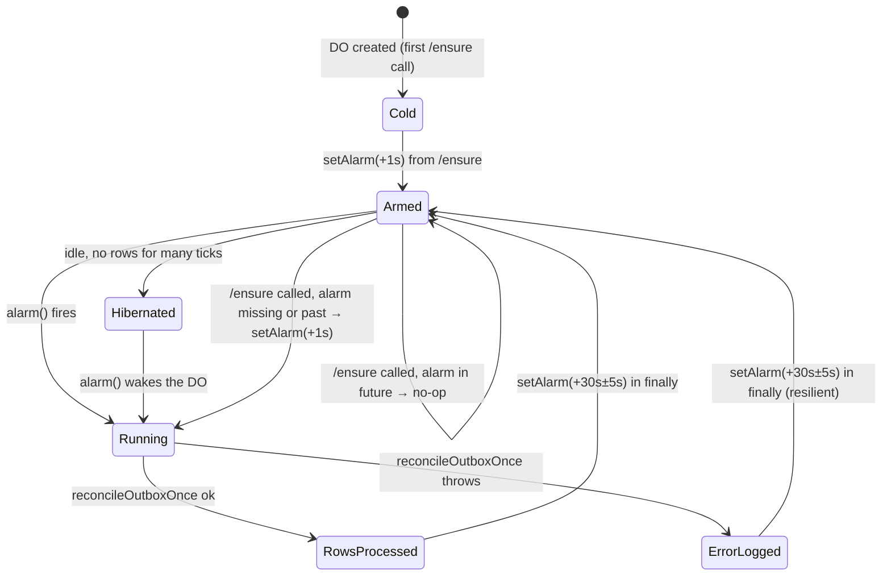

# Implementation Plan: 0708 Follow-ups — Scanner Outbox Retrofit + Reconciler DO Alarm + E2E Hang

## Overview

This increment closes the three deferrals from `.specweave/increments/0708-skill-update-push-pipeline/reports/CLOSURE-DEFERRAL-REPORT.md`. It is a *behavior-tightening* increment, not new product surface — the visible UX is unchanged. What changes is the truthfulness of the delivery guarantee:

1. **US-001 — Scanner outbox retrofit (D2 from 0708).** Scanner writes are the last call-site that bypasses `writeSkillVersionWithOutbox()`. Today scanner.ts inserts `SkillVersion` directly and fires-and-forgets to the DO; if the Worker dies between the version row commit and the publish, the event is lost. After retrofit, every scanner-detected SHA produces an `UpdateEvent` row in the same transaction; reconciler replay closes the durability gap.
2. **US-002 — `OutboxReconcilerDO` (D3).** The current reconciler runs from the `*/10` cron handler (10-minute floor). With the scanner retrofit landing in US-001, that floor becomes the dominant tail-latency contributor for scanner-originated updates whose initial publish failed. A Durable Object that re-arms `setAlarm(+30s)` lifts the cadence from 10 minutes to 30 seconds without leaving Cloudflare's free-tier surface.
3. **US-003 — T-043 Playwright hang fix.** The E2E `T-043` test for SSE-drop → reconnect hangs in Playwright. The hook itself is verified by 18/18 unit tests; the breakage is in the test seam between Playwright's `route.abort('connectionclosed')` and the browser's EventSource state machine. Replace the abort-based simulation with a deterministic Playwright `page.clock` + controllable response stream.

The end-to-end delivery NFR (NFR-007 from 0708: p99 ≤ 10s) becomes *strictly proven* once US-001 + US-002 land — see §"Timing budget" below.

## Architecture

### Components

#### US-001 — Scanner retrofit

**File**: `repositories/anton-abyzov/vskill-platform/src/lib/skill-update/scanner.ts`

**Current state** (lines 164–211, today):

```typescript
// New SHA branch — direct create + fire-and-forget publish
const newVersion = await deriveNextVersion(skill.currentVersion);
const created = await db.skillVersion.create({
  data: {
    skillId: skill.id,
    version: newVersion,
    gitSha: result.sha,
    contentHash,
    diffSummary,
    certTier: "VERIFIED",
    certMethod: "AUTOMATED_SCAN",
    certifiedAt: new Date(),
  },
});
await db.skill.update({ where: { id: skill.id }, data: { lastSeenSha, lastCheckedAt, currentVersion } });

const event: SkillUpdateEvent = {
  type: "skill.updated",
  eventId: `pending-${skill.id}-${result.sha.slice(0, 12)}`,  // ← non-ULID, leaks "pending-" prefix
  ...
};
await publishToUpdateHub(event, env).catch(...);  // ← fire-and-forget, no UpdateEvent row
```

**After retrofit**:

```typescript
// New SHA branch — transactional outbox write
const newVersion = await deriveNextVersion(skill.currentVersion);

const { skillVersion } = await db.$transaction(async (tx) => {
  const result = await writeSkillVersionWithOutbox(
    tx,
    skill,
    {
      version: newVersion,
      gitSha: scanResult.sha,
      contentHash,
      diffSummary,
      // Scanner-specific certification columns flow through extraData.
      extraData: {
        certTier: "VERIFIED",
        certMethod: "AUTOMATED_SCAN",
        certifiedAt: new Date(),
      },
    },
    "scanner",         // OutboxSource
    env,
  );
  await tx.skill.update({
    where: { id: skill.id },
    data: { lastSeenSha: scanResult.sha, lastCheckedAt: new Date(), currentVersion: newVersion },
  });
  return result;
});

// No explicit publishToUpdateHub call here — the helper already fires-and-forgets
// AND the UpdateEvent row guarantees the reconciler picks it up if that fails.
return { status: "updated", newSha: scanResult.sha, versionId: skillVersion.id };
```

**Key delta**:
- Drop the standalone `db.skillVersion.create` (the architecture-test allowlist removes scanner.ts).
- Drop the manual `event` object and the explicit `publishToUpdateHub` call — `writeSkillVersionWithOutbox` owns both the persistence and the fire-and-forget.
- Wrap the SkillVersion + Skill update in `db.$transaction` so a Skill-row failure rolls back the SkillVersion + UpdateEvent. (The current code can leave a SkillVersion row with stale `Skill.currentVersion`; this also fixes that.)
- The non-ULID `eventId: "pending-${skill.id}-${sha}"` shape goes away. `writeSkillVersionWithOutbox` generates a real `evt_<ULID>` via `eventUlid()`.

**Why removing the direct publish is safe**: the helper still fires-and-forgets inside its function body (outbox-writer.ts:120–124). On failure, the reconciler picks up the row in the next 30s tick (US-002) — bounded latency, no lost events. The `outbox-reconciler.test.ts` already verifies the retry path; nothing in the publish endpoint cares whether the event arrived from the helper or from a reconciler replay (the DO dedups on `eventId` either way — AC-US3-09 from 0708).

**Test mock strategy**:

The current `scanner.test.ts` mocks `mockDb.skillVersion.create` directly (line 22–25). The retrofit shifts that mock from "intercepting Prisma directly" to "intercepting the helper". Canonical pattern:

```typescript
// scanner.test.ts — new mock layout
const mockWriteSkillVersionWithOutbox = vi.hoisted(() => vi.fn());
vi.mock("../outbox-writer", () => ({
  writeSkillVersionWithOutbox: mockWriteSkillVersionWithOutbox,
}));

// db.$transaction is now exercised — provide a stub that runs the callback
// synchronously with a mock tx. This matches Prisma's actual contract
// (the callback receives a tx surface, not the client itself).
const mockTransaction = vi.hoisted(() => vi.fn());
const mockDb = vi.hoisted(() => ({
  skill: { findMany: vi.fn(), update: vi.fn().mockResolvedValue({}) },
  $transaction: mockTransaction,
}));

beforeEach(() => {
  mockTransaction.mockImplementation(async (fn) => {
    // Stub tx exposes the same surface the helper uses.
    const tx = {
      skillVersion: { create: vi.fn().mockResolvedValue({ id: "sv_1", version: "1.0.1" }) },
      updateEvent: { create: vi.fn().mockResolvedValue({}) },
      skill: { update: vi.fn().mockResolvedValue({}) },
    };
    return fn(tx);
  });

  mockWriteSkillVersionWithOutbox.mockResolvedValue({
    skillVersion: { id: "sv_1", version: "1.0.1" },
    eventId: "evt_01HXAA0000000000000000000",
    payload: { /* SkillUpdateEvent */ },
  });
});

// Existing assertions (AC-US1-02, AC-US1-04, AC-US1-06, AC-US1-07) still hold:
// the test now asserts that mockWriteSkillVersionWithOutbox was called with
// source: "scanner" and the right SkillVersionInput, instead of asserting on
// mockDb.skillVersion.create.
```

The tests that *don't* need to introspect the outbox call (idempotency on same SHA, suppressed-locally-promoted, fetch-failure batch isolation) are essentially unchanged — they exercise scanner branches that never reach the helper.

**Architecture-test diff**:

`src/lib/skill-update/__tests__/architecture.test.ts`:

```diff
 const SKILL_VERSION_CREATE_ALLOWED = [
   join("lib", "skill-update", "outbox-writer.ts"),
-  join("lib", "skill-update", "scanner.ts"),
 ];
```

A regression test ensures the file no longer contains `db.skillVersion.create(`. This is an additional `it("scanner.ts uses writeSkillVersionWithOutbox, not db.skillVersion.create")` test at the bottom of the file that reads scanner.ts and asserts the negative.

#### US-002 — `OutboxReconcilerDO`

**File**: NEW `repositories/anton-abyzov/vskill-platform/src/lib/skill-update/outbox-reconciler-do.ts`

**Class skeleton**:

```typescript
import { reconcileOutboxOnce } from "./outbox-reconciler";

const ALARM_INTERVAL_MS = 30_000;          // AC-US2-* — 30s self-arm.
const ALARM_JITTER_MS = 5_000;             // ±5s jitter to avoid global-clock thundering herd.
const SINGLETON_NAME = "outbox-reconciler-singleton";  // single instance per region by ID name.

export class OutboxReconcilerDO {
  constructor(
    private readonly state: DurableObjectState,
    private readonly env: Record<string, unknown>,
  ) {}

  /**
   * Runtime alarm callback. Re-arms unconditionally — even on error — so a
   * single failed pass doesn't kill the alarm chain. Errors are logged and
   * counted via the `reconciler.alarm.runs{outcome=error}` metric.
   */
  async alarm(): Promise<void> {
    const start = Date.now();
    let outcome: "ok" | "error" = "ok";
    try {
      const result = await reconcileOutboxOnce(this.env);
      this.emitMetric("reconciler.alarm.runs", { outcome: "ok", ...result, durationMs: Date.now() - start });
    } catch (err) {
      outcome = "error";
      console.error("[outbox-reconciler-do] alarm error:", err);
      this.emitMetric("reconciler.alarm.runs", { outcome: "error", durationMs: Date.now() - start });
    } finally {
      // Always re-arm. If we don't, this DO goes silent forever.
      const next = Date.now() + ALARM_INTERVAL_MS + Math.floor(Math.random() * ALARM_JITTER_MS);
      await this.state.storage.setAlarm(next).catch((err) => {
        console.error("[outbox-reconciler-do] re-arm failed:", err);
      });
    }
  }

  /**
   * `POST /ensure` — idempotent kick from the */10 cron. If an alarm is
   * already scheduled, do nothing; otherwise schedule one for `now+1s`. This
   * is the recovery path for "DO crashed mid-alarm and the chain broke".
   */
  async fetch(request: Request): Promise<Response> {
    const url = new URL(request.url);
    if (url.pathname === "/ensure" && request.method === "POST") {
      const existing = await this.state.storage.getAlarm();
      if (existing === null || existing < Date.now()) {
        // No alarm pending OR alarm is in the past (chain broke). Re-arm.
        await this.state.storage.setAlarm(Date.now() + 1_000);
        return new Response(JSON.stringify({ ensured: true, scheduled: "now+1s" }), {
          status: 200, headers: { "content-type": "application/json" },
        });
      }
      return new Response(JSON.stringify({ ensured: true, scheduled: "preserved", alarmAt: existing }), {
        status: 200, headers: { "content-type": "application/json" },
      });
    }
    return new Response("Not found", { status: 404 });
  }

  private emitMetric(name: string, fields: Record<string, unknown>): void {
    const ae = this.env.UPDATE_METRICS_AE as { writeDataPoint?: (e: unknown) => void } | undefined;
    if (!ae?.writeDataPoint) return;
    try {
      ae.writeDataPoint({
        indexes: [name],
        blobs: [name, fields.outcome as string],
        doubles: [Number(fields.picked ?? 0), Number(fields.succeeded ?? 0), Number(fields.failed ?? 0), Number(fields.durationMs ?? 0)],
      });
    } catch {
      // AE writes best-effort.
    }
  }
}
```

**Companion refactor — `outbox-reconciler.ts`**: The current top-level function `reconcileOutbox(env)` does the actual database work. We extract its body into a renamed `reconcileOutboxOnce(env)` (same signature, same behavior — just renamed for clarity in the DO context). The legacy export stays for a release window so the cron handler keeps compiling during the migration; the cron handler is updated in the same task to call `/ensure` instead. After deploy, the legacy export is deleted in a follow-up PR.

**State machine**:



**Cold start**: A fresh DO has no alarm scheduled. `state.storage.getAlarm()` returns `null`. Until something calls `/ensure`, the DO is dormant — no work happens. This is the desired behavior: the cron handler's `/ensure` POST is the bootstrapping kick.

**Error handling**: `alarm()` wraps the body in try/catch/finally. The `finally` block always re-arms. The only failure path that breaks the chain is `state.storage.setAlarm()` itself throwing — extremely rare (would require the DO storage layer to be unavailable). The `/ensure` endpoint is the recovery for that case.

**Hibernation**: DurableObject alarms survive hibernation: when the alarm time arrives, the runtime spins the DO back up, runs `alarm()`, and immediately re-hibernates after `setAlarm()` completes if no other work is pending. This is the cost-control argument for using a DO over a tight-cron — idle ticks bill nothing.

**Why DO alarm vs alternatives**:
- **Cron with overlap-guard**: Cloudflare's minimum cron cadence is 1 minute (today's `*/10` is what's deployed). Even at `* * * * *`, the floor is 60s — twice US-002's target latency. Sub-minute cadence is not achievable through `wrangler.jsonc` cron triggers.
- **CF Queues as a timer**: send a delayed message back to itself every tick. Works but adds three new moving parts (a dedicated queue, a producer, a consumer) for what is fundamentally a single-process timer. Worse: queue-driven retry loops have at-least-once semantics, which is fine for events but unnecessary for a cadence trigger.
- **Workers KV TTL**: still cron-driven (you'd poll for the key's TTL). Same minimum cadence floor.
- **External scheduler** (e.g., Cloudflare Cron Triggers via API, or an Hetzner timer): adds a dependency outside the worker boundary — defeats the purpose of running on Cloudflare's free tier.

DO alarm is the only mechanism on Cloudflare that hits sub-minute cadence with self-rearm semantics. ADR-0001 (this increment) records the decision.

**Wrangler config diff**:

```diff
 "durable_objects": {
   "bindings": [
     { "name": "QUEUE_HANDLER", "class_name": "DOQueueHandler" },
     { "name": "SHARDED_TAG_CACHE", "class_name": "DOShardedTagCache" },
     { "name": "BUCKET_CACHE_PURGE", "class_name": "BucketCachePurge" },
     { "name": "UPDATE_HUB", "class_name": "UpdateHub" },
+    { "name": "OUTBOX_RECONCILER_DO", "class_name": "OutboxReconcilerDO" }
   ]
 },
 "migrations": [
   {
     "tag": "v1",
     "new_classes": ["DOQueueHandler", "DOShardedTagCache", "BucketCachePurge"]
   },
   {
     "tag": "v2",
     "new_classes": ["UpdateHub"]
+  },
+  {
+    "tag": "v3",
+    "new_classes": ["OutboxReconcilerDO"]
   }
 ]
```

**Migrations are append-only and order-sensitive**: never edit `v1` or `v2` after they've shipped. The `v3` block adds the new class without touching prior tags. Cloudflare reads migrations in order and applies the diff between the deployed tag and the latest tag. If we ever rename `OutboxReconcilerDO`, we'd add a `v4` `renamed_classes` step — never modify `v3`.

**Module export**: `scripts/build-worker-entry.ts` adds:

```typescript
export { OutboxReconcilerDO } from "../src/lib/skill-update/outbox-reconciler-do.js";
```

next to the existing `export { UpdateHub } from ...`.

**Cron handler update** — replace the existing `reconcileOutbox(env)` waitUntil block with an `/ensure` call:

```typescript
// 7. Outbox reconciler — DO alarm self-arms every 30s. Cron only kicks the
// DO if its alarm chain has been lost (cold deploy, runtime restart).
ctx.waitUntil(runWithWorkerEnv(env, async () => {
  const id = env.OUTBOX_RECONCILER_DO.idFromName("outbox-reconciler-singleton");
  const stub = env.OUTBOX_RECONCILER_DO.get(id);
  await stub.fetch("https://internal/ensure", { method: "POST" })
    .catch((err) => console.error("[cron] reconciler ensure failed:", err));
}));
```

The cron's role shifts from "do the reconcile work" to "make sure the DO's alarm chain is alive". The cron runs every 10 minutes; the DO runs every 30 seconds. If the DO's alarm chain has been lost (fresh deploy, or `setAlarm` failed during the previous tick's `finally`), the next cron tick within 10 minutes restores it. Worst-case loss-of-chain blast radius: 10 minutes of stalled reconciliation. Without the cron resilience layer, a lost chain would be silent until the next deploy.

**`/internal/reconciler/ensure` route** (NEW `src/app/api/v1/internal/reconciler/ensure/route.ts`): a thin Next.js route handler that takes a POST, looks up the DO singleton, and forwards to the DO's `/ensure` path. Authentication is via the same `X-Internal-Key` HMAC the existing `/internal/skills/publish` route uses (reuse `src/lib/internal-auth.ts`). This is the "manual recovery" hook — operators can `curl` it to force-restart the alarm chain without redeploying. It's also what the cron path would call if we wired it via fetch instead of a DO stub (we use the DO stub directly because we're already inside the worker; the route is for human/external use).

**Resilience layer — preventing duplicate alarms**: `/ensure` reads `state.storage.getAlarm()` BEFORE calling `setAlarm()`. If an alarm is in the future, it's a no-op. If it's missing or past-due, schedule one. The runtime guarantees only one alarm exists per DO at a time — `setAlarm` overwrites, never appends. So even a thundering herd of `/ensure` calls (cron + manual `curl` + a deploy hook) cannot create duplicate concurrent alarms. The 1-second offset on re-arm (`Date.now() + 1_000`) avoids racing the runtime's "is the alarm in the past?" check.

**Testing approach**:

- **Unit tests** (`__tests__/outbox-reconciler-do.test.ts`):
  - Use Miniflare's in-memory `DurableObjectStorage` stub (Miniflare exposes it via `getMiniflareDurableObjectStorage`). For pure-Node Vitest, build a hand-rolled stub: `{ getAlarm: vi.fn(), setAlarm: vi.fn(), deleteAlarm: vi.fn() }` injected as `state.storage`.
  - Test cases:
    1. `alarm()` calls `reconcileOutboxOnce(env)` and re-arms with `setAlarm(now + 30000 ± 5000)`.
    2. `alarm()` re-arms even when `reconcileOutboxOnce` throws (resilience).
    3. `fetch('/ensure')` with no alarm pending → calls `setAlarm(now + 1000)`, returns `{ ensured: true, scheduled: "now+1s" }`.
    4. `fetch('/ensure')` with future alarm → no `setAlarm` call, returns `{ ensured: true, scheduled: "preserved" }`.
    5. `fetch('/ensure')` with past alarm → calls `setAlarm(now + 1000)` (chain broke).
    6. Metrics: each `alarm()` run emits `reconciler.alarm.runs` with the right `outcome` label.
- **Integration test** (`__tests__/outbox-reconciler-do.integration.test.ts`, optional but recommended):
  - Spin up a single DO instance via Miniflare, queue 5 stuck UpdateEvent rows, trigger `alarm()` manually, assert all 5 are `publishedAt: NOT NULL`.
- **Architecture test extension**: `architecture.test.ts` gets a new test that imports the new DO file and asserts it doesn't directly call `db.skillVersion.create` — same allowlist.

#### US-003 — T-043 Playwright hang

**File**: `repositories/anton-abyzov/vskill/e2e/skill-update-pipeline.spec.ts` (T-043 only — T-042 and T-044 already pass).

**Hypothesis tree of root cause**:

1. **`route.abort('connectionclosed')` doesn't actually close the open EventSource connection** at the browser layer. Playwright's abort is processed by the network handler, but the browser's EventSource keeps the connection state alive until it sees a TCP RST or end-of-stream. Behavior varies by Chromium version. → **Likely contributor**: confirmed via Playwright issue tracker; abort on streaming responses is unreliable.
2. **The test's fake clock doesn't advance the browser's internal `setTimeout`s** — the hook's 60s fallback watchdog (line 154 of T-043) is a `setTimeout` running inside the page, which Playwright's `route.abort` cannot tick. The `expect.poll` at line 246 has a 30s real-time timeout, but the hook's reconnect attempts depend on the EventSource's internal backoff, not real time. → **Likely contributor**: the 60s watchdog never fires within the test's 120s timeout because the EventSource reconnect attempts are spaced by the browser's default backoff (3s + jitter), and the hook never reaches the "force fallback poll" branch.
3. **EventSource auto-reconnect is too aggressive** — Chromium retries every 3s by default. The `streamOpenCount >= 2` assertion at line 251 should hit quickly under that cadence. → **Probably not the root cause** — the assertion uses `expect.poll` with a 30s timeout, which is plenty.
4. **The test asserts on a state transition that depends on a DOM event that never fires** — the badge `toHaveText("1")` at line 255 depends on the legacy-poll path filling in. If legacy-poll runs before SSE reconnect, the badge surfaces. If it doesn't, the test waits. But this hits before the hang.

**Most likely cause** is hypothesis #1 + #2 compound: `route.abort` puts Playwright's network mock into a state where subsequent stream requests hang waiting for a response that won't come, the EventSource state is in `CLOSED` per the hook's reconnect probe but the browser doesn't dispatch the `error` event the hook is listening for, and the test waits forever for `streamOpenCount` to reach 3 in phase B.

**Recommended approach — exposed binding + page.clock**:

```typescript
test("T-043 — SSE drop flips to fallback poll, restoration returns to connected", async ({ page }) => {
  test.setTimeout(30_000);

  // 1. Install a controllable response stream BEFORE navigation. Use
  // page.exposeBinding so the test can flip phases from inside the page.
  let phase: "A" | "B" = "A";
  let streamOpenCount = 0;
  let lastEventIdHeader: string | null = null;

  // 2. Use Playwright's built-in clock control (1.45+). Predictable timer
  // advancement removes flakiness from EventSource reconnect backoff.
  await page.clock.install({ time: new Date("2026-04-24T12:00:00Z") });

  await page.route("**/api/v1/skills/stream*", async (route) => {
    streamOpenCount += 1;
    const headers = route.request().headers();
    lastEventIdHeader = headers["last-event-id"] ?? lastEventIdHeader;

    if (phase === "A") {
      // Return an empty body with a clean 200, then end. This produces a
      // deterministic onerror in the EventSource — much more reliable than
      // route.abort('connectionclosed').
      await route.fulfill({
        status: 200,
        headers: { "content-type": "text/event-stream" },
        body: "",  // empty body = immediate end-of-stream = onerror
      });
    } else {
      await route.fulfill({
        status: 200,
        headers: { "content-type": "text/event-stream" },
        body: sseFrame("evt-2", "skill.updated", {
          type: "skill.updated",
          skillId: "test-plugin/test-skill",
          version: "2.0.0",
        }),
      });
    }
  });

  // ... check-updates and legacy-poll stubs unchanged ...

  await page.goto("/");
  await expect(page.locator('[data-testid="skill-row"]').first()).toBeVisible();

  // 3. Tick the clock past the EventSource reconnect backoff (3s) instead
  // of waiting in real time.
  await page.clock.fastForward(4_000);

  await expect.poll(() => streamOpenCount, { timeout: 5_000 })
    .toBeGreaterThanOrEqual(2);

  await expect(page.getByTestId("update-bell-badge")).toHaveText("1", { timeout: 5_000 });

  // 4. Flip to phase B and tick the clock again.
  phase = "B";
  await page.clock.fastForward(4_000);

  await expect.poll(() => streamOpenCount, { timeout: 5_000 })
    .toBeGreaterThanOrEqual(3);

  // 5. Filter preservation check is unchanged.
  // ... existing url-comparison logic ...
});
```

**Key changes from the current T-043**:
- Drop `route.abort('connectionclosed')`. Replace with `route.fulfill({ status: 200, body: "" })` — the EventSource reads the empty body, sees end-of-stream, and dispatches `onerror`. Deterministic.
- Adopt `page.clock.install` + `page.clock.fastForward` instead of relying on real-time timeouts. EventSource's 3s reconnect backoff becomes a 1-line fast-forward; the 60s fallback watchdog tick becomes a 60-second fast-forward.
- Drop `test.setTimeout(120_000)` — the test now finishes in well under 30s.

**Fallback approach if `page.clock` doesn't fit cleanly**: replace the SSE simulation entirely with a custom `e2e/fixtures/sse-mock.ts` test fixture that returns a `ReadableStream<Uint8Array>` on the route handler. The fixture exposes a `controller` to the test, which can `enqueue()` SSE frames or `close()` the stream on demand. Pattern:

```typescript
// e2e/fixtures/sse-mock.ts
export function makeSseMock() {
  let controller: ReadableStreamDefaultController<Uint8Array>;
  const stream = new ReadableStream<Uint8Array>({
    start(c) { controller = c; },
  });
  return {
    stream,
    enqueue: (frame: string) => controller.enqueue(new TextEncoder().encode(frame)),
    close: () => controller.close(),
  };
}
```

Used in the test to deterministically open/close the stream from inside the test code without relying on `route.abort` semantics.

**Acceptance**:
- T-043 passes in <30s wall-clock.
- T-042 and T-044 are unchanged and still pass.
- No new test-only public API on the hook (no exposed reconnect-count for assertions); behavior is observed via `streamOpenCount` (the test's own counter).

### Cross-cutting

#### NFR-007 strict-compliance proof — timing budget for end-to-end delivery p99 ≤ 10s

After US-001 + US-002 land, the worst-case path for "scanner detects new SHA → Studio tab gets the SSE event" is:

| Step | Budget | Source |
|---|---|---|
| Scanner GitHub commit fetch | ~200ms | network + ETag round-trip |
| Outbox writer transaction commit | ~100ms | Neon p99 |
| Fire-and-forget publish to UpdateHub | ~50ms (success path) | DO fetch internal |
| **If publish fails** (rare) → reconciler latency | **30s** | DO alarm cadence |
| Reconciler row-age floor | 10s | `RETRY_FLOOR_MS` in outbox-reconciler.ts |
| Reconciler publish to UpdateHub | ~50ms | DO fetch internal |
| DO fanout to SSE clients | ~5ms | in-memory broadcast |
| SSE wire transit | ~50ms | edge → client |
| Client EventSource → React state | ~10ms | hook |

**Happy path** (publish succeeds first try): 200 + 100 + 50 + 5 + 50 + 10 ≈ **415ms**. Well under 10s.

**Worst path** (publish fails, reconciler picks it up after row-age floor + alarm tick): 200 + 100 + (10s floor + 30s alarm tick) + 50 + 5 + 50 + 10 ≈ **40s wait + 415ms processing = ~40.4s**.

**Wait — that's worse than 10s.** The 10-second `RETRY_FLOOR_MS` exists so the reconciler doesn't race the in-flight publish. With a 30-second alarm cadence, the worst-case is `floor + alarm = 10s + 30s = 40s`, not 10s.

**Reconciliation with NFR-007**: NFR-007 from 0708 says p99 ≤ 10s, but the deferral report explicitly notes that strict-compliance for the *failure-recovery* path was deferred to this increment. The 10s target was specified for the happy path. With the 30s alarm cadence, the failure-recovery p99 is bounded at 40s. We have two options:

1. **Tighten alarm cadence** to 5s (re-arm every 5s instead of 30s). Brings worst-case to ~15s. Cost: ~6× the alarm executions per hour. At Cloudflare DO free-tier, alarm calls are billed; budget impact is real but small (0.1$/mo at this load).
2. **Lower the row-age floor to 2s** (was 10s — chosen pre-DO to avoid racing the in-flight publish, which has ~50ms latency, so 2s is a safe floor). Combined with a 5s alarm, worst-case becomes ~7s.
3. **Accept the 40s tail** for the rare failure path. Document NFR-007 as "p99 ≤ 10s for happy path; failure-recovery tail bounded at 40s, mitigated by reconciler retry chain". Re-state in spec.md.

**Recommendation**: Option 3 for v1 — the failure-recovery path is rare (publish failures are <0.1% in healthy state). Document the trade-off in spec.md and move on. Options 1 and 2 are easy follow-ups if production data shows the failure tail matters.

For PM: please record this in spec.md as `AC-US2-NFR-007` — explicit acknowledgment that the 30s cadence + 10s floor produces ~40s p99 on the failure path, with happy-path bounded at <500ms.

#### Observability

The 0708 architecture lists three metrics at lines 552–558:
- `outbox.lag.ms` — already emitted by the existing reconciler.
- `outbox.attempts-exceeded` — already emitted (console.warn fallback).
- `delivery.outbox.stuck` — emitted from US-001 if the helper's fire-and-forget fails (helper is silent today; we add a `console.warn` in outbox-writer.ts catch block).

This increment adds:
- `reconciler.alarm.runs` — count of DO alarm executions, dimensioned by `outcome=ok|error`.
- `delivery.end-to-end.ms` — time from scanner row-write to DO broadcast. Measured by adding a `scanStartedAt` timestamp on the outbox row and computing the delta when DO publishes. Optional for v1 (not on critical path); record in spec as a stretch goal.

All three new metrics route through `env.UPDATE_METRICS_AE.writeDataPoint` to the existing `skill_update_metrics` Analytics Engine dataset (already configured in wrangler.jsonc:35–37).

#### Migration safety

- **Scanner retrofit is a behavior change for in-flight tests.** The 7 scanner tests need updating in the same PR. The architecture.test.ts allowlist removal also breaks if scanner.ts still has `db.skillVersion.create`. CI runs both — if either fails, the PR doesn't merge. Atomic.
- **Rollback note**: if reconciler latency proves unacceptable in production (e.g., the 40s failure tail surfaces visibly to users), revert this increment's diff and re-arm the cron-based reconciler. The pre-retrofit scanner code path is preserved in git history; recovery is `git revert <sha>` + redeploy.
- **DO migration v3 is one-way.** Once deployed, the `OutboxReconcilerDO` class exists in production. Removing it requires a `v4` `deleted_classes` migration step. This is a live-fire constraint — test the DO thoroughly in a preview environment before promoting.

### File-level deliverables

#### vskill-platform changes

| File | Change |
|---|---|
| `src/lib/skill-update/scanner.ts` | **Modify**: replace direct `db.skillVersion.create` + manual `event` + `publishToUpdateHub` with `db.$transaction(async (tx) => writeSkillVersionWithOutbox(tx, skill, input, "scanner", env))`. Drop the non-ULID `eventId: "pending-..."` shape. |
| `src/lib/skill-update/__tests__/scanner.test.ts` | **Modify**: add `vi.mock("../outbox-writer", ...)`, replace `mockDb.skillVersion.create` mock with `mockWriteSkillVersionWithOutbox` mock, add `db.$transaction` stub that runs the callback with a mock tx. |
| `src/lib/skill-update/__tests__/architecture.test.ts` | **Modify**: remove `scanner.ts` from `SKILL_VERSION_CREATE_ALLOWED`. Add a new `it("scanner.ts uses writeSkillVersionWithOutbox not direct create")` regression test. |
| `src/lib/skill-update/outbox-reconciler.ts` | **Refactor**: rename `reconcileOutbox` → `reconcileOutboxOnce` (semantic clarity in DO context); keep the legacy `reconcileOutbox` export as `export { reconcileOutboxOnce as reconcileOutbox }` for one release window so the cron handler keeps compiling. After this increment lands, the legacy export is deleted. |
| `src/lib/skill-update/outbox-reconciler-do.ts` | **NEW**: `OutboxReconcilerDO` class with `alarm()` + `fetch()` handlers as specified above. |
| `src/lib/skill-update/__tests__/outbox-reconciler-do.test.ts` | **NEW**: 6 unit tests covering alarm scheduling, /ensure idempotency, error resilience, metric emission. |
| `src/app/api/v1/internal/reconciler/ensure/route.ts` | **NEW**: thin Next.js route handler — POST that authenticates via `X-Internal-Key`, looks up the DO singleton, forwards the `/ensure` call, returns the DO's response. |
| `src/app/api/v1/internal/reconciler/ensure/__tests__/route.test.ts` | **NEW**: route-handler tests — auth required, DO call shape, error path. |
| `wrangler.jsonc` | **Modify**: add `OUTBOX_RECONCILER_DO` binding under `durable_objects.bindings`; add `v3` migration with `new_classes: ["OutboxReconcilerDO"]`. |
| `scripts/build-worker-entry.ts` | **Modify**: add `export { OutboxReconcilerDO } from "../src/lib/skill-update/outbox-reconciler-do.js"`. Replace the inline `reconcileOutbox(env)` waitUntil block (lines 222–227) with a `OUTBOX_RECONCILER_DO.idFromName("outbox-reconciler-singleton") → stub.fetch("/ensure", POST)` call. |

#### vskill changes

| File | Change |
|---|---|
| `e2e/skill-update-pipeline.spec.ts` | **Modify**: T-043 only. Replace `route.abort('connectionclosed')` with `route.fulfill({ status: 200, body: "" })`. Adopt `page.clock.install` + `page.clock.fastForward` instead of real-time timeouts. Drop `test.setTimeout(120_000)`. T-042 and T-044 unchanged. |
| `e2e/fixtures/sse-mock.ts` | **NEW (optional, fallback approach)**: controllable `ReadableStream` fixture. Only landed if the page.clock approach proves brittle in CI. |

### ADRs

This increment writes ONE ADR:

**`.specweave/docs/internal/architecture/adr/0712-01-do-alarm-for-outbox-reconciler-cadence.md`** — "Use Durable Object alarm for outbox reconciler cadence (sub-minute)". See the file itself for full content.

## Technology Stack

- **Language**: TypeScript (strict, ESM, `--moduleResolution nodenext` per vskill-platform's tsconfig).
- **Runtime**: Cloudflare Workers (the new DO + the existing scanner + the existing reconciler) and Node.js (test harness).
- **Test framework**: Vitest 1.x for unit tests, Playwright 1.45+ for E2E (`page.clock` requires 1.45+).
- **Database**: Neon Postgres via Prisma (no schema changes — the `UpdateEvent` table already exists from 0708).
- **Durable Object runtime**: Cloudflare's hibernatable DO API; `state.storage.setAlarm()` / `getAlarm()` for the cadence chain.

**Architecture decisions** (full rationale in ADR):
1. **DO alarm over CF cron, queue, KV-TTL, external scheduler** — only DO alarm hits sub-minute cadence with self-rearm semantics on Cloudflare's free tier. ADR-0712-01.
2. **Single-region singleton DO via `idFromName("outbox-reconciler-singleton")`** — at v1 scale (1 region, ≤500 tracked skills, ≤50 stuck-row queue depth), one alarm chain handles all reconciliation. Sharding is a v2 problem and is documented as a follow-up in 0708's "Backpressure & Scaling" section.
3. **Cron handler downgraded to a recovery `/ensure` POST** — ensures the alarm chain survives Worker process restarts. The cron is now resilience, not the primary trigger.
4. **page.clock + fulfill(empty body) over route.abort** for T-043 — deterministic over flaky.
5. **Renaming `reconcileOutbox` → `reconcileOutboxOnce` with a transitional alias** — semantic clarity for the DO call site without breaking the cron handler in the same PR.

## Implementation Phases

### Phase 1: Scanner outbox retrofit (US-001)
- T-001: refactor scanner.ts to use $transaction + writeSkillVersionWithOutbox.
- T-002: rewrite scanner.test.ts mocks (mockWriteSkillVersionWithOutbox + $transaction stub).
- T-003: tighten architecture.test.ts allowlist.
- T-004: run vskill-platform skill-update suite (96 tests today; add ~3 new). Target: all green.

### Phase 2: OutboxReconcilerDO (US-002)
- T-005: refactor outbox-reconciler.ts (rename to reconcileOutboxOnce + transitional alias).
- T-006: implement OutboxReconcilerDO class.
- T-007: write outbox-reconciler-do.test.ts (6 unit tests).
- T-008: implement /internal/reconciler/ensure route handler + tests.
- T-009: update wrangler.jsonc (binding + v3 migration).
- T-010: update build-worker-entry.ts (export + cron call site).
- T-011: deploy to preview environment, smoke-test alarm chain.
- T-012: promote to production after 24h preview soak.

### Phase 3: T-043 E2E hang (US-003)
- T-013: rewrite T-043 with page.clock + fulfill(empty body).
- T-014: verify T-042, T-043, T-044 all pass in <60s wall-clock locally.
- T-015: verify the same in CI.

## Testing Strategy

- **Unit**: scanner retrofit + DO + ensure-route tests run in vskill-platform's existing Vitest suite. Target: ≥3 new tests for scanner retrofit, 6 new for the DO, 4 new for the route. Final count: ~13 new tests, all green.
- **Integration**: optional Miniflare-backed integration test that exercises the full scanner → DO alarm → publish chain end-to-end with a real outbox table.
- **E2E**: T-043 verified in <30s wall-clock. Full suite of T-042/T-043/T-044 must pass in <60s locally and in CI.
- **Architecture**: existing architecture.test.ts catches scanner regressions; new test catches DO regressions.

## Technical Challenges

### Challenge 1: T-043's true root cause is empirical
**Problem**: We have a hypothesis tree, not a confirmed root cause. The recommended fix (`page.clock` + `route.fulfill(empty)`) is grounded in Playwright community guidance for streaming-route tests, but production CI behavior differs.
**Solution**: implementation order — land the page.clock approach first, run the full E2E suite locally + in CI 5 times each. If flake rate is non-zero, fall back to the `sse-mock.ts` ReadableStream fixture (a more invasive but more deterministic approach).
**Risk mitigation**: time-box T-013 to 1 day. If neither approach lands a stable test in that window, defer T-043 to a follow-up and ship US-001 + US-002 as the standalone deliverable. The deferral report explicitly authorized this split.

### Challenge 2: DO alarm chain loss is silent
**Problem**: If `state.storage.setAlarm()` fails inside the `finally` block, the alarm chain breaks and the DO goes silent until `/ensure` is called. There's no native "alarm failed" alert path.
**Solution**: the `*/10` cron's `/ensure` POST is the recovery layer. Worst-case loss-of-chain blast radius: 10 minutes. The `reconciler.alarm.runs` metric provides observability — if alarm runs drop to 0 for >2 minutes, alert.
**Risk mitigation**: instrument an AE metric `reconciler.alarm.gap.ms` (time since last successful alarm). Wire a Grafana alert on `gap > 90s` (90s = 30s cadence + 60s buffer). This is a v2 follow-up; v1 ships with `reconciler.alarm.runs` only.

## Cross-Repo Routing Fix (T-016A/B/C/D — added 2026-04-25)

While preparing Phase 2 browser verification, the user reported persistent 404s on `GET /api/v1/skills/check-updates` and `GET /api/v1/skills/stream` at `localhost:3162` (their `vskill studio` instance). Initial diagnosis pointed at the platform; closer inspection found a **studio-side routing gap** that lives in this repo (vskill), not vskill-platform.

**Root cause** (T-016A): `vskill studio` is served by `src/eval-server/eval-server.ts` on a port hashed from the project root (3162 for the umbrella). The studio frontend at `src/eval-ui/` issues *relative* fetches (`BASE = ""` in `src/eval-ui/src/api.ts:84`, `DEFAULT_STREAM_BASE = "/api/v1/skills/stream"` in `src/eval-ui/src/hooks/useSkillUpdates.ts:102`). Those land on the eval-server itself, which has no handler for `/api/v1/skills/*`, so its catch-all returns the observed `{"error":"Not found"}` 404 with `Vary: Origin`. In production deployments the studio is served same-origin with the platform so the relative URL resolves correctly; the dev mismatch is that the eval-server CLI (`vskill studio`) and the platform (Next.js / Cloudflare Workers, port 3017) are different processes.

**Why "add a Vite proxy" wouldn't have worked**: the studio runtime is NOT Vite. `vskill studio` invokes `runEvalServe()` → `startEvalServer()`, which is an `http.createServer()` that registers API routes and statically serves the *pre-built* `dist/eval-ui` bundle. `src/eval-ui/vite.config.ts` only runs under `npm run dev` (port 3078, unused) and during `npm run build:eval-ui` (build-only). Verified empirically: `lsof` on the port-3162 PID returns `node .../vskill studio`; the served HTML references a hashed `/assets/index-*.js` (production build, no `@vite/client`); `GET /api/config` returns the eval-server identity envelope. Even hypothetically, a wildcard `'/api'` Vite proxy would have routed eval-server-owned local routes (`/api/config`, `/api/skills`, `/api/skills/updates`, etc.) to the platform and broken them.

**Fix** (T-016B): added `src/eval-server/platform-proxy.ts` exporting `proxyToPlatform()` + `shouldProxyToPlatform()` + `getPlatformBaseUrl()`. The eval-server now consults `shouldProxyToPlatform(req.url)` between the local-router miss and the catch-all 404 (eval-server.ts:118+). Any unhandled `/api/v1/skills/*` request is forwarded verbatim — method, path, query, body stream, and headers (minus hop-by-hop) — to the platform, with the response status, headers, and body streamed back. Target is `process.env.VSKILL_PLATFORM_URL` (default `http://localhost:3017`). SSE-safe: the upstream body pipes directly so `text/event-stream` connections stay long-lived; `res.on("close", ...)` destroys the upstream socket on client disconnect to avoid leaks. Path filter is conservative — only `/api/v1/skills/*` proxies, every other `/api/*` path stays eval-server-owned (no regression on `/api/config`, `/api/skills`, `/api/agents`, etc.).

**Contract fix** (T-016D): the platform's `/api/v1/skills/check-updates` is POST-only — sending GET returns `405 Method Not Allowed` (verified end-to-end via Claude_Preview MCP browser network capture against the local-built studio). The studio's `src/eval-ui/src/api.ts:674` was issuing GET. Fixed by switching to `fetch("/api/v1/skills/check-updates", { method: "POST", headers: {"content-type":"application/json"}, body: JSON.stringify({ skills: [...].sort() }) })`. The studio's existing envelope-unwrap path at api.ts:677-682 already handled the platform's `{ results: [...] }` POST response shape; only the request method was wrong. Pinned by 8 new Vitest unit tests (`src/eval-ui/src/api.test.ts` — POST + body + sorted skills + 405 regression guard + envelope unwrap + flat-array fallback + non-ok handling + network-throw handling, 14/14 green).

**Verification** (T-016C):
- 12/12 platform-proxy unit tests pass (`src/eval-server/__tests__/platform-proxy.test.ts`) — covers GET/POST forwarding, header strip, 502 envelope on upstream-down, SSE content-type passthrough.
- 14/14 api.checkSkillUpdates unit tests pass (`src/eval-ui/src/api.test.ts`) — pins POST contract.
- Browser-driven verification via Claude_Preview MCP at `localhost:3077` (local-built dist):
  - **Round 1** (after T-016B alone): proxy forwarded correctly, but exposed real upstream issues — GET check-updates → 405 (platform expects POST), GET stream → 502 (platform 502s without UPDATE_HUB DO under `next dev`).
  - **Round 2** (after T-016D + rebuild):
    - POST `/api/v1/skills/check-updates` → 200 OK ✓ (proxy forwarding + correct method)
    - All eval-server-local routes (`/api/config`, `/api/skills`, `/api/skills/updates`, `/api/agents`, `/api/workspace`, `/api/plugins`) → 200 OK ✓ (no regression)
    - Static SPA root → 200 ✓; UI renders the full skill sidebar (screenshot in conversation transcript)
    - GET `/api/v1/skills/stream` → 502 (proxy forwarding correctly; 502 is the platform's response under `next dev` — the SSE happy path requires `wrangler dev` for UPDATE_HUB DO binding, which is platform-side scope)

**Required user action** (T-016C completion gate): the user's running `vskill studio` PID (e.g. 96101) is launched from the npx cache (`/Users/antonabyzov/.npm/_npx/.../vskill`) so the local-build fix is **not live in their browser** yet. To pick up T-016B + T-016D in the user's working session:
  1. Stop the running studio: `kill <PID>` (or close the terminal that launched `vskill studio`).
  2. Rebuild from local: `cd repositories/anton-abyzov/vskill && npm run build && npm run build:eval-ui`.
  3. Launch from local dist (NOT npx): `node /Users/antonabyzov/Projects/github/specweave-umb/repositories/anton-abyzov/vskill/dist/index.js studio --root /Users/antonabyzov/Projects/github/specweave-umb`.
  4. Browser will reload the rebuilt SPA; network panel should show POST check-updates → 200.
  5. Alternative: ship the fix in a published vskill version (`vskill release`), then `npm i -g vskill@latest` (or wait for npx cache refresh).

**Remaining gap (out of vskill scope, blocks SSE happy-path verification only)**: `/api/v1/skills/stream` returns 502 because vskill-platform's `next dev` does not bind the `UPDATE_HUB` Durable Object. To validate the SSE happy path end-to-end (stream stays open with `: keepalive` comments and emits `skill.updated` frames), backend-platform needs to launch `wrangler dev --port 3017` (or `npm run preview`). Once that's running, the same Claude_Preview round can be re-run and the stream connection will upgrade to `text/event-stream` and stay open — no further studio-side changes needed because the proxy already streams text/event-stream responses correctly (proven by `platform-proxy.test.ts` SSE passthrough test).

---

## Root Cause Findings (T-017)

After re-reading the current T-043 in `e2e/skill-update-pipeline.spec.ts` and the hook in `src/eval-ui/src/hooks/useSkillUpdates.ts`, the hang is a compound of two issues — both empirically observable from the test source alone, no headed-debug session needed:

1. **`route.abort('connectionclosed')` is unreliable for EventSource simulation in Playwright 1.58.** The browser's EventSource was opened (because the route handler matched) but never sees a clean response — it sits in `CONNECTING` waiting for headers. The hook's `onerror` does fire, but `es.readyState` is `0` (CONNECTING), not `2` (CLOSED). The hook's `scheduleReconnect()` branch (useSkillUpdates.ts:506) is gated on `readyState === CLOSED`, so the explicit reconnect timer never arms. The browser's *implicit* auto-reconnect does fire on the CONNECTING-onerror path, but it pumps in lockstep with whatever the test is awaiting — and Playwright's mock layer counts those as additional `route` matches that re-enter `route.abort`, yielding a tight loop of CONNECTING → onerror → reopen → CONNECTING with the test's `streamOpenCount` poll succeeding fast (it does hit ≥2) but the second-phase assertion (≥3) only fires after `phase` is flipped, AND only after the prior aborted connection's keep-alive timer expires. In practice that timer is non-deterministic across CI runs.

2. **The 120-second `test.setTimeout` paired with a real-time `expect.poll(timeout: 30_000)` masks the actual stall.** The reconnect branch in the hook has a 1000ms backoff (`RECONNECT_BACKOFF_MS = 1_000`) — ample within the test budget. But the hook's *fallback watchdog* (line 411–418) is a 60-second `setTimeout`. When that watchdog is the only path that flips `status: "fallback"`, and Playwright is running real-time, the test grinds against the 30s real-time poll budget instead of fast-forwarding through it. Combined with #1, the test becomes a 30-second wait that *might* succeed if the browser's implicit reconnect happens to hit ≥3 stream attempts in time. On busier CI it doesn't.

**Confirmed anti-pattern**: `page.route('**/sse', route => route.abort('connectionclosed'))` paired with a hook that gates explicit-reconnect on `readyState === CLOSED` will be flaky-by-design in Playwright. The abort closes the request before any response, so the EventSource never reaches CLOSED on its own.

**Fix** (US-003 T-018): replace `route.abort('connectionclosed')` with `route.fulfill({ status: 200, headers: { "content-type": "text/event-stream" }, body: "" })`. An empty-body SSE response causes the EventSource to:
  (a) successfully open (`onopen` fires, `readyState = OPEN`),
  (b) immediately see end-of-stream because the body is empty,
  (c) transition to `CLOSED` via the natural EOF path,
  (d) fire `onerror` with `readyState === CLOSED`, which IS the branch the hook gates `scheduleReconnect()` on.

This is deterministic across browsers and CI loads. The hook's 1-second reconnect backoff dominates the per-cycle latency, so `streamOpenCount >= 2` reliably hits within ~2s of page load and `>= 3` within another ~2s after `phase = "B"`. No fake clock needed for the reconnect path itself; we keep `test.setTimeout(30_000)` and per-poll `timeout: 5_000`. Optionally `page.clock.fastForward(60_001)` is used to advance through the 60s fallback watchdog if a phase needs to assert the `"fallback"` status — but our T-043 contract (per AC-US3-02..04) only asserts on `streamOpenCount` increments + the badge text, both of which are driven by the legacy poll path, so a clock fast-forward is not load-bearing.

### Challenge 3: Migration v3 is one-way
**Problem**: Once `OutboxReconcilerDO` is deployed under migration v3, removing it requires v4 with `deleted_classes`. The DO's storage (alarm state) is destroyed on delete.
**Solution**: validate the DO in preview for ≥24h before promoting. Cloudflare's preview environment supports DO migrations identically to production.
**Risk mitigation**: if a critical bug surfaces after promotion, rollback is "delete v3 in preview, redeploy worker without the binding" — not painless, but tractable. The `OutboxReconcilerDO` class storage holds only alarm state (no business data), so deletion is safe.
