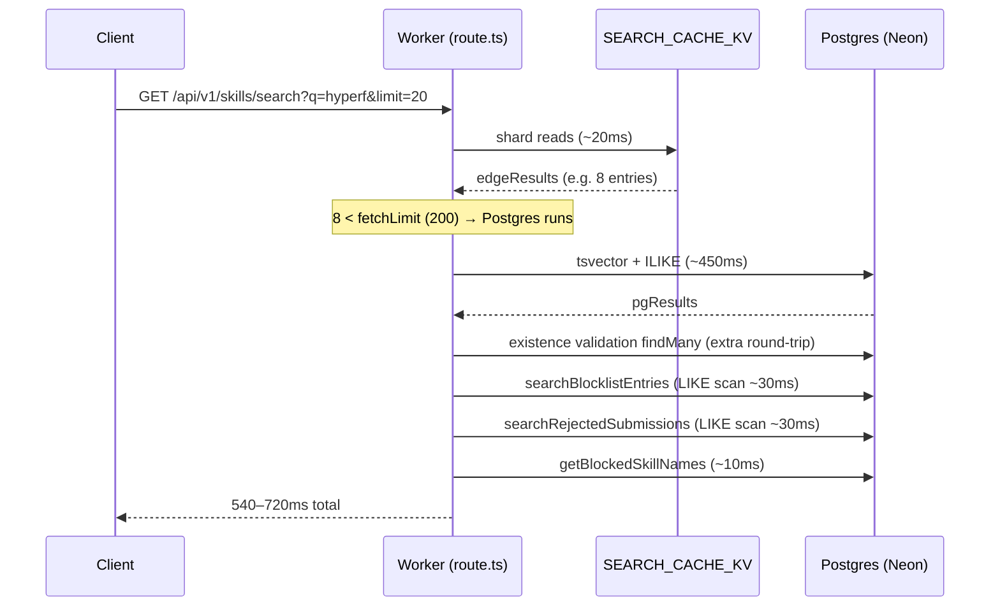
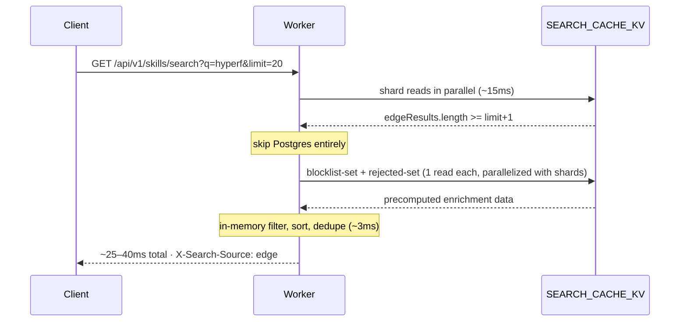
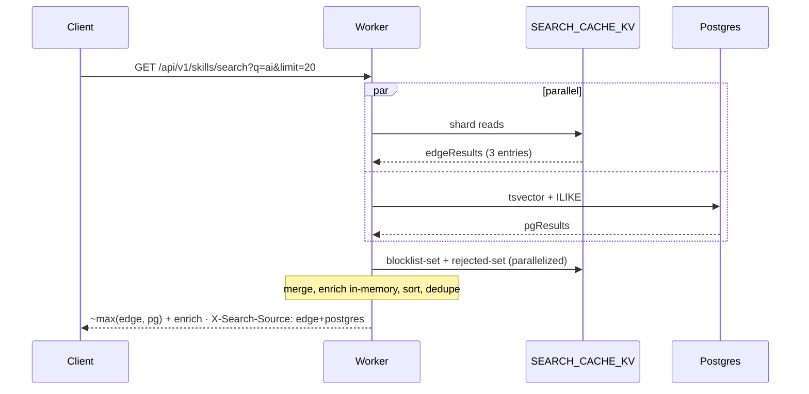
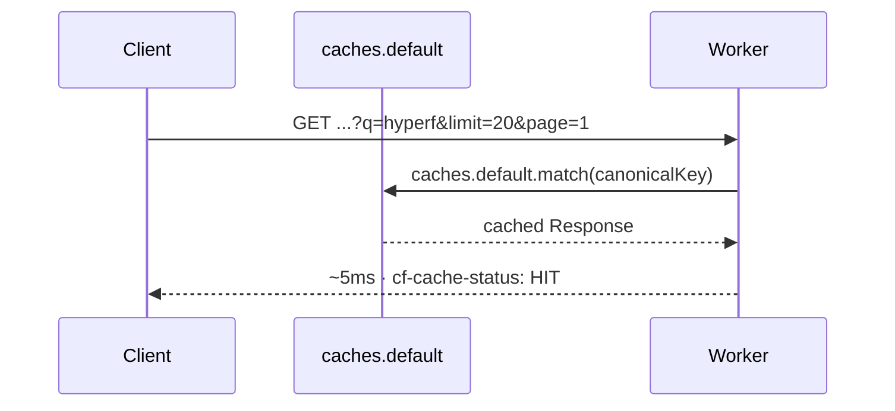

# Implementation Plan: Search API: edge-first short-circuit, KV-precomputed enrichment, response cache

## Overview

Optimize `/api/v1/skills/search` from p50 ~540ms to <80ms (p95 <200ms) for queries that hit the KV index, by removing four execution-time bugs that prevent the existing edge-first design from actually serving from edge:

1. Postgres always runs because the skip threshold (`fetchLimit=200`) is unreachable for narrow queries.
2. Edge and Postgres run sequentially even when both are required.
3. Enrichment fans out to two `contains: insensitive` Postgres scans on every call (un-indexable LIKE).
4. The Cloudflare edge cache never engages — `s-maxage=60` is set but `cf-cache-status` is missing.

The fix lands in three independently shippable, RED-GREEN-REFACTOR steps. Each step targets a specific latency component identified by `Server-Timing` headers in production probes.

| Step | Target | Latency win |
|---|---|---|
| 1. Edge-first short-circuit + parallel PG | postgres dur dropped to 0 for narrow queries | ~450ms |
| 2. Precomputed blocklist/rejected KV | enrichment 70ms → ~5ms | ~65ms |
| 3. Workers Cache API response cache | warm repeated queries served from CF | ~all |

**Cold-cache narrow query** (after step 1+2): edge ~20ms + enrich ~5ms = **~25–40ms**.
**Warm-cache repeated query** (after step 3): CF cache hit = **~5ms**.

## Architecture

### Current request flow (problematic)



### Target flow A — edge-only fast path (after step 1+2)



### Target flow B — edge + PG merge (broad query, edge underfills)



### Target flow C — response cache hit (warm repeated query)



### Components

- **`route.ts`** (modified) — edge-first short-circuit, parallel edge/PG, response cache wrapper.
- **`search.ts`** (modified) — `searchBlocklistEntries`, `searchRejectedSubmissions`, `getBlockedSkillNames` rewritten to read precomputed KV with DB fallback on KV miss.
- **`search-index.ts`** (extended) — new helpers `rebuildBlocklistKv()`, `rebuildRejectedKv()`, `bumpRespVersion()`, plus key constants.
- **`search-index-consumer.ts`** (extended) — bumps `resp-version` on every shard write, handles new `BlocklistRefreshQueueMessage`.
- **`queue/types.ts`** (extended) — `BlocklistRefreshQueueMessage` discriminated union member.
- **`scripts/rebuild-search-local.ts`** (extended) — also writes blocklist + rejected KV on full rebuild.
- **`tests`** — unit tests for new fast path; e2e Playwright assertion of `X-Search-Source: edge`.

### Data Model — KV keyspace

Existing keys (unchanged):
- `search-index:shard:{a-z|0-9|_}` — name shards (already capped at 8000 entries, TTL 7 days)
- `search-index:author-shard:{a-z|0-9|_}` — author shards
- `search-index:meta` — index metadata

New keys (added by this increment):

| Key | Value shape | Cap | TTL |
|---|---|---|---|
| `search-index:blocklist-set` | JSON array of `BlocklistKvEntry` | 5,000 entries | 7 days |
| `search-index:rejected-set` | JSON array of `RejectedKvEntry` | 5,000 entries | 7 days |
| `search-index:resp-version` | string of monotonic integer (e.g. `"1734"`) | n/a | 7 days |

```typescript
// New types added to search-index.ts
export interface BlocklistKvEntry {
  name: string;            // "owner/repo/skill" or raw skillName
  skillName: string;       // original BlocklistEntry.skillName
  threatType: string;
  severity: string;
  reason: string;
  sourceUrl: string | null;
  discoveredBy: string | null;
  ownerSlug?: string;
  repoSlug?: string;
  skillSlug?: string;
  isActive: true;          // only active entries written
  discoveredAt: string;    // ISO — used for rank-truncation
}

export interface RejectedKvEntry {
  name: string;            // "owner/repo/skill"
  skillName: string;
  repoUrl: string;
  ownerSlug: string;
  repoSlug: string;
  skillSlug: string;
  updatedAt: string;       // ISO — used for rank-truncation
}
```

**Cap rationale.** The blocklist is currently low hundreds; 5,000 is a 25× headroom buffer. If exceeded, truncate by `discoveredAt DESC` (newest threats first) — older entries quietly drop from search surfacing, but `getBlockedSkillNames(in: [...])` still has the DB as fallback. Rejected-set follows the same pattern, ranked by `updatedAt DESC`.

**Single-value vs sharded.** The blocklist and rejected sets are intentionally stored as single KV values (not sharded). Both are small (low hundreds of entries each), and `searchBlocklistEntries` performs a substring scan — the search code needs to see all entries regardless of query, so sharding by skill-name first-char would force reading every shard anyway. A single read is simpler and faster.

### Data Model — Cache key

Workers Cache API requires a `Request` object, not an arbitrary string. Build a canonical URL:

```typescript
function buildCacheKey(req: NextRequest, respVersion: string): Request {
  const url = new URL(req.url);
  // Drop unrelated params, keep only those that affect results
  const qs = new URLSearchParams();
  const q = url.searchParams.get("q");
  if (q) qs.set("q", q.trim().toLowerCase()); // normalize whitespace + case
  const cat = url.searchParams.get("category");
  if (cat) qs.set("category", cat);
  qs.set("limit", url.searchParams.get("limit") ?? "10");
  qs.set("page", url.searchParams.get("page") ?? "1");
  qs.set("v", respVersion); // version-keyed → bump invalidates atomically
  // Use a stable internal host so cf-cache scope is per-route, not per-public-host
  const canonical = `https://search-cache.internal/api/v1/skills/search?${qs.toString()}`;
  return new Request(canonical, { method: "GET" });
}
```

Sorting parameter order, lowercasing `q`, and dropping unknown params ensures `?limit=20&q=Hyperf` and `?q=hyperf&limit=20&utm_source=x` produce the same key.

### API Contracts

No external API changes. Internal headers updated:

- `X-Search-Source`: `edge` | `edge+postgres` | `postgres` | `edge+pg-failed` (new — partial success)
- `Server-Timing`: `edge;dur=X, postgres;dur=Y[;desc="skipped"|"failed"], enrichment;dur=Z, cache;dur=W` (cache timing added)
- `cf-cache-status`: present after Workers Cache API write (not currently set)
- `Cache-Control`: unchanged (`public, max-age=10, s-maxage=60, stale-while-revalidate=300`) — the Workers Cache API is the actual mechanism; this header is for downstream caches.

## Technology Stack

- **Runtime**: Cloudflare Workers (OpenNext on Next.js 15)
- **KV**: `SEARCH_CACHE_KV` (existing namespace, ID `4570fe0338444a8a8e2a7b5bcd014057`)
- **Cache**: Workers `caches.default` (Cache API)
- **DB**: Postgres via Neon (existing) — fallback path
- **Queue**: `SUBMISSION_QUEUE` (existing) — extended with new message type
- **Tests**: Vitest (unit) + Playwright (e2e)

## Architecture Decisions

### AD-1: Edge-first skip threshold = `Math.min(50, limit * 5)`

**Decision.** Replace `fetchLimit = 200` with `fetchLimit = Math.min(50, limit * 5)` and skip Postgres when `edgeResults.length >= limit + 1`.

**Rationale.** The `>= 200` threshold is unreachable for narrow typeahead queries (the common case). `limit * 5` gives a ~5× headroom for in-memory filtering, sorting, and dedup; the `Math.min(50, …)` cap bounds memory at ~50KB of compact entries even when the client requests `limit=50`. The `+1` (i.e., compare against `limit + 1`) ensures `hasMore` can still be computed on the slice — same convention as `searchSkillsEdge` itself (`limit + 1` fetch).

**Pagination determinism.** The buffer is `fetchLimit` per page-1 fetch, but pagination operates on the `merged.values()` array after sort+dedup. The current code already paginates with `results.slice(offset, offset+limit)` from a single page-1 fetch of size 200 — narrowing to 50 still produces stable cross-page ordering provided the sort key is deterministic (cert tier asc, githubStars desc, name asc — already implemented at `route.ts:193-200`). Pages beyond `fetchLimit/limit` (e.g., page 2 of `limit=20` with `fetchLimit=50`) require a separate fetch with offset — but **this endpoint already does not support offset-fetch from edge** (passes `page: 1` to `searchSkillsEdge`), so behavior is unchanged for pages where the buffer underflows. Pagination beyond page ~3 falls back to PG today; this PR does not regress that.

**Alternatives rejected.**
- Always-200 fetch: present behavior — the bug we're fixing.
- Dynamic fetch tied to estimated cardinality: too complex; doesn't yield further wins.

### AD-2: Parallel edge + Postgres via `Promise.all`

**Decision.** When PG is needed, structure as `Promise.all([edgePromise, pgPromise])`, not sequential.

**Rationale.** Today edge resolves in ~20ms then PG starts; total ~470ms. Parallel: total ~max(20, 450) = ~450ms (saves ~20ms). Bigger win is for queries where edge underfills but PG is also reasonably fast (~100ms each → save ~100ms).

**Failure semantics.** Use `Promise.allSettled` *internally* but expose `Promise.all`-like semantics: if PG rejects but edge succeeds, return edge results with `X-Search-Source: edge+pg-failed` and a console.warn — never 500. If edge rejects and PG succeeds, return PG with `X-Search-Source: postgres`. Both fail → 500 only when both arrays are empty *and* an error was captured (existing semantics at `route.ts:135-141`).

**Drop the second PG retry.** Existing `route.ts:120-132` retries PG on first failure. With an 8s `withDbTimeout` already in place, doubling on transient slow Neon cold starts hurts more than it helps. A single attempt is sufficient. The DB circuit breaker (`db.ts:12-52`) already provides cluster-level protection.

### AD-3: Blocklist KV format — single value, full record

**Decision.** Store `search-index:blocklist-set` as a single KV value containing a JSON array of full `BlocklistKvEntry` records (no sharding).

**Rationale.**
- **Substring scan over full set.** `searchBlocklistEntries` does `contains: insensitive` on `skillName` AND `reason`; the search code must see all entries regardless of query first-char, so sharding by first-char is useless.
- **Bounded size.** Active blocklist is low hundreds of entries (~50KB JSON). 5,000 cap is 25× headroom and stays well under the 25MB KV value limit.
- **Single read latency.** One `kv.get()` is ~10–20ms; sharded reads parallelize but both still wait on the slowest shard.

**Truncation policy.** If active blocklist exceeds 5,000 entries: rank by `discoveredAt DESC` (newest threats prioritized for surfacing) and drop the tail. `getBlockedSkillNames(in: [...])` retains DB fallback for membership checks (which IS indexable on `BlocklistEntry.skillName`).

**TTL.** 7 days, matching existing shard TTL. Daily rebuild job refreshes TTL — same defense-in-depth pattern.

**Rejected-set.** Identical pattern, key `search-index:rejected-set`, ranked by `updatedAt DESC`.

### AD-4: Cache invalidation — version-key (`resp-version`), not explicit purge

**Decision.** Maintain a monotonic integer at `search-index:resp-version`, included in every Workers Cache API key. Bump on every shard update.

**Rationale.** See ADR `0715-01-search-response-cache-invalidation.md` (drafted alongside this plan).

Summary:
- **(a) Version-key** — chosen. Bump `resp-version` on shard write; cache key includes `?v=N`. Old keys naturally orphan and TTL-evict.
- **(b) Explicit `cache.delete(key)` per shard** — rejected. Workers Cache API has no enumeration; we'd need to track every emitted cache key, which is unbounded across query/limit/page combinations.

**Atomicity caveat.** KV writes are eventually consistent across colos (~60s). A shard write at colo A bumps `resp-version`, but colo B may still see the old version for up to 60s and serve stale-from-cache. This is acceptable: it matches the existing 7-day shard TTL semantics, and the response cache TTL is only 30s anyway. For strict consistency, callers can pass `Cache-Control: no-cache` (we honor it via standard CF semantics).

**Who increments.** `handleSearchIndexUpdate` (queue consumer) calls `bumpRespVersion(kv)` after every successful shard write. New `handleBlocklistRefresh` does the same.

**What reads.** `route.ts` reads `resp-version` once per request (parallelized with the first KV read), uses it in the cache key. KV miss on `resp-version` → fall through to live query (don't fail closed).

**TTL.** 7 days on the version key (matches shard TTL). On expiry it resets to "0" or rebuilds — either is safe because all cached responses with old `?v=N` keys also expire (30s response cache TTL).

### AD-5: Workers Cache API integration

**Decision.** Use `caches.default` keyed by canonical `Request` object. Read first; on miss, build response and `cache.put(key, response.clone())`.

**Implementation contract.**

```typescript
// In route.ts GET handler:
const kv = await getKv();
const respVersionPromise = kv?.get("search-index:resp-version") ?? Promise.resolve("0");

// Try cache hit
const cache = caches.default;
const cacheKey = buildCacheKey(request, await respVersionPromise);
const cached = await cache.match(cacheKey);
if (cached) {
  // Clone before returning — cached Response body can only be consumed once
  return new NextResponse(cached.body, {
    status: cached.status,
    headers: cached.headers,
  });
}

// ... build response as today ...

const response = NextResponse.json({ results, pagination }, { headers });

// Write to cache (must be a fresh, fully-formed Response)
const responseToCache = response.clone();
responseToCache.headers.set("Cache-Control", "public, max-age=30, s-maxage=30");
event.waitUntil?.(cache.put(cacheKey, responseToCache));

return response;
```

**Notes.**
- `response.clone()` is mandatory — Response bodies are streams, single-consumption.
- `Cache-Control` on the cached response controls *Cache API TTL* (not browser caching). 30s matches our staleness budget.
- `event.waitUntil` only available in fetch handlers; in Next.js route handlers we wrap with `ctx.waitUntil` from `getCloudflareContext()`. If unavailable, fire-and-forget the put with `.catch(() => {})`.

**Failure modes.**
- `cache.match` rejects → fall through to live query (don't 500).
- `cache.put` rejects → log warning, return live response (don't 500).
- KV `resp-version` read rejects or returns null → use `"0"` as version (cache still works; old entries simply won't match because their `?v=` differs).

### AD-6: Queue message extension — `BlocklistRefreshQueueMessage`

**Decision.** Add a new discriminated union member to `AnyQueueMessage`:

```typescript
export interface BlocklistRefreshQueueMessage {
  type: "rebuild_blocklist_kv";
  reason: "blocklist_change" | "rejected_change" | "scheduled";
}

export type AnyQueueMessage =
  | SubmissionQueueMessage
  | SearchShardQueueMessage
  | BlocklistRefreshQueueMessage;
```

**Publishers.**
- Admin routes that mutate `BlocklistEntry` (e.g., `POST /api/admin/blocklist`, the existing add/remove flows) — enqueue `{ type, reason: "blocklist_change" }`.
- Submission state changes to/from `REJECTED` — enqueue `{ type, reason: "rejected_change" }`.
- Daily scheduled task (existing) — enqueue `{ type, reason: "scheduled" }` as freshness backstop.

**Consumer.** New `handleBlocklistRefresh` in `search-index-consumer.ts`:
1. Rebuild `search-index:blocklist-set` from DB (active entries only, ranked by `discoveredAt DESC`, capped at 5000).
2. Rebuild `search-index:rejected-set` similarly (ranked by `updatedAt DESC`).
3. Bump `resp-version`.
4. Errors propagate → queue retry.

**Delivery.** Use existing `SUBMISSION_QUEUE` (no new infra). Dispatch via discriminator in the consumer's main entry point (existing pattern).

### AD-7: Failure modes and fallbacks

| Failure | Behavior | Rationale |
|---|---|---|
| KV `blocklist-set` miss | Fall back to existing DB `searchBlocklistEntries` for that request | Don't fail closed; KV will repopulate on next consumer run |
| KV `rejected-set` miss | Same — DB fallback | Same |
| KV `resp-version` read fails | Use `"0"`; live query proceeds; cache key becomes `?v=0` | Worst case: cached "v=0" responses leak across versions — accepted because TTL is 30s |
| `caches.default.match` throws | Skip cache read; live query | Workers Cache API is best-effort optimization |
| `caches.default.put` throws | Log warning; return live response | Same |
| `bumpRespVersion` fails post-shard-write | Log error; subsequent reads may serve stale for up to 30s (response TTL) | Self-healing within one cache TTL cycle |
| Edge KV shard reads all fail | Existing fallback: `searchSkillsEdge` returns `{ results: [], … }`; PG path runs | Already handled in `searchSkillsEdge` via `Promise.allSettled` |
| PG query fails when edge succeeded | Return edge results; `X-Search-Source: edge+pg-failed` | Better than 500 |
| Both PG and edge fail | 500 (existing behavior) | Already handled |

**Don't fail closed.** Every new path has a fallback to existing behavior — perf regressions are acceptable; correctness regressions are not.

## Implementation Phases

### Phase 1: Edge-first short-circuit (US-001)

**Files modified.**
- `src/app/api/v1/skills/search/route.ts`:
  - Lower `fetchLimit` from `200` to `Math.min(50, limit * 5)`.
  - Change skip condition from `>= fetchLimit` to `>= limit + 1`.
  - Wrap edge + PG in `Promise.allSettled`-backed parallel pattern.
  - Drop the existence-validation `db.skill.findMany` block (`route.ts:171-184`).
  - Drop the second PG retry loop (`route.ts:120-132`).
  - Add `edge+pg-failed` source label and corresponding test.

**Files added.** None.

**Verification.**
- Existing `route.test.ts` cases pass (the "skips Postgres when edge >= 200" test must be updated to reflect new threshold).
- New test: `edgeResults.length === limit + 1` skips PG, returns `X-Search-Source: edge`.
- New test: edge resolves before PG starts (assert via mock call timing).
- New test: PG rejects, edge succeeds → 200 + `X-Search-Source: edge+pg-failed`.

### Phase 2: Precomputed blocklist + rejected KV (US-002)

**Files modified.**
- `src/lib/search-index.ts`:
  - Add constants: `BLOCKLIST_KV_KEY`, `REJECTED_KV_KEY`, `RESP_VERSION_KEY`, `BLOCKLIST_KV_CAP`, `RESP_VERSION_TTL_SECONDS`.
  - Add types: `BlocklistKvEntry`, `RejectedKvEntry`.
  - Add functions: `rebuildBlocklistKv(kv, db)`, `rebuildRejectedKv(kv, db)`, `bumpRespVersion(kv)`, `getRespVersion(kv)`.
- `src/lib/search.ts`:
  - Rewrite `searchBlocklistEntries(query, limit)` to read KV first, in-memory filter by `query` substring (matching `skillName` OR `reason`), DB fallback on KV miss.
  - Rewrite `searchRejectedSubmissions(query, limit)` similarly.
  - Rewrite `getBlockedSkillNames(names)` to derive from same KV blocklist-set (build a `Map` over names) — DB fallback on KV miss.
- `src/lib/queue/types.ts`:
  - Add `BlocklistRefreshQueueMessage`. Extend `AnyQueueMessage` union.
- `src/lib/queue/search-index-consumer.ts`:
  - Add `handleBlocklistRefresh(message, kv, db)`.
  - Existing `handleSearchIndexUpdate` calls `bumpRespVersion(kv)` after `updateSearchShard`.
- `scripts/rebuild-search-local.ts`:
  - After existing shard rebuild, also call `rebuildBlocklistKv` and `rebuildRejectedKv`, and bump `resp-version`.

**Files added.**
- `src/lib/__tests__/search-index.test.ts` cases for `rebuildBlocklistKv` round-trip + truncation cap.

**Verification.**
- Existing `route.test.ts` blocklist enrichment tests pass with KV mock returning the same data DB previously returned.
- New test: KV miss → falls back to DB.
- New test: 6000-entry blocklist truncates to 5000 by `discoveredAt DESC`.

### Phase 3: Workers Cache API response cache (US-003)

**Files modified.**
- `src/app/api/v1/skills/search/route.ts`:
  - Read `resp-version` early (parallelized with first KV read).
  - Build canonical cache key.
  - `caches.default.match()` → return early on hit (with cf-cache-status: HIT).
  - On miss, after building response, `caches.default.put(key, response.clone())` with TTL 30s, fire-and-forget via `ctx.waitUntil` if available.

**Files added.** None.

**Verification.**
- Local test: two consecutive requests with same `q` — second has `cf-cache-status: HIT` (or local-cache equivalent).
- New unit test: cache hit short-circuits before edge/PG calls.
- New unit test: shard write → bump version → cache key changes → next read is miss.
- E2E (Playwright): `tests/e2e/search.spec.ts` asserts repeat-call performance is significantly faster.

## Testing Strategy

**TDD strict mode** (per `.specweave/config.json`): each step is RED → GREEN → REFACTOR. Existing test infrastructure already mocks `searchSkills`, `searchSkillsEdge`, `getBlockedSkillNames`, and `getDb` (`route.test.ts:5-22`); extend with KV + cache mocks.

**Unit (Vitest).**
- `route.test.ts` — coverage of all 4 source labels (`edge`, `postgres`, `edge+postgres`, `edge+pg-failed`), pagination determinism across pages, cache hit/miss, parallelism (mocks called concurrently), partial-failure paths.
- `search-index.test.ts` — `rebuildBlocklistKv` round-trip + cap, `bumpRespVersion` monotonicity.
- `search.test.ts` (if not present, add) — `searchBlocklistEntries` KV-then-DB fallback.
- `queue/search-index-consumer.test.ts` — `handleBlocklistRefresh` writes both keys + bumps version.

**E2E (Playwright).**
- `tests/e2e/search.spec.ts` — `X-Search-Source: edge` on a known-indexed query, and second-call `cf-cache-status: HIT`.

**Coverage target.** 90% (per spec frontmatter).

## Technical Challenges

### Challenge 1: Cloudflare Workers Cache API in Next.js route handlers

**Solution.** OpenNext exposes `getCloudflareContext()` which gives access to `ctx.waitUntil`. The Cache API itself (`caches.default`) is a global available in Workers runtime. Use the same pattern already employed by `getKv()` in `search.ts:99-107`.

**Risk.** If the OpenNext adapter doesn't expose `caches.default` in route handler context, fall back to no-op cache (live response only) and log a warning. Detect at startup, not per-request.

### Challenge 2: Cache key sensitivity

**Solution.** Canonical URL builder (see Data Model § Cache key) drops unrelated query params, lowercases `q`, and includes `resp-version`. Sort param order via `URLSearchParams` iteration (it's already insertion-order; we always set them in fixed order).

**Risk.** Trailing whitespace, unicode normalization. We `.trim()` and lowercase `q` already; for unicode, we accept exact-match cache misses on near-identical queries (acceptable: live path is still fast post-step-1).

### Challenge 3: KV eventual consistency vs cache invalidation

**Solution.** Documented as accepted in AD-4 — 30s response TTL bounds staleness. Production observability: include `Server-Timing: respver=N` so we can correlate stale-cache complaints with version drift.

**Risk.** During a high-volume rebuild (full reindex), `resp-version` bumps once per shard write — could cause cache thrash. Mitigation: in `buildSearchIndex` (full rebuild), bump `resp-version` *once at the end* rather than per-shard. Incremental updates (`updateSearchShard`) bump per-write — they're rare relative to reads.

### Challenge 4: `Promise.allSettled` failure visibility

**Solution.** Capture rejection reasons explicitly; emit `console.warn` with structured fields: `{ source: "pg|edge", err, q, limit }`. Add a new `Server-Timing` value `dur` of 0 with `desc="failed"` for the failed source, so production probes show what fell over.

**Risk.** Silent partial failures masking a degraded PG that needs ops attention. Mitigation: existing DB circuit breaker (`db.ts:12-52`) opens after 5 consecutive failures and emits its own warning; this work doesn't bypass that.

## Cross-references

- **ADR**: `0715-01-search-response-cache-invalidation.md` (new — version-key vs explicit purge).
- **Spec ACs**: linked from this plan once spec.md is finalized by the PM agent.
- **Prior art**: existing edge-first shard infrastructure at `src/lib/search-index.ts` and queue-driven KV updates at `src/lib/queue/search-index-consumer.ts` — this work extends, not replaces.
- **Performance ADR index**: see `_index-performance.md`.
