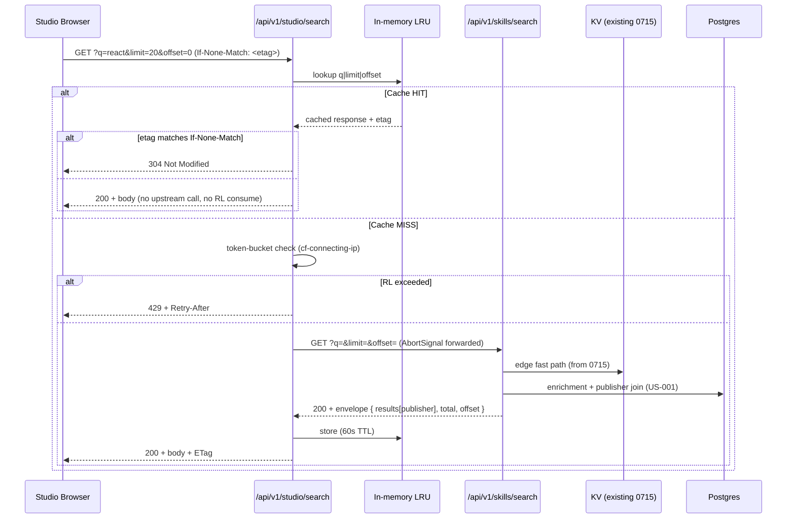
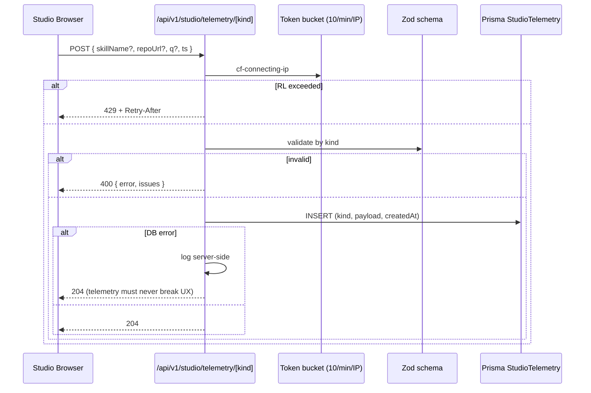

# Implementation Plan: Studio search API extension + same-origin proxy + telemetry endpoints

## Overview

Three additive surfaces in `vskill-platform` (Next.js App Router on Cloudflare Workers via OpenNext, Prisma over Postgres):

| Surface | Location | Owner |
|---|---|---|
| Extend `GET /api/v1/skills/search` response | `src/app/api/v1/skills/search/route.ts` + `src/lib/search.ts` | US-001 |
| New `GET /api/v1/studio/search` proxy | `src/app/api/v1/studio/search/route.ts` (new) | US-002 |
| New `POST /api/v1/studio/telemetry/{kind}` | `src/app/api/v1/studio/telemetry/[kind]/route.ts` (new) + Prisma migration | US-003 |

Sibling increments [0717-studio-find-ui](../0717-studio-find-ui/) and [0718-studio-submit-deeplink](../0718-studio-submit-deeplink/) consume this contract and develop in parallel against mocks. Contract document at `.specweave/docs/contracts/studio-search-api-v1.md` is a deliverable.

## Architecture

### Request flow — Studio search



### Request flow — Telemetry (fire-and-forget)



## Component breakdown

### 1. Search response extension (US-001)

**Files**:
- `src/lib/search.ts` — extend the search-result builder to include the publisher join. Use Prisma `include: { submission: { include: { publisher: true } } }` or equivalent path. Map to the new `publisher: { slug, name, verified } | null` shape; drop nulls gracefully.
- `src/app/api/v1/skills/search/route.ts` — accept `offset` query param (default 0); compute `total` via a parallel `db.skill.count({ where: ... })` reusing the same predicate as the search query. Return both in the envelope.
- Add `Server-Timing: enrichment;desc=publisher;dur=<ms>` segment alongside the existing 0715 segments.

**Graceful degrade**: wrap the publisher join in a try/catch with a 50ms soft timeout. If the join exceeds the timeout or throws, return `publisher: null` for all results in this request and log a `publisher_join_degraded` warning with the duration.

### 2. Studio search proxy (US-002)

**New files**:
- `src/app/api/v1/studio/search/route.ts` — handler.
- `src/lib/studio/lru.ts` — minimal LRU map (entries, max=100, TTL=60_000ms). Per-isolate. ~40 lines.
- `src/lib/studio/rate-limit.ts` — token bucket (capacity=60, refill=60/60s). Per-IP key = `cf-connecting-ip || req.socket.remoteAddress`. ~50 lines.
- `src/lib/studio/etag.ts` — SHA-256 hash of canonical JSON, base64url-truncated to 16 chars.

**Handler outline** (pseudo):
```ts
export async function GET(req: NextRequest) {
  const { q, limit, offset } = parseAndClamp(req);  // limit<=30, offset<=5000
  const key = `${q}|${limit}|${offset}`;

  const cached = lru.get(key);
  if (cached) {
    if (req.headers.get('if-none-match') === cached.etag) return new Response(null, { status: 304, headers: cached.respHeaders });
    return jsonResponse(cached.body, { etag: cached.etag, source: 'lru' });
  }

  if (!rateLimit.tryConsume(getClientIp(req))) return new Response(null, { status: 429, headers: { 'Retry-After': '60' } });

  const upstream = new AbortController();
  req.signal.addEventListener('abort', () => upstream.abort());
  try {
    const r = await fetch(`/api/v1/skills/search?q=${q}&limit=${limit}&offset=${offset}`, { signal: upstream.signal });
    if (!r.ok && r.status >= 500) {
      log.error('upstream_5xx', { status: r.status, q });
      return jsonResponse({ error: 'search_unavailable' }, { status: 502 });
    }
    const body = await r.json();
    const etag = computeEtag(body);
    lru.set(key, { body, etag, respHeaders: { 'Cache-Control': 'private, max-age=60' } });
    return jsonResponse(body, { etag });
  } catch (e) {
    if (e.name === 'AbortError') throw e;  // client disconnected, don't sanitize
    log.error('proxy_error', { err: e, q });
    return jsonResponse({ error: 'search_unavailable' }, { status: 502 });
  }
}
```

### 3. Telemetry endpoints (US-003)

**Prisma migration** — add to `prisma/schema.prisma`:
```prisma
model StudioTelemetry {
  id        String   @id @default(cuid())
  kind      String   // "submit-click" | "install-copy"
  payload   Json
  createdAt DateTime @default(now())

  @@index([kind, createdAt])
}
```

**New file** `src/app/api/v1/studio/telemetry/[kind]/route.ts`:
- `kind` param ∈ `{ "submit-click", "install-copy" }`; reject others with 404.
- Zod schemas:
  - `submit-click`: `{ repoUrl: z.string().url().optional(), q: z.string().max(200).optional(), ts: z.number().int().positive() }`
  - `install-copy`: `{ skillName: z.string().min(1).max(200), q: z.string().max(200).optional(), ts: z.number().int().positive() }`
- Token bucket (capacity=10, refill=10/60s) reused from `src/lib/studio/rate-limit.ts` with separate bucket map.
- DB write inside `try/catch` — on failure, `log.error('telemetry_db_failed', ...)` and still return 204.
- **PII guard**: code-review checklist item — grep this file for `x-forwarded-for|user-agent|req.headers` in CI; presence fails review.

## ADR stubs

- **ADR-XXXa**: Studio→Registry calls go via same-origin proxy, not browser CORS. Buys cache + RL shield + version drift insulation.
- **ADR-XXXb**: Telemetry uses dedicated `StudioTelemetry` table, not third-party analytics. Sovereignty + GDPR posture.
- **ADR-XXXc**: Per-isolate LRU, not KV-shared. Cost-neutral and adequate for as-you-type per-user pattern.

## Test strategy

| Layer | Target | Tool |
|---|---|---|
| Unit | `lru.ts`, `rate-limit.ts`, `etag.ts` | Vitest |
| Integration | `route.ts` for studio search proxy (mocked upstream) | Vitest + MSW |
| Integration | Search response extension (`searchSkills` returns publisher) | Vitest |
| Integration | Telemetry routes (Zod, RL, DB-fail-still-204, no-PII greps) | Vitest |
| Regression | Existing `vskill find` integration tests | Vitest in `vskill/` |
| E2E smoke | One Playwright spec hits `/api/v1/studio/search` and telemetry endpoints over the dev Worker | Playwright |
| Perf smoke | Post-deploy curl loop ×20 measuring p50/p95 vs budget | shell script |

## Coordination with siblings

- **Contract doc** at `.specweave/docs/contracts/studio-search-api-v1.md` (T-010 deliverable) — siblings 0717/0718 link to this for their MSW mocks.
- **Mock fixtures** for siblings — export `src/lib/studio/__fixtures__/search-results.json` with realistic shapes (verified+certified, blocked, no-publisher) so 0717's UI tests use canonical data.
- **Integration milestone** — 0717 and 0718 each have a final task to swap their MSW mocks for live calls once 0716's endpoints are deployed.

## Risk register (linked from spec.md)

See spec.md "Risk register" — duplicated here for plan-mode review:

| Risk | Mitigation |
|---|---|
| Publisher join slows search | Graceful degrade + 50ms soft timeout (US-001 design above) |
| LRU memory pressure | Hard cap 100 entries (~500KB) |
| IP spoofing | `cf-connecting-ip` only, never `x-forwarded-for` |
| Telemetry table growth | 90-day sweep deferred to follow-up (out of scope) |
| `vskill find` regression | T-001 RED test runs CLI integration suite against new response shape |
