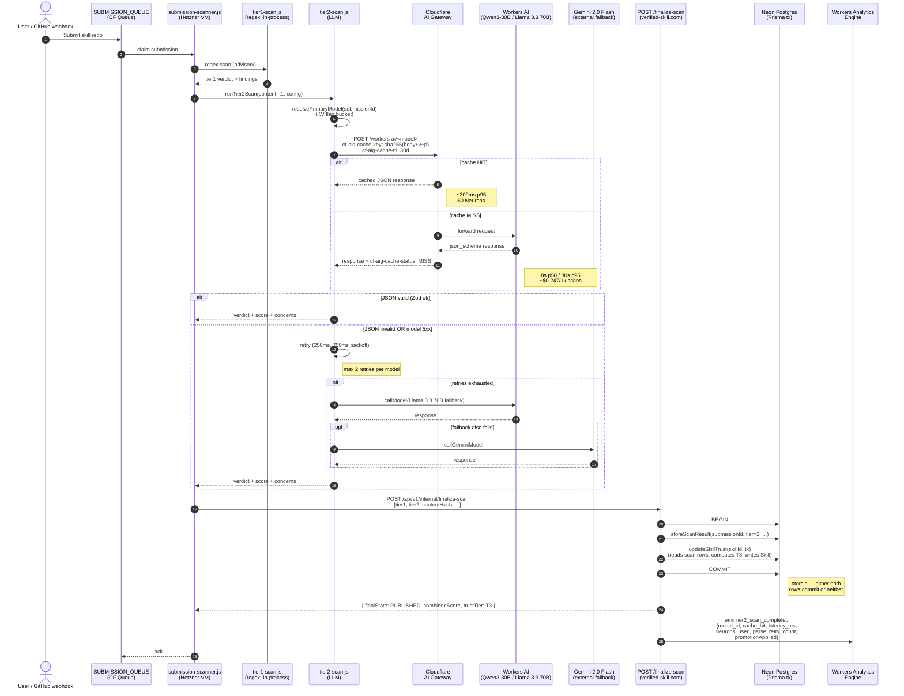

# Implementation Plan: Tier-2 LLM Scan Restoration, Cost Optimization, and Trust-Tier Label Clarification

**Increment**: `0721-tier2-llm-scan-restoration-and-clarity`
**Type**: bug + cost-optimization (P0)
**Repo target**: `repositories/anton-abyzov/vskill-platform`
**Depends on**: `0713-queue-pipeline-restoration` (must ship first; tier-2 is downstream of the broken submission queue)

## Overview

Three stacked production problems on verified-skill.com, all routed through the tier-2 LLM scanner. The fix is a single coordinated change across the scan pipeline:

1. **Restoration** (Phase A, P0) — the scanner died 2026-03-26; `ScanResult` table is empty for the last 30 days. Diagnose the cliff, backfill the dead window once 0713 ships, and add an in-transaction `updateSkillTrust` call so a Tier-2 PASS deterministically promotes T2 → T3 in the same DB write that records the scan result. No more "scan succeeded but trust tier didn't update" failure mode.
2. **Cost optimization** (Phase B, P1) — replace the Llama 4 Scout primary with `@cf/qwen/qwen3-30b-a3b-fp8` (84% Neuron-cost reduction), add Cloudflare AI Gateway exact-match caching keyed on `sha256(content + SCANNER_VERSION + SYSTEM_PROMPT_VERSION)` (≥60% hit rate target after one week), and replace the regex JSON extraction with native `json_schema` mode + Zod re-validation. Effective unit cost lands at ~$0.05/1k scans (~30× reduction).
3. **Label clarification** (Phase C, P1) — rename the misleading composite trust badge `T2 BASIC` to `T2 PARTIAL` (with tooltip "Pattern scan complete; deep LLM verification pending") and rename the SAST gate chips on the skill detail page from `Tier 1 PASS / Tier 2 PASS` to `Static Scan PASS / Deep Scan PASS` (UI label only — `ExternalScanResult.tier` integer is unchanged).

The Qwen3 model swap rolls out behind a runtime KV-backed feature flag (`tier2-rollout-pct`, ramped 10 → 25 → 50 → 100% over 48h) with auto-rollback on error rate, latency, or FAIL-verdict drift. A separate 50k-Neurons/day cost kill-switch fails over to Gemini external when tripped.

All changes are TDD-strict: every task has a failing test (RED) before implementation (GREEN). 90% coverage target.

## Architecture

### High-level component view

The change touches three layers and one new infra binding:

- **Hetzner crawl-worker VMs** (`crawl-worker/`): the scanner that calls Workers AI. Three changes here — model chain, AI Gateway placement, json_schema parsing.
- **Cloudflare Workers (Next.js on `verified-skill.com`)**: the platform that receives finalize-scan POSTs and persists results. Two changes — in-transaction `updateSkillTrust` call, Workers Analytics Engine `tier2_scan_completed` event.
- **Next.js UI**: trust badge and skill page. Two label changes.
- **Cloudflare AI Gateway**: new binding (slug stored as secret, default `tier2-scan-gateway`). Free tier covers our volume.

Backfill is driven from the crawl-worker VMs (they already hold cfAccountId/cfApiToken per `reference_hetzner_vms.md`), running a new idempotent `crawl-worker/scripts/backfill-tier2.js` that walks `Submission` rows missing tier-2 results and re-enqueues them at 1000/hour. Hyperframes (the visible symptom) is processed first.

### Sequence diagram



### Data flow notes

- **Atomicity boundary**: the `prisma.$transaction` block wraps `storeScanResult` (tier-2 only) + `updateSkillTrust`. If either fails, both roll back; the submission-scanner sees a non-2xx and re-enqueues via the queue's `max_retries=3` policy.
- **Cache key isolation**: each `(content + SCANNER_VERSION + SYSTEM_PROMPT_VERSION)` triple maps to a unique Gateway cache entry. Bumping either constant in `tier2-scan.js` invalidates all cached entries on next deploy.
- **Idempotency**: the scan path is keyed on `(skillId, scanResultId)` via the natural FK chain (`ScanResult.submissionId` → `Submission.skillId`). Concurrent rescans on the same skill cannot double-promote — the `prisma.$transaction` row-locks `Skill` for the duration of the recompute.

## Component Design

### Scanner — `crawl-worker/lib/tier2-scan.js`

Modified surface:

```js
// Constants (top of file)
const SCANNER_VERSION         = 3;                       // bump on logic changes
const SYSTEM_PROMPT_VERSION   = 1;                       // bump on prompt-only changes
const PRIMARY_MODEL_QWEN3     = "@cf/qwen/qwen3-30b-a3b-fp8";
const PRIMARY_MODEL_SCOUT     = "@cf/meta/llama-4-scout-17b-16e-instruct";  // kept during 48h ramp
const FALLBACK_MODEL          = "@cf/meta/llama-3.3-70b-instruct-fp8-fast";
const GEMINI_MODEL            = "gemini-2.0-flash";
const RETRY_DELAYS_MS         = [250, 750];              // 2 retries
const NEURONS_DAILY_BUDGET    = 50000;                   // kill-switch threshold

// New helpers
async function resolvePrimaryModel(submissionId, config)  // ADR 0721-04 bucket logic
async function isKillSwitchTripped(config)                // queries RATE_LIMIT_KV neuron counter
async function callModelViaGateway(model, body, config)   // adds cf-aig-cache-* headers
function buildCacheKey(body)                              // sha256(body + version markers)

// Modified
async function callLlm(messages, config)                  // chain: kill-switch → primary → 70B → Gemini
function parseAnalysisResponse(raw)                       // Zod-validate; throw on schema fail (no defaults)
```

The `runTier2Scan` signature is unchanged. Caller (`submission-scanner.js`) does not need to change beyond passing `aiGatewaySlug` in `config` (read from env var `TIER2_AI_GATEWAY_SLUG`, default `"tier2-scan-gateway"`).

### Platform — `src/app/api/v1/internal/finalize-scan/route.ts`

The tier-2 success branch (lines ~362-454 in current code) is wrapped in a transaction:

```ts
const submission = await getDb().submission.findUnique({ where: { id }, select: { skillId: true } });
const trustResult = await getDb().$transaction(async (tx) => {
  await storeScanResult(id, tier2Payload, contentHash, tx);
  if (!submission?.skillId) return null;
  return updateSkillTrust(submission.skillId, tx);
});

emitAnalyticsEvent("tier2_scan_completed", {
  submissionId: id,
  modelId: tier2.model,
  cacheHit: tier2.cacheHit ?? false,
  latencyMs: tier2.durationMs,
  neuronsUsed: tier2.neuronsUsed ?? 0,
  parseRetryCount: tier2.parseRetryCount ?? 0,
  promotionApplied: trustResult !== null,
  trustTier: trustResult?.trustTier ?? null,
});
```

`storeScanResult` already accepts an optional `tx` argument; if not, it gets one. `updateSkillTrust`'s `TrustPrismaClient` interface (`src/lib/trust/trust-updater.ts:14-79`) is structurally compatible with `Prisma.TransactionClient` — no signature change needed.

The `tier2.cacheHit`, `neuronsUsed`, `parseRetryCount` fields are populated by the scanner from AI Gateway response headers + token usage; they pass through the existing `Tier2Payload` interface (which gets three new optional fields).

### UI — `TrustBadge.tsx` and skill detail page

`TrustBadge.tsx`: rename `BASIC` → `PARTIAL`, add `tooltip` field on every tier (used as the HTML `title` attribute). See ADR 0721-05 for the full mapping.

`src/app/skills/[owner]/[repo]/[skill]/page.tsx`: lines 362-363, change ScanChip labels `Tier 1` → `Static Scan`, `Tier 2` → `Deep Scan`. The `tier1Pass`/`tier2Pass` TS variable names are unchanged.

### Backfill script — `crawl-worker/scripts/backfill-tier2.js` (NEW)

```
node crawl-worker/scripts/backfill-tier2.js [--dry-run] [--limit N] [--rate-per-hour 1000] [--priority hyperframes-com/hyperframes/hyperframes] --confirm
```

- Reads `Submission` rows where `state IN ('PUBLISHED', 'AUTO_APPROVED')` AND no `ScanResult` row with `tier=2 AND createdAt > '2026-04-25'` exists.
- Re-enqueues each into the queue (or directly invokes `processOneSubmission` if the queue is healthy).
- Token-bucket rate limit: default 1000/hour, configurable.
- Idempotency: skips submissions that already have a tier-2 row created post-cutover.
- Auth: requires `INTERNAL_KEY` env var + `--confirm` flag (per ADR security mitigation).

The script lives in a *new* directory `crawl-worker/scripts/` (currently absent — verified via `ls`). The directory itself is created as part of Task 1.

### Wrangler binding (Workers paths)

```jsonc
// wrangler.jsonc
"ai": {
  "binding": "AI"
},
// NEW — used by Workers-side LLM calls (currently none in tier-2 scan path,
// but reserved for future migration of scanner from VMs to Workers)
"ai_gateway": {
  "binding": "AI_GATEWAY",
  "slug": "tier2-scan-gateway"  // Anton creates this in CF dashboard if absent
}
```

The crawl-worker (Hetzner-hosted, not Cloudflare-hosted) does NOT use the wrangler binding — it constructs the gateway URL directly: `https://gateway.ai.cloudflare.com/v1/<accountId>/<gatewaySlug>/workers-ai/<model>`. Slug comes from env var `TIER2_AI_GATEWAY_SLUG` (set in `crawl-worker/.env.vm{1,2,3}`, never plaintext-committed).

## ADRs

Five decisions documented in `.specweave/docs/internal/architecture/adr/`:

- **[0721-01](../../docs/internal/architecture/adr/0721-01-in-transaction-trust-tier-recompute.md)**: In-transaction trust-tier recompute (in `finalize-scan/route.ts`) vs separate cron. Choice: in-transaction.
- **[0721-02](../../docs/internal/architecture/adr/0721-02-ai-gateway-cache-key-strategy.md)**: AI Gateway placement + exact-match cache key `sha256(body + SCANNER_VERSION + SYSTEM_PROMPT_VERSION)`, 30-day TTL.
- **[0721-03](../../docs/internal/architecture/adr/0721-03-model-fallback-chain.md)**: Model chain — Qwen3-30B-A3B-fp8 → Llama 3.3 70B → Gemini 2.0 Flash. 2 retries per model with 250ms/750ms backoff. 50k Neurons/day cost kill-switch.
- **[0721-04](../../docs/internal/architecture/adr/0721-04-feature-flagged-rollout.md)**: Runtime KV-backed feature flag `tier2-rollout-pct` for the model swap. 10 → 25 → 50 → 100% ramp over 48h. Auto-rollback on error rate >5%, p95 >40s, or FAIL-verdict rate 2× baseline.
- **[0721-05](../../docs/internal/architecture/adr/0721-05-trust-tier-label-semantics.md)**: `T2 BASIC` → `T2 PARTIAL` (tooltip: "Pattern scan complete; deep LLM verification pending"). SAST chips: `Tier 1` / `Tier 2` → `Static Scan` / `Deep Scan`. UI-only; DB semantics unchanged.

## NFRs

| Concern | Target | Verification |
|---|---|---|
| **Latency p50** | ≤ 8s | AE `tier2_scan_completed.latency_ms` percentile, 7-day window |
| **Latency p95** | ≤ 30s | AE percentile, blocking gate at 0.95 |
| **Latency p99** | ≤ 50s | AE percentile |
| **Hard timeout** | 60s (existing `LLM_TIMEOUT_MS`) | unchanged |
| **Cache-hit latency p95** | < 200ms | AE `cache_hit=true` filter |
| **Cache hit rate** | ≥ 60% after 7 days steady traffic | AI Gateway dashboard |
| **Effective unit cost** | ≤ $0.10/1k scans (target $0.05) | AE `neurons_used` aggregate / 1000 |
| **Daily Neuron budget** | 50,000/day cap | `RATE_LIMIT_KV` counter; auto-failover to Gemini |
| **Backfill rate** | 1000/hour, hyperframes first | token-bucket in script |
| **Test coverage** | ≥ 90% (per metadata `coverageTarget: 90`) | `vitest --coverage` |
| **TDD compliance** | every task has failing test before impl | enforced by `testing.tddEnforcement: strict` |
| **Rollout window** | 48h (10/25/50/100%) | KV `tier2-rollout-pct` |

## Risks & Mitigations

| Risk | Impact | Likelihood | Mitigation |
|---|---|---|---|
| **0713 ships late or has its own incidents** — backfill blocked | Phase A blocked | Medium | Sequence: Task 1 (diagnose) and Task 2 (in-transaction promotion) can land independently of 0713; only Task 4 (backfill) is gated. Coordinate with 0713 owner via team-lead. |
| **Workers AI quota exhaustion during backfill** | Backfill stalls; production scans degrade | Medium | 1000/hour rate-limit. 50k Neurons/day kill-switch fails over to Gemini external (free tier). AI Gateway 60-80% cache hit reduces Worker AI load. Pause backfill if budget cap fires twice in 24h. |
| **Concurrent scan races on same skill** (user-rescan + backfill) | Double-promotion or stale tier | Low | `prisma.$transaction` row-locks `Skill`. Cache key dedupes identical content. `updateSkillTrust` is idempotent (always reads latest scan rows). |
| **Qwen3-30B JSON drift** — schema-mode response invalid | Verdicts wrong; fallthrough to 70B | Medium | `json_schema` mode + Zod re-validation. 2 retries with backoff. Llama 3.3 70B fallback. 48h feature-flag ramp catches drift before full rollout. |
| **Cache poisoning / stale verdicts on prompt change** | Wrong verdicts persist for 30d | Low | `SCANNER_VERSION` + `SYSTEM_PROMPT_VERSION` in cache key. Bumping either invalidates everything atomically. Documented as deploy checklist. |
| **In-transaction promotion fails after scan** | Scan write rolls back; submission re-enqueued | Low | Designed-in (preferred over partial state). Queue's `max_retries=3` handles transient failure. DLQ catches persistent. AE event emitted post-tx logs `promotionApplied: false` cases. |
| **Trust-updater reads stale scan results in race** | Wrong tier computed | Low | `updateSkillTrust` reads inside the transaction; the just-written `ScanResult` row is visible. Verified by integration test. |
| **AI Gateway slug mis-set** (env var typo, slug doesn't exist in CF) | Every scan errors at the gateway URL | Low | Health check on scanner startup: probe the gateway URL with HEAD; log + alert if 404. Default slug `tier2-scan-gateway` checked into a fixed name (Anton creates it during deploy). |
| **Auto-rollback flapping** (Qwen3 fails → revert → re-ramp → fails again) | Confusion; partial rollouts | Low | No auto-re-ramp. Recovery requires manual KV write. Anton inspects AE dashboard before deciding. |
| **`MAX_STORED_FINDINGS=50` truncates Tier-2 evidence** in race with backfill | Lost forensics | Very Low | Existing constraint; not changed by this increment. Out-of-scope. |
| **Backfill scans block on private repos** (skills with revoked access) | Backfill stalls per-row | Low | Script catches per-row exceptions, logs to `backfill-skipped.jsonl`, continues. Skipped rows are surfaced for manual review. |
| **`isKillSwitchTripped` adds KV read latency** to every scan | +5-10ms p50 | Very Low | KV reads are sub-ms in CF; from Hetzner ~30ms one-way. Acceptable inside 8s budget. Cache the result for 60s in process memory if it bites. |

## Critical Files Touched

| File | Change | Layer | LoC est. |
|---|---|---|---|
| `crawl-worker/lib/tier2-scan.js` | Model chain swap, AI Gateway integration, json_schema parsing, kill-switch, feature-flag bucket | Scanner | ~150 |
| `crawl-worker/sources/submission-scanner.js` | Pass `aiGatewaySlug` and KV config to `runTier2Scan`; structured failure logging | Scanner | ~30 |
| `crawl-worker/scripts/backfill-tier2.js` | **NEW** — idempotent backfill script | Scanner / ops | ~250 |
| `crawl-worker/.env.vm{1,2,3}.example` | Document `TIER2_AI_GATEWAY_SLUG` | Config | ~5 |
| `src/app/api/v1/internal/finalize-scan/route.ts` | Wrap tier-2 success branch in `prisma.$transaction`, call `updateSkillTrust` inside; emit `tier2_scan_completed` AE event | Platform | ~60 |
| `src/lib/submission-store.ts` (`storeScanResult`) | Accept optional `tx` argument | Platform | ~10 |
| `src/lib/trust/trust-updater.ts` | No code change — verify `TrustPrismaClient` interface is compatible with `Prisma.TransactionClient` (it is, structurally) | Platform | 0 |
| `src/lib/trust/trust-score.ts` | No code change — promotion logic at lines 184-190 already correct | Platform | 0 |
| `src/app/components/TrustBadge.tsx` | `BASIC` → `PARTIAL`; add `tooltip` field; render via `title` attribute | UI | ~20 |
| `src/app/skills/[owner]/[repo]/[skill]/page.tsx` | Lines 362-363: `Tier 1` → `Static Scan`, `Tier 2` → `Deep Scan` | UI | ~5 |
| `wrangler.jsonc` | Add `ai_gateway` binding (Workers-side; reserved for future migration) | Infra | ~5 |
| `prisma/schema.prisma` | **No change** — `ScanResult.tier=2` semantics preserved; `Skill.trustTier='T2'` enum unchanged | DB | 0 |
| `crawl-worker/lib/tier2-scan.test.js` | **NEW** — unit tests for retry, kill-switch, cache key, bucket logic, json_schema parse | Tests | ~400 |
| `src/lib/trust/__tests__/trust-updater.in-tx.test.ts` | **NEW** — Miniflare integration test for in-tx promotion + rollback | Tests | ~150 |
| `tests/e2e/tier2-restoration.spec.ts` | **NEW** — Playwright: hyperframes → T3 VERIFIED post-backfill; new submission completes T1+T2 in <30s p95; SAST chip labels | Tests | ~120 |

Total: ~1,200 LoC across 8 source files + 3 new test files + 1 new script. Stays under the 1,500-line file limit per `CLAUDE.md`.

## Migration Strategy

The increment is sequenced in three phases that must ship in order, but can be developed in parallel where safe.

### Phase A — Restore (P0, blocks T2 → T3 promotion)

**Goal**: hyperframes promotes to T3 VERIFIED; the dead-window backfill completes; future scans deterministically promote.

| Task | Depends on | Parallelizable | Notes |
|---|---|---|---|
| 1. Diagnose 2026-03-26 cliff | — | — | Verify queue-starvation hypothesis. Also check Workers AI quota, env-var drift across vm1/2/3, JSON parse failure rate spike. |
| 2. In-transaction `updateSkillTrust` in `finalize-scan/route.ts` | — | with B & C | Independent of 0713 — can land first. |
| 3. AE `tier2_scan_completed` event emission | 2 | with B & C | Independent. |
| 4. **Backfill script** | 0713 closure, 2 | sequential | `--dry-run --limit 10` first. Hyperframes prioritized. 1000/hour rate-limit. Estimated ~30h to drain. |

### Phase B — Cost-optimize (P1, parallelizable with A and C)

**Goal**: ~30× cost reduction; deterministic JSON via `json_schema`; vendor-diverse fallback.

| Task | Depends on | Parallelizable | Notes |
|---|---|---|---|
| 5. AI Gateway slug provisioning + env var plumbing | — | with A & C | Anton creates the gateway in CF dashboard if absent. |
| 6. AI Gateway caching wrapper around Workers AI calls | 5 | with C | Adds `cf-aig-cache-key` + `cf-aig-cache-ttl` headers. |
| 7. Hardened JSON parsing (`json_schema` + Zod) | — | with C | Replaces regex `match(/\{[\s\S]*\}/)`. Eliminates parse-failure-throws-away-completion bug. |
| 8. Retry policy (2 retries per model with backoff) | 7 | sequential after 7 | |
| 9. Kill-switch (50k Neurons/day) + Gemini failover | 7 | with 8 | KV counter, reset at midnight UTC. |
| 10. Feature-flag rollout machinery (`tier2-rollout-pct`) | 7 | with 8, 9 | Bucket on `submissionId`; default 0%. |
| 11. Auto-rollback cron (AE-based threshold check) | 10 | with 8, 9 | Reuses existing 10-min cron. |
| 12. Ramp 10 → 25 → 50 → 100% (manual KV writes between phases) | 10, 11 | sequential | 4h / 12h / 16h / 16h = 48h. |
| 13. Cleanup — remove Llama 4 Scout + flag bucket | 12 | sequential | After 48h at 100% with no rollback. |

### Phase C — Clarify badges (P1, parallelizable with A and B)

**Goal**: hyperframes page shows `T3 VERIFIED` (post-backfill) + `Static Scan PASS` / `Deep Scan PASS` chips.

| Task | Depends on | Parallelizable | Notes |
|---|---|---|---|
| 14. `TrustBadge.tsx` label + tooltip | — | with A & B | Pure UI. |
| 15. Skill detail page SAST chip rename | — | with A & B | Pure UI. |
| 16. Snapshot + a11y test updates | 14, 15 | sequential | |

### Cutover sequence

1. Deploy Phase B code (steps 5-11) with `tier2-rollout-pct=0` — Qwen3 dormant.
2. Deploy Phase A code (steps 2-3) — in-transaction promotion live.
3. Deploy Phase C code (steps 14-16) — labels updated.
4. Manually set `tier2-rollout-pct=10` — canary begins.
5. Watch AE dashboard for 4h. If clean, ramp to 25 → 50 → 100% per schedule.
6. Once 0713 is closed, run `backfill-tier2.js --dry-run --limit 10` against prod. If clean, full backfill.
7. Monitor: hyperframes page shows `T3 VERIFIED` after its row in the backfill batch finishes.
8. After 48h at 100% with no rollback, ship the cleanup commit (step 13).

### Rollback plan

| What broke | Recovery |
|---|---|
| Qwen3 verdict drift detected | Auto-rollback fires → `tier2-rollout-pct=0`. Manual KV write to confirm. ≤30s recovery. |
| Cost spike (Neurons/day cap) | Kill-switch flips. All scans go to Gemini (free). Recovery once next-day counter resets, OR bump cap, OR fix Qwen3. |
| In-transaction promotion fails | Submission re-enqueued via queue retries. DLQ catches persistent failures (existing infra). |
| Backfill stalls | Script catches per-row exceptions, logs `backfill-skipped.jsonl`, continues. Re-run with `--limit` skip parameter on the failed range. |
| Cache poisoning suspected | Bump `SCANNER_VERSION` constant + deploy. All cache entries invalidate atomically. |
| UI label regression | Revert the `TrustBadge.tsx` / page commit. Pure UI; safe to revert independently. |

## Verification (end-to-end)

1. **Diagnostic** (Phase A Task 1): `SELECT MAX("createdAt"), COUNT(*) FROM "ScanResult" WHERE tier=2 AND "createdAt" > now() - interval '24 hours'` returns non-zero post-deploy.
2. **In-tx promotion**: integration test submits a fixture, asserts `Skill.trustTier='T3'` in the same response that returns `finalState='PUBLISHED'`. Failure injection asserts rollback (no `ScanResult` row written).
3. **Backfill**: `--dry-run --limit 10` against staging; full run against prod; hyperframes appears in `Skill.trustTier='T3'` within one hour of script start.
4. **UI**: `https://verified-skill.com/skills/heygen-com/hyperframes/hyperframes` shows `T3 VERIFIED` badge + `Static Scan PASS` + `Deep Scan PASS` chips.
5. **Cost**: AI Gateway dashboard shows ≥60% cache hit rate after one week. AE `tier2_scan_completed` shows Qwen3-30B as dominant `model_id`, Llama 3.3 70B as thin tail, Llama 4 Scout absent.
6. **Tests**:
   - Unit: `npx vitest run crawl-worker/lib/tier2-scan.test.js src/lib/trust/__tests__/`
   - Integration (Miniflare): tier-2 → finalize-scan → trust-updater → ScanResult+Skill in one transaction; concurrent-scan idempotency
   - E2E (Playwright): `npx playwright test tests/e2e/tier2-restoration.spec.ts`
7. **TDD compliance**: every task in `tasks.md` has a Test Plan block and the test commit precedes the implementation commit (verified by `sw:grill` at closure).

## Open items handed to PM / planner

- The five locked architectural decisions are captured in ADRs 0721-01 through 0721-05. PM's spec.md should reference these in the user-stories' acceptance criteria where relevant.
- The CONCERNS-promotes-T3 default is preserved per Q5 in the interview state. ADR 0721-01 documents that the trust-score formula is unchanged.
- Cleanup (Llama 4 Scout removal, step 13) is part of this increment, not a follow-up.
