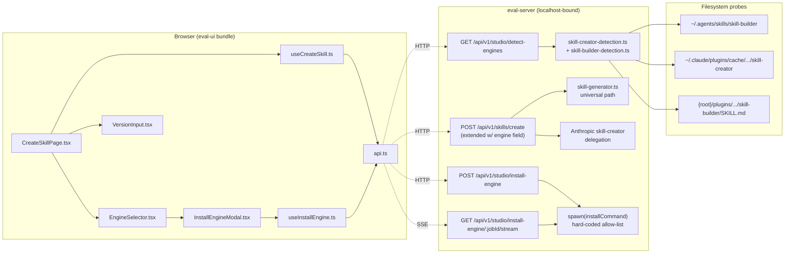
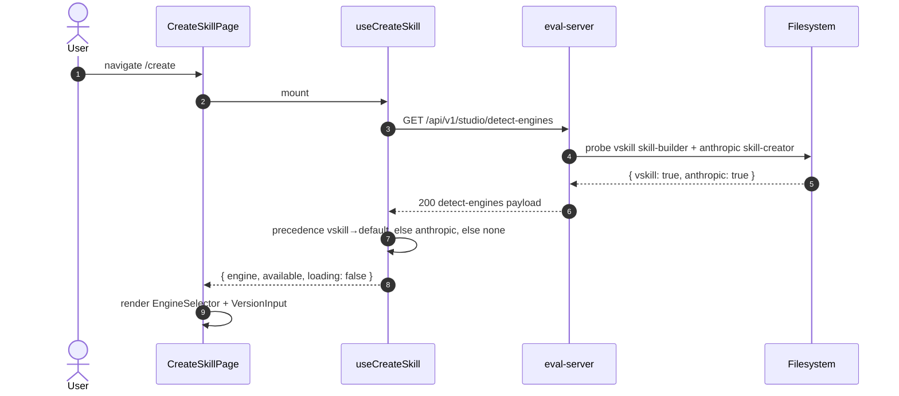
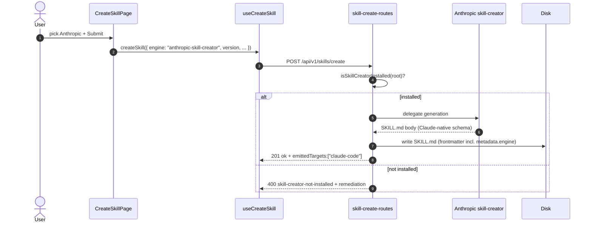
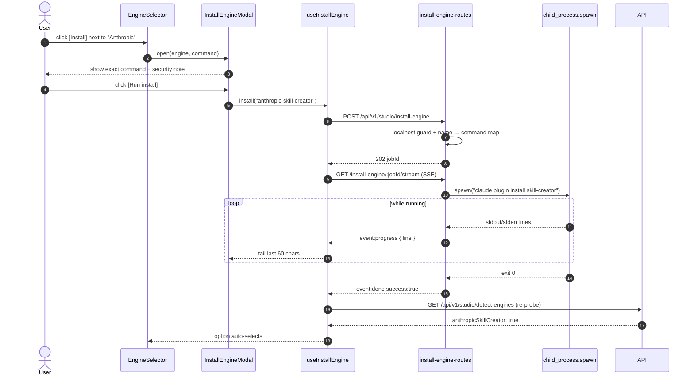
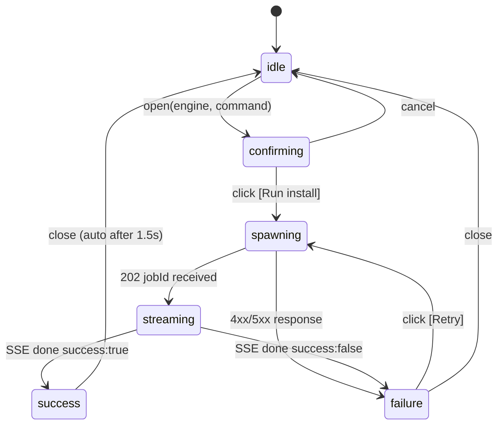

# Architecture & Implementation Plan

## Context & Goals

The Studio "create skill" page exposes **no** engine selector and **no** version input today. The backend silently uses the universal vskill generator and hard-codes `version: "1.0.0"`. Two real authoring engines exist:

- **VSkill `skill-builder`** (`plugins/skills/skills/skill-builder/SKILL.md`, version 0.1.0, shipped by 0670) — emits cross-universal skills across 8 universal targets (Claude, Codex, Cursor, Cline, Gemini CLI, OpenCode, Kimi, Amp). Constrains output to the common-denominator schema.
- **Anthropic `skill-creator`** plugin — first-class Claude-native authoring engine with a richer Claude-only schema. More expressive on Claude, but not portable.

This increment makes the choice **explicit** with a tri-state radio (`vskill | anthropic-skill-creator | none`), adds a per-skill semver input, and offers one-click engine install with consent for engines the user hasn't installed yet.

**Anthropic is first-class, not a fallback.** The two engines represent a deliberate trade-off (richer Claude-native vs. portable cross-tool). The selector treats them as peers; default precedence (VSkill first) is a sensible default tied to "what's already in the workspace", not a quality signal.

For full user-story-level acceptance criteria, see `spec.md`. This plan focuses on **how** we deliver the surface area without rewriting the existing 54 KB `CreateSkillPage.tsx`.

## Component Diagram



## Sequence Diagrams

### Page load → detect → render selector with default precedence



### Submit create with engine="anthropic-skill-creator"



### Install missing engine flow with consent + SSE



## Module Layout

### vskill (primary)

```
src/
├── utils/
│   ├── skill-creator-detection.ts            # existing — no change
│   └── skill-builder-detection.ts            # NEW — mirrors creator detection
├── eval-server/
│   ├── eval-server.ts                        # registerInstallEngineRoutes + detect-engines wiring
│   ├── skill-create-routes.ts                # extend CreateSkillRequest, branch on engine, persist metadata.engine
│   ├── install-engine-routes.ts              # NEW — POST install + SSE stream + allow-list + localhost guard
│   ├── detect-engines-route.ts               # NEW — GET /api/v1/studio/detect-engines
│   └── sse-helpers.ts                        # existing — reused for progress/done events
└── eval-ui/src/
    ├── pages/
    │   └── CreateSkillPage.tsx               # mount EngineSelector + VersionInput; thread engine/version through submit
    ├── components/
    │   ├── EngineSelector.tsx                # NEW — tri-state radio, tooltips, [Install] affordance
    │   ├── InstallEngineModal.tsx            # NEW — consent modal + live tail + retry
    │   ├── VersionInput.tsx                  # NEW — semver text input w/ validation
    │   └── VersionBadge.tsx                  # existing — read-only display, untouched
    ├── hooks/
    │   ├── useCreateSkill.ts                 # add engine + version to form state, fetch detect-engines
    │   └── useInstallEngine.ts               # NEW — POST + SSE consumption, exposes status/progress/retry
    └── api.ts                                # add detectEngines, installEngine, streamInstallProgress
```

### vskill-platform (read-only reuse)

| File | Use |
|---|---|
| `src/lib/integrity/semver.ts` | `isValidSemver()` for client-side validation (US-004) |
| `src/lib/frontmatter-parser.ts` | `parseFrontmatter()` for reading `metadata.version` from skill-builder SKILL.md (US-001) |

### Tests

```
src/
├── utils/__tests__/skill-builder-detection.test.ts          # unit
├── eval-server/__tests__/
│   ├── detect-engines.test.ts                                # integration
│   ├── skill-create-routes-engine.test.ts                    # integration (3 engine branches + failure)
│   └── install-engine-routes.test.ts                         # integration (success/non-zero/timeout/unknown/non-localhost)
└── eval-ui/src/
    ├── components/__tests__/
    │   ├── EngineSelector.test.tsx                           # component
    │   ├── InstallEngineModal.test.tsx                       # component
    │   └── VersionInput.test.tsx                             # component
    └── hooks/__tests__/
        ├── useCreateSkill.test.ts                            # hook (extend)
        └── useInstallEngine.test.ts                          # hook
tests/e2e/studio-create-skill-engine.spec.ts                  # Playwright
```

## API Contracts

### `GET /api/v1/studio/detect-engines`

**Request**: no body, no params.

**Response 200**:

```json
{
  "vskillSkillBuilder": true,
  "anthropicSkillCreator": true,
  "vskillVersion": "0.1.0",
  "anthropicPath": "/Users/<u>/.claude/plugins/cache/anthropic/skill-creator"
}
```

`vskillVersion` is `null` when `vskillSkillBuilder=false` or the SKILL.md has no parseable version. `anthropicPath` is `null` when `anthropicSkillCreator=false`.

### `POST /api/v1/skills/create` — extended

**Request** (additive — existing fields unchanged; see `CreateSkillRequest` lines 46–87):

```json
{
  "name": "sql-formatter",
  "plugin": "data",
  "layout": 2,
  "description": "Formats SQL queries.",
  "model": "sonnet",
  "version": "1.0.0",
  "engine": "vskill",
  "body": "...",
  "evals": [],
  "aiMeta": {}
}
```

`engine` accepts `"vskill" | "anthropic-skill-creator" | "none"` (default `"vskill"`).

**Response 201** (create) / **200** (update):

```json
{
  "ok": true,
  "plugin": "data",
  "skill": "sql-formatter",
  "dir": "/.../plugins/data/skills/sql-formatter",
  "skillMdPath": "/.../SKILL.md",
  "version": "1.0.0",
  "engine": "vskill",
  "emittedTargets": ["claude-code", "codex", "cursor", "cline", "gemini-cli", "opencode", "kimi", "amp"],
  "updated": false
}
```

For `engine="anthropic-skill-creator"`, `emittedTargets` is `["claude-code"]`.

**Response 400** when `engine="anthropic-skill-creator"` and not installed:

```json
{
  "error": "skill-creator-not-installed",
  "remediation": "claude plugin install skill-creator"
}
```

### `POST /api/v1/studio/install-engine`

**Request**:

```json
{ "engine": "anthropic-skill-creator" }
```

`engine` ∈ `{ "vskill" | "anthropic-skill-creator" }`.

**Response 202**:

```json
{ "jobId": "9c3f2b91-7e4d-4a..." }
```

**Response 400** for unknown engine: `{ "error": "unknown-engine" }`.
**Response 403** when `req.socket.remoteAddress` is not loopback: `{ "error": "forbidden" }`.
**Response 412** when prerequisite CLI is missing (e.g. `claude` not on PATH): `{ "error": "claude-cli-missing", "remediation": "Install Claude Code CLI first: https://docs.claude.com/claude-code" }`.

### `GET /api/v1/studio/install-engine/:jobId/stream` (SSE)

**Headers**: `Content-Type: text/event-stream`, `Cache-Control: no-cache`, `Connection: keep-alive` (reused from `sse-helpers.ts:initSSE`).

**Events**:

```
event: progress
data: {"line":"installing skill-creator@1.2.3","stream":"stdout"}

event: progress
data: {"line":"resolving dependencies...","stream":"stdout"}

event: done
data: {"success":true,"exitCode":0,"stderr":""}
```

Failure / timeout examples:

```
event: done
data: {"success":false,"exitCode":1,"stderr":"E404 Not Found"}

event: done
data: {"success":false,"exitCode":-1,"stderr":"timeout"}
```

Stream closes after `done`. Hard timeout: 120s.

## Security Model

The install endpoint runs shell commands on the user's machine. Three guards apply, defense-in-depth:

1. **Hard-coded engine→command allow-list** (server-side, never derived from request body):

   ```ts
   const INSTALL_COMMANDS = {
     "vskill": ["vskill", ["install", "anton-abyzov/vskill/plugins/skills/skills/skill-builder"]],
     "anthropic-skill-creator": ["claude", ["plugin", "install", "skill-creator"]],
   } as const;
   ```

   The HTTP request body carries only the **engine name**. The server maps name → `[command, args[]]`. **No user input ever passes to the shell.** `child_process.spawn` is called with `shell: false` so even `args` are not shell-interpreted. This eliminates the entire shell-injection surface.

2. **Localhost-only guard** on every install endpoint:

   ```ts
   const ip = req.socket.remoteAddress;
   if (ip !== "127.0.0.1" && ip !== "::1" && ip !== "::ffff:127.0.0.1") {
     return sendJson(res, { error: "forbidden" }, 403, req);
   }
   ```

   The eval-server already binds to localhost by default, but this assertion is belt-and-suspenders against accidental future config changes that would expose the server (e.g. `--host 0.0.0.0`).

3. **Confirm-before-run modal** (UX guard):

   `InstallEngineModal` renders the *exact* command (`claude plugin install skill-creator` or `vskill install ...`) and a security note (`"This runs the command in your terminal as your user. Inspect before approving."`) before any spawn. The modal cannot proceed without an explicit click on `[Run install]`. This is non-negotiable per AC-US5-04.

### Residual risks (out of scope, accepted)

- **Trusted CLIs**: `claude` and `vskill` themselves are trusted binaries. If either has its own command-injection vulnerability, this endpoint inherits it. Out of scope — those are external dependencies.
- **Filesystem side-effects**: `vskill install` writes to `~/.agents/skills/...`; `claude plugin install` writes to `~/.claude/plugins/...`. Standard for these tools, expected.
- **Race conditions**: A user could click `[Install]` twice. The hook MUST disable the button while a job is in flight (UI guard). The server allows duplicate concurrent installs; the underlying CLIs are idempotent.
- **PATH hijacking**: If a malicious binary named `claude` or `vskill` is earlier on PATH, that runs instead. Treated as a system-level threat the OS owns; we do not sanitize PATH.

## State Machine — `InstallEngineModal`



`success` triggers a re-fetch of `/api/v1/studio/detect-engines`; the just-installed engine becomes the auto-selected option in `EngineSelector` if the user had it pre-selected during the missing-state UX.

## ADRs to Author

Two new ADRs land alongside this plan in `.specweave/docs/internal/architecture/adr/`:

- **ADR 0734-01 — First-class engine selector with auto-install**. Captures the decision that Anthropic's `skill-creator` is treated as a peer engine (not a fallback), why VSkill is the precedence default (cross-universal, ships with the workspace), and the consent-gated install model.
- **ADR 0734-02 — SSE for short-lived install progress**. Captures why SSE was chosen over WebSocket and over polling for the install-progress channel: install is short-lived (<120s), one-way (server → client), works on the existing HTTP server without a new dependency, and reuses the existing `sse-helpers.ts` primitives already used by the model-compare and improve flows.

## Risks & Mitigations

| Risk | Likelihood | Impact | Mitigation |
|---|---|---|---|
| User clicks `[Install]` for an engine whose CLI isn't on PATH | Medium | Medium | Pre-flight check returns `412` with remediation pointing at the CLI install docs. Modal surfaces the remediation message; no half-spawned process. |
| `claude plugin install skill-creator` succeeds but detection still returns `false` (path drift) | Low | Medium | After every successful install, re-run detection; on still-false, surface a "verify install" hint with the path skill-creator-detection probes. |
| SSE stream held open by client that goes away (tab close) | Medium | Low | Server detaches the spawn from the SSE stream after `done`; spawn timer continues to enforce 120s timeout regardless of client. Client reconnect is not supported (one-shot job). |
| Bundle size grows past gate | Low | Low | Three small components (~3 KB each gzipped) + one modal. See "Performance & Bundle"; budget allows. |
| Drift between CLI `--engine` flag and HTTP `engine` body field | Medium | Medium | Plan calls out parity check; tests assert both surfaces accept the same set of values. |
| Submit with `engine="anthropic-skill-creator"` while the install is still streaming | Low | Low | UI gates Submit on `engine ∈ availableEngines`; `availableEngines` only updates after detection re-fetch. |
| Engine field added but old skills don't have it (update mode) | Low | Low | `engine` defaults to `"vskill"` when missing — forward-only, no migration. |

## Test Strategy

Each AC from `spec.md` maps to at least one test. Coverage targets: unit 95%, integration 90%, component ~90%, E2E 100% of AC scenarios.

| AC | Test File | Type |
|---|---|---|
| AC-US1-01..05 | `src/eval-server/__tests__/detect-engines.test.ts` | integration |
| AC-US1-06 | `src/utils/__tests__/skill-builder-detection.test.ts` + `detect-engines.test.ts` (4 fs cases) | unit + integration |
| AC-US2-01..05, AC-US2-07 | `src/eval-ui/src/components/__tests__/EngineSelector.test.tsx` | component |
| AC-US2-06 | `tests/e2e/studio-create-skill-engine.spec.ts` (data-testid presence) | E2E |
| AC-US3-01..04 | `src/eval-server/__tests__/skill-create-routes-engine.test.ts` | integration |
| AC-US3-05 | `src/eval-server/__tests__/skill-create-routes-engine.test.ts` (failure branch) | integration |
| AC-US3-06 | `src/eval-server/__tests__/skill-create-routes-engine.test.ts` (frontmatter assertion) | integration |
| AC-US4-01..03, AC-US4-05 | `src/eval-ui/src/components/__tests__/VersionInput.test.tsx` | component |
| AC-US4-04, AC-US4-06 | `src/eval-ui/src/hooks/__tests__/useCreateSkill.test.ts` | hook |
| AC-US4-07 | `src/eval-ui/src/components/__tests__/VersionInput.test.tsx` (mode=update branch) | component |
| AC-US5-01..03 | `src/eval-server/__tests__/install-engine-routes.test.ts` | integration |
| AC-US5-04, AC-US5-05 | `src/eval-ui/src/components/__tests__/InstallEngineModal.test.tsx` | component |
| AC-US5-06 | `src/eval-ui/src/hooks/__tests__/useInstallEngine.test.ts` | hook |
| AC-US5-07, AC-US5-08 | `install-engine-routes.test.ts` (allow-list + non-localhost) | integration |
| AC-US5-09 | `install-engine-routes.test.ts` (6 sub-cases: success, non-zero, timeout, unknown engine, non-localhost, missing prerequisite CLI → 412) | integration |
| AC-US5-10 | `EngineSelector.test.tsx` (full flow) | component |
| AC-US6-01 | CI gate — `npm run build:eval-ui` | build |
| AC-US6-02 | `tests/e2e/studio-create-skill-engine.spec.ts` (smoke) | E2E |
| AC-US6-03..04 | `sw:release-npm` orchestration log | release-gate |

ESM mocking convention: `vi.hoisted()` + `vi.mock()` for every `child_process` and `fs` mock.

## Performance & Bundle

The eval-ui bundle today is the dominant artifact (Studio is desktop-only, served as a single SPA). Adding three components plus one modal estimates as follows:

| File | Estimated gzipped delta |
|---|---|
| `EngineSelector.tsx` | ~3 KB |
| `InstallEngineModal.tsx` | ~3 KB |
| `VersionInput.tsx` | ~1.5 KB |
| `useInstallEngine.ts` | ~1 KB |
| `useCreateSkill.ts` (additive) | ~1 KB |
| `api.ts` (additive endpoints) | ~0.5 KB |
| **Total** | **~10 KB gzip** |

Gate: **must not exceed +50 KB gzip** on the eval-ui bundle. Measured via `npm run build:eval-ui` then `gzip-size dist/eval-ui/assets/*.js`. Recorded in the closure log.

No new third-party dependency. SSE consumption uses the browser-native `EventSource`. No UI library beyond what `CreateSkillPage.tsx` already uses (`role="tablist"` pattern at lines 340–373).

## Verification

1. **Unit / integration**: `npx vitest run` green for all new files.
2. **Component**: all three default-precedence branches in `EngineSelector.test.tsx` (vskill+anthropic, anthropic-only, neither).
3. **Manual smoke**:
   - `npm run build:eval-ui` succeeds.
   - `vskill studio` launches and serves `/create`.
   - With `~/.claude/skills/skill-creator/` only → Anthropic pre-checked, VSkill greyed.
   - With workspace `plugins/skills/skills/skill-builder/SKILL.md` → VSkill pre-checked.
   - Submit `engine="anthropic-skill-creator"` while uninstalled → 400 + remediation.
   - Click `[Install]` → modal → run → SSE tail → success → option auto-selects.
4. **E2E**: `npx playwright test tests/e2e/studio-create-skill-engine.spec.ts`.
5. **Release gate**: `sw:release-npm` patch-bumps `vskill`, npm publish lands, GH release tagged, umbrella sync commit lands on main.
